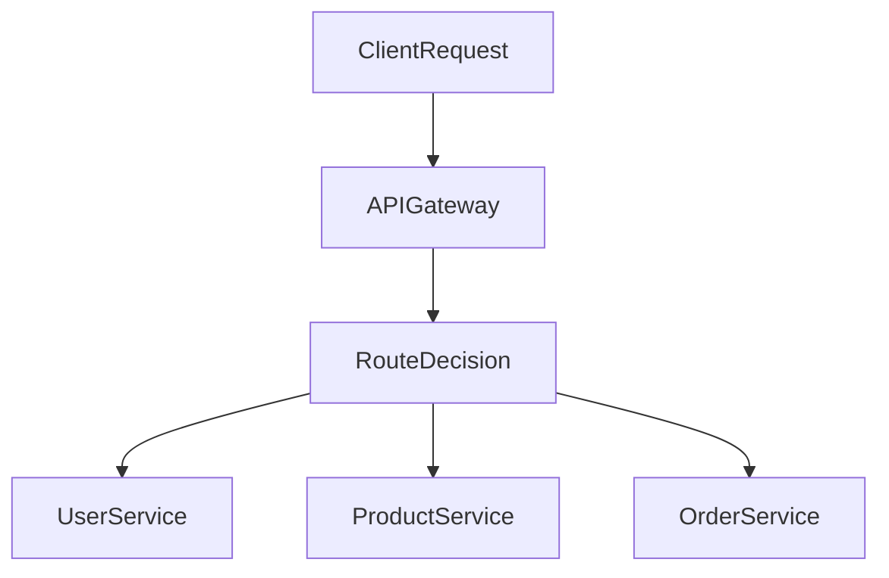
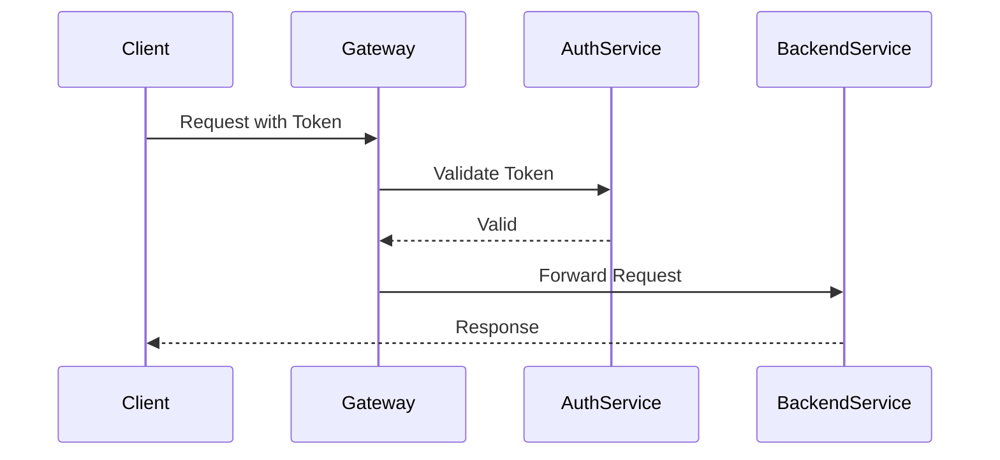
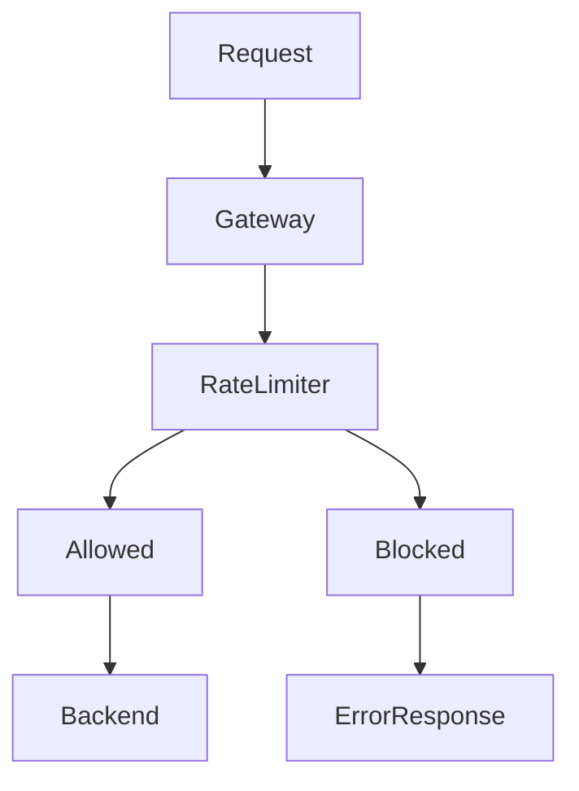
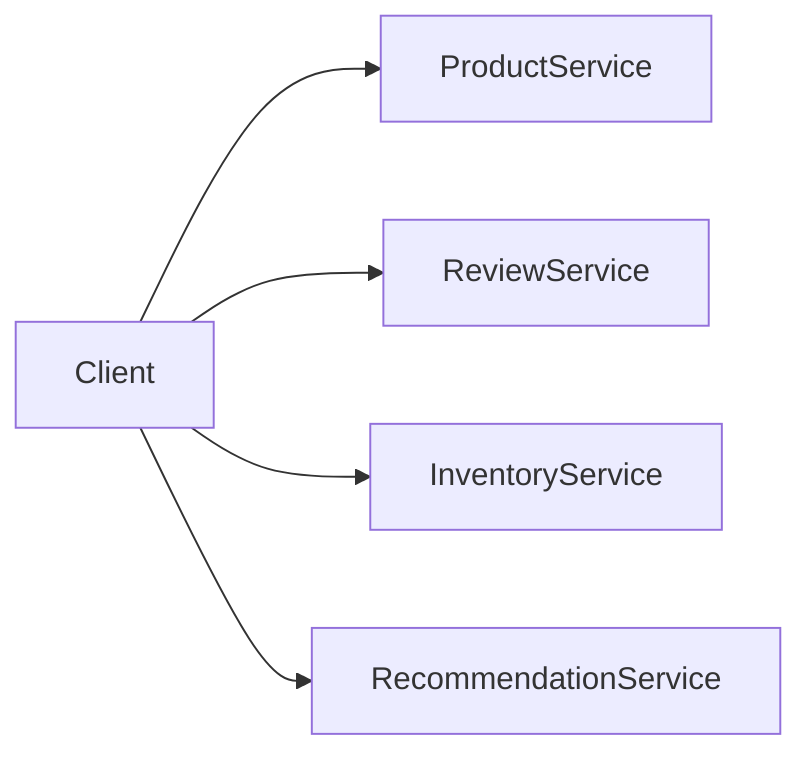
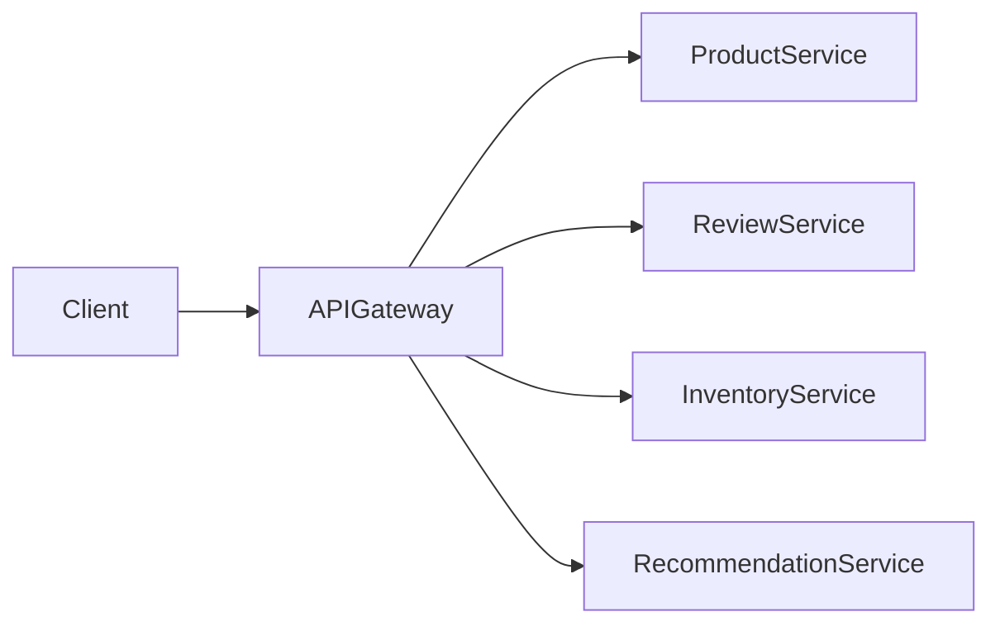
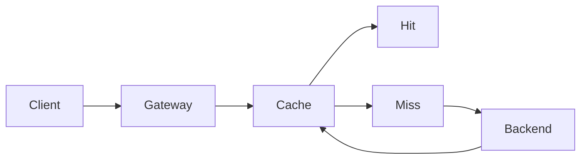
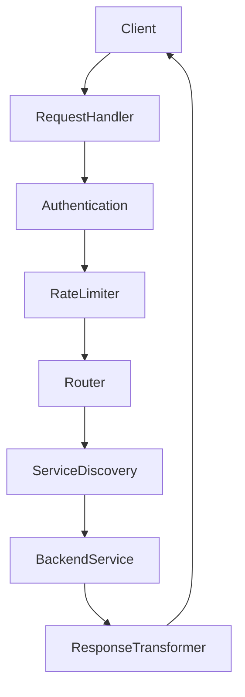
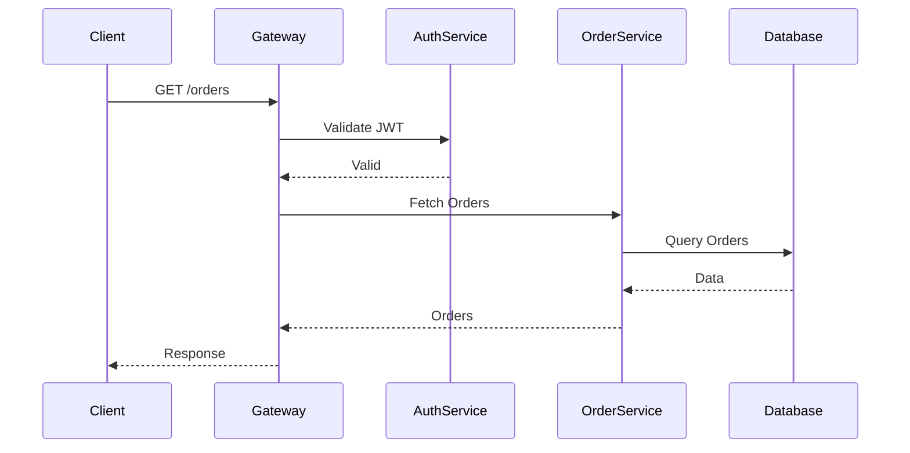
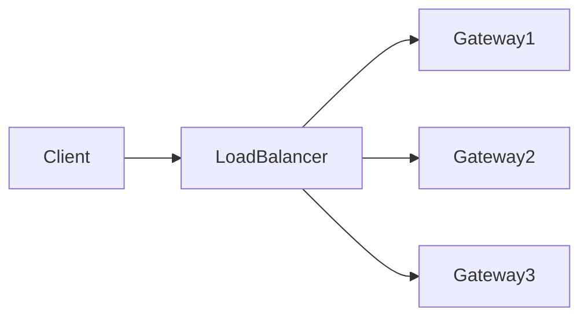

# API Gateway

Modern applications rarely consist of a single monolithic backend. Instead, they are typically built using **microservices**, where each service is responsible for a specific piece of functionality such as authentication, payments, notifications, or product catalog.

While this architecture improves scalability and maintainability, it introduces a new challenge: **how should clients interact with dozens or even hundreds of backend services?**

This is where the **API Gateway** becomes essential.

An **API Gateway** acts as a **single entry point** for all client requests. Instead of clients communicating with multiple services directly, they communicate with the API Gateway, which then routes the requests to the appropriate backend services.

In simple terms:

> An API Gateway is like the **front desk of a hotel**.  
> Guests (clients) don’t go directly to housekeeping, maintenance, or room service. They go to the front desk, which coordinates everything internally.

---

# The Problem Without an API Gateway

Consider a typical microservices-based application.

Example services:

- User Service
- Product Service
- Order Service
- Payment Service
- Notification Service

If clients communicate **directly** with these services:

- They must know **all service locations**
- They must handle **multiple authentication mechanisms**
- They must deal with **network failures**
- They must manage **service discovery**

### Architecture Without API Gateway

```mermaid
flowchart LR
    Client --> UserService
    Client --> ProductService
    Client --> OrderService
    Client --> PaymentService
    Client --> NotificationService
````

### Problems

| Problem                 | Explanation                                 |
| ----------------------- | ------------------------------------------- |
| Tight coupling          | Clients must know each service              |
| Complex client logic    | Each client handles retries, authentication |
| Security risks          | Every service exposed publicly              |
| Hard version management | Multiple APIs exposed                       |
| Increased latency       | Multiple round trips                        |

This architecture becomes difficult to maintain as the system grows.

---

# API Gateway Solution

An **API Gateway** sits between clients and backend services.

Clients send **all requests to the gateway**, and the gateway handles routing, authentication, and request orchestration.

### Architecture With API Gateway

```mermaid
flowchart LR
    Client --> APIGateway
    APIGateway --> UserService
    APIGateway --> ProductService
    APIGateway --> OrderService
    APIGateway --> PaymentService
    APIGateway --> NotificationService
```

### Benefits

| Benefit                    | Explanation                       |
| -------------------------- | --------------------------------- |
| Single entry point         | Clients talk to only one endpoint |
| Security                   | Backend services remain private   |
| Centralized authentication | Gateway validates requests        |
| Simplified clients         | Clients send simple requests      |
| Observability              | Easier logging and monitoring     |

---

# Core Responsibilities of an API Gateway

An API Gateway performs multiple responsibilities.

## 1 Request Routing

The gateway determines **which backend service should handle the request**.

Example:

| Endpoint      | Routed To       |
| ------------- | --------------- |
| `/users/*`    | User Service    |
| `/products/*` | Product Service |
| `/orders/*`   | Order Service   |

### Routing Flow



---

## 2 Authentication and Authorization

The gateway verifies client identity before forwarding requests.

Common mechanisms:

* API keys
* OAuth tokens
* JWT tokens
* Session cookies

### Authentication Flow



Centralizing authentication prevents **every service from implementing its own security logic**.

---

## 3 Rate Limiting

Rate limiting protects systems from **abuse or overload**.

Example policy:

| Client       | Limit             |
| ------------ | ----------------- |
| Free user    | 100 requests/min  |
| Premium user | 1000 requests/min |

### Rate Limiting Flow



Benefits:

* Prevents DDoS attacks
* Controls traffic spikes
* Protects backend services

---

## 4 Request Aggregation

Sometimes a single user request requires **data from multiple services**.

Example: Loading a product page may require:

* Product details
* Inventory data
* Reviews
* Recommendations

Without a gateway, the client would call each service individually.

### Without Aggregation



### With Aggregation



The gateway collects responses and returns **one combined response**.

---

## 5 Response Transformation

Different clients may require **different data formats**.

Example clients:

* Web application
* Mobile application
* IoT devices

The gateway can modify responses:

| Client | Required Data      |
| ------ | ------------------ |
| Mobile | Minimal JSON       |
| Web    | Full JSON          |
| IoT    | Compressed payload |

---

## 6 Caching

The gateway can cache frequently requested responses.

Example:

* Product catalog
* Public data
* Configuration endpoints

### Caching Architecture



Benefits:

* Reduced latency
* Reduced backend load
* Improved scalability

---

# Internal Architecture of an API Gateway

An API Gateway usually consists of several internal modules.



### Components

| Component            | Purpose                  |
| -------------------- | ------------------------ |
| Request Handler      | Accept incoming requests |
| Authentication       | Verify identity          |
| Rate Limiter         | Control traffic          |
| Router               | Decide target service    |
| Service Discovery    | Locate service instances |
| Response Transformer | Modify response          |

---

# Example Request Flow

Let’s examine a typical request lifecycle.

### Scenario

User fetches order history.

### Request Flow



Steps:

1. Client sends request.
2. Gateway authenticates request.
3. Gateway routes to correct service.
4. Service queries database.
5. Response flows back through gateway.

---

# Scaling API Gateways

API Gateways themselves must be scalable.

### Horizontal Scaling



Benefits:

* High availability
* Load distribution
* Fault tolerance

---

# Real-World Systems That Use API Gateways

Many large technology companies rely heavily on API Gateways.

### Example Systems

| Company | Gateway Usage                                |
| ------- | -------------------------------------------- |
| Netflix | Handles client-specific APIs                 |
| Amazon  | Uses API Gateway for serverless architecture |
| Uber    | Routes billions of API calls daily           |
| Stripe  | Secure API gateway for financial services    |

These systems process **millions or billions of requests** through gateways.

---

# Popular API Gateway Technologies

Some widely used API Gateway platforms include:

| Gateway            | Type                     |
| ------------------ | ------------------------ |
| Kong               | Open-source gateway      |
| NGINX              | High-performance gateway |
| Envoy Proxy        | Cloud-native gateway     |
| Amazon API Gateway | Managed gateway          |

---

# Trade-offs of API Gateways

While API Gateways provide many advantages, they introduce some challenges.

| Trade-off               | Explanation                     |
| ----------------------- | ------------------------------- |
| Single point of failure | If gateway fails, all APIs fail |
| Increased latency       | Additional network hop          |
| Operational complexity  | Requires monitoring and scaling |
| Potential bottleneck    | High traffic concentration      |

These risks are mitigated through **replication, load balancing, and observability tools**.

---

# Best Practices

### Keep the Gateway Lightweight

Avoid placing **complex business logic** in the gateway.

The gateway should focus on:

* routing
* security
* rate limiting
* transformations

---

### Use Service Discovery

Instead of hardcoding service addresses, integrate with discovery systems.

Example technologies:

* Consul
* etcd

---

### Implement Observability

Track:

* request latency
* error rates
* traffic volume

Monitoring tools commonly used:

* Prometheus
* Grafana

---

# Summary

An **API Gateway** is a fundamental component in modern distributed architectures.

It provides:

* a **single entry point** for clients
* centralized **authentication and security**
* intelligent **request routing**
* **rate limiting and caching**
* **request aggregation and transformation**

By simplifying client interactions and centralizing cross-cutting concerns, API Gateways make complex distributed systems **more manageable, scalable, and secure**.

In large-scale architectures, the API Gateway acts as the **front door of the entire backend infrastructure**, ensuring every request is handled safely and efficiently.