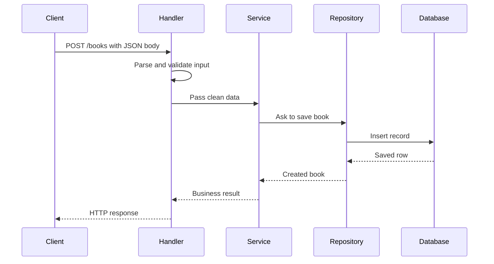
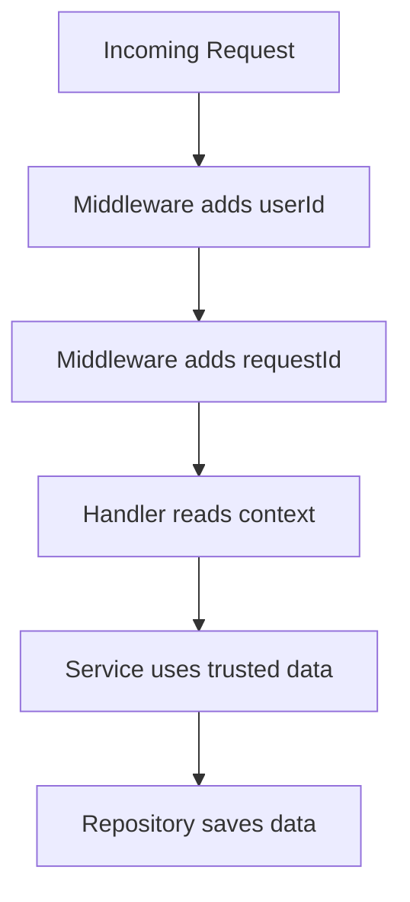

# Request Lifecycle, Handler-Service-Repository, Middleware, and Context

When a user clicks a button in an app, a lot happens behind the scenes.

A single action like:

- creating a post
- logging in
- fetching a list of books
- updating a profile

turns into an **API request** that travels through several layers of the backend before a response is sent back.

A well-designed backend does not handle everything in one giant function.  
Instead, it splits responsibilities into separate layers so the system becomes:

- easier to understand
- easier to test
- easier to scale
- easier to debug
- easier to maintain

The most common pattern for this is:

| Layer | Main Job |
|---|---|
| Handler | Deals with HTTP |
| Service | Handles business logic |
| Repository | Talks to the database |

Along the way, **middlewares** handle cross-cutting concerns like authentication, logging, and rate limiting, while the **request context** acts like a shared backpack for the current request.

---

# 1. Introduction: From Your Screen to the Server's Heart

Every time a user interacts with an app, they are sending a message to the server.

That message might be:

- “follow this user”
- “buy this item”
- “save this note”
- “delete this comment”

This message enters the backend as an **HTTP request**.

Think of the backend as a large building:

- the **front desk** greets the visitor
- the **security desk** checks identity
- the **office staff** performs the actual work
- the **storage room** accesses records
- the **reception desk** sends the reply

That is the same flow as a backend request.

---

# 2. Why One Big Function Is a Bad Idea

It is technically possible to write everything in one function.

That function could:

- read the request
- validate the input
- authenticate the user
- query the database
- send email notifications
- format the response
- handle errors

But this quickly becomes a mess.

## Problems with one giant function

| Problem | Why it hurts |
|---|---|
| Hard to read | Too many responsibilities in one place |
| Hard to test | Small changes affect everything |
| Hard to reuse | Logic becomes tightly coupled |
| Hard to debug | Failures are buried inside huge code |
| Hard to scale | New features make the function worse |

### Analogy

It is like asking one person to be:

- receptionist
- lawyer
- accountant
- cook
- security guard

That person would be overwhelmed, and the organization would become chaotic.

Backend systems work better when each layer has a clear role.

---

# 3. The Core Trio: Handler, Service, Repository

These three layers form the backbone of many backend applications.

```mermaid
flowchart TD
    A[Client Request] --> B[Handler]
    B --> C[Service]
    C --> D[Repository]
    D --> E[Database]
    E --> D
    D --> C
    C --> B
    B --> F[HTTP Response]
````

---

## 3.1 The Handler: The Front Desk Agent

The Handler is the first layer that deals with the request.

Sometimes it is called a **Controller**.

Its job is to handle everything related to the web layer and HTTP.

### The handler is responsible for:

| Responsibility            | Meaning                                    |
| ------------------------- | ------------------------------------------ |
| Binding / Deserialization | Convert incoming JSON into a usable object |
| Validation                | Check whether input is correct             |
| Transformation            | Clean or reshape incoming data             |
| Dispatching               | Pass clean data to the service             |
| Response formatting       | Return the final HTTP response             |

---

## 3.1.1 Data unpacking and translation

The request often arrives as JSON.

Example:

```json
{
  "title": "Backend Design",
  "author": "Alice"
}
```

The handler converts this into a native structure that the backend can work with.

### Analogy

This is like receiving a package with labels in a foreign language and translating it into your own language before using it.

If the JSON is malformed, the handler should stop immediately and return:

```text
400 Bad Request
```

---

## 3.1.2 Validation and transformation

Once the data is parsed, the handler checks whether it is valid.

Example:

* `title` must be a string
* `author` must not be empty
* `page` should default to `1` if not provided
* `sort` should default to `"date"` if missing

### Why this belongs here

The handler is the entry point of the request.

This is the best place to:

* reject bad input early
* normalize values
* prepare clean data for the service

---

## 3.1.3 Dispatching and responding

After validation, the handler sends the request to the service.

Then, when the service returns the result, the handler:

* decides the HTTP status code
* formats the response
* sends it back to the client

### Example response choices

| Situation          | HTTP Status               |
| ------------------ | ------------------------- |
| Request successful | 200 OK                    |
| Resource created   | 201 Created               |
| Bad input          | 400 Bad Request           |
| Unauthorized       | 401 Unauthorized          |
| Forbidden          | 403 Forbidden             |
| Not found          | 404 Not Found             |
| Server failure     | 500 Internal Server Error |

---

## Example Handler in JavaScript

```javascript
app.post("/books", async (req, res) => {
  const { title, author } = req.body;

  if (typeof title !== "string" || typeof author !== "string") {
    return res.status(400).json({
      message: "Validation failed",
      errors: [
        {
          field: "title or author",
          message: "title and author must be strings",
        },
      ],
    });
  }

  try {
    const book = await bookService.createBook({
      title,
      author,
    });

    return res.status(201).json({
      message: "Book created successfully",
      data: book,
    });
  } catch (error) {
    return res.status(500).json({
      message: "Internal server error",
    });
  }
});
```

---

## 3.2 The Service: The Brains of the Operation

The Service layer contains the business logic.

This is where the actual application rules live.

### The service should know nothing about HTTP

That means:

* no request object
* no response object
* no status codes
* no headers
* no cookies
* no route details

The service should only care about:

* clean input
* business rules
* workflow orchestration
* output data

### Why this matters

If your service depends on HTTP, it becomes tied to the web layer.

That makes it harder to:

* reuse in other places
* test independently
* move to another interface later, such as CLI, cron job, or queue consumer

---

## What the service does

A service method may:

* call the repository
* combine multiple results
* apply business rules
* call external APIs
* trigger notifications
* create audit events

### Example

A `createOrder` service might:

1. check whether the cart is valid
2. calculate tax
3. save the order
4. reduce inventory
5. send confirmation email

That is business logic, not HTTP logic.

---

## Analogy

If the handler is the receptionist, the service is the manager who actually makes decisions and gets work done.

The receptionist does not decide company policy.
The manager does.

---

## Example Service in JavaScript

```javascript
class BookService {
  constructor(bookRepository) {
    this.bookRepository = bookRepository;
  }

  async createBook(input) {
    const existing = await this.bookRepository.findByTitle(input.title);

    if (existing) {
      throw new Error("Book already exists");
    }

    const bookToSave = {
      title: input.title.trim(),
      author: input.author.trim(),
      createdAt: new Date(),
    };

    return await this.bookRepository.create(bookToSave);
  }
}
```

Notice that this service does not know anything about `req`, `res`, or HTTP status codes.

---

## 3.3 The Repository: The Database Librarian

The Repository is the database access layer.

Its job is simple:

* talk to the database
* run queries
* return raw data
* hide database complexity from the service

### What the repository should do

| Responsibility | Meaning                               |
| -------------- | ------------------------------------- |
| Create queries | Build the correct database operations |
| Fetch data     | Read records from the database        |
| Write data     | Insert or update records              |
| Delete data    | Remove records                        |
| Return results | Give raw data back to the service     |

---

## Why use a repository

Without a repository, database code spreads everywhere.

That creates problems:

* duplicate queries
* hard-to-maintain code
* repeated SQL logic
* inconsistent access patterns

The repository keeps all database-specific logic in one place.

---

## Analogy

The repository is like a librarian.

You do not walk into a library and inspect every shelf yourself.

You ask the librarian:

* “Find this book”
* “Get me all books by this author”
* “Add this new record”

The librarian knows exactly where everything is stored.

---

## Example Repository in JavaScript

```javascript
class BookRepository {
  constructor(db) {
    this.db = db;
  }

  async findAll() {
    return await this.db.book.findMany();
  }

  async findById(id) {
    return await this.db.book.findUnique({
      where: { id },
    });
  }

  async findByTitle(title) {
    return await this.db.book.findFirst({
      where: { title },
    });
  }

  async create(data) {
    return await this.db.book.create({
      data,
    });
  }
}
```

Each method has one focused job.

That is exactly how a repository should be designed.

---

# 4. The Trio in Action

Let us trace a request from start to finish.

Imagine a user wants to create a book.

## Full request flow



---

## Step-by-step walkthrough

### Step 1: Client sends request

The user sends data from the app.

```json
{
  "title": "System Design Basics",
  "author": "Jane"
}
```

### Step 2: Handler receives it

The handler:

* parses JSON
* validates the fields
* applies defaults if needed

### Step 3: Service processes it

The service:

* checks business rules
* prepares clean data
* decides what should happen next

### Step 4: Repository saves it

The repository:

* creates the database query
* stores the record
* returns the saved object

### Step 5: Handler returns response

The handler formats the final response:

```json
{
  "message": "Book created successfully"
}
```

---

# 5. Why This Pattern Is So Powerful

This pattern is popular because each layer has a single responsibility.

## Benefits

| Benefit                | Why it helps                                  |
| ---------------------- | --------------------------------------------- |
| Separation of concerns | Each part does one thing well                 |
| Easier testing         | Service logic can be tested without HTTP      |
| Easier maintenance     | Changes stay local                            |
| Better readability     | Code is easier to understand                  |
| Reusability            | Service logic can be reused in other contexts |
| Scalability            | Large systems stay organized                  |

---

# 6. Middlewares: The Helpers on the Highway

Middlewares are functions that run during the request lifecycle.

They are usually used for cross-cutting concerns.

## Cross-cutting concerns

These are tasks that apply across many routes:

* authentication
* logging
* rate limiting
* CORS
* request tracing
* error handling

Instead of writing these repeatedly inside every handler, use middleware.

---

## Analogy

A request is like a person passing through a building.

Along the way, there are checkpoints:

* security checkpoint
* visitor log desk
* badge scanner
* exit checkpoint

Each checkpoint does a small task and passes the visitor along.

That is middleware.

---

## Middleware chain


Each middleware can:

* modify the request
* modify the response
* stop the request
* pass control forward using `next()`

---

# 7. Why Use Middlewares?

Middlewares keep your handlers clean by removing repeated code.

## Common examples

| Middleware Type | Purpose                          |
| --------------- | -------------------------------- |
| Authentication  | Verify token or session          |
| Logging         | Record request details           |
| Rate limiting   | Prevent abuse                    |
| CORS            | Allow safe cross-origin requests |
| Error handling  | Format failures consistently     |
| Parsing         | Convert request body into JSON   |

---

## 7.1 Authentication middleware

This middleware checks whether the user is allowed to enter.

### Example

```javascript
function authMiddleware(req, res, next) {
  const token = req.headers.authorization;

  if (!token) {
    return res.status(401).json({
      message: "Unauthorized",
    });
  }

  req.user = {
    id: "user_123",
  };

  next();
}
```

If the token is invalid, the request stops immediately.

### Why this is efficient

There is no need to:

* query the database
* run business logic
* load heavy resources

The request is rejected early.

---

## 7.2 Logging middleware

Logging middleware captures useful information.

```javascript
function loggingMiddleware(req, res, next) {
  console.log(`[${new Date().toISOString()}] ${req.method} ${req.url}`);
  next();
}
```

### Why logging helps

| Benefit    | Explanation                  |
| ---------- | ---------------------------- |
| Debugging  | Easier to track failures     |
| Auditing   | Easier to see what happened  |
| Monitoring | Helps detect unusual traffic |
| Operations | Useful in production support |

---

## 7.3 Rate limiting middleware

Rate limiting protects your server from abuse.

It controls how many requests a client can make within a certain time window.

### Example

If a client sends 100 login attempts in one minute, something is wrong.

The middleware can reject them with:

```text
429 Too Many Requests
```

### Analogy

This is like a ticket counter that limits how many times one person can ask for service in a short period.

---

## 7.4 CORS middleware

CORS controls which origins are allowed to call your server from a browser.

This is a very important security check.

It should run early because blocked requests should not continue deeper into the system.

### Why order matters

If CORS runs too late, your app may already have spent unnecessary work handling a request that should never have been allowed.

---

## 7.5 Global error handling middleware

Errors can happen anywhere.

Instead of letting each layer respond differently, global error handling middleware formats errors in a consistent way.

### Example

```javascript
function errorMiddleware(err, req, res, next) {
  console.error(err);

  res.status(500).json({
    message: "Something went wrong",
  });
}
```

This acts like a safety net.

---

# 8. Middleware Order Matters

Middleware order is critical.

If you put them in the wrong sequence, behavior changes.

## Example order

| Order | Middleware     |
| ----- | -------------- |
| 1     | Logging        |
| 2     | CORS           |
| 3     | Parsing        |
| 4     | Authentication |
| 5     | Rate limiting  |
| 6     | Handler        |
| 7     | Error handling |

---

## Why order matters

Suppose authentication runs before parsing.
Then the middleware may not even have access to the data it needs.

Suppose error handling runs too early.
Then it will not catch errors from later layers.

Middleware order is part of application design, not just syntax.

---

# 9. The Request Context: The Shared Backpack

The request context is temporary storage that belongs to one request only.

It travels with the request through middlewares, handler, service, and sometimes repository.

Think of it as a **shared backpack**.

Every component handling that request can place information into it or read from it.

---

## Why context is useful

It allows different layers to share data without tightly coupling them.

Examples:

* authenticated user ID
* request ID
* trace ID
* locale
* permissions
* correlation data

---

## Analogy

Imagine a traveler carrying a backpack through airport checkpoints.

Each checkpoint may add:

* boarding pass
* luggage tag
* security stamp
* gate number

The backpack stays with the traveler the whole time.

That is the request context.

---

## Example 1: Passing user information securely

Authentication middleware checks the token and stores the user ID in context.

```javascript
function authMiddleware(req, res, next) {
  const token = req.headers.authorization;

  if (!token) {
    return res.status(401).json({ message: "Unauthorized" });
  }

  req.context = req.context || {};
  req.context.userId = "user_123";

  next();
}
```

Later, the handler uses the trusted user ID from context.

```javascript
app.post("/posts", authMiddleware, async (req, res) => {
  const userId = req.context.userId;

  res.json({
    message: "Post created",
    createdBy: userId,
  });
});
```

### Why this is better than trusting the request body

A malicious client can fake a body field like:

```json
{
  "userId": "admin"
}
```

But they cannot fake the user ID that your authentication middleware already verified and placed into context.

---

## Example 2: Request tracing

A middleware can generate a request ID.

```javascript
function requestIdMiddleware(req, res, next) {
  req.context = req.context || {};
  req.context.requestId = crypto.randomUUID();

  console.log("Request ID:", req.context.requestId);
  next();
}
```

Every log line can now include that request ID.

This helps you follow one request through multiple services.

### Why this matters

When a bug happens in distributed systems, tracing becomes extremely valuable.

It helps answer:

* where did this request go?
* which service failed?
* how long did each step take?
* what logs belong to this one request?

---

# 10. Request Context Flow



The context helps every layer work together without passing everything through function arguments manually.

---

# 11. Common Mistakes Beginners Make

| Mistake                                   | Why it is bad                                        |
| ----------------------------------------- | ---------------------------------------------------- |
| Putting everything in the handler         | Makes code messy and hard to test                    |
| Putting database logic in the handler     | Breaks separation of concerns                        |
| Putting HTTP logic in the service         | Ties business logic to the web                       |
| Letting repository contain business rules | Confuses responsibilities                            |
| Using middleware for everything           | Middleware should handle cross-cutting concerns only |
| Trusting request body user IDs            | Unsafe and easy to fake                              |
| Ignoring middleware order                 | Can create bugs and security holes                   |

---

# 12. Good Design Principles

## Single responsibility

Each layer should do one thing well.

| Layer      | Responsibility          |
| ---------- | ----------------------- |
| Handler    | HTTP input/output       |
| Service    | Business rules          |
| Repository | Database communication  |
| Middleware | Shared request concerns |
| Context    | Request-scoped data     |

---

## Keep layers independent

A good service should work even if:

* the API changes
* the framework changes
* the request format changes

That makes your backend easier to evolve.

---

# 13. Full Example in JavaScript

## Repository

```javascript
class PostRepository {
  constructor(db) {
    this.db = db;
  }

  async create(post) {
    return await this.db.post.create({ data: post });
  }
}
```

## Service

```javascript
class PostService {
  constructor(postRepository) {
    this.postRepository = postRepository;
  }

  async createPost({ title, content, userId }) {
    if (!title || !content) {
      throw new Error("Title and content are required");
    }

    const post = {
      title: title.trim(),
      content: content.trim(),
      userId,
      createdAt: new Date(),
    };

    return await this.postRepository.create(post);
  }
}
```

## Handler

```javascript
app.post("/posts", authMiddleware, async (req, res) => {
  const { title, content } = req.body;
  const userId = req.context.userId;

  try {
    const post = await postService.createPost({
      title,
      content,
      userId,
    });

    return res.status(201).json({
      message: "Post created",
      data: post,
    });
  } catch (error) {
    return res.status(400).json({
      message: error.message,
    });
  }
});
```

This is a clean separation of responsibilities.

---

# 14. Mental Model Summary

Here is the simplest way to remember the architecture:

| Component  | Think of it as | Main Job                        |
| ---------- | -------------- | ------------------------------- |
| Middleware | Checkpoint     | Handles shared request concerns |
| Handler    | Front desk     | Deals with HTTP                 |
| Service    | Brain/manager  | Runs business logic             |
| Repository | Librarian      | Talks to the database           |
| Context    | Backpack       | Carries request-specific data   |

---

# 15. Final Takeaways

| Concept    | Meaning                                            |
| ---------- | -------------------------------------------------- |
| Handler    | Receives request, validates data, returns response |
| Service    | Contains business logic and workflows              |
| Repository | Handles database interaction                       |
| Middleware | Handles reusable request-level concerns            |
| Context    | Stores temporary data for one request              |

---

# 16. Conclusion

A backend request is not just a random function call.

It is a carefully organized journey.

The request enters through **middlewares**, reaches the **handler**, moves into the **service**, and finally reaches the **repository** and database. Along the way, the **request context** carries trusted information that helps each layer do its job cleanly.

This structure is one of the most important ideas in backend engineering.

Once you understand it, you can design systems that are:

* clean
* scalable
* testable
* secure
* maintainable

That is the foundation of strong backend architecture.