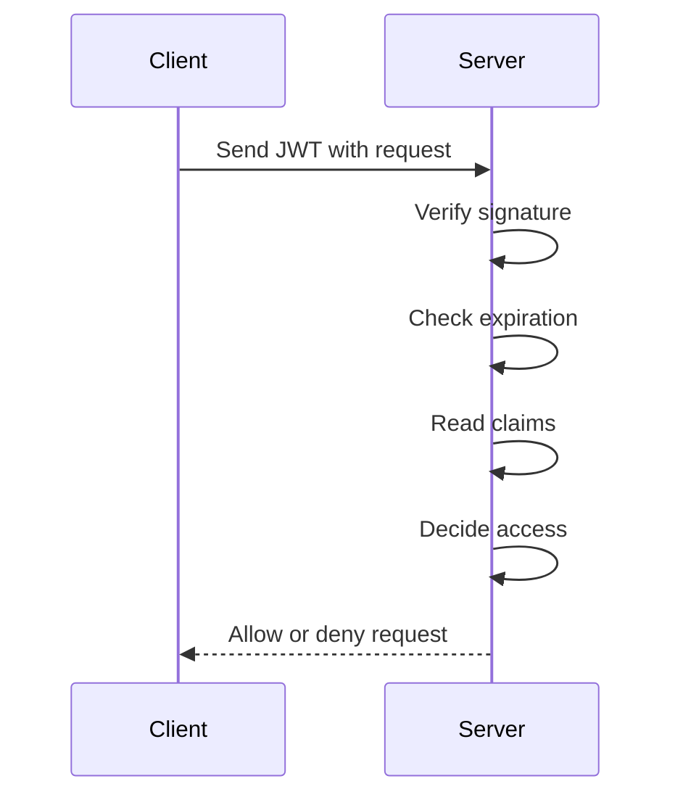
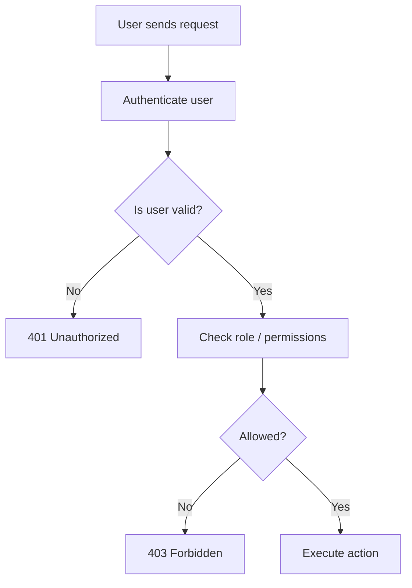
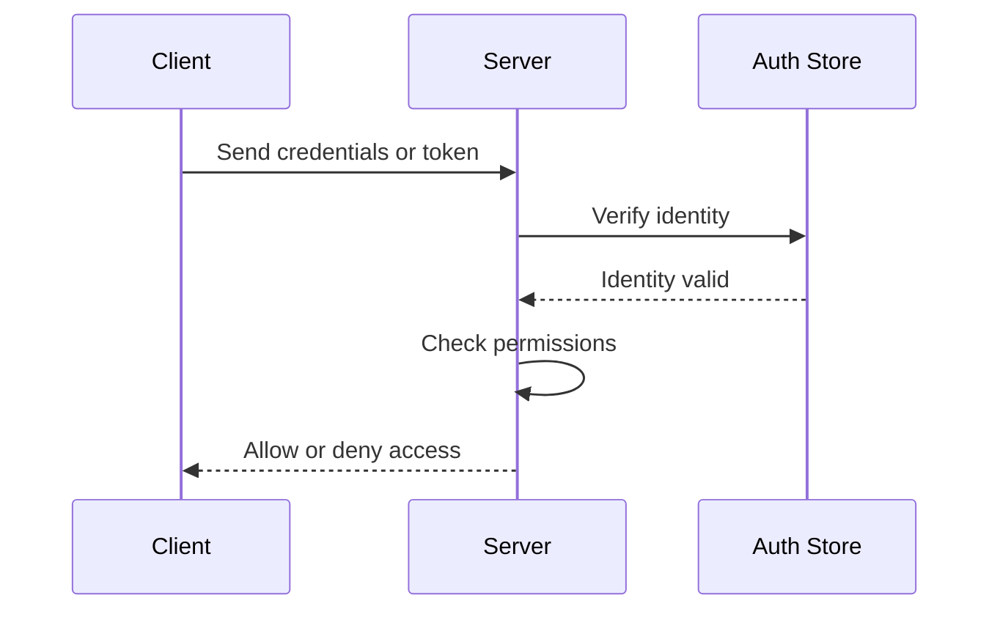

# Authentication & Authorization

Every secure application, from a tiny note app to a global platform, must answer two questions:

| Question | Meaning | Example |
|---|---|---|
| **Who are you?** | Proving identity | Login with email and password |
| **What can you do?** | Controlling access | Allow admin to delete users |

These are the two pillars of digital security:

- **Authentication** = identify the user
- **Authorization** = decide what the user may do

A simple way to remember the difference:

- **Authentication** is showing your ID at the gate.
- **Authorization** is the guard checking which rooms you are allowed to enter.

---

# 1. Authentication: Proving “Who You Are”

Authentication is the process of confirming identity.  
The system checks whether the person or service making a request is really who they claim to be.

## The three classic factors

| Factor | Meaning | Example |
|---|---|---|
| Something you know | A secret stored in your mind | Password, PIN |
| Something you have | A physical or digital object | Phone, OTP device, smart card |
| Something you are | A biological trait | Fingerprint, face scan |

Modern systems often combine more than one factor. That is called **Multi-Factor Authentication (MFA)**.

---

## 1.1 A short history of authentication

Authentication did not begin with passwords. It evolved as trust had to scale from small communities to large systems.

### 1.1.1 Village trust to wax seals

In small communities, people relied on direct trust.

- A village elder vouched for someone.
- A handshake sealed an agreement.
- Identity was known socially, not technically.

This worked only when everyone knew each other.

As societies grew, trust needed a physical proof.  
That is where the **wax seal** came in.

A wax seal acted like an early authentication token.

| Concept | Meaning |
|---|---|
| Wax seal | Proof that a document came from a specific person |
| Forged seal | Early authentication bypass |
| Unique marking | Something hard to fake |

### Real-world analogy

A wax seal was like a custom stamp on a delivery package.  
If the stamp matched, the receiver believed the package was authentic.

---

### 1.1.2 Passphrases and passwords

As communication systems became more complex, especially with telegraph-like systems, people started using **shared secret phrases**.

This introduced the idea of:

- something only the sender and receiver know
- secret knowledge as identity proof

That became the foundation of passwords.

### Analogy

A passphrase is like the secret handshake of a private club.  
If you know the phrase, you are allowed in.

---

### 1.1.3 The digital age: hashing and secure storage

Early computer systems stored passwords in unsafe ways.  
That was a disaster waiting to happen.

Storing passwords in plain text means anyone with access to the database can read them directly.

That led to a major breakthrough: **hashing**.

## What is hashing?

Hashing transforms a password into a fixed-length output called a **hash**.

Important properties:

| Property | Meaning |
|---|---|
| One-way | You cannot reverse the hash back into the original password |
| Deterministic | The same input always gives the same output |
| Fixed length | Output length stays the same even if input is long |
| Sensitive to change | Even tiny input changes produce totally different hashes |

### Example

```javascript
const crypto = require("crypto");

function hashPassword(password) {
  return crypto.createHash("sha256").update(password).digest("hex");
}

console.log(hashPassword("mypassword"));
````

This is only a basic example. In real systems, secure password hashing algorithms such as bcrypt, scrypt, or Argon2 are preferred because they are designed specifically for passwords.

### Analogy

Hashing is like blending ingredients into a smoothie.
You can taste the result, but you cannot easily reconstruct the original ingredients.

---

### 1.1.4 Cryptography and tickets

As systems became more distributed, new ways of proving identity emerged.

Two important ideas appeared:

* **Asymmetric cryptography**
* **Trusted ticket-based authentication**

These ideas laid the foundation for modern secure communication and token systems.

A useful mental model:

| Concept    | Analogy                              |
| ---------- | ------------------------------------ |
| Secret key | A private stamp only the server owns |
| Public key | A seal anyone can verify             |
| Ticket     | A temporary pass proving permission  |

---

### 1.1.5 Modern authentication with MFA

Simple passwords are not enough on their own.

Why?

Because passwords can be:

* guessed
* stolen
* phished
* reused across sites

That is why modern systems use **MFA**.

### MFA layers

| Layer      | Example     | Purpose            |
| ---------- | ----------- | ------------------ |
| Knowledge  | Password    | Something you know |
| Possession | Phone OTP   | Something you have |
| Inherence  | Fingerprint | Something you are  |

### Analogy

MFA is like entering a high-security building:

1. You show your ID card
2. You scan your access badge
3. You provide a fingerprint

The building does not trust just one signal.

---

# 1.2 Modern authentication patterns

Backend systems usually choose between a few major authentication styles.

## 1.2.1 Stateful vs stateless

This is one of the most important trade-offs in backend design.

HTTP is stateless by default, which means each request is independent.

That creates a problem:

* How does a server remember a logged-in user?
* How does a cart persist across pages?
* How do we know the same user is making repeated requests?

There are two common solutions:

| Pattern           | Stored on server? | Client holds         | Best for                         |
| ----------------- | ----------------- | -------------------- | -------------------------------- |
| Stateful sessions | Yes               | Session ID           | Traditional web apps             |
| Stateless JWTs    | No                | Self-contained token | APIs, mobile apps, microservices |

---

## Stateful sessions

With sessions, the server stores user state.

### How it works

1. User logs in
2. Server creates a session record
3. Server sends a session ID to the client
4. Client sends that ID on future requests
5. Server looks up session data

### Benefits

| Benefit         | Why it matters                  |
| --------------- | ------------------------------- |
| Easy revocation | Delete the session server-side  |
| Central control | Server owns the source of truth |
| Simpler logout  | Remove the session immediately  |

### Drawbacks

| Drawback                     | Why it matters                            |
| ---------------------------- | ----------------------------------------- |
| Requires server storage      | Database or cache needed                  |
| Harder to scale horizontally | Multiple servers must share session state |

### Analogy

A session is like a coat-check ticket.
The ticket itself is not the coat. It only points to where the coat is stored.

---

## Stateless JWTs

JWTs store the needed identity data inside the token itself.

### How it works

1. User logs in
2. Server creates a signed token
3. Client stores the token
4. Client sends token with each request
5. Server verifies signature and reads claims

### Benefits

| Benefit                   | Why it matters             |
| ------------------------- | -------------------------- |
| No server session storage | Easier scaling             |
| Portable                  | Great for APIs and mobile  |
| Self-contained            | Token carries its own data |

### Drawbacks

| Drawback             | Why it matters                                 |
| -------------------- | ---------------------------------------------- |
| Revocation is harder | No central session record                      |
| Token theft risk     | Stolen token may remain valid until expiration |
| Can become bloated   | Too much data inside the token is bad design   |

### Analogy

A JWT is like a digitally signed boarding pass.
The server can verify it without calling a central registry every time.

---

## 1.2.2 JWT anatomy

JWT stands for **JSON Web Token**.

It usually has three parts separated by dots:

```text
header.payload.signature
```

| Part      | Purpose                                    |
| --------- | ------------------------------------------ |
| Header    | Metadata about the token                   |
| Payload   | Claims about the user                      |
| Signature | Proof that the token was not tampered with |

### Example structure

```json
{
  "header": {
    "alg": "HS256",
    "typ": "JWT"
  },
  "payload": {
    "sub": "user_123",
    "name": "Asha",
    "role": "admin",
    "iat": 1715000000,
    "exp": 1715003600
  }
}
```

### What the claims mean

| Claim  | Meaning                      |
| ------ | ---------------------------- |
| `sub`  | Subject, usually the user ID |
| `name` | User name                    |
| `role` | User role                    |
| `iat`  | Issued at time               |
| `exp`  | Expiration time              |

---

## JWT signature

The signature proves the token was generated by the server and not modified by the client.

### Why this matters

If someone changes:

```json
"role": "user"
```

to

```json
"role": "admin"
```

the signature becomes invalid.

### Analogy

The signature is like a wax seal on a royal decree.
If the document is altered, the seal no longer matches.

---

## JWT verification flow



---

## JWT revocation problem

JWTs are stateless, which makes them scalable.
But that same property makes revocation harder.

If a token is issued for 1 hour, how do you invalidate it immediately?

### Common approaches

| Strategy              | Description                                                   |
| --------------------- | ------------------------------------------------------------- |
| Short expiration time | Reduce damage window                                          |
| Refresh tokens        | Use a short-lived access token and longer-lived refresh token |
| Blacklist             | Store revoked token IDs in Redis or database                  |
| Rotate secret key     | Forces all tokens to become invalid, but is disruptive        |

### Important trade-off

A blacklist adds state back into the system.
That is often acceptable when security requires it.

---

## 1.2.3 Sessions vs JWTs: choosing wisely

| Use case                | Better choice      | Why                           |
| ----------------------- | ------------------ | ----------------------------- |
| Traditional browser app | Sessions           | Easier logout and control     |
| Mobile app              | JWT                | Portable and easy to send     |
| Microservices           | JWT                | Scales well across services   |
| Admin dashboard         | Sessions           | Revocation and control matter |
| Third-party API access  | JWT or OAuth token | Distributed systems friendly  |

---

# 1.3 Authentication strategies in real systems

## 1.3.1 API keys

API keys are used mostly for machine-to-machine access.

### Example

A backend service calling another backend service may use an API key.

```javascript
fetch("https://api.example.com/data", {
  headers: {
    "x-api-key": "your-secret-api-key"
  }
});
```

### Characteristics

| Property           | API Key    |
| ------------------ | ---------- |
| Long-lived         | Often yes  |
| Tied to user/app   | Yes        |
| Good for machines  | Yes        |
| Good for end users | Usually no |

### Analogy

An API key is like a building access badge for a service account.

---

## 1.3.2 OAuth 2.0 and OIDC

This is a very common source of confusion.

### OAuth 2.0

OAuth is for **authorization**.

It solves the delegation problem:

* one app wants access to another app’s data
* the user should not hand over their password

### Example

A travel app wants to read your Gmail to find flight confirmations.

Instead of giving the travel app your Google password, you grant limited access.

That is OAuth.

### OIDC

OpenID Connect is built on top of OAuth 2.0 and provides **authentication**.

It tells the app:

* who the user is
* what their verified identity is

### Simple distinction

| Protocol  | Main job            |
| --------- | ------------------- |
| OAuth 2.0 | What the app can do |
| OIDC      | Who the user is     |

### Analogy

* OAuth is the permission slip
* OIDC is the identity card

---

## OAuth + OIDC flow in plain language

1. User clicks “Sign in with Google”
2. Google asks the user to approve access
3. App receives tokens
4. Access token = permission
5. ID token = identity

---

# 1.4 Example authentication flow in JavaScript

## Session-based login

```javascript
const express = require("express");
const session = require("express-session");

const app = express();

app.use(express.json());

app.use(
  session({
    secret: "replace-with-a-secure-secret",
    resave: false,
    saveUninitialized: false,
  })
);

app.post("/login", async (req, res) => {
  const { email, password } = req.body;

  // In real systems, fetch user from DB and verify password securely
  if (email === "admin@example.com" && password === "secret123") {
    req.session.user = {
      id: "user_1",
      email,
      role: "admin",
    };

    return res.json({ message: "Login successful" });
  }

  return res.status(401).json({ message: "Authentication failed" });
});

app.get("/me", (req, res) => {
  if (!req.session.user) {
    return res.status(401).json({ message: "Not authenticated" });
  }

  res.json(req.session.user);
});
```

---

## JWT-based login

```javascript
const express = require("express");
const jwt = require("jsonwebtoken");

const app = express();
app.use(express.json());

const JWT_SECRET = "replace-with-a-secure-secret";

app.post("/login", async (req, res) => {
  const { email, password } = req.body;

  if (email === "admin@example.com" && password === "secret123") {
    const token = jwt.sign(
      {
        sub: "user_1",
        email,
        role: "admin",
      },
      JWT_SECRET,
      { expiresIn: "1h" }
    );

    return res.json({ token });
  }

  return res.status(401).json({ message: "Authentication failed" });
});

app.get("/me", (req, res) => {
  const authHeader = req.headers.authorization || "";
  const token = authHeader.replace("Bearer ", "");

  try {
    const decoded = jwt.verify(token, JWT_SECRET);
    return res.json(decoded);
  } catch (err) {
    return res.status(401).json({ message: "Invalid or expired token" });
  }
});
```

---

# 2. Authorization: Deciding “What You Can Do”

Authentication tells the server **who** the user is.
Authorization tells the server **what that user may do**.

A user can be authenticated and still not have permission.

## Example

A note app may allow:

* normal users to create their own notes
* admins to view deleted notes
* moderators to review reports

All of them may be authenticated, but their permissions differ.

---

## 2.1 Why authentication is not enough

Authentication answers:

* Is this a valid user?

Authorization answers:

* Is this user allowed to perform this action?

### Analogy

Think of a hotel.

| Step           | Meaning                                             |
| -------------- | --------------------------------------------------- |
| Authentication | Your ID proves you are a guest                      |
| Authorization  | Your room key determines which floors you can enter |

A guest may be real, but not every guest can enter the kitchen, staff room, or penthouse.

---

## 2.2 Role-Based Access Control (RBAC)

RBAC is one of the most common authorization models.

### How it works

1. Define roles
2. Assign permissions to roles
3. Assign users to roles
4. Check role before action

---

## Roles and permissions

| Role      | Permissions                |
| --------- | -------------------------- |
| user      | Read and write own content |
| moderator | Review flagged content     |
| admin     | Full access                |

### Example

A normal user can:

* create notes
* edit their own notes
* delete their own notes

An admin can additionally:

* view deleted notes
* manage users
* access moderation tools

---

## Authorization flow



---

## 2.3 401 vs 403

These two status codes are often confused.

| Status           | Meaning                               | When to use                          |
| ---------------- | ------------------------------------- | ------------------------------------ |
| 401 Unauthorized | User is not authenticated             | No login, bad token, invalid session |
| 403 Forbidden    | User is authenticated but not allowed | Logged in, but lacks permission      |

### Simple rule

* **401** = “Who are you?”
* **403** = “I know who you are, but you cannot do this.”

---

## 2.4 RBAC in JavaScript

```javascript
function requireAuth(req, res, next) {
  if (!req.user) {
    return res.status(401).json({ message: "Not authenticated" });
  }
  next();
}

function requireRole(...allowedRoles) {
  return (req, res, next) => {
    const userRole = req.user?.role;

    if (!allowedRoles.includes(userRole)) {
      return res.status(403).json({ message: "Forbidden" });
    }

    next();
  };
}

app.delete("/admin/users/:id", requireAuth, requireRole("admin"), (req, res) => {
  res.json({ message: "User deleted" });
});
```

This pattern is simple, readable, and very common.

---

# 3. Building secure systems

Knowing the theory is not enough.
You must also avoid subtle security mistakes.

---

## 3.1 Be vague with login errors

Never reveal too much information during authentication failures.

### Bad messages

| Message            | Problem                           |
| ------------------ | --------------------------------- |
| User not found     | Confirms whether the email exists |
| Incorrect password | Confirms the account exists       |
| Account locked     | Reveals account status            |

### Better message

```json
{
  "message": "Authentication failed"
}
```

### Why this matters

Attackers can use specific error messages to:

* enumerate users
* test valid emails
* narrow down targets for brute force attacks

### Analogy

A guarded building should not say:

* “Wrong badge”
* “Wrong floor”

It should simply say:

* “Access denied”

---

## 3.2 Timing attacks

A timing attack happens when attackers measure how long your server takes to respond.

### Problem

If:

* invalid username fails fast
* valid username + wrong password takes longer

then attackers can infer whether a user exists.

### Bad pattern

```javascript
if (!user) {
  return res.status(401).json({ message: "Authentication failed" });
}

if (user.password !== password) {
  return res.status(401).json({ message: "Authentication failed" });
}
```

This may leak timing differences if the password comparison work is inconsistent.

### Better approach

Use:

* constant-time comparisons
* secure password hashing
* consistent failure behavior
* rate limiting

---

## 3.3 Constant-time comparison

Constant-time comparison reduces the risk of leaking information through response timing.

### Example idea

Instead of exiting early in ways that reveal information, use secure library functions that compare hashes safely.

---

## 3.4 Rate limiting and lockouts

Authentication security is not just about secrets.
It also involves controlling abuse.

### Common protections

| Protection        | Purpose                     |
| ----------------- | --------------------------- |
| Rate limiting     | Stops rapid login attempts  |
| Temporary lockout | Slows brute force attacks   |
| CAPTCHA           | Reduces bot abuse           |
| IP monitoring     | Detects suspicious behavior |
| MFA               | Adds a second barrier       |

### Analogy

Rate limiting is like a bouncer limiting how many times one person can try to enter the club in one minute.

---

# 4. A complete mental model

A secure request usually follows this sequence:



---

# 5. Choosing the right strategy

## When to use sessions

| Best for                    | Reason                       |
| --------------------------- | ---------------------------- |
| Traditional web apps        | Easy browser support         |
| Admin dashboards            | Simple logout and revocation |
| Apps needing strict control | Centralized session handling |

## When to use JWTs

| Best for      | Reason                     |
| ------------- | -------------------------- |
| APIs          | Portable and stateless     |
| Mobile apps   | Easy token handling        |
| Microservices | Works well across services |

## When to use OAuth/OIDC

| Best for                 | Reason                                 |
| ------------------------ | -------------------------------------- |
| “Sign in with Google”    | Delegated login flow                   |
| Third-party integrations | Secure limited access                  |
| Multi-app ecosystems     | Standard identity and permission model |

## When to use API keys

| Best for                  | Reason                     |
| ------------------------- | -------------------------- |
| Service-to-service access | Simple machine identity    |
| Internal scripts          | Lightweight access control |

---

# 6. Common mistakes beginners make

| Mistake                                          | Why it is bad                   |
| ------------------------------------------------ | ------------------------------- |
| Confusing authentication with authorization      | Leads to broken access control  |
| Storing passwords in plain text                  | Catastrophic security risk      |
| Using weak password hashing                      | Makes cracking easier           |
| Returning detailed login errors                  | Helps attackers enumerate users |
| Trusting JWT payload without verifying signature | Lets attackers forge identity   |
| Forgetting token expiration                      | Increases token abuse risk      |
| Not checking permissions on every request        | Can expose private data         |

---

# 7. Practical summary

## Authentication

Authentication answers:

* Who are you?

It uses:

* passwords
* MFA
* sessions
* JWTs
* OAuth/OIDC
* API keys

## Authorization

Authorization answers:

* What can you do?

It uses:

* roles
* permissions
* policies
* access checks

---

# 8. Final comparison

| Topic          | Authentication | Authorization             |
| -------------- | -------------- | ------------------------- |
| Question       | Who are you?   | What can you do?          |
| Purpose        | Prove identity | Control access            |
| Happens first? | Yes            | Yes, after authentication |
| Example        | Login          | Delete user permission    |
| Failure code   | 401            | 403                       |

---

# 9. Final takeaway

A strong backend system must do two things well:

1. **Verify identity**
2. **Restrict access correctly**
