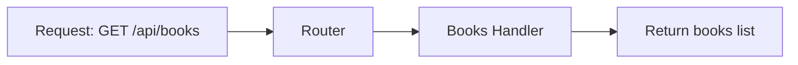
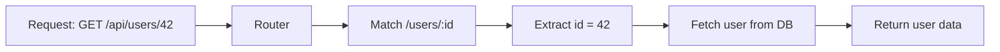
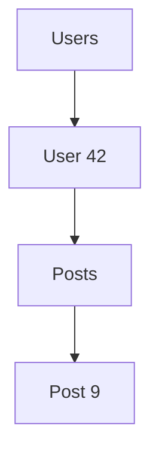
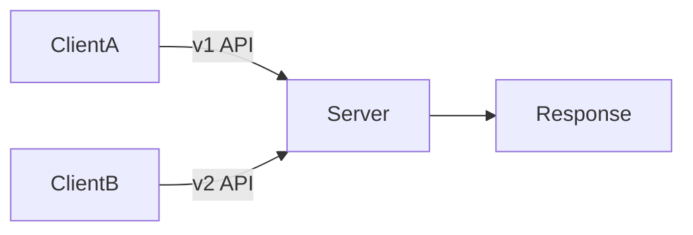
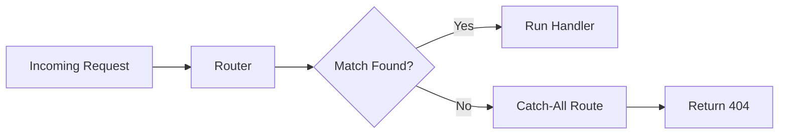

# Backend Routing: How Requests Find Their Way Home

When a user interacts with an application—clicking a button, submitting a form, or opening a page—their device sends an HTTP request to a backend server.

But a server can receive **thousands or millions of requests per second**.

So an important question arises:

> **How does the server know which code should handle which request?**

The answer is **Routing**.

Routing acts like a **traffic controller** for your backend. It examines each incoming request and sends it to the correct function responsible for handling it.

Understanding routing is one of the most fundamental skills in backend development because **every API endpoint, every feature, and every request depends on it.**

---

# 1. The Core Idea of Routing

Routing is the process of mapping:

```

HTTP Method + URL Path → Handler Function

````

This mapping tells the backend **what code should run for a specific request**.

For example:

| HTTP Method | Route Path | Meaning |
|--------------|-------------|--------|
| GET | /api/books | Fetch all books |
| POST | /api/books | Create a new book |
| GET | /api/books/42 | Fetch book with ID 42 |
| DELETE | /api/books/42 | Delete book with ID 42 |

Even though `/api/books` is the same path, **the HTTP method changes the meaning of the request.**

---

## Real World Analogy

Think of routing like a **hotel receptionist**.

When a guest asks something:

| Guest Request | Receptionist Action |
|---|---|
| "I want food" | Send to restaurant |
| "I need towels" | Send to housekeeping |
| "I want to check out" | Send to billing |

The receptionist **routes the request to the correct department**.

Backend routing does exactly the same thing.

---

# 2. How Routing Works Internally

When a request arrives:

1. The server receives the HTTP request.
2. The routing system reads:
   - HTTP Method
   - URL Path
3. It compares the request against defined routes.
4. If a match is found → corresponding handler runs.
5. If no match is found → return **404 Not Found**.

---

## Request Flow Diagram

```mermaid
flowchart LR
A[Client sends request] --> B[Server receives request]
B --> C[Router analyzes Method + Path]
C --> D{Route exists?}

D -- Yes --> E[Execute Handler Function]
E --> F[Send Response]

D -- No --> G[Return 404 Not Found]
````

---

# 3. Example Routing in Backend Code

Example using **Node.js + Express**

```ts
import express from "express";

const app = express();

app.get("/api/books", (req, res) => {
  res.json(["Book 1", "Book 2"]);
});

app.post("/api/books", (req, res) => {
  res.json({ message: "Book created" });
});

app.get("/api/books/:id", (req, res) => {
  res.json({ bookId: req.params.id });
});
```

Here:

| Route              | Purpose             |
| ------------------ | ------------------- |
| GET /api/books     | Fetch books         |
| POST /api/books    | Create book         |
| GET /api/books/:id | Fetch specific book |

---

# 4. Types of Routes

There are two major types of routes:

1. **Static Routes**
2. **Dynamic Routes**

---

# 4.1 Static Routes

Static routes are **fixed paths**.

They always represent the same resource.

Example:

```
GET /api/books
GET /api/users
GET /api/products
```

Example code:

```ts
app.get("/api/books", handler);
```

This route **always matches exactly `/api/books`**.

---

## Static Route Diagram



---

# 4.2 Dynamic Routes

Dynamic routes contain **variables inside the path**.

These variables are called **Path Parameters**.

Example:

```
/api/users/:id
```

Requests:

```
/api/users/1
/api/users/2
/api/users/999
```

All of them match the **same route pattern**.

---

## Example Code

```ts
app.get("/api/users/:id", (req, res) => {
  const userId = req.params.id;

  res.json({
    message: `Fetching user ${userId}`
  });
});
```

---

## Dynamic Route Flow



---

# 5. Path Parameters vs Query Parameters

Backend APIs often need extra input data.

There are **two common ways** to pass it:

| Type             | Example         |
| ---------------- | --------------- |
| Path Parameters  | `/users/123`    |
| Query Parameters | `/users?page=2` |

---

## Comparison Table

| Feature  | Path Parameter      | Query Parameter |
| -------- | ------------------- | --------------- |
| Location | Part of URL path    | After `?`       |
| Purpose  | Identify resource   | Filter/search   |
| Example  | `/users/42`         | `/users?page=2` |
| Use case | Fetch specific user | Pagination      |

---

## Path Parameter Example

```
GET /api/users/42
```

Meaning:

> Give me the user with ID **42**

---

## Query Parameter Example

```
GET /api/users?page=2&limit=10
```

Meaning:

> Give me **10 users from page 2**

---

## Query Example Code

```ts
app.get("/api/users", (req, res) => {

  const page = req.query.page;
  const limit = req.query.limit;

  res.json({
    page,
    limit
  });

});
```

---

# 6. Common Routing Patterns

Large applications follow patterns to keep routing clean and scalable.

Important patterns include:

1. Nested Routes
2. API Versioning
3. Catch-All Routes

---

# 6.1 Nested Routes

Nested routes express **relationships between resources**.

Example:

```
/users
/users/42
/users/42/posts
/users/42/posts/9
```

Hierarchy:

```
Users
 └── User 42
      └── Posts
           └── Post 9
```

---

## Nested Route Example

```ts
GET /users/42/posts
```

Meaning:

> Fetch all posts created by **User 42**

---

## Nested Route Diagram



---

# 6.2 API Versioning

APIs evolve over time.

If you change response formats suddenly, old apps may break.

To solve this problem we use **API Versioning**.

Example:

```
/api/v1/products
/api/v2/products
```

---

## Example Response Change

Version 1

```json
{
  "id": 1,
  "name": "Laptop",
  "price": 1200
}
```

Version 2

```json
{
  "id": 1,
  "title": "Laptop",
  "price": 1200
}
```

Now both versions can run simultaneously.

---

## Versioning Diagram



---

# 6.3 Catch-All Routes

Sometimes a request doesn't match any defined route.

Example:

```
GET /random/unknown/path
```

A **catch-all route** handles these cases.

---

## Example Code

```ts
app.use("*", (req, res) => {
  res.status(404).json({
    message: "Route not found"
  });
});
```

---

## Catch-All Flow



---

# 7. Best Practices for Backend Routing

Professional backend systems follow important principles.

---

## 1. Use Nouns, Not Verbs

Bad:

```
/getUsers
/createUser
```

Good:

```
GET /users
POST /users
```

HTTP method already describes the action.

---

## 2. Keep URLs Predictable

Good APIs are **self-explanatory**.

Example:

```
/users/42/orders
```

Clearly means:

> Orders belonging to user 42.

---

## 3. Avoid Deep Nesting

Bad:

```
/users/42/posts/10/comments/5/reactions
```

Too complex.

Prefer flatter structures when possible.

---

## 4. Consistent Naming

Use plural resources.

```
/users
/products
/orders
```

---

# 8. Routing in Modern Backend Frameworks

Almost every backend framework includes routing.

Examples:

| Framework   | Language |
| ----------- | -------- |
| Express     | Node.js  |
| Fastify     | Node.js  |
| Django      | Python   |
| Flask       | Python   |
| Spring Boot | Java     |
| Laravel     | PHP      |

All follow the same concept:

```
Method + Path → Handler
```

---

# 9. How Routing Works at Scale

Large applications can have **thousands of routes**.

To manage them developers use:

* **Router modules**
* **Controllers**
* **Middleware**
* **Route groups**

Example structure:

```
src/
 ├── routes/
 │    ├── user.routes.ts
 │    ├── post.routes.ts
 │
 ├── controllers/
 │    ├── user.controller.ts
 │    ├── post.controller.ts
```

This keeps the backend organized.

---

# 10. Summary

Routing is the **navigation system of a backend server**.

It decides **which code should handle each request**.

---

## Key Takeaways

• Routing maps **HTTP Method + Path → Server Logic**

• Static routes represent fixed resources.

• Dynamic routes use **path parameters** for flexible resource access.

• Query parameters help **filter, sort, and paginate data**.

• Patterns like **nested routes, versioning, and catch-all routes** help create scalable APIs.

• Clean routing design is essential for building **maintainable backend systems**.

---

# Final Thought

Routing is the **bridge between HTTP and backend logic**.

Once you master routing, you begin to understand how:

* APIs work
* REST services are designed
* large backend systems are structured.

This knowledge forms the **foundation of modern backend architecture**.