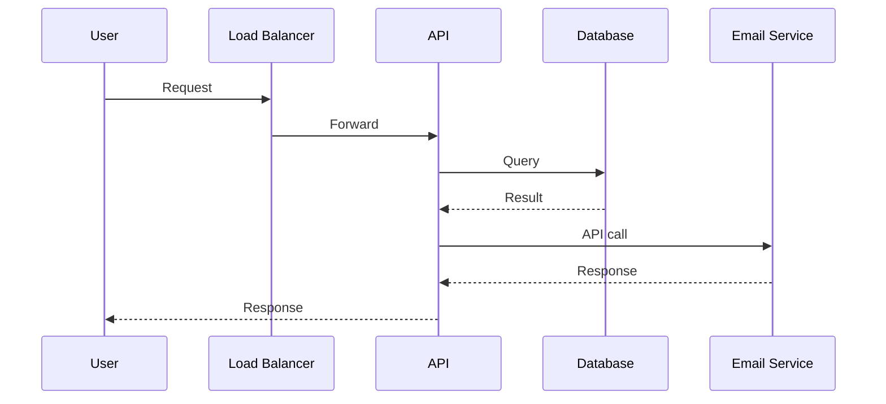
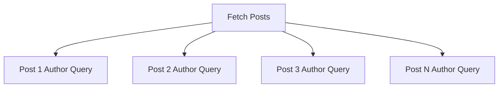
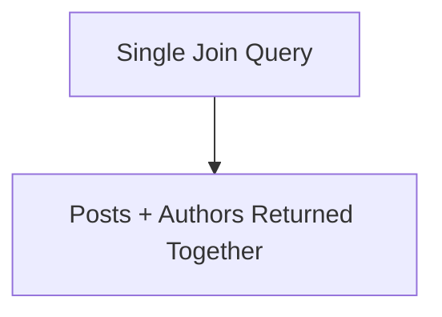
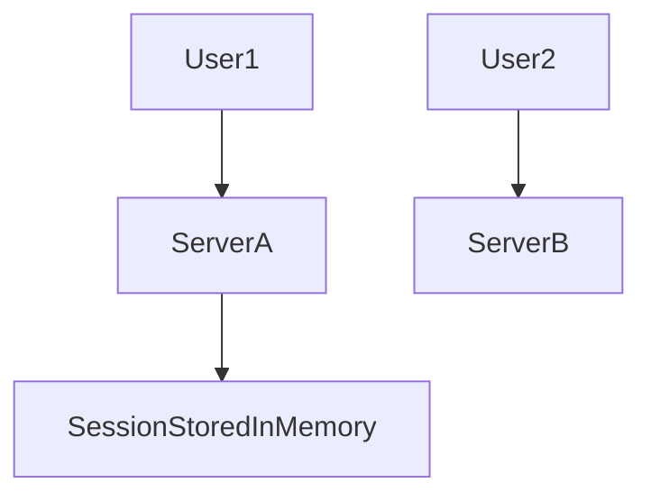
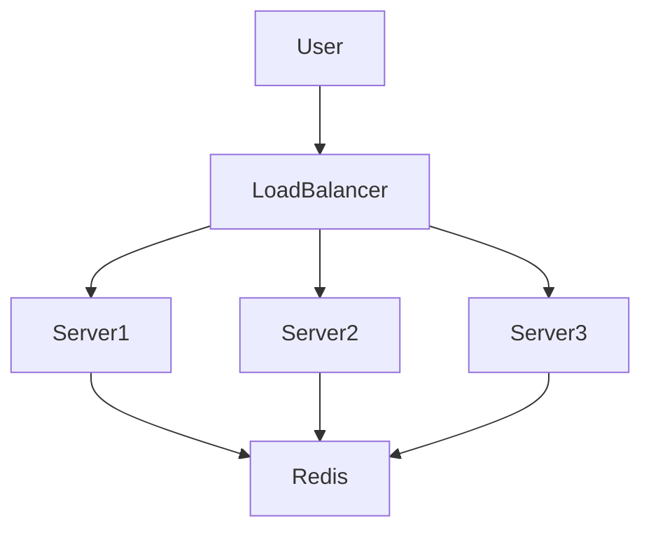
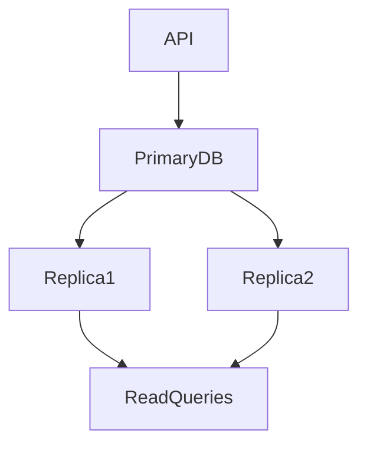
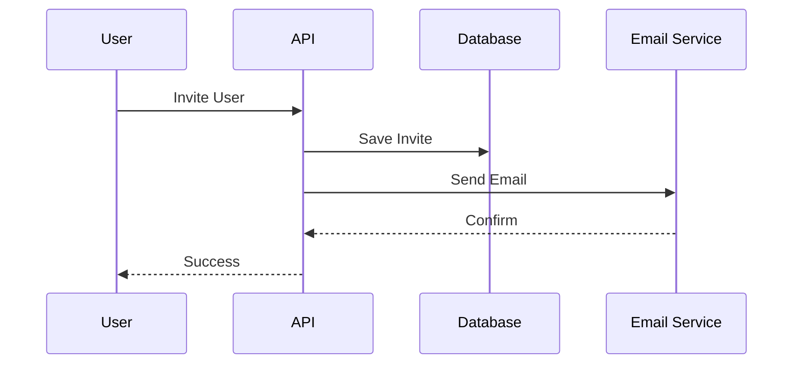
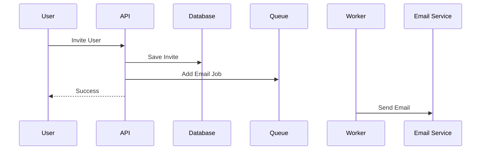
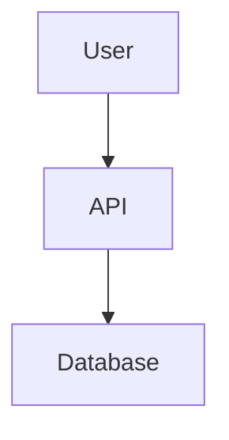
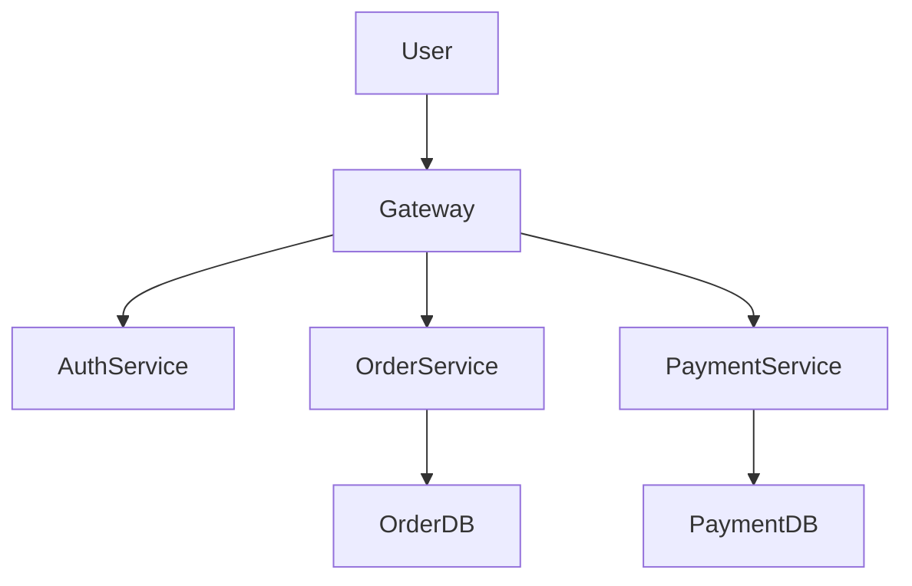

# Scaling and Performance Engineering

Modern backend systems rarely fail because of **lack of hardware**.  
They fail because of **poor architecture, hidden bottlenecks, and incorrect assumptions about performance**.

Many engineers react to performance problems by:

- Adding caching
- Increasing server size
- Scaling horizontally
- Migrating to microservices

These solutions sometimes work, but often they **hide the real issue rather than solving it**.

True performance engineering follows a simple rule:

> **Never guess. Always measure.**

This guide explores the real principles behind building **fast, scalable backend systems**, starting from performance fundamentals to architectural scaling strategies.

---

# Introduction: The Illusion of Quick Fixes

Imagine your system suddenly slows down after a traffic spike.

Typical reactions include:

- “Let's add Redis caching”
- “Upgrade the database instance”
- “Add more servers”

These solutions can work — **but they treat symptoms, not causes**.

Real performance engineering focuses on:

- Identifying bottlenecks
- Understanding system behavior under load
- Making targeted optimizations

### Real-world analogy

Think of a hospital emergency room.

If patients are waiting too long, adding more beds might help.  
But if the real issue is **slow patient registration**, adding beds won't solve anything.

Backend systems behave the same way.

---

# 1. Your Average Latency Is a Liar

The most common performance metric engineers track is **average latency**.

Example:

| Metric | Value |
|------|------|
| Average Response Time | 100ms |

Looks great, right?

But averages **hide outliers**.

### Example scenario

1000 requests:

| Requests | Latency |
|------|------|
| 990 requests | 50ms |
| 10 requests | 5000ms |

Average latency = **100ms**

But **10 users experienced a 5-second delay**.

For large systems:

- 1M requests/day
- 1% slow requests

That means **10,000 users experience terrible performance daily**.

---

## Percentiles: The Real Performance Metric

Instead of averages, use **percentiles**.

| Metric | Meaning |
|------|------|
| P50 | 50% of users experience this latency or faster |
| P90 | 90% of users experience this latency or faster |
| P99 | 99% of users experience this latency or faster |

Example:

| Percentile | Latency |
|------|------|
| P50 | 40ms |
| P90 | 120ms |
| P99 | 2s |

Interpretation:

- Most users: fast experience
- 1% users: very slow experience

Those **1% users often represent critical operations** like:

- payments
- data exports
- analytics queries

---

## Request Latency Distribution

```mermaid
graph LR
A[Fast Requests 50ms] --> B[Most Users P50]
B --> C[Slower Requests P90]
C --> D[Worst Case P99]
````

Performance engineering focuses heavily on **improving P95 and P99**, not averages.

---

# 2. The Danger Zone: Why 100% Utilization Is a Disaster

Many engineers assume performance degrades **linearly**.

Reality: it degrades **exponentially**.

### Example

| CPU Utilization | System Behavior |
| --------------- | --------------- |
| 50%             | Smooth          |
| 70%             | Slight slowdown |
| 80%             | Queueing begins |
| 90%             | Latency spikes  |
| 100%            | System collapse |

---

## Highway Analogy

Think of a highway:

| Traffic Level | Behavior           |
| ------------- | ------------------ |
| 50% capacity  | Cars move freely   |
| 80% capacity  | Small slowdowns    |
| 90% capacity  | Traffic jams start |
| 100% capacity | Complete gridlock  |

Servers behave exactly the same.

---

## Queueing Effect

When utilization approaches 100%:

* requests pile up
* queues grow rapidly
* latency skyrockets

```mermaid
sequenceDiagram
User->>Server: Request
Server->>Queue: Waiting
Queue->>CPU: Process
CPU-->>User: Response
```

If the queue grows faster than processing:

System becomes **unresponsive**.

---

## Industry Best Practice

Keep systems running at:

**60–80% utilization**

Why?

This provides **headroom** for:

* traffic spikes
* burst workloads
* background jobs

---

# 3. Stop Guessing: Finding the Real Bottleneck

A classic engineering mistake:

> "The API is slow. It must be the database."

So engineers implement:

* caching
* database upgrades
* query optimization

But sometimes the database is **not the problem**.

---

## Real-world example

A product API was slow.

Engineers assumed database latency.

They built a **complex caching system**.

After deployment:

❌ API still slow.

They finally measured execution times.

Result:

| Component       | Time  |
| --------------- | ----- |
| DB query        | 10ms  |
| Business logic  | 5ms   |
| Logging service | 500ms |

The **real bottleneck was synchronous logging**.

---

## Lesson

Never guess performance problems.

Always measure.

---

# Profiling vs Distributed Tracing

Two key tools help detect bottlenecks.

---

## Profiling

Profilers analyze **CPU execution time**.

They answer:

> Which functions consume the most CPU?

Example tools:

* Node.js profiler
* flame graphs
* CPU sampling tools

### Example output

```
handleRequest()
 ├── processPayment() (40%)
 ├── calculateTax() (30%)
 └── validateInput() (10%)
```

---

## Distributed Tracing

Tracing follows a **single request across services**.

It answers:

> Where is the request waiting?



Tracing tools:

* Jaeger
* Zipkin
* OpenTelemetry
* New Relic

Tracing is essential for **microservices architectures**.

---

# 4. The N+1 Query Problem

One of the most common database performance issues.

It happens when applications perform **a query inside a loop**.

---

## Example Problem

```javascript
const posts = await db.query("SELECT * FROM posts LIMIT 20");

for (const post of posts) {
  const author = await db.query(
    "SELECT * FROM users WHERE id = ?",
    [post.author_id]
  );

  post.author = author;
}
```

Database calls:

| Operation     | Queries        |
| ------------- | -------------- |
| Fetch posts   | 1              |
| Fetch authors | 20             |
| Total         | **21 queries** |

Each query adds:

* network latency
* query parsing
* connection overhead

---

## Performance Impact

| Queries     | Latency |
| ----------- | ------- |
| 1 query     | 5ms     |
| 20 queries  | 100ms   |
| 100 queries | 500ms   |

---

## Correct Solution

Use **JOIN queries**.

```javascript
const posts = await db.query(`
SELECT posts.*, users.name
FROM posts
JOIN users ON users.id = posts.author_id
LIMIT 20
`);
```

Now:

| Operation             | Queries |
| --------------------- | ------- |
| Fetch posts + authors | 1       |

---

## N+1 Query Visualization



Efficient approach:



---

# 5. Database Indexes: A Double-Edged Sword

Indexes speed up database queries dramatically.

Without indexes:

Database performs a **full table scan**.

Example:

| Rows      | Time           |
| --------- | -------------- |
| 100 rows  | fast           |
| 1M rows   | slow           |
| 100M rows | extremely slow |

---

## Library Analogy

Finding a book in a library.

Without catalog:

Search every shelf.

With catalog:

Look up exact location instantly.

---

## Example Query

```sql
SELECT * FROM users WHERE email = 'john@example.com';
```

Index:

```
INDEX(email)
```

Now the database jumps **directly to the row**.

---

# The Hidden Cost of Indexes

Indexes also have **downsides**.

| Cost           | Explanation                          |
| -------------- | ------------------------------------ |
| Storage        | Indexes consume disk space           |
| Write overhead | Inserts must update indexes          |
| Update cost    | Changing indexed values is expensive |

Example:

Table with **10 indexes**.

Inserting one row requires:

* updating 10 indexes

This slows down writes significantly.

---

# Choosing What to Index

Never index everything.

Index based on **query patterns**.

---

## Using EXPLAIN ANALYZE

```sql
EXPLAIN ANALYZE
SELECT * FROM orders WHERE user_id = 42;
```

Output might show:

```
Seq Scan on orders
```

Meaning:

Database scanned entire table.

Solution:

Add index.

```
CREATE INDEX idx_user_id ON orders(user_id);
```

---

# Composite Indexes

Useful when queries filter multiple columns.

Example query:

```sql
SELECT * FROM orders
WHERE user_id = 42
AND created_at > NOW() - INTERVAL '7 days';
```

Better index:

```
INDEX(user_id, created_at)
```

Important rule:

Order matters.

```
INDEX(user_id, created_at)
```

Works for:

```
WHERE user_id = ?
WHERE user_id = ? AND created_at > ?
```

But NOT:

```
WHERE created_at > ?
```

---

# Horizontal Scaling: The Secret is Statelessness

Scaling horizontally means:

Adding more servers.

But this only works if servers are **stateless**.

---

## Stateful System (Bad for Scaling)



Problem:

If next request goes to another server:

Session is lost.

---

## Stateless Architecture



Sessions stored in **shared storage**.

Examples:

| State    | Storage   |
| -------- | --------- |
| Sessions | Redis     |
| Files    | S3        |
| Cache    | Memcached |
| Data     | Database  |

---

# Replication Lag: The Physics Problem

Read replicas improve performance.

Architecture:



But replication takes time.

---

## Example Scenario

User updates profile.

```
Write → US primary database
```

Immediately refreshes page.

```
Read → India replica
```

Replica hasn't received update yet.

User sees **old data**.

---

## Solution Strategies

| Strategy                 | Explanation                   |
| ------------------------ | ----------------------------- |
| Read-after-write routing | temporarily read from primary |
| Short-term caching       | show latest user state        |
| Eventual consistency     | accept temporary mismatch     |

---

# Asynchronous Processing: Making Systems Feel Fast

Not all tasks need synchronous completion.

---

## Synchronous Flow



User waits entire time.

---

## Asynchronous Flow



User response time drops dramatically.

---

## Good Candidates for Async Jobs

| Task                | Reason                |
| ------------------- | --------------------- |
| Email sending       | external API latency  |
| Image processing    | CPU heavy             |
| video transcoding   | long-running          |
| analytics pipelines | background processing |

---

# Microservices Myth

Microservices are often seen as **scaling solutions**.

Reality:

They scale **teams**, not just traffic.

---

## Monolith Architecture



Advantages:

* simple
* easy debugging
* fewer network failures

---

## Microservices Architecture



Advantages:

* independent deployments
* team ownership
* independent scaling

Disadvantages:

* network latency
* distributed debugging
* data consistency challenges

---

# The Golden Rule of Scaling

The most important rule:

> **Measure before optimizing.**

---

## Observability Stack

Modern systems require three pillars.

| Tool    | Purpose             |
| ------- | ------------------- |
| Logs    | record events       |
| Metrics | track system health |
| Traces  | follow requests     |

Example tools:

| Category   | Tools      |
| ---------- | ---------- |
| Metrics    | Prometheus |
| Dashboards | Grafana    |
| Tracing    | Jaeger     |
| Monitoring | Datadog    |

---

# Final Principle: Complexity Has a Cost

Every scaling solution adds complexity.

| Component     | Complexity          |
| ------------- | ------------------- |
| Cache         | invalidation issues |
| Queue         | job reliability     |
| Load balancer | routing             |
| microservices | network failures    |

The best engineers follow this rule:

> **Choose the simplest architecture that solves today's problem.**

Premature complexity creates systems that are:

* difficult to debug
* expensive to maintain
* fragile under failure

---

# Key Takeaways

1. **Average latency is misleading — focus on P95/P99.**
2. **Never run systems near 100% utilization.**
3. **Always measure before optimizing.**
4. **Avoid N+1 queries.**
5. **Use indexes strategically.**
6. **Stateless architectures enable horizontal scaling.**
7. **Replication introduces consistency trade-offs.**
8. **Async processing improves perceived performance.**
9. **Microservices scale teams more than machines.**
10. **Complexity should always be justified.**

---

# Final Thought

The goal of performance engineering is not just speed.

It is building systems that remain:

* predictable
* resilient
* scalable

under **real-world pressure**.