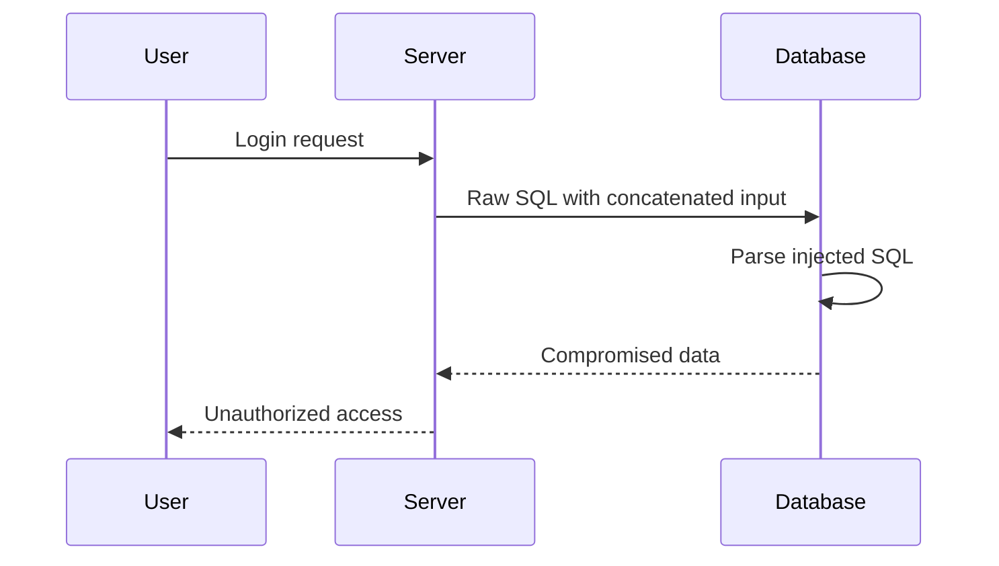
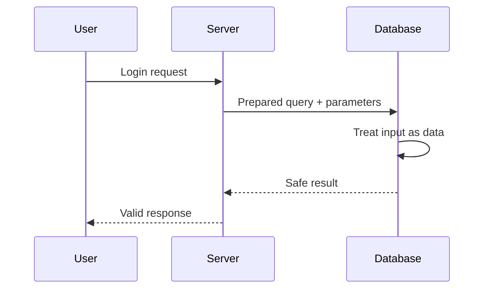
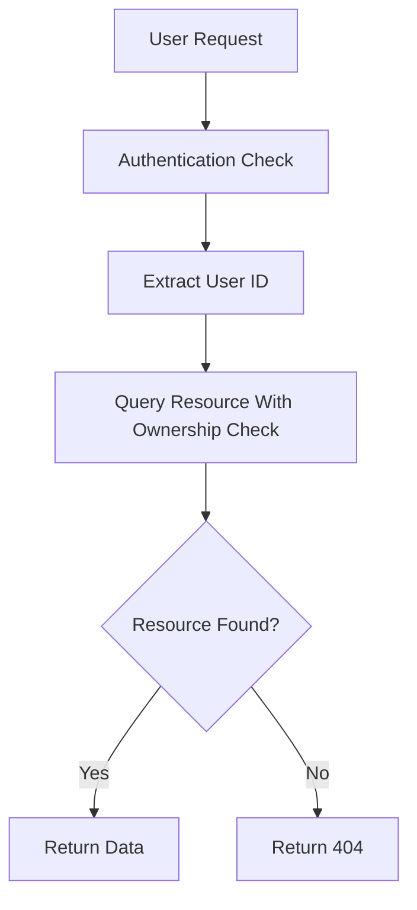
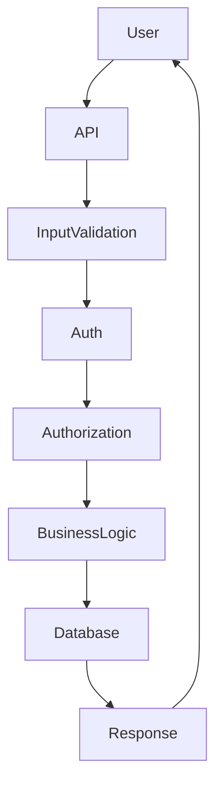

# Backend Security Fundamentals

Security is not a feature you add later. It is a **fundamental property of backend architecture**.

A backend server interacts with many external systems:

- Browsers
- Mobile apps
- Databases
- Operating systems
- Third-party APIs

Every interaction is a **trust boundary**. Attackers exploit these boundaries when applications fail to properly separate **user data** from **executable commands**.

This guide explains the most critical backend vulnerabilities and how professional systems defend against them.

---

# Understanding Injection Attacks

Injection attacks occur when **user input is interpreted as executable code instead of plain data**.

This typically happens when developers build commands using **string concatenation**.

## The Core Problem: Confusion Between Code and Data

Modern backend systems speak multiple languages:

| System | Language | Example |
|------|------|------|
| Database | SQL | `SELECT * FROM users` |
| Operating System | Shell commands | `rm file.txt` |
| Browser | HTML / JavaScript | `<script>alert()</script>` |

A vulnerability appears when **data from one language crosses into another language without protection**.

### Real World Analogy

Imagine a restaurant where customers write their order on a card.

Normal order:

```

Burger

```

But if the kitchen interprets instructions literally, a malicious customer could write:

```

Burger
Also fire the chef

````

If the kitchen blindly executes everything written on the card, chaos happens.

This is exactly what **injection attacks exploit**.

---

# SQL Injection: The Classic Backend Attack

SQL Injection is one of the most famous and dangerous vulnerabilities in backend systems.

It occurs when attackers manipulate SQL queries using crafted input.

---

## Scenario: A Simple Login System

Imagine a login form.

User submits:

- email
- password

The backend queries the database.

### Vulnerable Implementation

```javascript
const query = "SELECT * FROM users WHERE email = '" + userInputEmail + "'";
````

The developer combines **code + user data**.

This is extremely dangerous.

---

## The Expected Behavior (Happy Path)

User enters:

```
alice@gmail.com
```

Generated SQL query:

```sql
SELECT * FROM users WHERE email = 'alice@gmail.com'
```

Database returns Alice's account.

Everything works.

---

## The Attack

An attacker enters:

```
' OR '1'='1' --
```

The query becomes:

```sql
SELECT * FROM users WHERE email = '' OR '1'='1' --
```

### Why this works

| Part         | Meaning                    |
| ------------ | -------------------------- |
| `'`          | closes the original string |
| `OR '1'='1'` | always true condition      |
| `--`         | comment out rest of query  |

The final query now returns **all users**.

---

## Consequences

SQL injection can allow attackers to:

| Attack               | Impact                           |
| -------------------- | -------------------------------- |
| Login bypass         | Access accounts without password |
| Data extraction      | Dump entire database             |
| Data manipulation    | Modify user records              |
| Database destruction | Drop tables                      |

Example destructive payload:

```sql
DROP TABLE users;
```

---

## The Correct Solution: Parameterized Queries

Parameterized queries enforce **strict separation between code and data**.

### Secure Implementation

```javascript
const query = "SELECT * FROM users WHERE email = ?";
const result = await db.execute(query, [userInputEmail]);
```

Here:

* SQL structure is compiled first
* User input is inserted **as data only**

Even if attacker sends:

```
' OR '1'='1' --
```

The database interprets it as:

```
literal text
```

Not executable SQL.

---

## Query Flow Comparison

### Vulnerable System



### Secure System



---

# Command Injection

Command Injection targets the **operating system** instead of the database.

---

## Example Scenario

A backend resizes uploaded images using `ffmpeg`.

### Vulnerable Code

```javascript
const command = "ffmpeg -i input.jpg -o " + userFilename;
exec(command);
```

---

## Attacker Input

```
output.jpg; rm -rf /
```

Generated command:

```bash
ffmpeg -i input.jpg -o output.jpg; rm -rf /
```

Two commands now execute:

1. Resize image
2. Delete the entire system

---

## Secure Solution

Never construct shell commands using strings.

Use argument arrays.

```javascript
spawn("ffmpeg", ["-i", "input.jpg", "-o", userFilename]);
```

Now:

* command is fixed
* arguments are treated as literal data

No injection possible.

---

# Password Security: The Matryoshka Doll

Password protection requires **multiple layers of defense**.

Think of it like **nested security dolls**.

Each layer protects against a different type of attack.

---

# Layer 1: Hashing Passwords

Never store passwords in plain text.

Instead store **hashes**.

```javascript
const hashedPassword = hash(password);
```

Database stores:

```
8f434346648f6b96df89dda901c5176b
```

When user logs in:

```javascript
if(hash(inputPassword) === storedHash){
  loginSuccess();
}
```

---

# Problem: Rainbow Tables

Attackers created **rainbow tables**.

These are massive databases mapping:

```
password -> hash
```

Example:

| Password    | Hash     |
| ----------- | -------- |
| password123 | ef92b778 |
| admin       | 21232f29 |

If attacker steals hashed passwords, they can instantly reverse them.

---

# Layer 2: Salting

A **salt** is a unique random value added before hashing.

```javascript
hash(password + salt)
```

Example:

| User  | Password    | Salt  | Hash  |
| ----- | ----------- | ----- | ----- |
| Alice | password123 | X3s91 | a7e3d |
| Bob   | password123 | K92df | 91af2 |

Even though passwords match:

* hashes are different

Rainbow tables become useless.

---

# Layer 3: Slow Hashing

Modern GPUs can compute billions of hashes per second.

Attackers can brute force passwords.

Solution:

Use **slow hashing algorithms**.

Recommended algorithms:

| Algorithm | Status            |
| --------- | ----------------- |
| Argon2id  | Industry standard |
| bcrypt    | widely used       |
| scrypt    | memory intensive  |

Example:

```javascript
import bcrypt from "bcrypt";

const hash = await bcrypt.hash(password, 12);
```

Cost factor `12` makes hashing slow enough to prevent brute force attacks.

---

# Authentication vs Authorization

Many developers confuse these two.

| Concept        | Meaning                     |
| -------------- | --------------------------- |
| Authentication | Who are you?                |
| Authorization  | What are you allowed to do? |

Example:

User logs in successfully → authentication

User tries to access another person's data → authorization check required.

---

# Broken Object Level Authorization (BOLA)

BOLA is one of the most common API vulnerabilities.

---

## Vulnerable Endpoint

```
GET /invoices?id=123
```

Backend query:

```sql
SELECT * FROM invoices WHERE id = 123
```

The system checks **login status**, but not **ownership**.

Any logged-in user can access **any invoice**.

---

## Secure Query

```sql
SELECT * FROM invoices
WHERE id = 123
AND user_id = 456
```

Now the system verifies:

* invoice exists
* user owns it

---

## Secure Authorization Flow



---

# Why Return 404 Instead of 403?

Developers often return:

```
403 Forbidden
```

But this reveals that the resource **exists**.

Attackers can enumerate valid IDs.

Instead return:

```
404 Not Found
```

Now attackers cannot distinguish between:

* resource doesn't exist
* resource exists but unauthorized

This technique prevents **information leakage**.

---

# Security Best Practices for Backend Systems

## 1 Always Treat User Input as Hostile

Never trust:

* form inputs
* headers
* cookies
* query params
* file uploads

---

## 2 Use Parameterized Queries Everywhere

Never build SQL using string concatenation.

Always use:

* prepared statements
* ORM query builders

---

## 3 Avoid Shell Commands When Possible

Prefer native libraries instead of CLI tools.

Example:

Instead of:

```
ffmpeg
```

Use:

```
node video processing library
```

---

## 4 Use Strong Password Hashing

Use:

* Argon2id
* bcrypt
* scrypt

Never use:

* SHA256
* MD5

for passwords.

---

## 5 Enforce Authorization at the Database Level

Always verify resource ownership in queries.

Example:

```sql
WHERE user_id = current_user
```

---

# Security Architecture Overview



Security must exist **at every layer**.

---

# The Security Mindset

The most important lesson is a mental model.

Whenever you see code like this:

```javascript
const query = "something " + userInput;
```

You should immediately think:

> "This might be an injection vulnerability."

Always ask:

* Am I mixing **code and data**?
* Is there a **parameterized alternative**?
* Can this input cross a **trust boundary**?

Security is not about memorizing vulnerabilities.

It is about adopting a **paranoid mindset** where **user input is always treated as data — never executable code**.

This mindset is what separates beginner backend developers from professional backend engineers.