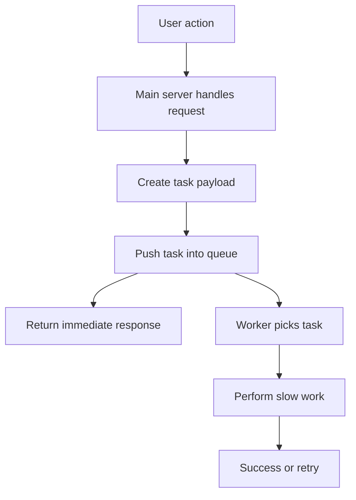
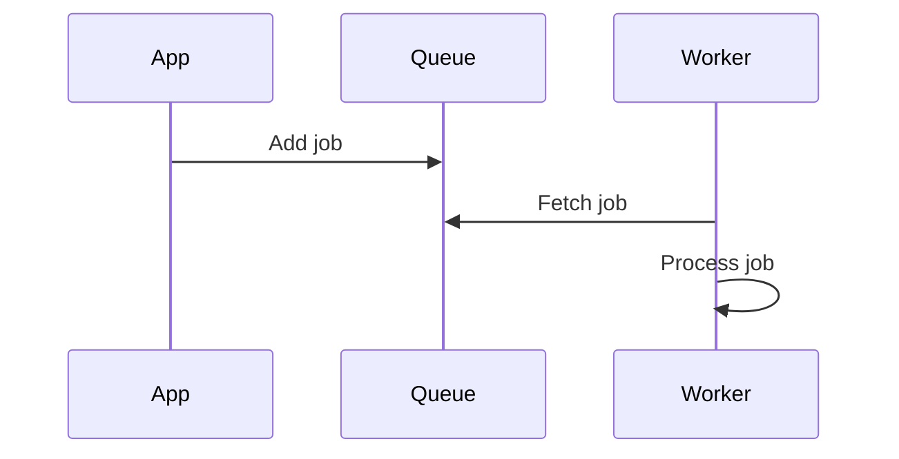
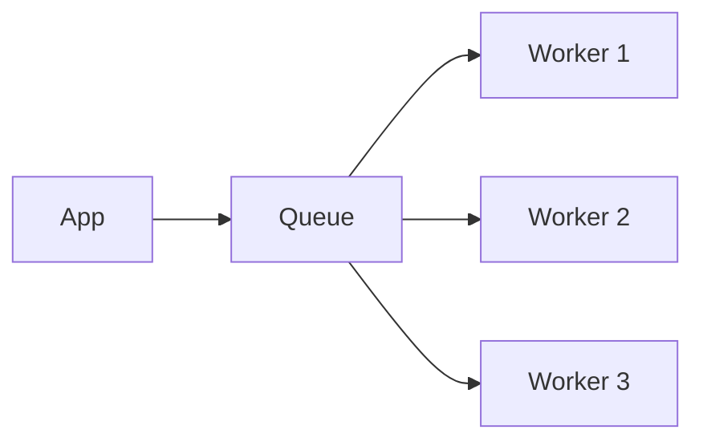
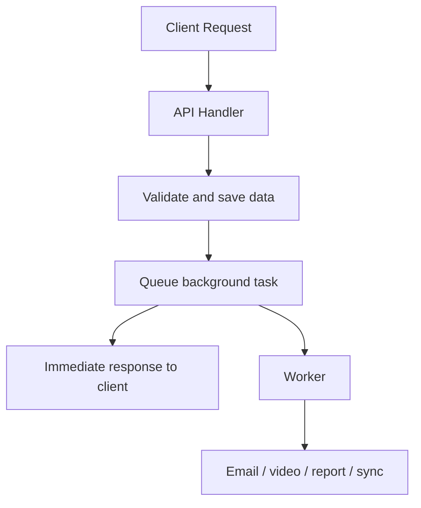

# Background Tasks and Task Queues

One of the biggest goals in backend engineering is to make applications feel **fast, smooth, and reliable**.

A user should not have to wait for every expensive operation to finish before they get a response.

That is where **background tasks** come in.

Background tasks let your server finish the user-facing request quickly while slower work continues separately in the background.

Examples of work that should often happen in the background:

- sending verification emails
- generating PDFs
- resizing images
- transcoding videos
- sending push notifications
- cleaning up deleted data
- syncing with third-party services
- running reports

This pattern is a core part of modern backend design because it improves:

- user experience
- resilience
- scalability
- reliability

---

# 1. Introduction: The Problem with Waiting

Imagine a user signing up for your app.

The sign-up flow may need to do several things:

1. validate input
2. create the user record
3. send a verification email
4. generate a welcome notification
5. respond to the browser

If all of that happens in one synchronous chain, the user must wait until everything finishes.

That can make the app feel slow, fragile, and frustrating.

---

## Why synchronous work is a problem

Suppose the email service is slow.

Then:

- your server waits
- the browser keeps spinning
- the user thinks something is broken
- the request may time out
- the whole sign-up may fail

### Analogy

Imagine checking into a hotel.

If the receptionist insists on personally carrying your bags to your room before giving you the key, the line becomes slow and painful.

A better hotel:

- gives you the key first
- sends the bags later
- does not block everyone behind you

That is the idea behind background tasks.

---

# 2. What is a Background Task?

A background task is any work performed **outside the main request-response cycle**.

In simple terms:

- the user makes a request
- the server does the important immediate work
- slower or non-critical tasks are handed off elsewhere
- the user gets a response quickly
- the extra work finishes in the background

---

## Definition

> A background task is a piece of code that runs outside the request-response lifecycle.

---

## Why it matters

Background tasks help when work is:

- slow
- expensive
- external
- not required immediately
- safe to complete later

### Examples

| Task | Why it should run in background |
|---|---|
| Sending email | External dependency may be slow |
| Processing video | CPU-heavy and time-consuming |
| Generating report | Not needed instantly |
| Syncing analytics | Can wait a few seconds or minutes |
| Cleaning up data | Can happen after response |

---

# 3. Synchronous vs Asynchronous

Understanding the difference between synchronous and asynchronous work is essential.

| Type | Meaning | User impact |
|---|---|---|
| Synchronous | One step must finish before the next starts | User waits longer |
| Asynchronous | Work is handed off and finishes later | User gets response sooner |

---

## Synchronous flow

```mermaid
sequenceDiagram
    participant User
    participant Server
    participant Email

    User->>Server: Sign up request
    Server->>Server: Validate input
    Server->>Email: Send verification email
    Email-->>Server: Confirmation
    Server-->>User: Response
````

The user waits for everything.

---

## Asynchronous flow

```mermaid
sequenceDiagram
    participant User
    participant Server
    participant Queue
    participant Worker
    participant Email

    User->>Server: Sign up request
    Server->>Queue: Enqueue email task
    Server-->>User: Immediate success response
    Worker->>Queue: Pick task
    Worker->>Email: Send verification email
    Email-->>Worker: Confirmation
```

The user gets a fast response while the email is handled separately.

---

# 4. The Task Queue

A task queue is the system that holds background jobs until a worker can process them.

Think of it as a **to-do list for the backend**.

Instead of doing the task immediately, the system writes it down and processes it later.

---

## The three main components

| Component         | Role                           |
| ----------------- | ------------------------------ |
| Producer          | Creates the task               |
| Queue / Broker    | Stores the task temporarily    |
| Consumer / Worker | Picks up and executes the task |

---

## 4.1 Producer

The producer is usually your main application code.

It decides:

* what work needs to happen
* what data the task should include
* when to add the task to the queue

### Example

After a user signs up, the app creates a task to send a verification email.

---

## 4.2 Queue / Broker

The queue is the middle layer that stores tasks until a worker processes them.

Common queue technologies include:

* RabbitMQ
* Redis Pub/Sub
* Redis queues
* BullMQ
* AWS SQS
* Kafka in some event-driven systems

The queue does not usually perform the work itself.
It acts as the reliable middleman.

---

## 4.3 Worker

The worker is a separate process that constantly watches the queue.

It:

* waits for new jobs
* pulls a task from the queue
* executes the task
* handles success or failure
* retries if needed

### Analogy

* Producer = person writing tasks on sticky notes
* Queue = board where sticky notes are placed
* Worker = employee who takes sticky notes and completes them

---

# 5. Why Background Tasks Matter

Background tasks solve a major backend problem:

**Do not block the user for work they do not need to wait for.**

---

## Benefits

| Benefit              | What it improves                                 |
| -------------------- | ------------------------------------------------ |
| Faster response time | User sees the app as responsive                  |
| Better reliability   | Failed third-party calls do not break everything |
| Better scalability   | Main server stays free for new requests          |
| Better resilience    | Tasks can be retried later                       |
| Better UX            | Users get immediate feedback                     |

---

# 6. The Sign-Up Example Reimagined

Let us look at the sign-up flow again, but this time properly designed.

---

## Step 1: User submits sign-up form

The browser sends the request.

```json
{
  "name": "Asha",
  "email": "asha@example.com",
  "password": "securePassword123"
}
```

---

## Step 2: Server validates and creates user

The backend:

* checks the input
* stores the user in the database
* generates verification data

This part is still synchronous because it is part of the core user creation process.

---

## Step 3: Server enqueues the email task

Instead of sending the email directly, the backend creates a task payload.

```json
{
  "userId": "user_123",
  "email": "asha@example.com",
  "verificationCode": "ABC123"
}
```

That payload is added to the queue.

---

## Step 4: Server responds immediately

The user gets an instant success response:

```json
{
  "message": "Sign-up successful. Please check your email."
}
```

The sign-up is no longer held hostage by email delivery speed.

---

## Step 5: Worker processes the email later

The worker picks the task from the queue and sends the email.

If the email provider is slow or unavailable, the worker can retry later.

---

# 7. Background Task Execution Flow



---

# 8. Why Decoupling Is So Important

Background tasks decouple the user request from the slow operation.

That means:

* the user does not wait for the slow work
* the slow work does not block the app
* failures in one part do not break the whole flow

---

## Example of decoupling

Suppose your app uses a third-party email provider.

If you call it directly during sign-up:

* your sign-up depends on that provider’s speed
* failures can break the user journey

If you enqueue the email:

* sign-up completes immediately
* email sending happens separately
* retries can happen later

This is a much safer architecture.

---

# 9. Reliability: What Happens When Tasks Fail?

Background task systems are often designed with retries.

If the task fails once, it may be retried.

If it fails again, it may be retried later with a delay.

This helps with temporary outages.

---

## Exponential backoff

Exponential backoff means the system waits longer between retries each time a failure happens.

Example:

| Attempt        | Delay     |
| -------------- | --------- |
| First failure  | 1 minute  |
| Second failure | 2 minutes |
| Third failure  | 4 minutes |
| Fourth failure | 8 minutes |

This prevents the worker from hammering a failing service over and over again.

### Why this matters

| Benefit                         | Explanation                       |
| ------------------------------- | --------------------------------- |
| Reduces load on failing service | Gives the service time to recover |
| Avoids constant retry loops     | Keeps the system stable           |
| Improves success rate           | Later retries often succeed       |

---

## Analogy

If a store is temporarily closed, you do not keep pounding on the door every second.

You wait a bit, then try again.

That is exponential backoff.

---

# 10. Common Use Cases for Background Tasks

Background tasks are useful everywhere in backend systems.

---

## 10.1 Sending emails

Email delivery often depends on external services.

This makes it a perfect background task.

Examples:

* verification email
* password reset email
* welcome email
* invoice email
* notification email

---

## 10.2 Processing images and videos

These tasks are CPU-heavy.

Examples:

* image compression
* generating thumbnails
* resizing uploads
* video encoding
* format conversion

These operations can take a long time and should not block the user request.

---

## 10.3 Generating reports

Report generation may involve:

* large database queries
* aggregations
* formatting
* file generation
* PDF creation

This is often done in the background or on a schedule.

### Example

A dashboard report may be generated:

* every night
* every hour
* when the user clicks “Export”

---

## 10.4 Sending push notifications

Push notifications depend on external platforms.

Examples:

* mobile push notifications
* browser push notifications
* device alerts

If the provider is slow, the user should not wait.

---

## 10.5 Batch operations

Batch jobs can be very large.

Examples:

* deleting a user and related data
* syncing data across systems
* migrating records
* refreshing caches
* recalculating scores

These are perfect for background processing.

---

# 11. Background Tasks vs Cron Jobs

These two ideas are related but not identical.

| Concept         | Meaning                              |
| --------------- | ------------------------------------ |
| Background task | Happens after a user action or event |
| Cron job        | Runs on a schedule                   |

---

## Background tasks

Triggered by events.

Example:

* user signs up
* send verification email

---

## Cron jobs

Triggered by time.

Example:

* every midnight
* generate daily report

---

## Analogy

* Background task = “Do this now, but not in the user’s request”
* Cron job = “Do this every day at 2:00 AM”

---

# 12. Task Payloads

A task payload is the data the worker needs to complete the job.

Usually this is a JSON object.

Examples:

```json
{
  "type": "sendEmail",
  "userId": "user_123",
  "email": "asha@example.com"
}
```

```json
{
  "type": "generateReport",
  "reportId": "report_456",
  "format": "pdf"
}
```

---

## What should go into a payload?

Only what the worker needs.

| Good payload data | Why                             |
| ----------------- | ------------------------------- |
| userId            | Needed to find user             |
| email             | Needed to send email            |
| reportId          | Needed to generate report       |
| template name     | Needed to choose email template |

### Avoid

| Bad payload idea               | Why not               |
| ------------------------------ | --------------------- |
| Huge unnecessary objects       | Bloats queue messages |
| Sensitive secrets              | Security risk         |
| Duplicate source-of-truth data | Can go stale          |

---

# 13. Idempotency and Background Jobs

Sometimes a task may run more than once.

That is normal in distributed systems.

Because of retries, workers should be designed carefully.

---

## What is idempotency?

A task is idempotent if running it multiple times has the same effective result as running it once.

### Example

Sending the same verification email twice may be annoying, but it may be acceptable.

Creating the same database record twice, however, can be a serious bug.

---

## Why this matters

Retries are useful, but they can also cause duplicate effects.

Good background systems often use:

* deduplication
* unique job IDs
* idempotent handlers
* status checks

---

# 14. Retry Safety

When a worker retries a task, it should avoid causing damage.

### Example problems

| Problem                | Risk               |
| ---------------------- | ------------------ |
| Duplicate emails       | User confusion     |
| Duplicate charges      | Financial disaster |
| Duplicate records      | Data corruption    |
| Repeated notifications | Bad UX             |

### Safer design

* use unique task IDs
* check whether the action already happened
* make operations safe to repeat

---

# 15. Common Queue Architectures

There are a few common ways to build task systems.

---

## Simple queue architecture



This is the basic model.

---

## Multiple workers



Multiple workers help increase throughput.

---

# 16. Example in JavaScript

Here is a simple conceptual example.

## Producer

```javascript
async function registerUser(req, res) {
  const { name, email, password } = req.body;

  // Assume validation and user creation already happened
  const user = {
    id: "user_123",
    name,
    email,
  };

  await taskQueue.enqueue("sendVerificationEmail", {
    userId: user.id,
    email: user.email,
    name: user.name,
  });

  return res.status(201).json({
    message: "Sign-up successful. Please check your email.",
  });
}
```

---

## Worker

```javascript
async function processJob(job) {
  if (job.type === "sendVerificationEmail") {
    const { email, name, userId } = job.payload;

    await emailService.send({
      to: email,
      subject: "Verify your account",
      body: `Hello ${name}, verify your account here: /verify/${userId}`,
    });
  }
}
```

This keeps the user request fast while the email work happens separately.

---

# 17. Where Background Tasks Fit in Backend Architecture



The user-facing request completes quickly.
The heavy work happens later.

---

# 18. Common Mistakes Beginners Make

| Mistake                                | Why it is bad                           |
| -------------------------------------- | --------------------------------------- |
| Doing slow work inside request handler | Makes the app feel slow                 |
| Waiting for email APIs directly        | External failures break the flow        |
| Not using retries                      | Temporary failures cause permanent loss |
| Making tasks too large                 | Harder to manage and retry              |
| Storing too much in payloads           | Queue becomes heavy and noisy           |
| Ignoring idempotency                   | Retries may duplicate side effects      |
| Using background tasks for everything  | Some work should still be synchronous   |

---

# 19. When Should Work Stay Synchronous?

Not everything belongs in the background.

Some actions need to happen immediately because the user depends on them right now.

Examples:

* login authentication
* payment authorization
* validation of critical input
* immediate permission checks
* saving essential user state

### Rule of thumb

| Use synchronous           | Use background                      |
| ------------------------- | ----------------------------------- |
| User must wait for result | User does not need immediate result |
| Blocking is unacceptable  | Delay is acceptable                 |
| Required for correctness  | Helpful but not urgent              |

---

# 20. Practical Mental Model

Ask these questions:

1. Does the user need the result right now?
2. Is the task slow or external?
3. Can the work happen safely later?
4. Can the task be retried if it fails?

If the answers suggest “yes, later is fine,” then a background task is probably the right choice.

---

# 21. Key Takeaways

| Concept             | Meaning                                      |
| ------------------- | -------------------------------------------- |
| Background task     | Work done outside the request-response cycle |
| Task queue          | Temporary system that stores jobs            |
| Producer            | Adds jobs to the queue                       |
| Worker              | Processes jobs in the background             |
| Retry               | Re-attempts a failed task                    |
| Exponential backoff | Wait longer between retries                  |
| Idempotency         | Safe repeated execution                      |
| Cron job            | Scheduled background execution               |

---

# 22. Conclusion

Background tasks are one of the most important tools for building responsive backend systems.

They let you separate:

* the fast user-facing path
* the slower internal work

That separation improves:

* speed
* resilience
* reliability
* scale
* user experience

The most important idea to remember is this:

**Not every action must finish before the user gets a response.**

If a task is slow, non-critical, or dependent on external services, push it to a background worker and let the main app stay fast.

That simple design choice is a big part of what makes modern applications feel instant and professional.