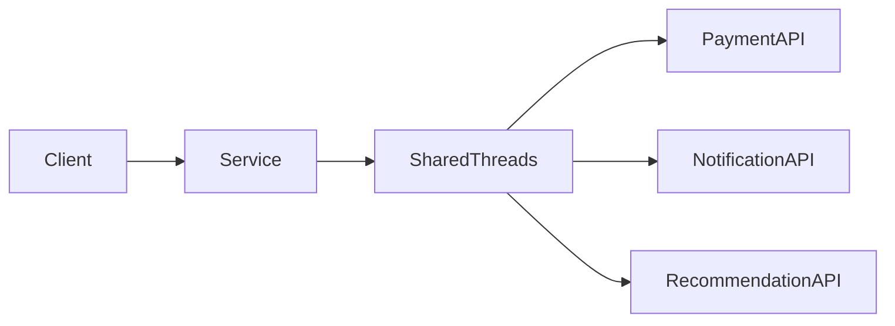
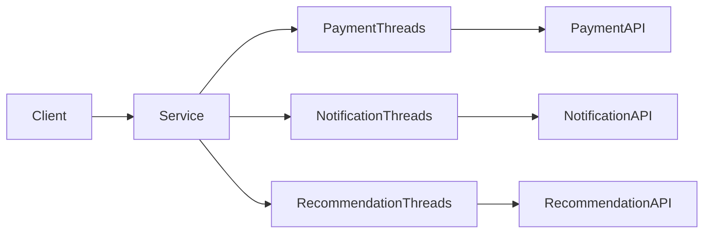
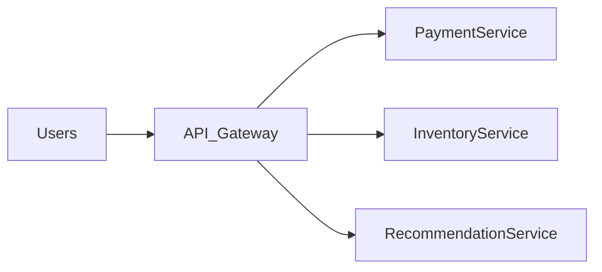
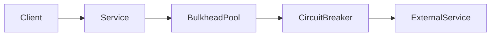
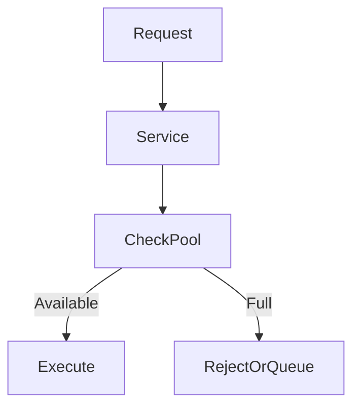

# Bulkhead Pattern

In distributed systems, multiple services often share **common resources** such as:

- thread pools  
- database connections  
- CPU  
- memory  
- network bandwidth  

If one component consumes too many resources due to heavy traffic or failure, it can **exhaust shared resources** and affect the entire system.

The **Bulkhead Pattern** solves this problem by **isolating resources into separate pools**, so failure in one component does not affect others.

> The Bulkhead Pattern divides system resources into isolated compartments to prevent a single failure from bringing down the entire system.

This idea comes from **ship engineering**.

Ships are divided into **watertight compartments (bulkheads)**. If one compartment floods, the water does not spread to the entire ship.

Similarly, software bulkheads **limit failure impact**.

---

# The Problem: Resource Contention

Consider a service handling multiple types of operations:

- payment processing  
- product search  
- order history  
- recommendation engine  

All these features may share the same **thread pool**.

If the recommendation engine suddenly receives heavy traffic or becomes slow, it might occupy all available threads.

As a result:

- payment requests wait
- order history requests slow down
- the entire system experiences high latency

---

## Resource Contention Example

```mermaid
flowchart LR
    Users --> Application
    Application --> SharedThreadPool
    SharedThreadPool --> PaymentService
    SharedThreadPool --> RecommendationService
    SharedThreadPool --> OrderService
````

If **RecommendationService becomes slow**, it consumes most threads, affecting other services.

---

# Solution: Bulkhead Isolation

The Bulkhead Pattern separates system resources into **independent pools**.

Each critical component gets its **own isolated resources**.

Example separation:

* Payment thread pool
* Recommendation thread pool
* Order processing thread pool

Now if one service fails, other services continue functioning.

---

## Bulkhead Architecture

```mermaid
flowchart LR
    Users --> Application
    Application --> PaymentPool
    Application --> RecommendationPool
    Application --> OrderPool

    PaymentPool --> PaymentService
    RecommendationPool --> RecommendationService
    OrderPool --> OrderService
```

Failures remain **isolated within their own compartment**.

---

# Real-World Analogy

Imagine a large restaurant kitchen.

Different chefs are responsible for different stations:

* grill station
* dessert station
* salad station

If the **dessert station becomes overloaded**, it does not stop the grill chef from cooking burgers.

Each station has its **own workspace and tools**.

This separation prevents one section from affecting the entire kitchen.

---

# Types of Bulkhead Isolation

Bulkhead patterns can be implemented in several ways.

| Type                      | Description                                  |
| ------------------------- | -------------------------------------------- |
| Thread Pool Isolation     | Separate thread pools for different services |
| Connection Pool Isolation | Separate database connection pools           |
| Process Isolation         | Different services run in separate processes |
| Container Isolation       | Services run in separate containers          |
| Resource Quotas           | Limit CPU or memory usage per service        |

---

# Thread Pool Isolation

Thread pool isolation is the **most common implementation**.

Each dependency uses its **own thread pool**.

---

## Without Thread Isolation



A slow dependency can **consume all threads**.

---

## With Thread Isolation



Each dependency is **isolated**.

---

# Bulkheads in Microservices Architecture

Microservices naturally support bulkheads because each service runs independently.



Each microservice can have:

* separate infrastructure
* independent scaling
* dedicated resource pools

This prevents one service from overwhelming others.

Companies like Netflix use bulkhead strategies to protect microservices from cascading failures.

---

# Bulkhead vs Circuit Breaker

Both patterns help improve **system resilience**, but they address different problems.

| Pattern         | Purpose                                           |
| --------------- | ------------------------------------------------- |
| Bulkhead        | Isolates resources to prevent resource exhaustion |
| Circuit Breaker | Stops requests to failing services                |

They are often used **together**.

---

## Combined Architecture



Bulkhead protects **resources**, while circuit breaker prevents **repeated failed calls**.

---

# Example Scenario: Video Streaming Platform

Consider a streaming platform that provides:

* video playback
* recommendations
* comments
* analytics

If the **recommendation engine becomes slow**, the system should still allow users to **watch videos**.

Bulkhead isolation ensures:

| Component       | Resource Pool         |
| --------------- | --------------------- |
| Video streaming | Dedicated thread pool |
| Recommendations | Separate thread pool  |
| Comments        | Separate pool         |
| Analytics       | Background workers    |

Even if analytics processing becomes heavy, **video streaming remains unaffected**.

Platforms like YouTube and Netflix rely on resource isolation strategies.

---

# Implementing Bulkheads

Bulkheads can be implemented at different levels.

## Application Level

Separate thread pools inside the application.

Example:

```javascript
const paymentPool = new ThreadPool(20);
const recommendationPool = new ThreadPool(10);
const orderPool = new ThreadPool(15);
```

Each operation uses its **own thread pool**.

---

## Infrastructure Level

Cloud platforms allow resource isolation using containers.

Example technologies:

* Docker
* Kubernetes

Each service runs in **separate containers with defined resource limits**.

---

# Bulkhead State Flow



If a pool is **full**, requests may be:

* rejected
* queued
* redirected to fallback

---

# Advantages of Bulkhead Pattern

| Benefit                    | Explanation                                |
| -------------------------- | ------------------------------------------ |
| Failure isolation          | One service failure does not impact others |
| Better resource management | Prevents resource exhaustion               |
| Improved reliability       | System remains partially operational       |
| Controlled degradation     | Non-critical features can fail safely      |

---

# Trade-offs and Challenges

Bulkhead isolation also introduces complexity.

| Challenge                         | Explanation                            |
| --------------------------------- | -------------------------------------- |
| Resource fragmentation            | Idle resources cannot be reused easily |
| Configuration complexity          | Requires tuning thread pool sizes      |
| Increased infrastructure overhead | More pools and services                |

Proper **capacity planning** is important.

---

# Monitoring Bulkhead Systems

Bulkheads should be monitored to ensure pools are not overloaded.

Important metrics include:

* thread pool utilization
* queue length
* request latency
* failure rates

Monitoring tools include:

* Prometheus
* Grafana

These tools help identify when resource pools need scaling.

---

# Best Practices

### Isolate Critical Services

Critical operations such as **payments or authentication** should always have dedicated resources.

---

### Limit Pool Sizes

Pools should be large enough for peak load but small enough to prevent runaway resource usage.

---

### Combine with Other Resilience Patterns

Bulkheads work best with:

* retries
* timeouts
* circuit breakers
* rate limiting

These patterns together create **fault-tolerant systems**.

---

# Summary

The **Bulkhead Pattern** is a resilience strategy used in distributed systems to **isolate resources and contain failures**.

Instead of allowing all services to share the same resources, the system divides them into **independent compartments**.

Key ideas include:

* isolate resource pools
* prevent cascading failures
* maintain system availability even when some components fail

By applying bulkhead isolation, large-scale systems can remain **stable and responsive**, even during partial outages or heavy traffic conditions.