# Caching in Distributed Systems

## Introduction

Modern applications serve **millions of users** and process enormous volumes of data. If every request directly hits the database, the system quickly becomes **slow, expensive, and difficult to scale**.

Consider a simple example:

A social media platform loads a user's profile page. The page requires:

- User profile information
- Posts
- Followers count
- Recommendations

If every page view queries the database, the database becomes the **performance bottleneck**.

Caching solves this problem by **storing frequently accessed data in a faster storage layer**, allowing the system to serve repeated requests quickly.

In essence:

> **Caching stores computed or retrieved data temporarily so that future requests can be served faster.**

---

# Why Caching Is Important

Caching improves system performance in multiple ways.

| Benefit | Explanation |
|------|------|
| Reduced latency | Data is served from faster memory instead of slower storage |
| Reduced database load | Fewer queries hit the database |
| Higher throughput | System can serve more requests |
| Cost reduction | Fewer expensive database operations |
| Better scalability | Backend services handle less load |

Without caching:

```mermaid
flowchart LR
    Client --> Application
    Application --> Database
````

Every request must wait for the database.

With caching:

```mermaid
flowchart LR
    Client --> Application
    Application --> Cache
    Cache --> Database
```

Most requests are served directly from the **cache**, avoiding expensive database operations.

---

# How Caching Works

The fundamental caching workflow is simple.

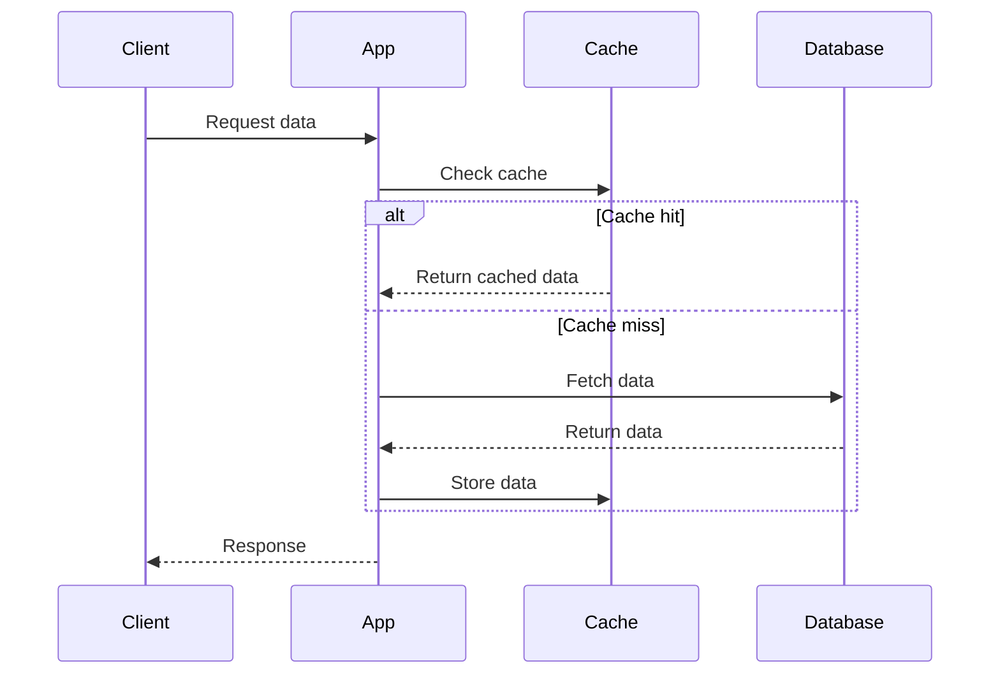

Key ideas:

| Term               | Meaning                   |
| ------------------ | ------------------------- |
| Cache hit          | Data found in cache       |
| Cache miss         | Data not present in cache |
| Cache fill         | Data stored after a miss  |
| Cache invalidation | Removing outdated data    |

---

# Cache Layers

Large-scale systems often use **multiple layers of caching**, each with different performance characteristics.

## Overview of Cache Layers

| Layer             | Location        | Speed     | Use Case         |
| ----------------- | --------------- | --------- | ---------------- |
| Browser Cache     | Client device   | Very fast | Static assets    |
| CDN Cache         | Edge servers    | Very fast | Global content   |
| Application Cache | App servers     | Fast      | Computed results |
| Distributed Cache | Network service | Fast      | Shared cache     |
| Database Cache    | Inside DB       | Moderate  | Query results    |

---

# 1. Browser Cache

The first caching layer exists inside the **user's browser**.

Example cached content:

* Images
* CSS
* JavaScript
* Fonts

Architecture:

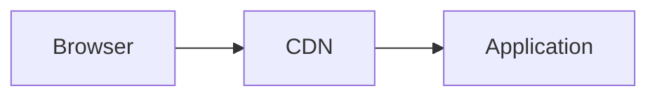

If assets are cached locally, the browser **does not send a network request**.

---

# 2. CDN Cache

A **Content Delivery Network (CDN)** caches content closer to users.

Example scenario:

A user in Japan accesses a website hosted in the US.

Without CDN:

```
User → US server
```

With CDN:

```
User → Local CDN edge server
```

Architecture:

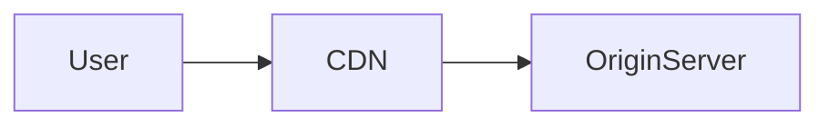

Benefits:

| Benefit                   | Explanation                           |
| ------------------------- | ------------------------------------- |
| Reduced latency           | Content served from nearby location   |
| Reduced server load       | Origin server receives fewer requests |
| Better global performance | Faster international access           |

---

# 3. Application Cache

Application servers often cache data **inside memory**.

Example:

```javascript
const cache = new Map();

function getUser(id) {
  if (cache.has(id)) {
    return cache.get(id);
  }

  const user = database.getUser(id);
  cache.set(id, user);
  return user;
}
```

Advantages:

* Extremely fast
* No network calls

Limitations:

| Problem                     | Explanation                   |
| --------------------------- | ----------------------------- |
| Memory limits               | Cannot store large datasets   |
| Inconsistent across servers | Each server has its own cache |

---

# 4. Distributed Cache

Distributed caching systems provide a **shared cache accessible by all services**.

Examples include in-memory data stores used as caches.

Architecture:

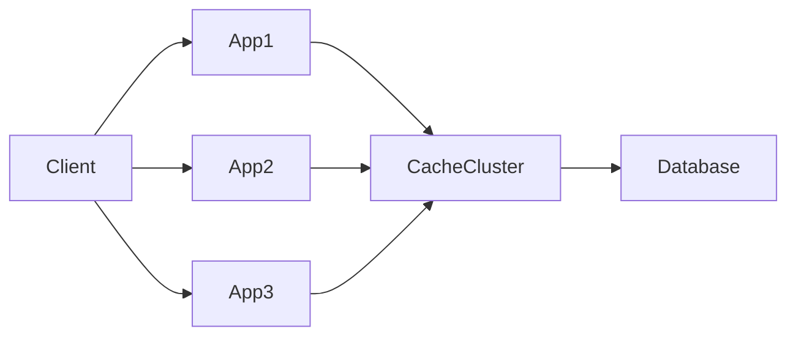

Benefits:

| Benefit                | Explanation                  |
| ---------------------- | ---------------------------- |
| Shared cache           | All servers access same data |
| High performance       | In-memory storage            |
| Horizontal scalability | Cache nodes can scale        |

---

# Cache Eviction Policies

Cache memory is limited. When the cache becomes full, some entries must be removed.

Eviction policies decide **which data to remove**.

---

# 1. LRU (Least Recently Used)

LRU removes the **least recently accessed item**.

Example sequence:

```
Access order:
A → B → C → D
```

If cache is full and a new item arrives:

```
Remove A
```

Diagram:

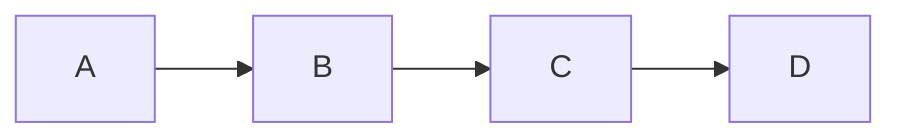

Advantages:

* Works well for most workloads
* Keeps frequently used data

---

# 2. LFU (Least Frequently Used)

LFU removes items accessed **least frequently**.

Example:

| Item | Access Count |
| ---- | ------------ |
| A    | 20           |
| B    | 15           |
| C    | 3            |

LFU removes **C**.

Advantages:

* Retains highly popular data

Disadvantages:

* More complex bookkeeping

---

# 3. FIFO (First In First Out)

FIFO removes the **oldest inserted item**.

Example:

```
Insert order:
A → B → C → D
```

Eviction removes **A**.

Simple but less optimal for real workloads.

---

# 4. TTL (Time To Live)

Entries expire after a **fixed time duration**.

Example:

```
Cache user profile for 10 minutes
```

After 10 minutes:

```
Cache entry removed
```

TTL is commonly used for **dynamic data**.

---

# Caching Patterns

Caching patterns define **how applications interact with caches**.

---

# 1. Cache Aside (Lazy Loading)

This is the most common caching strategy.

Workflow:

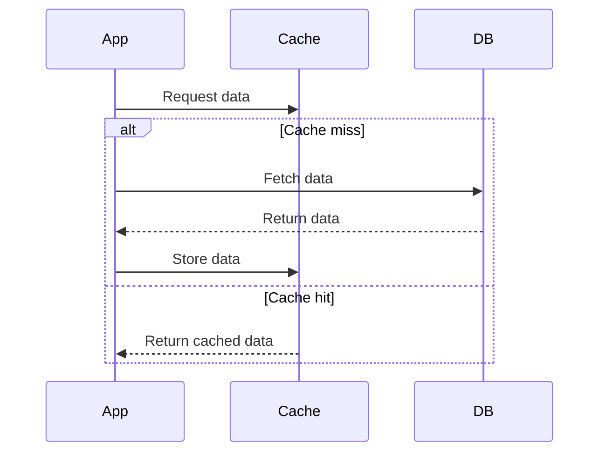

Advantages:

| Advantage | Explanation                |
| --------- | -------------------------- |
| Simple    | Easy to implement          |
| Efficient | Only caches requested data |

Drawback:

* Cache miss causes database query.

---

# 2. Write Through Cache

In this pattern, writes go to **both cache and database simultaneously**.

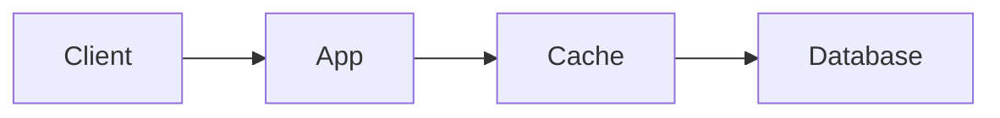

Advantages:

* Cache always consistent with database.

Disadvantages:

* Higher write latency.

---

# 3. Write Back (Write Behind)

Writes first go to the **cache**, then asynchronously written to the database.

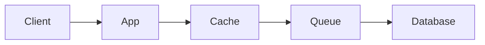

Advantages:

| Benefit               | Explanation                      |
| --------------------- | -------------------------------- |
| Faster writes         | Database writes are asynchronous |
| Reduced database load | Writes can be batched            |

Risks:

* Data loss if cache crashes before flush.

---

# 4. Write Around Cache

Writes bypass cache and go directly to the database.

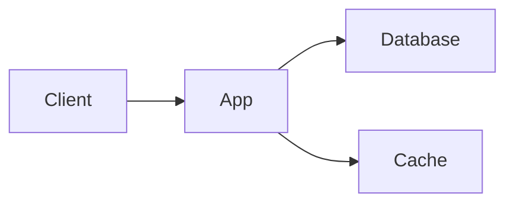

Cache is updated **only when data is read**.

Advantages:

* Avoids caching unnecessary writes.

Disadvantages:

* Higher cache miss rate.

---

# Cache Invalidation

Cache invalidation ensures **stale data is removed**.

Strategies include:

| Strategy                 | Explanation                  |
| ------------------------ | ---------------------------- |
| TTL expiration           | Automatic removal after time |
| Write invalidation       | Delete cache entry on update |
| Event-based invalidation | Update triggered by events   |

Example flow:

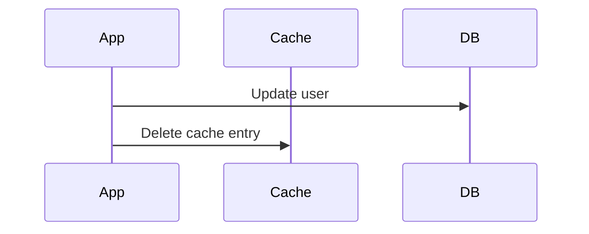

---

# Cache Stampede (Thundering Herd)

If a popular cache entry expires, many requests hit the database simultaneously.

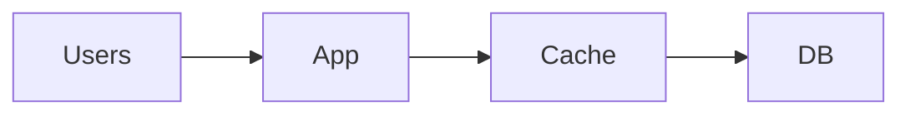

Mitigation strategies:

* Request coalescing
* Cache locking
* Staggered TTL
* Background refresh

---

# Multi Layer Cache Architecture

Large systems often combine multiple caching layers.

Example architecture:

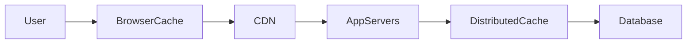

Benefits:

| Layer             | Purpose                 |
| ----------------- | ----------------------- |
| Browser           | Reduce network requests |
| CDN               | Global distribution     |
| Application       | Fast local lookups      |
| Distributed cache | Shared fast storage     |

---

# Choosing What to Cache

Good candidates for caching:

| Data Type            | Example                |
| -------------------- | ---------------------- |
| Frequently read data | User profiles          |
| Computation results  | Recommendation results |
| Static data          | Product catalog        |
| Expensive queries    | Aggregated metrics     |

Poor candidates:

| Data Type             | Reason              |
| --------------------- | ------------------- |
| Rapidly changing data | Cache becomes stale |
| Rarely accessed data  | Waste of memory     |

---

# Trade-offs of Caching

Caching introduces complexity.

| Advantage             | Trade-off                     |
| --------------------- | ----------------------------- |
| Faster reads          | Cache consistency challenges  |
| Reduced database load | Cache invalidation complexity |
| High scalability      | Additional infrastructure     |

Caching must be carefully designed to **balance performance and correctness**.

---

# Summary

Caching is one of the most powerful techniques for building **high-performance distributed systems**.

Key concepts:

| Concept            | Meaning                        |
| ------------------ | ------------------------------ |
| Cache layers       | Multiple caching levels        |
| Eviction policies  | Decide which data to remove    |
| Cache patterns     | Define read/write interactions |
| Cache invalidation | Ensures data freshness         |

A well-designed caching architecture can:

* Reduce system latency dramatically
* Scale applications to millions of users
* Protect backend databases from overload

However, caching introduces challenges such as **stale data, invalidation complexity, and consistency issues**, requiring careful system design.