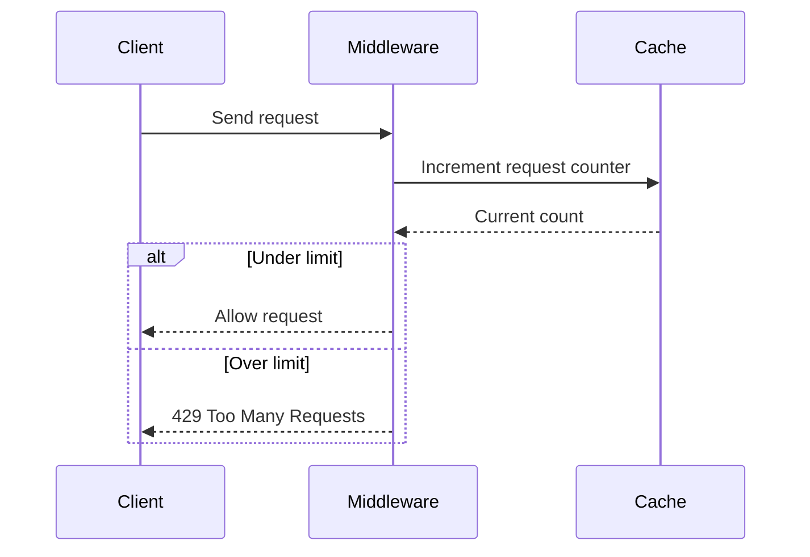

# Caching Explained: The Secret to a Faster Internet

Caching is one of the most important performance techniques in backend engineering.

At a high level, caching means:

- store frequently used data in a faster place
- avoid repeating expensive work
- reduce latency
- reduce load on the primary system

The core idea is simple:

**Do expensive work once, save the result, and reuse it many times.**

That small idea powers:

- faster websites
- smoother apps
- lower database load
- better scalability
- less cost

---

# 1. What is Caching?

Caching is the process of storing a subset of data in a temporary, fast-access location so that it can be retrieved quickly later.

Instead of doing the same expensive operation again and again, the system:

1. performs the operation once
2. stores the result
3. serves the stored result next time

---

## Why caching exists

Computing has a constant trade-off:

| Goal | Problem |
|---|---|
| Speed | Fast systems are often more expensive |
| Scale | Large systems are often slower without optimization |
| Cost | Recomputing everything repeatedly wastes resources |

Caching helps solve this trade-off by keeping useful data close to where it is needed.

---

## Simple analogy

Imagine you are solving math problems.

If the same formula appears repeatedly, you do not recompute it from scratch every time.  
You remember the answer or keep a shortcut.

Caching works the same way.

---

# 2. Why Caching Matters

Without caching, systems waste time doing repeated work.

That repeated work could be:

- database queries
- API calls
- expensive calculations
- file reads
- image delivery
- DNS resolution

Caching reduces the cost of all of these.

---

## Main benefits

| Benefit | What it improves |
|---|---|
| Lower latency | Responses feel faster |
| Reduced server load | Fewer requests hit the main system |
| Better scalability | More users can be served |
| Lower cost | Less compute and database usage |
| Better UX | Apps feel instant and smooth |

---

# 3. Caching in the Wild

Caching appears in many places you already use every day.

---

## 3.1 Google Search: Avoiding Repetitive Work

Search engines perform expensive work:

- crawling
- indexing
- ranking
- relevance scoring

If millions of users search the same common query, recomputing that result every time would be wasteful.

### How caching helps

| Step | What happens |
|---|---|
| First request | System computes result |
| Cache store | Result is saved |
| Next request | Cached result is returned instantly |

### Cache miss vs cache hit

| Event | Meaning |
|---|---|
| Cache miss | Data not found in cache, so system computes it |
| Cache hit | Data found in cache, so system returns it immediately |

### Analogy

The first person asks a teacher a question.  
The teacher explains it fully.

The next student asks the same question.  
Instead of redoing the whole explanation, the teacher gives the short answer immediately.

That is caching.

---

## 3.2 Netflix Streaming: Bringing Content Closer to You

Video files are huge.

Sending them from one central server to users all over the world would create delays and buffering.

### The problem

If a user in India requests a video stored far away in another region, the physical distance increases latency.

### The solution

Netflix uses **CDNs** and edge locations.

That means content is cached closer to users.

| Component | Purpose |
|---|---|
| Origin server | Main source of truth |
| Edge server | Nearby copy for fast delivery |
| CDN | Network that connects them |

### Analogy

Instead of going to the main warehouse in another city, you buy from the local shop.

The product is the same, but delivery is much faster.

---

## 3.3 X Trends: Calculate Once, Serve Many Times

Trending topics are expensive to compute.

The system must analyze huge volumes of data and identify what is hot right now.

If every user request triggered a fresh calculation, the system would collapse.

### Better strategy

- calculate trends periodically
- store the result in cache
- serve that cached list to many users

### Why this works

Trending data is useful even if it is slightly stale.

It does not always need to be perfectly real-time to be valuable.

### Analogy

A news channel does not rewrite the entire world from scratch every second.  
It updates on intervals and reuses the latest summary.

---

# 4. The Three Levels of Caching

Caching can happen at different levels in a system.

| Level | Primary purpose | Example |
|---|---|---|
| Network level | Speed up content delivery | CDNs, DNS |
| Hardware level | Speed up CPU access | RAM and CPU cache |
| Software level | Speed up application logic | Redis, Memcached |

---

## 4.1 Network caching

Network caching reduces how far data has to travel.

Examples:

- CDN edge caching
- browser caching
- DNS caching
- proxy caching

---

## 4.2 Hardware caching

Hardware caching uses extremely fast memory close to the CPU.

This helps the processor access instructions and data quickly.

Examples:

- CPU cache
- RAM
- memory hierarchy

---

## 4.3 Software caching

Software caching is used by developers to speed up apps.

Examples:

- cache database query results
- cache session data
- cache API responses
- cache computed values

This is where tools like Redis shine.

---

# 5. Network Caching: The Internet’s Backbone

Network caching is about reducing physical distance and network hops.

---

## 5.1 CDN workflow

A Content Delivery Network (CDN) is a system of distributed servers that cache content closer to users.

### Typical flow

```mermaid
sequenceDiagram
    participant User
    participant DNS
    participant Edge as Edge Server
    participant Origin as Origin Server

    User->>DNS: Request resource
    DNS->>Edge: Route to nearby edge
    Edge->>Edge: Check cache
    alt Cache hit
        Edge-->>User: Serve cached content
    else Cache miss
        Edge->>Origin: Fetch from origin
        Origin-->>Edge: Return content
        Edge->>Edge: Store in cache
        Edge-->>User: Serve content
    end
````

### Why this is powerful

| Benefit                | Explanation                        |
| ---------------------- | ---------------------------------- |
| Less latency           | User gets nearby content           |
| Less origin load       | Main server handles fewer requests |
| Faster global delivery | Same site feels fast everywhere    |

---

## 5.2 DNS caching

DNS is the internet’s phonebook.

It translates names like `example.com` into IP addresses.

Without caching, every lookup would be slow.

### DNS lookup path

1. Device asks resolver
2. Resolver asks root server
3. Root points to TLD server
4. TLD points to authoritative server
5. IP address is returned

That is too much work to repeat constantly.

### Why DNS caching helps

DNS results are cached at multiple levels:

* browser
* operating system
* ISP resolver
* intermediate infrastructure

### Analogy

If you always had to ask five different people for the same street address, life would be slow.

Caching the address saves time.

---

# 6. Software Caching: The Developer’s Toolkit

Software caching is one of the most common backend performance tools.

It is usually implemented using in-memory systems such as:

* Redis
* Memcached

These systems keep data in RAM, which is much faster than disk.

---

## Why RAM is fast

RAM is designed for quick direct access.

| Feature      | RAM                          | Disk                      |
| ------------ | ---------------------------- | ------------------------- |
| Access speed | Very fast                    | Slower                    |
| Persistence  | Volatile                     | Permanent                 |
| Best use     | Temporary high-speed storage | Durable long-term storage |

Because caching only needs temporary storage, RAM is ideal.

---

## Why in-memory caches are useful

They are great when you need:

* low-latency reads
* fast repeated access
* temporary storage
* high-throughput request handling

### Analogy

Disk storage is your archive room.
RAM cache is your desk.

The things on your desk are the things you use often.

---

# 7. Cache Hit and Cache Miss

These two terms are central to caching.

| Term       | Meaning                 |
| ---------- | ----------------------- |
| Cache hit  | Data found in cache     |
| Cache miss | Data not found in cache |

---

## Cache hit

A cache hit means the system can answer immediately.

### Benefits

* very fast response
* no expensive recomputation
* less load on primary storage

---

## Cache miss

A cache miss means the system must go to the source of truth.

That might be:

* database
* external API
* computation engine
* file system

Then the result is often written back into cache for next time.

---

## Cache flow

```mermaid
flowchart TD
    A[Request arrives] --> B{In cache?}
    B -- Yes --> C[Serve cached data]
    B -- No --> D[Fetch from source]
    D --> E[Store in cache]
    E --> F[Return response]
```

---

# 8. Caching Strategies

There are different ways to decide when to store data in a cache.

---

## 8.1 Lazy caching / cache-aside

This is the most common strategy.

### How it works

1. App checks cache first
2. If data exists, return it
3. If not, fetch from database
4. Store fetched result in cache
5. Return result

### Pros

| Advantage | Explanation                            |
| --------- | -------------------------------------- |
| Simple    | Easy to understand and implement       |
| Efficient | Only caches data that is actually used |
| Flexible  | Good for many backend use cases        |

### Cons

| Disadvantage              | Explanation                              |
| ------------------------- | ---------------------------------------- |
| First request slower      | Cache miss still hits the database       |
| Cache invalidation needed | Updated data must be refreshed carefully |

### Analogy

You look in your pocket first.
If the key is there, great.
If not, you go get it from the drawer and then place a copy in your pocket for next time.

---

## 8.2 Write-through caching

This is a proactive strategy.

### How it works

When data is written:

* write to database
* write to cache at the same time

### Pros

| Advantage             | Explanation                              |
| --------------------- | ---------------------------------------- |
| Fresh cache           | Cache stays consistent with the database |
| Fast reads later      | Data is already cached                   |
| Reliable for hot data | Useful when values are frequently read   |

### Cons

| Disadvantage    | Explanation                         |
| --------------- | ----------------------------------- |
| Slower writes   | Every write updates multiple places |
| More complexity | Needs careful coordination          |

### Analogy

Whenever you write a note in your notebook, you also copy it to your sticky note immediately.

The sticky note is always up to date.

---

# 9. Eviction Policies

Cache memory is limited.

When it gets full, the system must decide what to remove.

That decision is called an **eviction policy**.

---

## 9.1 No eviction

The simplest policy.

When the cache is full, it refuses new data.

### Problem

This is usually not practical for large systems.

---

## 9.2 LRU: Least Recently Used

LRU removes the item that has not been used for the longest time.

### Why it works

If something has not been accessed recently, it may be less important.

### Example

If the cache is full and a new item must be stored, remove the item last used yesterday instead of one used one minute ago.

### Analogy

Your desk is full, so you remove the paper you have not touched in the longest time.

---

## 9.3 LFU: Least Frequently Used

LFU removes the item used the least often.

### Why it works

Items that are rarely accessed may not deserve space.

### Example

| Key | Access count |
| --- | ------------ |
| A   | 5 times      |
| B   | 23 times     |

If space is needed, key A may be removed first.

### Analogy

A book that nobody borrows in the library may get archived to make room for popular books.

---

## 9.4 TTL: Time To Live

TTL gives each item an expiration time.

After that time passes, the item is automatically removed.

### Why it works

Some data is only useful for a short period.

Examples:

* auth tokens
* temporary search results
* rate limit counters
* one-time verification data

### Analogy

A fresh meal has an expiration date.
After that, it should not be served.

---

# 10. Core Caching Policies Compared

| Policy      | What it removes            | Best for                    |
| ----------- | -------------------------- | --------------------------- |
| No eviction | Nothing until full         | Simple fixed-size use cases |
| LRU         | Least recently used item   | General-purpose caches      |
| LFU         | Least frequently used item | Popularity-based workloads  |
| TTL         | Expired items              | Temporary data              |

---

# 11. Four Common Use Cases for Developers

Caching is used constantly in backend systems.

---

## 11.1 Database query caching

This is one of the most common uses.

When a query is slow or runs often, caching the result can save a lot of database work.

### Example

* product details page
* homepage feed
* category listings
* dashboard summaries

### Why it helps

If the same query is requested repeatedly, the system can return the cached result instead of hitting the database every time.

### Best when

* reads are frequent
* writes are less frequent
* data can tolerate short delays in freshness

---

## 11.2 Session storage

Sessions are frequently checked during authentication.

Caching sessions in memory is much faster than storing every lookup in a slower database.

### Example

A user logs in.

The app stores:

* session token
* user ID
* expiration
* permissions

This data is checked on every request.

Caching it improves performance massively.

---

## 11.3 API response caching

External APIs often have limits and costs.

Caching their responses helps you avoid:

* rate limit problems
* slow network calls
* unnecessary billing

### Example

A weather API response for a city might not need to be fetched every second.

It can be cached for a short time.

---

## 11.4 Rate limiting

Rate limiting is often built using caching because it needs very fast reads and writes.

### How it works

1. request arrives
2. identify user or IP
3. increment counter in cache
4. check whether limit exceeded
5. allow or reject request

### Example flow



### Why cache is ideal here

Rate limiting needs to happen on nearly every request, so it must be extremely fast.

---

# 12. Redis in Caching

Redis is one of the most popular caching tools in backend development.

It is often used for:

* sessions
* rate limiting
* cached responses
* temporary counters
* queues
* leaderboards

### Why Redis is useful

| Feature         | Benefit                      |
| --------------- | ---------------------------- |
| In-memory       | Fast access                  |
| Key-value model | Simple data lookup           |
| TTL support     | Great for temporary data     |
| Rich structures | Strings, sets, hashes, lists |

---

## Example in JavaScript

```javascript
const cachedValue = await redis.get("product:42");

if (cachedValue) {
  return JSON.parse(cachedValue);
}

const product = await db.products.findById(42);

await redis.set("product:42", JSON.stringify(product), "EX", 300);

return product;
```

This is a classic cache-aside pattern.

---

# 13. Cache Invalidations: The Hard Problem

Caching is powerful, but it creates one of the hardest problems in backend engineering:

**How do you know when cached data is stale?**

If the source data changes, the cache must eventually be refreshed or removed.

### Common approaches

| Strategy         | Meaning                          |
| ---------------- | -------------------------------- |
| Delete on update | Remove cache when source changes |
| Short TTL        | Let stale data expire quickly    |
| Manual refresh   | Explicitly update cache          |
| Versioned keys   | Store new values under new keys  |

### Analogy

If you keep a printed copy of yesterday’s menu, it becomes wrong when prices change.

You need to replace it or mark it expired.

---

# 14. Cache Design Mental Model

A cache should usually store data that is:

* expensive to compute
* frequently read
* acceptable to be slightly stale
* safe to reuse temporarily

### Good cache candidates

| Data             | Why                                                              |
| ---------------- | ---------------------------------------------------------------- |
| User sessions    | Frequently checked                                               |
| Product listings | Read often                                                       |
| Computed reports | Expensive to generate                                            |
| Trending topics  | Expensive and time-sensitive but not instant-by-instant critical |
| CDN assets       | Reused globally                                                  |

### Bad cache candidates

| Data                               | Why not                           |
| ---------------------------------- | --------------------------------- |
| Highly sensitive secrets           | Security risk                     |
| Frequently changing exact balances | Must always be current            |
| One-time actions                   | Not reusable                      |
| Data that must never be stale      | Cache may introduce wrong answers |

---

# 15. Common Beginner Mistakes

| Mistake                                 | Why it is bad                        |
| --------------------------------------- | ------------------------------------ |
| Caching everything                      | Wastes memory and creates complexity |
| Ignoring invalidation                   | Serves stale data                    |
| Using cache as the source of truth      | Dangerous if cache is lost           |
| Not setting TTLs                        | Old data may live too long           |
| Caching sensitive data carelessly       | Security risk                        |
| Misusing cache for rarely accessed data | Little benefit                       |
| Not measuring hit rate                  | Hard to know whether cache helps     |

---

# 16. Cache Hit Rate

A cache is only useful if it is actually hit often.

## Hit rate

The hit rate is the percentage of requests served from cache.

### Formula

```text
hit rate = cache hits / total cache lookups
```

### Why it matters

| High hit rate | Good performance |
| Low hit rate | Cache may not be helping much |

If your cache rarely gets hit, it may not be worth its cost and complexity.

---

# 17. Real-World Mental Model

Caching is like keeping the things you need most often within arm’s reach.

| Storage       | Analogy         |
| ------------- | --------------- |
| Disk/database | Filing cabinet  |
| RAM cache     | Desk drawer     |
| CPU cache     | Pocket notebook |

The closer the data is to the work being done, the faster the work gets done.

---

# 18. Practical Summary

| Concept       | Meaning                      |
| ------------- | ---------------------------- |
| Cache         | Fast temporary storage       |
| Cache hit     | Data found in cache          |
| Cache miss    | Data not found in cache      |
| CDNs          | Cache content near users     |
| Redis         | Fast in-memory data store    |
| LRU           | Remove least recently used   |
| LFU           | Remove least frequently used |
| TTL           | Remove after expiration      |
| Cache-aside   | Load into cache on demand    |
| Write-through | Update cache during writes   |

---

# 19. Conclusion

Caching is one of the most important secrets behind a fast internet.

It works by storing frequently used data in a faster place so the system can avoid repeating expensive work.

That work might be:

* a long database query
* a remote API call
* a heavy computation
* a distant network fetch
* a repeated read

Caching improves:

* speed
* scalability
* reliability
* cost efficiency

The main lesson is simple:

**Do not recompute or re-fetch what you already know and can safely reuse.**

That one idea powers much of the performance we experience every day on the modern web.