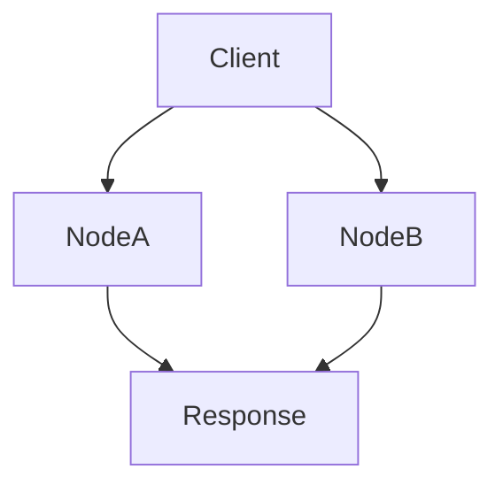
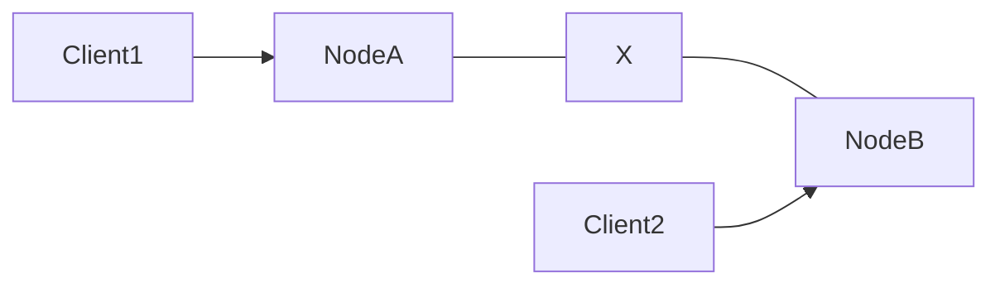
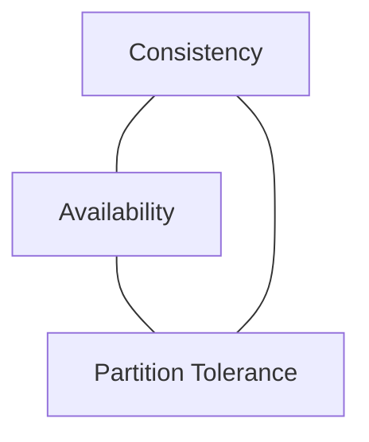
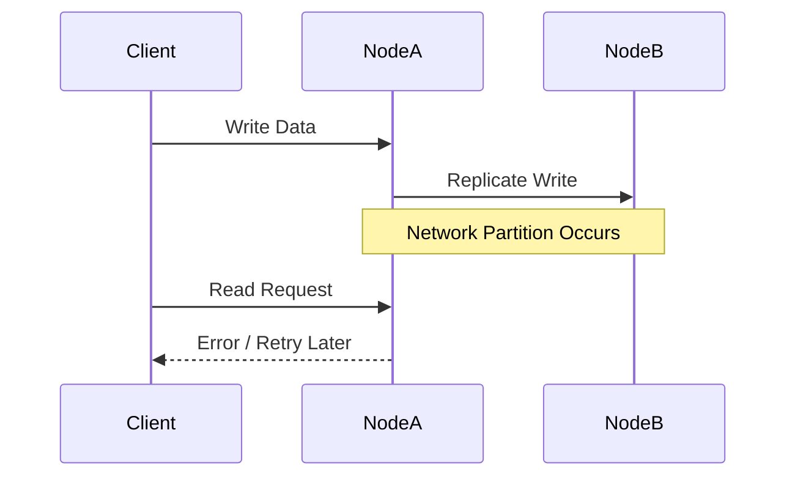
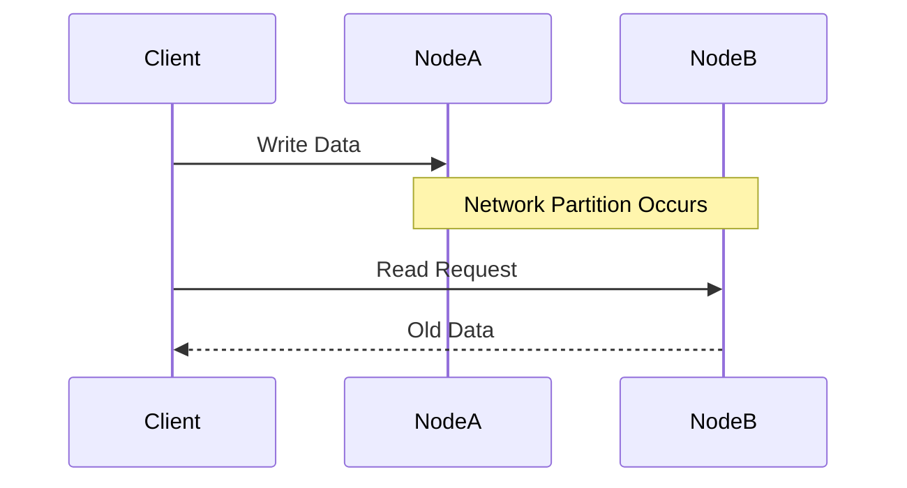

# CAP Theorem

Modern distributed systems store and process data across **multiple machines** instead of a single server. This improves **scalability**, **fault tolerance**, and **performance**, but it also introduces a fundamental challenge:

> How do we keep data **consistent and available** when the network itself can fail?

This question is answered by the **CAP Theorem**.

The **CAP Theorem** states that a distributed system **cannot simultaneously guarantee all three of the following properties**:

| Property | Meaning |
|--------|--------|
| **Consistency (C)** | Every read receives the **most recent write** or an error |
| **Availability (A)** | Every request receives a **non-error response** |
| **Partition Tolerance (P)** | The system continues functioning despite **network partitions** |

In the presence of a network partition, a system must **choose between consistency and availability**.

The theorem was formally introduced by :contentReference[oaicite:0]{index=0} in 2000 and later proven by :contentReference[oaicite:1]{index=1} and :contentReference[oaicite:2]{index=2}.

---

# Why CAP Theorem Exists

In distributed systems, nodes communicate through networks. Networks are **not perfectly reliable**.

Possible failures include:

- network delays
- packet loss
- datacenter isolation
- machine crashes
- connectivity issues

When communication between nodes breaks, the system experiences a **network partition**.

At that point, the system must decide:

- Should it **return possibly stale data** (availability)?
- Or should it **refuse requests until consistency is restored** (consistency)?

This trade-off forms the basis of the CAP theorem.

---

# Understanding the Three Components

## Consistency (C)

Consistency means **all nodes see the same data at the same time**.

After a successful write:

- every subsequent read should return the **latest value**

### Example

Suppose a distributed database stores:

```

User Balance = $100

```

A transaction updates it:

```

User Balance = $50

```

With **strong consistency**, every node immediately reflects:

```

$50

````

No node should return the old value `$100`.

---

### Consistency Visualization

```mermaid
flowchart LR
    Client --> Node1
    Client --> Node2
    Node1 --> Database
    Node2 --> Database
````

All nodes must return **identical data**.

---

## Availability (A)

Availability means the system **always responds to requests**, even if the response may not contain the latest data.

The system never refuses a request.

Example:

* Client sends request
* Server always responds
* Response might contain **stale data**

### Availability Example

Imagine a social media feed system.

If one database replica hasn't received the latest updates yet, the system may still return:

```
Older version of the feed
```

but it **does not reject the request**.

---

### Availability Visualization



Every request gets a **response**, regardless of synchronization status.

---

## Partition Tolerance (P)

Partition tolerance means the system **continues operating even when network communication fails between nodes**.

A **network partition** occurs when nodes cannot communicate.

Example causes:

* data center network outage
* router failure
* fiber cable damage
* firewall misconfiguration

### Partition Example



NodeA and NodeB cannot communicate, but both still receive requests.

---

# The Core Idea of CAP

The CAP theorem does **not mean you choose only two properties forever**.

Instead:

> When a network partition occurs, the system must **choose between consistency and availability**.

Since **network partitions are unavoidable**, most real systems prioritize **Partition Tolerance**.

So the real trade-off becomes:

```
Consistency vs Availability
```

---

# CAP Triangle



In practice:

| System Type | Guarantees                         |
| ----------- | ---------------------------------- |
| CP Systems  | Consistency + Partition tolerance  |
| AP Systems  | Availability + Partition tolerance |

---

# CP Systems (Consistency + Partition Tolerance)

These systems prioritize **correct data over availability**.

If a partition occurs:

* system may **reject requests**
* system may **delay responses**

but it **never returns inconsistent data**.

### Example Workflow



The system **refuses the request** to avoid inconsistency.

---

### Example CP Databases

| Database  | Characteristics                         |
| --------- | --------------------------------------- |
| HBase     | Strong consistency                      |
| MongoDB   | CP when configured with majority writes |
| ZooKeeper | Strong consistency guarantees           |

---

# AP Systems (Availability + Partition Tolerance)

These systems prioritize **availability**.

If a partition occurs:

* system **continues serving requests**
* data may become **temporarily inconsistent**

Eventually, data converges.

This model is called **eventual consistency**.

---

### Example Workflow



The system returns **stale data**, but it remains available.

---

### Example AP Databases

| Database  | Characteristics                  |
| --------- | -------------------------------- |
| Cassandra | Highly available                 |
| DynamoDB  | Eventually consistent by default |
| Riak      | AP design                        |

---

# Real-World Analogy

Imagine a **bank system distributed across cities**.

Two branches maintain account balances.

### Situation

A network failure disconnects the branches.

Now a customer withdraws money from branch A.

Branch B does not know about the withdrawal.

The bank must decide:

| Choice             | Result                    |
| ------------------ | ------------------------- |
| Block transactions | Consistency maintained    |
| Allow transactions | Temporary inconsistencies |

This trade-off mirrors the **CAP theorem**.

---

# CAP in Large Distributed Systems

Large-scale platforms design systems depending on their priorities.

### Social Media Platforms

Services like Instagram or Twitter prioritize **availability**.

Temporary inconsistencies are acceptable.

Example:

* Like count may briefly be incorrect
* Feed updates may appear slightly delayed

---

### Financial Systems

Platforms handling money prioritize **consistency**.

Examples include:

* banking systems
* trading platforms
* payment networks

Companies like Stripe ensure financial data remains **strongly consistent**.

---

# CAP vs ACID

CAP and ACID address **different aspects of systems**.

| Concept | Focus                               |
| ------- | ----------------------------------- |
| CAP     | Distributed system trade-offs       |
| ACID    | Transaction guarantees in databases |

ACID ensures properties like:

* atomicity
* consistency
* isolation
* durability

CAP focuses on **network behavior and system availability**.

---

# Common Misconceptions

## Misconception 1: Choose Any Two

The CAP theorem is often misinterpreted as:

```
Choose any two of C, A, P
```

This is incorrect.

Because **network partitions always occur**, real systems must **always handle P**.

The actual decision is:

```
Consistency vs Availability during partitions
```

---

## Misconception 2: Systems Are Strictly CP or AP

Many systems allow **tunable consistency**.

Example: Cassandra allows developers to choose consistency levels.

---

# Best Practices in CAP Design

### Understand Application Requirements

Different applications require different guarantees.

| Application  | Priority     |
| ------------ | ------------ |
| Banking      | Consistency  |
| Social media | Availability |
| Messaging    | Balanced     |

---

### Use Replication Carefully

Replication improves:

* fault tolerance
* read scalability

but increases **consistency complexity**.

---

### Implement Monitoring

Distributed systems should track:

* replication lag
* node health
* network latency

Monitoring platforms include:

* Prometheus
* Grafana

---

# Summary

The **CAP Theorem** explains a fundamental limitation of distributed systems.

A distributed system can guarantee only **two of the following three properties** during a network partition:

* **Consistency**
* **Availability**
* **Partition Tolerance**

Since partitions are unavoidable, systems must choose between:

```
Consistency vs Availability
```

Understanding CAP helps engineers design systems that balance **data correctness, system responsiveness, and fault tolerance** in large-scale distributed environments.