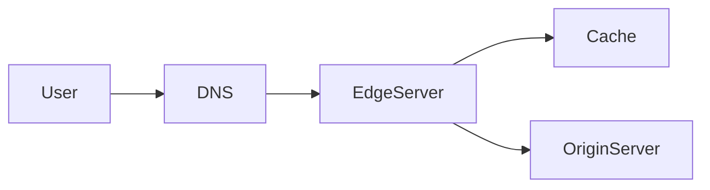
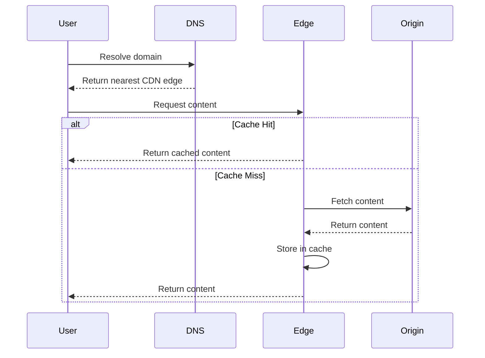
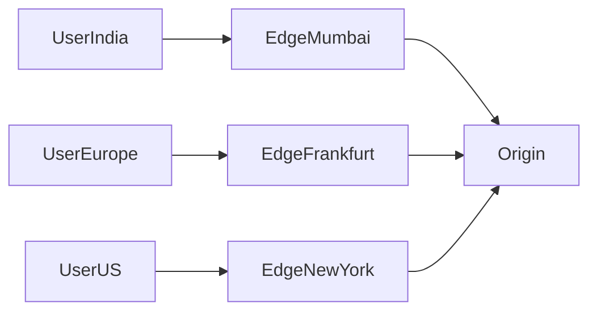
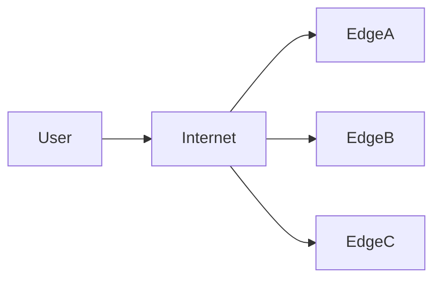
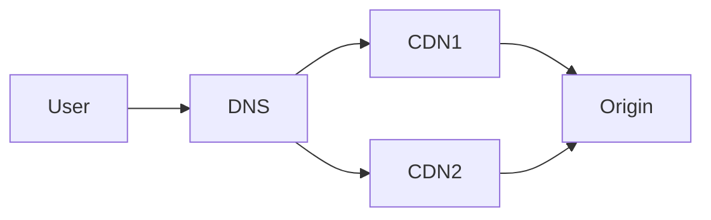

# Content Delivery Network (CDN)

## Introduction

When users access a website or application, the data must travel from the **server to the user's device**. If the server is located far away geographically, the request takes longer to complete.

Example:

- Server location: **New York**
- User location: **India**

The request must travel **thousands of kilometers across the internet**, introducing significant latency.

This leads to problems:

| Problem | Explanation |
|-------|-------------|
| High latency | Long distance network travel |
| Slow page load | Static assets take longer to download |
| Server overload | Origin server receives all requests |
| Poor global performance | Distant users experience slow service |

A **Content Delivery Network (CDN)** solves this problem by distributing content across **many geographically distributed servers** called **edge servers**.

Instead of every request going to the origin server, users fetch content from the **closest edge location**.

---

# What is a CDN?

A **Content Delivery Network (CDN)** is a globally distributed network of servers that **cache and deliver content from locations closer to users**.

Instead of:

```

User → Origin Server

```

Requests become:

```

User → Nearest CDN Edge Server → Origin Server (only if needed)

````

Architecture overview:

```mermaid
flowchart LR
    User1 --> Edge1
    User2 --> Edge2
    User3 --> Edge3

    Edge1 --> Origin
    Edge2 --> Origin
    Edge3 --> Origin

    Origin[(Origin Server)]
````

Each **edge server stores cached content**, reducing the need to contact the origin server.

---

# Why CDNs Are Critical for Large Systems

Large-scale platforms such as streaming services, e-commerce platforms, and social networks rely heavily on CDNs.

Key benefits:

| Benefit             | Explanation                             |
| ------------------- | --------------------------------------- |
| Reduced latency     | Content served from nearby edge servers |
| Lower origin load   | Fewer requests hit the origin server    |
| Higher availability | CDN nodes provide redundancy            |
| Global scalability  | Efficiently serve users worldwide       |
| DDoS protection     | Traffic distributed across many nodes   |

Without CDN:

```mermaid
flowchart LR
    Users --> OriginServer
```

All traffic hits the origin server.

With CDN:


Most requests are served at the **edge layer**.

---

# Types of Content Delivered by CDN

CDNs primarily deliver **static and semi-static content**.

| Content Type       | Examples             |
| ------------------ | -------------------- |
| Static assets      | Images, CSS, JS      |
| Media files        | Videos, audio        |
| Documents          | PDFs                 |
| Downloadable files | Software packages    |
| API responses      | Cached API responses |

Dynamic content can also be optimized through **edge computing and caching strategies**.

---

# Core CDN Architecture

A typical CDN architecture includes several key components.



Components:

| Component         | Role                         |
| ----------------- | ---------------------------- |
| DNS routing       | Directs user to nearest edge |
| Edge servers      | Cache and serve content      |
| Origin server     | Source of truth              |
| Cache storage     | Stores cached objects        |
| CDN control plane | Manages configuration        |

---

# CDN Request Flow

Let’s walk through a typical CDN request.



Steps:

1. User resolves domain using DNS.
2. DNS directs request to nearest CDN edge.
3. Edge server checks its cache.
4. If cached → return immediately.
5. If not → fetch from origin.
6. Store response for future requests.

---

# Edge Servers

Edge servers are **distributed geographically** across the globe.

Example:

| Region        | Edge Servers          |
| ------------- | --------------------- |
| North America | Multiple cities       |
| Europe        | Multiple data centers |
| Asia          | Regional nodes        |
| South America | Local edge nodes      |

This reduces the **physical distance between user and content**.

Example architecture:



---

# CDN Caching

CDNs store frequently accessed content at edge servers.

Common caching rules include:

| Strategy            | Description                |
| ------------------- | -------------------------- |
| TTL caching         | Content expires after time |
| Cache headers       | Controlled by HTTP headers |
| Manual invalidation | Purge outdated content     |
| Versioned assets    | Unique URLs for updates    |

Example HTTP cache headers:

```
Cache-Control: max-age=3600
```

Meaning:

```
Cache this content for 1 hour
```

---

# Cache Invalidation in CDN

When content changes, CDN caches must be updated.

Methods:

| Method         | Description                    |
| -------------- | ------------------------------ |
| TTL expiration | Content automatically expires  |
| Cache purge    | Manually remove cached objects |
| Versioning     | Change asset URL               |
| Soft refresh   | CDN fetches new version        |

Example:

```
image_v2.png
```

Changing file name forces cache refresh.

---

# CDN Request Routing

CDNs use **intelligent routing algorithms** to determine the best edge server.

Common strategies:

| Strategy           | Description                   |
| ------------------ | ----------------------------- |
| Geo routing        | Closest geographic server     |
| Latency routing    | Lowest network latency        |
| Load-based routing | Avoid overloaded servers      |
| Anycast routing    | Same IP across multiple nodes |

Example routing:


DNS directs user to the **optimal edge location**.

---

# Anycast Routing

Many CDNs use **Anycast networking**.

Multiple servers share the **same IP address**, and the network automatically routes users to the closest instance.



Benefits:

| Benefit           | Explanation                   |
| ----------------- | ----------------------------- |
| Automatic routing | Internet chooses closest node |
| High availability | Failover automatically        |
| Low latency       | Shorter network paths         |

---

# Edge Computing

Modern CDNs support **running code at the edge**.

This allows dynamic logic to run closer to users.

Example use cases:

| Use Case           | Description              |
| ------------------ | ------------------------ |
| Authentication     | Validate tokens          |
| A/B testing        | Serve different versions |
| Personalization    | Modify content per user  |
| Security filtering | Block malicious requests |

Edge computing architecture:


Instead of always contacting the origin, **logic runs directly at edge servers**.

---

# CDN for Video Streaming

Video streaming platforms rely heavily on CDNs.

Example flow:


Videos are divided into **small chunks**, which are cached at edge locations.

Benefits:

| Benefit               | Explanation           |
| --------------------- | --------------------- |
| Faster playback       | Local video segments  |
| Reduced buffering     | Low latency           |
| Lower bandwidth costs | Fewer origin requests |

---

# CDN Security Features

CDNs often provide **security protections**.

| Feature                        | Description               |
| ------------------------------ | ------------------------- |
| DDoS mitigation                | Absorb traffic floods     |
| Web Application Firewall (WAF) | Filter malicious requests |
| Rate limiting                  | Prevent abuse             |
| Bot protection                 | Block automated attacks   |

Security architecture:


The CDN acts as a **protective shield for the origin server**.

---

# Multi-CDN Architecture

Large platforms sometimes use **multiple CDN providers**.

Architecture:



Benefits:

| Benefit            | Explanation           |
| ------------------ | --------------------- |
| Higher reliability | Failover between CDNs |
| Better performance | Choose fastest CDN    |
| Cost optimization  | Traffic distribution  |

---

# CDN vs Reverse Proxy

Both CDNs and reverse proxies sit between users and servers.

| Feature                  | CDN      | Reverse Proxy |
| ------------------------ | -------- | ------------- |
| Geographic distribution  | Global   | Usually local |
| Edge caching             | Yes      | Limited       |
| Performance optimization | High     | Moderate      |
| Security features        | Advanced | Basic         |

CDNs are essentially **globally distributed reverse proxies with caching**.

---

# Trade-offs of CDN

CDNs provide huge benefits but also introduce complexities.

| Advantage               | Trade-off                    |
| ----------------------- | ---------------------------- |
| Faster content delivery | Additional infrastructure    |
| Reduced origin load     | Cache consistency challenges |
| Global scalability      | Cost                         |
| Improved security       | Configuration complexity     |

Proper cache management is critical.

---

# Real World CDN Architecture

Large-scale systems combine CDNs with multiple layers of caching.


This layered architecture ensures:

* low latency
* high scalability
* fault tolerance

---

# Summary

A **Content Delivery Network (CDN)** is a distributed system designed to deliver content **faster and more reliably** by placing cached data closer to users.

Core concepts:

| Concept         | Meaning                     |
| --------------- | --------------------------- |
| Edge servers    | CDN nodes near users        |
| Origin server   | Source of content           |
| Cache hit       | Data served from CDN        |
| Cache miss      | CDN fetches from origin     |
| Anycast routing | Intelligent traffic routing |

CDNs are essential for modern applications that must serve **millions of users globally with low latency**.

They dramatically improve:

* performance
* scalability
* reliability
* security

As a result, nearly every large-scale web platform relies on CDNs as a **core infrastructure component**.