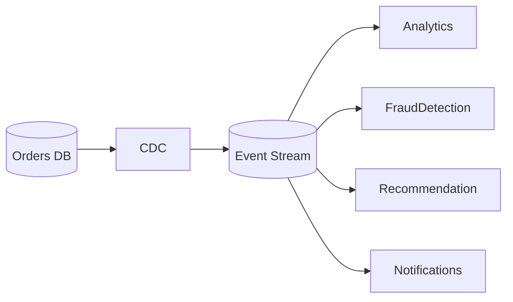
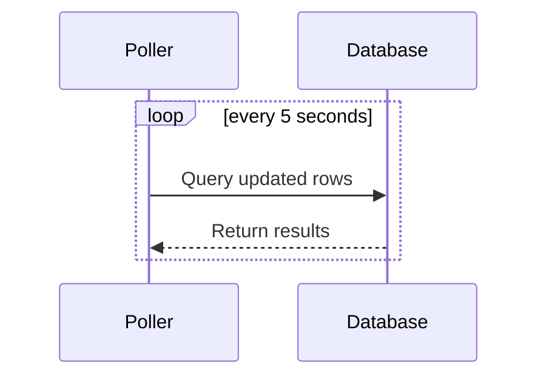
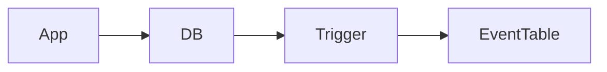
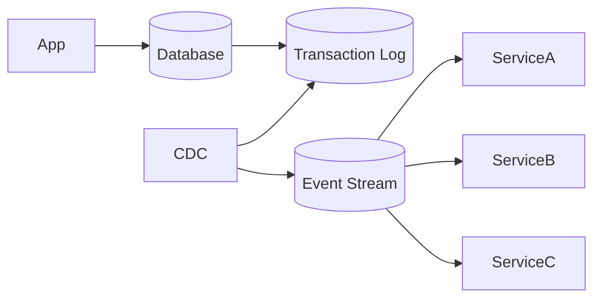
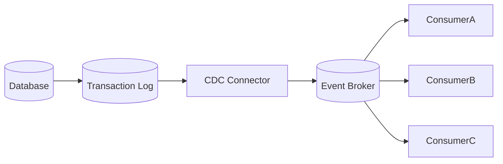
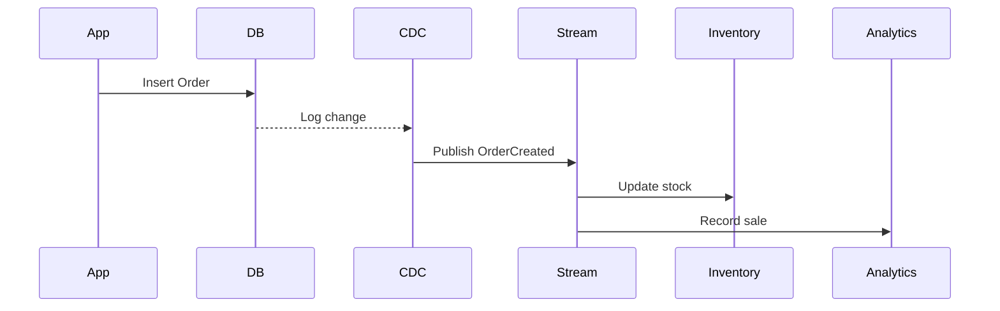
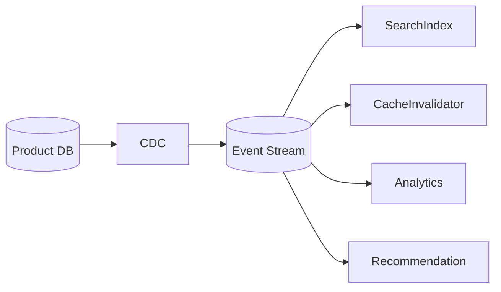

# Change Data Capture (CDC)

## Introduction

Modern distributed systems rarely consist of a **single database and a single application**. Instead, large-scale systems include multiple services that must react to **changes in data across the system**.

For example:

- When a **user updates their profile**, several systems might need to know:
  - Search indexes
  - Analytics systems
  - Recommendation engines
  - Notification services
  - Cache layers

If every service constantly **queries the database for updates**, the database becomes overwhelmed.

This is where **Change Data Capture (CDC)** becomes essential.

**Change Data Capture (CDC)** is a technique that **detects changes in a database and streams those changes to other systems in real time**.

Instead of repeatedly asking:

> “Has anything changed?”

CDC allows systems to say:

> “Notify me whenever something changes.”

---

# The Problem CDC Solves

Imagine a simple e-commerce system.

We have:

- Orders database
- Inventory system
- Analytics pipeline
- Notification service
- Search index

When a **new order is created**, several downstream systems must update.

Without CDC, the system might look like this.

```mermaid
flowchart LR
    Service --> Database
    Analytics --> Database
    Search --> Database
    Notification --> Database
    Inventory --> Database
````

Problems:

| Problem            | Explanation                                   |
| ------------------ | --------------------------------------------- |
| High database load | Multiple systems repeatedly query for updates |
| Data inconsistency | Systems may fetch stale data                  |
| High latency       | Changes are not propagated immediately        |
| Tight coupling     | Services depend directly on the database      |

CDC solves this by **streaming database changes once and distributing them to multiple consumers**.

---

# CDC Architecture Overview

With CDC, the system becomes **event-driven**.

```mermaid
flowchart LR
    DB[(Database)]
    CDC[CDC Connector]
    MQ[(Event Stream / Message Queue)]

    Inventory --> MQ
    Search --> MQ
    Analytics --> MQ
    Notifications --> MQ

    DB --> CDC
    CDC --> MQ
```

Flow:

1. A change happens in the database.
2. CDC captures the change.
3. CDC converts the change into an **event**.
4. The event is published to a **streaming platform**.
5. Multiple services consume the event.

This creates a **loosely coupled architecture**.

---

# Types of Database Changes Captured

CDC typically captures three kinds of operations.

| Operation | Meaning                  |
| --------- | ------------------------ |
| INSERT    | New record created       |
| UPDATE    | Existing record modified |
| DELETE    | Record removed           |

Example table:

```sql
Users
```

| id | name  | email                                     |
| -- | ----- | ----------------------------------------- |
| 1  | Alice | [alice@email.com](mailto:alice@email.com) |

If Alice changes her email:

```sql
UPDATE Users SET email="alice@newmail.com" WHERE id=1;
```

CDC emits an event:

```json
{
  "operation": "UPDATE",
  "table": "Users",
  "before": {
    "id": 1,
    "email": "alice@email.com"
  },
  "after": {
    "id": 1,
    "email": "alice@newmail.com"
  }
}
```

This event can be consumed by many systems.

---

# Where CDC Is Used

CDC is heavily used in modern architectures.

| Use Case                   | Example                           |
| -------------------------- | --------------------------------- |
| Data replication           | Syncing databases                 |
| Search indexing            | Updating search engines           |
| Analytics pipelines        | Streaming data to data warehouses |
| Event-driven microservices | Triggering workflows              |
| Cache invalidation         | Updating distributed caches       |

Example:



---

# CDC Implementation Strategies

There are several ways to implement CDC.

## 1. Polling Based CDC

The simplest approach is **periodic polling**.

A service repeatedly queries the database for changes.

Example:

```sql
SELECT * FROM orders
WHERE updated_at > last_checked_time;
```

### Diagram



### Problems

| Issue        | Explanation                    |
| ------------ | ------------------------------ |
| High DB load | Constant polling               |
| Delay        | Changes not captured instantly |
| Inefficient  | Many empty queries             |

Because of these limitations, large systems rarely rely on polling.

---

# 2. Trigger Based CDC

Another approach uses **database triggers**.

A trigger runs automatically when a row changes.

Example:

```sql
CREATE TRIGGER order_update_trigger
AFTER UPDATE ON orders
FOR EACH ROW
INSERT INTO order_events VALUES (NEW.id, NOW());
```

### Architecture



### Advantages

* Immediate capture of changes
* Simple implementation

### Disadvantages

| Problem             | Explanation                  |
| ------------------- | ---------------------------- |
| Database overhead   | Triggers slow down writes    |
| Complex maintenance | Hard to manage many triggers |
| Coupling            | Logic lives inside database  |

Large-scale systems often avoid heavy trigger usage.

---

# 3. Log-Based CDC (Most Scalable)

The most powerful CDC method reads the **database transaction log**.

Every database maintains a log of changes.

Examples:

| Database   | Log Type        |
| ---------- | --------------- |
| MySQL      | Binlog          |
| PostgreSQL | WAL             |
| SQL Server | Transaction Log |
| MongoDB    | Oplog           |

Instead of polling tables, CDC tools read the **log stream**.

### Architecture



Advantages:

| Benefit             | Explanation                          |
| ------------------- | ------------------------------------ |
| No query overhead   | Reads database logs                  |
| Real-time streaming | Changes captured instantly           |
| Scalable            | Suitable for high throughput systems |

This approach is used in production systems.

---

# CDC Event Pipeline

A typical CDC pipeline looks like this.



Components:

| Component       | Responsibility                   |
| --------------- | -------------------------------- |
| Database        | Source of truth                  |
| Transaction Log | Record of changes                |
| CDC Connector   | Reads log and converts to events |
| Event Broker    | Distributes events               |
| Consumers       | Services reacting to changes     |

---

# Data Flow Example

Consider an **order creation event**.

Step-by-step flow.



One change can trigger **multiple downstream updates**.

---

# CDC Event Structure

A CDC event typically contains metadata.

Example:

```json
{
  "event_id": "9821",
  "table": "orders",
  "operation": "INSERT",
  "timestamp": "2026-01-10T10:30:00Z",
  "data": {
    "order_id": 1001,
    "user_id": 42,
    "amount": 120
  }
}
```

Common fields:

| Field     | Meaning                     |
| --------- | --------------------------- |
| event_id  | Unique event identifier     |
| table     | Table where change occurred |
| operation | INSERT / UPDATE / DELETE    |
| timestamp | When change occurred        |
| data      | Row data                    |

---

# Handling Ordering and Consistency

CDC systems must maintain **event ordering**.

Why?

Because updates must occur in the same sequence.

Example:

1. Order created
2. Order shipped
3. Order delivered

If delivered arrives before shipped, systems break.

To ensure order:

* Use **log offsets**
* Use **partitioning keys**
* Use **ordered message streams**

---

# Idempotency in CDC

Consumers may receive **duplicate events**.

Example causes:

* Retry
* Consumer restart
* Network failure

Consumers must process events **idempotently**.

Example strategy:

```pseudo
if event_id already_processed:
    ignore
else:
    process_event()
```

---

# Handling Schema Changes

Database schemas evolve.

Example:

```sql
ALTER TABLE users ADD COLUMN phone;
```

CDC pipelines must handle:

| Challenge              | Solution          |
| ---------------------- | ----------------- |
| Schema evolution       | Versioned schemas |
| Backward compatibility | Schema registry   |
| Consumer mismatch      | Graceful parsing  |

---

# Real World Example

Consider an **online marketplace**.

When a product changes:

* Search index must update
* Recommendation engine must retrain
* Analytics must record metrics
* Cache must invalidate

Architecture:



Instead of services querying the database, they **react to events**.

---

# Benefits of CDC

| Benefit                   | Explanation                 |
| ------------------------- | --------------------------- |
| Real-time updates         | Changes propagate instantly |
| Reduced database load     | No repeated polling         |
| Event-driven architecture | Services react to events    |
| Loose coupling            | Systems independent         |
| Scalability               | Supports many consumers     |

---

# Challenges of CDC

CDC introduces complexities.

| Challenge               | Explanation                   |
| ----------------------- | ----------------------------- |
| Event ordering          | Must maintain change sequence |
| Schema evolution        | Handling database changes     |
| Exactly-once processing | Avoid duplicates              |
| Operational complexity  | Managing pipelines            |
| Data consistency        | Handling partial failures     |

These challenges require careful system design.

---

# Best Practices

## Use Log-Based CDC

Prefer **transaction log based CDC** over polling.

---

## Ensure Idempotent Consumers

Consumers must handle duplicate events safely.

---

## Maintain Event Ordering

Partition events using a consistent key.

---

## Use Schema Versioning

Support backward compatibility.

---

## Monitor the CDC Pipeline

Track:

* event lag
* processing delays
* failed consumers

---

# Summary

Change Data Capture enables **real-time propagation of database changes across distributed systems**.

Instead of services repeatedly querying databases, CDC allows systems to **stream events whenever data changes**.

Key ideas:

| Concept           | Meaning                      |
| ----------------- | ---------------------------- |
| CDC               | Capturing database changes   |
| Event streaming   | Broadcasting changes         |
| Log-based capture | Reading transaction logs     |
| Event consumers   | Services reacting to changes |

CDC is a foundational technology for building **event-driven, scalable, and loosely coupled architectures** in modern distributed systems.

Without CDC, large-scale systems would struggle to keep multiple services **synchronized with continuously changing data**.