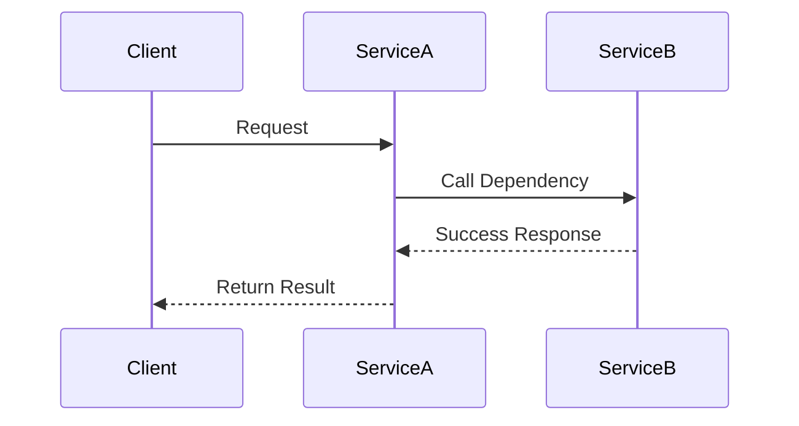
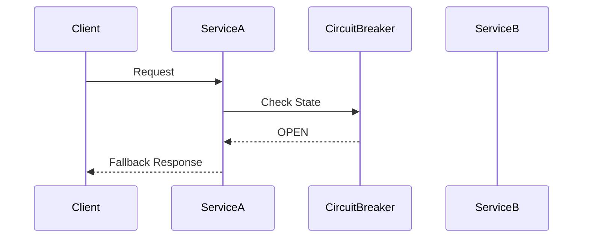
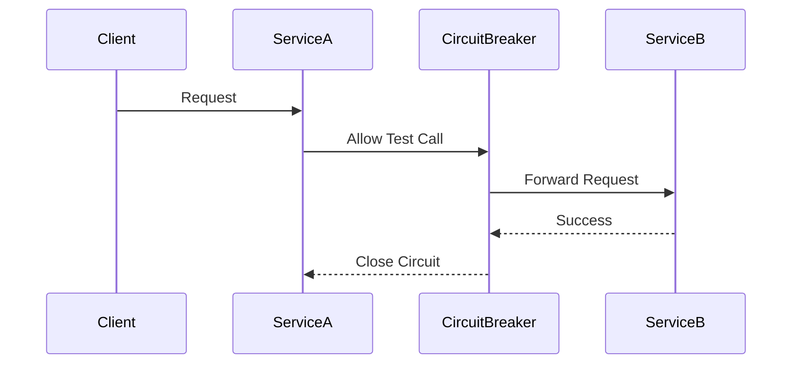
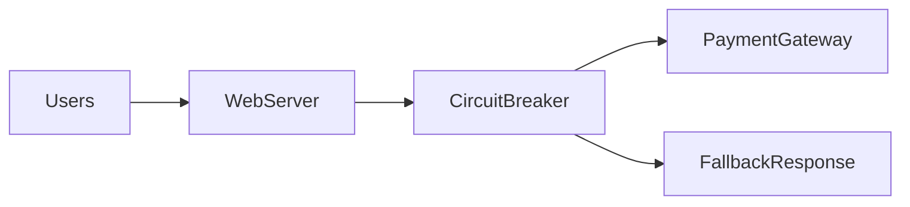

# Circuit Breaker Pattern

Modern distributed systems consist of many **interconnected services**. A request from a client may pass through multiple components:

- API Gateway  
- Authentication Service  
- Business Logic Service  
- Database  
- Third-party APIs  

If **one service becomes slow or fails**, it can cause the entire system to slow down or crash. This type of failure spreading across services is known as a **cascading failure**.

To prevent this, distributed systems use the **Circuit Breaker Pattern**.

> The Circuit Breaker pattern protects a system from repeatedly calling a failing service by temporarily stopping requests to that service.

This concept is inspired by **electrical circuit breakers** used in buildings.

If an electrical circuit experiences overload, the breaker **cuts off the current** to prevent damage.

Similarly, a software circuit breaker **stops requests** to a failing dependency until it recovers.

---

# Why Circuit Breakers Are Important

In large systems, services often depend on **external services** or **remote APIs**.

Example dependencies may include:

- payment gateways  
- notification services  
- recommendation systems  
- analytics platforms  

Companies like :contentReference[oaicite:0]{index=0} and :contentReference[oaicite:1]{index=1} rely heavily on circuit breakers to keep systems stable.

Without circuit breakers, a failing service can cause:

| Problem | Description |
|--------|-------------|
| Cascading failures | One failing service causes many others to fail |
| Resource exhaustion | Threads remain blocked waiting for responses |
| Increased latency | Requests wait for timeouts |
| System crashes | Entire infrastructure becomes overloaded |

---

# Cascading Failure Example

Imagine an **e-commerce platform**.

A request to place an order might involve:

1. Order Service  
2. Inventory Service  
3. Payment Service  

If the **Payment Service becomes slow**, all requests waiting for payment verification will block.

Soon:

- threads fill up
- queues grow
- servers become overloaded

Eventually, the entire system stops responding.

---

## Failure Propagation

```mermaid
flowchart LR
    Client --> OrderService
    OrderService --> InventoryService
    OrderService --> PaymentService
    PaymentService --> Timeout
    Timeout --> ThreadExhaustion
    ThreadExhaustion --> SystemFailure
````

The failure **spreads across services**, causing widespread outages.

---

# How the Circuit Breaker Works

The circuit breaker monitors the **success and failure rates** of service calls.

If failures exceed a threshold, the breaker **opens**, stopping further requests.

Instead of sending requests to the failing service, the system immediately returns:

* cached responses
* fallback values
* error messages

This prevents the system from wasting resources.

---

# Circuit Breaker States

A circuit breaker typically has **three states**.

| State     | Description                            |
| --------- | -------------------------------------- |
| Closed    | Requests flow normally                 |
| Open      | Requests are blocked                   |
| Half-Open | Limited requests test service recovery |

---

# State Transition Diagram

```mermaid
stateDiagram-v2
    [*] --> Closed
    Closed --> Open : Failure threshold exceeded
    Open --> HalfOpen : Timeout period passes
    HalfOpen --> Closed : Requests succeed
    HalfOpen --> Open : Requests fail
```

---

# 1 Closed State

In the **closed state**, requests are sent normally to the service.

The circuit breaker continuously monitors:

* response time
* error rates
* timeout frequency

If failure rate crosses a threshold (for example 50%), the circuit **opens**.

---

### Closed State Flow



Everything operates normally.

---

# 2 Open State

In the **open state**, the circuit breaker blocks calls to the failing service.

Instead of attempting the call, the system immediately returns a fallback response.

This protects system resources and prevents further overload.

---

### Open State Flow



No request reaches the failing service.

---

# 3 Half-Open State

After a configured **cooldown period**, the circuit breaker enters the **half-open state**.

A limited number of requests are allowed through to test whether the service has recovered.

If these requests succeed, the circuit **closes**.

If failures continue, it returns to **open**.

---

### Half-Open Flow



---

# Circuit Breaker in System Architecture

Circuit breakers are often placed between services.


If **Payment Service fails**, the circuit breaker prevents repeated attempts.

---

# Example: Payment Service Failure

Imagine an online store where payment processing depends on a third-party service.

### Without Circuit Breaker


The system keeps retrying requests and eventually crashes.

---

### With Circuit Breaker



The breaker stops failed calls and returns a **graceful fallback**.

---

# Fallback Strategies

When a circuit breaker blocks requests, the system may provide alternative responses.

| Strategy       | Example                            |
| -------------- | ---------------------------------- |
| Cached data    | Return cached product details      |
| Default values | Show placeholder recommendations   |
| Queue request  | Process later                      |
| Graceful error | Inform user service is unavailable |

Example:

```
"Payment service temporarily unavailable. Please try again later."
```

---

# Real-World Implementations

Many distributed systems frameworks implement circuit breakers.

| Tool         | Description                              |
| ------------ | ---------------------------------------- |
| Hystrix      | Popular circuit breaker implementation   |
| Resilience4j | Modern Java resilience framework         |
| Istio        | Circuit breaking in service mesh         |
| Envoy        | Traffic management with circuit breaking |

For example, Netflix used Hystrix extensively to protect its microservices architecture.

---

# Circuit Breaker vs Retry

Both patterns deal with failures but solve different problems.

| Pattern         | Purpose                                   |
| --------------- | ----------------------------------------- |
| Retry           | Attempts request again after failure      |
| Circuit Breaker | Stops sending requests to failing service |

Often they are **combined carefully**.

Example flow:

```
Retry → Circuit Breaker → Fallback
```

However excessive retries may worsen outages, so retries should be limited.

---

# Best Practices

### Set Proper Thresholds

Define failure thresholds carefully.

Example:

```
Open circuit if >50% failures in last 10 seconds
```

---

### Monitor Service Health

Track metrics such as:

* request latency
* error rates
* timeout frequency

Monitoring systems include:

* Prometheus
* Grafana

---

### Use Timeouts

Always configure request **timeouts** before using circuit breakers.

Without timeouts, requests may hang indefinitely.

---

### Implement Fallback Logic

Fallback responses should maintain **reasonable user experience** even during failures.

---

# Real-World Analogy

Imagine calling a **customer support center**.

If the phone line is constantly busy, you might stop trying repeatedly and instead:

* try again later
* use email support
* check the help center

This behavior mirrors a circuit breaker: **stop sending requests to a failing system until it recovers**.

---

# Summary

The **Circuit Breaker Pattern** is a fundamental resilience mechanism in distributed systems.

It protects systems from cascading failures by **monitoring service health and blocking requests when failures exceed a threshold**.

Key concepts include:

* **Closed state** → normal operation
* **Open state** → requests blocked
* **Half-open state** → recovery testing

By preventing repeated calls to failing services, circuit breakers help systems remain **stable, responsive, and fault-tolerant** even during partial outages.