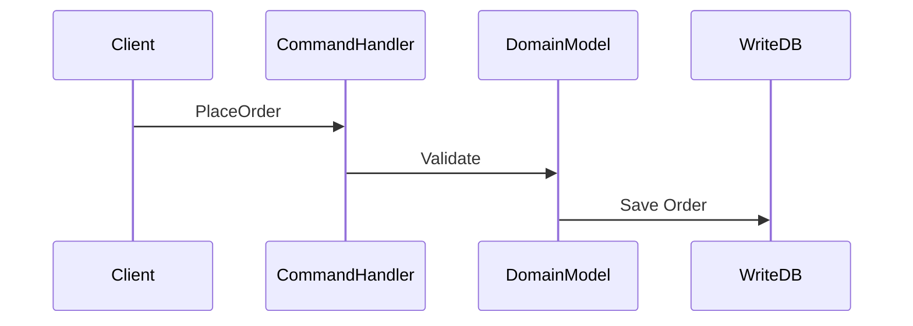
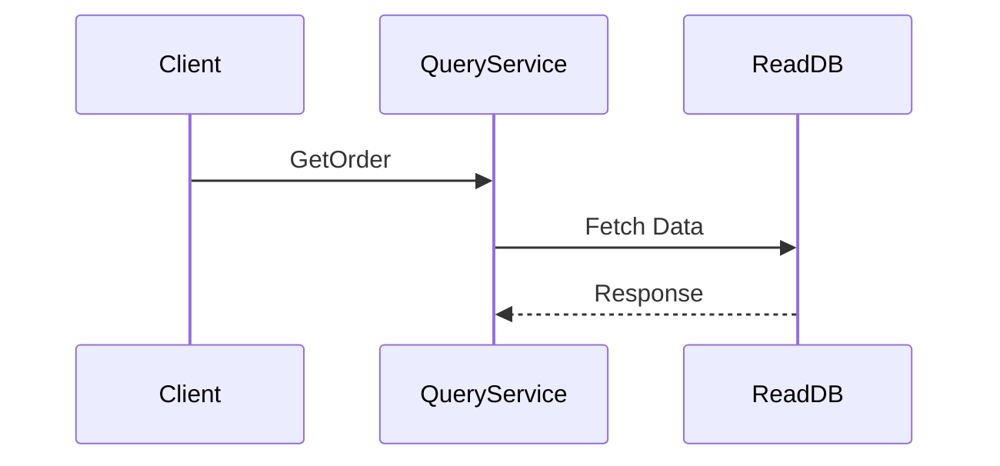
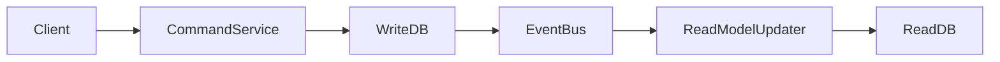
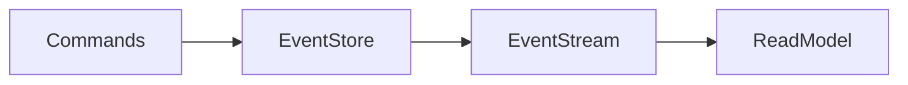
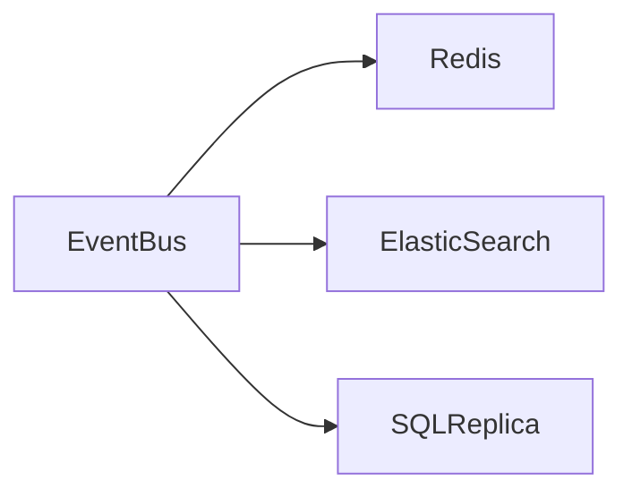
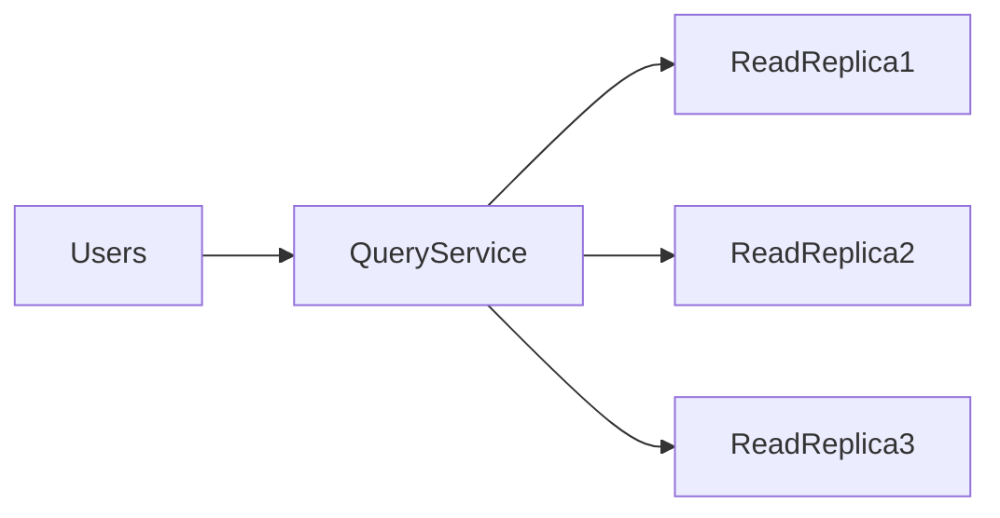
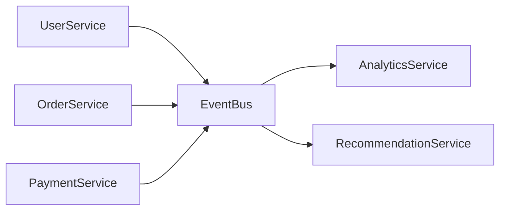

# Command Query Responsibility Segregation (CQRS)

## Introduction: The Restaurant Kitchen Problem

Imagine a busy restaurant.

The restaurant handles two types of activities:

1. **Taking orders**
2. **Serving food information to customers**

These two operations are very different.

| Activity | Nature |
|--------|------|
| Taking orders | Writes data |
| Showing menu | Reads data |

Now imagine the restaurant uses **one single system** for both tasks.

When thousands of customers start asking for the menu while others place orders:

- Kitchen system slows down
- Orders take longer
- Menu queries block order processing

This is similar to how many traditional applications work.

Both **reads and writes share the same database and model**.

But in real systems:

- **Reads are far more frequent than writes**
- Reads and writes have **different scalability needs**

To solve this problem, we use a design pattern called **CQRS**.

---

# What is CQRS?

**Command Query Responsibility Segregation (CQRS)** is a design pattern where:

> **Read operations and write operations are separated into different models or services.**

Instead of using one model for everything, CQRS splits the system into:

| Operation | Purpose |
|----------|--------|
| **Command** | Modify data (Write) |
| **Query** | Retrieve data (Read) |

So instead of:

```

Application → Single Model → Database

```

We do:

```

Commands → Write Model → Write Database
Queries → Read Model → Read Database

```

---

# Core Principle

CQRS is based on a simple rule:

> **Commands change state. Queries return state.**

A command **must not return data**.

A query **must not change state**.

---

# Example

Suppose we have an **E-commerce system**.

### Commands

These modify system state.

```

CreateOrder
UpdateOrderStatus
CancelOrder
AddItemToCart

```

### Queries

These only fetch data.

```

GetOrderDetails
GetUserCart
GetOrderHistory
GetProductList

````

Separating these operations improves performance and scalability.

---

# Traditional CRUD Architecture

Most systems use **CRUD architecture**.

```mermaid
flowchart LR

User --> Application
Application --> Database
Database --> Application
Application --> User
````

Both reads and writes hit the same database.

Problems:

| Problem           | Explanation                        |
| ----------------- | ---------------------------------- |
| High read load    | Overloads DB                       |
| Complex queries   | Slow down writes                   |
| Lock contention   | Reduced performance                |
| Difficult scaling | Reads and writes scale differently |

---

# CQRS Architecture

CQRS separates read and write paths.

```mermaid
flowchart LR

Client --> CommandAPI
Client --> QueryAPI

CommandAPI --> WriteModel
WriteModel --> WriteDB

QueryAPI --> ReadModel
ReadModel --> ReadDB
```

Now reads and writes operate independently.

---

# Command Side (Write Model)

The command side handles:

* Business logic
* State changes
* Data validation
* Transactions

Example command:

```text
PlaceOrder
```

Flow:



Characteristics:

| Property           | Description |
| ------------------ | ----------- |
| Strong consistency | Required    |
| Transactional      | Yes         |
| Complex validation | Yes         |
| Write optimized    | Yes         |

---

# Query Side (Read Model)

The query side is optimized for **fast data retrieval**.

Example query:

```
GetOrderSummary
```

Flow:



Characteristics:

| Property          | Description        |
| ----------------- | ------------------ |
| Fast reads        | Optimized queries  |
| Denormalized data | Pre-computed views |
| Scalable          | Can use replicas   |

---

# Why Separate Read and Write Models?

Because their requirements are different.

| Aspect     | Write Model | Read Model   |
| ---------- | ----------- | ------------ |
| Complexity | High        | Low          |
| Queries    | Simple      | Complex      |
| Schema     | Normalized  | Denormalized |
| Scaling    | Moderate    | Massive      |

Example:

Write model:

```
Orders
Users
Products
```

Read model:

```
UserOrderHistoryView
ProductPopularityView
DashboardMetricsView
```

Read models can be optimized for specific queries.

---

# Synchronizing Read and Write Models

Since read and write models are separate, we need a way to keep them synchronized.

Common approaches:

| Method               | Description                     |
| -------------------- | ------------------------------- |
| Event-driven updates | Write model emits events        |
| Message queues       | Events processed asynchronously |
| Change Data Capture  | DB changes streamed             |

---

# Event-Based CQRS

Most CQRS systems use **events**.

Example:

```
OrderPlaced
OrderCancelled
PaymentCompleted
```

Architecture:



Process:

1. Command modifies write DB
2. Event published
3. Read model updated asynchronously

---

# Eventual Consistency

Since updates happen asynchronously:

Read models may **lag slightly behind writes**.

Example:

User places order.

```
Write DB updated instantly
Read DB updated after 100 ms
```

This is called:

**Eventual Consistency**

Most modern systems accept this tradeoff.

---

# CQRS with Event Sourcing

CQRS is often combined with **Event Sourcing**.

Instead of storing current state:

We store **all events that occurred**.

Example event log:

```
OrderCreated
ItemAdded
PaymentCompleted
OrderShipped
```

Current state is reconstructed from events.

Architecture:



Benefits:

| Benefit     | Explanation        |
| ----------- | ------------------ |
| Audit log   | Full history       |
| Debugging   | Replay events      |
| Scalability | Append-only writes |

---

# Read Model Optimization

Read databases can be optimized differently.

Examples:

| Technology    | Use Case              |
| ------------- | --------------------- |
| Elasticsearch | Search queries        |
| Redis         | Fast cache reads      |
| Cassandra     | Large-scale analytics |
| SQL replicas  | Reporting             |

Example:



Each optimized for specific queries.

---

# Scaling CQRS

CQRS scales extremely well.

### Write Scaling

```
Sharded write database
```

### Read Scaling

```
Multiple read replicas
```

Architecture:



Reads can scale horizontally.

---

# Real-World Example: E-Commerce

In a large e-commerce platform:

Daily traffic:

```
Reads → 1 billion
Writes → 10 million
```

Ratio:

```
100:1
```

If reads and writes share one database:

System becomes slow.

CQRS allows:

* Write DB optimized for transactions
* Read DB optimized for queries

---

# CQRS in Microservices

CQRS works extremely well with microservices.

Example architecture:



Services emit events.

Read models consume them.

---

# Advantages of CQRS

| Advantage              | Explanation                       |
| ---------------------- | --------------------------------- |
| Independent scaling    | Reads and writes scale separately |
| Performance            | Optimized queries                 |
| Flexibility            | Multiple read models              |
| Better domain modeling | Clear separation                  |
| High scalability       | Handles massive traffic           |

---

# Challenges of CQRS

| Challenge            | Explanation          |
| -------------------- | -------------------- |
| Increased complexity | More components      |
| Eventual consistency | Data delay           |
| Data duplication     | Multiple read models |
| Debugging difficulty | Distributed flow     |

CQRS is powerful but **not suitable for every system**.

---

# When to Use CQRS

Use CQRS when:

| Scenario                   | Reason              |
| -------------------------- | ------------------- |
| Read-heavy systems         | Optimize queries    |
| Large-scale systems        | Separate scaling    |
| Complex domains            | Rich business logic |
| Event-driven architectures | Natural integration |

---

# When NOT to Use CQRS

Avoid CQRS if:

| Scenario            | Reason                 |
| ------------------- | ---------------------- |
| Small applications  | Overkill               |
| Simple CRUD apps    | Unnecessary complexity |
| Low traffic systems | No benefit             |

---

# Real-World Systems Using CQRS

Large tech companies use CQRS patterns.

Examples:

| Company  | Usage                      |
| -------- | -------------------------- |
| Netflix  | Event-driven microservices |
| Amazon   | Order processing           |
| LinkedIn | Activity feeds             |
| Uber     | Trip processing            |

These systems process **millions of events per second**.

---

# CQRS vs Traditional Architecture

| Feature     | Traditional | CQRS        |
| ----------- | ----------- | ----------- |
| Model       | Single      | Separate    |
| Scaling     | Limited     | Independent |
| Complexity  | Low         | Higher      |
| Performance | Moderate    | High        |

---

# Interview Questions

### What is CQRS?

A design pattern that separates **read operations (queries)** from **write operations (commands)**.

---

### Why use CQRS?

To:

* Improve scalability
* Optimize read performance
* Handle complex domains

---

### What is Eventual Consistency?

When read models update asynchronously after writes.

---

### How does CQRS scale?

Reads and writes scale independently using different databases and services.

---

# Key Takeaways

| Concept              | Explanation                    |
| -------------------- | ------------------------------ |
| CQRS                 | Separate read and write models |
| Command              | Operation that modifies state  |
| Query                | Operation that retrieves data  |
| Event-driven updates | Synchronize read models        |
| Eventual consistency | Delayed read updates           |

---

# Final Analogy

Think of CQRS like a **library system**.

### Writing books

Authors update books.

```
Write Model
```

### Reading books

Millions of readers access copies.

```
Read Model
```

Instead of giving readers the **original manuscript**, libraries distribute **optimized copies**.

This allows millions of readers without slowing down the authors.

---

# Conclusion

Command Query Responsibility Segregation is one of the most powerful patterns in **High Level Design and distributed systems**.

It allows systems to:

* Scale reads independently
* Handle massive workloads
* Optimize data access patterns
* Integrate seamlessly with event-driven architectures

However, CQRS introduces complexity and should be used when the benefits outweigh the cost.

In large-scale systems handling **millions of requests per second**, CQRS becomes an essential architectural tool.