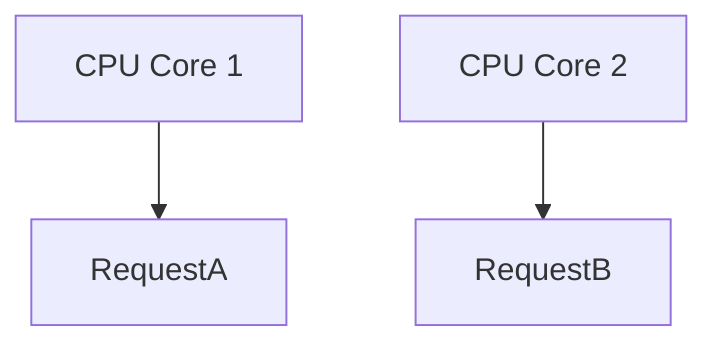
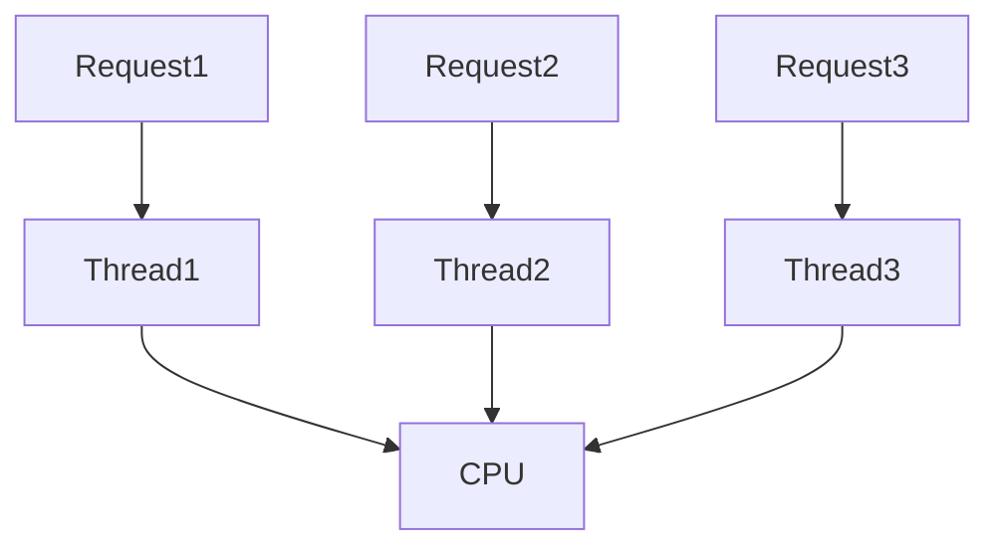
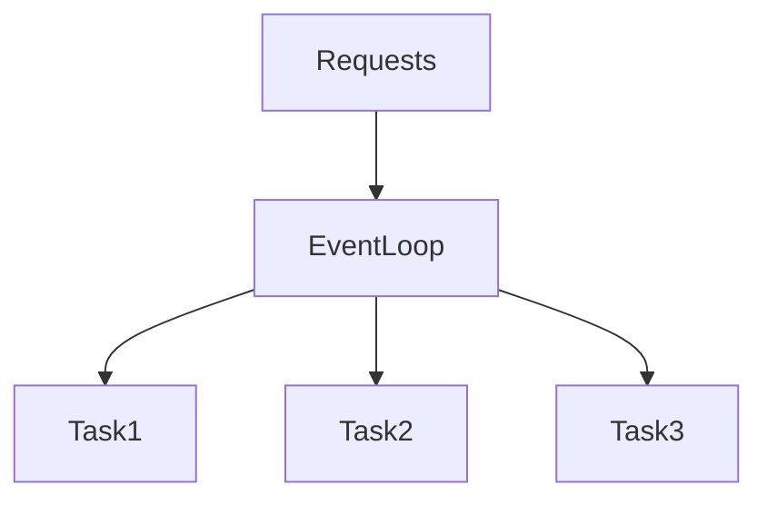
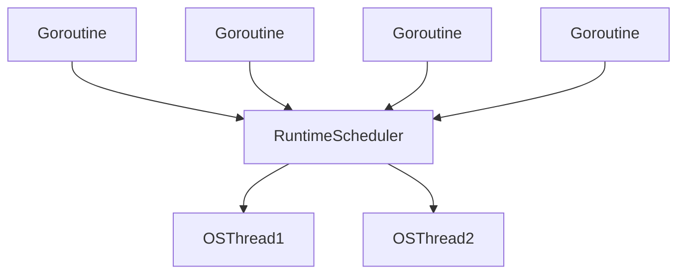
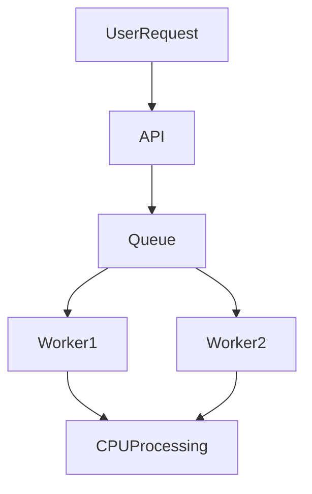

# Concurrency and Parallelism

Every backend system must deal with one fundamental reality:

> **Thousands of users interact with the system at the same time.**

When a user opens a website, sends an API request, uploads a file, or processes a payment, the server must respond quickly—even when **thousands of other users are doing the same thing simultaneously**.

If a backend server processed requests **one by one**, like a single checkout counter at a grocery store, the system would quickly become unusable.

Instead, modern systems rely on two powerful ideas:

- **Concurrency**
- **Parallelism**

These concepts allow software to **handle many tasks efficiently**, ensuring applications stay responsive even under heavy load.

Understanding them is one of the most important mental models for backend engineers.

---

# Introduction: Why Your Computer Needs to Juggle

Imagine a web server that can only process **one request at a time**.

Scenario:

1. User A sends a request.
2. The server starts processing it.
3. The server queries the database.
4. The database takes **100ms** to respond.

During this time:

- The server is **doing nothing**
- The CPU is **idle**
- Other users are **waiting**

This is extremely inefficient.

Now imagine **1,000 users** trying to access the system.

If the server processes requests sequentially, the system becomes painfully slow.

The solution is to design systems that can **manage multiple tasks at once**.

This is where **concurrency and parallelism** come in.

---

# 1. The High Cost of Doing Nothing

To understand why concurrency matters, we must understand how slow I/O operations are compared to CPU operations.

### CPU Speed

Modern CPUs can execute roughly:

```

~3 million instructions per millisecond

```

### Network Latency

A typical database request might take:

```

~100 milliseconds

```

During that time:

```

100ms × 3,000,000 instructions = 300 million instructions

```

That means the CPU could have executed **300 million operations**, but instead it **sat idle waiting for the network**.

This happens constantly in backend systems.

Typical waiting operations include:

- Database queries
- API calls
- File reads
- Cache lookups
- Network communication

Because of this, most backend systems spend:

```

70% – 95% of their time waiting

```

This makes them **I/O-bound**.

Concurrency solves this waste.

Instead of waiting idly, the system switches to **other work while waiting for I/O**.

---

# 2. The Core Concepts: Dealing With vs Doing

Although often confused, **concurrency and parallelism are different ideas**.

The easiest way to understand them is this:

| Concept | Meaning |
|------|------|
| Concurrency | Dealing with multiple tasks |
| Parallelism | Doing multiple tasks |

---

## Concurrency

Concurrency means:

> Structuring a program so multiple tasks can **progress independently**.

Even with a **single CPU core**, tasks can appear to run simultaneously by rapidly switching between them.

Think of a **chef cooking multiple dishes**:

1. Put pasta in boiling water
2. Chop vegetables
3. Stir the sauce
4. Check the pasta

The chef is not doing everything at once.

But all dishes **progress together**.

This is concurrency.

---

## Parallelism

Parallelism means:

> Multiple tasks execute **at the exact same time**.

This requires **multiple CPU cores**.

Example:

Two chefs in a kitchen.

- Chef A cooks pasta
- Chef B cooks sauce

Both tasks happen **simultaneously**.

---

## Key Differences

| Feature | Concurrency | Parallelism |
|------|------|------|
| Goal | Efficiency | Speed |
| CPU Requirement | Can work with 1 core | Requires multiple cores |
| Nature | Program structure | Hardware execution |
| Analogy | One juggler | Multiple jugglers |

---

# 3. A Tale of Two Requests

Let’s visualize how concurrency and parallelism work.

Assume two incoming requests:

```

Request A
Request B

```

---

# 3.1 Concurrency in Action (Single CPU Core)

With one CPU core, the system **switches between tasks**.

Timeline:

```

0ms
Request A starts

5ms
Request A performs DB query → waits

6ms
CPU switches to Request B

10ms
Request B performs DB query → waits

45ms
DB returns result for Request A

46ms
Request A resumes

60ms
Request B resumes

````

Visualization:

```mermaid
sequenceDiagram
participant A as Request A
participant B as Request B
participant DB as Database

A->>DB: Query
Note right of A: Waiting
B->>DB: Query
Note right of B: Waiting
DB-->>A: Result
DB-->>B: Result
````

Even though the CPU only executes **one instruction at a time**, both requests appear to run simultaneously.

This is concurrency.

---

# 3.2 Parallelism in Action (Multiple CPU Cores)

Now imagine a machine with **two CPU cores**.

Both requests can run simultaneously.

Timeline:

```
Core 1 → Request A
Core 2 → Request B
```

Both perform computation **at the same moment**.

Visualization:



Here the system is truly **doing two tasks at once**.

This is parallelism.

---

# 4. The Nature of Work: I/O-Bound vs CPU-Bound

Understanding the difference between **types of tasks** is critical.

---

# I/O-Bound Tasks

These tasks spend most of their time **waiting for external systems**.

Examples:

| Task             | Waiting For    |
| ---------------- | -------------- |
| Database queries | network + disk |
| API calls        | remote servers |
| Reading files    | disk           |
| Cache lookup     | network        |
| Logging          | disk I/O       |

In these tasks:

```
CPU usage is low
```

The main bottleneck is **latency from external systems**.

---

# CPU-Bound Tasks

These tasks require **heavy computation**.

Examples:

| Task             | CPU Work           |
| ---------------- | ------------------ |
| Image processing | matrix operations  |
| Encryption       | cryptographic math |
| Data compression | algorithms         |
| Video encoding   | pixel processing   |
| ML inference     | tensor computation |

Here the bottleneck is **CPU speed**.

---

# Why Backend Systems Are Mostly I/O-Bound

Most APIs do this pattern:

```
Request → Query DB → Process → Respond
```

The database query dominates latency.

Example:

| Step                | Time |
| ------------------- | ---- |
| Business logic      | 3ms  |
| DB query            | 90ms |
| Response formatting | 2ms  |

Total:

```
95ms waiting
5ms computing
```

Therefore:

> **Concurrency is more important than parallelism for backend systems.**

---

# 5. Models for Managing Concurrency

Modern runtimes use different approaches to manage tasks.

Three dominant models exist.

---

# 5.1 OS Threads (Traditional Model)

In this model, each task runs in a **thread managed by the operating system**.

Example architecture:

```
1 request → 1 thread
```

Diagram:



---

## Advantages

* Easy to reason about
* True parallelism
* Blocking operations allowed

---

## Disadvantages

### Memory Cost

Each thread requires a stack.

Typical stack size:

```
~1MB per thread
```

If a server creates:

```
10,000 threads
```

Memory usage:

```
10GB
```

Which is extremely expensive.

---

### Context Switching

The OS constantly switches between threads.

```
Thread A → pause
Thread B → resume
Thread C → resume
```

This switching requires saving and restoring:

* registers
* stack pointers
* execution state

These **context switches add latency**.

---

# 5.2 Event Loop Model

Used by systems like **Node.js**.

Instead of many threads, a **single thread manages many tasks**.

Architecture:



The key idea:

When a task needs I/O:

1. It registers a callback
2. It yields control
3. The event loop continues other tasks

---

## Example

```javascript
async function getUser() {
  const user = await db.query("SELECT * FROM users");
  return user;
}
```

When `await` executes:

1. Query starts
2. Function pauses
3. Event loop runs other tasks

When the database responds:

4. The function resumes

---

## Important Rule

> Never block the event loop.

A long CPU task can freeze the entire system.

Bad example:

```javascript
while(true){
  // infinite CPU loop
}
```

All requests stop responding.

---

# 5.3 Goroutines / Virtual Threads

Used by:

* Go (Goroutines)
* Java (Virtual Threads)
* Kotlin coroutines

This model creates **very lightweight threads managed by the runtime**.

Architecture:



Thousands of goroutines run on a few OS threads.

---

## Benefits

| Feature           | Benefit            |
| ----------------- | ------------------ |
| Tiny memory usage | thousands of tasks |
| Fast switching    | runtime controlled |
| Simple code       | looks synchronous  |

Example Go code:

```go
go fetchUser()
go fetchOrders()
```

Each runs concurrently.

---

# 6. The Danger of Shared State

Concurrency introduces new bugs.

The most famous one:

> **Race Conditions**

A race condition happens when multiple tasks modify shared data simultaneously.

---

# Example: Lost Update

Imagine a shared counter.

Initial value:

```
counter = 0
```

Two tasks increment it.

### Step-by-step

```
Thread A reads counter (0)
Thread B reads counter (0)

Thread A writes 1
Thread B writes 1
```

Final value:

```
1
```

Expected:

```
2
```

One update was lost.

---

# Async Code Is Not Safe Either

Even async code can suffer race conditions.

Example:

```javascript
let balance = 100;

async function withdraw(amount) {
  if (balance >= amount) {
    await processWithdrawal(amount);
    balance = balance - amount;
  }
}
```

Now imagine two withdrawals.

```
withdraw(100)
withdraw(100)
```

Timeline:

```
Call 1 checks balance (100)
Call 1 waits

Call 2 checks balance (100)
Call 2 waits

Call 1 resumes → balance = 0
Call 2 resumes → balance = -100
```

Final balance:

```
-100
```

This is an invalid state.

---

# Solutions to Race Conditions

Common approaches:

| Solution          | Idea                        |
| ----------------- | --------------------------- |
| Locks / Mutex     | only one task modifies data |
| Atomic operations | hardware-supported updates  |
| Transactions      | database consistency        |
| Message queues    | serialized updates          |
| Immutability      | avoid shared state          |

---

# 7. Choosing the Right Tool

The best approach depends on **workload type**.

---

## I/O-Bound Workloads

Examples:

* web servers
* APIs
* microservices

Best models:

* Event loop
* Async/await
* Goroutines
* Virtual threads

Goal:

```
Handle massive concurrency efficiently
```

---

## CPU-Bound Workloads

Examples:

* image processing
* ML workloads
* encryption
* simulations

Best model:

```
Parallelism across CPU cores
```

Use:

* thread pools
* parallel workers
* GPU acceleration

---

# Architecture Strategy

Many real systems combine both.

Example:

```
API server → async concurrency
background workers → parallel CPU tasks
```

Example pipeline:



The API stays responsive while workers perform heavy computation.

---

# Key Takeaways

1. **Concurrency handles many tasks efficiently.**
2. **Parallelism performs tasks simultaneously using multiple cores.**
3. **Most backend systems are I/O-bound.**
4. **Concurrency prevents wasted CPU time during I/O waits.**
5. **Event loops excel for high-concurrency workloads.**
6. **Threads enable CPU parallelism but have overhead.**
7. **Goroutines and virtual threads combine efficiency and simplicity.**
8. **Shared state creates race conditions.**
9. **Locks, transactions, and immutability help prevent concurrency bugs.**

---

# Final Insight

Concurrency and parallelism are not competing ideas.

They are **complementary tools**.

Concurrency ensures that systems remain **responsive and efficient** while waiting for slow external operations.

Parallelism ensures that **heavy computations complete faster** by using multiple CPU cores.

The most scalable systems understand **when to use each** and combine them intelligently.