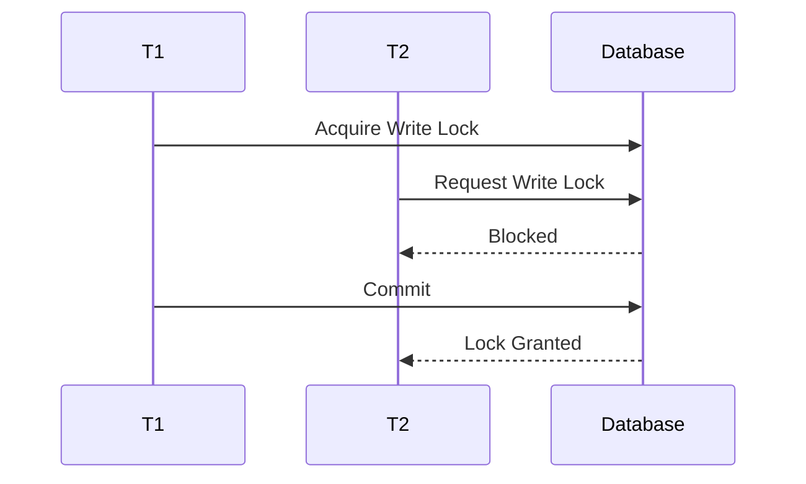
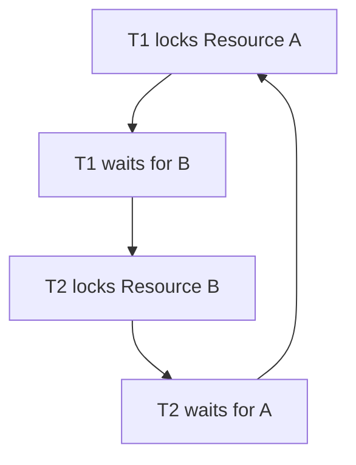
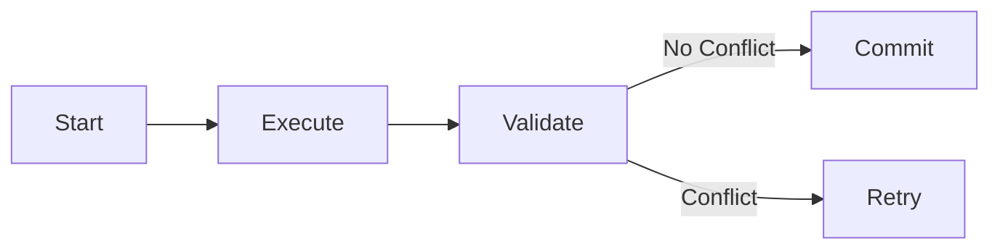
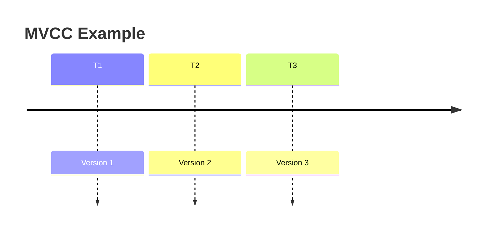
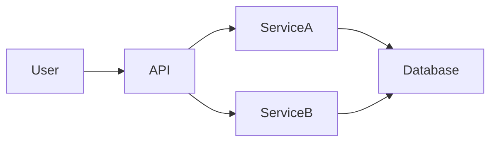
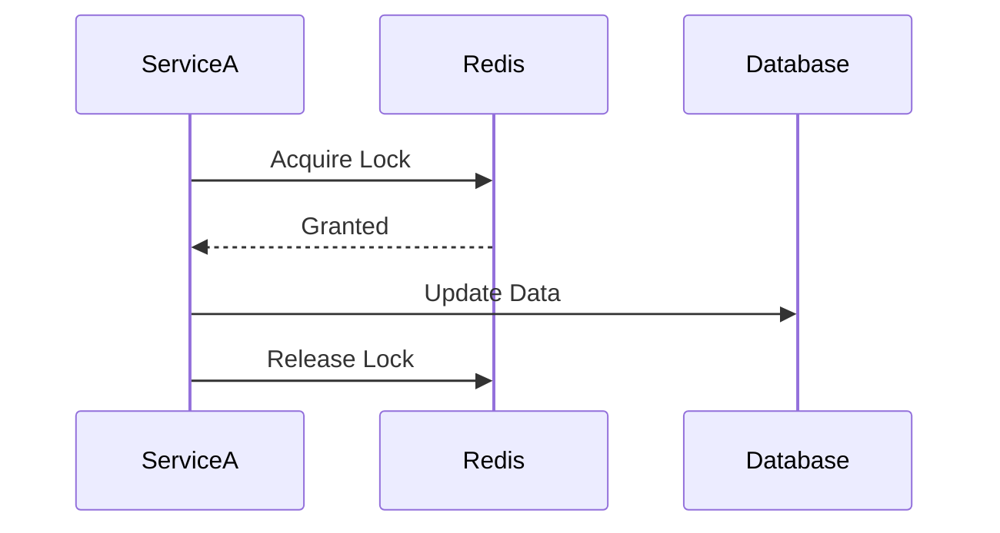
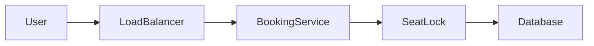

# Concurrency Control

Modern systems rarely execute one request at a time.

Instead, **thousands or even millions of operations happen simultaneously**.

Examples:

- Multiple users updating their profiles
- Thousands of people purchasing the same product
- Concurrent bank transfers
- Multiple services writing to the same database

When multiple operations try to **access or modify shared data simultaneously**, problems can occur.

This is where **Concurrency Control** becomes essential.

> **Concurrency Control ensures that multiple operations can run safely without corrupting data.**

---

# Why Concurrency Control Matters

Imagine an e-commerce website where **two users buy the last item simultaneously**.

Initial inventory:

```

Stock = 1

```

Two users try to purchase:

```

User A reads stock = 1
User B reads stock = 1

```

Both decrement:

```

Stock = 0
Stock = -1

````

Now the system has sold **two items when only one existed**.

This is a classic **race condition**.

---

# What is a Race Condition?

A **race condition** occurs when:

- Multiple processes access shared data
- The final result depends on the **timing of execution**

---

```mermaid
sequenceDiagram
participant UserA
participant UserB
participant Database

UserA->>Database: Read stock (1)
UserB->>Database: Read stock (1)
UserA->>Database: Update stock (0)
UserB->>Database: Update stock (-1)
````

Result:

```
Inventory becomes incorrect.
```

Concurrency control prevents this.

---

# Goals of Concurrency Control

A well-designed concurrency system ensures:

| Goal             | Description                  |
| ---------------- | ---------------------------- |
| Data Consistency | Data remains correct         |
| Isolation        | Transactions don't interfere |
| Durability       | Updates persist              |
| Correctness      | System behaves predictably   |

These align closely with **ACID properties** in databases.

---

# Real-World Analogy

Imagine **two people editing the same Google Doc paragraph simultaneously**.

Without coordination:

```
Person A writes sentence
Person B overwrites it
```

Data loss occurs.

Concurrency control is like:

* Locking the paragraph
* Merging edits
* Detecting conflicts

---

# Types of Concurrency Problems

## 1 Lost Update

Two transactions update the same data.

Final update overwrites the other.

Example:

```
Balance = 100
T1 adds 20 → 120
T2 subtracts 10 → 90
```

Correct answer:

```
110
```

But system ends with:

```
90 or 120
```

---

## 2 Dirty Reads

A transaction reads **uncommitted data**.

Example:

```
T1 updates balance → 500
T2 reads 500
T1 rolls back
```

Now T2 read invalid data.

---

## 3 Non-repeatable Reads

Data changes between reads.

Example:

```
T1 reads price = 100
T2 updates price = 150
T1 reads again → 150
```

Same query returns different results.

---

## 4 Phantom Reads

New rows appear between queries.

Example:

```
SELECT * FROM orders WHERE amount > 100
```

Another transaction inserts a row.

Query result changes unexpectedly.

---

# Concurrency Control Techniques

There are multiple strategies.

| Technique          | Idea                              |
| ------------------ | --------------------------------- |
| Locks              | Prevent simultaneous modification |
| Optimistic Control | Assume no conflicts               |
| Versioning         | Track multiple versions           |
| Timestamp Ordering | Order transactions                |
| MVCC               | Multi-version concurrency control |

---

# Pessimistic Concurrency Control (Locking)

This approach **assumes conflicts will happen**, so it prevents them.

Data is **locked before modification**.

---

## Lock Types

### Shared Lock (Read Lock)

Multiple transactions can read.

```
T1 read
T2 read
T3 read
```

But writes are blocked.

---

### Exclusive Lock (Write Lock)

Only one transaction allowed.

```
T1 writes
T2 blocked
T3 blocked
```

---

## Locking Example



---

# Problems with Locking

| Problem             | Explanation                   |
| ------------------- | ----------------------------- |
| Deadlocks           | Two transactions wait forever |
| Lock contention     | Too many processes waiting    |
| Reduced performance | Blocking slows system         |

---

# Deadlock Example



Neither transaction can proceed.

---

# Optimistic Concurrency Control

Instead of locking, this method assumes:

> Conflicts are rare.

Transactions execute **without locks**.

At commit time, the system checks for conflicts.

---

## Steps

1 Execute transaction
2 Record read/write set
3 Validate before commit
4 If conflict → retry

---



---

# Example: Optimistic Locking with Version Numbers

Database rows contain a **version field**.

Example table:

| ID  | Value | Version |
| --- | ----- | ------- |
| 101 | 50    | 1       |

Transaction reads:

```
value = 50
version = 1
```

Update query:

```sql
UPDATE accounts
SET value = 60, version = 2
WHERE id = 101 AND version = 1
```

If version changed → update fails.

---

# Multi-Version Concurrency Control (MVCC)

MVCC allows **multiple versions of the same data**.

Readers don't block writers.

Writers don't block readers.

---



Each transaction sees a **snapshot of data**.

---

# Example

Initial state:

```
Balance = 100
Version = 1
```

T1 reads version 1.

T2 updates → version 2.

T1 still sees version 1.

---

# MVCC Advantages

| Advantage          | Reason               |
| ------------------ | -------------------- |
| High performance   | No read locks        |
| Better scalability | Many readers allowed |
| Snapshot isolation | Consistent reads     |

Used heavily in modern databases.

---

# Distributed Concurrency Control

In distributed systems, the challenge becomes harder.

Multiple services or databases may modify data.

Example architecture:



Two services might update the same record.

Solutions include:

* Distributed locks
* Idempotency
* Transaction coordination
* Event sourcing

---

# Distributed Locking

A lock stored in **shared infrastructure**.

Example:

```
Redis
Zookeeper
Etcd
```

---

## Example Flow



Only one service updates data.

---

# Idempotency

Idempotent operations ensure **repeated requests don't cause multiple effects**.

Example:

Payment API.

Request:

```
POST /payment
Idempotency-Key: 123
```

If client retries:

```
Server returns previous result
```

No double charge.

---

# Concurrency Control in Real Systems

Large-scale systems use combinations.

| System       | Technique          |
| ------------ | ------------------ |
| PostgreSQL   | MVCC               |
| MySQL InnoDB | MVCC + locking     |
| DynamoDB     | Conditional writes |
| Redis        | Distributed locks  |

---

# Example: Ticket Booking System

Many users trying to book same seat.

Architecture:



Steps:

1 Lock seat
2 Check availability
3 Reserve seat
4 Release lock

Prevents double booking.

---

# Concurrency Control vs Parallelism

These concepts are related but different.

| Concept     | Meaning                       |
| ----------- | ----------------------------- |
| Concurrency | Multiple tasks in progress    |
| Parallelism | Tasks executed simultaneously |

Concurrency control ensures correctness when concurrency exists.

---

# Performance Tradeoffs

| Strategy            | Performance | Safety |
| ------------------- | ----------- | ------ |
| Pessimistic Locking | Lower       | High   |
| Optimistic Locking  | High        | Medium |
| MVCC                | Very High   | High   |

Choosing the right strategy depends on **workload characteristics**.

---

# When to Use Which Approach

| Scenario                  | Best Strategy       |
| ------------------------- | ------------------- |
| High contention           | Pessimistic locking |
| Rare conflicts            | Optimistic locking  |
| Read-heavy systems        | MVCC                |
| Distributed microservices | Distributed locks   |

---

# Summary

Concurrency Control is fundamental in **reliable distributed systems**.

It ensures that:

* Multiple operations can run simultaneously
* Data remains correct
* Conflicts are handled safely

Key approaches include:

* Lock-based control
* Optimistic concurrency
* MVCC
* Distributed locking

Without concurrency control, large-scale systems would suffer from:

* Data corruption
* Race conditions
* Inconsistent states

Thus, concurrency control is a **core pillar of scalable system design**.

---

# Final Mental Model

Think of concurrency control as:

```
Traffic lights for data.
```

Without traffic lights:

```
Cars collide.
```

With coordination:

```
Millions of vehicles move safely.
```

Similarly, concurrency control allows **thousands of operations to run safely at the same time**.
