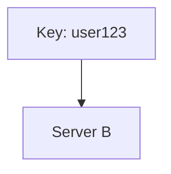
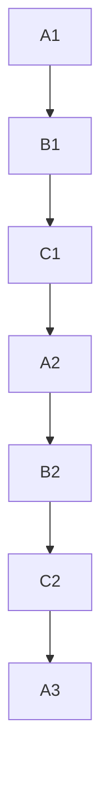
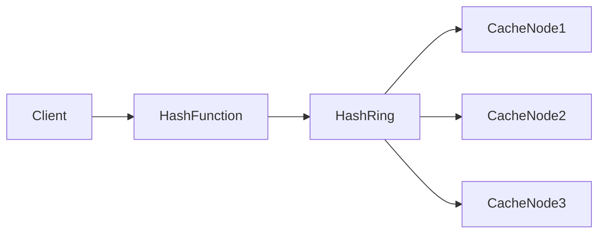
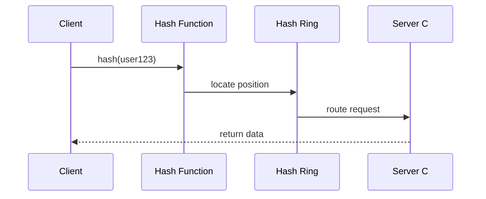

# Consistent Hashing

In distributed systems, one of the most fundamental challenges is **efficiently distributing data across multiple machines**.

If you are building systems like:

- Distributed caches
- Distributed databases
- Content delivery networks
- Load balancers
- Key-value stores

You must answer an important question:

> **Which server should store a particular piece of data?**

Consistent Hashing is a technique designed specifically to solve this problem **efficiently and with minimal disruption when servers are added or removed**.

It is widely used in large-scale systems like:

- Amazon Dynamo
- Apache Cassandra
- Distributed caches
- CDN routing systems

This article will explain Consistent Hashing **deeply and intuitively**, with diagrams, examples, and real-world scenarios.

---

# The Problem With Traditional Hashing

Suppose we have a distributed cache system with **4 servers**.

```

Server A
Server B
Server C
Server D

```

We decide to distribute keys using a simple hash function.

```

server = hash(key) % N

```

Where:

```

N = number of servers

```

---

## Example

| Key | hash(key) | Server |
|----|----|----|
| user123 | 14 | 14 % 4 = Server C |
| user456 | 9 | 9 % 4 = Server B |
| user789 | 22 | 22 % 4 = Server C |

---

# The Major Problem

Now suppose we **add a new server**.

```

Server A
Server B
Server C
Server D
Server E

```

Now:

```

server = hash(key) % 5

```

### What happens?

Almost **every key gets reassigned**.

| Key | Old Server | New Server |
|----|----|----|
| user123 | C | D |
| user456 | B | E |
| user789 | C | C |

This means:

- Massive **data reshuffling**
- Cache **miss storms**
- Huge **network traffic**
- System **instability**

This is unacceptable for large-scale systems.

---

# The Core Idea of Consistent Hashing

Instead of mapping keys directly to servers using modulo arithmetic, Consistent Hashing maps **both servers and keys onto a circular hash space**.

This structure is called a **Hash Ring**.

---

# The Hash Ring

Imagine the hash space as a **circle**.

Example hash range:

```

0 → 2^32 - 1

````

Servers and keys are placed on this ring using the same hash function.

---

```mermaid
graph LR

A[Server A] --> B[Server B]
B --> C[Server C]
C --> D[Server D]
D --> A
````

But the real representation is circular.

---

## Hash Ring Visualization

```mermaid
flowchart LR
    A((0))
    B((Server A))
    C((Server B))
    D((Server C))
    E((Server D))
    F((2^32))

    A --> B --> C --> D --> E --> F
```

Conceptually this wraps into a **ring**.

---

# How Keys Are Assigned

Steps:

1. Hash the **key**
2. Place it on the **ring**
3. Move **clockwise**
4. The first server encountered owns the key

---

## Example

Servers placed on the ring:

```
Server A → hash(A)
Server B → hash(B)
Server C → hash(C)
Server D → hash(D)
```

Key placement:

```
hash(user123)
```

The key is stored on the **next server clockwise**.

---



---

# Example Distribution

| Key   | Hash Position | Assigned Server |
| ----- | ------------- | --------------- |
| user1 | 15            | Server B        |
| user2 | 80            | Server D        |
| user3 | 42            | Server C        |

---

# What Happens When a Server Joins?

Suppose **Server E** is added.

In Consistent Hashing:

* Only keys between **Server D and Server E** move.

Everything else remains unchanged.

---


---

## Key Insight

Only **a small portion of keys move**.

Typically:

```
Keys moved ≈ K / N
```

Where:

```
K = total keys
N = servers
```

This property makes Consistent Hashing extremely efficient.

---

# What Happens When a Server Fails?

If **Server C crashes**, only its keys move.

They get reassigned to the **next clockwise server**.

---


Keys that belonged to C now go to **Server D**.

---

# Real-World Analogy

Imagine a **circular pizza table**.

* Each seat = server
* Each pizza slice = data

If a person leaves:

* Only slices near that seat shift
* Everyone else keeps their slices

This avoids total redistribution.

---

# The Problem of Uneven Distribution

A naive consistent hashing implementation can cause **load imbalance**.

Example:

```
Server A → many keys
Server B → few keys
Server C → moderate keys
```

Because servers are randomly placed on the ring.

---

# The Solution: Virtual Nodes

Instead of placing **one position per server**, we place **multiple positions per server**.

These are called **Virtual Nodes (VNodes)**.

---

## Example

Instead of:

```
Server A
Server B
Server C
```

We create:

```
A1
A2
A3
B1
B2
B3
C1
C2
C3
```

Each virtual node has a separate hash.

---



---

# Benefits of Virtual Nodes

| Benefit                  | Explanation                        |
| ------------------------ | ---------------------------------- |
| Better load distribution | Keys spread evenly                 |
| Easier scaling           | Add more virtual nodes             |
| Fault tolerance          | Failures affect smaller partitions |

---

# Key Advantages of Consistent Hashing

| Feature                | Benefit                           |
| ---------------------- | --------------------------------- |
| Minimal rebalancing    | Only small fraction of keys move  |
| High scalability       | Easily add/remove nodes           |
| Efficient distribution | Works well in distributed systems |
| Fault tolerance        | Handles node failures gracefully  |

---

# Systems That Use Consistent Hashing

Many large-scale systems rely on this technique.

Examples:

| System             | Usage                   |
| ------------------ | ----------------------- |
| Cassandra          | Data partitioning       |
| DynamoDB           | Distributed key storage |
| Riak               | Object placement        |
| Memcached clusters | Cache sharding          |
| CDN routing        | Edge node selection     |

---

# Consistent Hashing in Distributed Cache

Architecture example:



Flow:

1. Client sends request
2. Key hashed
3. Hash mapped to ring
4. Request routed to correct cache node

---

# Simplified Implementation (JavaScript)

Below is a conceptual implementation.

```javascript
class ConsistentHashRing {
  constructor(nodes = [], virtualNodes = 100) {
    this.ring = new Map();
    this.sortedKeys = [];
    this.virtualNodes = virtualNodes;

    nodes.forEach(node => this.addNode(node));
  }

  hash(key) {
    let hash = 0;
    for (let i = 0; i < key.length; i++) {
      hash = (hash * 31 + key.charCodeAt(i)) >>> 0;
    }
    return hash;
  }

  addNode(node) {
    for (let i = 0; i < this.virtualNodes; i++) {
      const vnode = `${node}-${i}`;
      const hash = this.hash(vnode);
      this.ring.set(hash, node);
      this.sortedKeys.push(hash);
    }

    this.sortedKeys.sort((a, b) => a - b);
  }

  getNode(key) {
    const hash = this.hash(key);

    for (let k of this.sortedKeys) {
      if (hash <= k) return this.ring.get(k);
    }

    return this.ring.get(this.sortedKeys[0]);
  }
}
```

---

# Visualizing Key Lookup



---

# Time Complexity

| Operation   | Complexity |
| ----------- | ---------- |
| Add Node    | O(V log N) |
| Remove Node | O(V log N) |
| Lookup      | O(log N)   |

Where:

```
N = number of nodes
V = virtual nodes
```

---

# When Should You Use Consistent Hashing?

It is ideal when systems need:

* Dynamic scaling
* Minimal data reshuffling
* Distributed storage
* Fault tolerance

Common use cases:

* Distributed caching
* NoSQL databases
* Load balancing
* Microservices routing
* CDN request routing

---

# Limitations

| Limitation                  | Explanation                   |
| --------------------------- | ----------------------------- |
| Complex implementation      | Harder than simple hashing    |
| Metadata overhead           | Maintaining hash ring         |
| Rebalancing cost            | Still exists but reduced      |
| Requires good hash function | Poor hashing causes imbalance |

---

# Summary

Consistent Hashing is one of the **most powerful techniques used in distributed system design**.

It solves the critical challenge of **efficiently distributing data across changing clusters**.

Key ideas:

* Hash both **servers and keys**
* Use a **circular hash ring**
* Assign keys to **next clockwise server**
* Use **virtual nodes** for load balancing

Because of these properties, Consistent Hashing enables systems to scale from **a few servers to thousands** with minimal disruption.

---

# Final Mental Model

Think of Consistent Hashing as:

```
A circular map where both servers and data live.
Data walks clockwise until it finds its home.
```

This simple idea powers many of the **largest distributed systems in the world**.