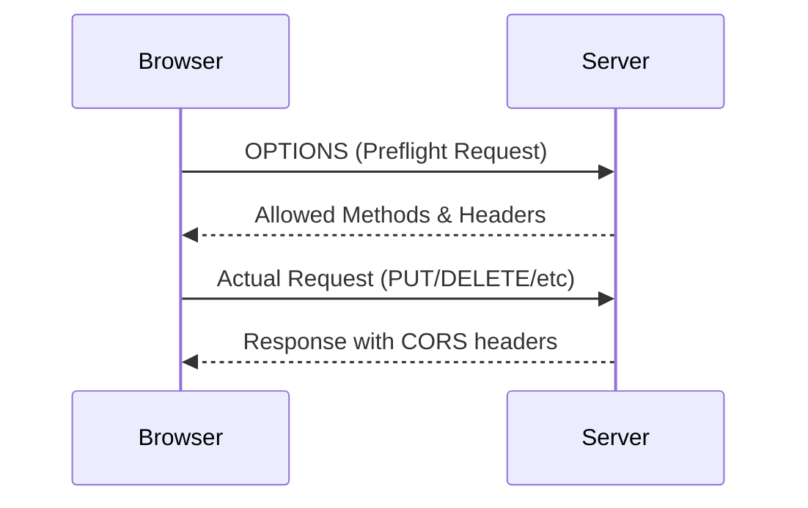
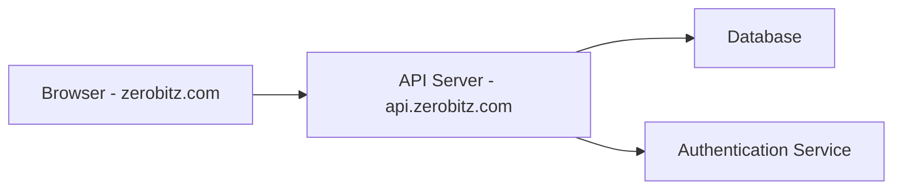

Modern web applications frequently need to communicate with resources hosted on different domains. However, browsers enforce strict security rules to protect users from malicious websites attempting to access sensitive data.

**Cross-Origin Resource Sharing (CORS)** is an HTTP-header-based mechanism that allows servers to **explicitly permit cross-origin requests** in a controlled and secure manner.

CORS relaxes the browser’s **Same-Origin Policy (SOP)** while still maintaining security boundaries.

---

# The Security Problem

To understand CORS, we first need to understand the **security threat it prevents**.

Imagine the following scenario.

You are logged into **facebook.com** in your browser. Because you logged in earlier, your browser stores:

- Session cookies
- Authentication tokens
- User identity information

Now you open another tab and visit a malicious website:

```

[https://evil-site.com](https://evil-site.com)

````

That site contains the following JavaScript:

```javascript
fetch("https://facebook.com/api/posts")
  .then(res => res.json())
  .then(data => console.log(data));
````

If browsers allowed this request freely, the following would happen:

1. The request would automatically include your **Facebook cookies**
2. Facebook would believe **you made the request**
3. The malicious site would receive **your private Facebook data**

This would be a massive **security breach**.

Even worse, malicious scripts could do things like:

```javascript
fetch("https://facebook.com/api/reset-password", {
  method: "POST"
});
```

This is why browsers enforce a strict rule called **Same-Origin Policy**.

---

# Same-Origin Policy (SOP)

The **Same-Origin Policy** is a browser security mechanism that **blocks websites from accessing resources from another origin**.

This prevents malicious websites from reading sensitive information from other domains.

By default, a web page can only access resources from the **same origin**.

---

# What is an Origin?

An **Origin** is defined by the combination of:

```
Origin = Scheme + Host + Port
```

Example origin:

```
https://zerobitz.com:443
```

Breakdown:

| Component | Example      |
| --------- | ------------ |
| Scheme    | https        |
| Host      | zerobitz.com |
| Port      | 443          |

---

## Same Origin Examples

These are **same origin**:

```
https://zerobitz.com/a
https://zerobitz.com/b
```

Why?

* Scheme same → https
* Host same → zerobitz.com
* Port same → 443

---

## Different Origin Examples

These are **different origins**:

```
https://zerobitz.com
https://api.zerobitz.com
```

Why?

Hosts are different:

```
zerobitz.com
api.zerobitz.com
```

Subdomains count as **different origins**.

---

# Important Clarification: CORS Is Browser Only

One very important thing developers misunderstand:

**CORS is enforced only by browsers.**

Server-to-server communication does **not enforce CORS**.

Example tools that ignore CORS:

* curl
* Postman
* backend servers
* mobile apps
* CLI scripts

Example:

```bash
curl https://facebook.com/api/posts
```

This request works because **curl does not enforce browser security rules**.

The browser is the **security guard**, not the server.

---

# Why CORS Exists

Modern applications are rarely served from a single domain.

Example architecture:

```
Frontend: https://app.company.com
Backend API: https://api.company.com
Auth Service: https://auth.company.com
CDN: https://cdn.company.com
```

Without CORS:

```
app.company.com -> api.company.com
```

would be **blocked by the browser**.

CORS allows the server to say:

> "Yes, I trust requests coming from this origin."

---

# How CORS Works

CORS works using **HTTP headers** exchanged between the browser and the server.

There are two main flows:

1. **Simple Request**
2. **Preflight Request**

---

# Simple Requests

A **simple request** does not require a preflight check.

Simple requests include:

HTTP Methods:

```
GET
POST
HEAD
```

Allowed headers include:

```
Accept
Accept-Language
Content-Language
Content-Type (limited)
```

Example request:

```javascript
fetch("https://api.zerobitz.com/data")
```

---

## Server Response

The server must respond with:

```
Access-Control-Allow-Origin
```

Example:

```
Access-Control-Allow-Origin: https://zerobitz.com
```

This tells the browser:

> "Requests from zerobitz.com are allowed."

If this header is missing, the browser blocks the response.

---

# Non-Simple Requests

Some requests are considered **dangerous or complex**.

Examples:

* PUT
* DELETE
* PATCH
* Custom headers
* Authorization headers

Example:

```javascript
fetch("https://api.zerobitz.com/user", {
  method: "PUT",
  headers: {
    "Authorization": "Bearer token"
  }
});
```

Before sending this request, the browser performs a **preflight request**.

---

# Preflight Request

The browser sends an **OPTIONS request** to ask the server for permission.

Example preflight request:

```
OPTIONS /user
Origin: https://zerobitz.com
Access-Control-Request-Method: PUT
Access-Control-Request-Headers: Authorization
```

The server must respond with allowed permissions.

Example response:

```
Access-Control-Allow-Origin: https://zerobitz.com
Access-Control-Allow-Methods: GET, POST, PUT, DELETE
Access-Control-Allow-Headers: Authorization
```

If the response allows the request, the browser proceeds.

---

## Flow Diagram



---

# Important CORS Headers

---

## Access-Control-Allow-Origin

Defines which origins can access the resource.

Example:

```
Access-Control-Allow-Origin: https://zerobitz.com
```

Allow any origin:

```
Access-Control-Allow-Origin: *
```

But **wildcard should be used carefully**.

---

## Access-Control-Allow-Methods

Defines allowed HTTP methods.

Example:

```
Access-Control-Allow-Methods: GET, POST, PUT, DELETE
```

---

## Access-Control-Allow-Headers

Defines allowed request headers.

Example:

```
Access-Control-Allow-Headers: Content-Type, Authorization
```

---

## Access-Control-Allow-Credentials

Allows sending credentials like:

* cookies
* authorization headers
* TLS client certificates

Example:

```
Access-Control-Allow-Credentials: true
```

---

## Important Rule

If credentials are enabled:

```
Access-Control-Allow-Credentials: true
```

Then:

```
Access-Control-Allow-Origin: *
```

**is NOT allowed.**

You must specify an exact origin.

Example:

```
Access-Control-Allow-Origin: https://zerobitz.com
```

---

## Access-Control-Max-Age

Allows caching the preflight request.

Example:

```
Access-Control-Max-Age: 3600
```

Meaning:

```
Preflight valid for 1 hour
```

This improves performance.

---

# Example CORS Server Implementation (Node.js)

Example using Express.

```javascript
import express from "express";

const app = express();

app.use((req, res, next) => {
  res.setHeader("Access-Control-Allow-Origin", "https://zerobitz.com");
  res.setHeader("Access-Control-Allow-Methods", "GET, POST, PUT, DELETE");
  res.setHeader("Access-Control-Allow-Headers", "Content-Type, Authorization");
  res.setHeader("Access-Control-Allow-Credentials", "true");

  next();
});

app.get("/data", (req, res) => {
  res.json({ message: "CORS enabled" });
});

app.listen(3000);
```

---

# Real World Architecture Example



Browser sends:

```
Origin: https://zerobitz.com
```

Server validates origin and returns permission headers.

---

# Common Use Cases of CORS

### Third-party API usage

Example:

```
weather.com API
maps API
payment gateways
```

---

### CDN Resources

Example:

```
cdn.company.com/fonts
cdn.company.com/images
```

---

### Frontend + Backend Separation

Example:

```
Frontend: app.company.com
Backend: api.company.com
```

---

# Security Considerations

CORS can introduce vulnerabilities if misconfigured.

---

## Dangerous Configuration

Example:

```
Access-Control-Allow-Origin: *
Access-Control-Allow-Credentials: true
```

This combination is extremely dangerous because:

Any website could send authenticated requests.

---

## Always Validate Origin

Example secure pattern:

```javascript
const allowedOrigins = [
  "https://zerobitz.com",
  "https://admin.zerobitz.com"
];

if (allowedOrigins.includes(req.headers.origin)) {
  res.setHeader("Access-Control-Allow-Origin", req.headers.origin);
}
```

---

## Protect Against CSRF

CORS does **not fully protect against CSRF**.

Use additional protections:

* CSRF tokens
* SameSite cookies
* Authorization headers
* Anti-forgery tokens

---

# Common Developer Mistakes

---

### Mistake 1

Assuming CORS is a server problem.

Reality:

```
CORS is a browser security feature
```

---

### Mistake 2

Trying to "disable CORS".

You cannot disable it for users' browsers.

You must configure your server.

---

### Mistake 3

Allowing wildcard origins in production.

```
Access-Control-Allow-Origin: *
```

This is often insecure.

---

# Key Takeaways

* CORS is a **browser security mechanism**
* It relaxes the **Same-Origin Policy safely**
* Servers must **explicitly allow cross-origin requests**
* **Preflight requests** verify permission before sensitive operations
* Credentials require **explicit origin specification**
* Misconfiguration can lead to **serious security vulnerabilities**

---

CORS is a critical part of modern web architecture, enabling secure communication between distributed frontend and backend systems while protecting users from malicious cross-origin attacks.
