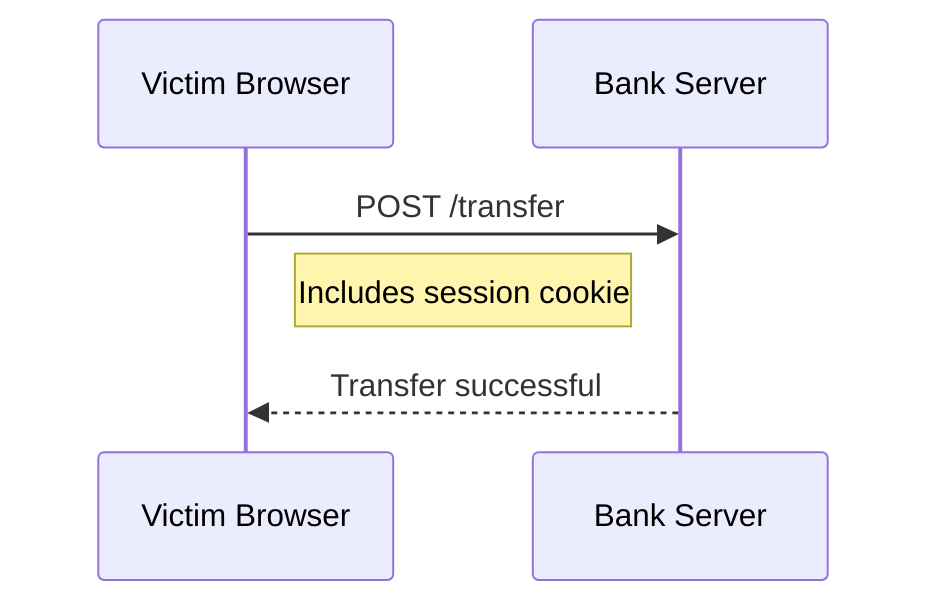
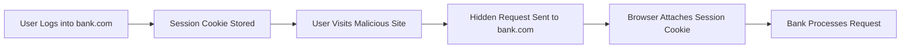

**Cross-Site Request Forgery (CSRF)**, also called **XSRF** or **Session Riding**, is a web security vulnerability where an attacker tricks an authenticated user into performing unintended actions on a web application.

The attack exploits the **trust a server has in the user's browser**.

Since browsers automatically attach **authentication cookies** to requests, a malicious website can trigger requests to another site **using the victim's active session**.

This can cause serious consequences such as:

- transferring money
- changing account passwords
- modifying profile information
- posting content on behalf of the user

---

# Core Idea Behind CSRF

Web applications often rely on **cookies for authentication**.

Example login flow:

```mermaid
sequenceDiagram
User->>Server: Login Request
Server-->>Browser: Session Cookie
Browser->>Server: Authenticated Requests
````

Once authenticated, every request automatically includes:

```id="a3g9rx"
Cookie: session_id=abc123
```

The server assumes:

> If the cookie is valid, the request is legitimate.

CSRF **abuses this assumption**.

---

# Why CSRF is Dangerous

Browsers automatically include cookies in **every request to the same domain**, regardless of where the request originated.

Example scenario:

User logs into:

```id="nyx4jk"
https://bank.com
```

Browser stores:

```id="8f8o6g"
session_cookie = logged_in_user
```

Later the user visits:

```id="qhj1rw"
https://malicious-site.com
```

That page secretly triggers:

```html

```

The browser automatically sends:

```id="m2s6yl"
Cookie: session_cookie=logged_in_user
```

The bank receives:

```
GET /transfer?amount=1000&to=attacker
```

And processes it as a **valid request from the user**.

The user never intended this action.

---

# CSRF vs XSS

These two vulnerabilities are often confused.

| Feature                                | CSRF                      | XSS                       |
| -------------------------------------- | ------------------------- | ------------------------- |
| Requires injecting code in target site | ❌ No                      | ✅ Yes                     |
| Exploits browser trust                 | ✅ Yes                     | ❌ Not primarily           |
| Uses victim session                    | ✅ Yes                     | Sometimes                 |
| Goal                                   | Perform actions as victim | Execute malicious scripts |

CSRF **does not require compromising the target site**.

It only requires **tricking the user into visiting another page**.

---

# How CSRF Attacks Work

A typical CSRF attack consists of three steps.

---

# 1. Victim Authentication

The victim logs into the target application.

Example:

```id="zwu8r2"
https://bank.com
```

Server sets a cookie:

```id="c8f6sb"
Set-Cookie: session_id=abc123
```

The user is now authenticated.

---

# 2. Malicious Payload Delivery

The attacker lures the victim to interact with malicious content.

Common delivery methods:

* phishing email
* malicious website
* compromised advertisement
* injected script
* hidden iframe

Example malicious page:

```html
<form action="https://bank.com/transfer" method="POST">
  <input type="hidden" name="amount" value="5000">
  <input type="hidden" name="to" value="attacker">
</form>

<script>
document.forms[0].submit();
</script>
```

The form automatically submits when the page loads.

---

# 3. Forged Request Execution

The victim's browser sends the request.



The server cannot distinguish between:

```
User intentionally submitted the request
```

or

```
Malicious site triggered it
```

---

# Real Attack Example

Bank transfer endpoint:

```id="4iv4fi"
POST https://bank.com/transfer
```

Parameters:

```id="5wt8y0"
amount=1000
to=attacker_account
```

Attacker page:

```html

```

When the victim loads the page, the request executes automatically.

---

# Why CSRF Works

CSRF works because of three browser behaviors.

---

## 1. Cookies are automatically attached

Example request:

```id="hzn9po"
POST /transfer
Cookie: session_id=abc123
```

The browser does this automatically.

---

## 2. Servers trust cookies

Many systems rely only on:

```id="s7v5m4"
session_cookie
```

to identify users.

---

## 3. Servers don't verify request origin

Without verification, the server cannot tell if the request came from:

```
bank.com
```

or

```
malicious-site.com
```

---

# Prevention Techniques

To prevent CSRF attacks, applications must verify **that requests originate from trusted sources**.

---

# 1. Synchronizer Token Pattern (CSRF Tokens)

This is the **most common protection technique**.

The server generates a **random secret token**.

Example:

```id="8nbg7j"
csrf_token = f91a82db129fa
```

This token is included in forms.

Example:

```html
<form action="/transfer" method="POST">
  <input type="hidden" name="csrf_token" value="f91a82db129fa">
</form>
```

When the form is submitted:

```id="6tbmww"
POST /transfer
csrf_token=f91a82db129fa
```

Server validates the token.

If the token is missing or invalid:

```
Request rejected
```

---

## Why This Works

Attackers **cannot read tokens from another origin** due to browser security rules.

So they cannot include the correct token.

---

## Example Implementation (Node.js)

```javascript
import crypto from "crypto";

function generateCSRFToken() {
  return crypto.randomBytes(32).toString("hex");
}
```

Attach token to session:

```javascript
req.session.csrfToken = generateCSRFToken();
```

Validate request:

```javascript
if (req.body.csrfToken !== req.session.csrfToken) {
  return res.status(403).send("CSRF validation failed");
}
```

---

# 2. SameSite Cookies

Modern browsers support **SameSite cookie attributes**.

Example:

```id="vl9v5e"
Set-Cookie: session_id=abc123; SameSite=Strict
```

Options:

| Value  | Behavior                                   |
| ------ | ------------------------------------------ |
| Strict | Cookies never sent in cross-site requests  |
| Lax    | Cookies sent only for top-level navigation |
| None   | Cookies allowed cross-site                 |

Recommended:

```
SameSite=Lax
```

or

```
SameSite=Strict
```

---

# 3. Origin Header Validation

Servers can validate the request origin.

Example request:

```id="4sc0ys"
Origin: https://app.bank.com
```

Server logic:

```javascript
const allowedOrigin = "https://app.bank.com";

if (req.headers.origin !== allowedOrigin) {
  return res.status(403).send("Invalid origin");
}
```

---

# 4. Referer Header Validation

Another approach is checking the **Referer header**.

Example:

```id="ms0bhv"
Referer: https://bank.com/dashboard
```

Server ensures requests originate from trusted pages.

---

# 5. Custom Request Headers

Require special headers that **cannot be sent by simple cross-site requests**.

Example:

```id="rxfh3o"
X-CSRF-Token
```

JavaScript request:

```javascript
fetch("/transfer", {
  method: "POST",
  headers: {
    "X-CSRF-Token": csrfToken
  }
});
```

Malicious HTML forms cannot send such headers.

---

# 6. User Interaction Verification

For sensitive actions require:

* password re-entry
* OTP verification
* CAPTCHA

Example actions:

```
Password changes
Money transfers
Account deletion
```

---

# Built-in CSRF Protection in Frameworks

Most modern frameworks automatically include CSRF protection.

Examples:

| Framework       | Protection               |
| --------------- | ------------------------ |
| Django          | Built-in CSRF middleware |
| Ruby on Rails   | Authenticity token       |
| Spring Security | CSRF tokens              |
| Laravel         | CSRF middleware          |
| Express         | csurf package            |

Example Express middleware:

```javascript
import csrf from "csurf";

const csrfProtection = csrf();

app.use(csrfProtection);
```

---

# Relation Between CSRF and CORS

CSRF and CORS are often confused but solve **different problems**.

| Feature                     | CSRF      | CORS  |
| --------------------------- | --------- | ----- |
| Prevents forged requests    | ✅ Yes     | ❌ No  |
| Controls cross-origin reads | ❌ No      | ✅ Yes |
| Browser security mechanism  | Partially | Yes   |
| Protects server actions     | Yes       | No    |

---

## Important Insight

CSRF attacks **do not need to read responses**.

The attacker only needs to **send the request**.

Even if CORS blocks reading the response:

```
the action already happened
```

Example:

```
Money transferred
Password changed
Account modified
```

This is why **CORS alone cannot stop CSRF**.

---

# Attack Flow Diagram



---

# Best Practices

Always combine multiple protections.

Recommended setup:

```
CSRF Tokens
+
SameSite Cookies
+
Origin Validation
```

For critical operations:

```
CSRF Token + Re-authentication
```

---

# Key Takeaways

* CSRF tricks authenticated users into performing unintended actions
* It exploits automatic **cookie behavior in browsers**
* Attackers only need to **send requests**, not read responses
* State-changing requests are the primary targets
* The best defense is **CSRF tokens combined with SameSite cookies**

---

CSRF remains one of the most important vulnerabilities in web security. Proper implementation of anti-CSRF protections ensures that only legitimate user actions are processed by the server.
