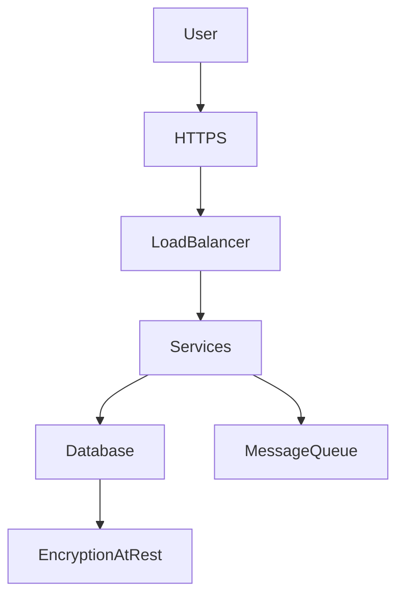
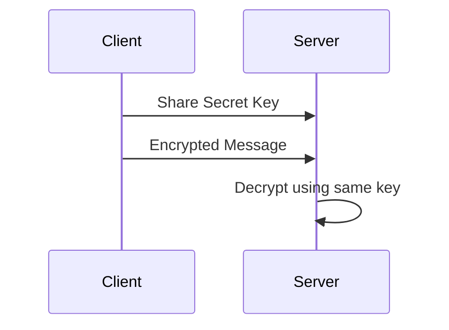
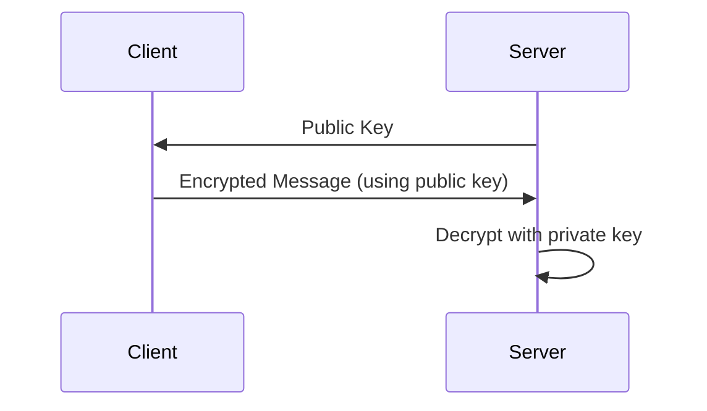
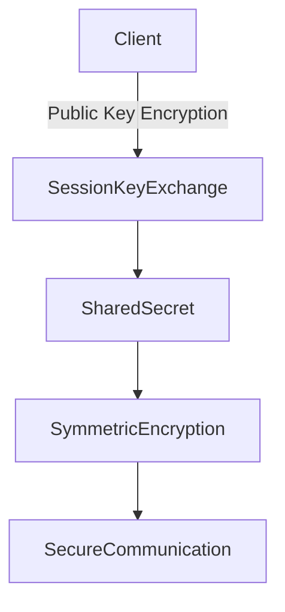
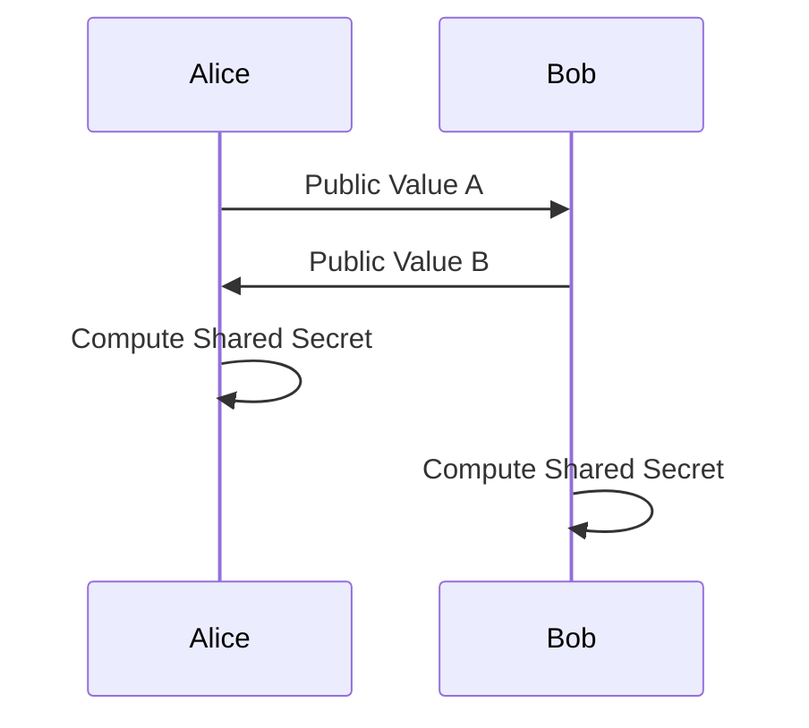
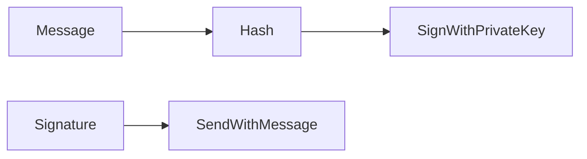
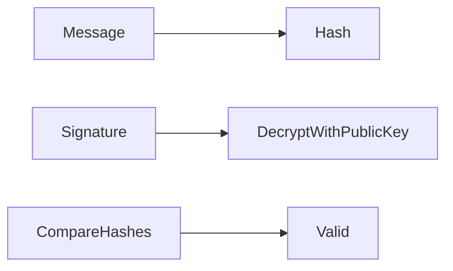
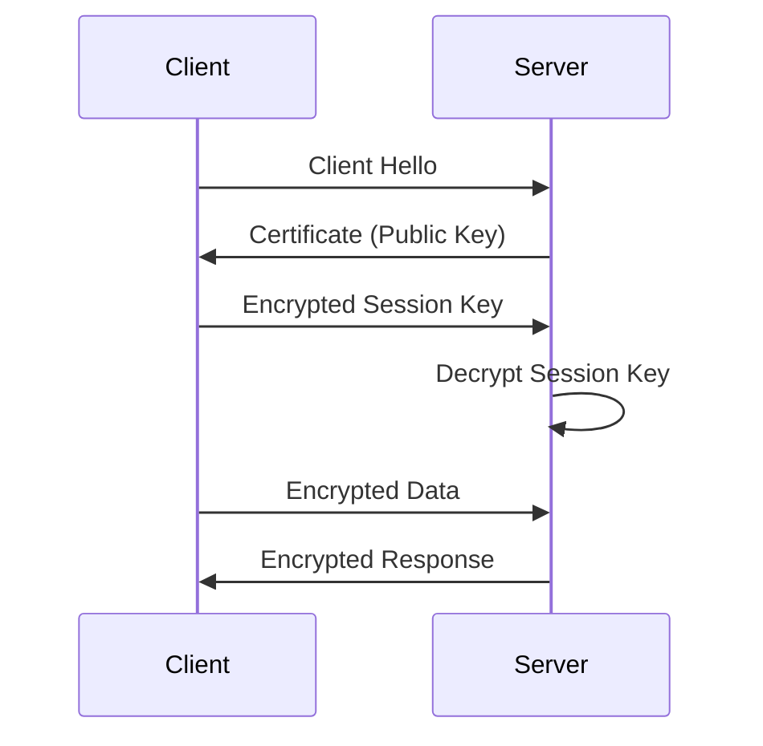
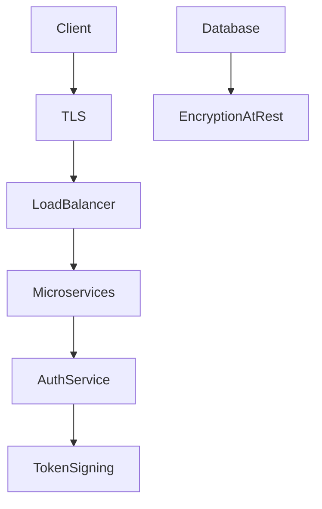

# Cryptography in High Level Design

Modern distributed systems constantly exchange sensitive data:

- User passwords
- Payment information
- API tokens
- Private messages
- Financial transactions

If this data travels across networks **without protection**, attackers could easily intercept or modify it.

This is where **cryptography** becomes essential.

Cryptography is the science of **protecting information using mathematical techniques** so that only authorized parties can read or verify it.

It ensures:

| Security Property | Meaning |
|------------------|--------|
| Confidentiality | Only intended recipients can read the data |
| Integrity | Data cannot be altered without detection |
| Authentication | Identity of sender can be verified |
| Non-repudiation | Sender cannot deny sending the message |

Large platforms like **:contentReference[oaicite:0]{index=0}**, **:contentReference[oaicite:1]{index=1}**, and **:contentReference[oaicite:2]{index=2} rely heavily on cryptography to secure billions of user interactions every day.

---

# Why Cryptography Matters in System Design

Consider a simple login request.

```text
User → Internet → Server
````

Without encryption:

* Password travels in plaintext
* Anyone intercepting traffic can steal it
* Attackers can impersonate users

With cryptography:

```text
User → Encrypted Request → Server
```

Now even if someone intercepts the data:

* They cannot read it
* They cannot modify it
* They cannot impersonate the sender

---

# Cryptography in Distributed Systems Architecture

Cryptography is used in multiple places inside large-scale systems.



Cryptography protects:

| Area                  | Protection            |
| --------------------- | --------------------- |
| Network traffic       | TLS encryption        |
| API authentication    | Tokens and signatures |
| Stored data           | Encryption at rest    |
| Service communication | Mutual TLS            |
| Software packages     | Digital signatures    |

---

# Two Main Types of Encryption

Encryption techniques are broadly divided into two categories.

| Type                  | Key Idea                               |
| --------------------- | -------------------------------------- |
| Symmetric Encryption  | Same key for encryption and decryption |
| Asymmetric Encryption | Public and private key pair            |

---

# Symmetric Encryption

Symmetric encryption uses **a single shared secret key**.

The same key is used to:

* Encrypt the data
* Decrypt the data


---

## Example Flow

1. Sender and receiver share secret key `K`
2. Sender encrypts message using `K`
3. Receiver decrypts using the same key

```text
Plaintext + Key → Encryption → Ciphertext
Ciphertext + Key → Decryption → Plaintext
```

---

## Example Algorithm

One of the most widely used symmetric algorithms is **AES (Advanced Encryption Standard)**.

AES is used by:

* Banking systems
* Cloud storage
* Secure messaging apps

---

## Symmetric Encryption Architecture



---

## Advantages

| Benefit       | Explanation                      |
| ------------- | -------------------------------- |
| Very fast     | Efficient for large data         |
| Low CPU usage | Good for high throughput systems |
| Simple design | Easy to implement                |

---

## Disadvantages

| Problem          | Explanation                     |
| ---------------- | ------------------------------- |
| Key distribution | How do we safely share the key? |
| Scalability      | Many users require many keys    |

This **key distribution problem** is why asymmetric cryptography exists.

---

# Asymmetric Encryption (Public Key Cryptography)

Asymmetric encryption uses **two different keys**.

| Key         | Purpose              |
| ----------- | -------------------- |
| Public Key  | Shared with everyone |
| Private Key | Kept secret          |

These keys are mathematically linked.

Data encrypted with one key can only be decrypted with the other.

---

## Basic Architecture


---

## Example Algorithm

One of the most famous asymmetric algorithms is **RSA**.

It is widely used in:

* TLS handshakes
* Secure emails
* Key exchange protocols

---

## Example Flow

1. Server generates public/private key pair.
2. Server shares **public key** with clients.
3. Client encrypts message using public key.
4. Server decrypts using private key.

---

## Diagram



---

## Advantages

| Advantage               | Explanation                               |
| ----------------------- | ----------------------------------------- |
| No key sharing required | Public key can be distributed freely      |
| Secure key exchange     | Solves symmetric key distribution problem |

---

## Disadvantages

| Disadvantage  | Explanation                           |
| ------------- | ------------------------------------- |
| Slow          | Much slower than symmetric encryption |
| High CPU cost | Not ideal for large data encryption   |

Because of this, most systems combine both encryption types.

---

# Hybrid Encryption (Real World Systems)

Modern protocols like **TLS use both encryption methods.

Process:

1. Asymmetric encryption exchanges a symmetric key.
2. Symmetric encryption encrypts actual data.



This provides:

* Secure key exchange
* Fast communication

---

# Diffie-Hellman Key Exchange

The **Diffie–Hellman Key Exchange** is a cryptographic method that allows two parties to create a **shared secret key over an insecure network**.

The key insight:

> Two parties can generate the same secret without ever sending the secret itself.

---

# The Core Idea

Imagine two people mixing colors.

```text
Public color → Yellow
```

Person A:

```text
Yellow + Secret Red = Orange
```

Person B:

```text
Yellow + Secret Blue = Green
```

They exchange results and mix again.

Both eventually arrive at **the same final color**.

An observer cannot determine the secret.

---

# Diffie-Hellman Architecture



Both sides independently generate the same key.

---

# Why Diffie-Hellman is Important

Diffie-Hellman enables:

* Secure session key creation
* No prior shared secret
* Protection against eavesdropping

It is used in modern protocols like **TLS and **SSH.

---

# Digital Signatures

Encryption ensures **confidentiality**.

But systems also need:

* Authentication
* Data integrity
* Non-repudiation

This is where **digital signatures** come in.

---

# What is a Digital Signature?

A digital signature proves:

* Who sent the message
* That the message was not modified

It works using asymmetric cryptography.

---

# Signing Process



Steps:

1. Message hashed.
2. Hash encrypted using private key.
3. Result becomes digital signature.

---

# Verification Process



If both hashes match:

```text
Message is authentic
```

---

# Example Algorithm

Common digital signature algorithms include:

* **RSA**
* **ECDSA**

---

# Real World Use Cases

Digital signatures are used everywhere.

| Application        | Example                 |
| ------------------ | ----------------------- |
| HTTPS certificates | Verify website identity |
| Software downloads | Verify packages         |
| Blockchain         | Sign transactions       |
| Emails             | Verify sender           |
| API authentication | Verify requests         |

---

# TLS Handshake Example

Modern HTTPS communication uses all these techniques together.



---

# Cryptography in Modern System Design

Distributed architectures integrate cryptography at multiple layers.



---

# Best Practices for Cryptography in HLD

| Best Practice                 | Reason                    |
| ----------------------------- | ------------------------- |
| Use TLS everywhere            | Protect data in transit   |
| Encrypt sensitive data        | Protect data at rest      |
| Rotate keys regularly         | Reduce compromise risk    |
| Use hardware security modules | Secure key storage        |
| Avoid custom crypto           | Use well-tested libraries |

---

# Common Cryptographic Mistakes

| Mistake                   | Risk                 |
| ------------------------- | -------------------- |
| Hardcoding keys           | Keys exposed in code |
| Weak algorithms           | Easy to break        |
| Improper key storage      | Attackers steal keys |
| No certificate validation | MITM attacks         |

---

# Summary

Cryptography is fundamental for securing modern distributed systems.

Key techniques include:

| Concept               | Purpose                      |
| --------------------- | ---------------------------- |
| Symmetric encryption  | Fast data encryption         |
| Asymmetric encryption | Secure key exchange          |
| Diffie-Hellman        | Shared secret generation     |
| Digital signatures    | Authentication and integrity |

Modern systems combine these techniques to ensure:

* secure communication
* trusted identities
* protected data

Without cryptography, the internet would not be secure enough to support banking, messaging, or large-scale platforms.

Understanding these concepts is essential for designing secure distributed systems in **High Level Design**.