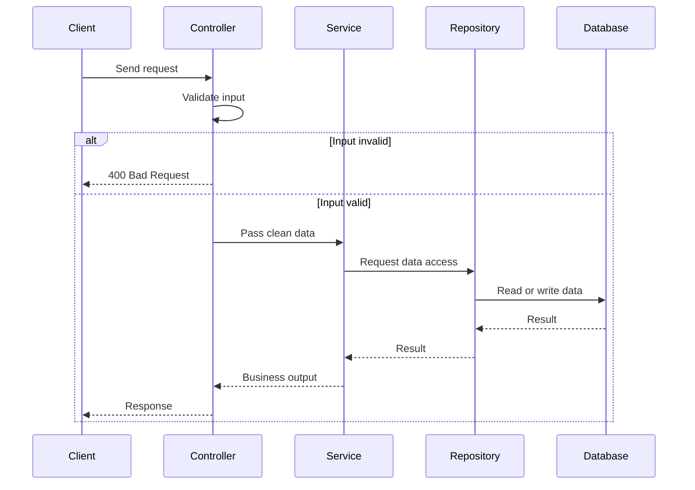
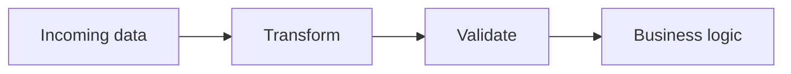

# Data Validation in Backend Systems

Every backend system has one very important job at the edge of the application:

**Do not trust incoming data until it has been checked.**

That job is called **data validation**.

Think of validation like a **bouncer at a club**:

- it checks IDs
- it checks the dress code
- it blocks anyone who does not meet the rules
- it allows only safe, expected guests inside

In backend engineering, validation plays the same role.

It stands at the entrance of your application and asks:

- Is this data the right type?
- Does it follow the correct format?
- Does it make sense in the real world?

If the answer is no, the request should stop immediately.

---

# 1. Why Data Validation Matters

Backend systems receive data from many places:

- frontend forms
- mobile apps
- other APIs
- third-party integrations
- testing tools like Postman
- malicious clients

None of these sources should be trusted blindly.

## What can go wrong without validation?

| Problem | Result |
|---|---|
| Wrong type of data | Database errors |
| Missing required fields | Broken business logic |
| Invalid formats | Failed processing |
| Impossible values | Wrong application state |
| Malicious payloads | Security issues |

### Example

Suppose your API expects a book name:

```json
{
  "name": "Clean Code"
}
````

But the client sends this instead:

```json
{
  "name": 0
}
```

Without validation, that bad value may travel through your system and fail later when the database or business logic tries to use it.

That creates:

* vague server errors
* hard-to-debug failures
* bad user experience
* possible security risks

Validation stops the problem early.

---

# 2. Where Validation Fits in a Backend Architecture

Validation should happen as early as possible, usually in the **controller layer**.

## Typical request flow



## Why the controller is the right place

The controller is the layer responsible for:

* receiving the HTTP request
* extracting input
* validating input
* sending a response

It is the natural **gatekeeper** of the application.

### Analogy

Think of a restaurant:

| Layer      | Role                             |
| ---------- | -------------------------------- |
| Controller | Host at the entrance             |
| Service    | Kitchen staff preparing the meal |
| Repository | Storage room and supply system   |
| Database   | Pantry / inventory               |

The host should check the reservation before the guest enters the kitchen.

That is exactly what the controller does with validation.

---

# 3. What Happens Without Validation?

Without validation, bad input reaches deeper layers.

## Example flow

1. Client sends invalid data
2. Controller accepts it blindly
3. Service tries to use it
4. Database rejects it or logic fails
5. Server returns a vague error

### Example

```javascript
const book = {
  name: 0
};
```

If your system expects `name` to be a string, this value should never reach the database.

### Bad outcome

| With no validation          | Result                    |
| --------------------------- | ------------------------- |
| Wrong type reaches DB       | Query fails               |
| Query fails in service flow | Application may crash     |
| Server returns 500          | User gets confusing error |
| Developer investigates late | Debugging becomes harder  |

### Better outcome

| With validation            | Result                       |
| -------------------------- | ---------------------------- |
| Wrong type stopped early   | Request rejected immediately |
| Server returns 400         | Clear client-side failure    |
| Error message is specific  | Easy to fix                  |
| Internal layers stay clean | More reliable system         |

---

# 4. The Three Main Types of Validation

Most backend validation falls into three major groups:

1. **Type validation**
2. **Syntactic validation**
3. **Semantic validation**

Each one checks a different kind of correctness.

---

## 4.1 Type Validation

Type validation checks whether the data is the **right kind of value**.

### Question it answers

**Is this data in the right container?**

### Examples

| Field    | Expected Type | Invalid Example |
| -------- | ------------- | --------------- |
| username | string        | `123`           |
| age      | number        | `"twenty"`      |
| tags     | array         | `"tech"`        |
| isActive | boolean       | `"yes"`         |

### Why it matters

If your system expects text, but gets a number, the logic may break.

### Example

```javascript
const user = {
  username: "alice",
  age: 25
};
```

This is valid.

But this is not:

```javascript
const user = {
  username: "alice",
  age: "twenty-five"
};
```

### Analogy

Type validation is like checking whether an item is in the right box.

* letters go in the letter tray
* coins go in the coin box
* files go in the file cabinet

If the wrong object is in the wrong place, the system gets confused.

---

## 4.2 Syntactic Validation

Syntactic validation checks whether data follows the **correct pattern or structure**.

### Question it answers

**Does this value look like what we expect?**

### Examples

| Field        | Valid Example         | Invalid Example |
| ------------ | --------------------- | --------------- |
| email        | `test@example.com`    | `test@com`      |
| phone number | `+91XXXXXXXXXX`       | `abc123`        |
| date         | `2025-01-11`          | `11/01/25`      |
| URL          | `https://example.com` | `hello world`   |

### Why it matters

Even if a value is a string, it may still be badly formed.

### Example

```json
{
  "email": "test@example.com"
}
```

Valid syntax.

But:

```json
{
  "email": "testexample.com"
}
```

This is syntactically wrong because it does not follow the email pattern.

### Analogy

Syntactic validation is like checking whether a letter has the correct envelope format:

* proper recipient
* proper postcode
* proper stamp
* proper address structure

A piece of paper may be a letter, but it is still useless if the address is malformed.

---

## 4.3 Semantic Validation

Semantic validation checks whether the data **makes sense in the real world**.

### Question it answers

**Is this value logically valid for the business rules of the application?**

### Examples

| Field         | Technically Valid | Semantically Wrong |
| ------------- | ----------------- | ------------------ |
| date of birth | `2026-06-12`      | Future date        |
| age           | `430`             | Impossible age     |
| quantity      | `-5`              | Negative quantity  |
| discount      | `150`             | More than 100%     |

### Why it matters

Something can be correct in type and format, but still impossible.

### Example

A date string can be valid:

```json
{
  "dob": "2026-06-12"
}
```

But if today is before that date, it makes no sense as a date of birth.

### Analogy

Semantic validation is like checking whether a train ticket is not only printed correctly, but also valid for the correct date, route, and passenger.

The ticket may look real, but it still might be useless.

---

# 5. Validation vs Transformation

Validation often works together with **transformation**.

Transformation means:

* converting data into the right shape
* normalizing values
* casting strings into numbers
* cleaning user input before checking rules

## Why transformation is needed

Some values arrive in a format that is technically correct but not ready for use.

### Example: query parameters

Request:

```text
/bookmarks?page=2
```

The value of `page` arrives as a **string**:

```javascript
"2"
```

But your application may need it as a number:

```javascript
2
```

So the server should:

1. transform `"2"` into `2`
2. validate that `2` is a valid positive integer

---

## Transformation pipeline



### Another example: email normalization

If a user submits:

```text
Test@Example.COM
```

you may convert it to lowercase:

```text
test@example.com
```

This makes storage and comparisons more consistent.

### Why this helps

| Benefit            | Description                                               |
| ------------------ | --------------------------------------------------------- |
| Consistency        | Data is stored in a standard form                         |
| Easier comparisons | `Test@Example.COM` and `test@example.com` become the same |
| Cleaner logic      | Business code becomes simpler                             |

---

# 6. Backend Validation vs Frontend Validation

Many beginners think frontend validation is enough.

It is not.

Frontend validation helps users fill forms correctly, but it is not a security boundary.

## Comparison

| Aspect              | Frontend Validation    | Backend Validation                |
| ------------------- | ---------------------- | --------------------------------- |
| Main purpose        | Better user experience | Security and data integrity       |
| Can be bypassed?    | Yes                    | No, it must not be skipped        |
| Trust level         | Untrusted              | Final authority                   |
| Runs before submit? | Yes                    | Yes, after request reaches server |

### Why frontend validation is not enough

A user can bypass the frontend by using:

* Postman
* Insomnia
* curl
* custom scripts
* malicious clients

So the backend must validate everything again.

### Analogy

Frontend validation is like the spelling checker in a text editor.

Backend validation is like the actual exam proctor checking the submitted paper.

The spelling checker is helpful, but it does not decide whether the answer is accepted.

---

# 7. What Good Validation Returns

Good validation does not just reject bad data.
It rejects it clearly.

## Standard error response

```json
{
  "message": "Validation failed",
  "errors": [
    {
      "field": "name",
      "message": "name must be a string"
    },
    {
      "field": "age",
      "message": "age must be a number"
    }
  ]
}
```

## Why this matters

| Benefit              | Explanation                        |
| -------------------- | ---------------------------------- |
| Clear feedback       | Client knows exactly what is wrong |
| Faster debugging     | Developer fixes issues quickly     |
| Better API usability | Consumers understand expectations  |
| Less confusion       | Avoids vague 500 errors            |

### Status code

Validation failures should usually return:

```text
400 Bad Request
```

not:

```text
500 Internal Server Error
```

A 500 means the server broke.
A 400 means the client sent invalid input.

---

# 8. Example Validation Rules

Here are common validation rules you will use in backend systems.

| Field    | Rule                           |
| -------- | ------------------------------ |
| name     | Required, string, min length   |
| email    | Required, valid email format   |
| age      | Number, positive, within range |
| tags     | Array of strings               |
| password | Minimum strength rules         |
| page     | Integer greater than zero      |
| status   | Must be one of allowed values  |

---

# 9. Example in JavaScript

Below is a simple manual validation example.

```javascript
function validateBookInput(body) {
  const errors = [];

  if (typeof body.name !== "string") {
    errors.push({ field: "name", message: "name must be a string" });
  }

  if (typeof body.price !== "number") {
    errors.push({ field: "price", message: "price must be a number" });
  }

  if (body.price <= 0) {
    errors.push({ field: "price", message: "price must be greater than 0" });
  }

  if (errors.length > 0) {
    return {
      valid: false,
      errors
    };
  }

  return {
    valid: true
  };
}
```

### Usage

```javascript
const result = validateBookInput({
  name: 0,
  price: -10
});

console.log(result);
```

### Output

```json
{
  "valid": false,
  "errors": [
    {
      "field": "name",
      "message": "name must be a string"
    },
    {
      "field": "price",
      "message": "price must be greater than 0"
    }
  ]
}
```

---

# 10. Validation Flow in a Controller

```javascript
app.post("/books", (req, res) => {
  const validation = validateBookInput(req.body);

  if (!validation.valid) {
    return res.status(400).json({
      message: "Validation failed",
      errors: validation.errors
    });
  }

  // safe to continue
  res.json({ message: "Book accepted" });
});
```

This is the basic pattern:

1. receive request
2. validate input
3. reject early if invalid
4. continue only if valid

---

# 11. Real-World Analogy: Airport Security

Validation is like airport security.

| Step                     | Backend Equivalent   |
| ------------------------ | -------------------- |
| Passport check           | Type validation      |
| Visa format check        | Syntactic validation |
| Travel eligibility check | Semantic validation  |

A passport may be real, but:

* it may be expired
* it may not match the flight route
* it may not be valid for the current trip

That is exactly how validation works in backend systems.

---

# 12. Why Validation Is a Security Boundary

Validation is not just about preventing bugs.

It also protects against:

* malformed requests
* unexpected payloads
* abusive clients
* injection-style mistakes
* bad state entering the system

### Core principle

**Never trust client input.**

Client data must be treated as hostile until proven safe.

---

# 13. Common Beginner Mistakes

| Mistake                               | Why it is dangerous                 |
| ------------------------------------- | ----------------------------------- |
| Skipping backend validation           | Untrusted data reaches core logic   |
| Depending only on frontend validation | Easy to bypass                      |
| Returning 500 for validation errors   | Confuses users and developers       |
| Validating too late                   | Bad data spreads deeper into system |
| Mixing validation with business logic | Makes code harder to maintain       |

---

# 14. Recommended Mental Model

Use this simple rule:

**Validate at the boundary, process in the core.**

| Layer      | Job                           |
| ---------- | ----------------------------- |
| Controller | Validate and reject bad input |
| Service    | Perform business rules        |
| Repository | Read and write data           |
| Database   | Store final trusted state     |

This keeps your system clean, predictable, and easier to debug.

---

# 15. Final Takeaways

| Concept              | Meaning                                 |
| -------------------- | --------------------------------------- |
| Validation           | Checking whether data is acceptable     |
| Type validation      | Right data type                         |
| Syntactic validation | Right pattern or format                 |
| Semantic validation  | Makes logical sense                     |
| Transformation       | Clean or convert data before validation |
| Frontend validation  | User experience helper                  |
| Backend validation   | Mandatory security gate                 |

---

# 16. Conclusion

Data validation is one of the most important skills in backend engineering.

It protects your application from:

* bad input
* broken logic
* confusing errors
* insecure behavior

A strong backend does not just accept requests.
It carefully checks them, rejects the bad ones, and only allows clean, meaningful data to reach the business logic.

That is how reliable backend systems are built.