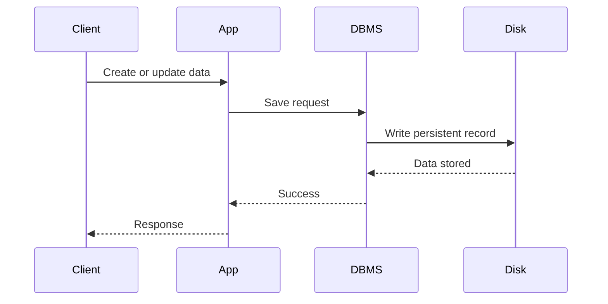
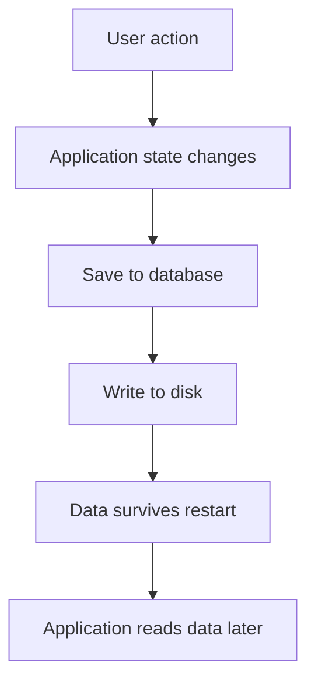

# Persistence, Databases, and Postgres Data Types

Imagine building a simple to-do list app.

You add tasks like:

- Finish homework
- Call a friend
- Go for a run

You check off one of them.

Everything works perfectly.

But then you close the app and reopen it later.

The real question is:

**Should the app remember what happened before?**

If the answer is yes, then your application needs **persistence**.

Persistence is one of the most important ideas in backend engineering because it is what turns a temporary program into a useful real-world system.

---

# 1. What is Persistence?

Persistence means storing data in a way that survives after the program stops running.

If data is persistent, it does not disappear when:

- the app closes
- the server restarts
- the computer shuts down
- the process crashes

This is what makes applications feel reliable.

## Example

A to-do app without persistence:

- user adds tasks
- user closes app
- app restarts
- tasks are gone

That app is basically unusable.

A to-do app with persistence:

- user adds tasks
- data is saved permanently
- app restarts
- tasks are still there

That is a real application.

---

## Analogy

Persistence is like writing notes in a notebook instead of memorizing them.

| Memory Type | Behavior |
|---|---|
| Temporary memory | Forgot after shutdown |
| Persistent storage | Remembered after shutdown |

The notebook keeps the information even if you walk away.  
That is exactly what a database does.

---

# 2. The Database: A System for Remembering

A database is structured storage for data that needs to be saved and retrieved later.

At a basic level, a database helps applications answer questions like:

- What users exist?
- What orders were placed?
- What notes belong to this account?
- What products are in inventory?

A database is not just for large companies.  
You already use database-like systems in everyday life.

---

## Everyday examples of databases

| Example | What it stores |
|---|---|
| Phone contacts | Names, numbers, emails |
| Browser local storage | Session-like values, cart data, preferences |
| Notes app | Titles, bodies, timestamps |
| Social media profile | Bio, followers, posts |

These are all forms of structured storage.

---

## The four basic operations: CRUD

Most data systems revolve around four actions:

| Operation | Meaning |
|---|---|
| Create | Add new data |
| Read | Retrieve existing data |
| Update | Modify existing data |
| Delete | Remove data |

This is called **CRUD**.

CRUD is the foundation of nearly every backend application.

---

## CRUD in real life

Think of a library card catalog.

| CRUD Action | Library Example |
|---|---|
| Create | Add a new book record |
| Read | Look up a book |
| Update | Change the location or status |
| Delete | Remove a record for a discarded item |

A database is a powerful version of that catalog.

---

# 3. Why Backend Engineers Use Disk, Not RAM

When people say “database” in backend engineering, they usually mean **disk-based storage**.

That is because a backend system needs data to last.

To understand why disk is used, compare it with RAM.

---

## RAM vs Disk

| Feature | RAM (Primary Memory) | Disk (Secondary Memory) |
|---|---|---|
| Speed | Very fast | Slower |
| Capacity | Smaller | Larger |
| Cost | More expensive | Cheaper |
| Persistence | Lost when power is off | Survives shutdown |

---

## Why RAM alone is not enough

RAM is great for speed, but it is temporary.

If your app stored everything in RAM:

- restart the server
- everything is gone
- crash the server
- everything is gone
- run out of memory
- data disappears

That is not persistence.

---

## Why disk is the right foundation

Disk storage is slower than RAM, but it gives you:

- large capacity
- low cost
- data durability
- long-term storage

That makes it the logical choice for persistent application data.

### Analogy

RAM is like your desk.

- fast to use
- limited space
- temporary

Disk is like your filing cabinet.

- slower to access
- much larger
- designed for keeping things

A good backend uses both:

- **disk** for long-term memory
- **RAM** for performance and caching

---

# 4. Why Not Just Use a Text File?

A text file can store data, so why not just use one?

Because a simple text file is not enough for a serious backend system.

It may work for tiny toy projects, but it breaks down quickly in real applications.

---

## 4.1 Slow and error-prone parsing

If your data lives in a text file, your code has to:

- open the file
- read everything
- search line by line
- parse the format manually

That becomes slow as the file grows.

### Problem

Suppose you want one order from a file of one million orders.

The app may need to scan through huge amounts of text just to find one record.

That is inefficient.

### Risk

If your parsing code has a bug:

- data may be read incorrectly
- fields may be misinterpreted
- records may break
- corrupted output may be produced

---

## 4.2 Lack of structure and consistency

Text files do not enforce rules.

You can accidentally store data in the wrong shape.

### Example

An order amount should be a number:

```text
amount: 120
````

But a text file might also allow:

```text
amount: something
```

Nothing stops it.

That is dangerous.

### Why this matters

Inconsistent data causes:

* broken logic
* strange application behavior
* hard-to-debug failures
* unreliable reporting

---

## 4.3 Concurrency chaos

Concurrency means multiple users or processes are changing data at the same time.

A text file is especially bad at this.

### Example

Current value:

```text
amount: 40
```

Now imagine:

* User A reads 40 and adds 20
* User B reads 40 and subtracts 20

User A saves 60.

User B saves 20.

Who wins?

It depends on timing.

That is a **race condition**.

### Race condition analogy

It is like two people trying to rewrite the same line on a whiteboard at the same time.

The final answer depends on who writes last, not on the correct business logic.

### Why this is bad

Race conditions can cause:

* lost updates
* corrupted values
* inconsistent state
* bugs that are hard to reproduce

---

# 5. The Professional Solution: DBMS

To solve the problems of text files, engineers use a **Database Management System**, or **DBMS**.

A DBMS is software designed to store, organize, query, protect, and manage data properly.

Examples include:

* Postgres
* MySQL
* SQLite
* MongoDB
* Redis

When backend engineers talk about “the database,” they usually mean a DBMS.

---

## What a DBMS provides

| Capability          | What it solves                 |
| ------------------- | ------------------------------ |
| Data organization   | Fast retrieval                 |
| Data integrity      | Correct and valid data         |
| Concurrency control | Safe simultaneous updates      |
| Security            | Controlled access              |
| Query support       | Efficient lookup and filtering |
| Transactions        | Reliable multi-step operations |

---

## 5.1 Data organization

A DBMS stores data in optimized structures so it can find rows quickly.

That means the system does not need to scan everything manually.

### Analogy

Instead of searching every page in a notebook, the DBMS behaves like a library index.

It knows how to find the right record quickly.

---

## 5.2 Data integrity

A DBMS can enforce rules such as:

* this column must be a number
* this field cannot be null
* this value must be unique
* this foreign key must point to a real record

This prevents bad data from entering the system.

### Example

A user email should not appear twice if the system requires unique emails.

The DBMS can enforce that directly.

---

## 5.3 Concurrency control

A DBMS can safely handle multiple users reading and writing at once.

It uses mechanisms like:

* locking
* isolation levels
* transactions
* conflict handling

These tools prevent race conditions and keep data consistent.

---

## 5.4 Security

A DBMS can manage:

* users
* roles
* permissions
* access control

A plain text file cannot do that.

---

# 6. Persistence Flow in a Real Backend



This is the basic life of persistent application data.

---

# 7. Postgres String Types: char, varchar, and text

Many developers default to `varchar(255)` automatically.

That habit is often inherited from older systems and repeated without understanding.

In Postgres, this is usually unnecessary.

Let us compare the main string types.

---

## 7.1 `char(n)`

`char(n)` stores a **fixed-length** string.

If the input is shorter than `n`, it is padded with spaces.

### Example

If `char(10)` stores `"cat"`, the database may treat it like:

```text
cat       "
```

### When it is useful

Very specific fixed-size cases.

Usually not the best default for application data.

---

## 7.2 `varchar(n)`

`varchar(n)` stores a **variable-length** string with a maximum length.

If a value exceeds the limit, the database rejects it.

### Example

If the limit is 10 characters, then `"hello"` is valid, but a longer string is not.

### When it is useful

When you truly want the database itself to enforce a hard maximum.

---

## 7.3 `text`

`text` stores variable-length strings without a practical built-in length limit.

For most application use cases in Postgres, it is the simplest and safest default.

### Why it is often preferred

* no arbitrary length limit
* simpler schema
* fewer future migrations
* clean application-level validation instead

---

## Comparison table

| Type         | Behavior                          | Best use                 |
| ------------ | --------------------------------- | ------------------------ |
| `char(n)`    | Fixed length, padded              | Rare cases               |
| `varchar(n)` | Variable length with max limit    | Specific enforced limits |
| `text`       | Variable length, no arbitrary cap | Most application strings |

---

## Why `varchar(255)` is often a myth

The number 255 is frequently used out of habit.

But in Postgres:

* it is not magical
* it is not automatically better
* it does not create a special performance advantage
* it may create unnecessary schema limits

### Better mindset

Use `text` unless you have a real reason to enforce a database-level length limit.

If you need business rules like “name must be under 50 characters,” enforce that in application validation too.

### Analogy

Using `varchar(255)` everywhere is like installing a tiny door on every room just because someone once said doors should be “standard size.”

It may work sometimes, but it does not fit every room.

---

# 8. Postgres and JSON: You Might Not Need NoSQL

A common argument for NoSQL databases is:

* flexible schema
* dynamic data
* variable structure

That sounds useful, especially for content-heavy systems.

But Postgres already handles flexible data very well through JSON support.

---

## Postgres JSON types

Postgres provides two main JSON types:

| Type    | Meaning                    | Notes                            |
| ------- | -------------------------- | -------------------------------- |
| `json`  | Stores JSON as text        | Preserves formatting             |
| `jsonb` | Stores JSON in binary form | Better for querying and indexing |

---

## 8.1 `json`

The `json` type stores raw JSON text.

That means it preserves formatting like whitespace and ordering more closely.

Useful when you want the original textual form preserved.

---

## 8.2 `jsonb`

The `jsonb` type stores JSON in a more optimized binary form.

This makes it better for:

* querying
* indexing
* filtering
* searching nested structures

For most backend use cases, `jsonb` is the better choice.

---

## Why `jsonb` is powerful

With `jsonb`, you can:

* store flexible content
* query it efficiently
* index it
* keep structured relational data in the same database

That means you do not always need a separate NoSQL database just for dynamic fields.

---

## Example use cases for JSON in Postgres

| Use case         | Why JSON helps                             |
| ---------------- | ------------------------------------------ |
| Product metadata | Each product may have different attributes |
| CMS content      | Article structure may vary                 |
| User preferences | Preferences can be flexible                |
| Feature flags    | Dynamic config data                        |
| Event payloads   | Shape may vary by event type               |

---

## Analogy

Think of Postgres like a house with both:

* standard rooms for stable structure
* flexible storage room for unusual items

You do not need a second house just to store some boxes.

---

# 9. Relational + JSON Together

One of Postgres’s biggest strengths is that it lets you combine:

* normalized relational data
* flexible JSON data

in the same system.

### Example

| Data Type  | Example                            |
| ---------- | ---------------------------------- |
| Structured | users, orders, payments            |
| Flexible   | metadata, CMS content, preferences |

This gives you the best of both worlds.

You keep relational integrity where you need it and flexibility where you want it.

---

# 10. Numbers in Postgres: Accuracy vs Speed

Choosing numeric types is another important design decision.

The common choice is between:

* `decimal` / `numeric`
* floating-point types like `real` and `double precision`

---

## The simple rule

Ask one question:

**Do I need exact accuracy?**

If yes, use `decimal` / `numeric`.

If no and speed matters more, use float.

---

## 10.1 Decimal / Numeric

Use this when exact values matter.

### Best for

* money
* payments
* invoices
* balances
* accounting

### Why

Decimal stores values exactly, which is critical for financial correctness.

### Example

If you store prices, you do not want tiny rounding errors to accumulate.

Even a very small mistake can become a serious issue in financial systems.

---

## 10.2 Float / Real / Double Precision

Use these when small approximation differences are acceptable.

### Best for

* scientific calculations
* measurements
* engineering simulations
* graphics
* performance-sensitive numeric work

### Why

Floating-point numbers are fast and efficient, but they are approximate.

That makes them unsuitable for money but fine for many technical calculations.

---

## Numeric comparison

| Type              | Accuracy    | Speed  | Best for              |
| ----------------- | ----------- | ------ | --------------------- |
| Decimal / Numeric | Exact       | Slower | Money, accounting     |
| Float             | Approximate | Faster | Science, measurements |

---

## Analogy

Decimal is like counting cash bill by bill.

Float is like estimating distance with a quick measurement tool.

For money, estimation is unacceptable.
For physics, performance and approximation are often okay.

---

# 11. PostgreSQL as a Unified Platform

A common mistake is to think:

* relational databases are rigid
* NoSQL is needed for flexibility
* different systems must be used for different data shapes

Modern Postgres challenges that idea.

It can handle:

* structured rows
* flexible JSON
* string data
* numeric precision
* indexing
* queries
* relationships
* constraints

all in one system.

---

## Why this matters

Using one strong database can reduce:

* operational complexity
* extra tooling
* synchronization problems
* duplicated data logic
* maintenance overhead

### Analogy

Instead of carrying five different toolboxes for one job, Postgres gives you one very capable toolbox.

---

# 12. Choosing the Right Type: A Practical Mental Model

When designing a schema, ask these questions:

## For strings

| Question                                   | Best choice  |
| ------------------------------------------ | ------------ |
| Do I need a true fixed size?               | `char(n)`    |
| Do I need a maximum length enforced by DB? | `varchar(n)` |
| Do I just need flexible text?              | `text`       |

## For flexible data

| Question                                           | Best choice |
| -------------------------------------------------- | ----------- |
| Do I need schema flexibility with query support?   | `jsonb`     |
| Do I need to preserve raw JSON formatting exactly? | `json`      |

## For numbers

| Question                                | Best choice           |
| --------------------------------------- | --------------------- |
| Is exact accuracy required?             | `decimal` / `numeric` |
| Is speed more important than exactness? | `float`               |

---

# 13. Common Beginner Mistakes

| Mistake                                      | Why it is bad                                       |
| -------------------------------------------- | --------------------------------------------------- |
| Using RAM as the only storage                | Data disappears on restart                          |
| Using text files for serious backend storage | Poor structure and concurrency handling             |
| Defaulting to `varchar(255)` everywhere      | Arbitrary limits and unnecessary schema constraints |
| Using float for money                        | Can cause rounding errors                           |
| Choosing NoSQL just for flexibility          | Postgres may already solve the problem              |
| Ignoring DB-level integrity                  | Makes data unreliable                               |
| Overcomplicating schema too early            | Creates maintenance pain                            |

---

# 14. Persistence Flow with a Database



Persistence is what allows an application to feel continuous across sessions.

---

# 15. Key Takeaways

| Concept     | Meaning                                           |
| ----------- | ------------------------------------------------- |
| Persistence | Data survives after the program stops             |
| Database    | Structured system for storing and retrieving data |
| CRUD        | Create, Read, Update, Delete                      |
| RAM         | Fast but temporary                                |
| Disk        | Slower but permanent                              |
| DBMS        | Software that manages data safely                 |
| `text`      | Best default string type in many Postgres cases   |
| `jsonb`     | Powerful flexible storage for dynamic data        |
| `decimal`   | Exact numeric type for money                      |
| `float`     | Approximate numeric type for speed                |

---

# 16. Conclusion

Persistence is the reason your applications can remember anything at all.

Without it, every restart would erase the user’s work.

Databases solve that problem by providing permanent, structured, reliable storage.

A proper DBMS gives you:

* fast access
* data integrity
* concurrency control
* security
* query power

And modern Postgres gives you even more flexibility than many developers realize:

* `text` is often the best string type
* `jsonb` can replace many NoSQL use cases
* `decimal` protects financial accuracy
* `float` is available when speed matters

The deeper lesson is simple:

**Do not rely on old habits blindly. Understand the tools, then choose the right one for the job.**

That mindset leads to cleaner schemas, better systems, and stronger backend design.