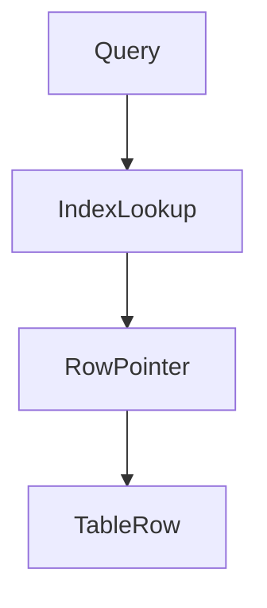
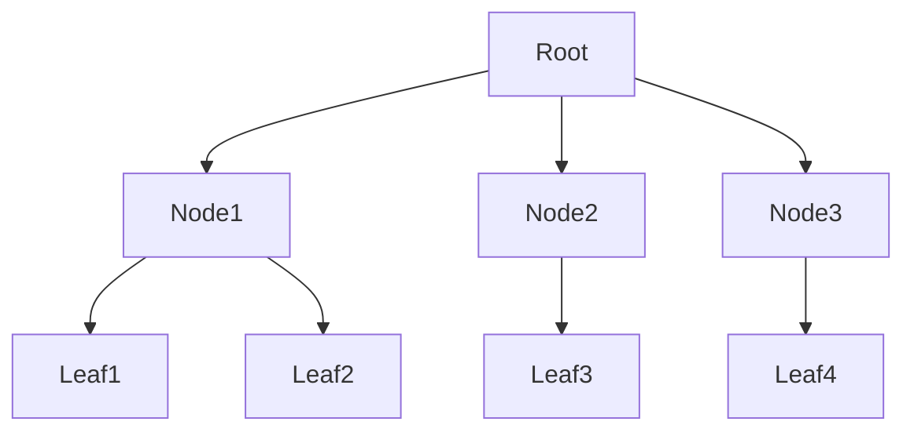
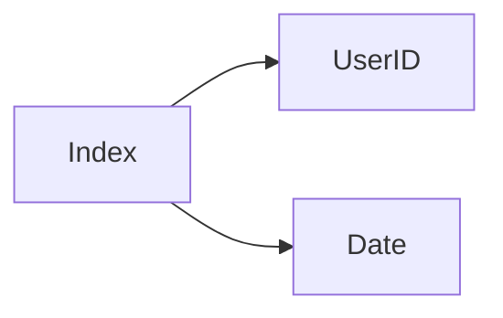
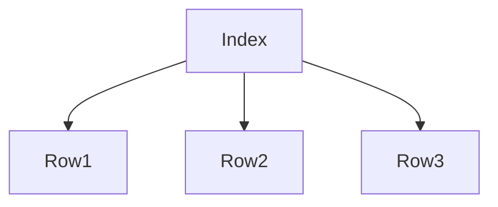
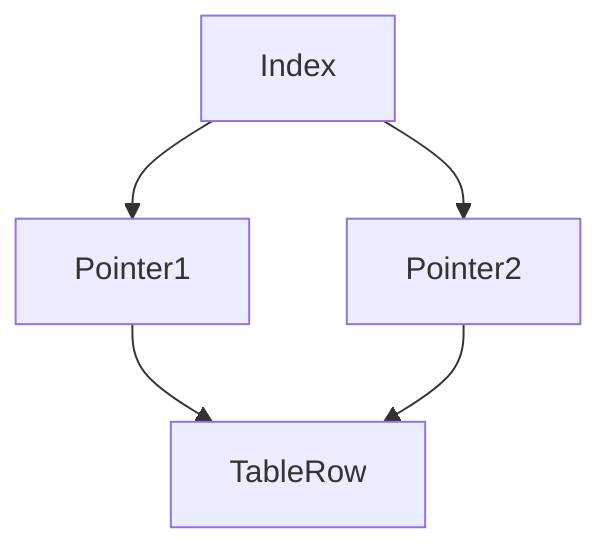

# Database Indexing

As applications scale, databases often store **millions or billions of records**. Searching through such massive datasets without optimization would be extremely slow.

**Database Indexing** is a technique that allows databases to **locate data quickly without scanning every row in a table**.

> A database index is a data structure that improves the speed of data retrieval operations by maintaining a searchable structure for specific columns.

Indexes are conceptually similar to the **index of a book**.

Instead of reading every page to find a topic, you check the index to quickly locate the correct page.

---

# The Problem Without Indexes

Consider a database table containing **100 million users**.

If we execute the following query:

```sql
SELECT * FROM users WHERE email = 'user@example.com';
```

Without an index, the database must perform a **Full Table Scan**.


The database checks **every row** until it finds the match.

This is extremely slow for large tables.

---

# How Indexes Improve Performance

With an index on the `email` column, the database can quickly find the required row.



Instead of scanning all rows, the database:

1. searches the index
2. finds the pointer to the row
3. fetches the row immediately

This reduces query complexity dramatically.

---

# Real-World Analogy

Imagine a large library.

Without a catalog:

* you would walk through every shelf
* search every book

With a catalog:

* you look up the book title
* find the shelf number instantly

The catalog acts exactly like a **database index**.

---

# Index Data Structures

Indexes rely on specialized data structures optimized for searching.

The most common structure used by databases is the **B-Tree**.

---

## B-Tree Structure



B-Trees are optimized for:

* fast searches
* efficient inserts
* balanced structure

Operations typically run in **O(log n)** time.

Most relational databases like MySQL and PostgreSQL use B-tree indexes.

---

# Index Structure Internally

An index typically stores:

| Component            | Description            |
| -------------------- | ---------------------- |
| Indexed column value | Value being indexed    |
| Pointer              | Reference to table row |
| Tree structure       | Used for fast search   |

Example index:

| Email                                       | Row Pointer |
| ------------------------------------------- | ----------- |
| [alice@mail.com](mailto:alice@mail.com)     | Row 102     |
| [bob@mail.com](mailto:bob@mail.com)         | Row 452     |
| [charlie@mail.com](mailto:charlie@mail.com) | Row 889     |

---

# Types of Database Indexes

Different types of indexes are used depending on the query pattern.

---

# Primary Index

A **primary index** is automatically created for the **primary key**.

Example:

```sql
CREATE TABLE users (
  id INT PRIMARY KEY,
  name VARCHAR(100)
);
```

The `id` column automatically gets an index.

Characteristics:

| Property              | Description |
| --------------------- | ----------- |
| Unique                | Yes         |
| One per table         | Yes         |
| Automatically created | Yes         |

---

# Secondary Index

A **secondary index** is created on non-primary columns.

Example:

```sql
CREATE INDEX idx_users_email
ON users(email);
```

This speeds up queries filtering by email.

---

# Composite Index

A **composite index** includes multiple columns.

Example:

```sql
CREATE INDEX idx_orders_user_date
ON orders(user_id, created_at);
```

Useful when queries filter using **multiple columns**.

---

## Composite Index Example



This index accelerates queries like:

```sql
SELECT * FROM orders
WHERE user_id = 101
AND created_at > '2025-01-01';
```

---

# Unique Index

A **unique index** ensures all indexed values are unique.

Example:

```sql
CREATE UNIQUE INDEX idx_email
ON users(email);
```

This prevents duplicate email entries.

---

# Full-Text Index

Full-text indexes are used for **searching text data**.

Example use cases:

* search engines
* product search
* article search

Databases like Elasticsearch specialize in full-text indexing.

---

# Hash Index

Hash indexes store values using **hash functions**.


Advantages:

* extremely fast equality lookups

Limitations:

* poor range query performance

Some engines in MySQL support hash indexes.

---

# Clustered vs Non-Clustered Index

Indexes can be categorized based on how they store data.

---

## Clustered Index

A **clustered index determines the physical order of rows**.



Characteristics:

* table rows stored in index order
* only one clustered index per table

---

## Non-Clustered Index

A **non-clustered index stores pointers to rows**.



Multiple non-clustered indexes can exist.

---

# Read vs Write Trade-off

Indexes improve read performance but affect writes.

| Operation | Impact |
| --------- | ------ |
| SELECT    | Faster |
| INSERT    | Slower |
| UPDATE    | Slower |
| DELETE    | Slower |

Why?

Whenever data changes, the index must also be updated.

---

# Query Performance Example

Without index:

```id="m1cbv9"
Time Complexity: O(n)
Rows scanned: 100M
Latency: seconds
```

With index:

```id="8uowzy"
Time Complexity: O(log n)
Rows scanned: ~20
Latency: milliseconds
```

This improvement is dramatic in large-scale systems.

---

# Index Selectivity

Index effectiveness depends on **selectivity**.

Selectivity measures how unique a column is.

| Column  | Selectivity |
| ------- | ----------- |
| user_id | High        |
| email   | High        |
| gender  | Low         |
| country | Medium      |

Indexes work best on **high-selectivity columns**.

---

# Indexing in Large-Scale Systems

In high-scale systems, indexing becomes critical for performance.

Examples:

| Platform | Indexed Data |
| -------- | ------------ |
| Google   | Web pages    |
| Amazon   | Products     |
| Facebook | User data    |

Search engines rely heavily on indexing to retrieve results instantly.

---

# Index Maintenance

Indexes require ongoing maintenance.

Common tasks include:

| Task                   | Purpose                |
| ---------------------- | ---------------------- |
| Rebuilding indexes     | Fix fragmentation      |
| Monitoring index usage | Remove unused indexes  |
| Updating statistics    | Improve query planning |

---

# Index Fragmentation

Frequent inserts and updates can cause index fragmentation.


Fragmentation reduces performance.

Databases periodically **rebuild indexes** to fix this.

---

# Best Practices for Indexing

### Index Frequently Queried Columns

Columns used in:

* WHERE clauses
* JOIN conditions
* ORDER BY clauses

should usually be indexed.

---

### Avoid Over-Indexing

Too many indexes can slow down writes.

Balance **read speed vs write performance**.

---

### Use Composite Indexes Carefully

Column order matters.

Example:

```sql
(user_id, created_at)
```

Works for queries filtering by:

* user_id
* user_id + created_at

But **not** only `created_at`.

---

# Monitoring Index Performance

Important metrics include:

| Metric         | Meaning                           |
| -------------- | --------------------------------- |
| Index hit rate | Percentage of queries using index |
| Query latency  | Time to execute query             |
| Index size     | Memory/storage consumed           |

Monitoring tools include:

* Prometheus
* Grafana

---

# Summary

Database indexing is one of the **most powerful techniques for improving database performance**.

Instead of scanning entire tables, indexes provide a **fast lookup structure** that enables databases to retrieve data quickly.

Key concepts include:

* B-tree index structures
* primary and secondary indexes
* clustered vs non-clustered indexes
* read-write trade-offs
* index selectivity and optimization

When designed correctly, indexes enable large-scale systems to process **millions of queries efficiently** while maintaining low latency.