Designing a chat system looks simple at first.

A user sends a message.  
The receiver gets it instantly.

That sounds straightforward until the system grows.

Now the product must support:

- millions of users
- real-time delivery
- one-to-one chat
- group chat
- offline delivery
- message history
- typing indicators
- read receipts
- push notifications
- media sharing
- search
- presence status
- multi-device sync
- multi-region resilience
- low latency
- high availability
- reliable delivery
- duplicate prevention
- security and privacy

This is no longer a simple app.

It becomes a large-scale distributed system.

The goal of a production chat system is not just to send messages.

The goal is to:

- deliver messages quickly
- keep state consistent
- survive failures
- scale horizontally
- preserve user experience
- handle billions of events reliably

---

# 1. Problem Statement

Build a chat system that supports:

- one-to-one messaging
- group messaging
- real-time delivery
- offline message storage
- media attachments
- read and delivery receipts
- typing indicators
- online/offline presence
- message search
- multi-device synchronization
- notifications when users are offline

---

# 2. Functional Requirements

The system should support:

| Requirement | Description |
|---|---|
| User Authentication | Users log in securely |
| Real-Time Messaging | Messages arrive instantly when online |
| Offline Messaging | Messages are stored and delivered later |
| One-to-One Chat | Direct user-to-user communication |
| Group Chat | Multiple participants in one conversation |
| Media Sharing | Images, files, videos, voice notes |
| Read Receipts | Delivered, seen, read states |
| Typing Indicators | Show when someone is typing |
| Presence Status | Online, offline, last seen, away |
| Search | Search messages and chat history |
| Multi-Device Sync | Same chat across phone, web, tablet |
| Push Notifications | Notify offline users |
| Message Ordering | Preserve send order |
| Message Deletion/Edit | Support updates with policy |
| Blocking/Privacy | Block abusive users |

---

# 3. Non-Functional Requirements

The system must be:

| Property | Goal |
|---|---|
| Low latency | Messages should appear in milliseconds |
| Highly available | System should work during partial failures |
| Scalable | Support millions or billions of messages |
| Durable | Message history should not be lost |
| Consistent enough | Users should see correct ordering and delivery |
| Fault tolerant | Recover from node or region failure |
| Secure | Encrypt data in transit and at rest |
| Observable | Logs, traces, metrics, alerts |
| Cost-efficient | Use resources wisely at scale |

---

# 4. Scale Estimation

A chat system is very write-heavy and event-heavy.

Assume:

- 100 million daily active users
- 10 million concurrent users
- 2 billion messages per day
- 5 million active group chats
- 50 million media uploads per day

---

## Rough Throughput

If 2 billion messages/day:

```text
2,000,000,000 / 86,400 ≈ 23,148 messages/second
````

At peak, traffic may be 10x:

```text
~230,000 messages/second
```

This is why the architecture must be massively scalable.

---

# 5. High-Level Architecture

A chat system is usually built using:

* API Gateway
* Auth Service
* Chat Service
* Presence Service
* Notification Service
* Message Store
* Media Storage
* Search Index
* Cache
* Message Queue / Stream
* WebSocket Gateway
* Push Notification Providers

---

## Architecture Diagram

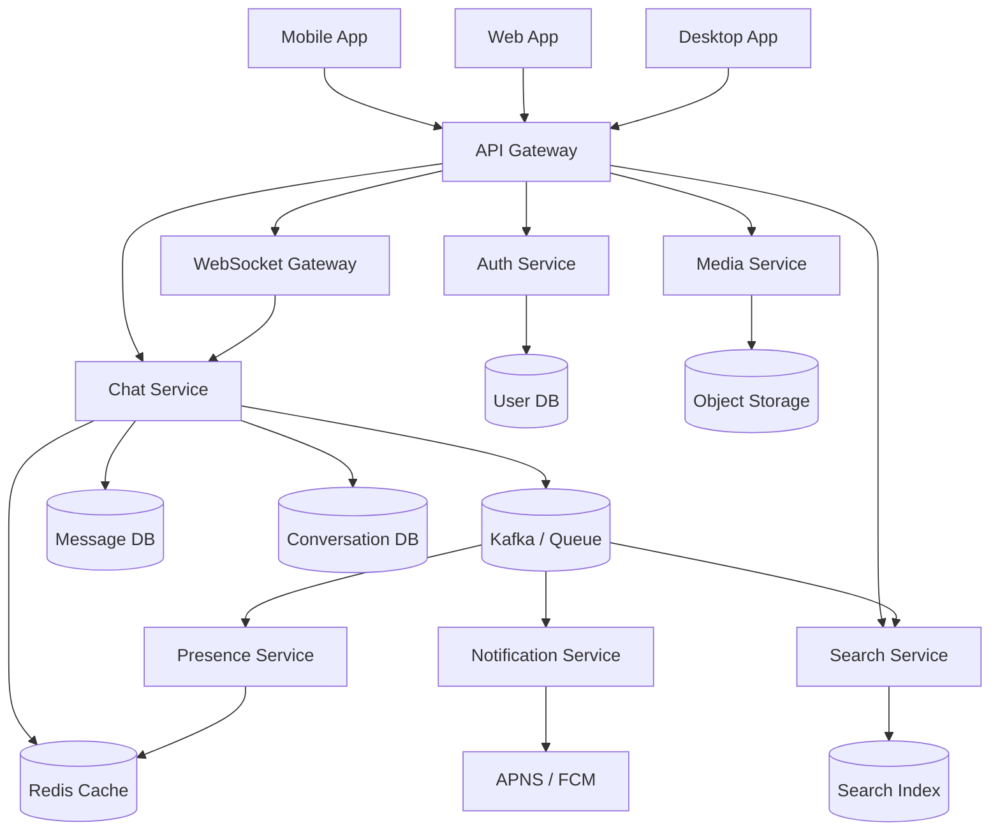

---

# 6. Core Design Principles

A chat system should follow these principles:

| Principle                | Meaning                                       |
| ------------------------ | --------------------------------------------- |
| Loose coupling           | Separate chat, presence, notification, search |
| Event-driven design      | Use queues for async processing               |
| Stateless app servers    | Allow easy horizontal scaling                 |
| Persistent message store | Never lose chat history                       |
| Fast ephemeral state     | Use Redis for presence/typing                 |
| Delivery acknowledgments | Track message lifecycle                       |
| Idempotency              | Prevent duplicate messages                    |
| Backpressure handling    | Prevent overload                              |
| Multi-device sync        | Keep state consistent across devices          |

---

# 7. Basic Message Flow

The simplest message flow is:

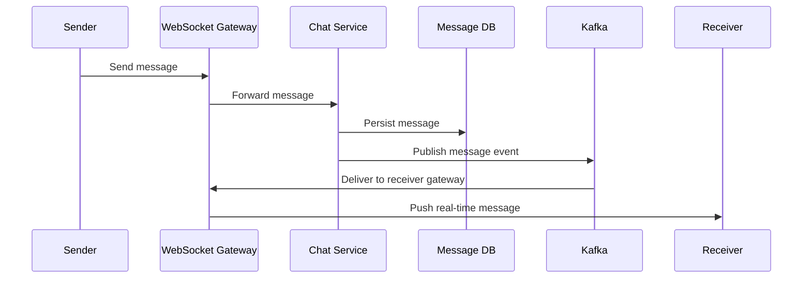

This basic flow is the backbone of the whole system.

---

# 8. Why WebSockets Matter

Chat systems need low-latency bidirectional communication.

HTTP request-response alone is not enough.

WebSockets solve this by keeping a persistent connection open.

---

## WebSocket Benefits

| Benefit            | Explanation                          |
| ------------------ | ------------------------------------ |
| Real-time delivery | Server can push instantly            |
| Bidirectional      | Client and server both send anytime  |
| Lower overhead     | Avoid repeated HTTP handshakes       |
| Better UX          | Messages and indicators feel instant |

---

## WebSocket Architecture

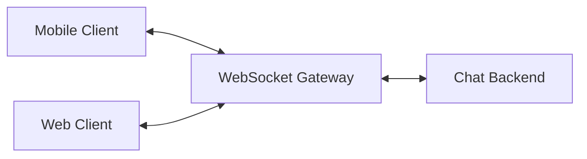

---

# 9. Message Lifecycle

A message should move through clear states.

---

## Message States

| State     | Meaning                     |
| --------- | --------------------------- |
| Created   | Sender composed the message |
| Stored    | Saved in database           |
| Sent      | Acknowledged by backend     |
| Delivered | Reached recipient device    |
| Read      | Opened by recipient         |
| Failed    | Delivery unsuccessful       |

---

## Lifecycle Diagram

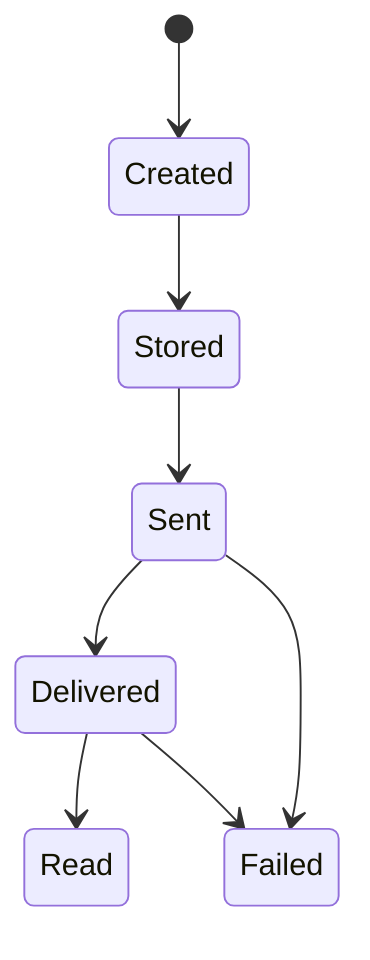

---

# 10. Data Model

A chat system needs several entities.

---

## Main Entities

| Entity             | Purpose                         |
| ------------------ | ------------------------------- |
| User               | A registered account            |
| Conversation       | One-to-one or group chat thread |
| ConversationMember | Membership in a conversation    |
| Message            | Chat content                    |
| MessageReceipt     | Delivered/read state            |
| MediaAttachment    | Images/files/videos             |
| PresenceState      | Online/offline state            |
| DeviceSession      | User device connections         |

---

## Conceptual Schema

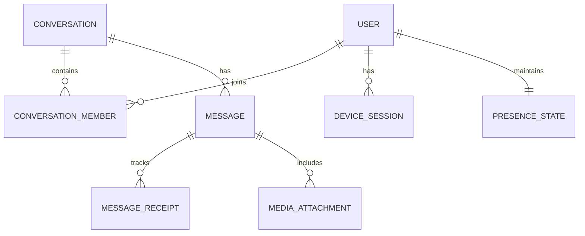

---

# 11. Database Design

A chat system usually uses multiple storage systems.

---

## 1. User Database

Stores:

* profile
* login details
* preferences
* privacy settings

Usually relational DB:

* PostgreSQL
* MySQL

---

## 2. Message Database

Stores massive write volume.

Possible choices:

* Cassandra
* DynamoDB
* ScyllaDB
* sharded MySQL/PostgreSQL

For huge scale, wide-column databases are common.

---

## 3. Conversation Metadata Database

Stores:

* conversation id
* participants
* group metadata
* last message
* unread counts

Can be relational or NoSQL depending on scale.

---

## 4. Redis

Used for:

* presence
* typing indicators
* online user mapping
* session storage
* rate limiting
* ephemeral state

---

## 5. Search Index

Used for:

* message search
* keyword queries
* user search

Usually Elasticsearch or OpenSearch.

---

# 12. Message Storage Strategy

Chat messages are write-heavy.

A good design should support:

* fast writes
* ordered retrieval
* pagination
* history fetch by conversation
* scalability via partitioning

---

## Message Table Example

| Field             | Type      | Purpose                |
| ----------------- | --------- | ---------------------- |
| message_id        | UUID      | Unique message         |
| conversation_id   | UUID      | Conversation reference |
| sender_id         | UUID      | Sender                 |
| content           | text      | Message text           |
| created_at        | timestamp | Sort and order         |
| status            | enum      | Delivery state         |
| media_url         | string    | Optional media         |
| client_message_id | string    | Idempotency            |

---

# 13. Message Partitioning

Messages should be partitioned by:

```text
conversation_id
```

This ensures:

* messages from the same conversation are grouped together
* retrieval is fast
* ordering is easier
* horizontal scaling is possible

---

## Partitioning Diagram

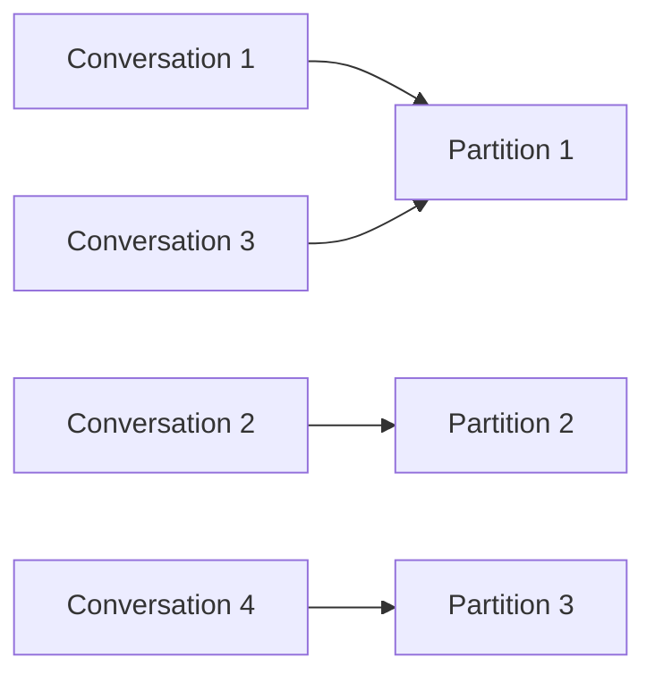

---

# 14. Why Redis is Essential

Redis is used heavily in chat systems.

---

## Use Cases

| Use Case            | Why Redis                  |
| ------------------- | -------------------------- |
| Online presence     | Very fast reads/writes     |
| Typing indicators   | Short-lived ephemeral data |
| Unread counts       | Quick increments           |
| Session storage     | Fast access                |
| Fanout coordination | Lightweight state          |
| Rate limiting       | Atomic operations          |

---

## Presence State Example

```text
user:123 -> online
user:456 -> offline
user:789 -> away
```

Presence values expire automatically if heartbeat is lost.

---

# 15. Presence System

Presence tells whether a user is online.

This is not durable data.

It is ephemeral.

---

## Presence Flow

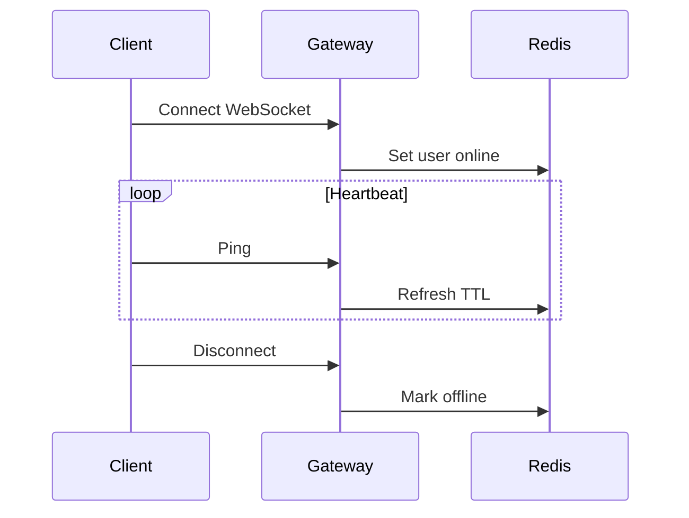

---

# 16. Typing Indicators

Typing indicators are also ephemeral.

They should not hit the main message database.

Use:

* Redis
* in-memory cache
* TTL expiration

---

## Typing Flow

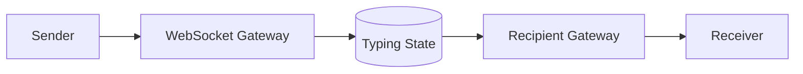

Typing events expire quickly.

---

# 17. Delivery Guarantees

A chat system usually provides:

* at-least-once delivery
* deduplication
* ordered delivery within a conversation

Exact once delivery is extremely hard in distributed systems.

So production systems usually use:

* idempotent message IDs
* deduplication
* retries
* acknowledgments

---

# 18. Idempotency in Chat

If a sender retries the same message due to timeout:

The system must not create duplicate messages.

Use:

```text
client_message_id
```

The backend stores this and checks duplicates.

---

## Idempotent Send Flow

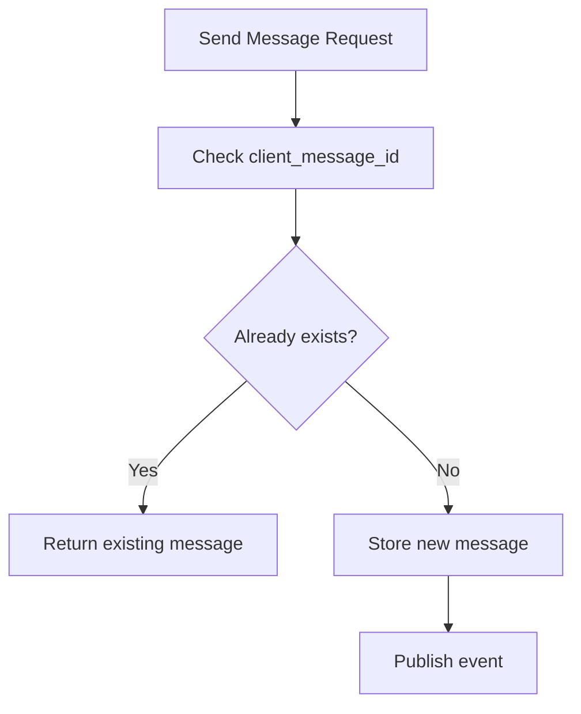

---

# 19. Delivery and Read Receipts

Receipts track message progress.

---

## Receipt States

| State     | Meaning                      |
| --------- | ---------------------------- |
| Sent      | Backend accepted the message |
| Delivered | Reached recipient device     |
| Read      | User opened the message      |

---

## Receipt Flow

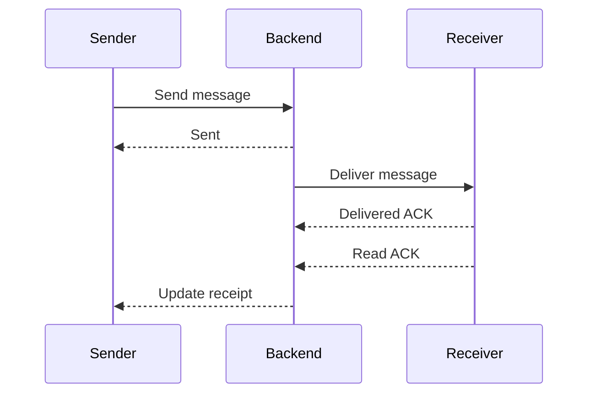

---

# 20. One-to-One Chat

One-to-one chat is the simplest case.

Every conversation includes exactly two participants.

---

## Architecture

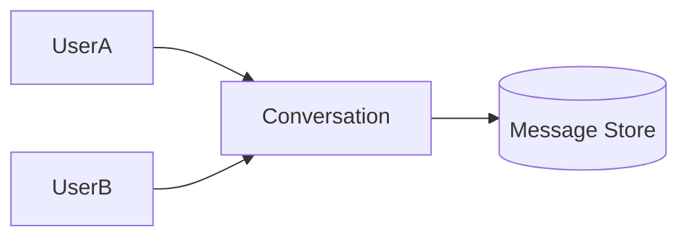

---

# 21. Group Chat

Group chat is more complex.

A single message may need to be delivered to many members.

This creates fanout challenges.

---

## Group Chat Architecture

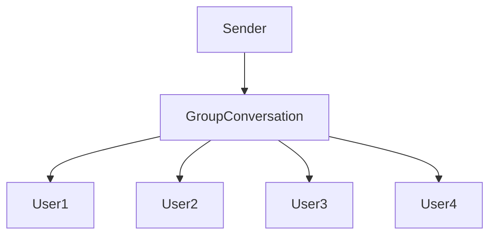

---

# 22. Fanout Strategies

There are two common strategies.

---

## 1. Fanout on Write

When message is sent:

* store separate delivery records for each recipient
* fast reads
* expensive writes

Best for:

* active chats
* many read operations

---

## 2. Fanout on Read

Store message once.

When user opens conversation:

* fetch unread messages
* compute view dynamically

Best for:

* huge groups
* low activity rooms
* broadcast channels

---

## Comparison

| Strategy        | Pros          | Cons             |
| --------------- | ------------- | ---------------- |
| Fanout on Write | Fast reads    | Expensive writes |
| Fanout on Read  | Lower storage | Expensive reads  |

---

# 23. Hybrid Fanout

Large-scale systems often use both.

Example:

* Small groups → fanout on write
* Huge channels → fanout on read

This gives the best balance.

---

# 24. Message Queue / Kafka

Kafka is a central component in modern chat systems.

It helps with:

* asynchronous delivery
* fanout
* notification processing
* search indexing
* analytics
* event replay

---

## Why Kafka is Useful

Directly making every downstream service part of the request path is risky.

Instead:

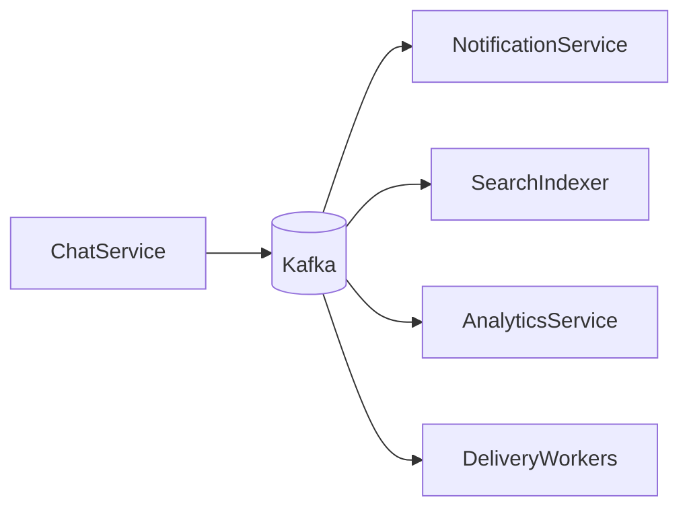

Kafka decouples message ingestion from downstream processing.

---

# 25. Event-Driven Architecture

Chat systems are naturally event-driven.

Example events:

* MessageSent
* MessageDelivered
* MessageRead
* UserOnline
* UserOffline
* TypingStarted
* TypingStopped
* MediaUploaded

---

## Event Flow

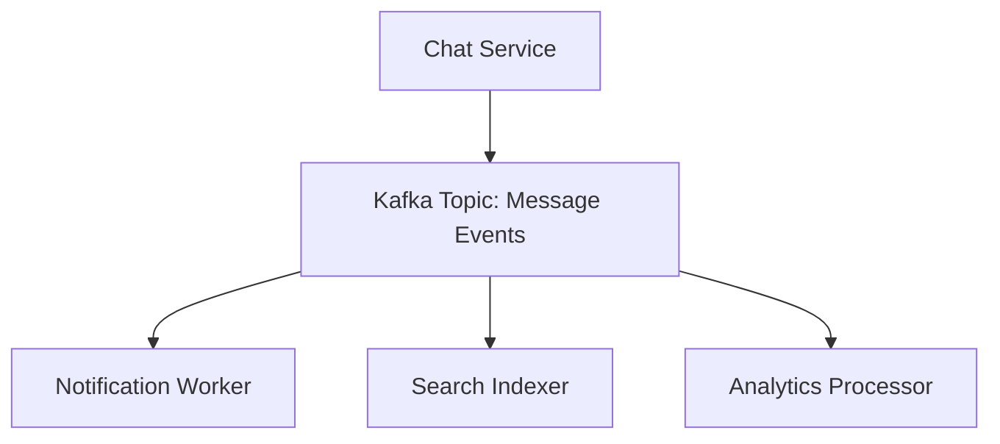

---

# 26. Offline Messaging

Users are not always online.

Messages must be stored and delivered later.

---

## Offline Flow

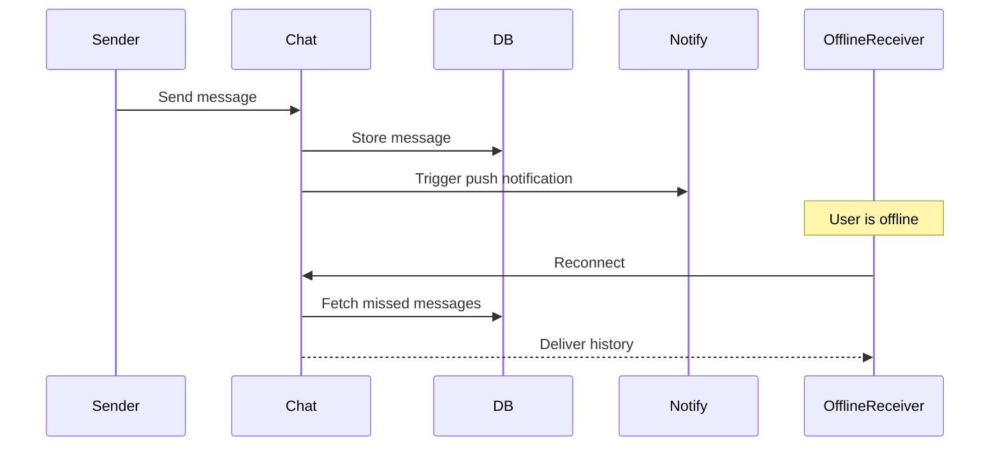

---

# 27. Push Notifications

When a user is offline, push notifications notify them of new activity.

Providers:

* FCM
* APNS
* Web Push

Push notifications are not the message itself.

They are a wake-up signal.

---

# 28. Media Upload Architecture

Media files should never go directly through chat DB.

Use object storage.

Examples:

* S3
* GCS
* Azure Blob Storage

---

## Upload Flow

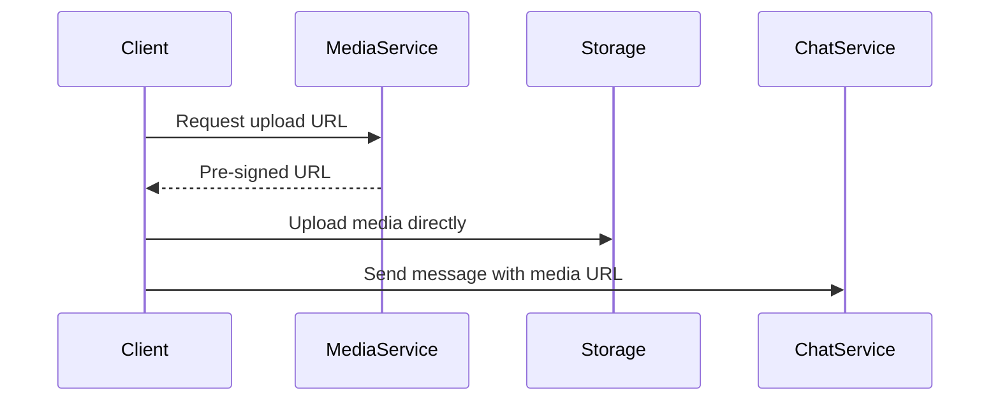

This reduces backend load massively.

---

# 29. Search Design

Search should be separate from primary message storage.

Do not run full-text search on operational DB at scale.

Use:

* Elasticsearch
* OpenSearch

---

## Search Flow

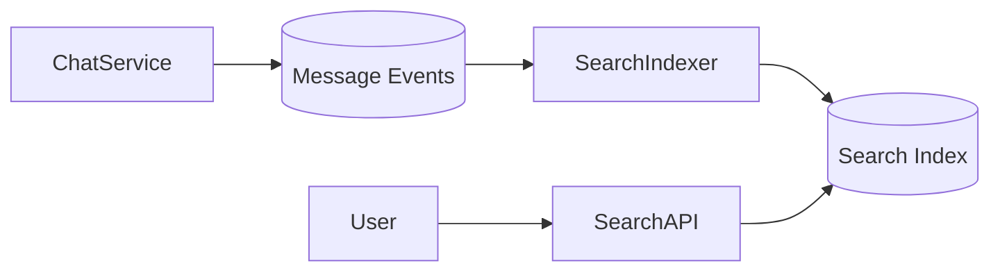

---

# 30. Message Ordering

Users expect messages to appear in order.

This is harder than it sounds in distributed systems.

---

## Ordering Strategy

Usually enforce order using:

* conversation-level sequence numbers
* timestamps
* partition affinity
* single writer per conversation shard

---

## Ordering Flow

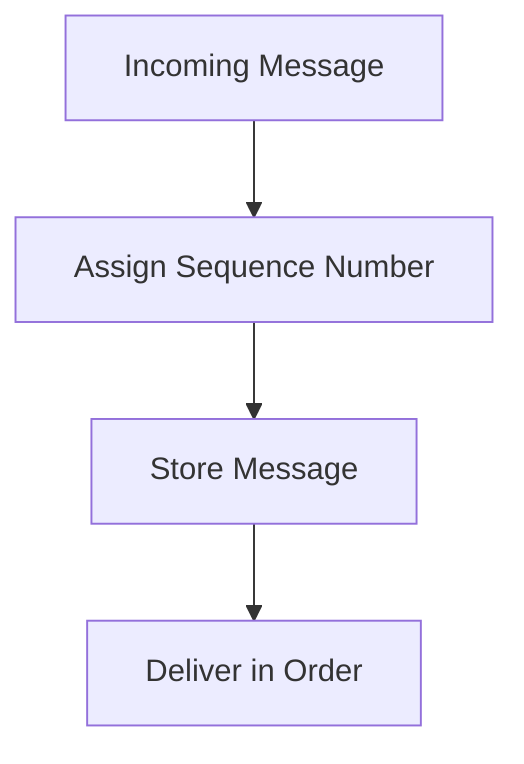

---

# 31. Sharding Strategy

To scale to billions of messages, the message store must be sharded.

A common sharding key is:

```text
conversation_id
```

---

## Why Conversation-Based Sharding

Messages in one conversation are read together often.

This improves:

* locality
* fetch performance
* ordered retrieval

---

## Sharding Diagram

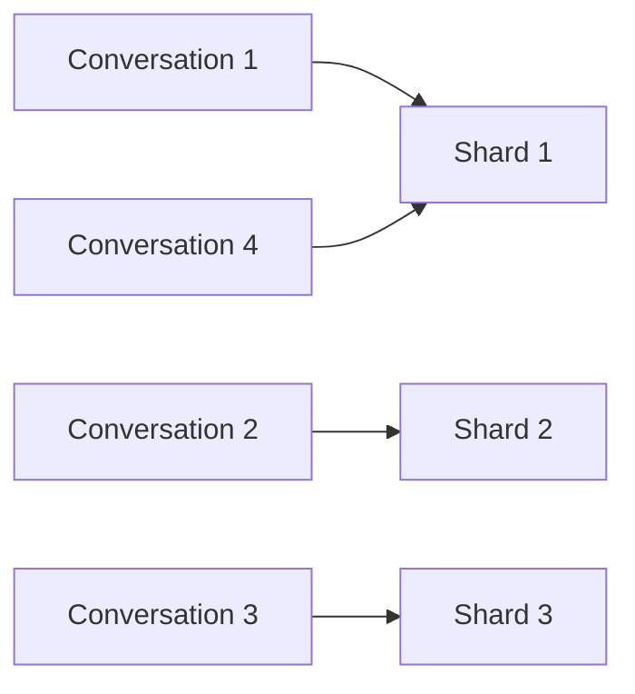

---

# 32. Cache Strategy

Caching helps in chat systems, but must be used carefully.

---

## What to Cache

| Data                  | Cache?    | Why                 |
| --------------------- | --------- | ------------------- |
| User profile          | Yes       | Frequent reads      |
| Conversation metadata | Yes       | Cheap to cache      |
| Presence              | Yes       | Ephemeral, fast     |
| Unread counts         | Yes       | Fast updates        |
| Messages              | Sometimes | Read-heavy contexts |
| Media metadata        | Yes       | Reused often        |

---

## Cache Example

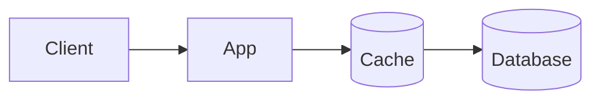

Use cache-aside pattern for many reads.

---

# 33. Rate Limiting and Abuse Protection

Chat systems are easy targets for spam and abuse.

Protect with:

* per-user limits
* per-IP limits
* per-conversation limits
* media upload limits
* anti-spam heuristics

---

## Abuse Scenarios

| Abuse Type    | Protection            |
| ------------- | --------------------- |
| Spam          | Rate limiting         |
| Bot messaging | Account verification  |
| Flooding      | Throttling            |
| Media abuse   | Upload quotas         |
| Harassment    | Block/report controls |

---

# 34. Blocking and Privacy Controls

A chat system should support:

* block user
* mute user
* report user
* last seen privacy
* read receipt privacy
* typing indicator privacy

These are product features, but also architectural requirements.

---

# 35. Multi-Device Sync

A user may be logged in on:

* phone
* laptop
* web browser
* tablet

Messages and receipts must sync across devices.

---

## Multi-Device Architecture

```mermaid
flowchart TB
    User --> Phone
    User --> Laptop
    User --> Web

    Phone --> SyncLayer
    Laptop --> SyncLayer
    Web --> SyncLayer

    SyncLayer --> MessageStore[(Message Store)]
```

Each device has its own session, but all share user identity and message state.

---

# 36. Presence Across Devices

If a user is active on any device, they may appear online.

This requires aggregation.

---

# Presence Aggregation Flow

```mermaid
flowchart TD
    Device1 --> PresenceService
    Device2 --> PresenceService
    Device3 --> PresenceService

    PresenceService --> Redis[(Presence Store)]
```

---

# 37. High Availability

The system must survive failures.

Components should be redundant:

* multiple WebSocket gateways
* multiple chat servers
* multiple Kafka brokers
* replicated databases
* multi-AZ deployment

---

## HA Architecture

```mermaid
flowchart LR
    Client --> LB[Load Balancer]
    LB --> GW1[Gateway 1]
    LB --> GW2[Gateway 2]
    LB --> GW3[Gateway 3]

    GW1 --> Chat1
    GW2 --> Chat2
    GW3 --> Chat3
```

---

# 38. Multi-Region Architecture

For global-scale chat:

* deploy in multiple regions
* keep users close to nearest region
* replicate critical data
* route traffic intelligently

---

## Multi-Region Diagram

```mermaid
flowchart TB
    UserIndia --> IndiaRegion
    UserUS --> USRegion
    UserEU --> EURegion

    IndiaRegion --> GlobalReplication
    USRegion --> GlobalReplication
    EURegion --> GlobalReplication
```

---

# 39. Cross-Region Messaging

When users in different regions chat:

* local region handles request
* event replicated across regions
* delivery happens through nearest edge

This is harder because of:

* latency
* consistency
* partition tolerance

---

# 40. Consistency Model

Chat systems usually use **eventual consistency** for many parts.

But some aspects need stronger consistency:

| Feature           | Consistency Need           |
| ----------------- | -------------------------- |
| Message existence | Strong-ish                 |
| Message ordering  | Strong within conversation |
| Presence          | Eventual                   |
| Typing            | Eventual                   |
| Search indexing   | Eventual                   |
| Read receipts     | Eventual                   |
| Unread counts     | Eventual / approximate     |

---

# 41. Why Eventual Consistency is Acceptable

Presence and typing indicators do not need perfect strong consistency.

If typing status is off by a few seconds, the product is still fine.

But message storage must be reliable.

---

# 42. Fault Tolerance

Failures happen everywhere.

The design must handle:

* WebSocket disconnects
* queue outages
* DB replicas failing
* search index lag
* notification provider failures

---

## Retry Strategy

Use retries carefully for transient failures.

Combine with:

* exponential backoff
* jitter
* circuit breaker
* dead letter queues

---

# 43. Dead Letter Queue

If a message fails repeatedly during processing, send it to DLQ.

```mermaid
flowchart LR
    Worker -->|Fail| RetryQueue
    RetryQueue -->|Exhausted| DLQ[(Dead Letter Queue)]
```

This helps prevent data loss and aids debugging.

---

# 44. Observability

A chat system needs strong observability.

Track:

| Metric                     | Purpose           |
| -------------------------- | ----------------- |
| Message delivery latency   | User experience   |
| WebSocket connection count | Capacity planning |
| Kafka lag                  | Event backlog     |
| DB write QPS               | Storage pressure  |
| Cache hit rate             | Performance       |
| Notification failure rate  | Offline delivery  |
| Presence update lag        | UX quality        |

---

## Observability Diagram

```mermaid
flowchart TB
    Services --> Logs[(Logs)]
    Services --> Metrics[(Metrics)]
    Services --> Traces[(Tracing)]

    Logs --> Dashboard[Grafana / Kibana]
    Metrics --> Dashboard
    Traces --> Dashboard
```

---

# 45. Security

Chat systems must be secure.

---

## Security Requirements

| Requirement           | Description                   |
| --------------------- | ----------------------------- |
| Authentication        | Verify user identity          |
| Authorization         | Prevent unauthorized chats    |
| Encryption in transit | TLS/WebSocket secure          |
| Encryption at rest    | Protect stored messages       |
| Abuse prevention      | Spam and harassment controls  |
| Access controls       | Private groups, blocked users |
| Media scanning        | Malware detection on uploads  |

---

# 46. End-to-End Architecture

```mermaid
flowchart TB
    User1[User A]
    User2[User B]

    LB[Load Balancer]
    GW[WebSocket Gateway]
    CS[Chat Service]
    RS[Receipt Service]
    PS[Presence Service]
    NS[Notification Service]
    MS[Media Service]
    SS[Search Service]

    Redis[(Redis)]
    Kafka[(Kafka)]
    MsgDB[(Message DB)]
    UserDB[(User DB)]
    S3[(Object Storage)]
    ES[(Search Index)]

    User1 --> LB
    User2 --> LB
    LB --> GW

    GW --> CS
    CS --> MsgDB
    CS --> Kafka
    CS --> Redis

    Kafka --> RS
    Kafka --> PS
    Kafka --> NS
    Kafka --> SS

    MS --> S3
    SS --> ES
    CS --> UserDB
```

---

# 47. Deep Dive into Each Component

---

## API Gateway

Handles:

* authentication
* request routing
* rate limiting
* TLS termination
* API versioning

---

## WebSocket Gateway

Handles:

* persistent connections
* real-time push
* heartbeats
* reconnects
* device mapping

---

## Chat Service

Handles:

* message validation
* idempotency
* persistence
* sequencing
* event publishing

---

## Presence Service

Handles:

* online/offline state
* heartbeat TTL
* device presence aggregation

---

## Notification Service

Handles:

* push notifications
* email alerts
* offline message alerts

---

## Search Service

Handles:

* full-text indexing
* keyword search
* filtering and retrieval

---

## Media Service

Handles:

* uploads
* signed URLs
* media metadata
* thumbnail generation
* virus scanning

---

# 48. Internal Message Send Flow

```mermaid
sequenceDiagram
    participant Sender
    participant Gateway
    participant ChatService
    participant DB
    participant Kafka
    participant ReceiverGateway
    participant Receiver

    Sender->>Gateway: Send message
    Gateway->>ChatService: Forward
    ChatService->>ChatService: Validate + idempotency check
    ChatService->>DB: Store message
    ChatService->>Kafka: Publish MessageSent event
    ChatService-->>Gateway: ACK to sender

    Kafka->>ReceiverGateway: Fanout event
    ReceiverGateway->>Receiver: Deliver message
```

---

# 49. Fanout at Scale

A group with 1 million members cannot be processed naively.

For huge groups, use:

* event streaming
* partitioned consumers
* delayed delivery
* read-based fanout
* partial indexing

---

# 50. Unread Count Strategy

Unread counts should not require scanning all messages.

Use:

* per-user per-conversation counters
* Redis increment/decrement
* periodic reconciliation jobs

---

# 51. Read Receipt Strategy

Receipts can be expensive at scale.

Possible approach:

* batch receipt updates
* async persistence
* store last read message ID instead of every receipt event

This is more efficient.

---

# 52. Search Strategy

For fast search:

* write events to Kafka
* index messages asynchronously
* allow eventual search consistency

This avoids slowing down message sends.

---

# 53. Media Handling Strategy

Media files must be offloaded to object storage.

Steps:

1. Client requests upload URL
2. Backend issues pre-signed URL
3. Client uploads directly to storage
4. Chat message stores media URL only

This keeps backend light.

---

# 54. Scaling Bottlenecks

| Bottleneck          | Solution                   |
| ------------------- | -------------------------- |
| WebSocket fanout    | Horizontal gateway scaling |
| DB write load       | Sharding + NoSQL           |
| Presence load       | Redis + TTL                |
| Search indexing     | Kafka + async indexers     |
| Notification spikes | Worker queues              |
| Large groups        | Hybrid fanout strategy     |

---

# 55. Failure Scenarios

---

## Scenario 1: Chat Service Failure

Solution:

* stateless app servers
* automatic failover
* retries

---

## Scenario 2: Kafka Lag

Solution:

* scale consumers
* partition topics
* backpressure control

---

## Scenario 3: DB Hot Partition

Solution:

* better sharding
* partition key redesign
* fanout strategy adjustments

---

## Scenario 4: Gateway Overload

Solution:

* load balancing
* autoscaling
* connection pooling

---

# 56. Message Deduplication

Duplicate messages happen due to retries.

Use:

* client-generated message IDs
* server-side dedup store
* unique constraints

This prevents duplicate chat messages.

---

# 57. Search and Analytics Separation

Operational chat traffic should not be slowed by analytics.

So:

* message path stays fast
* analytics happens asynchronously

This is a classic production design rule.

---

# 58. Suggested Storage Choices

| Data            | Storage                            |
| --------------- | ---------------------------------- |
| User profile    | PostgreSQL                         |
| Message history | Cassandra / DynamoDB / sharded SQL |
| Presence        | Redis                              |
| Search          | Elasticsearch                      |
| Media           | S3 / GCS                           |
| Events          | Kafka                              |

---

# 59. Why Kafka Helps So Much

Kafka enables:

* message persistence
* event replay
* consumer scaling
* decoupled processing
* analytics pipelines
* search indexing
* push notifications

It is ideal for chat event pipelines.

---

# 60. Final Production Architecture

```mermaid
flowchart TB
    ClientA --> LB
    ClientB --> LB

    LB --> WSGW[WebSocket Gateway]
    LB --> APIGW[API Gateway]

    WSGW --> ChatSvc[Chat Service]
    APIGW --> AuthSvc[Auth Service]
    APIGW --> MediaSvc[Media Service]
    APIGW --> SearchSvc[Search Service]

    ChatSvc --> MsgDB[(Message DB)]
    ChatSvc --> Redis[(Redis)]
    ChatSvc --> Kafka[(Kafka)]

    Kafka --> PresenceSvc[Presence Service]
    Kafka --> NotificationSvc[Notification Service]
    Kafka --> SearchIndexer[Search Indexer]
    Kafka --> ReceiptSvc[Receipt Service]

    MediaSvc --> S3[(Object Storage)]
    SearchIndexer --> ES[(Search Index)]
    AuthSvc --> UserDB[(User DB)]
```

---

# 61. Key Takeaways

| Concept            | Summary                                |
| ------------------ | -------------------------------------- |
| Real-time delivery | WebSockets are essential               |
| Message durability | Store every message reliably           |
| Scale              | Shard message storage                  |
| Ephemeral state    | Use Redis for presence/typing          |
| Async processing   | Use Kafka for fanout and notifications |
| Search             | Separate search indexing               |
| Media              | Use object storage                     |
| Reliability        | Retries, idempotency, DLQs             |
| Multi-device sync  | Required for modern UX                 |
| Group chat scaling | Hybrid fanout strategy                 |

---

# 62. Conclusion

A chat system is one of the most important distributed systems to design because it combines:

* low latency
* high throughput
* durability
* state synchronization
* real-time communication
* event-driven architecture
* offline delivery
* global scale

The simplest chat app is easy.

The production chat system is not.

A real-world chat system must survive:

* millions of users
* billions of messages
* network failures
* duplicate requests
* offline devices
* media uploads
* search indexing
* presence storms
* notification spikes
* multi-region traffic

The right architecture uses:

* WebSockets for real-time communication
* Kafka for asynchronous processing
* Redis for ephemeral state
* NoSQL or sharded storage for message scale
* object storage for media
* search engines for retrieval
* load balancers and gateways for scale
* idempotency and retries for resilience

That is how you build a chat system that is not just functional, but production-grade and globally scalable.