A like and view system seems simple on the surface.

A user taps a heart.
A user watches a video.
A counter increases.

But at scale, this becomes one of the most important backend subsystems in a media or social platform.

Why?

Because likes and views power:

* ranking
* recommendations
* virality
* creator analytics
* engagement notifications
* trending feeds
* monetization decisions
* moderation signals
* product experiments
* ads targeting signals

A production like/view system must support:

* millions of writes per second
* massive read traffic
* low latency updates
* idempotent actions
* anti-abuse detection
* real-time counters
* eventual consistency where acceptable
* durable event logging
* multi-region fanout
* analytics pipelines

This system applies across:

* YouTube-like video platforms
* Instagram-like social platforms
* short-form reels
* photo feeds
* live streams
* news feeds
* ecommerce product engagement
* music and podcast apps

The hard part is not storing a number.

The hard part is making that number correct enough, fast enough, and abuse-resistant enough at global scale.

---

# 1. Problem Statement

Design a system where users can:

* like or unlike content
* react with emojis or multiple reaction types
* view content
* partially view or fully view content
* see like counts and view counts in near real time
* prevent duplicate likes/views from the same user or device
* support trending and ranking signals
* show creator analytics
* handle high traffic on viral content
* keep counters consistent under huge scale

---

# 2. Functional Requirements

| Requirement          | Description                                   |
| -------------------- | --------------------------------------------- |
| Like Content         | Users can like posts, videos, reels, etc.     |
| Unlike Content       | Users can remove their like                   |
| View Content         | Users can view a video, post, reel, etc.      |
| Unique View Counting | Count views according to product rules        |
| Real-Time Counters   | Like/view counts should update quickly        |
| Reactions            | Optional support for multiple reaction types  |
| User State           | Know whether a user has liked something       |
| Analytics            | Report engagement metrics to creators         |
| Anti-Abuse           | Detect bot inflation and fake engagement      |
| Ranking Support      | Feed engagement into recommendation systems   |
| Notifications        | Notify creators about engagement where needed |

---

# 3. Non-Functional Requirements

| Requirement     | Target                                                 |
| --------------- | ------------------------------------------------------ |
| Latency         | Sub-second like/view updates                           |
| Availability    | 99.99%                                                 |
| Scalability     | Millions of requests/sec                               |
| Durability      | Engagement events must not be lost                     |
| Correctness     | Counters should be approximately or eventually correct |
| Idempotency     | Duplicate requests must not double count               |
| Fault Tolerance | Survive retries, failures, spikes                      |
| Observability   | Logs, metrics, traces, audits                          |
| Anti-Fraud      | Must detect artificial inflation                       |
| Cost Efficiency | Counters should not overload databases                 |

---

# 4. The Core Design Challenge

Like and view systems have two very different kinds of data:

| Data Type         | Example                          | Nature                      |
| ----------------- | -------------------------------- | --------------------------- |
| User-action state | “User A liked Post X”            | Small but needs correctness |
| Aggregate count   | “Post X has 1.2M likes”          | Hot read path               |
| Event history     | “User A viewed at time T”        | Append-only analytics       |
| Derived metrics   | CTR, watch time, engagement rate | Batch/stream computed       |

A robust design must separate:

* **source of truth**
* **hot counters**
* **analytics pipelines**
* **ranking features**

---

# 5. High-Level Architecture

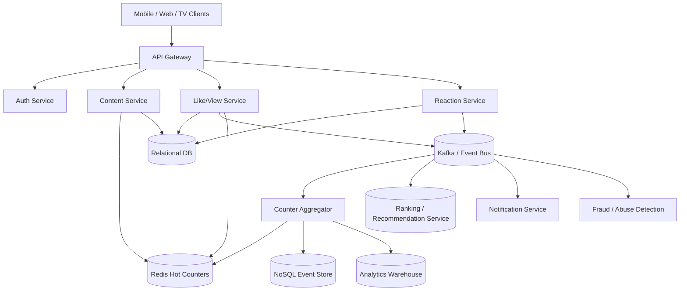

---

# 6. Two Separate Subsystems

A good design separates the problem into two parts:

## 6.1 Like System

This tracks:

* whether a user liked content
* whether they unliked it
* reaction type if applicable
* creator notifications
* aggregate like counters

---

## 6.2 View System

This tracks:

* whether content was viewed
* whether the view should count
* duration of view
* device/session identity
* repeat view logic
* unique view rules

Views are much trickier than likes because the definition of a “view” differs by product.

For example:

* video platforms may count a view after a minimum watch threshold
* social feeds may count when media becomes visible
* live streams may count after a session is established
* short-form reels may count after autoplay starts or a short watch duration

So we design the view system as a **policy-driven engagement system**.

---

# 7. Like System Deep Dive

Likes are usually simpler than views.

A like is:

* an explicit action
* binary or categorical
* easy to deduplicate by user/content pair
* easy to reverse

---

## 7.1 Like State Model

| Field         | Purpose                 |
| ------------- | ----------------------- |
| content_id    | Target post/video       |
| user_id       | Who liked it            |
| reaction_type | Like, love, laugh, etc. |
| created_at    | When action happened    |
| updated_at    | If reaction changes     |
| status        | active / removed        |

---

## 7.2 Like API Flow

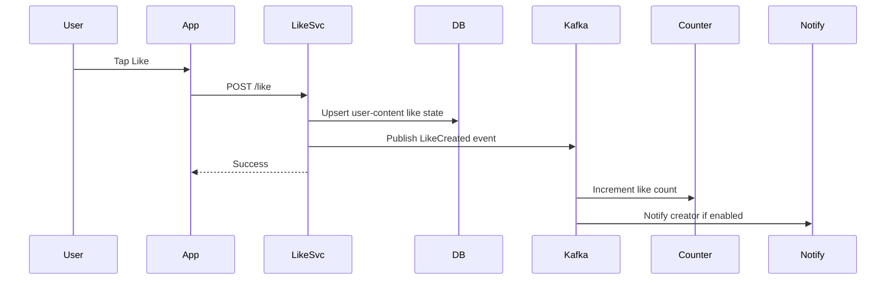

---

## 7.3 Like Idempotency

A like request should be idempotent.

If the user taps Like twice:

* the count should not increase twice

Use:

* unique constraint on `(content_id, user_id)`
* idempotency key
* state machine per user-content pair

---

## 7.4 Like State Machine

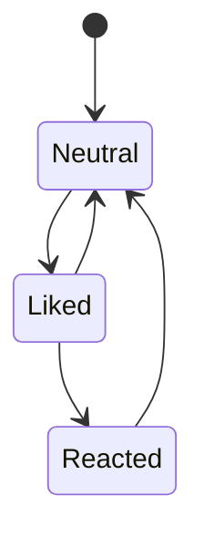

If multiple reactions exist, “like” becomes one reaction type among many.

---

# 8. View System Deep Dive

Views are harder because they are not always explicit.

A like says:

> “I liked this.”

A view says:

> “I saw this.”

But “saw” can mean many things.

---

## 8.1 View Counting Policies

Different platforms count views differently.

| Platform Type  | Typical Counting Rule                          |
| -------------- | ---------------------------------------------- |
| Video platform | Count after watch threshold                    |
| Social feed    | Count when content becomes visible long enough |
| Live stream    | Count after stable connection/session          |
| Story          | Count when story is opened                     |
| Short video    | Count after autoplay or dwell threshold        |

Because of this, the system should not hard-code one definition.

It should use a **view policy engine**.

---

## 8.2 View Event Model

| Field       | Purpose                                |
| ----------- | -------------------------------------- |
| content_id  | Target content                         |
| viewer_id   | Who viewed it                          |
| session_id  | View session identity                  |
| device_id   | Device fingerprint                     |
| started_at  | When view began                        |
| ended_at    | When view ended                        |
| duration_ms | Watch duration                         |
| source      | Feed, search, profile, notification    |
| visibility  | In viewport / autoplay / manual open   |
| countable   | Whether it qualifies as a counted view |

---

## 8.3 View Counting Rules

A view may be counted only if:

* minimum duration threshold is met
* content is visible long enough
* session is valid
* not obviously a bot
* duplicate suppression window passes
* device/app context is trusted enough

This prevents trivial inflation.

---

## 8.4 View Flow

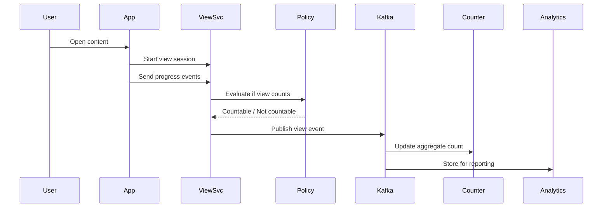

---

# 9. Why Views Need Sessionization

If you simply count every request as a view:

* bots can inflate counts
* refreshes can overcount
* accidental opens can distort metrics

So a view system should be session-aware.

A session can be:

* per device
* per user
* per content
* time-windowed

Example:

* count only one view per user per content per 24 hours
* count only if watch duration exceeds 3 seconds
* count only if at least 50% of story was visible

The exact rule varies by product, but the architecture should support the rule engine.

---

# 10. Count Aggregation Strategy

The system must separate:

* raw events
* live counters
* durable counts
* analytics counts

A good pipeline is:

1. user action arrives
2. validate and persist event
3. emit event to stream
4. aggregate counts asynchronously
5. update hot cache
6. periodically reconcile with durable store

---

## Count Pipeline

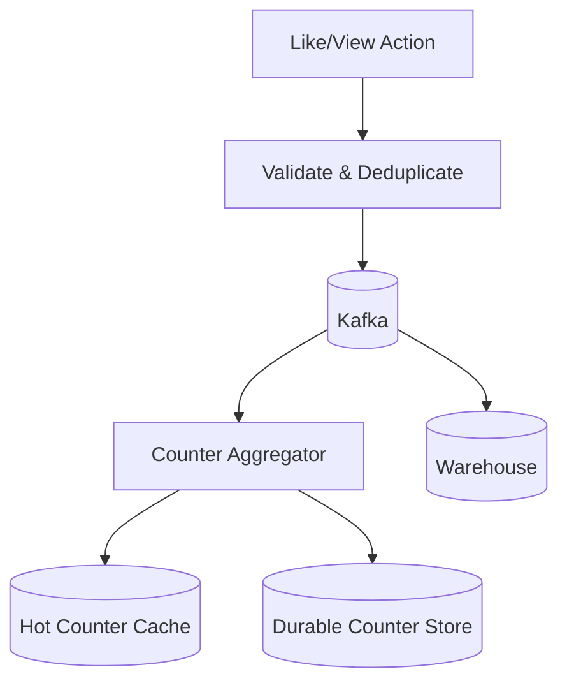

---

# 11. Why Kafka Is Essential

Kafka helps with:

* buffering spikes
* decoupling requests from aggregation
* replaying events
* feeding analytics
* feeding recommendation systems
* audit and fraud detection

Without Kafka, a viral post could overwhelm the database.

---

# 12. Real-Time Counter Cache

For UI, counts must be fast.

Users expect:

* like count updates
* view count changes
* reaction counts
* trending indicators

Use Redis as hot cache.

```text id="hot_count_01"
content:123 -> likes = 120394, views = 9038491
```

Redis gives:

* low latency
* atomic increments
* quick reads

But Redis should not be the only source of truth.

---

# 13. Durable Storage Strategy

The durable store should contain:

* event logs
* like state
* view sessions
* periodic snapshots
* counter checkpoints

For like state:

* relational DB or strongly consistent NoSQL

For view events:

* append-only event store or NoSQL time-series store

For aggregates:

* snapshot table updated periodically

---

# 14. Like Storage Design

Like storage needs strong uniqueness.

A common schema:

| Field         | Purpose            |
| ------------- | ------------------ |
| content_id    | Content identifier |
| user_id       | Liker identifier   |
| reaction_type | Like / love / etc. |
| created_at    | Timestamp          |
| updated_at    | Timestamp          |
| status        | active / removed   |

Unique key:

* `(content_id, user_id)`

That guarantees one active reaction record per user-content pair.

---

# 15. View Storage Design

Views are better stored as append-only events.

Why?

Because analytics needs history:

* who viewed
* when they viewed
* how long they stayed
* from what source
* on what device

A single view count field is not enough.

You want:

* raw event log
* aggregated counters
* deduplicated session summaries

---

# 16. Update Read Path vs Write Path

This system is read heavy.

For example:

* content cards on feed show like counts
* video thumbnails show views
* creator dashboards show trends
* ranking systems read engagement scores
* users see whether they already liked something

So we must optimize the read path using:

* cache
* precomputed counters
* denormalized summaries
* fanout updates

---

# 17. Content Card Rendering Flow

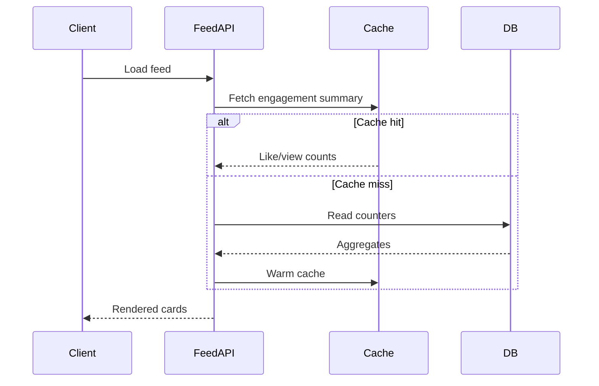

---

# 18. Multi-Region Design

A global social/video platform should have region-local engagement processing.

Use:

* local writes
* regional caches
* async cross-region replication
* eventual reconciliation

This reduces latency and keeps user interaction fast.

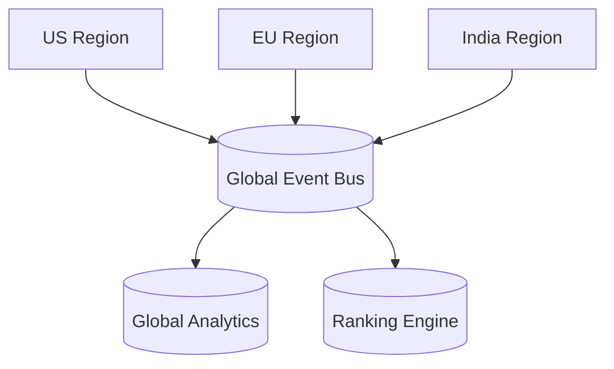

---

# 19. Sharding Strategy

Likes and views are massive scale workloads.

Sharding keys should be chosen carefully.

| Data             | Recommended Shard Key              |
| ---------------- | ---------------------------------- |
| Like state       | content_id or content_id + user_id |
| View events      | content_id + time bucket           |
| Live counters    | content_id                         |
| Aggregation jobs | content_id hash                    |
| Analytics        | region + time                      |

Why content-based sharding?
Because engagement is usually queried by content.

---

# 20. Hot Content Problem

A viral post or video can create extreme load.

Problems:

* millions of likes in minutes
* millions of views in hours
* hot counter contention
* cache pressure
* write spikes

Mitigations:

* batching
* asynchronous aggregation
* sharded counters
* cached summary views
* local rate limiting
* queue buffering

---

# 21. Distributed Counter Strategy

A single counter per content item can become a bottleneck.

Instead use:

* striped counters
* sharded counters
* periodic merges

Example:

* content 123 like count split across 64 shards
* each shard handles a fraction of updates
* background job merges totals

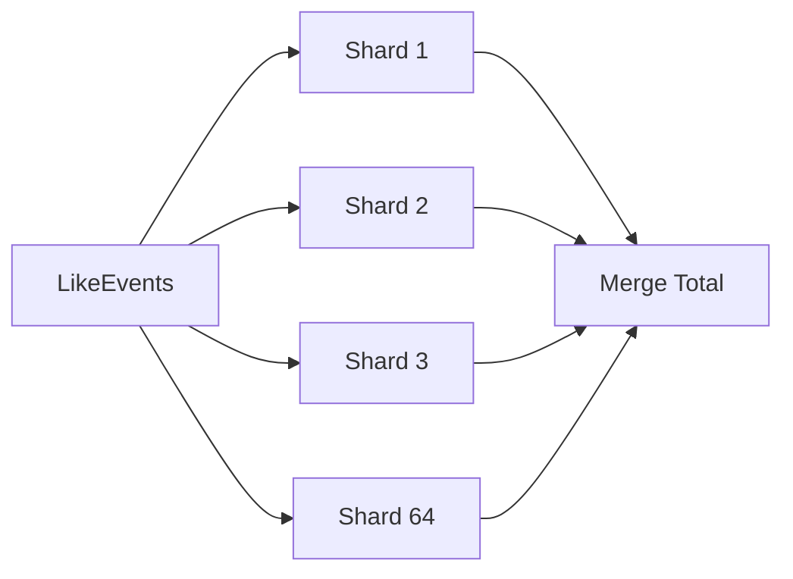

This reduces write contention significantly.

---

# 22. Unique View Deduplication

One of the biggest design questions is:

> What counts as a unique view?

The answer depends on the product.

Examples:

* per user per content per day
* per session
* per device
* per account
* per playback window

The system should support configurable dedupe windows.

---

## Dedup Strategy

| Dimension         | Example                     |
| ----------------- | --------------------------- |
| User-based        | Count once per user per day |
| Session-based     | Count once per session      |
| Device-based      | Count per device            |
| Time-window-based | Count once every N hours    |

The dedupe logic should be applied before updating durable counters.

---

# 23. Anti-Abuse and Fraud Detection

Likes and views are easy targets for manipulation.

Common abuse:

* bot likes
* click farms
* view bots
* refresh spam
* scripted autoplay inflation
* replay attacks
* multiple fake accounts

Detection signals:

* abnormal velocity
* suspicious IP patterns
* device fingerprint reuse
* repeated identical behavior
* impossible session timing
* no-scroll/no-interaction views
* repetitive play/pause cycles

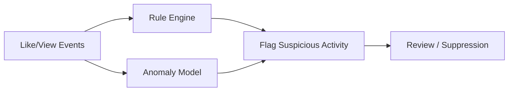

---

# 24. Like vs View Semantics

Likes and views behave differently.

| Aspect        | Like             | View                       |
| ------------- | ---------------- | -------------------------- |
| Intent        | Explicit         | Often implicit             |
| Frequency     | Low              | High                       |
| Deduplication | Per user-content | Session and policy based   |
| Fraud Risk    | Medium           | High                       |
| User Feedback | Strong signal    | Weak but broad signal      |
| Ranking Usage | Very strong      | Strong for reach/attention |

A product might use likes for explicit preference and views for attention or exposure.

---

# 25. Analytics Pipeline

Engagement data powers creator dashboards and ML features.

Track:

* total likes
* unique likes
* total views
* unique views
* watch completion
* like-to-view ratio
* engagement rate
* time-to-first-like
* viral velocity
* region breakdown
* device breakdown

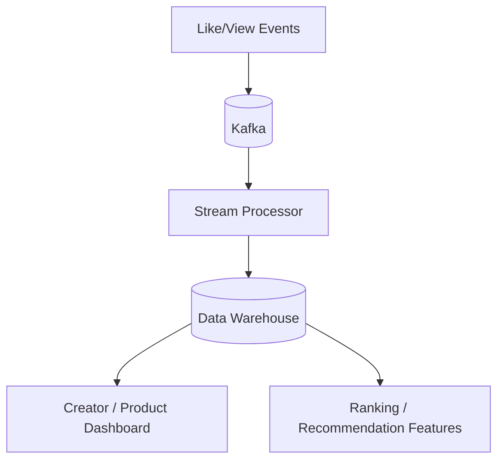

---

# 26. Ranking and Recommendation Signals

Engagement signals are crucial for ranking systems.

They help answer:

* is this content interesting?
* is this creator popular?
* is this item trending?
* is the post getting early momentum?

Features:

* likes per minute
* views per minute
* engagement ratio
* recent growth slope
* unique viewers
* average watch duration
* view-to-like conversion

---

# 27. Real-Time Trending Computation

Trending should not be computed by scanning all records repeatedly.

Instead:

* consume events
* compute rolling windows
* update top-K candidates
* store in a hot trend cache

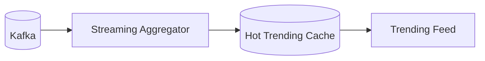

---

# 28. Notifications

Creators may receive notifications when:

* a post gets liked
* a post crosses a milestone
* a video crosses a threshold
* a post goes viral
* a campaign hits engagement targets

Notifications must be rate-limited so viral events do not spam creators excessively.

---

# 29. Idempotency

Like and view systems are especially vulnerable to retries.

Example:

* mobile app retries due to network error
* same like request arrives twice
* same view session event arrives twice

Fix:

* idempotency keys
* request IDs
* unique event IDs
* dedupe store

A request should be safe to retry without double counting.

---

# 30. API Design

---

## Like Content

```http id="like_api_01"
POST /engagement/like
```

Request:

```json
{
  "contentId": "post_123",
  "userId": "user_45",
  "reactionType": "like",
  "requestId": "req_abc_001"
}
```

---

## Unlike Content

```http id="like_api_02"
DELETE /engagement/like
```

---

## Send View Event

```http id="view_api_01"
POST /engagement/view
```

Request:

```json
{
  "contentId": "video_987",
  "viewerId": "user_45",
  "sessionId": "sess_001",
  "timestamp": 1730000000,
  "durationMs": 4200,
  "countable": true
}
```

---

## Get Engagement Summary

```http id="summary_api_01"
GET /engagement/summary/{contentId}
```

---

# 31. Real-Time Sync Flow

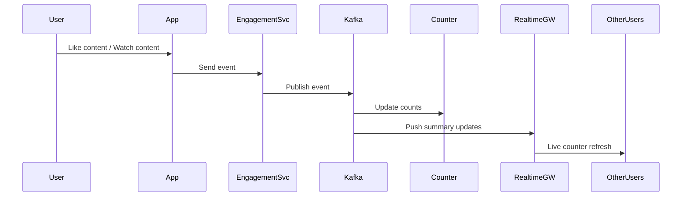

---

# 32. Data Model

---

## Like State

| Field         | Description              |
| ------------- | ------------------------ |
| content_id    | Target object            |
| user_id       | Actor                    |
| reaction_type | like / love / laugh etc. |
| status        | active / removed         |
| created_at    | First action time        |
| updated_at    | Last action time         |

---

## View Session

| Field          | Description                        |
| -------------- | ---------------------------------- |
| session_id     | View session                       |
| content_id     | Target object                      |
| viewer_id      | Viewer                             |
| start_time     | Session start                      |
| end_time       | Session end                        |
| watch_duration | Duration                           |
| source         | Feed / search / profile / autoplay |
| is_countable   | Whether it counts                  |

---

## Counter Snapshot

| Field             | Description        |
| ----------------- | ------------------ |
| content_id        | Target content     |
| like_count        | Total likes        |
| view_count        | Total views        |
| unique_view_count | Unique viewers     |
| updated_at        | Last snapshot time |

---

# 33. Storage Strategy

| Data               | Storage                          |
| ------------------ | -------------------------------- |
| Like state         | SQL or strongly consistent NoSQL |
| View events        | Append-only NoSQL or event store |
| Aggregate counts   | Redis + DB snapshots             |
| Analytics          | Warehouse                        |
| Fraud logs         | Audit store                      |
| Trending summaries | Redis / in-memory store          |

---

# 34. Why Not Just Use SQL Counters?

Direct SQL increments on every like/view do not scale well because:

* hot rows become contention points
* writes explode during viral traffic
* read latency suffers
* replication lag grows
* cache invalidation becomes messy

Use SQL for durable state, not for every hot counter mutation.

---

# 35. Hybrid Counter Design

A strong production pattern is:

1. write event
2. update local shard counter
3. update Redis hot count
4. batch snapshot to DB
5. reconcile periodically

This gives speed plus durability.

---

# 36. Cache Invalidation Strategy

If counters are cached, they must be invalidated or updated correctly.

Possible strategies:

* write-through
* write-behind
* cache-aside with event-driven updates

For engagement systems, event-driven updates are usually best.

---

# 37. View Count Accuracy Tradeoffs

Perfect exactness is expensive.

Product teams often accept:

* small delays
* approximate real-time updates
* periodic reconciliation

What matters more:

* no large overcounting
* no duplicate inflation
* stable counter behavior
* eventual correctness

---

# 38. Partial Views and Visibility Events

For feed-based products:

* a content item may count as viewed when at least part of it is visible on screen

For short-video products:

* view may count after auto-play and short dwell

For long-form video:

* view may count after a minimum watch threshold

The system should support these rules via a policy engine.

---

# 39. Multi-Platform Support

The same backend should support:

* mobile apps
* web apps
* smart TVs
* embedded devices
* creator dashboards
* admin tools

Each client may have different view semantics and UI rendering needs.

---

# 40. Reconciliation Jobs

Even with streaming counters, you need batch reconciliation.

Why?

* to correct drift
* to repair missed events
* to recompute analytics
* to detect fraud
* to rebuild derived counters after outage

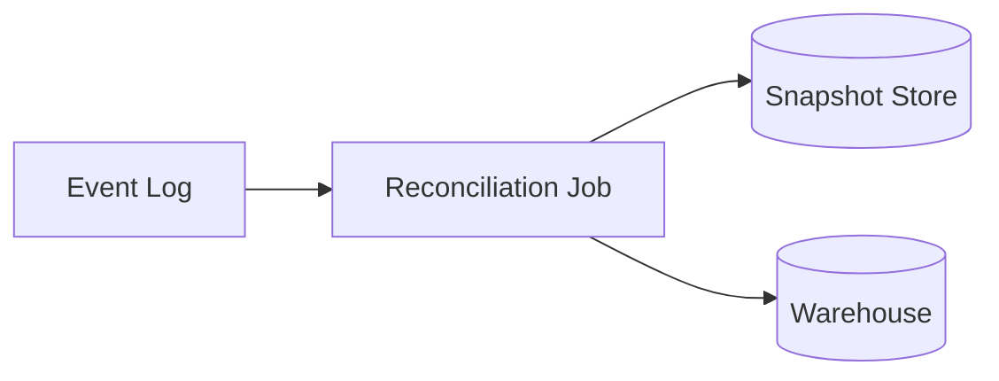

---

# 41. Observability

The system should monitor:

| Metric               | Why                     |
| -------------------- | ----------------------- |
| Like latency         | User experience         |
| View event latency   | Real-time freshness     |
| Counter lag          | UI correctness          |
| Dedup rate           | Abuse or retry patterns |
| Fraud flags          | Security                |
| Kafka lag            | Pipeline health         |
| Cache hit rate       | Performance             |
| Reconciliation drift | Data quality            |

---

# 42. Failure Scenarios

---

## Kafka Is Delayed

Effect:

* counters lag behind
* analytics delayed
* UI may show slightly stale numbers

Mitigation:

* local cache
* backpressure handling
* consumer autoscaling

---

## Redis Fails

Effect:

* hot counters unavailable

Mitigation:

* replica failover
* rebuild from durable snapshots
* degrade gracefully

---

## Duplicate Requests

Effect:

* double counts

Mitigation:

* idempotency keys
* unique constraints
* dedupe store

---

## Bot Attack

Effect:

* fake views or likes

Mitigation:

* trust scoring
* IP/device correlation
* anomaly detection
* rate limiting

---

# 43. Example End-to-End Like Flow

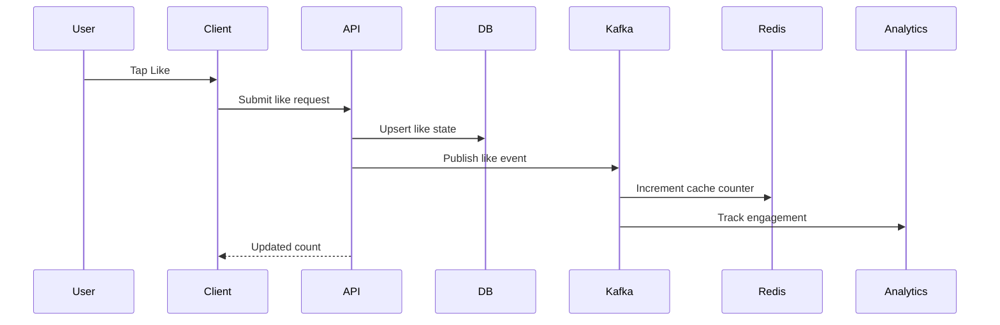

---

# 44. Example End-to-End View Flow

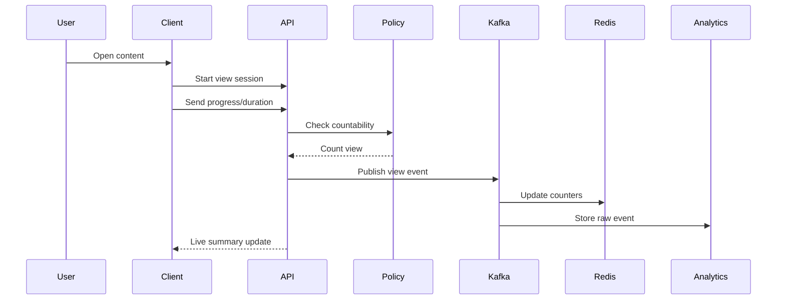

---

# 45. Advanced Reactions

A modern platform may expand “like” into a richer reaction system:

* like
* love
* laugh
* sad
* angry
* wow

This is still the same core system, just with a reaction dimension.

The data model should support:

* one active reaction per user-content pair
* reaction change without duplicate counting
* counts per reaction type

---

# 46. Ranking Impact

Like and view signals should not only update counters.

They should also feed:

* home feed ranking
* explore ranking
* search relevance
* creator recommendations
* trending detection

This means engagement events should be treated as first-class events in the analytics and ML pipeline.

---

# 47. Final Production Architecture

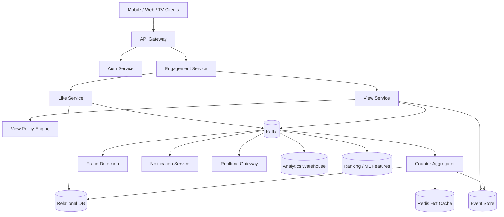

---

# 48. Tradeoffs

| Design Choice      | Benefit              | Tradeoff                |
| ------------------ | -------------------- | ----------------------- |
| Redis counters     | Fast reads           | Volatile memory         |
| Event stream       | Decoupled scaling    | More moving parts       |
| SQL for like state | Strong uniqueness    | Hot-row risk if misused |
| View policy engine | Flexible definitions | More complexity         |
| Sharded counters   | Avoid bottlenecks    | Merge logic required    |
| Async aggregation  | Scales well          | Staleness in UI         |

---

# 49. Key Takeaways

| Concept         | Summary                                        |
| --------------- | ---------------------------------------------- |
| Likes           | Explicit, idempotent, user-content state       |
| Views           | Session-based, policy-driven, harder to define |
| Counters        | Must be cached and aggregated                  |
| Events          | Kafka should carry engagement activity         |
| Deduplication   | Essential for both likes and views             |
| Fraud detection | Critical at scale                              |
| Analytics       | Engagement drives reporting and ML             |
| Ranking         | Like/view events power recommendations         |

---

# Conclusion

A complete like and view system is far more than a pair of counters.

It is a **high-throughput engagement intelligence system** that must safely process:

* explicit user actions
* implicit attention signals
* real-time counter updates
* analytics aggregation
* ranking features
* fraud and abuse protection
* multi-region traffic

A production-grade design should use:

* **SQL or strongly consistent storage** for like state
* **session-aware view policies** for flexible counting
* **Kafka or an event bus** for decoupling and scale
* **Redis** for hot counters and low-latency reads
* **append-only events** for view history and auditability
* **analytics pipelines** for creator dashboards and ML features
* **idempotent APIs** to survive retries
* **fraud detection** to block artificial inflation
* **multi-region replication** for resilience

The system succeeds when it can answer all of these correctly and fast:

* Did this user like it?
* How many likes does it have?
* Did this view count?
* How many unique views occurred?
* Is this count trustworthy?
* What should be ranked higher next?

That is how you build a like and view system that can power YouTube, Instagram, and similar platforms at global scale.
