A stock brokerage platform looks simple from the outside:

* open an account
* add funds
* buy and sell stocks
* track holdings
* view profit and loss
* receive market data
* place advanced orders
* manage mutual funds and derivatives

But a real brokerage platform is a highly regulated, mission-critical financial system.

It must handle:

* real-time market data
* order routing to exchanges
* risk checks before execution
* margin calculations
* ledgering and settlement
* portfolio and P&L updates
* KYC and compliance
* account opening
* watchlists, charts, and alerts
* mutual funds, IPOs, ETFs, commodities, currency, and derivatives
* reports and analytics
* fraud detection and auditability

Zerodha’s public product pages show that its current ecosystem includes trading and investing across stocks, futures, options, commodities, currency, ETFs, mutual funds, and bonds. Kite is its flagship all-device trading platform with streaming market data, advanced charts, market depth, GTT, baskets, alerts, risk warnings, IPO investing via UPI, and APIs. Console is its reporting and analytics dashboard, and Coin supports direct mutual fund investing. Zerodha also publicly advertises a digital account-opening flow using details entry, e-sign, and verification, along with a pricing model that charges zero for equity and mutual fund investments and a flat ₹20 for intraday and F&O trades.

A real brokerage platform must therefore be designed as a **financial operating system**, not just a trading app. It is a combination of:

* user onboarding
* identity verification
* account and ledger management
* order management
* exchange connectivity
* market data distribution
* portfolio and reports
* risk and compliance
* notifications and analytics
* multi-asset product support

---

# 1. Problem Statement

Design a brokerage platform where users can:

* open an account digitally
* complete KYC and verification
* deposit and withdraw funds
* trade equities, F&O, commodities, currency, ETFs, mutual funds, and bonds
* place standard and advanced orders
* view live prices and charts
* create watchlists
* manage holdings and positions
* receive alerts
* apply for IPOs
* access tax and portfolio reports
* use mobile, web, and desktop clients
* work with low latency during market hours and around market edges

---

# 2. Functional Requirements

| Requirement     | Description                                             |
| --------------- | ------------------------------------------------------- |
| Account Opening | Digital onboarding with identity verification           |
| KYC             | PAN, bank verification, identity checks, AML compliance |
| Trading         | Buy and sell securities across supported instruments    |
| Market Data     | Streaming quotes, depth, candles, and charts            |
| Orders          | Market, limit, stop-loss, GTT, AMO, OCO                 |
| Risk Checks     | Margin, exposure, holdings, order validation            |
| Portfolio       | Holdings, positions, P&L, corporate actions             |
| Funds           | Deposit, withdrawal, ledger, margin ledger              |
| Watchlists      | Saved instruments and alerts                            |
| Mutual Funds    | Direct mutual fund investing                            |
| IPOs            | IPO application and allotment tracking                  |
| Reports         | Statements, tax reports, contract notes                 |
| Notifications   | Order, price, margin, and event alerts                  |
| Analytics       | Portfolio and trade analytics                           |
| APIs            | Optional platform integrations                          |

---

# 3. Non-Functional Requirements

| Requirement     | Target                                             |
| --------------- | -------------------------------------------------- |
| Availability    | 99.99% during trading windows                      |
| Latency         | Order validation and quote updates in milliseconds |
| Durability      | No loss of trades, ledger entries, or balances     |
| Correctness     | Strong correctness for money and positions         |
| Scalability     | Millions of users and high message throughput      |
| Compliance      | Audit trails, retention, regulatory controls       |
| Security        | Encryption, MFA, access control, secure sessions   |
| Fault Tolerance | Survive node, zone, and service failures           |
| Observability   | Logs, tracing, reconciliation, alerting            |
| Cost Efficiency | Scale market data and media/reporting efficiently  |

---

# 4. Current Product Scope and Why It Matters

A realistic design should reflect the public scope of a modern discount broker like Zerodha. Zerodha publicly markets itself as a platform for stocks, futures, options, commodities, currency, ETFs, mutual funds, and bonds. Its Kite platform is described as a cross-device trading terminal with market data, advanced charts, 20-level market depth, GTT, baskets, alerts, a risk-warning system called Nudge, IPO applications via UPI, and an ecosystem that includes Kite Connect APIs. Console is positioned as a reporting and analytics dashboard, while Coin is used for direct mutual fund investing.

Onboarding is also heavily digital. Zerodha’s account-opening flow publicly shows a simple path: enter details, complete e-sign and verification, and start investing. Its public pricing page advertises zero charges for equity and mutual fund investments and a flat ₹20 fee for intraday and F&O trades.

These public product signals matter because they define the breadth of the system we need to build:

* a retail trading terminal
* a mutual fund investing module
* a back-office/reporting portal
* a developer/API ecosystem
* advanced trading tools
* a compliance-heavy finance platform

---

# 5. Market Session Constraints

The exchange schedule strongly affects the design of the order system.

The NSE normal market currently runs from 09:15 to 15:30, with trade modification ending at 16:15 for equity and equity derivatives. NSE also documents a pre-open session from 09:00 to 09:08 in the live trading circular, and market segments such as derivatives and commodities have their own session rules.

This means the brokerage platform must support:

* live trading during exchange sessions
* pre-open order queuing
* after-market order handling
* session-aware risk and validation
* order modification constraints
* exchange-specific routing rules

---

# 6. High-Level Architecture

```mermaid
flowchart TB
    Web[Web App]
    Mobile[Mobile App]
    Desktop[Desktop App]

    Gateway[API Gateway]
    Auth[Auth Service]
    KYC[KYC / Onboarding Service]
    User[User Service]
    MarketData[Market Data Service]
    OMS[Order Management System]
    RMS[Risk Management System]
    ExchangeGW[Exchange Gateway]
    Ledger[Ledger Service]
    Portfolio[Portfolio Service]
    Holdings[Holdings Service]
    Funds[Funds Service]
    Reports[Reports / Console Service]
    MF[Mutual Fund Service]
    IPO[IPO Service]
    Alerts[Alerts / Notifications]
    Search[Instrument Search Service]
    Analytics[Analytics Service]
    Admin[Compliance / Backoffice Service]

    Redis[(Redis Cache)]
    UserDB[(User DB)]
    KYCDB[(KYC DB)]
    OrderDB[(Order DB)]
    LedgerDB[(Ledger DB)]
    PortfolioDB[(Portfolio DB)]
    MarketStore[(Market Data Store)]
    SearchIndex[(Search Index)]
    Kafka[(Kafka / Event Bus)]
    ObjectStore[(Object Storage)]
    Exchange[NSE / BSE / MCX / Currency Exchanges]

    Web --> Gateway
    Mobile --> Gateway
    Desktop --> Gateway

    Gateway --> Auth
    Gateway --> KYC
    Gateway --> User
    Gateway --> MarketData
    Gateway --> OMS
    Gateway --> Portfolio
    Gateway --> Reports
    Gateway --> MF
    Gateway --> IPO
    Gateway --> Alerts
    Gateway --> Search

    Auth --> UserDB
    KYC --> KYCDB
    OMS --> RMS
    OMS --> ExchangeGW
    OMS --> OrderDB
    OMS --> Kafka
    OMS --> Ledger
    ExchangeGW --> Exchange

    MarketData --> Redis
    MarketData --> MarketStore
    MarketData --> Kafka

    Ledger --> LedgerDB
    Portfolio --> PortfolioDB
    Holdings --> PortfolioDB
    Funds --> LedgerDB
    Reports --> ObjectStore
    MF --> OrderDB
    IPO --> OrderDB
    Alerts --> Kafka
    Search --> SearchIndex
    Analytics --> Kafka
    Admin --> Kafka
```

---

# 7. Core Design Philosophy

A brokerage platform must be built around **financial correctness** first and **latency** second.

That means:

* money movements must be auditable
* order state must be immutable and traceable
* user balances must reconcile exactly
* positions must be derived carefully
* external exchange events must be treated as source-of-truth inputs
* every trade must be idempotent and replayable

A brokerage platform is not a social feed.

It is a regulated financial ledger with a trading UI attached to it.

---

# 8. Account Opening and KYC Flow

The onboarding system must support a fully digital path because the public Zerodha flow is digital-first and based on entering details, completing e-sign, and verification.

The onboarding stack should include:

* signup
* PAN validation
* identity verification
* bank account verification
* nominee collection
* tax residency checks
* risk profile questionnaire
* e-sign and consent capture
* KYC workflow status tracking
* exchange/broker account activation

---

## Onboarding Flow

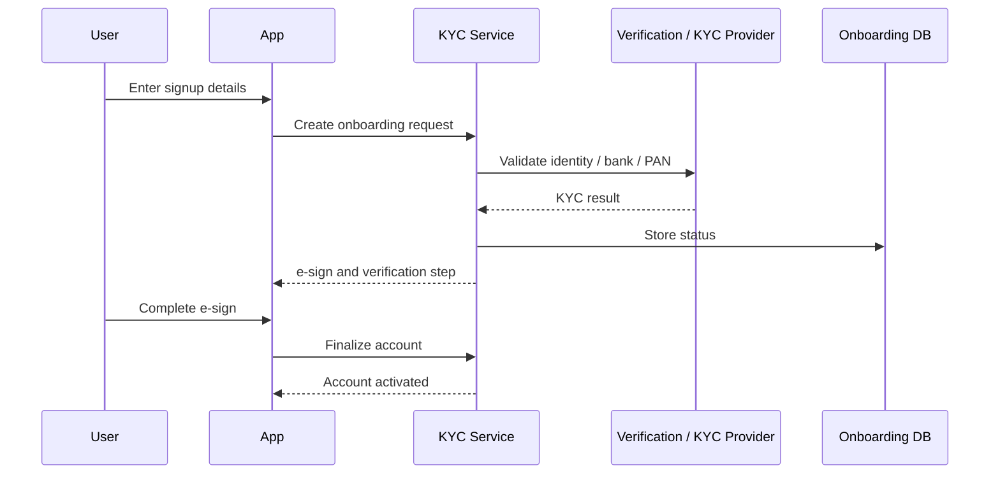

---

# 9. User and Identity Services

The user service stores:

* profile
* contact details
* login methods
* MFA configuration
* account status
* preferences
* language and notification settings

This service should be mostly read-heavy and heavily cached.

---

# 10. Product Surface: Kite, Console, Coin, APIs

The public Zerodha ecosystem shows how a brokerage platform often splits into multiple surfaces. Kite is the trading surface, Console is the reporting surface, Coin is the mutual-fund surface, and Kite Connect APIs expose integration capabilities.

A production brokerage should mirror that split:

| Surface          | Purpose                                        |
| ---------------- | ---------------------------------------------- |
| Trading Terminal | Order placement, watchlists, charts, positions |
| Back Office      | Tax reports, statements, analytics             |
| Mutual Funds     | Direct fund investing                          |
| API Platform     | Partner and developer integrations             |

This separation keeps each product focused and easier to scale.

---

# 11. Trading Terminal Requirements

A modern trading terminal should support the same style of features publicly shown by Kite:

* streaming market data
* advanced charting
* market depth
* GTT orders
* baskets
* alerts
* risk warnings
* IPO applications
* P&L visibility
* fast cross-device access

This affects the frontend and backend architecture because the terminal must support:

* real-time websockets
* fast quote caching
* watchlist sync
* order entry forms
* chart data APIs
* order modification workflows

---

# 12. Market Data Service

Market data is one of the heaviest read workloads in brokerage systems.

The system must stream:

* best bid / offer
* last traded price
* open/high/low/close
* market depth
* volume
* candles
* intraday ticks
* circuit limits
* trade status

Kite publicly advertises 20-level market depth, advanced charts, and streaming data, which is the kind of experience a real platform must support.

---

## Market Data Architecture

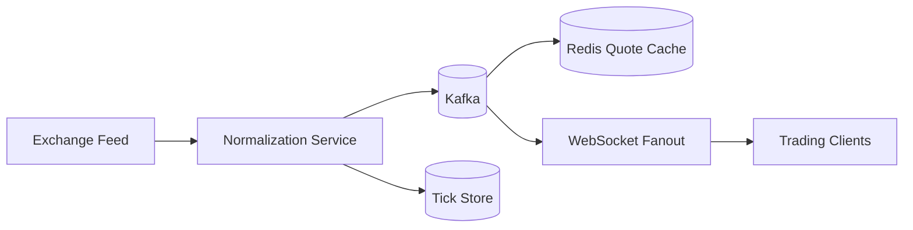

---

# 13. Why Market Data Needs a Separate Pipeline

Market data is not the same as order execution.

It should be separated because:

* market updates are high-volume and continuous
* order execution must remain safe and exact
* quotes need very low latency
* historical chart data must be stored efficiently
* clients may subscribe to thousands of instruments

A dedicated market-data pipeline protects the trading path from quote storms.

---

# 14. Instrument Master

The brokerage must maintain an instrument master.

This is the canonical registry of everything tradable:

* stocks
* indices
* futures
* options
* currencies
* commodities
* ETFs
* mutual funds
* bonds
* IPO symbols

Zerodha publicly markets support for these asset classes, so the platform should model the instrument universe in a normalized way rather than hard-coding equity-only logic.

---

# 15. Order Types and Order Entry

Order entry is where brokerage systems live or die.

Zerodha’s official support pages document market orders, limit orders, stop-loss orders, GTT, AMO, and OCO-style advanced exits. Market orders are more likely to fill but can execute at unfavorable prices, while limit orders provide price protection but do not guarantee execution. AMO helps queue orders outside market hours, and GTT/OCO helps users set trigger-based exits with target and stop-loss behavior.

---

## Supported Order Types

| Order Type | Purpose                                     |
| ---------- | ------------------------------------------- |
| Market     | Execute immediately at best available price |
| Limit      | Execute only at specified price             |
| Stop-Loss  | Protect against adverse movement            |
| SL-M       | Stop-loss with market execution             |
| GTT        | Trigger-based long-lived orders             |
| AMO        | After-market queued orders                  |
| OCO        | One Cancels Other target/stop-loss exits    |

---

# 16. Order Management System

The OMS is the nervous system of the brokerage.

It handles:

* accept order
* validate order
* assign internal order ID
* risk check
* route to exchange
* process exchange acknowledgments
* process partial fills
* process complete fills
* cancel/modify requests
* handle rejections
* emit order events

---

## OMS Responsibilities

| Responsibility   | Why it matters            |
| ---------------- | ------------------------- |
| Order validation | Prevent invalid orders    |
| Deduplication    | Avoid duplicate execution |
| Session rules    | Respect exchange timings  |
| Risk checks      | Prevent over-leverage     |
| Exchange routing | Send to correct venue     |
| State tracking   | Preserve full lifecycle   |
| Reconciliation   | Match with exchange fills |

---

## Order Lifecycle Diagram

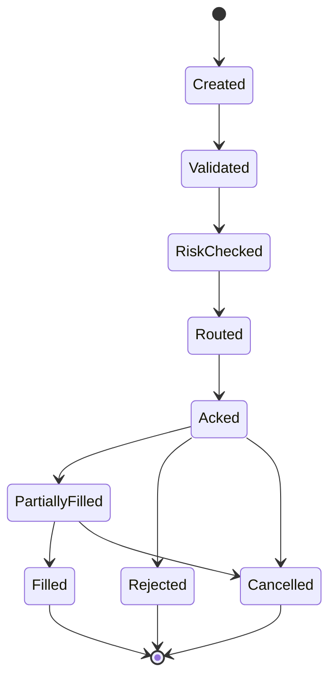

---

# 17. Order Placement Flow

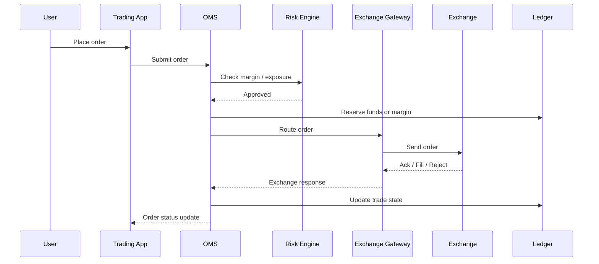

---

# 18. Risk Management System

The RMS must be extremely fast and conservative.

It should validate:

* available funds
* margin availability
* exposure limits
* instrument risk
* product type rules
* segment restrictions
* order size
* open position limits
* overnight risk
* concentration risk

If risk checks fail, the order should be rejected before exchange routing.

---

# 19. Why Risk Must Be Pre-Trade

In brokerage systems, it is much easier to reject a dangerous order before execution than to unwind a bad trade after execution.

That is why the risk engine sits in the critical path.

It must answer:

> Can this user place this order right now, in this market session, with these margins and limits?

---

# 20. Exchange Gateway

The exchange gateway connects the broker to external markets.

It must speak the exchange protocol and handle:

* order submission
* modification
* cancellation
* ack/reject responses
* fill messages
* market status updates
* heartbeat and session management

This component is usually tightly regulated, highly monitored, and extremely robust.

---

# 21. Market Session Manager

The market-session scheduler must understand exchange calendars and trading sessions.

NSE currently documents that the normal market runs from 09:15 to 15:30, with pre-open starting at 09:00 and trade modification ending at 16:15 for equity and equity derivatives.

This means the brokerage should have a session-aware scheduler that:

* opens and closes segments
* allows AMOs before market open
* queues modifications when required
* disables invalid actions after close
* handles holiday calendars and special sessions

---

# 22. Funds and Wallet Ledger

A brokerage system must never use ad hoc balance fields as the source of truth.

Instead, it should use a **double-entry ledger**.

This is essential for:

* cash balances
* margin allocations
* realized P&L
* charges
* withdrawals
* refunds
* corporate action adjustments
* settlements

The ledger should be append-only and auditable.

---

## Ledger Flow

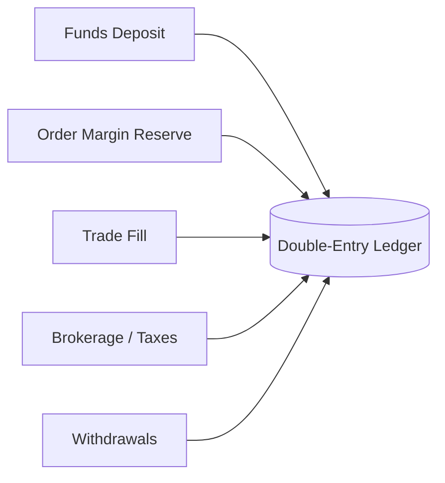

---

# 23. Why Double-Entry Ledger Matters

A brokerage platform manages money.

Money systems need:

* traceability
* reversibility by entry
* exact reconciliation
* audit history
* deterministic accounting

A ledger-based design makes it possible to reconstruct the entire account state from events.

---

# 24. Funds Service

The funds service handles:

* add funds
* withdraw funds
* settlement credits
* payout requests
* margin release
* blocked funds
* available balance
* collateral accounting

It should be strongly consistent for correctness.

---

# 25. Portfolio, Holdings, and Positions

These are three different concepts and should not be conflated.

| Concept   | Meaning                               |
| --------- | ------------------------------------- |
| Holdings  | Long-term owned securities in demat   |
| Positions | Trading book exposure for open trades |
| Portfolio | Combined account view and analytics   |

The portfolio service should derive views from trades, corporate actions, and settled holdings.

---

# 26. P&L and Analytics

Console-style reporting is a major back-office capability. Zerodha’s Console is publicly positioned as a central dashboard with reporting and analytics, and its product page notes that it computes accurate P&L using a large historical trade breakdown and corporate-action awareness. 

A brokerage platform should therefore generate:

* realized P&L
* unrealized P&L
* day P&L
* tax reports
* contract notes
* account statements
* holdings reports
* profit summaries
* broker charges breakdown

---

# 27. Corporate Actions

Corporate actions affect holdings and P&L.

Examples:

* splits
* bonuses
* dividends
* mergers
* demergers
* buybacks
* rights issues

These events must flow through portfolio and ledger systems so that account state remains correct.

---

# 28. Mutual Funds Module

A complete brokerage platform should not stop at equities.

Zerodha’s public product pages show direct mutual funds via Coin, with over 2000 direct mutual funds available. 

That means the system must support:

* mutual fund discovery
* SIP setup
* one-time purchase
* redemption
* folio tracking
* NAV updates
* mandate handling
* statement generation

---

# 29. IPO Module

Kite publicly supports applying for IPOs through UPI, which means the brokerage platform needs a primary-market module as well. 

This module should handle:

* IPO discovery
* subscription windows
* UPI mandate flows
* application status
* allotment status
* allotment reconciliation

---

# 30. Watchlists, Charts, and Alerts

A strong trading platform should support:

* custom watchlists
* multi-chart layout
* indicators
* alerts
* market depth
* portfolio-linked alerts
* trigger alerts for price levels and percentage moves

Zerodha’s Kite publicly advertises alerts, advanced charting, market depth, and cloud-based market alerts, so the backend must support low-latency subscriptions and event-driven triggers. 

---

# 31. Alerts Architecture

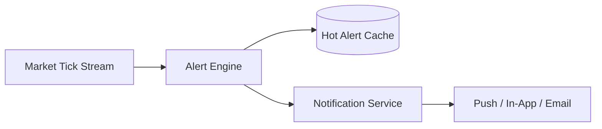

Alerts should be computed close to the streaming data path, not by polling giant historical tables.

---

# 32. Search Service

Zerodha publicly describes universal instrument search across tens of thousands of instruments and contracts. That implies the search service must index:

* symbols
* names
* exchange codes
* instrument metadata
* asset class
* expiry dates
* option strikes
* contract types
* mutual funds
* bonds

A search engine like Elasticsearch or OpenSearch is the right choice.

---

# 33. Trading UI and Session State

The trading app should keep session state light and client-side where possible, but sensitive state should remain server-side.

Good candidates for server-side state:

* order drafts
* margin previews
* watchlists
* alerts
* notification preferences
* risk flags
* open positions
* account status

Good candidates for client-side cache:

* chart preferences
* UI layout
* recent symbols
* last selected tab

---

# 34. Real-Time WebSocket Layer

Brokerage systems need push updates for:

* quote changes
* order status
* fill updates
* margin changes
* alerts
* position changes
* watchlist updates

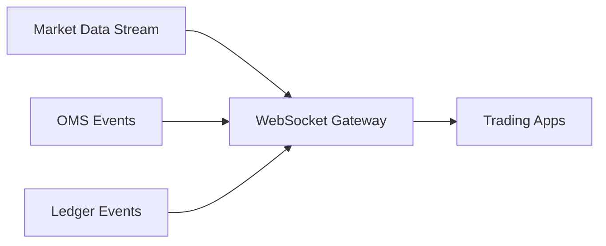

WebSockets reduce latency and avoid polling load.

---

# 35. Data Model

A brokerage platform needs multiple core entities.

---

## Main Entities

| Entity          | Purpose                |
| --------------- | ---------------------- |
| User            | Account holder         |
| KYCRecord       | Identity verification  |
| BankAccount     | Linked bank account    |
| Instrument      | Tradable symbol        |
| Order           | User intent to trade   |
| Trade           | Executed fill          |
| Position        | Open exposure          |
| Holding         | Demat ownership        |
| LedgerEntry     | Accounting record      |
| MarginLedger    | Margin tracking        |
| Watchlist       | Saved instruments      |
| Alert           | Trigger condition      |
| Report          | Back-office output     |
| MutualFundOrder | MF purchase/redemption |
| IPOApplication  | IPO subscription       |

---

## ER Diagram

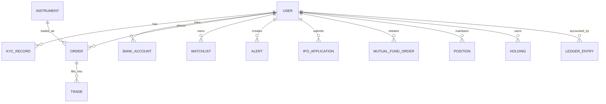

---

# 36. Database Strategy

No single database should handle everything.

| Data              | Recommended Store                                 |
| ----------------- | ------------------------------------------------- |
| User and KYC data | Relational DB                                     |
| Orders and trades | Strongly consistent relational or distributed SQL |
| Ledger            | Append-only relational ledger                     |
| Market data       | Time-series store / cache / stream store          |
| Search            | Search index                                      |
| Watchlists        | Redis + DB                                        |
| Alerts            | DB + queue                                        |
| Reports           | Object storage + warehouse                        |
| Tick history      | Columnar/time-series warehouse                    |

---

# 37. Why the Ledger Should Be Separate from Orders

Orders tell you what the user wanted.

Ledger tells you what money actually happened.

These are related but not the same.

A single order can:

* reserve margin
* partially fill
* fill completely
* incur taxes and charges
* release unused margin

Keeping ledger separate makes reconciliation much safer.

---

# 38. Order State and Reconciliation

An order moves through states such as:

* draft
* validated
* risk-approved
* sent to exchange
* accepted
* partially filled
* filled
* rejected
* cancelled
* expired

The reconciliation service matches:

* broker internal order records
* exchange response
* trade confirmations
* ledger entries
* user-visible positions

---

# 39. Order State Diagram

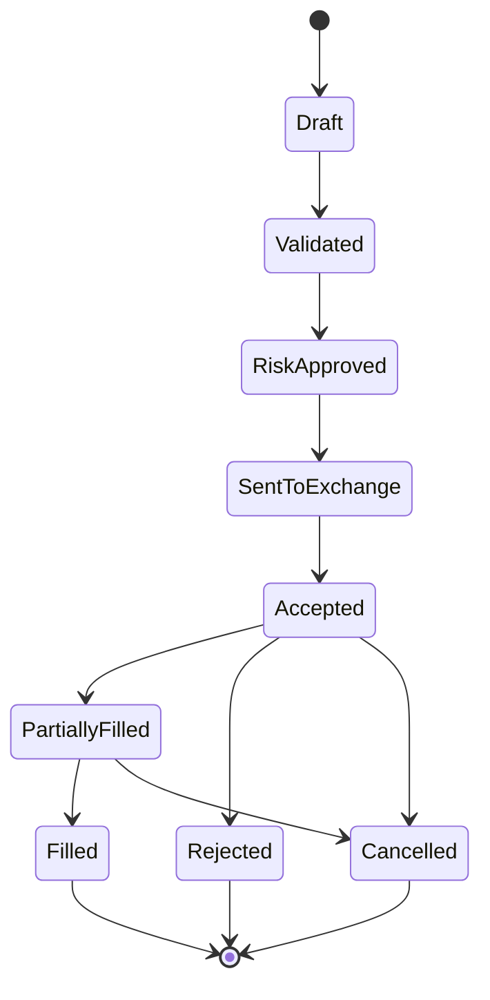

---

# 40. Caching Strategy

Caching is critical because read traffic is enormous.

Cache:

* user profiles
* instrument master
* watchlists
* open positions
* margin preview
* latest quotes
* market depth snapshots
* feed data
* reports metadata

Redis is a strong choice for hot state.

---

# 41. Risk of Caching Financial Data

Caching money data is dangerous if done carelessly.

Therefore:

* cache should be read-optimized
* source of truth must remain durable
* cache invalidation must follow order and ledger events
* balance changes should propagate through event streams

Never treat cache as the accounting source of truth.

---

# 42. Market Data Flow

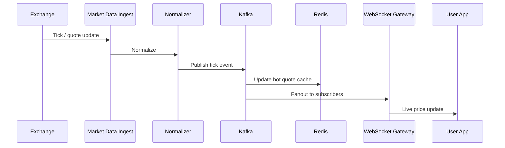

---

# 43. Why the Platform Needs an Event Bus

Kafka or a similar event bus helps with:

* order event propagation
* quote distribution
* margin recalculation
* notification fanout
* audit logging
* report generation
* analytics pipelines
* alerts
* reconciliation

A brokerage platform is extremely event-driven.

---

# 44. Security Architecture

Financial systems need stronger security than most consumer apps.

Use:

* MFA
* device fingerprinting
* encrypted sessions
* token-based auth
* least privilege access
* role-based admin access
* audit logs
* suspicious activity detection
* rate limiting
* IP/device anomaly alerts

---

# 45. Compliance and Auditability

A brokerage must keep a complete audit trail of:

* account creation
* KYC events
* login attempts
* order submissions
* risk checks
* exchange responses
* ledger movements
* withdrawals
* corporate actions
* report generation
* admin interventions

This is essential for investigations and regulatory compliance.

---

# 46. Notifications

The platform should notify users about:

* order executed
* order rejected
* margin shortfall
* price alert hit
* corporate action
* IPO allotment
* mutual fund status
* KYC completion
* password reset
* suspicious login

Notifications can be delivered through:

* push
* email
* SMS
* in-app alerts

---

# 47. Margin and Exposure Engine

The margin engine should compute:

* intraday margin
* delivery margin
* F&O margin
* commodity margin
* currency margin
* portfolio margin
* collateral margin

This service should be fast and conservative because it sits in the pre-trade path.

---

# 48. Reporting and Back Office

Console-like reporting should provide:

* trade history
* holdings statements
* contract notes
* realized and unrealized P&L
* tax reports
* charges breakdown
* account activity
* corporate actions
* reconciliation outputs

Zerodha’s Console is publicly described as the central back-office dashboard for reporting and analytics, which is exactly the kind of dedicated reporting layer a brokerage platform needs. 

---

# 49. Multi-Region Deployment

Trading platforms must survive regional failures.

Use:

* active-active read layer
* replicated metadata
* replicated event streams
* region-local cache
* geo routing
* failover for market data ingestion
* backup order routing lanes

The design should ensure that if one region fails, another can continue serving user reads and, where allowed, trading operations.

---

# 50. Disaster Recovery

Disaster recovery plan should include:

* multi-AZ deployment
* replicated databases
* offsite backups
* replayable event logs
* periodic DR drills
* failover playbooks
* reconciliation after failover

Because financial state matters, every recovery action must be auditable.

---

# 51. Observability

A brokerage platform must observe:

| Metric                 | Why                   |
| ---------------------- | --------------------- |
| Order latency          | Trading UX            |
| Rejection rate         | Risk/config issues    |
| Quote latency          | Market data freshness |
| Margin calc latency    | Risk performance      |
| Exchange ACK latency   | Routing health        |
| Ledger lag             | Money correctness     |
| Report generation time | Back office UX        |
| Alert delivery latency | User satisfaction     |

---

# 52. Performance Bottlenecks

Common bottlenecks include:

* market data fanout
* order burst spikes
* hot instrument subscriptions
* ledger contention
* search load
* reports generation
* portfolio recalculation

Mitigations:

* sharding
* async pipelines
* hot caches
* read replicas
* precomputed views
* rate limiting
* batching

---

# 53. Advanced Features Inspired by Real Brokerage Platforms

A modern platform can include advanced trading tools such as:

* multi-leg baskets
* GTT exit strategies
* OCO exits
* cloud alerts
* risk warnings
* chart studies
* market depth views
* IPO flows
* mutual fund investing
* tax and analytics dashboards

Those capabilities are directly aligned with Zerodha’s public product surface. 

---

# 54. Final Production Architecture

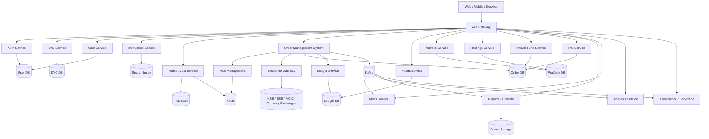

---

# 55. Tradeoffs

| Choice                     | Benefit                | Tradeoff                      |
| -------------------------- | ---------------------- | ----------------------------- |
| Strongly consistent ledger | Correct money state    | More complex writes           |
| Redis for quotes           | Ultra-fast reads       | Cache invalidation complexity |
| Kafka event backbone       | Scalable async system  | Operational overhead          |
| Separate OMS/RMS           | Safe order flow        | More services                 |
| Search index               | Fast instrument lookup | Eventual consistency          |
| Multi-region design        | Better resilience      | Higher cost and complexity    |

---

# 56. Key Takeaways

| Concept            | Summary                                                                                         |
| ------------------ | ----------------------------------------------------------------------------------------------- |
| Account opening    | Digital onboarding with e-sign and verification                                                 |
| Trading scope      | Stocks, F&O, commodities, currency, ETFs, mutual funds, bonds                                   |
| Trading terminal   | Kite-like app with streaming data, charts, depth, GTT, baskets, alerts, and APIs                |
| Back office        | Console-like analytics and reports                                                              |
| Mutual funds       | Direct mutual fund investing via a separate product surface                                     |
| Order types        | Market, limit, stop-loss, GTT, AMO, OCO                                                         |
| Market hours       | NSE normal market 09:15–15:30, with pre-open and modification windows                           |
| Core systems       | OMS, RMS, ledger, market data, portfolio, reports, alerts                                       |
| Critical principle | Money correctness before speed                                                                  |
| Scaling principle  | Separate reads, writes, and event streams                                                       |

---

# Conclusion

A complete stock brokerage platform like Zerodha is not just a trading app.

It is a regulated financial infrastructure system that must safely coordinate:

* onboarding
* identity verification
* funds
* risk
* exchange connectivity
* market data
* portfolio state
* reports
* analytics
* alerts
* compliance
* multi-asset trading

The right design uses:

* a **digital onboarding pipeline** for KYC and e-sign verification 
* a **real-time market data system** for streaming quotes, depth, and charts 
* a **strict OMS + RMS + exchange gateway** for order safety
* a **double-entry ledger** for money correctness
* a **portfolio/holdings layer** for positions and P&L
* a **Kafka-driven event backbone** for notifications, analytics, and downstream processing
* a **Redis cache layer** for hot market data and session reads
* a **search index** for fast instrument discovery
* a **reporting backend** for statements, tax reports, and analytics 
* **multi-region resilience** for availability

A brokerage platform succeeds only when it is:

* fast enough for traders
* correct enough for money
* secure enough for regulators
* scalable enough for market spikes
* observable enough for operations

That is what makes a Zerodha-like platform a true world-class system design problem.