A live sports streaming service looks simple from the outside.

A broadcaster sends a feed.
Millions of viewers open the app.
The match plays on phones, TVs, browsers, and set-top boxes across the world.

That is the user experience.

Behind it, the system is a very large real-time distributed media platform that must deal with:

* live video ingest from stadiums and production trucks
* transcoding into multiple qualities and codecs
* packaging into streamable formats
* adaptive playback across unpredictable networks
* low latency for live sports
* CDN fan-out at global scale
* DRM and rights enforcement
* geo-restrictions and blackout rules
* subtitles, audio tracks, overlays, and scoreboards
* analytics and quality-of-experience monitoring
* failure recovery across regions

This is not just video delivery.

It is a global, fault-tolerant, low-latency media pipeline.

---

# 1. Introduction

## Problem statement

Design a platform that can broadcast live sports to millions of viewers across devices and geographies with:

* stable playback
* adaptive quality
* low latency
* DRM and geo-restriction support
* graceful failover
* multi-device compatibility
* observability and anti-piracy controls

## Real-world scale

A large event can have:

* millions of concurrent viewers
* multiple commentary languages
* multiple camera angles
* event-specific overlays and score updates
* huge spikes during major moments
* regional rights and blackout restrictions
* audience distribution across mobile, web, TV, and set-top boxes

## Why this problem is hard

Live sports streaming is hard because it must solve several difficult things at once:

* real-time transport
* massive fan-out
* unpredictable client networks
* device fragmentation
* rights enforcement
* live latency constraints
* enormous bandwidth cost
* cross-region resilience

A small buffer stall during a goal, touchdown, wicket, or finish can be unacceptable.

If the stream lags too much, the viewer experience breaks.

If the platform fails during a marquee event, trust is lost immediately.

---

# 2. Functional Requirements

| Requirement          | Description                                       |
| -------------------- | ------------------------------------------------- |
| Live Ingest          | Receive feed from encoders and production systems |
| Transcoding          | Generate multiple renditions and codecs           |
| Packaging            | Produce HLS, DASH, CMAF-compatible outputs        |
| Adaptive Playback    | Choose bitrate based on client/network            |
| Low Latency          | Keep delay close to live                          |
| DRM                  | Prevent unauthorized playback                     |
| Geo Restriction      | Apply region and rights rules                     |
| Ads                  | Support pre-roll and server-side ad insertion     |
| Subtitles            | Support captions and multiple languages           |
| Overlays             | Scores, timers, player stats, graphics            |
| DVR                  | Rewind within live window                         |
| Failover             | Switch to backup paths automatically              |
| Analytics            | Track playback health and engagement              |
| Multi-device Support | Web, mobile, TV, console, set-top box             |
| Recording            | Archive live events for replay and highlights     |

---

# 3. Non-Functional Requirements

| Property          | Goal                                     |
| ----------------- | ---------------------------------------- |
| Low latency       | Keep live delay small                    |
| High availability | Survive failures without visible outage  |
| Scalability       | Handle millions of concurrent viewers    |
| Smooth playback   | Minimize buffering and stalling          |
| Cost efficiency   | Control CDN and transcoding costs        |
| Global reach      | Serve users near their region            |
| Security          | DRM, auth, anti-piracy                   |
| Observability     | Capture QoE and pipeline metrics         |
| Fault tolerance   | Degrade gracefully under partial failure |
| Compliance        | Respect rights and local restrictions    |

---

# 4. Capacity Estimation

Let us assume a marquee global sports event.

## Assumptions

* 5 million concurrent viewers
* average bitrate 3 Mbps
* multiple renditions per stream
* many audio and subtitle tracks
* regional rights and localized delivery

## Bandwidth

If every viewer averages 3 Mbps:

```text
5,000,000 × 3 Mbps = 15,000,000 Mbps = 15 Tbps
```

This is why CDN distribution is mandatory.

## Ingest

A master feed may ingest at:

* 10–50 Mbps
* plus redundant backup feeds

The ingest bandwidth is small compared to delivery, but ingest reliability is far more critical.

## Storage

Storage is used for:

* live archive recording
* segments and manifests
* thumbnails
* subtitles
* highlight clips
* analytics logs

A long event with multiple renditions can produce a large amount of temporary and retained data.

---

# 5. High-Level Architecture

A complete live sports platform has a control plane and a data plane.

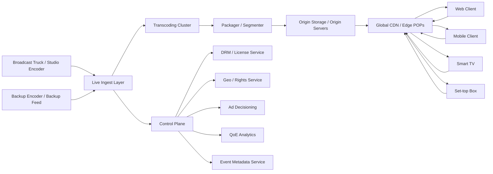

## Why this works

The system is split so that:

* the **media path** stays fast and scalable
* the **control plane** manages rights, metadata, and configuration
* failures in ads or analytics do not break playback
* the CDN absorbs the vast majority of viewer traffic

---

# 6. Core Media Pipeline

The media pipeline is the backbone of the entire service.

## Flow

1. live video is ingested from broadcaster hardware
2. the stream is encoded/transcoded into multiple renditions
3. renditions are packaged into streaming formats
4. media segments are written to origin
5. CDN pulls from origin and caches at edge
6. client players fetch manifests and segments
7. adaptive bitrate logic selects the appropriate quality

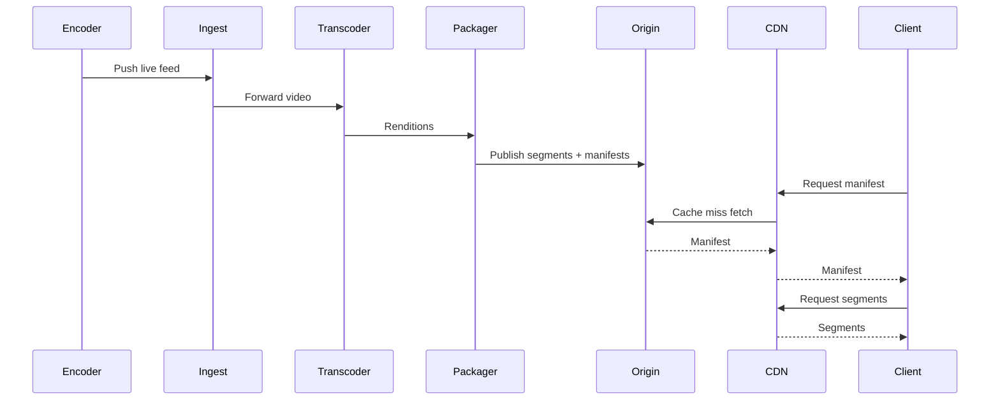

---

# 7. Ingest Architecture

The ingest layer accepts live feeds from:

* stadium encoders
* studio production systems
* remote broadcast trucks
* backup encoders
* alternate camera paths

## Ingest responsibilities

* authenticate source encoder
* verify stream health
* validate codec and bitrate
* maintain primary and backup paths
* detect packet loss and frame drops
* hand off cleanly to transcoders

## Why ingest redundancy matters

A single ingest path is a single point of failure.

For a live sports event, the ingest layer should support:

* primary feed
* backup feed
* health-based failover
* automatic reconnection
* operator override

If the primary encoder dies, the platform should switch quickly without forcing viewers to reconnect.

---

# 8. Transcoding and Rendition Ladder

The ingest stream is usually one master feed, but clients need many output qualities.

## Why transcoding is needed

A viewer on a weak mobile network cannot play 4K smoothly.
A viewer on fiber and a large TV can.

The transcoder creates multiple renditions:

* 240p
* 360p
* 480p
* 720p
* 1080p
* 4K where supported

### Rendition ladder design

| Rendition   | Use Case                      |
| ----------- | ----------------------------- |
| 240p / 360p | Low bandwidth / poor networks |
| 480p        | Mid-tier mobile               |
| 720p        | Common default                |
| 1080p       | High quality on most devices  |
| 4K          | Premium screens and bandwidth |

### Codec considerations

Some devices support different codecs:

* H.264 for broad compatibility
* H.265 / HEVC for efficiency
* AV1 for better compression on supported devices

A real platform often encodes multiple codec ladders depending on device capability and business tradeoffs.

---

# 9. Packaging and Segment Generation

The packager turns encoded video into streaming-compatible chunks and manifests.

## Responsibilities

* segment frames into chunks
* create media playlists
* synchronize audio and captions
* maintain live window state
* support bitrate switching
* generate HLS/DASH/CMAF outputs

## Segment duration tradeoff

Shorter segments reduce latency but increase overhead.
Longer segments reduce request rate but increase live delay.

Sports platforms often favor shorter segments because freshness matters.

---

# 10. HLS vs DASH vs CMAF Deep Dive

This is one of the most important architectural choices in a streaming platform.

## 10.1 HLS

HTTP Live Streaming is widely used and very compatible, especially across Apple devices and many web/mobile players.

### Strengths

* broad device support
* simple HTTP-based delivery
* works well with CDNs
* mature ecosystem
* easy fallback behavior

### Weaknesses

* traditionally higher latency than ultra-low-latency approaches
* segment-based playback can add delay
* some variants of low-latency support are more complex

### When to use HLS

* maximum compatibility
* broad consumer devices
* standard latency streaming
* fallback path for difficult clients

---

## 10.2 MPEG-DASH

DASH is another major adaptive streaming standard.

### Strengths

* flexible manifest structure
* good standardization
* widely used on many platforms
* strong ecosystem for adaptive bitrate delivery

### Weaknesses

* device support is less uniform than HLS in some ecosystems
* player behavior varies more across platforms
* operational complexity can rise with device fragmentation

### When to use DASH

* multi-platform playback
* standards-heavy environments
* non-Apple ecosystems
* large-scale adaptive bitrate delivery

---

## 10.3 CMAF

Common Media Application Format is a packaging format that helps unify HLS and DASH workflows and is especially important for low-latency delivery.

### Strengths

* shared media segments across protocols
* efficient packaging pipeline
* better path toward low-latency streaming
* operational simplification when supporting both HLS and DASH

### Weaknesses

* requires careful pipeline design
* low-latency modes add tuning complexity
* not every client/device handles it equally

### When to use CMAF

* low-latency live sports
* multi-protocol support
* modern streaming stacks
* shared encoding pipeline across playback ecosystems

---

## Practical protocol strategy

A production platform often uses:

* **HLS** for compatibility
* **DASH** for non-Apple and standards-heavy clients
* **CMAF** as the underlying segment format or low-latency packaging foundation

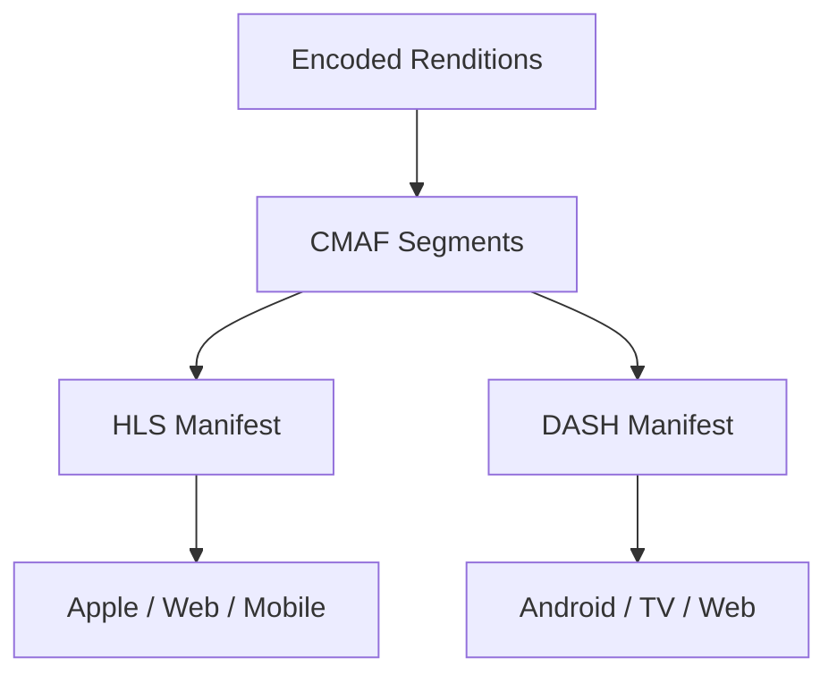

### Why this is practical

One encoding pipeline can serve multiple playback ecosystems instead of maintaining totally separate media pipelines.

---

# 11. Low-Latency Streaming Deep Dive

Sports viewers care about how close the stream is to the actual live event.

If the delay is too large, social media spoilers, commentary sync issues, and fan frustration become more noticeable.

## Sources of latency

Latency can come from:

* encoder buffering
* transcoding delay
* segment generation time
* origin fetch delay
* CDN propagation
* client buffering
* player prefetch strategy

## Techniques to reduce latency

### 1. Smaller segments

Short segments reduce delay but increase request overhead.

### 2. Chunked transfer

The client starts receiving part of a segment before the full chunk is complete.

### 3. Reduced player buffer

A smaller playback buffer lowers latency but reduces tolerance to network hiccups.

### 4. Faster packager/origin paths

Minimize time between segment creation and availability.

### 5. Origin shielding and edge optimization

Keep manifests and segments close to the user.

### 6. Low-latency protocol modes

Use CMAF low-latency features or protocol variants designed for reduced delay.

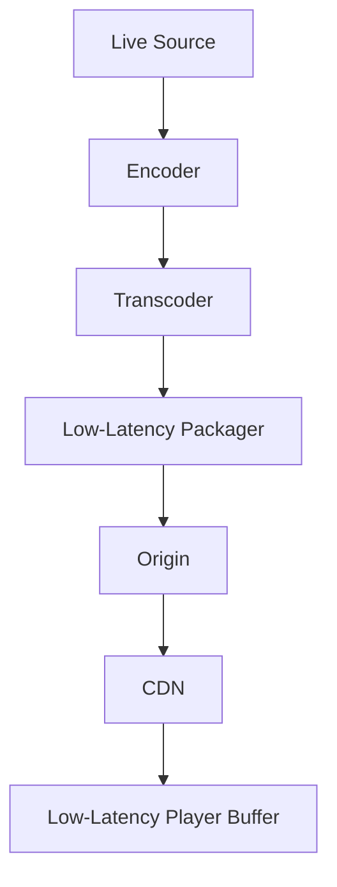

## Latency vs reliability tradeoff

Low latency is not free.

If the buffer is too small:

* network jitter causes rebuffering
* quality switches become more aggressive
* the stream becomes fragile

A good platform offers:

* standard latency mode for stability
* low-latency mode for premium live sports
* automatic fallback to safer latency if conditions degrade

---

# 12. CDN Design Deep Dive

The CDN is the largest scale multiplier in the system.

Without CDN, the origin would be destroyed by read traffic.

## CDN responsibilities

* cache manifests and segments
* terminate TLS close to the user
* absorb bursts in viewer traffic
* shield origin from request storms
* improve startup time
* reduce long-haul bandwidth costs

## CDN topology

A global CDN usually has:

* edge POPs close to viewers
* regional mid-tier caches
* origin shielding layers
* failover routes between regions

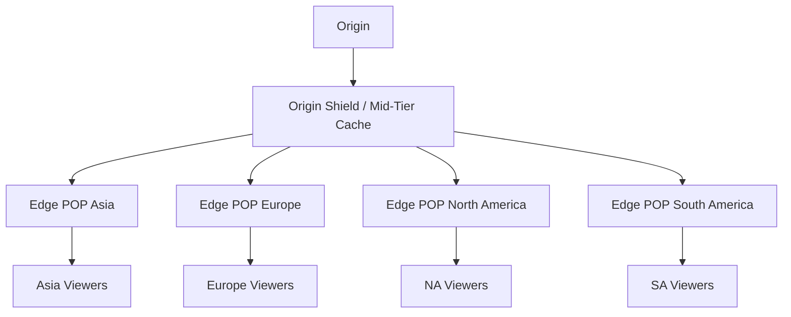

## Cache object strategy

The CDN should prioritize caching:

* manifests
* short media segments
* subtitles
* thumbnails
* public metadata

It should be careful with:

* DRM tokens
* rights-sensitive responses
* personalized content
* geo-specific content variants

## Hot event traffic

When a goal or decisive moment happens, traffic can spike instantly.

The CDN must be able to:

* keep edge caches warm
* prevent origin overload
* scale request routing fast
* absorb synchronized spikes from millions of clients

---

# 13. DRM Architectures Deep Dive

Sports rights are valuable. The platform must enforce access controls carefully.

## Goals of DRM

* prevent unauthorized playback
* protect premium subscriptions
* enforce regional rights
* limit restreaming and piracy
* tie content access to verified entitlement

## DRM architecture components

* entitlement service
* license server
* key management service
* content packaging with encrypted segments
* player-side license acquisition
* token validation and session control

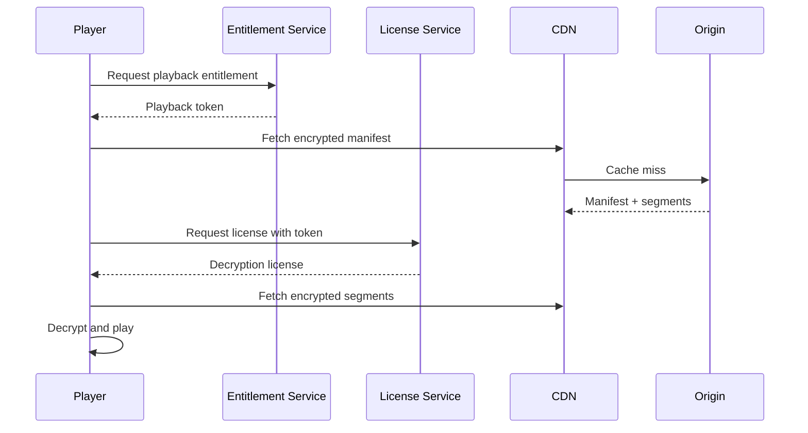

## Encryption model

Content is typically encrypted before it reaches the CDN.
The CDN can distribute encrypted chunks without being able to decrypt them.

That means:

* CDN is efficient for delivery
* DRM license service is the trusted gate
* the player decrypts locally using valid keys

## Why this matters

If plaintext video were distributed widely, piracy risk would be much higher.

---

# 14. Geo-Restriction and Rights Enforcement

Sports broadcasting rights are often sold by geography.

A match may be:

* available in one country
* blacked out in another
* restricted to premium tiers
* limited to specific devices or subscription packages

## Enforcement points

* at playback authorization
* at license issuance
* optionally at CDN token generation
* optionally at origin access control

This is a defense-in-depth design.

## Geo decision factors

* user IP region
* account region
* contract rights by market
* subscription tier
* local blackout windows
* event-specific rights

---

# 15. Multi-Audio, Subtitles, and Overlays

A live sports platform is often multilingual.

It may support:

* different commentators
* local language audio
* accessibility captions
* closed captions
* data overlays
* player stats
* scoreboards
* sponsor graphics

## How this is delivered

The packager must keep these tracks synchronized with video timing.

The client player should be able to switch:

* audio track
* subtitle track
* overlay mode
* alternate camera angle

This requires careful segment timing and metadata alignment.

---

# 16. Multi-Region Failover Deep Dive

A global sports platform cannot depend on one region.

## Goals

* survive a regional outage
* keep live event available
* preserve playback tokens and rights metadata
* route viewers to healthy regions
* maintain ingest continuity

## Architecture strategy

### Data plane

Media delivery should remain as local as possible, but fail over when necessary.

### Control plane

Rights, metadata, and configuration should be replicated and recoverable.

### Origin strategy

A backup origin region should be ready to serve if the primary region fails.

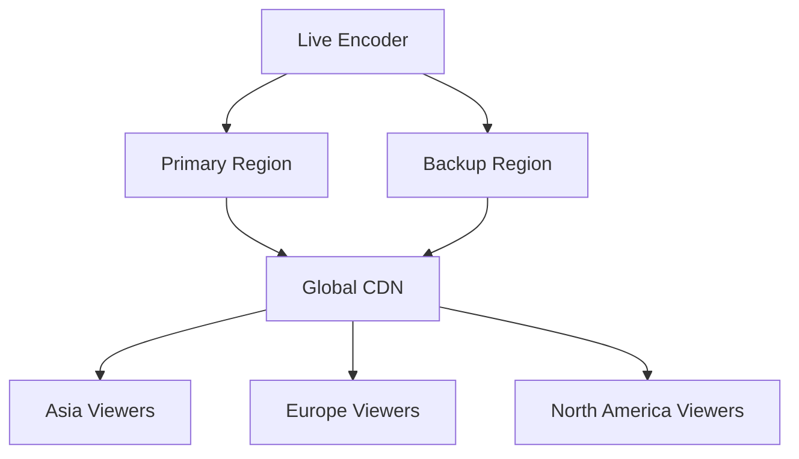

## Failover workflow

1. health monitors detect primary region degradation
2. control plane marks region unhealthy
3. DNS or global routing shifts viewers to alternate region
4. CDN edges fetch from backup origin
5. players continue with minimal interruption

## Tradeoff

Failover is easier for stateless delivery than for live session state.
That is why playback state should be minimized and made reconstructable.

---

# 17. Control Plane vs Data Plane

This separation is crucial.

## Control plane

Handles:

* event setup
* rights configuration
* DRM policy
* playback rules
* ad decisioning
* metadata publishing
* analytics config

## Data plane

Handles:

* ingest
* transcoding
* packaging
* CDN delivery
* player requests
* segment traffic

Keeping them separate lets the system:

* scale independently
* fail independently
* evolve separately

If the control plane has issues, the live stream should ideally keep playing.

---

# 18. Player Design

The player is the last mile of the system.

It must:

* fetch manifests
* choose renditions
* buffer strategically
* handle network changes
* support playback recovery
* report QoE metrics
* support DRM license acquisition
* support captions and alternative tracks

## ABR logic

The player continually estimates:

* throughput
* buffer depth
* latency to live edge
* decode performance

Then it decides:

* which bitrate to request
* when to switch up/down
* when to reduce latency
* when to rebuild buffer

---

# 19. Observability

A live streaming system must be heavily instrumented.

## Core metrics

| Metric                    | Why it matters              |
| ------------------------- | --------------------------- |
| Ingest success rate       | Confirms source feed health |
| Transcode latency         | Measures compute delay      |
| Manifest generation delay | Impacts freshness           |
| CDN cache hit ratio       | Cost and latency efficiency |
| Playback start time       | User experience             |
| Rebuffer rate             | Playback quality            |
| Live edge lag             | Latency to event            |
| DRM license failures      | Access problems             |
| Region failover time      | Resilience metric           |
| Segment fetch errors      | Delivery health             |

## Client QoE telemetry

Clients should report:

* startup time
* time to first frame
* average bitrate
* stalls
* live lag
* quality switches
* DRM errors

These measurements are critical for diagnosing real-world playback issues.

---

# 20. Failure Scenarios

## Primary ingest failure

Switch to backup ingest and notify operators.

## Transcoder crash

Restart worker, requeue job, or reroute stream to healthy encoder pool.

## CDN edge issue

Route traffic to adjacent POP or different CDN provider if supported.

## Origin outage

Serve from backup origin or failover region.

## DRM service outage

Allow graceful fallback or temporarily cached authorization if policy permits.

## Metadata service outage

Continue playback without overlays or live stats.

The highest priority is to keep the sports stream available even if non-essential features degrade.

---

# 21. Caching Strategy

Caching should be layered carefully.

## Good cache candidates

* manifests
* short segments
* subtitles
* public metadata
* DRM session metadata with TTL
* ad decision responses where safe

## Bad cache candidates

* expired tokens
* sensitive authorization responses without strict TTL
* personalized private content
* mutable rights decisions without proper invalidation

The CDN and edge caches should be tuned for freshness and burst tolerance.

---

# 22. Rate Limiting and Anti-Abuse

Sports streams attract abuse and piracy attempts.

## Threats

* hotlinking
* token replay
* credential sharing
* scraping metadata
* suspicious playback floods
* illegal redistribution

## Defenses

* signed playback URLs
* short-lived tokens
* device binding where appropriate
* session concurrency limits
* IP reputation scoring
* anomaly detection
* watermarking and forensic trace options

---

# 23. Cost Optimization

Streaming costs are dominated by bandwidth and compute.

## Major cost centers

* CDN egress
* transcoding compute
* storage for live archive
* telemetry ingestion
* redundant multi-region infrastructure

## Ways to reduce cost

* reduce unnecessary rendition count
* use efficient codecs where supported
* maximize CDN hit rates
* archive old segments to colder storage
* use low-latency mode only when required
* cache manifests aggressively
* regionalize delivery to reduce long-haul traffic

---

# 24. Data Flows

## Main media flow

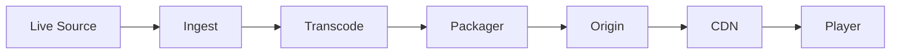

## Metadata flow

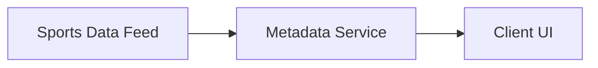

## Analytics flow

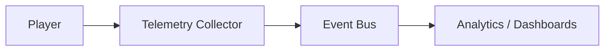

---

# 25. Final Architecture Diagram

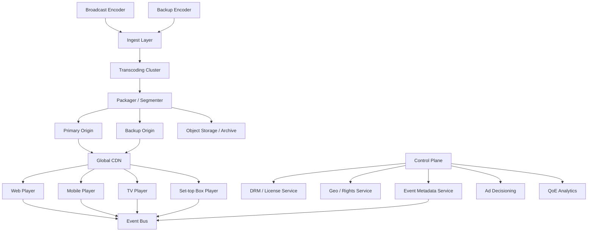

---

# 26. Conclusion

A global live sports streaming service is one of the most challenging consumer distributed systems to design.

It must deliver:

* reliable ingest
* adaptive playback
* low latency
* massive global fan-out
* rights enforcement
* DRM protection
* device compatibility
* observability
* cost control
* multi-region resilience

The deep design choices that matter most are:

* **HLS for compatibility**
* **DASH for standards and broad ecosystem support**
* **CMAF as a shared packaging foundation**
* **low-latency modes with carefully tuned buffering**
* **CDN-first delivery with origin shielding**
* **DRM-based encrypted delivery and license control**
* **multi-region failover with backup ingest and backup origin**
* **separation of control plane and data plane**
* **rich telemetry for QoE and troubleshooting**

A successful sports streaming platform does not merely send video.

It preserves live experience under extreme global load, on diverse devices, over unstable networks, while defending rights and keeping latency low.

That is what makes it a true internet-scale media system.
