An online payment system looks simple when you see the user flow.

A customer enters card details.
The payment succeeds.
The merchant gets paid.

That is the visible layer.

Underneath, a real payment platform is much more complex.

It must handle:

* card payments
* UPI / bank transfers / wallets / net banking
* authorization and capture
* refunds and partial refunds
* payouts to merchants
* chargebacks and disputes
* fraud detection
* tokenization and PCI compliance
* ledgering and accounting
* reconciliation with banks and payment networks
* retries and idempotency
* multi-region reliability
* webhook delivery
* settlement and reporting

This is not just a transaction API.

It is a financial distributed system.

The main challenge is that payments must be:

* **correct**
* **auditable**
* **secure**
* **idempotent**
* **highly available**
* **fast enough for checkout**
* **reconcilable with external processors**

A payment system can tolerate slightly delayed analytics, but it cannot tolerate double charging a customer or losing a financial event.

---

# 1. Introduction

## Problem statement

Design an online payment system that allows:

* customers to pay merchants
* merchants to accept and manage payments
* the platform to authorize, capture, refund, and settle funds
* the system to detect fraud and respond to failures
* the platform to maintain accurate financial records

## Real-world scale

A modern payment platform may process:

* millions of users
* hundreds of thousands of merchants
* thousands to tens of thousands of transactions per second
* millions of ledger entries per hour
* large spikes during sales, holidays, and event-driven campaigns

## Why the problem is difficult

Payments are difficult because they combine several hard properties at once:

* **external dependencies** such as banks, card networks, wallets, and acquirers
* **strong correctness requirements**
* **legal and compliance constraints**
* **financial consistency and auditability**
* **fraud and abuse resistance**
* **low-latency checkout UX**
* **partial failures and retries**
* **asynchronous settlement and reconciliation**

A payment can be “successful” from one system’s perspective but still fail downstream.
A payment can also be retried multiple times due to timeouts and still only be charged once.

That is why payment design must be built around **idempotency, state machines, and a double-entry ledger**.

---

# 2. Functional Requirements

The system should support:

| Requirement            | Description                                    |
| ---------------------- | ---------------------------------------------- |
| Customer Payments      | Accept payments from users                     |
| Merchant Payments      | Let merchants receive money                    |
| Authorization          | Reserve funds before capture                   |
| Capture                | Finalize the charge                            |
| Void / Cancel          | Cancel uncaptured authorizations               |
| Refunds                | Full and partial refunds                       |
| Payouts                | Transfer funds to merchants                    |
| Webhooks               | Notify merchants of payment events             |
| Payment Methods        | Cards, bank transfers, wallets, UPI, etc.      |
| Ledgering              | Maintain accurate financial records            |
| Disputes / Chargebacks | Handle card disputes                           |
| Fraud Detection        | Risk scoring and blocking                      |
| Reconciliation         | Match internal records with external providers |
| Reporting              | Transaction and settlement reports             |
| Multi-currency         | Support FX and currency conversion             |
| Subscription Billing   | Recurring payments and invoicing               |
| Retry Handling         | Safe retries for transient failures            |

---

# 3. Non-Functional Requirements

| Property          | Goal                                                 |
| ----------------- | ---------------------------------------------------- |
| Correctness       | Never lose or duplicate financial events             |
| Idempotency       | Repeated requests should not cause duplicate charges |
| Low latency       | Checkout should feel fast                            |
| High availability | Core payment path must be resilient                  |
| Durability        | Every financial action must be persisted             |
| Security          | Protect cardholder and banking data                  |
| Compliance        | PCI DSS and related controls                         |
| Auditability      | Every movement of money should be traceable          |
| Scalability       | Handle large traffic spikes                          |
| Observability     | Metrics, logs, traces, audit trails                  |
| Disaster recovery | Restore service after region failure                 |

---

# 4. Capacity Estimation

Let us assume a large payment platform.

## Assumptions

* 20 million registered customers
* 1 million merchants
* 5 million daily active users
* 100,000 peak payment initiation requests/sec
* 50,000 authorization/capture status events/sec
* 10,000 refunds/sec during major campaigns
* 100,000 webhook deliveries/sec across merchants
* 1 billion ledger rows/year scale over time

## QPS

### Checkout initiation

Peak: 100k requests/sec

### Payment state updates

Peak: 50k events/sec from acquirers, PSPs, webhook callbacks, and internal workflows

### Merchant webhooks

Peak: 100k deliveries/sec, often bursty and retry-heavy

## Storage

A single financial event record may require 300–1000 bytes depending on metadata, indexes, and audit fields.

For 1 billion events:

* raw data can easily exceed hundreds of GB
* with replicas, indexes, and archives, operational storage may reach multiple TBs

## Bandwidth

If each payment event is ~1 KB and there are 50k events/sec:

* 50 MB/sec inbound/outbound just for event processing

Add logs, webhooks, and reporting and bandwidth pressure becomes significant.

## Read/write ratio

Payment systems are write-heavy on the financial core, but read-heavy on dashboards and merchant portals.

Common traffic split:

* checkout and writes: 30–50%
* reads for status, history, dashboards: 50–70%

The hardest part is not aggregate throughput.
It is the requirement that the system must remain correct under retries and partial failures.

---

# 5. High-Level Architecture

A complete payment platform is usually split into multiple services.

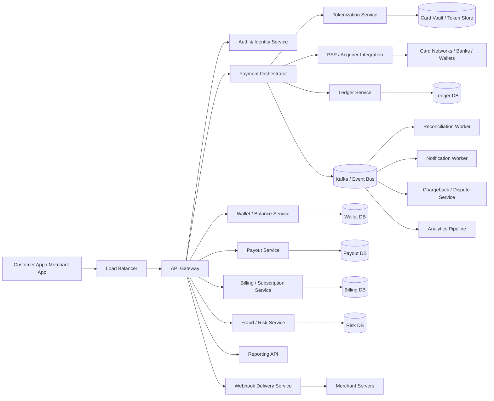

## Why this architecture works

* The **API gateway** handles auth, throttling, and routing.
* The **payment orchestrator** controls the payment state machine.
* The **tokenization service** protects sensitive card data.
* The **PSP/acquirer integration layer** talks to external networks.
* The **ledger service** stores financial truth.
* The **event bus** decouples the core payment flow from side effects.
* The **fraud service** can block suspicious transactions before money moves.
* The **reconciliation pipeline** ensures internal and external records match.

---

# 6. Core Payment Lifecycle

A payment often passes through several states.

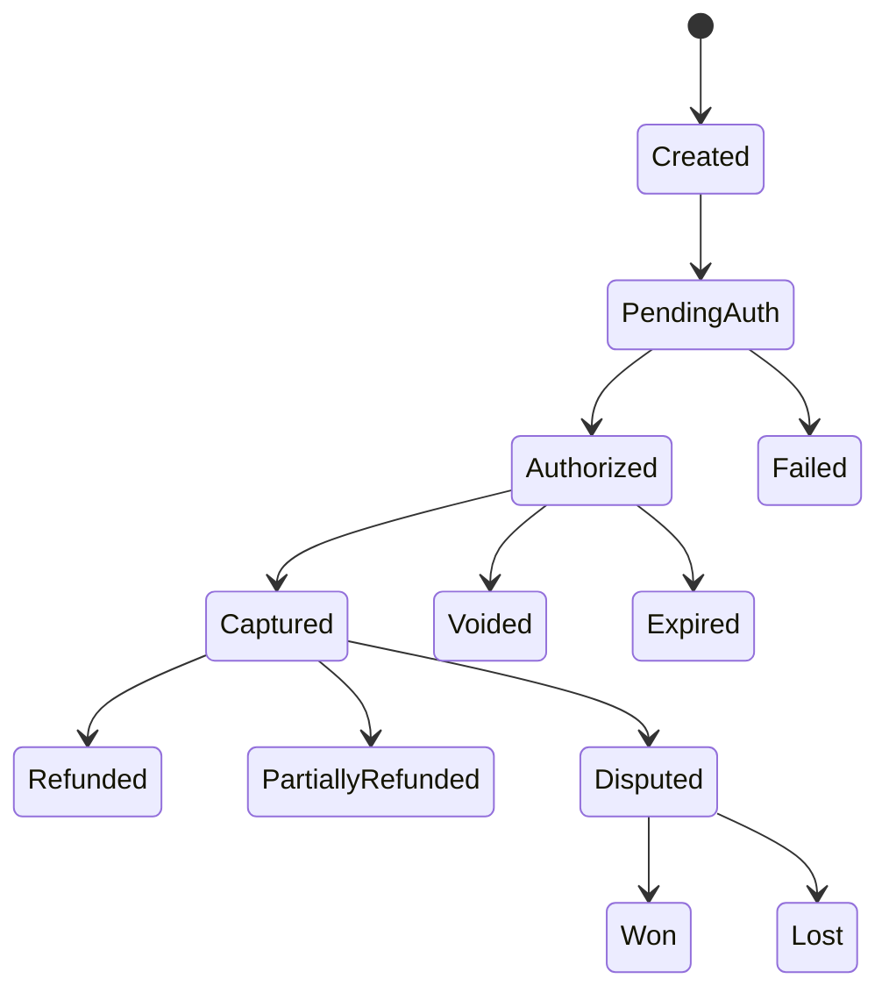

## What each state means

| State             | Meaning                               |
| ----------------- | ------------------------------------- |
| Created           | Payment request received              |
| PendingAuth       | Waiting for external authorization    |
| Authorized        | Funds reserved by issuer              |
| Captured          | Money successfully taken              |
| Voided            | Authorization canceled before capture |
| Refunded          | Money returned fully                  |
| PartiallyRefunded | Some amount returned                  |
| Disputed          | Chargeback opened                     |
| Expired           | Authorization window elapsed          |
| Failed            | Payment failed                        |

This state machine is important because payment logic must be explicit.
Ambiguous states create accounting disasters.

---

# 7. API Design

## 7.1 Create payment intent

`POST /v1/payment_intents`

A payment intent represents a desired payment before final authorization/capture.

### Request

```json
{
  "merchant_id": "m123",
  "customer_id": "c456",
  "amount": 2599,
  "currency": "USD",
  "payment_method": {
    "type": "card",
    "token": "tok_abc123"
  },
  "capture_method": "automatic",
  "idempotency_key": "order-789"
}
```

### Response

```json
{
  "payment_intent_id": "pi_001",
  "status": "requires_confirmation",
  "amount": 2599,
  "currency": "USD"
}
```

---

## 7.2 Confirm payment

`POST /v1/payment_intents/{id}/confirm`

### Response

```json
{
  "payment_intent_id": "pi_001",
  "status": "authorized",
  "authorization_id": "auth_123"
}
```

If auto-capture is enabled, the same endpoint may eventually move the payment to `captured`.

---

## 7.3 Capture payment

`POST /v1/payments/{payment_id}/capture`

### Request

```json
{
  "amount": 2599,
  "idempotency_key": "capture-001"
}
```

### Response

```json
{
  "payment_id": "pay_001",
  "status": "captured"
}
```

---

## 7.4 Refund payment

`POST /v1/payments/{payment_id}/refunds`

### Request

```json
{
  "amount": 1000,
  "reason": "customer_return",
  "idempotency_key": "refund-001"
}
```

### Response

```json
{
  "refund_id": "ref_001",
  "status": "succeeded"
}
```

---

## 7.5 Get payment status

`GET /v1/payments/{payment_id}`

### Response

```json
{
  "payment_id": "pay_001",
  "status": "captured",
  "amount": 2599,
  "currency": "USD",
  "merchant_id": "m123",
  "created_at": "2026-05-10T15:00:00Z"
}
```

---

## 7.6 Webhook callback

Merchants receive events such as:

* payment authorized
* payment captured
* refund succeeded
* payout failed
* dispute opened

Webhook payload example:

```json
{
  "event_id": "evt_900",
  "type": "payment.captured",
  "payment_id": "pay_001",
  "occurred_at": "2026-05-10T15:01:20Z"
}
```

---

# 8. Database Design

A payment system cannot rely on a single “payments” table alone.

It needs separate stores for:

* payment state
* ledger entries
* customer profiles
* merchant accounts
* tokenized payment methods
* payout records
* webhook delivery logs
* risk decisions
* dispute records
* reconciliation results

---

## 8.1 Payment table

This table tracks the state machine.

| Column          | Type      | Notes                          |
| --------------- | --------- | ------------------------------ |
| payment_id      | string    | Primary identifier             |
| merchant_id     | string    | Merchant reference             |
| customer_id     | string    | Customer reference             |
| amount          | bigint    | Minor units                    |
| currency        | string    | USD, INR, etc.                 |
| status          | string    | created/auth/captured/refunded |
| capture_method  | string    | automatic/manual               |
| idempotency_key | string    | Prevent duplicates             |
| provider_ref    | string    | External acquirer reference    |
| created_at      | timestamp | Creation time                  |
| updated_at      | timestamp | Last state update              |

---

## 8.2 Ledger tables

The ledger is the heart of the system.

A correct payment system should use **double-entry accounting**.

Every money movement must have at least two entries:

* one debit
* one credit

### Ledger entry

| Column         | Type      | Notes                 |
| -------------- | --------- | --------------------- |
| entry_id       | string    | Unique row            |
| transaction_id | string    | Financial transaction |
| account_id     | string    | Ledger account        |
| direction      | string    | debit / credit        |
| amount         | bigint    | Minor units           |
| currency       | string    | Currency              |
| created_at     | timestamp | Posting time          |

### Ledger transaction

| Column         | Type      | Notes                          |
| -------------- | --------- | ------------------------------ |
| transaction_id | string    | Correlates entries             |
| type           | string    | auth/capture/refund/payout/fee |
| reference_id   | string    | payment/refund/payout id       |
| status         | string    | pending/posted/reversed        |
| created_at     | timestamp | Timestamp                      |

### Why double-entry matters

Because it makes the books self-balancing.
If the sum of debits and credits does not match, the system knows something is wrong.

This is essential for audits, reconciliation, and recovery.

---

## 8.3 Wallet / balance table

For merchant balances and stored-value wallets:

| Column            | Type   | Notes                       |
| ----------------- | ------ | --------------------------- |
| wallet_id         | string | Merchant or customer wallet |
| available_balance | bigint | Spendable funds             |
| pending_balance   | bigint | Held funds                  |
| currency          | string | Currency                    |
| version           | bigint | Concurrency control         |

---

## 8.4 Token store

Sensitive card details must not be stored in plain form.

Store:

* tokenized card references
* vault references
* card fingerprint
* last4
* expiry month/year
* billing address reference

Sensitive raw PAN data should only exist in a secure PCI-scoped vault, if at all.

---

# 9. Deep Dive into Components

## 9.1 Load balancer

The load balancer receives all client requests and distributes them across healthy instances.

It must handle:

* HTTPS termination
* retry-safe routing
* health checks
* traffic spikes during checkout events
* geographic routing if multi-region

Payment traffic is latency-sensitive, so the load balancer should be highly optimized and redundant.

---

## 9.2 API Gateway

The gateway is responsible for:

* authentication
* authorization
* request validation
* rate limiting
* IP reputation checks
* API versioning
* routing to internal services

This is the first line of defense for the payment platform.

---

## 9.3 Payment Orchestrator

This is the most important service in the system.

Its job is to coordinate the payment lifecycle:

1. receive request
2. validate merchant and customer
3. run risk checks
4. create a payment intent
5. call payment provider / processor
6. persist state transition
7. publish events
8. trigger webhooks and downstream actions

### Why it must exist

Without orchestration, payment logic spreads across many services and becomes impossible to reason about.

The orchestrator keeps the state machine explicit and consistent.

### It should be stateless

It should not keep important business state in memory.
State should live in the database and event log.

---

## 9.4 Tokenization service

This service replaces sensitive payment details with non-sensitive tokens.

Example:

* raw card data is submitted once to the PCI-scoped edge
* the tokenization service returns `tok_abc123`
* the rest of the platform uses only the token

### Why tokenization matters

It reduces PCI exposure across the system and limits the number of services that ever touch sensitive data.

---

## 9.5 PSP / Acquirer integration layer

This layer communicates with:

* card networks
* acquiring banks
* wallet providers
* UPI/bank rails
* third-party processors

It should normalize each provider into a common interface.

### Why separate it

Because each external provider has:

* different request formats
* different failure codes
* different timeouts
* different settlement behavior

If provider-specific logic leaks into the rest of the system, maintenance becomes painful.

---

## 9.6 Ledger service

The ledger service records every financial movement.

This is not a cache.
This is the truth layer.

It should support:

* posting transactions
* reversal entries
* pending holds
* release of holds
* fee accounting
* settlement accounting
* merchant balance calculation

### Why the ledger is critical

The payment state table tells you what happened operationally.
The ledger tells you what happened financially.

Those are related, but not the same.

---

## 9.7 Risk / fraud service

Fraud detection should happen early, but not always synchronously for every request.

It may use:

* velocity checks
* device fingerprinting
* IP reputation
* customer history
* transaction amount anomalies
* merchant reputation
* ML scoring

### Fraud flow

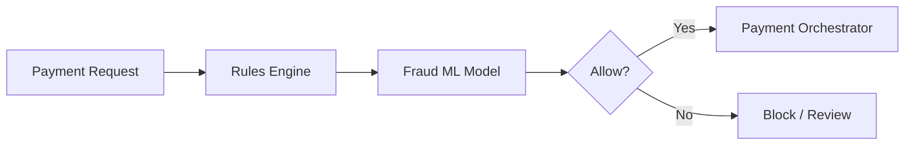

### Why this matters

Fraud prevention reduces loss, chargebacks, and abuse.
But it must not create too much friction for legitimate users.

---

## 9.8 Webhook delivery service

Merchants need to know when state changes happen.

The webhook service:

* stores outgoing events
* signs payloads
* retries failed deliveries
* tracks delivery state
* prevents duplicate deliveries as much as possible

### Important

Webhook delivery is eventually consistent.
Do not make checkout wait on webhook success.

---

## 9.9 Reconciliation worker

External processors and banks are the source of truth for settlement completion.

The reconciliation worker compares:

* internal payment records
* acquirer statements
* bank settlement files
* payout reports

It identifies:

* missing events
* duplicate records
* amount mismatches
* failed settlements
* delayed settlements

This is essential because financial systems must reconcile daily, often intraday.

---

# 10. Payment Flow

## 10.1 Card payment flow

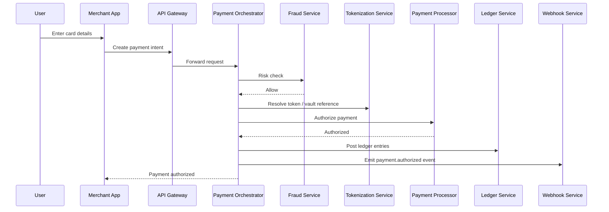

If automatic capture is enabled:

* orchestrator calls capture after authorization
* ledger posts capture entries
* webhooks announce `payment.captured`

---

## 10.2 Capture flow

Authorization reserves the funds.
Capture actually takes them.

This separation is important for:

* hotels
* e-commerce
* preorders
* ride-hailing
* variable final amounts

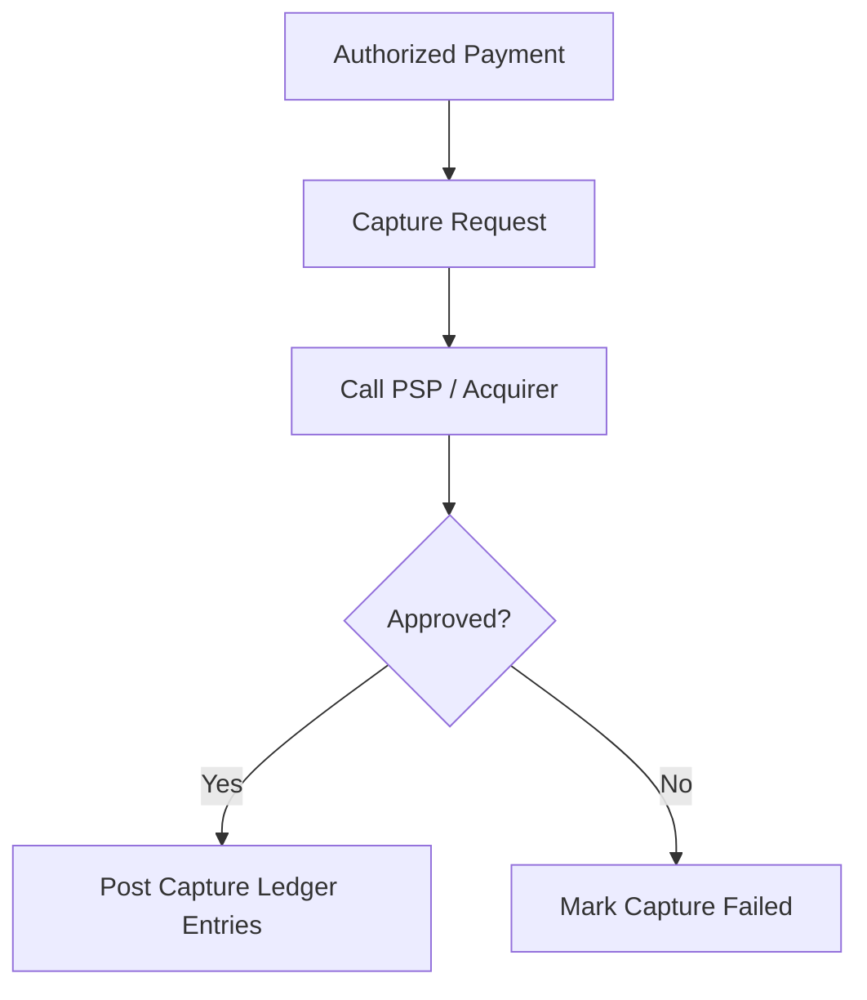

---

## 10.3 Refund flow

Refunds are not the same as capture reversal.

If a payment has already been captured, the system needs to create a new financial transaction that credits the customer and debits the merchant or settlement accounts accordingly.

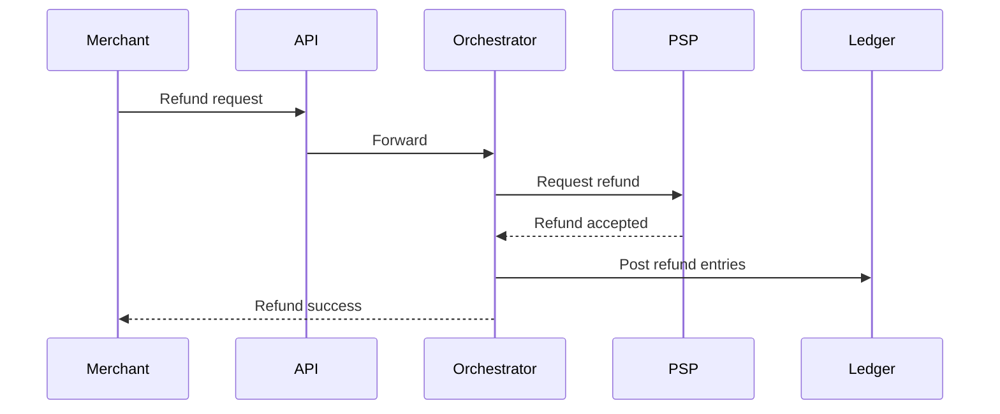

Partial refunds should be supported carefully and tracked per original payment.

---

# 11. Idempotency

Payment systems absolutely need idempotency.

If a client retries the same request because of:

* timeout
* connection drop
* 500 error
* mobile network instability

the system must not create a second charge.

## How to implement it

Every write endpoint should accept an **idempotency key**.

The server stores:

* request fingerprint
* key
* outcome
* timestamps
* linked payment/resource ID

If the same key is reused, the server returns the original result instead of creating a duplicate financial event.

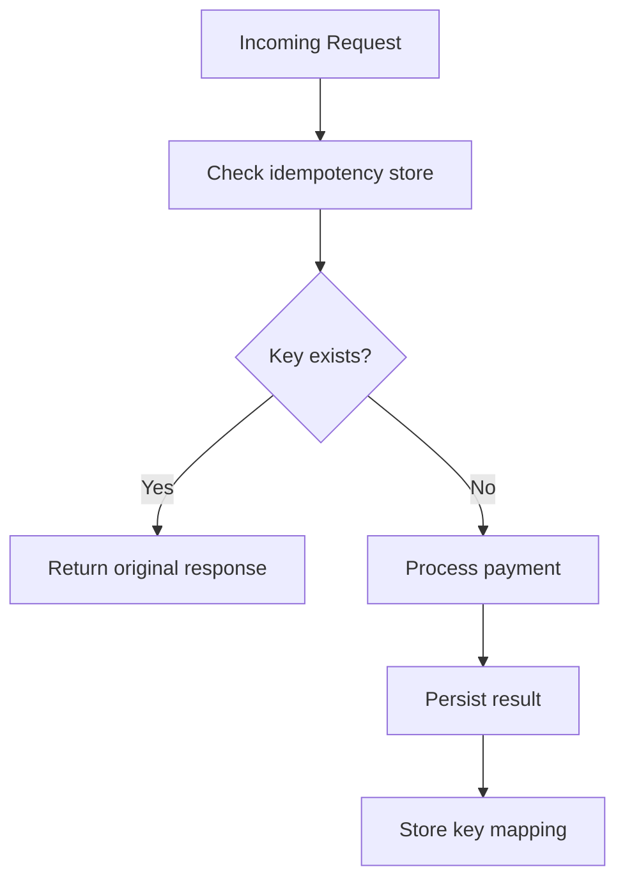

### Why this is non-negotiable

Without idempotency, retries can cause duplicate charges, duplicate refunds, duplicate payouts, and broken accounting.

---

# 12. Consistency Model

Different parts of the system need different consistency guarantees.

| Component           | Consistency Need                    |
| ------------------- | ----------------------------------- |
| Ledger              | Strong / transactional              |
| Payment state       | Strong enough for state transitions |
| Webhooks            | Eventual                            |
| Analytics           | Eventual                            |
| Fraud scoring       | Near real-time, often eventual      |
| Merchant dashboards | Eventual with recent caching        |
| Reconciliation      | Strong on batch consistency         |

## Why strong consistency is important for the ledger

Because double-entry accounting must remain balanced.
If the ledger is inconsistent, the money cannot be trusted.

## Why eventual consistency is acceptable elsewhere

Notifications, analytics, and dashboards can lag slightly without harming the financial truth.

---

# 13. Retry Strategy

Retries are necessary, but dangerous.

## Safe retries

Use retries for:

* network timeouts
* transient 5xx errors
* temporary provider failures

## Unsafe retries

Never blindly retry:

* non-idempotent operations
* partially completed downstream actions without idempotency keys
* operations whose side effects are uncertain unless the state machine is designed for it

### Best practice

Use:

* exponential backoff
* jitter
* circuit breakers
* deduplication keys
* replay-safe event handling

---

# 14. Ledger and Double-Entry Accounting

This is one of the most important sections.

A payment system must use accounting that can always explain where money moved.

## Example: customer pays $25.99

Possible entries:

* Debit customer payment clearing account
* Credit merchant pending balance
* Debit merchant fee expense account
* Credit platform revenue account

This is more than bookkeeping.
It is the basis of financial correctness.

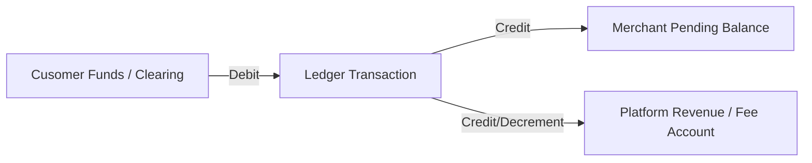

### Why this matters

If something fails later, the ledger can reverse or compensate the transaction cleanly.

---

# 15. Merchant Balance and Payouts

Merchants usually do not receive every payment instantly in their bank account.

They accumulate funds in a merchant balance and are paid out later.

## Payout flow

1. customer payment is captured
2. merchant pending balance increases
3. funds become available after risk and settlement rules
4. payout job computes eligible balance
5. funds are sent to the merchant’s bank account

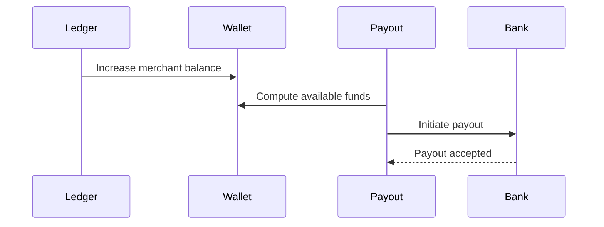

### Payout complexity

Payouts have:

* cutoffs
* settlement delays
* bank holidays
* retries
* reversals
* compliance checks

This is why payouts often run as a separate workflow.

---

# 16. Chargebacks and Disputes

Card payments can be disputed by customers.

The system needs:

* dispute intake
* evidence collection
* deadline tracking
* dispute state machine
* accounting for provisional holds and reversals

## Dispute flow

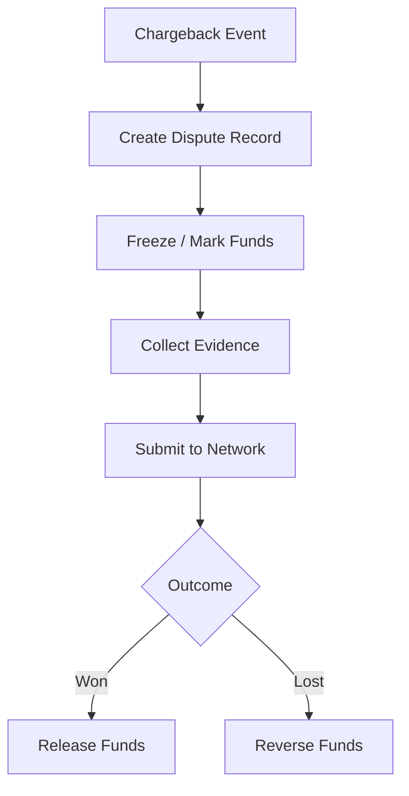

Dispute handling is not optional in card systems.
It is part of the financial reality of the network.

---

# 17. Security Architecture

Payment systems are one of the most security-sensitive systems in software.

## Security requirements

| Area            | Protection                                     |
| --------------- | ---------------------------------------------- |
| Authentication  | OAuth2, JWT, mTLS for internal services        |
| Authorization   | Merchant ownership checks, role-based access   |
| Data at rest    | Encryption for DB, logs, archives              |
| Data in transit | TLS everywhere                                 |
| Card data       | PCI-scoped vault + tokenization                |
| Secrets         | Dedicated secrets manager                      |
| Access control  | Least privilege, service accounts              |
| Audit logs      | Immutable access records                       |
| Fraud abuse     | Velocity limits, reputation, anomaly detection |

## PCI and sensitive data

The platform should keep raw card data out of most systems.

Only the smallest possible PCI-scoped surface should touch sensitive payment information.

That means:

* tokenize early
* isolate vault services
* restrict network access
* monitor every privileged action

---

# 18. Compliance and Auditability

A payments platform must be auditable.

You need:

* immutable event logs
* ledger history
* state transition logs
* access logs
* reconciliation reports
* support for compliance reviews

Auditors should be able to reconstruct:

* who initiated a payment
* what external provider was called
* what the result was
* what ledger entries were posted
* when the settlement happened
* whether a dispute occurred

That audit trail is a core requirement, not an optional add-on.

---

# 19. Observability

A payment platform must be heavily observable.

## Metrics to track

| Metric                       | Why it matters             |
| ---------------------------- | -------------------------- |
| Auth success rate            | Provider health            |
| Capture latency              | Checkout UX                |
| Refund latency               | Customer experience        |
| PSP error rate               | External dependency health |
| Idempotency hits             | Retry behavior             |
| Ledger posting lag           | Financial correctness      |
| Webhook failure rate         | Merchant reliability       |
| Reconciliation mismatch rate | Accounting integrity       |
| Chargeback rate              | Risk and fraud             |

## Logging and tracing

Every request should include:

* request_id
* idempotency_key
* payment_id
* merchant_id
* provider reference
* trace ID

This makes debugging and forensic analysis possible.

---

# 20. Multi-Region Architecture

Payments need availability, but financial writes also need care.

## Recommended approach

* active-active for stateless API and read-heavy components
* strongly controlled write ownership for ledger and state transitions
* regional isolation with replication
* failover procedures tested regularly

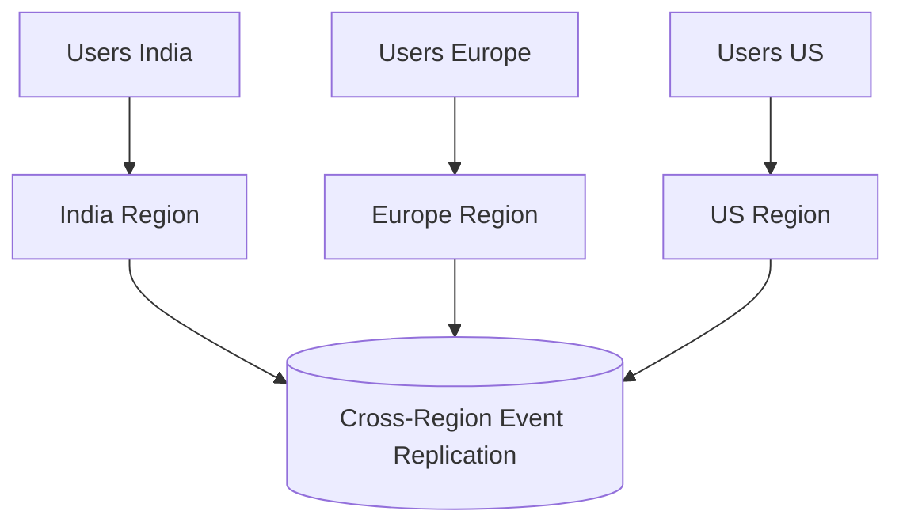

### Tradeoff

A globally writable financial ledger is much harder than a multi-region read system.

A common production strategy is:

* local region handles the write
* the ledger is replicated asynchronously
* the platform has a clear active owner per merchant or per transaction domain

This reduces split-brain risk.

---

# 21. Replication and Partitioning

## Partitioning

Common keys:

* merchant_id
* customer_id
* payment_id
* ledger_account_id

### Why partition carefully

You want:

* locality for merchant data
* easy lookups
* reduced hot partitions
* predictable scaling

## Replication

Replicate:

* payment state
* ledger data
* webhook logs
* configuration data
* audit logs

Some data can be asynchronously replicated.
Ledger safety requires more care than analytics data.

---

# 22. Caching Strategy

Caching in payment systems must be conservative.

## Good cache candidates

* merchant profile
* configuration
* payment method metadata
* fraud feature lookups
* dashboard summaries
* exchange rates

## Bad cache candidates

* authoritative ledger balances
* final payment state
* settlement truth

### Why

A stale cache can misreport money.
That is unacceptable if the cache becomes the source of truth by mistake.

Use cache-aside carefully for non-critical reads, but never replace the ledger with a cache.

---

# 23. Kafka / Queues / Stream Processing

Kafka is useful for:

* payment events
* webhook delivery workflows
* fraud pipelines
* reconciliation jobs
* payout scheduling
* reporting
* analytics

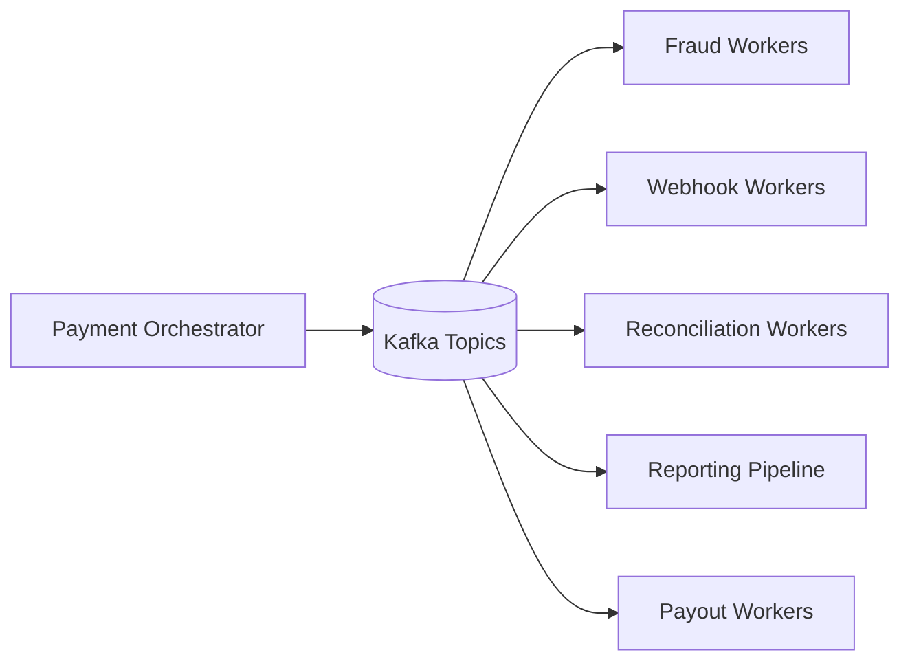

## Why event-driven architecture works here

Because many payment side effects are not part of the customer’s synchronous checkout path.

The core payment should finish quickly, while:

* notifications
* audit exports
* analytics
* merchant notifications
* reporting
* reconciliation

can be done asynchronously.

---

# 24. Webhooks and Merchant Integrations

Merchants rely on webhooks to react to payment state changes.

## Requirements

* signed payloads
* retries
* deduplication on merchant side
* delivery logs
* endpoint health tracking

### Delivery problem

Merchants may be down, slow, or misconfigured.
The platform must queue and retry webhook deliveries safely.

---

# 25. Failure Modes and Recovery

Payment systems must assume that things go wrong all the time.

## Common failures

* PSP timeout
* acquirer 5xx
* network partitions
* retry storms
* duplicate requests
* DB failover
* webhook endpoint outage
* region outage

## Recovery mechanisms

* replay from event log
* idempotent processing
* circuit breakers
* dead letter queues
* rollback/reversal transactions
* operator reconciliation tools

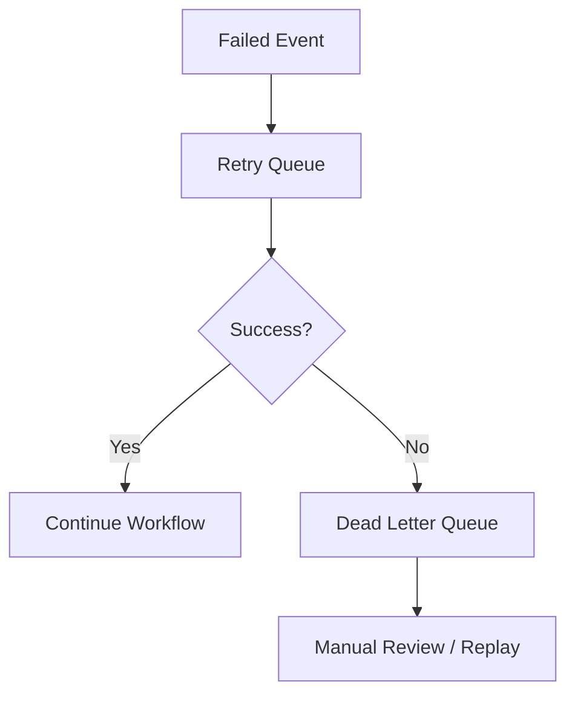

---

# 26. Bottlenecks and Solutions

| Bottleneck             | Cause                             | Solution                                 |
| ---------------------- | --------------------------------- | ---------------------------------------- |
| PSP latency            | External provider slowness        | Async orchestration + fallbacks          |
| Ledger contention      | Too many writes to same partition | Better partitioning + batching           |
| Webhook storms         | Merchant retry bursts             | Queue-based delivery                     |
| Fraud scoring delays   | Heavy ML pipelines                | Fast rules engine first, ML later        |
| Reconciliation backlog | Large daily batches               | Stream processing + incremental matching |
| Retry amplification    | Poorly controlled retries         | Idempotency + backoff + circuit breakers |

---

# 27. Advanced Optimizations

## 27.1 Split payment domains

Separate:

* card payments
* wallet payments
* bank transfer payments
* payouts
* refunds
* disputes

This keeps each workflow manageable and allows specialized scaling.

---

## 27.2 Pre-authorization caching

For some payment methods, you can cache lightweight authorization metadata, but not final truth.

---

## 27.3 Batch ledger posting

Batching can improve throughput, but only if it preserves transaction correctness and auditability.

---

## 27.4 Sharded idempotency store

Idempotency keys must scale too.
Use partitioning based on merchant or payment intent.

---

## 27.5 Regional ownership

Assign a “home region” for each merchant or payment domain to avoid split-brain writes.

---

# 28. Disaster Recovery

Payments need clear DR planning.

## DR goals

* defined RPO and RTO
* database backups
* log retention
* replay capability
* tested failover
* manual operator tools

## What must be restorable

* payment records
* ledger
* refund history
* webhook history
* merchant balances
* payout state
* audit logs

A recovery plan should prove that the platform can reconstruct financial truth from durable logs and replicas.

---

# 29. Final Architecture Diagram

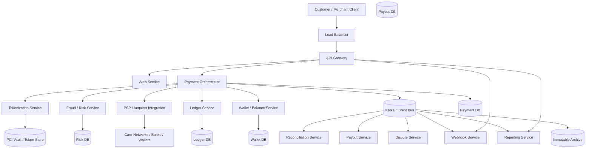

---

# 30. Conclusion

A complete online payment system is one of the most demanding distributed systems you can design.

It must combine:

* low latency
* strict correctness
* strong security
* careful consistency
* failure recovery
* compliance
* auditability
* external system integration
* multi-region reliability

The core architectural principles are:

* **Use a state machine for payment lifecycle**
* **Use idempotency everywhere**
* **Use double-entry ledgering for financial truth**
* **Use event-driven processing for side effects**
* **Keep sensitive data isolated and tokenized**
* **Assume retries and failures will happen**
* **Separate the fast checkout path from slower workflows**
* **Design for reconciliation from the start**

That is what turns a payment API into a real-world payment platform.
