Ride-hailing and delivery platforms live or die by one capability:

> knowing where the driver, rider, or delivery partner is right now, and doing it at scale.

That sounds simple.

But in production, real-time location tracking is one of the hardest parts of the system because it must handle:

* frequent GPS updates
* poor network conditions
* battery constraints on mobile devices
* millions of simultaneous moving devices
* ETA computation
* dispatch and matching
* geofencing
* map matching
* driver lifecycle tracking
* low-latency UI updates
* fallback behavior when GPS is weak
* real-time state consistency
* regional traffic and scale
* fraud detection and spoofed location signals

This is the core backend capability behind:

* Uber driver tracking
* Grab cab and rider live tracking
* Zomato delivery partner tracking
* food courier movement
* pilot or field-agent tracking
* fleet management systems
* logistics dispatch systems

The system is not just “send latitude and longitude.”

The system must answer:

* Where is the driver right now?
* How fresh is that location?
* Is the driver on the route?
* How far from pickup?
* What is the ETA?
* Should the customer see the current state?
* Is the device spoofing its location?
* Which nearby drivers are eligible for dispatch?
* Which geofence does this device belong to?
* What is the best update rate to use?

A real-time tracking platform is therefore a **streaming location intelligence system**.

---

# 1. Problem Statement

Design a real-time tracking system where riders, dispatchers, or customers can see the live location of:

* drivers
* delivery partners
* pilots
* fleet vehicles
* service agents
* couriers

The platform should support:

* live location updates
* near real-time map visualization
* accurate ETA
* driver movement history
* geofence detection
* route deviation alerts
* dispatch integration
* offline buffering
* map matching
* fraud/spoof detection
* multi-region scale

---

# 2. Functional Requirements

| Requirement        | Description                            |
| ------------------ | -------------------------------------- |
| Live Tracking      | Show current location of moving entity |
| Frequent Updates   | Receive location every few seconds     |
| ETA Calculation    | Estimate arrival time dynamically      |
| Geofencing         | Detect entry/exit of zones             |
| Dispatch Support   | Help match nearest available driver    |
| Movement History   | Store location trail                   |
| Map Matching       | Snap raw GPS to roads/routes           |
| Live UI Updates    | Push location updates to consumers     |
| Battery Efficiency | Avoid draining mobile devices too fast |
| Spoof Detection    | Detect fake GPS locations              |
| Offline Handling   | Buffer updates if network is poor      |
| Multi-Region Scale | Track millions of moving devices       |

---

# 3. Non-Functional Requirements

| Requirement        | Target                                  |
| ------------------ | --------------------------------------- |
| Latency            | Sub-second or near real-time            |
| Availability       | 99.99%                                  |
| Scalability        | Millions of active tracked entities     |
| Accuracy           | Good enough for street-level visibility |
| Durability         | Preserve event history                  |
| Fault Tolerance    | Survive packet loss and reconnects      |
| Security           | Secure transport and auth               |
| Battery Efficiency | Mobile apps must conserve power         |
| Observability      | Debugging and replay support            |
| Cost Efficiency    | Minimize unnecessary update processing  |

---

# 4. Why This Is a Hard Problem

A simple tracking toy system might just store the latest location.

A real system must do much more.

It must handle:

* thousands of updates per second per city during peak hours
* varying GPS quality
* route snapping
* delayed packets
* duplicate updates
* outdated coordinates
* device offline/reconnect cycles
* delivery state transitions
* map rendering for thousands of users
* matching logic for supply and demand

The most important challenge is that **location is a high-frequency time-series signal**.

That means:

* lots of writes
* lots of reads
* lots of derived state
* lots of freshness concerns

---

# 5. High-Level Architecture

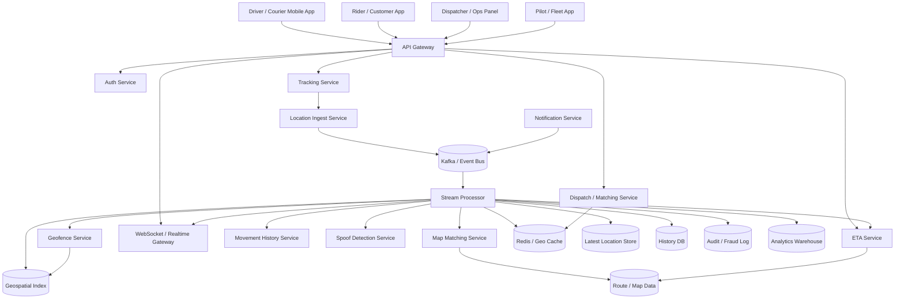

---

# 6. Core Design Philosophy

A production tracking system must separate:

| Concern                 | Best Layer                |
| ----------------------- | ------------------------- |
| Latest current location | Redis / hot store         |
| Historical trail        | Time-series / history DB  |
| Event stream            | Kafka                     |
| Geofence checks         | Stream processor          |
| ETA computation         | Routing + traffic service |
| UI updates              | WebSocket gateway         |
| Fraud detection         | Rules + stream analytics  |
| Route snapping          | Map matching service      |

The golden rule is:

> Store the latest state fast, and store the history durably.

---

# 7. Update Frequency and Battery Strategy

A location tracking system cannot blindly request GPS every second forever.

That would destroy:

* battery life
* mobile data
* backend capacity

The right update frequency depends on context:

| Context                   | Update Frequency              |
| ------------------------- | ----------------------------- |
| Driver on active trip     | Every 1–3 seconds             |
| Idle driver               | Every 10–30 seconds           |
| Delivery partner on route | Every 2–5 seconds             |
| Pilot/fleet tracking      | Depends on movement speed     |
| Stopped vehicle           | Event-driven or low-frequency |

The client should adapt based on:

* speed
* app state
* battery level
* trip status
* network quality

---

# 8. GPS Ingestion Flow

The mobile app captures location periodically and sends it to the backend.

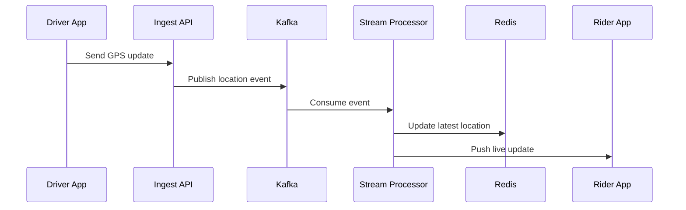

---

# 9. Location Event Schema

A robust location event should carry more than lat/lon.

| Field         | Purpose                          |
| ------------- | -------------------------------- |
| entity_id     | Driver / rider / agent / vehicle |
| trip_id       | Trip context                     |
| timestamp     | Event time                       |
| latitude      | GPS latitude                     |
| longitude     | GPS longitude                    |
| accuracy      | GPS accuracy radius              |
| speed         | Movement speed                   |
| heading       | Direction                        |
| altitude      | Optional for special use cases   |
| battery_level | Battery context                  |
| source        | GPS / network / fused            |
| device_id     | Device identity                  |
| sequence_no   | Deduplication and ordering       |
| odometer      | Optional distance signal         |

---

# 10. Why Accuracy Matters

Raw GPS data is noisy.

A point may be:

* off by 5 meters
* off by 50 meters
* distorted by buildings
* stale due to network delay

So the backend should not always trust the raw coordinate as the final truth.

Instead:

* validate it
* smooth it
* map match it
* compare it against route history
* estimate if it is plausible

---

# 11. Latest Location Store

The system needs a very fast way to answer:

> Where is driver D right now?

This is a hot read.

A relational DB is too slow for this use case.

Use:

* Redis
* in-memory cache
* geospatial index
* hot replicated store

---

## Latest Location Model

| Field      | Purpose                  |
| ---------- | ------------------------ |
| entity_id  | Unique tracked object    |
| latitude   | Current lat              |
| longitude  | Current lon              |
| updated_at | Last update time         |
| speed      | Current speed            |
| heading    | Direction                |
| accuracy   | GPS confidence           |
| trip_id    | Active trip              |
| status     | idle / on_trip / offline |
| zone_id    | Optional geofence        |
| version    | For ordering             |

---

# 12. Redis as Hot State

Redis is ideal for the latest location because it is:

* fast
* in-memory
* easy to update
* easy to query by key

Example:

```text id="redis_loc_01"
driver:123 -> {lat, lon, updated_at, speed, heading}
```

For geo queries:

* nearest drivers
* pickup radius checks
* driver clustering

use geospatial indexes or geohash-based partitioning.

---

# 13. Geospatial Indexing

The system should support queries like:

* find nearby drivers within 3 km
* find couriers inside a delivery zone
* find all pilots in a holding area
* find vehicles inside a geofence

This requires geospatial indexing.

Common approaches:

* geohash
* H3
* S2
* R-tree
* quadtree

A common practical choice is:

* geohash for bucketing
* Redis GEO commands or equivalent
* secondary spatial filtering for precision

---

## Nearby Search Diagram

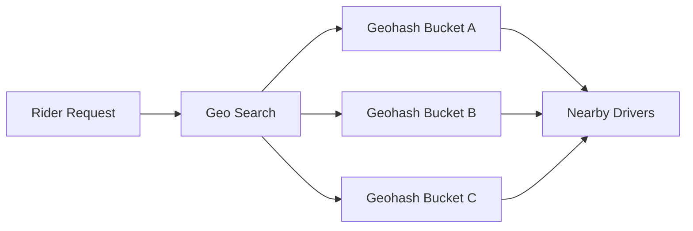

---

# 14. Dispatch and Matching

The tracking system is often linked to dispatch.

A rider requests a ride or a customer places an order.

The system then:

* finds nearby eligible drivers
* scores them based on proximity, availability, acceptance rate, ETA, vehicle type
* dispatches to the best candidate

---

## Matching Flow

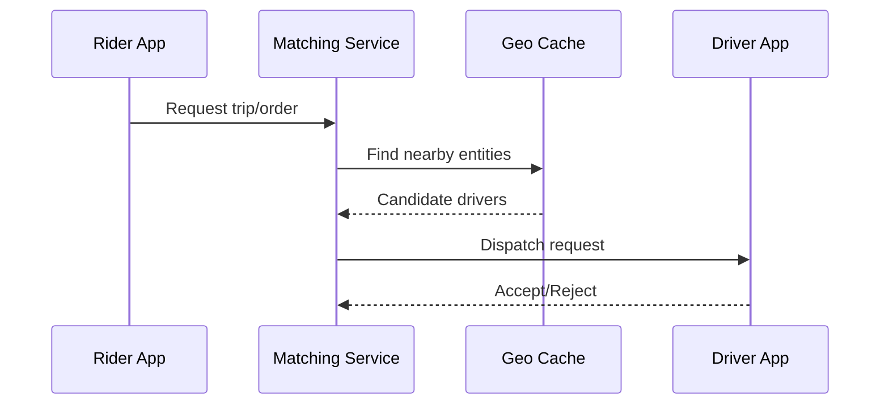

---

# 15. ETA Computation

ETA is not just distance divided by speed.

Real ETA should consider:

* traffic
* road geometry
* turn delays
* current route
* pick-up behavior
* signalized intersections
* historical city speed patterns
* driver behavior

---

## ETA Inputs

| Input               | Why It Matters          |
| ------------------- | ----------------------- |
| Current location    | Baseline distance       |
| Route polyline      | Actual road path        |
| Traffic speed       | Realistic travel time   |
| Road type           | Highway vs local road   |
| Pickup stop time    | Human interaction delay |
| Historical patterns | Time-of-day correction  |

---

# 16. ETA Pipeline

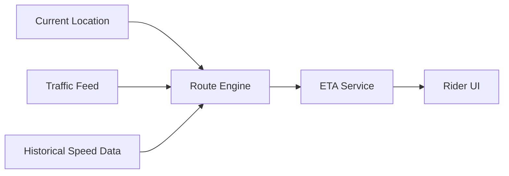

---

# 17. Map Matching

GPS points often do not lie exactly on roads.

Map matching takes raw GPS and snaps it to the most likely road segment.

This improves:

* UI accuracy
* route visualization
* ETA calculation
* fraud detection
* trip replay

---

## Map Matching Flow

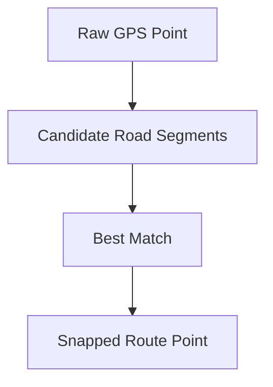

A good map matching service uses:

* road network graph
* heading
* historical trajectory
* speed plausibility
* confidence scoring

---

# 18. Geofencing

Geofences are important for:

* airport pickup zones
* delivery service areas
* warehouses
* no-parking zones
* trip completion zones
* fleet depots
* city boundaries

The system must detect:

* enter fence
* exit fence
* stay inside fence
* dwell time inside fence

---

## Geofence Flow

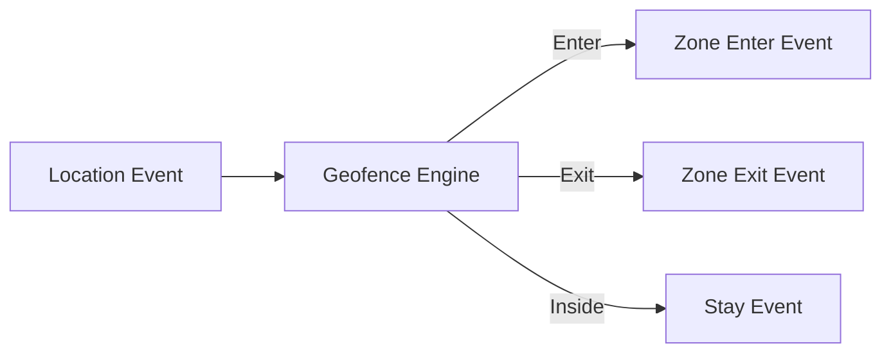

---

# 19. Real-Time Update Delivery

The customer or dispatcher must see live movement.

Polling is inefficient.

Use WebSockets or server-sent events.

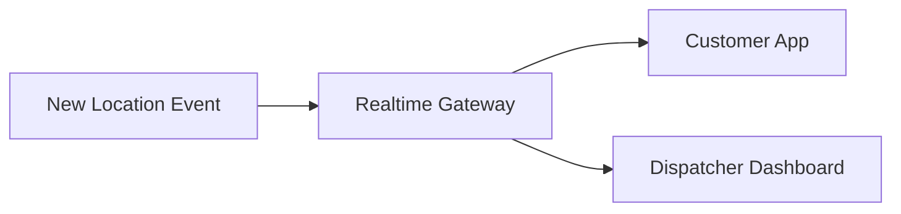

The live UI should update smoothly without overloading the backend.

---

# 20. Why WebSockets Are Better Than Polling

Polling causes:

* high request volume
* wasted bandwidth
* stale UX
* expensive infrastructure

WebSockets provide:

* lower latency
* push-based updates
* better user experience
* lower repeated request overhead

---

# 21. Event Streaming Backbone

This system should be event-driven.

Kafka or a similar bus should carry:

* location updates
* trip state changes
* geofence events
* ETA updates
* fraud signals
* dispatch events
* alert events

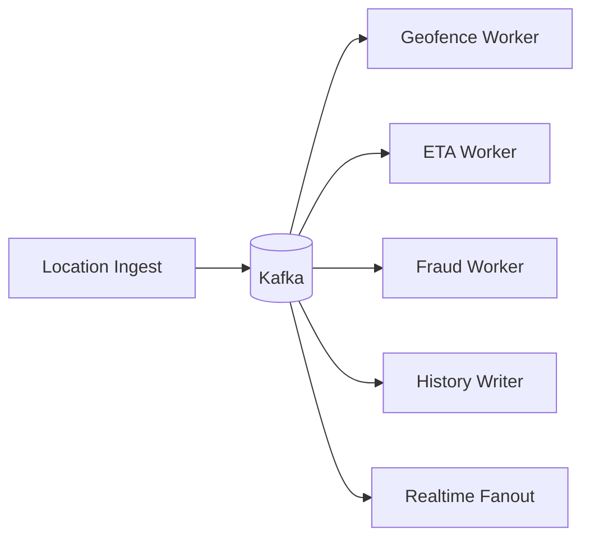

---

# 22. Why Kafka Helps

Kafka absorbs spikes and decouples services.

This is especially valuable when:

* thousands of drivers reconnect at once
* a city becomes busy
* many trips start simultaneously
* a fleet of couriers comes online after a shift change

It protects the rest of the system from overload.

---

# 23. Location History

You need a historical trail for:

* trip replay
* customer support
* fraud investigation
* route analytics
* ETA improvement
* driver performance analysis

A history store should be append-only and partitioned by:

* trip_id
* entity_id
* time window

---

## History Flow

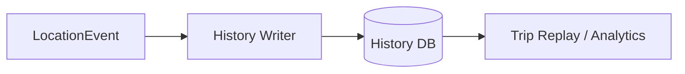

---

# 24. Trip Replay

Trip replay is useful for:

* support disputes
* proof of delivery
* route audits
* incident investigations

The replay system reconstructs the entity’s movement over time.

---

# 25. Spoof and Fraud Detection

Some drivers or agents may spoof GPS.

You should detect:

* impossible jumps
* teleports across the city
* inconsistent speed
* mock location apps
* unrealistic heading changes
* repeated identical coordinates
* stale device timestamps

---

## Fraud Detection Pipeline

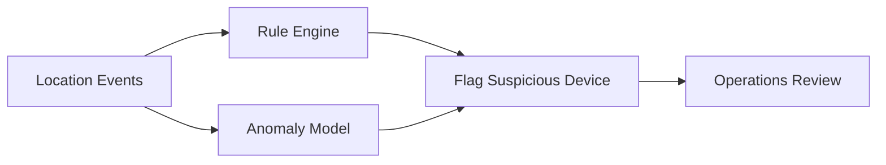

---

# 26. Device Heartbeats

A moving entity should send periodic heartbeats even when not moving.

Heartbeat signals help determine:

* device online status
* app health
* stale location updates
* background app reliability

---

## Heartbeat Flow

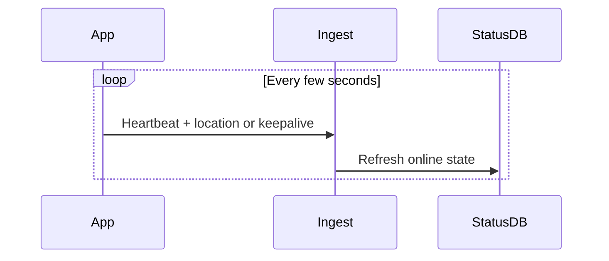

---

# 27. Offline Buffering

Mobile networks are unreliable.

The app should buffer location updates locally when offline and send them later.

But stale updates should be handled carefully.

The backend should:

* reject obviously outdated points
* apply ordering via sequence numbers
* store late events in history, not hot state
* use only fresh points for live display

---

# 28. Update Ordering and Idempotency

Location events may arrive:

* out of order
* duplicated
* delayed
* retried

The backend must enforce ordering using:

* event timestamp
* sequence numbers
* monotonic versioning
* last-write-wins for live state
* append-only history for audit

---

## Ordering Logic

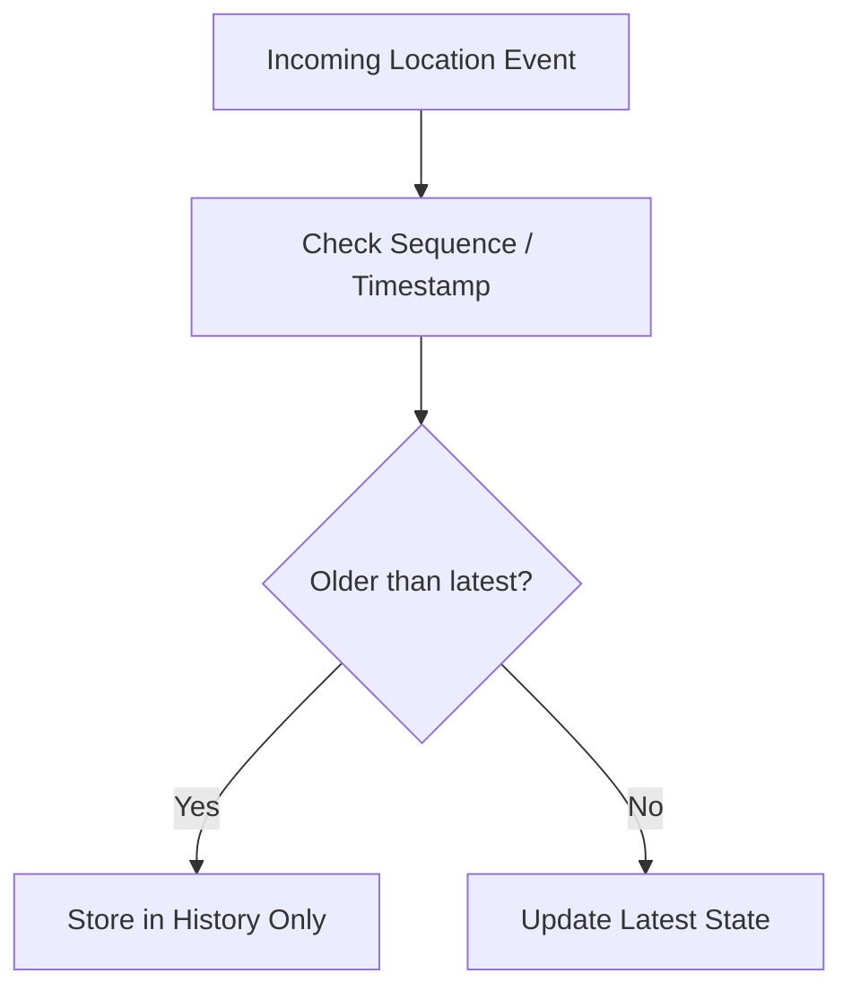

---

# 29. Sharding Strategy

A location system must scale by geography.

Sharding dimensions can include:

* city
* region
* geohash
* vehicle type
* tenant
* trip zone

A common strategy:

* route by city/region first
* then geospatial buckets within region

This improves locality and reduces cross-region traffic.

---

## Geo Sharding Diagram

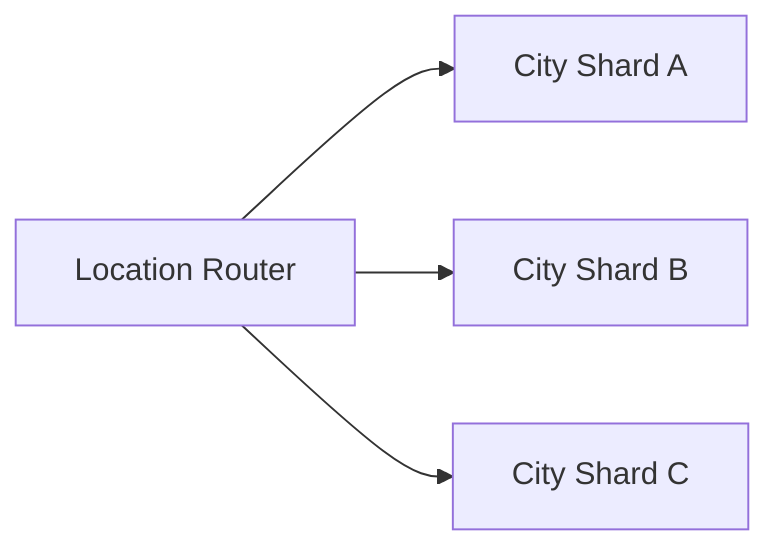

---

# 30. Why Geography-Based Sharding Works

Because most tracking queries are local.

Examples:

* nearby drivers
* nearby delivery partners
* live ride tracking in one city
* zone-based fleet analytics

Geographic locality helps:

* reduce latency
* improve cache efficiency
* keep location writes and reads in the same zone

---

# 31. Caching Strategy

Cache:

* latest location
* active trip state
* nearby candidates
* ETA results
* geofence membership
* route summary
* dispatcher view models

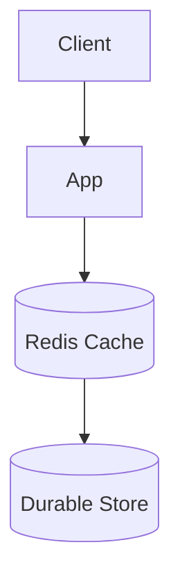

The cache should store only current and hot state.

History belongs elsewhere.

---

# 32. Driver App Battery Optimization

The mobile app should reduce battery drain by:

* increasing sampling interval when idle
* decreasing sampling when stationary
* using fused location provider
* sending only significant movement deltas
* batching events
* compressing payloads
* using efficient background sync

This is critical for delivery and driver adoption.

---

# 33. Zone-Based Updates

Not every location change deserves a UI update.

If a driver moves 5 meters inside a neighborhood, that may not matter.

A backend can reduce noise by:

* only pushing if movement exceeds a threshold
* batching very frequent updates
* smoothing jitter
* throttling UI updates

This keeps the map readable and reduces fanout load.

---

# 34. Dispatch and Supply Intelligence

Location tracking is not just for display.

It also powers:

* driver availability
* supply estimation
* hotspot detection
* surge or demand balancing
* routing to pickup points

This is why the tracking system often feeds directly into dispatch logic.

---

# 35. Live Map View

The customer-facing map often shows:

* live moving marker
* route polyline
* ETA
* pickup point
* drop point
* driver icon orientation
* current status

The UI should not request the full track every second.

Instead:

* load initial trip summary
* receive live deltas
* update only changed fields

---

# 36. Real-Time Trip Timeline

A trip or delivery has states such as:

* assigned
* accepted
* arrived at pickup
* pickup completed
* en route
* delivered
* cancelled
* completed

The tracking system should understand this state machine.

---

## Trip State Diagram

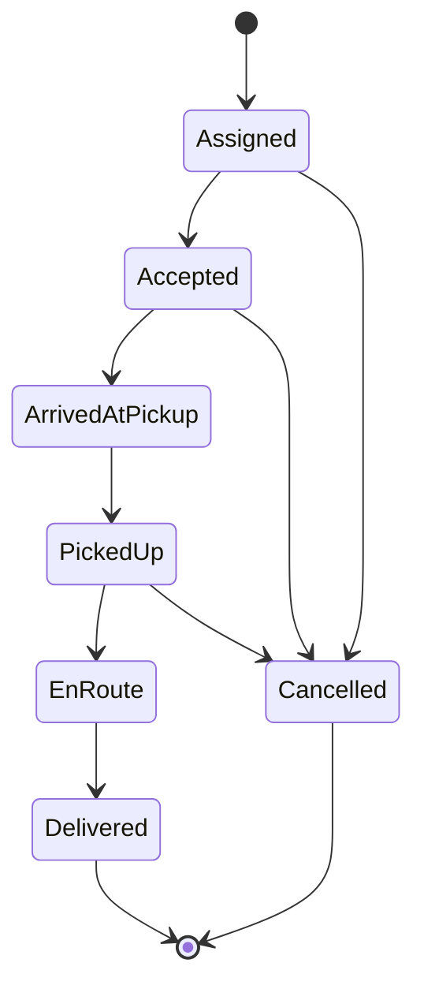

---

# 37. Use Cases Beyond Ride-Hailing

The same architecture can power:

* food delivery
* courier tracking
* medical supply tracking
* fleet management
* airport pilot or ground vehicle tracking
* field worker tracking
* logistics dispatch
* security patrol tracking

The core system remains the same:

* ingest live movement
* update latest state
* derive route intelligence
* stream to consumers

---

# 38. API Design

---

## Send Location Update

```http id="api_loc_01"
POST /tracking/location
```

Request:

```json
{
  "entityId": "driver_123",
  "tripId": "trip_555",
  "latitude": 12.9716,
  "longitude": 77.5946,
  "accuracy": 8,
  "speed": 14.2,
  "heading": 240,
  "timestamp": 1730000000,
  "sequenceNo": 991
}
```

---

## Get Latest Location

```http id="api_loc_02"
GET /tracking/location/{entityId}
```

---

## Get Trip History

```http id="api_loc_03"
GET /tracking/history/{tripId}
```

---

## Get Nearby Drivers

```http id="api_loc_04"
GET /tracking/nearby?lat=12.97&lon=77.59&radius=3000
```

---

## Subscribe to Live Tracking

```http id="api_loc_05"
GET /tracking/subscribe/{tripId}
```

---

# 39. Data Storage Strategy

| Data             | Recommended Storage     |
| ---------------- | ----------------------- |
| Latest location  | Redis / hot state store |
| Historical track | Time-series DB / NoSQL  |
| Geofence rules   | SQL / config DB         |
| Route map data   | Map graph store         |
| Trip state       | Strongly consistent DB  |
| Real-time events | Kafka                   |
| Analytics        | Data warehouse          |
| Fraud logs       | Audit store             |

---

# 40. Consistency Model

The system needs different consistency levels for different data.

| Feature              | Consistency Requirement         |
| -------------------- | ------------------------------- |
| Latest live location | Near real-time, last-write-wins |
| Movement history     | Eventual acceptable             |
| Trip state           | Strong consistency              |
| Dispatch assignment  | Strong consistency              |
| Fraud flags          | Eventual acceptable             |
| ETA                  | Eventual acceptable             |
| Realtime map UI      | Near real-time                  |

This mixed consistency model is the only practical choice.

---

# 41. Multi-Region Architecture

A large platform should deploy by region.

Each region should have:

* local ingest
* local tracking cache
* local realtime fanout
* local dispatch decisions where possible

Cross-region replication should be used for:

* analytics
* global monitoring
* backup/failover
* admin visibility

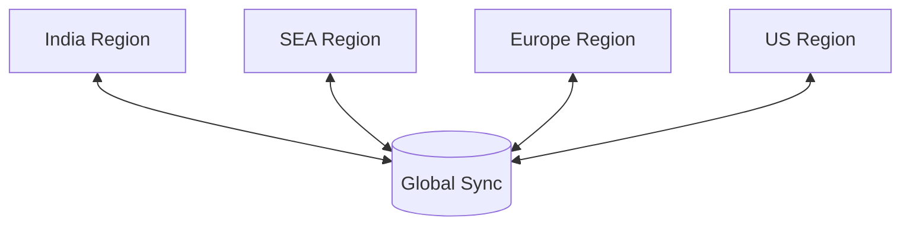

---

# 42. Failure Scenarios

---

## GPS Stops Updating

Mitigation:

* use last known location
* mark entity stale after TTL
* reduce UI confidence
* trigger reconnect logic

---

## Network Drops

Mitigation:

* local buffering
* reconnect
* backfill history later

---

## Kafka Lag

Mitigation:

* scale consumers
* prioritize live updates
* separate hot and cold pipelines

---

## Redis Failure

Mitigation:

* replication
* failover
* rebuild latest state from event stream

---

## Spoofed Location

Mitigation:

* anomaly detection
* velocity rules
* device attestation
* route plausibility checks

---

# 43. Observability

Track:

| Metric                | Why                  |
| --------------------- | -------------------- |
| Location ingest rate  | Load level           |
| Update latency        | Real-time quality    |
| Stale entity count    | Health               |
| Geo query latency     | Dispatch performance |
| ETA accuracy          | User experience      |
| Realtime push success | Map freshness        |
| Spoof detections      | Fraud control        |

---

# 44. Monitoring Architecture

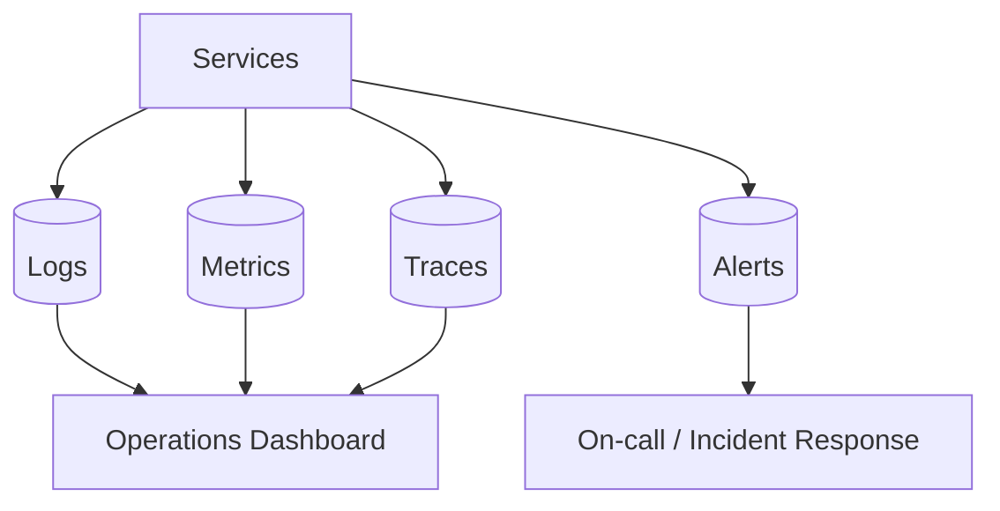

---

# 45. Advanced Optimizations

## Adaptive Sampling

Increase or decrease update frequency based on:

* movement speed
* route phase
* battery
* network quality

## Delta Compression

Send only changes rather than full payloads.

## Map Region Partitioning

Keep geospatial processing local to a region.

## Hot Path Split

Separate:

* live map path
* history path
* analytics path

This prevents the live system from being slowed down by batch processing.

---

# 46. Final Production Architecture

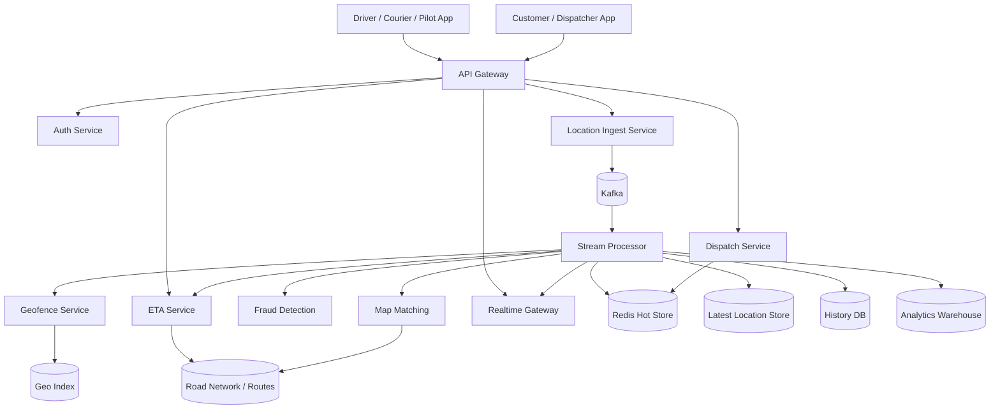

---

# 47. Tradeoffs

| Design Choice          | Benefit                | Tradeoff                       |
| ---------------------- | ---------------------- | ------------------------------ |
| Redis for latest state | Ultra-fast reads       | Memory cost                    |
| Kafka event pipeline   | Decoupled processing   | Operational complexity         |
| Time-series history DB | Durable movement trail | Extra storage layer            |
| Geohash/H3 indexing    | Fast nearby queries    | Spatial tuning complexity      |
| WebSockets             | Live UI                | Stateful connection management |
| Adaptive sampling      | Battery savings        | Less granular data             |

---

# 48. Key Takeaways

| Concept            | Summary                        |
| ------------------ | ------------------------------ |
| Location tracking  | A streaming geospatial problem |
| Latest state       | Store in hot cache             |
| History            | Store append-only              |
| Dispatch           | Use nearby geo queries         |
| ETA                | Use routes + traffic + history |
| Map matching       | Snap raw GPS to roads          |
| Geofencing         | Detect zone entry and exit     |
| Realtime UI        | Use WebSockets                 |
| Fraud detection    | Validate location plausibility |
| Battery efficiency | Adaptive update rates          |

---

# Conclusion

A real-time tracking system like Uber, Grab, or Zomato is much more than a map marker.

It is a **high-frequency geospatial streaming platform** that must continuously process live GPS data, keep the latest state hot, store complete history durably, compute ETAs, detect geofences, support dispatch, and deliver updates to many consumers in real time.

The correct architecture uses:

* a **location ingest pipeline**
* **Kafka** for buffering and event streaming
* **Redis** for latest live state
* **history storage** for trails and analytics
* **geospatial indexing** for nearby queries
* **map matching** for road accuracy
* **ETA service** for route intelligence
* **WebSockets** for live updates
* **fraud detection** for spoof prevention
* **multi-region deployment** for resilience
* **adaptive sampling** for battery efficiency

The hardest part is not storing coordinates.

The hardest part is turning raw coordinates into trustworthy, low-latency, operationally useful location intelligence at scale.

That is what makes this a true production-grade system design problem.
