A ChatGPT-style system looks simple from the user’s point of view.

A user types a prompt.
The model responds.
Tokens appear one by one in real time.

That experience hides an extremely complex backend.

A real conversational AI platform must handle:

* millions of concurrent chats
* real-time token streaming
* long context windows
* multimodal inputs
* retrieval over private and public corpora
* tool calling and agent workflows
* persistent memory
* safety and moderation
* usage metering and billing
* GPU scheduling and batching
* multi-region traffic and failover
* observability for latency, quality, and cost

This is not a normal web application.

It is a **real-time distributed inference platform**.

---

# 1. Introduction

## Problem statement

Design a system that allows users to:

* start and continue conversations with an assistant
* receive token-by-token responses in real time
* upload files, images, and audio
* ask follow-up questions in the same thread
* use tools such as search, code execution, and database access
* store conversation history
* support memory and personalization
* enforce safety policies
* handle millions of concurrent chats globally

## Real-world scale

A platform like this may need to support:

* tens or hundreds of millions of registered users
* millions of daily active chats
* large bursts after model launches or feature releases
* long-running conversations with long context windows
* expensive GPU-backed inference at scale
* retrieval and memory stores with very large datasets
* multiple model tiers with different performance and cost profiles

## Why this problem is difficult

The system must optimize several conflicting goals simultaneously:

* **latency**: users expect fast responses
* **quality**: outputs must be coherent and useful
* **cost**: every token costs money
* **safety**: inputs, outputs, and tools must be moderated
* **scale**: millions of chats and streams must coexist
* **statefulness**: conversation context matters
* **streaming**: users expect tokens to appear progressively
* **tooling**: the assistant may need to call external systems

The dominant backend problem is not web serving.

It is **orchestrating expensive inference safely and efficiently**.

---

# 2. Functional Requirements

The system should support:

| Requirement          | Description                                  |
| -------------------- | -------------------------------------------- |
| Authentication       | Secure user login and sessions               |
| Conversations        | Create, continue, and resume chat threads    |
| Streaming Responses  | Stream output tokens in real time            |
| Conversation History | Persist messages and metadata                |
| Multimodal Input     | Text, images, PDFs, audio, files             |
| Retrieval            | Query documents and corpora                  |
| Memory               | Persist user preferences and long-term facts |
| Tool Calling         | Search, calculator, code execution, APIs     |
| Safety Moderation    | Filter harmful inputs and outputs            |
| Model Routing        | Send requests to the right model tier        |
| Billing / Quotas     | Track usage and enforce limits               |
| Analytics            | Monitor quality, latency, and cost           |
| Admin Controls       | Policy, abuse review, and model governance   |
| Cancellation         | Stop a running generation                    |
| Edit / Regenerate    | Support prompt edits and reruns              |

---

# 3. Non-Functional Requirements

| Property          | Goal                                        |
| ----------------- | ------------------------------------------- |
| Low latency       | First token should appear quickly           |
| High availability | The service should survive partial failures |
| Scalability       | Handle millions of concurrent sessions      |
| Efficiency        | Maximize GPU utilization                    |
| Reliability       | Preserve chats, usage, and tool traces      |
| Safety            | Block harmful or disallowed behavior        |
| Consistency       | Preserve coherent session state             |
| Fault tolerance   | Handle GPU, queue, and region failures      |
| Observability     | Measure token latency and quality           |
| Cost efficiency   | Avoid unnecessary inference and retries     |

---

# 4. Capacity Estimation

Let us assume a large-scale AI assistant platform.

## Assumptions

* 100 million registered users
* 20 million daily active users
* 5 million concurrent sessions at peak
* 50 million messages per day
* average input prompt length: 300–800 tokens
* average completion length: 200–1000 tokens
* many requests use retrieval, memory, or tools

## Request volume

If there are 50 million messages per day:

```text
50,000,000 / 86,400 ≈ 579 requests/second average
```

That is only the average.

Peak traffic can be 10x–20x higher, especially during product launches, morning/evening peaks, or viral adoption spikes.

## Token throughput

If each request averages:

* 500 input tokens
* 500 output tokens

Then each request processes about 1,000 tokens.

At 50 million requests/day:

* 50 billion tokens/day

That is an enormous inference workload.

## Storage

Storage includes:

* chat history
* files and attachments
* embeddings
* memory records
* tool traces
* moderation logs
* usage and billing records
* vector indexes
* audit trails

This can easily grow into many terabytes or more, depending on retention.

---

# 5. High-Level Architecture

A ChatGPT-style platform has two major parts:

1. **Control plane**
2. **Inference plane**

The control plane manages users, safety, routing, usage, and metadata.

The inference plane manages prompts, model execution, token streaming, and tool orchestration.

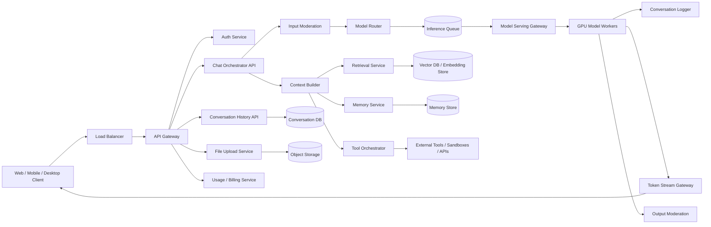

## Why this architecture works

* The **API gateway** handles auth, throttling, and routing.
* The **chat orchestrator** coordinates each request end-to-end.
* **Moderation** is applied before and after inference.
* **Context building** prepares the exact prompt the model should see.
* **Model routing** keeps quality and cost balanced.
* **Inference queues** protect GPUs from overload.
* **Stream gateways** push tokens to clients immediately.
* **Conversation, memory, and retrieval stores** make the assistant stateful.

---

# 6. Core Request Lifecycle

A chat request is not a single call.

It is a pipeline.

## End-to-end flow

1. user submits a prompt
2. authentication and rate limiting happen
3. input moderation runs
4. conversation history is fetched
5. relevant memory is fetched
6. retrieval may run
7. tools may be selected or invoked
8. prompt is assembled
9. model is selected
10. request is queued or dispatched to GPUs
11. tokens stream back progressively
12. output moderation validates the result
13. final answer is stored
14. usage and billing are updated

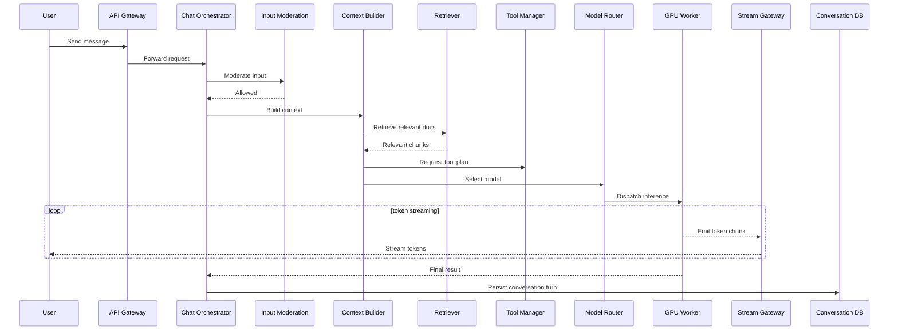

---

# 7. API Design

## 7.1 Start conversation

`POST /v1/conversations`

### Request

```json
{
  "title": "Help me design a distributed cache",
  "model_hint": "auto"
}
```

### Response

```json
{
  "conversation_id": "conv_123",
  "created_at": "2026-05-10T10:00:00Z"
}
```

---

## 7.2 Send message

`POST /v1/conversations/{conversation_id}/messages`

### Request

```json
{
  "message_id": "msg_001",
  "role": "user",
  "content": "Design a distributed cache with high availability."
}
```

### Response

```json
{
  "accepted": true,
  "stream_id": "stream_456"
}
```

---

## 7.3 Stream response

`GET /v1/streams/{stream_id}`

This may be implemented with:

* Server-Sent Events
* WebSocket
* HTTP chunked transfer
* gRPC streaming internally

### Stream events

```json
{
  "type": "token",
  "text": "A"
}
```

```json
{
  "type": "token",
  "text": "distributed"
}
```

```json
{
  "type": "done"
}
```

---

## 7.4 Conversation history

`GET /v1/conversations/{conversation_id}`

Returns:

* messages
* tool calls
* response metadata
* moderation outcomes
* timestamps
* model version
* citations
* attachments

---

## 7.5 File upload

`POST /v1/files`

Used for:

* PDFs
* docs
* spreadsheets
* images
* audio
* source archives

---

# 8. LLM Serving Internals Deep Dive

This is where the system becomes expensive and highly specialized.

The serving layer must do more than “call a model.”

It must keep GPU utilization high, maintain low latency, support long contexts, and stream tokens efficiently.

## Responsibilities of the serving layer

* load and shard model weights
* handle prefill and decode phases
* batch compatible requests together
* maintain KV caches
* stream tokens incrementally
* enforce per-request budgets
* manage speculative and fallback execution if supported
* expose health and saturation signals to the router

## Prefill vs decode

LLM inference has two broad phases:

### Prefill

The model ingests the entire prompt and builds internal state.

This is compute-heavy because the model must process all input tokens.

### Decode

The model generates one token at a time.

This is latency-sensitive and repeated many times per request.

The serving system should treat these differently.

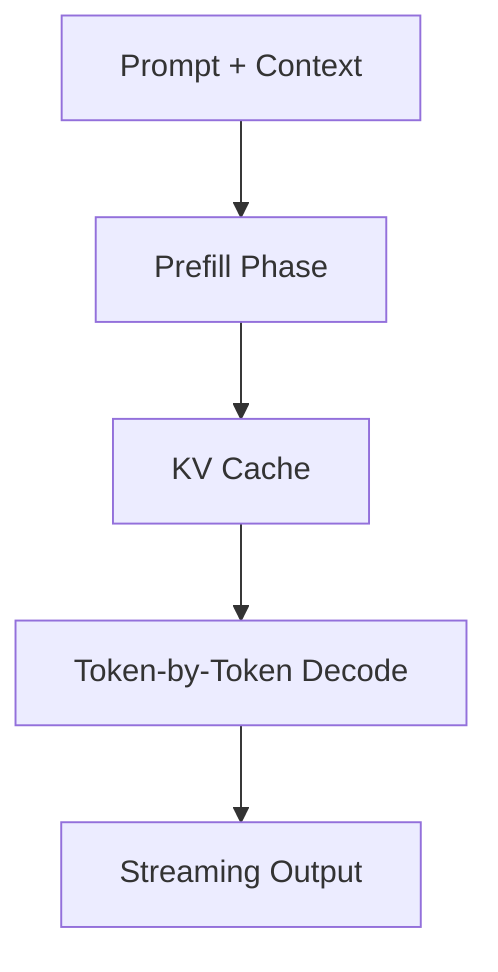

## Why this matters

A request with a huge prompt can consume a lot of compute before the first token appears.

A request with a long completion can hold GPU resources for a long time.

The serving layer must optimize both.

---

# 9. KV Cache and Batching Deep Dive

The KV cache is one of the most important performance mechanisms in transformer inference.

## What the KV cache does

During inference, the model stores attention keys and values so it does not recompute the entire history for every new token.

This reduces repeated work during decoding.

Without a KV cache, token generation would be far too expensive.

## Why KV cache is hard at scale

The cache consumes GPU memory.
Long conversations create large caches.
Many concurrent sessions create memory pressure.

So the platform must carefully manage:

* cache allocation
* cache eviction
* prompt truncation
* context reuse
* batching across compatible requests

## Continuous batching

Instead of waiting for one request to finish before starting another, the GPU scheduler can merge multiple compatible decoding requests into the same batch.

This greatly improves throughput.

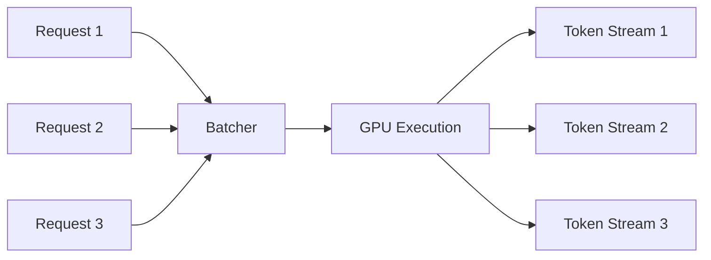

## Why batching is tricky

Batching improves throughput, but it can also harm latency if done too aggressively.

The scheduler has to balance:

* time to first token
* total throughput
* fairness
* GPU occupancy
* prompt length differences
* model size differences

## Practical batching strategies

* batch small interactive prompts together
* keep long-context requests in a separate queue
* isolate premium low-latency traffic
* keep tool-heavy requests separate from simple chat requests
* use token-budget-aware batching instead of request-count-only batching

This is one of the major engineering levers for cost control.

---

# 10. Model Router

The router chooses which model should answer a request.

## Routing inputs

* user tier
* prompt complexity
* prompt length
* required context length
* multimodal need
* safety risk
* tool requirement
* latency target
* GPU availability
* budget constraints

## Typical routing policy

* short, simple prompts → fast small model
* code or reasoning → stronger model
* multimodal requests → vision-capable model
* very long context → long-context model
* enterprise retrieval + tool use → specialized assistant model
* overload conditions → graceful fallback model

### Why routing matters

A single giant model for every request is too expensive and often unnecessary.

The router is the layer that balances:

* quality
* latency
* cost
* reliability

---

# 11. Retrieval-Augmented Generation Deep Dive

Retrieval-Augmented Generation, or RAG, lets the assistant answer from external knowledge instead of only from internal parameters.

## Why RAG matters

It helps with:

* enterprise documents
* private files
* internal knowledge bases
* up-to-date factual information
* large corpora that do not fit in the prompt

## RAG architecture

1. user asks a question
2. query is normalized and embedded
3. search retrieves top candidate chunks
4. reranking improves relevance
5. selected chunks are inserted into the prompt
6. model generates answer grounded in retrieved content

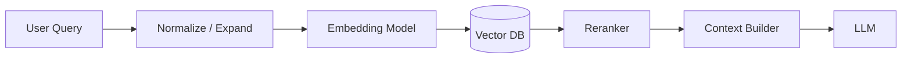

## Chunking strategy

Documents should be split into meaningful chunks, not arbitrary token blocks.

Good chunks usually align with:

* paragraphs
* sections
* table rows
* semantic units

Poor chunking reduces retrieval quality.

## RAG tradeoffs

### Pros

* improves factual grounding
* supports private data
* reduces hallucination risk
* enables enterprise search over documents

### Cons

* adds latency
* adds infrastructure complexity
* retrieval errors can degrade answer quality
* prompt size can grow quickly

## Retrieval ranking signals

The retriever can use:

* semantic similarity
* keyword overlap
* recency
* document authority
* user permissions
* source trust
* query intent

The final prompt should include only the most relevant evidence.

---

# 12. Agent and Tool Execution Deep Dive

Modern AI assistants often act like agents.

That means they do not only generate text.

They also plan actions, call tools, read results, and continue reasoning.

## Tool execution flow

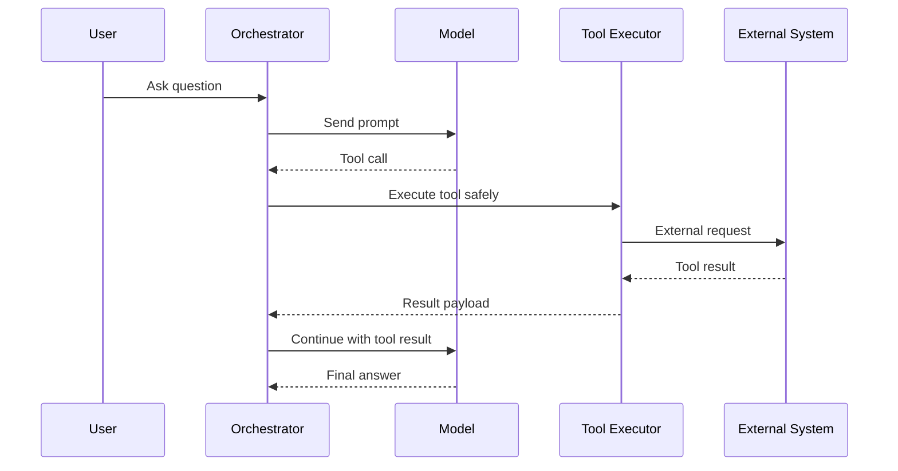

## Why tool orchestration is hard

Tools are not pure functions in the real world.

They can:

* fail
* time out
* return partial data
* require credentials
* have side effects
* become dangerous if used incorrectly

## Tool categories

### Read-only tools

* web search
* document lookup
* database read
* calculator
* code execution sandbox

### Write tools

* calendar update
* ticket creation
* CRM actions
* sending email
* modifying documents

Write tools require much stronger safety and confirmation policies.

## Tool policy engine

The orchestrator should check:

* allowed tool list
* per-user permission
* data scope
* enterprise policy
* confirmation requirement
* retry policy
* timeout policy

## Execution sandbox

Code execution tools must run in a secure sandbox with:

* network restrictions
* file restrictions
* time limits
* CPU and memory limits
* no direct access to secrets unless explicitly scoped

This prevents tool misuse and containment issues.

---

# 13. Memory Design Deep Dive

Memory is what makes the assistant feel personalized across sessions.

## Memory types

### Short-term memory

Context within the active conversation.

### Long-term memory

Stable facts and preferences that the user wants remembered.

### Task memory

Project-specific or workspace-specific facts.

### Enterprise memory

Organization-wide knowledge scoped by tenant and permissions.

## Memory extraction flow

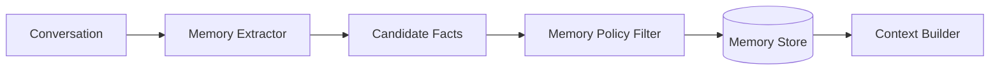

## What should be remembered

Good memory items are:

* user preferences
* recurring workflows
* stable goals
* preferred tone
* long-lived project context

## What should not be remembered

Do not store:

* transient details that are not useful later
* highly sensitive data unless explicitly permitted
* noisy content from every conversation
* untrusted or conflicting facts without validation

## Memory update semantics

Memory should usually be:

* editable
* removable
* versioned
* tenant-scoped
* auditable

## Why memory is difficult

Memory can easily become harmful if it:

* stores wrong assumptions
* leaks across users
* mixes tenants
* becomes stale
* over-personalizes in a creepy way

The memory layer must be conservative and policy-driven.

---

# 14. Multi-Region GPU Orchestration Deep Dive

A global AI assistant must serve users across the world.

That means the system must coordinate:

* regional traffic
* GPU capacity
* data locality
* failover
* model deployment
* regional policy differences

## Goals

* reduce latency by serving near the user
* keep traffic within region when possible
* fail over during region outages
* support enterprise data residency
* balance GPU utilization across clusters

## Regional architecture

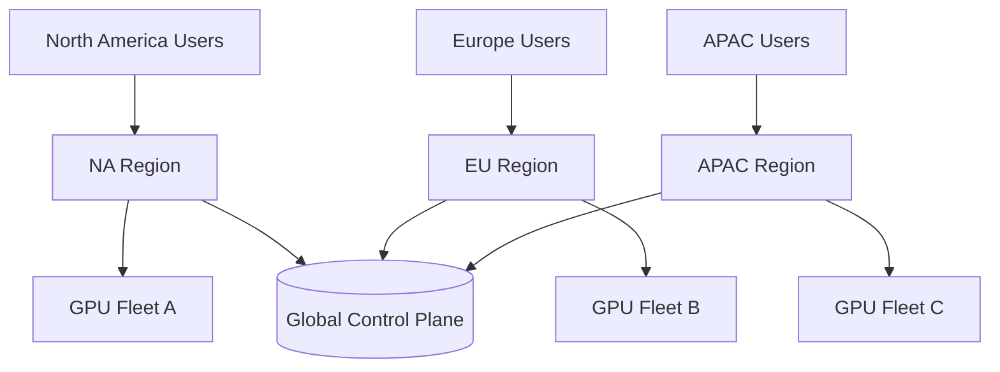

## What stays regional

* conversation data
* memory records
* file uploads
* embeddings for private corpora
* enterprise workspace data
* logs subject to residency rules

## What may be global

* model weights
* policy definitions
* routing logic
* billing configuration
* platform-wide telemetry aggregation

## Failover model

When one region becomes unhealthy:

1. traffic is rerouted to a healthy region
2. new chats are created in the new region
3. existing chats are rehydrated from replicated state where possible
4. cached memory and retrieval state are restored
5. the user sees continued service with minimal interruption

## Tradeoff

Fully active-active replicated inference across regions is expensive.
A more practical model is:

* region-local serving
* global control plane
* replicated metadata
* failover with session rehydration

---

# 15. Cancellation and Interruptions

Users often stop a generation mid-way, edit the prompt, or ask a follow-up.

The platform should support:

* cancel generation
* stop streaming
* preserve partially generated content if needed
* free GPU resources immediately
* allow reissue of a new request

This is important because inference is expensive and long-running requests consume GPU time.

---

# 16. Conversation Summarization

Long conversations cannot fit entirely into the prompt forever.

So the system needs to summarize.

## Why summarization is important

If the assistant keeps every prior message:

* prompt size grows
* latency grows
* cost grows
* relevant context gets buried

## Summarization strategy

The platform can maintain:

* rolling summaries
* user preference summaries
* task progress summaries
* decision summaries

These summaries are then used by the context builder.

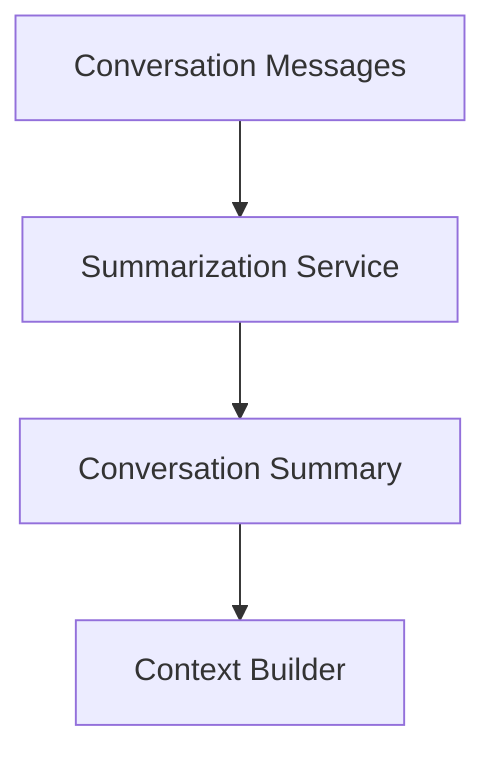

---

# 17. Safety and Moderation

Safety must happen at multiple points in the system.

## Moderation layers

1. **Input moderation** before inference
2. **Retrieval moderation** for documents and external content
3. **Tool moderation** before external side effects
4. **Output moderation** after generation
5. **Behavior monitoring** for abuse patterns

## Why multiple layers are needed

A prompt may look safe but contain dangerous intent.
A retrieved document may contain malicious instructions.
A tool result may include unsafe instructions or data.

Safety cannot rely on a single check.

---

# 18. Streaming Architecture

The user expects tokens to appear in real time.

## Streaming requirements

* first token quickly
* low jitter
* graceful cancellation
* reconnect support
* partial response preservation
* backpressure handling

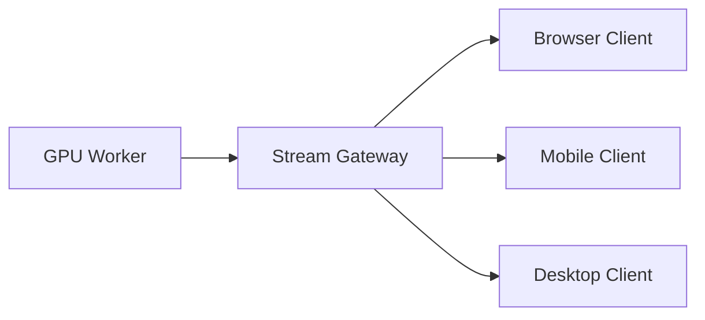

### Important

The response stream should be separate from the persistence path.
That lets the user see text immediately while the backend finalizes storage and billing asynchronously.

---

# 19. Caching Strategy

Caching matters in several places.

## Good cache candidates

* conversation metadata
* user profile
* memory records
* retrieval results
* model availability state
* repeated prompt prefixes
* rendered response fragments
* auth session info

## Bad cache candidates

* final authoritative conversation state without reconciliation
* safety decisions without strict expiration
* sensitive tool outputs that change quickly

### Prompt prefix cache

For repeated long prompts or shared system prompts, caching prefix computations can save significant GPU work.

That is especially useful for:

* enterprise assistants
* multi-turn agents
* shared knowledge workflows

---

# 20. Observability

The system needs very rich observability.

## Important metrics

| Metric                 | Why it matters       |
| ---------------------- | -------------------- |
| Time to first token    | User experience      |
| Total response latency | End-to-end speed     |
| Queue wait time        | GPU pressure         |
| Tokens/sec             | Inference throughput |
| GPU utilization        | Cost efficiency      |
| Retrieval latency      | RAG responsiveness   |
| Tool failure rate      | External reliability |
| Moderation reject rate | Safety quality       |
| Stream disconnect rate | Client robustness    |
| Cost per chat          | Business efficiency  |

## Tracing

A single request should be traceable across:

* API gateway
* moderation
* context builder
* retrieval
* router
* GPU execution
* tool execution
* streaming
* storage
* billing

This is essential for diagnosing slow responses, errors, or quality regressions.

---

# 21. Billing and Quotas

Inference is expensive.

The platform needs metering for:

* input tokens
* output tokens
* tool calls
* retrieval queries
* file processing
* multimodal processing
* premium model access
* concurrency limits

### Why this matters

Without metering:

* costs become unpredictable
* abuse becomes expensive
* product tiers become impossible to enforce

The router should know the budget context before dispatching a request.

---

# 22. Failure Scenarios

## GPU worker failure

The request should requeue or fail over to another worker.

## Retrieval DB outage

The system can degrade to no-RAG mode.

## Tool executor failure

The assistant should either retry safely or answer without the tool.

## Conversation DB outage

The system should preserve the interaction log and retry persistence.

## Region outage

Traffic should route to a backup region with replicated metadata and account state.

## Moderation service failure

The system should fail safely, usually by blocking risky requests rather than allowing them through.

---

# 23. Final Architecture Diagram

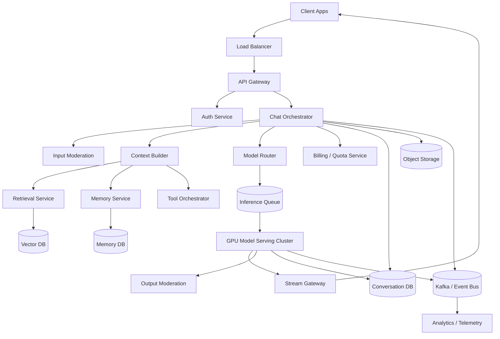

---

# 24. Conclusion

A ChatGPT-style real-time AI platform is a large distributed system that combines:

* real-time streaming
* GPU inference
* context management
* retrieval
* tool orchestration
* memory
* moderation
* billing
* observability
* multi-region reliability

The key engineering principles are:

* **separate the control plane from the inference plane**
* **stream tokens as they are generated**
* **keep GPU utilization high with batching and KV cache management**
* **use RAG to ground answers in external sources**
* **treat tools as controlled, policy-governed execution**
* **design memory carefully so it is helpful, safe, and editable**
* **route requests intelligently across model tiers**
* **support cancellation, retries, and graceful degradation**
* **make multi-region inference practical, not theoretical**
* **measure everything that affects latency, quality, and cost**

A production AI assistant is not just a model behind an API.

It is a carefully engineered real-time inference platform that turns a user prompt into a safe, coherent, low-latency streamed response at global scale.
