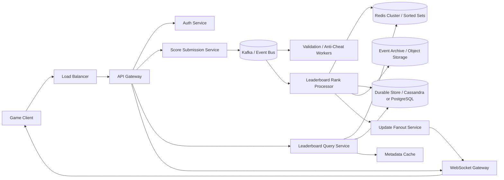
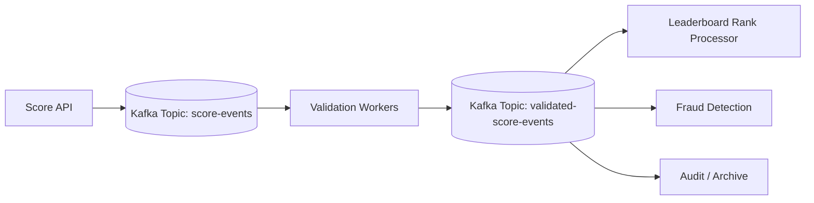
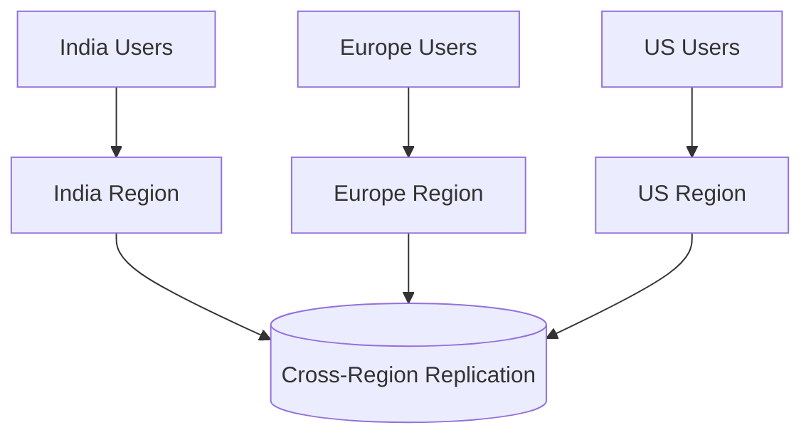
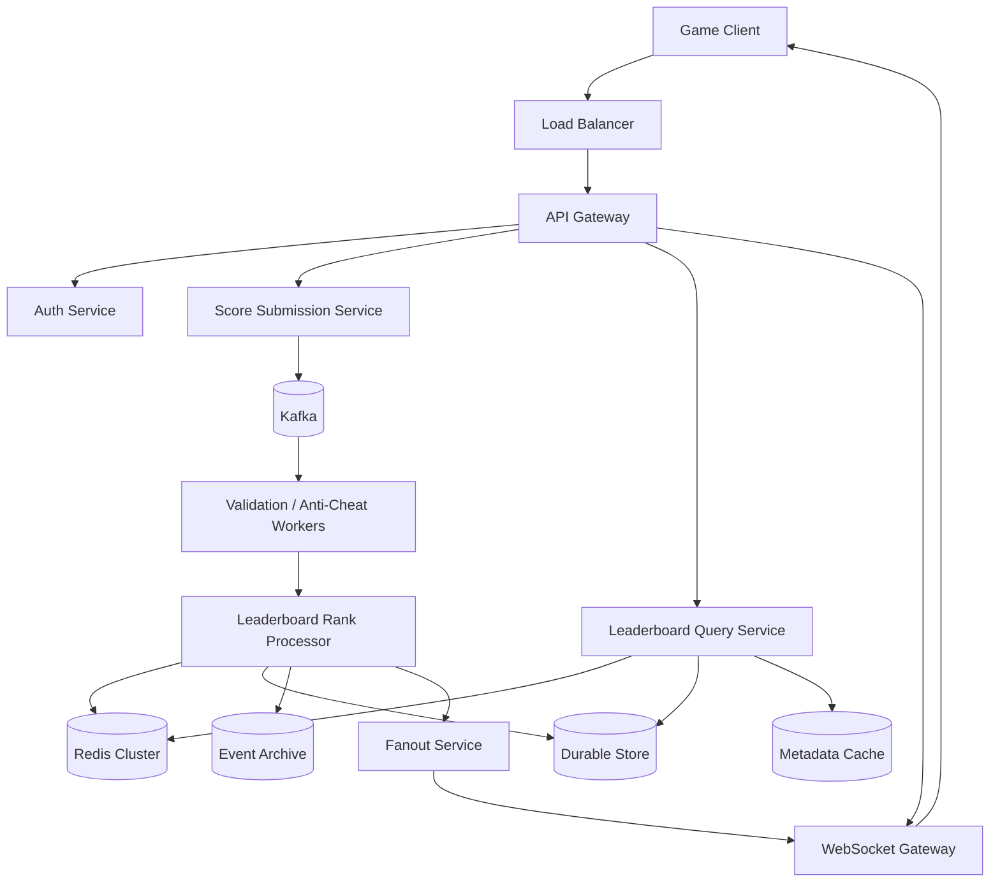

A real-time game leaderboard looks simple on the surface.

A player finishes a match.
Their score updates.
Their rank changes.
Everyone sees the new position.

That sounds easy until the system grows.

Now the leaderboard must support:

* millions of players
* read-heavy traffic from rank lookups
* write spikes during tournaments and events
* low-latency score updates
* top-N and “around me” queries
* seasonal resets
* multiple leaderboard types
* real-time push updates
* cheating prevention
* deterministic tie-breaking
* multi-region resilience

This is no longer just a database table with `ORDER BY score DESC`.

It becomes a distributed ranking system.

The challenge is to keep the leaderboard:

* fast
* correct enough
* scalable
* fault tolerant
* abuse-resistant
* cheap enough to operate

---

# 1. Introduction

## Problem statement

Build a leaderboard system for an online game that can:

* accept score submissions
* compute ranks in real time
* show top players globally or per region
* show a player’s current rank
* show nearby ranks
* reset by season
* push rank changes live to connected clients

## Real-world scale

A serious game leaderboard may serve:

* tens of millions of registered users
* hundreds of thousands of concurrent users
* thousands to tens of thousands of score updates per second
* hundreds of thousands of leaderboard reads per second during peak events

## Why this problem is difficult

The difficulty comes from the combination of:

* **high write rate**: score updates are frequent
* **high read rate**: players constantly check rank
* **low latency**: updates should feel immediate
* **global consistency pressure**: rankings must be believable
* **hot partitions**: the top leaderboard gets hammered
* **fanout**: live updates may need to reach many clients
* **cheating risk**: game scores are often adversarial inputs

A good design has to optimize for the fast path while preserving correctness and recoverability.

---

# 2. Functional Requirements

The system should support:

| Requirement           | Description                                    |
| --------------------- | ---------------------------------------------- |
| Submit Score          | Players send score increments or match results |
| Get Rank              | Fetch a player’s current rank                  |
| Get Top N             | Fetch top players for a leaderboard            |
| Get Nearby Ranks      | Fetch rank window around a player              |
| Real-Time Updates     | Push ranking changes live                      |
| Multiple Leaderboards | Global, regional, seasonal, friends, clan      |
| Periodic Resets       | Daily/weekly/seasonal reset support            |
| Tie Handling          | Deterministic ordering for equal scores        |
| Recalculation         | Support corrections and moderation             |
| Anti-Cheat            | Validate suspicious score updates              |

---

# 3. Non-Functional Requirements

| Property          | Goal                                               |
| ----------------- | -------------------------------------------------- |
| Low latency       | Rank reads should be near-real-time                |
| High availability | System should survive node failures                |
| Scalability       | Handle growth in players and events                |
| Consistency       | Rankings should be deterministic                   |
| Durability        | Score history should not be lost                   |
| Fault tolerance   | Recover from broker, DB, or region failure         |
| Security          | Prevent tampering and abuse                        |
| Observability     | Track lag, errors, fraud, and saturation           |
| Cost efficiency   | Avoid expensive recomputation and overprovisioning |

---

# 4. Capacity Estimation

Let us assume a large game platform.

## Assumptions

* 20 million registered players
* 5 million daily active users
* 500,000 concurrent users at peak
* 100,000 score updates/sec during a tournament spike
* 300,000 rank reads/sec
* 20,000 top-N requests/sec
* 10,000 live websocket subscribers per large event leaderboard

## QPS

### Writes

If 100,000 score updates/sec peak, the ingestion layer must absorb burst traffic comfortably.

### Reads

If 300,000 rank reads/sec and 20,000 top-N calls/sec, read latency must remain very low.

## Storage

### Current leaderboard state

If one entry is roughly 200–400 bytes including metadata, then 20 million players may require:

* ~4 GB to ~8 GB raw for current state
* much more with indexes, replication, and operational overhead

### Event history

If every score update is stored as an event and the game produces billions of updates, event logs can grow to TB scale.

## Bandwidth

Assuming:

* 300,000 reads/sec at 1 KB each → ~300 MB/sec outbound at peak
* 100,000 score writes/sec at 300 bytes each → ~30 MB/sec inbound, excluding overhead

## Read/write ratio

Leaderboards are usually **read-heavy overall**, but spikes in writes are common during gameplay bursts and event completion.

A practical estimate is:

* 70–90% reads
* 10–30% writes
* but the write spikes dominate operational complexity

---

# 5. High-Level Architecture

A robust design uses an event-driven pipeline with a low-latency ranking layer.



## Why this architecture works

* The **API gateway** handles auth, throttling, and routing.
* The **score service** accepts writes quickly and returns fast.
* **Kafka** buffers spikes and decouples ingestion from ranking.
* **Workers** validate and process events asynchronously.
* **Redis** provides fast rank reads and top-N queries.
* **Durable storage** preserves state and enables recovery.
* **WebSocket fanout** pushes live changes to connected clients.

---

# 6. API Design

## 6.1 Submit score

`POST /v1/leaderboards/{leaderboard_id}/scores`

### Request

```json
{
  "player_id": "p123",
  "score_delta": 250,
  "match_id": "m789",
  "event_id": "evt-001",
  "client_timestamp": 1710000000
}
```

### Response

```json
{
  "accepted": true,
  "request_id": "req-abc123",
  "status": "queued"
}
```

### Notes

* `event_id` is critical for idempotency.
* `match_id` helps with deduplication and anti-cheat.
* Do not trust client score blindly if the game is server-authoritative.

---

## 6.2 Get player rank

`GET /v1/leaderboards/{leaderboard_id}/players/{player_id}`

### Response

```json
{
  "leaderboard_id": "season-12-global",
  "player_id": "p123",
  "score": 9870,
  "rank": 42,
  "last_updated_at": "2026-05-10T15:00:00Z"
}
```

---

## 6.3 Get top N

`GET /v1/leaderboards/{leaderboard_id}/top?limit=100`

### Response

```json
{
  "leaderboard_id": "season-12-global",
  "items": [
    { "player_id": "p1", "rank": 1, "score": 20000 },
    { "player_id": "p2", "rank": 2, "score": 19870 }
  ]
}
```

---

## 6.4 Get nearby ranks

`GET /v1/leaderboards/{leaderboard_id}/around/{player_id}?radius=5`

This returns the player’s rank plus a small window above and below it.

---

## 6.5 Live subscription

`GET /v1/leaderboards/{leaderboard_id}/subscribe`

Upgraded to WebSocket or SSE depending on client needs.

---

# 7. Database Design

A production leaderboard usually needs **two storage layers**:

1. **Hot ranking layer** for immediate queries
2. **Durable source-of-truth layer** for persistence and replay

---

## 7.1 Hot ranking layer: Redis

Use Redis Sorted Sets:

* key: `lb:{leaderboard_id}`
* member: `player_id`
* score: player score

Example:

```bash
ZADD lb:season-12-global 9870 p123
ZREVRANK lb:season-12-global p123
ZREVRANGE lb:season-12-global 0 99 WITHSCORES
```

### Why Redis

* fast updates
* fast top-N
* fast rank lookup
* simple operational semantics

### Caveat

Redis should not be the only durable system.

---

## 7.2 Durable current-state store

### Option A: Cassandra / DynamoDB

Best for:

* high write throughput
* easy horizontal scaling
* simple key-based access

### Option B: PostgreSQL / MySQL

Best for:

* strong transactional integrity
* smaller scale systems
* richer relational queries

### Practical recommendation

For large-scale game leaderboards:

* Redis for hot ranking
* Cassandra or DynamoDB for persistent state
* object storage for immutable event logs

---

## 7.3 Schema: current leaderboard entries

| Column         | Type      | Notes                           |
| -------------- | --------- | ------------------------------- |
| leaderboard_id | string    | Partition/group identifier      |
| player_id      | string    | Unique player                   |
| score          | bigint    | Current score                   |
| tie_breaker    | bigint    | Used for deterministic ordering |
| updated_at     | timestamp | Last update time                |
| version        | bigint    | Optimistic concurrency          |
| metadata_ref   | string    | Optional profile pointer        |

---

## 7.4 Schema: score events

| Column         | Type      | Notes                  |
| -------------- | --------- | ---------------------- |
| event_id       | string    | Unique idempotency key |
| leaderboard_id | string    | Partition key          |
| player_id      | string    | Player identifier      |
| match_id       | string    | Anti-cheat and dedupe  |
| delta          | bigint    | Score change           |
| processed_at   | timestamp | Server processing time |
| status         | string    | accepted/rejected      |

This table allows replay, audit, and seasonal recomputation.

---

# 8. Deep Dive into Components

## 8.1 Load balancer

The load balancer distributes:

* score submissions
* leaderboard reads
* websocket connections

Use:

* L7 load balancer for API traffic
* L4/L7 compatible routing for websocket traffic

Its job is to keep traffic flowing to healthy replicas and support horizontal scale.

---

## 8.2 API Gateway

Responsibilities:

* authentication
* authorization
* rate limiting
* request logging
* request tracing
* routing to internal services
* TLS termination

This is important because leaderboard endpoints are public-facing and vulnerable to abuse.

---

## 8.3 Score Submission Service

This service should be thin and fast.

It should:

* validate request schema
* verify auth token
* attach server-side metadata
* emit an event to Kafka
* acknowledge quickly

It should **not** synchronously recalculate rankings across all stores.

That would add latency and kill throughput under burst load.

---

## 8.4 Kafka / event bus

Kafka is the backbone of the ingestion pipeline.

It handles:

* write buffering
* decoupling ingestion from rank mutation
* replay
* fanout to notifications
* analytics pipelines
* anti-cheat consumers



### Why Kafka fits

* high throughput
* ordered partitions
* consumer groups
* replayability
* backpressure absorption

---

## 8.5 Leaderboard Rank Processor

This worker consumes validated events and updates:

* Redis sorted sets
* durable current-state store
* audit/event archive
* downstream notification streams

It is the component that converts raw score events into ranked state.

### Responsibilities

* apply score deltas
* enforce idempotency
* maintain deterministic ordering
* update current score
* emit change events for fanout

---

## 8.6 Redis ranking layer

Redis Sorted Sets are ideal for top-N and rank lookup.

### Operations used

* `ZADD` to insert/update scores
* `ZREVRANGE` for top N
* `ZREVRANK` for exact rank
* `ZRANGE` for nearby windows

### Hot-key issue

The highest-profile leaderboard can become a hot key.

Mitigations:

* split by season / region / game mode
* cache top-N aggressively
* shard large boards
* isolate global leaderboard reads from “around me” queries

---

## 8.7 Durable store

The durable store keeps the current score and event history.

Why this matters:

* Redis may lose data in rare failures
* event logs allow replay
* moderation may require corrections
* seasonal ranking recomputation needs history

---

## 8.8 WebSocket gateway

Live ranking changes should reach subscribed clients quickly.

The gateway:

* maintains persistent connections
* tracks subscriptions
* delivers rank updates
* handles reconnects and heartbeats

This is especially useful for live tournaments where rank movement is part of the experience.

---

## 8.9 Anti-cheat workers

Leaderboard systems are adversarial.

Workers inspect events for:

* impossible score jumps
* repeated spam submissions
* duplicated match IDs
* bot-like behavior
* suspicious regional patterns
* client tampering signs

Suspicious events may be:

* rejected
* quarantined
* flagged for manual review
* score-adjusted later

---

# 9. Scalability

The design scales by separating reads, writes, and fanout.

## Key strategies

1. **Horizontal scale for stateless services**

   * API servers
   * websocket gateways
   * validation workers
   * fanout workers

2. **Partition Kafka topics**

   * by leaderboard_id
   * by season
   * by region

3. **Shard durable storage**

   * distribute player-state records
   * isolate hot leaderboards

4. **Use Redis for hot ranking**

   * avoid expensive DB sorts

5. **Async processing**

   * ranking writes do not block on analytics or notifications

---

# 10. Reliability

The system should keep working when partial failures happen.

## Reliability mechanisms

* retries with exponential backoff
* circuit breakers
* dead letter queues
* consumer replay from Kafka
* multi-AZ deployment
* health checks and failover
* backup snapshots

A request should be accepted quickly, even if downstream fanout is temporarily delayed.

---

# 11. Consistency

Leaderboard consistency is usually **not globally linearizable** for every read in a large distributed deployment.

A practical model is:

* **strong consistency** for a player’s own score update acknowledgement
* **eventual consistency** for global rank visibility
* **near-real-time consistency** for top-N views

## What needs stronger consistency

* score event deduplication
* current score for a player
* ordering within a leaderboard partition

## What can be eventual

* search/index side effects
* live push delivery timing
* analytics
* some cache layers

This is a reasonable tradeoff for scale.

---

# 12. Fault Tolerance

## Failure scenarios

### 1. Redis node failure

Mitigation:

* Redis Cluster with replicas
* shard rebalancing
* rebuild from durable store or event log

### 2. Kafka broker failure

Mitigation:

* replicated partitions
* consumer replay
* retention windows sized for recovery

### 3. Worker crash

Mitigation:

* consumer group rebalancing
* idempotent event processing

### 4. DB outage

Mitigation:

* temporary write buffering
* Kafka retention
* degraded mode with read-only fallback

### 5. WebSocket gateway outage

Mitigation:

* reconnect logic
* multiple gateways
* load balancer health checks

---

# 13. Security

Leaderboard systems are often attacked because scores matter.

## Security requirements

| Area               | Protection                                          |
| ------------------ | --------------------------------------------------- |
| Authentication     | OAuth2 / JWT / session tokens                       |
| Authorization      | Ensure the player can only submit for their account |
| TLS                | Encrypt in transit                                  |
| At-rest encryption | Protect DB, archive, and backups                    |
| Replay protection  | Use event_id deduplication                          |
| Rate limiting      | Prevent spam submissions                            |
| Anti-tamper        | Server-side validation                              |
| Fraud detection    | Detect abnormal score patterns                      |

### Important

The server should be the source of truth for score updates whenever possible.

---

# 14. Observability

You need to know when the system is slowing down or lying.

## Track these metrics

| Metric                     | Why it matters           |
| -------------------------- | ------------------------ |
| Score ingestion QPS        | Load tracking            |
| Kafka lag                  | Backpressure indicator   |
| Rank update latency        | User-facing delay        |
| Redis hit rate             | Cache health             |
| DB write latency           | Durable store pressure   |
| Rejected events            | Fraud/validation quality |
| Duplicate event rate       | Idempotency issues       |
| WebSocket delivery success | Live UX health           |

## Logging and tracing

* trace the score event from API to Kafka to rank update
* log event_id, leaderboard_id, player_id, shard, and processing result
* alert on unusual lag or rank divergence

---

# 15. Bottlenecks and Solutions

| Bottleneck         | Cause                    | Solution                                |
| ------------------ | ------------------------ | --------------------------------------- |
| Redis hot key      | Popular leaderboard      | Shard by region/season, cache top-N     |
| Kafka lag          | Burst writes             | Increase partitions and consumers       |
| DB write pressure  | Too many updates         | Batch writes and separate hot state     |
| WebSocket overload | Live update spikes       | Fanout tiers and subscription limits    |
| Rank recomputation | Expensive global sorting | Use sorted sets and incremental updates |
| Fraud noise        | Attack traffic           | Validation pipeline and rate limits     |

---

# 16. Advanced Optimizations

## 16.1 Hybrid leaderboard mode

Use different strategies based on leaderboard size.

* small leaderboards: in-memory or single-region Redis
* medium leaderboards: Redis Cluster
* huge leaderboards: shard by region or season

---

## 16.2 Incremental updates

Avoid full recomputation.

Instead of recomputing the entire board:

* update only the affected player
* refresh nearby ranks on demand

---

## 16.3 Approximate top-N caching

Cache top 100 or top 1000 aggressively because those are read most frequently.

---

## 16.4 Precomputed rank windows

For high-traffic leaderboards, precompute “around me” windows periodically.

---

## 16.5 Tiered ranking

Keep:

* exact ranking for active boards
* approximate or delayed ranking for low-priority views

---

# 17. Multi-Region Scaling

For a global game, multi-region support matters.

## Strategy

* place users in nearest region
* compute regional leaderboards locally
* replicate seasonal/global summaries asynchronously
* use global routing for reads



## Tradeoff

Multi-region global rank consistency is hard.

A common pattern is:

* regional leaderboards are strongly local
* global leaderboard is eventually consistent and updated asynchronously

This is usually acceptable for a game leaderboard.

---

# 18. Tradeoffs

| Choice               | Advantage                 | Tradeoff                                |
| -------------------- | ------------------------- | --------------------------------------- |
| Redis Sorted Sets    | Very fast rank operations | Memory-heavy, not durable enough alone  |
| Cassandra / DynamoDB | Scale and availability    | Less natural for ranking queries        |
| Postgres             | Strong consistency        | Harder to scale for massive write rates |
| Kafka                | Replay and buffering      | More operational complexity             |
| Fanout on write      | Fast reads                | Higher write cost                       |
| Fanout on read       | Lower write cost          | Slower reads                            |

A production design usually mixes these approaches instead of using only one.

---

# 19. Final Architecture Diagram



---

# 20. Conclusion

A real-time game leaderboard is a classic distributed systems problem disguised as a simple ranking feature.

The system must balance:

* low-latency reads
* high-throughput writes
* live push updates
* deterministic ranking
* abuse resistance
* recovery from failure
* multi-region scale

The best production design is usually:

* **Kafka** for ingestion and replay
* **Redis Sorted Sets** for fast rankings
* **Durable storage** for truth and recovery
* **WebSockets** for live updates
* **Anti-cheat workers** for validation
* **Sharding and caching** for scale
* **Idempotency and retries** for correctness

The main idea is simple:

> keep the hot path fast, keep the truth durable, and keep the system recoverable.

That is what turns a basic leaderboard into a production-grade real-time ranking platform.