A Reddit-style comment system is much harder than a flat comment box.

At first it looks simple:

* a user posts a comment
* others reply
* replies can have replies
* comments can be voted on
* the thread keeps growing

But the moment you allow:

* deep nesting
* large discussion trees
* millions of comments on a single post
* sorting by relevance
* collapsed comment branches
* live updates
* moderation
* edits and deletions
* infinite scroll and pagination

the problem becomes a serious distributed systems challenge.

A production-grade nested comment system must support:

* unlimited depth
* fast retrieval of top-level comments
* efficient subtree loading for replies
* vote-based ranking
* cursor-based pagination
* moderation and abuse prevention
* real-time comment propagation
* search indexing
* deletion and tombstones
* multi-region scale

The hard part is not writing a comment.

The hard part is **reading and maintaining the tree efficiently at scale**.

---

# 1. Problem Statement

Design a Reddit-like comment system where users can:

* post comments under posts
* reply to comments recursively
* view infinite nesting
* sort comments by top/new/best/controversial
* vote on comments
* collapse and expand threads
* edit or delete comments
* moderate abusive content
* search across comments
* receive live updates on active threads
* support millions of comments per post

---

# 2. Functional Requirements

| Requirement       | Description                                       |
| ----------------- | ------------------------------------------------- |
| Post Comment      | Add a top-level or nested comment                 |
| Reply to Comment  | Add a child comment under any comment             |
| Infinite Nesting  | No artificial hard nesting limit in backend       |
| Sort Comments     | Sort by top, new, best, controversial, old        |
| Vote on Comments  | Upvote/downvote a comment                         |
| Collapse Threads  | Collapse low-score or long threads                |
| Edit/Delete       | Modify or delete comments                         |
| Moderation        | Remove spam, abuse, or policy-violating comments  |
| Search            | Search text inside comments                       |
| Real-Time Updates | Live comments appear instantly in active threads  |
| Pagination        | Load top-level comments and replies incrementally |
| Auditability      | Preserve history for compliance and recovery      |

---

# 3. Non-Functional Requirements

| Requirement           | Goal                                           |
| --------------------- | ---------------------------------------------- |
| Low Latency           | Fast comment fetch and reply load              |
| High Write Throughput | Handle massive comment bursts                  |
| High Read Throughput  | Support hot posts with millions of reads       |
| Scalability           | Horizontal partitioning                        |
| Availability          | System should continue during partial failures |
| Durability            | Comments should not disappear                  |
| Consistency           | Votes and permissions should remain correct    |
| Fault Tolerance       | Recovery after service or node failures        |
| Moderation Safety     | Abuse must be controlled                       |
| Searchability         | Comments should be indexable                   |
| Flexibility           | Support multiple ranking modes                 |

---

# 4. Why Nested Infinite Comments Are Hard

A flat comment feed is easy.

A tree is hard.

A nested tree with infinite depth is harder.

Because now the system must answer questions like:

* What are the top-level comments for this post?
* What are the replies under this comment?
* How deep is this subtree?
* What is the path from the root to a node?
* How do we paginate a subtree?
* How do we sort siblings without breaking hierarchy?
* How do we fetch only a few comments without scanning the entire tree?
* How do we keep rankings stable when votes change?

The main difficulty is that comment trees are **hierarchical data**, while distributed databases are usually optimized for **flat records**.

---

# 5. Data Modeling Approaches for Trees

Before choosing a final design, we should understand the classic options.

---

## 5.1 Adjacency List

Each comment stores only its parent ID.

Example:

| comment_id | parent_comment_id |
| ---------- | ----------------- |
| C1         | NULL              |
| C2         | C1                |
| C3         | C2                |

### Advantages

* simple writes
* simple inserts
* easy to understand

### Disadvantages

* recursive reads are expensive
* subtree retrieval can become slow
* multiple round trips are often needed

This is good for writes, but not enough alone for high-scale reads.

---

## 5.2 Nested Set Model

Each node stores left and right bounds.

### Advantages

* subtree reads are very fast

### Disadvantages

* writes are painful
* inserting a node may shift many rows
* not good for active comment systems

This is bad for a live Reddit-style system because comments are written constantly.

---

## 5.3 Materialized Path

Each comment stores its ancestry path.

Example:

```text
post/123/c1/c2/c3
```

### Advantages

* subtree queries are easier
* easy to preserve hierarchy
* great for ordered traversal

### Disadvantages

* path updates can be expensive if ancestors move
* path length grows with depth

---

## 5.4 Closure Table

Store all ancestor-descendant relationships explicitly.

### Advantages

* ancestor and descendant queries are easy
* flexible querying

### Disadvantages

* high storage cost
* more write amplification
* more complex maintenance

---

# 6. Best Practical Choice

For a production Reddit-like system, the best solution is usually a **hybrid**:

* **Adjacency list** for simple parent-child relationships
* **Materialized path** for ordered subtree retrieval
* **Denormalized counters** for likes, replies, and collapse logic
* **Event stream** for async ranking, moderation, and search

This gives a good balance between:

* read efficiency
* write efficiency
* flexibility
* operational simplicity

---

# 7. High-Level Architecture

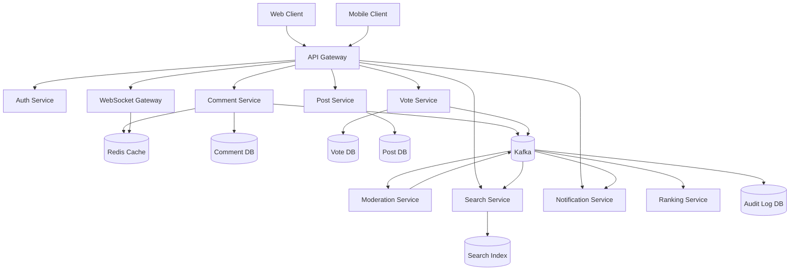

---

# 8. Core Concepts of the System

A Reddit-like thread must preserve **tree structure** and **sorting semantics** at the same time.

That means every comment should know:

* which post it belongs to
* who its parent is
* what its root thread is
* what its depth is
* what its vote score is
* what its ordering key is
* whether it is deleted or removed
* how many descendants it has
* whether children are hidden or collapsed

---

# 9. Data Model

A comment needs more than just text and author.

---

## Comment Entity

| Field             | Purpose                             |
| ----------------- | ----------------------------------- |
| comment_id        | Unique ID                           |
| post_id           | Parent post                         |
| parent_comment_id | Immediate parent                    |
| root_comment_id   | Root of subtree                     |
| author_id         | Comment owner                       |
| content           | Text body                           |
| created_at        | Ordering / sorting                  |
| updated_at        | Edit tracking                       |
| depth             | Nesting level                       |
| path              | Materialized hierarchy path         |
| score             | Vote score                          |
| upvotes           | Upvote count                        |
| downvotes         | Downvote count                      |
| reply_count       | Number of direct replies            |
| subtree_count     | Total descendants                   |
| status            | active / deleted / removed / locked |
| sort_key          | Ranking field                       |
| visibility        | public / collapsed / hidden         |

---

## Vote Entity

| Field      | Purpose                     |
| ---------- | --------------------------- |
| comment_id | Target comment              |
| user_id    | Voting user                 |
| vote_type  | upvote / downvote / neutral |
| created_at | Audit/history               |

---

## Post Entity

| Field         | Purpose            |
| ------------- | ------------------ |
| post_id       | Unique post ID     |
| author_id     | Post owner         |
| title         | Post title         |
| content       | Post body          |
| created_at    | Post creation      |
| comment_count | Number of comments |
| hot_score     | Post popularity    |

---

# 10. Tree Representation

A comment thread is a tree.

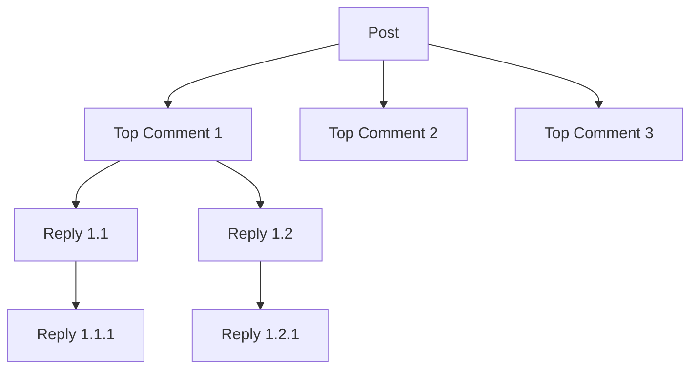

This tree is infinite in depth from the backend perspective.

The frontend may choose to render it progressively, but the backend should support unlimited nesting.

---

# 11. Why Infinite Nesting Is Difficult

If you fetch the whole tree in one request, very large posts become impossible to render efficiently.

A viral post may have:

* thousands of top-level comments
* millions of nested replies
* deep reply chains

So the system must support:

* loading root comments first
* loading replies on demand
* loading deeper levels only when expanded
* cursor-based pagination
* subtree-specific fetches

This is the only scalable way.

---

# 12. Comment Creation Flow

Creating a comment is a write operation.

It should be fast, idempotent, and safe.

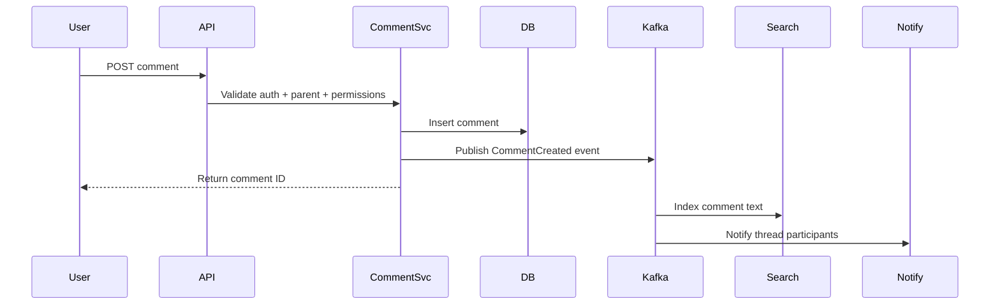

---

# 13. Why Writes Must Be Fast

On a hot post, thousands of comments may be created per second.

If every write also tried to:

* update ranking
* update search
* notify users
* recalculate subtree counts
* refresh every cache

the write path would collapse.

So the right approach is:

1. accept the comment quickly
2. store it durably
3. emit events asynchronously
4. update derived data in background

---

# 14. Comment Read Flow

Reading is harder than writing.

A user may ask:

* show top comments
* show newest comments
* show replies under a comment
* show a partial subtree
* show collapsed branches

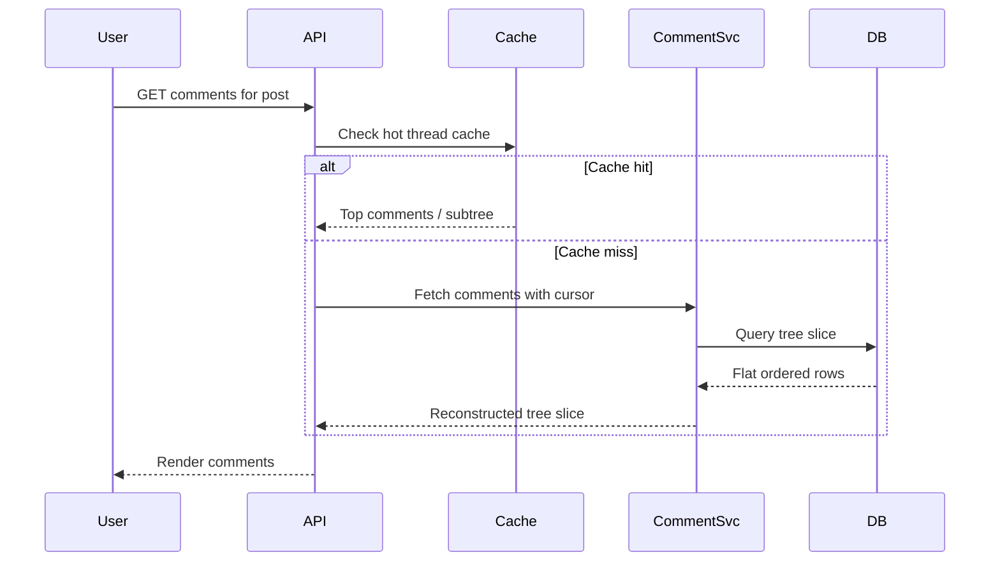

---

# 15. Pagination Strategy

Offset pagination is a bad choice for this system.

Why?

Because comment trees change constantly.

If you use offset-based pagination:

* comments can shift positions
* duplicate rows can appear
* missing rows can happen

The correct approach is **cursor-based pagination**.

---

## Cursor Example

| Cursor Field    | Meaning               |
| --------------- | --------------------- |
| last_sort_key   | Last item returned    |
| last_comment_id | Tie-breaker           |
| last_path       | Tree traversal anchor |

This gives stable pagination even as new comments arrive.

---

# 16. How to Fetch Top-Level Comments

Top-level comments are those with `parent_comment_id = NULL`.

Query pattern:

* filter by `post_id`
* filter by `parent_comment_id = NULL`
* sort by chosen mode
* return first page
* include cursor

The first page may return:

* top 20 comments
* reply count for each
* collapse state
* score
* children preview

---

# 17. How to Fetch Replies

Replies are fetched by subtree.

Example:

* user expands reply thread under comment `C1`
* system queries all descendants under that root or parent branch
* returns the next page of replies

A reply fetch API can support:

* `comment_id`
* `cursor`
* `limit`
* `depth_limit`

This allows **load more replies** behavior.

---

# 18. Sorting Modes

Reddit-style systems usually support multiple sort modes.

---

## 18.1 Best

A balance of:

* score
* recency
* engagement

This is the default ranking used to surface useful comments.

---

## 18.2 Top

Sort purely by score.

Best for:

* high-quality discussions
* archive browsing
* reputation focus

---

## 18.3 New

Sort by newest first.

Best for:

* live threads
* active discussions
* sports / breaking-news-style posts

---

## 18.4 Controversial

Sort by comments with high disagreement.

Useful when:

* many users upvote and downvote the same comment
* you want discussion tension to surface

---

## 18.5 Old

Sort chronologically.

Useful for:

* archival reading
* moderation review
* deterministic replay

---

# 19. Sorting Within a Tree

A key rule:

> Sort comments among siblings, not across the whole tree.

That means a reply should stay under its parent even if it is highly ranked.

This preserves the hierarchy while allowing sorted sibling groups.

---

# 20. Materialized Path Strategy

Materialized path is one of the best tools for this problem.

Example path:

```text
post123/c1/c2/c3
```

This lets us:

* preserve ancestry
* order descendants
* fetch subtrees efficiently
* render nested structures in sequence

---

## Path Example

| Comment | Path             |
| ------- | ---------------- |
| C1      | post123/c1       |
| C2      | post123/c1/c2    |
| C3      | post123/c1/c2/c3 |

If we fetch all rows with prefix `post123/c1`, we get the whole subtree.

---

# 21. Why Path Is Better Than Pure Parent Pointers

Parent pointers alone tell you only the immediate parent.

Path tells you:

* the full ancestry
* the depth
* traversal order
* subtree prefix

This is very useful for a nested infinite tree.

---

# 22. How Infinite Depth Works

Backend support for unlimited depth means:

* every comment may have a parent
* every comment may also have children
* path extends as needed
* depth increments automatically

The UI may choose to:

* indent visually only to a certain depth
* collapse deeper levels
* load nested children lazily

But the backend should not impose a hard structural limit unless there is a specific product reason.

---

# 23. Comment Ranking and Scores

Comments need more than raw votes.

A good system stores:

* upvotes
* downvotes
* score
* rank_score
* controversy_score
* reply_count
* age_decay factor

---

## Example Ranking Inputs

| Feature     | Effect                    |
| ----------- | ------------------------- |
| Upvotes     | Increase rank             |
| Downvotes   | Reduce rank               |
| Age         | Decay over time           |
| Reply count | Can boost engagement      |
| User trust  | Useful for ranking weight |

---

## Ranking Pipeline

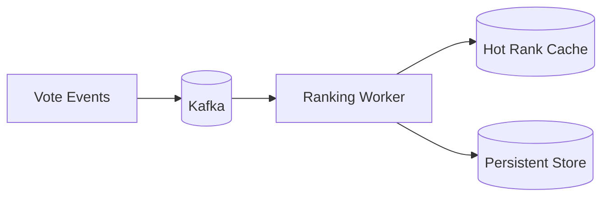

---

# 24. Why Vote Updates Should Be Async

Voting can be very hot.

If every vote immediately recalculated the entire subtree ranking synchronously:

* write latency increases
* comment service slows down
* cache churn rises
* hot posts become unstable

So:

* record vote immediately
* publish vote event
* update counters and rank asynchronously

This is a classic read/write separation problem.

---

# 25. Voting System

Voting must be:

* idempotent
* consistent per user
* reversible
* abuse-resistant

A user should be able to:

* upvote
* downvote
* remove vote
* change vote

---

## Vote State Machine

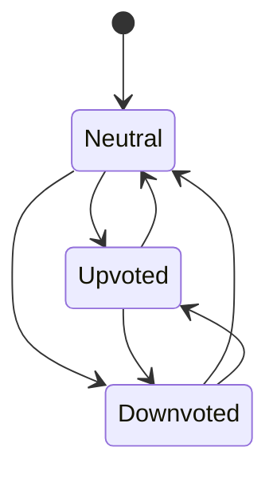

---

# 26. Vote Storage Design

A vote system usually has two layers:

| Layer              | Role         |
| ------------------ | ------------ |
| Durable vote store | Truth source |
| Hot counter cache  | Fast reads   |

This allows:

* fast rank views
* safe vote reconciliation
* replay after failures

---

# 27. Caching Strategy

Caching is essential.

Hot data:

* top comments
* comment counts
* subtree previews
* user votes
* rank summaries
* collapse state

---

## Cache Layers

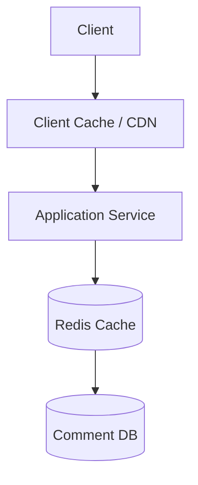

---

## What to Cache

| Data               | Why Cache It             |
| ------------------ | ------------------------ |
| Top-level comments | Read very often          |
| Top 100 comments   | Hot discussion threads   |
| Reply counts       | Needed for expand arrows |
| User vote state    | Avoid repeated DB hits   |
| Comment metadata   | Faster rendering         |

---

# 28. Hot Post Problem

A viral post may create a massive hotspot.

Problems:

* huge write volume
* huge read volume
* massive vote activity
* hot partition in DB
* cache stampede

Mitigations:

* aggressive caching
* sharded comment partitions
* async write processing
* local hot buffers
* top-comment precomputation

---

# 29. Sharding Strategy

A comment system must shard by post or thread.

Possible shard keys:

| Strategy                  | Use Case              |
| ------------------------- | --------------------- |
| post_id                   | Good for most threads |
| root_comment_id           | Good for subtrees     |
| post_id + root_comment_id | Better distribution   |
| hash(post_id)             | General distribution  |

For very hot threads, a single post may still be too large, so virtual sharding may be needed.

---

## Sharding Diagram

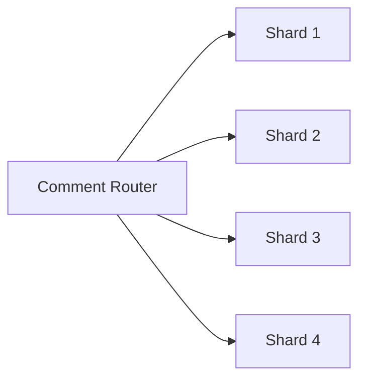

---

# 30. Partitioning by Thread

A practical model for nested comments is:

* one partition for top-level comments on a post
* one partition per root comment subtree

This balances:

* subtree locality
* query speed
* write distribution

For extremely large posts:

* introduce virtual partitions
* keep a lookup index for thread segments

---

# 31. Database Choice

Different parts of the system need different storage solutions.

| Component        | Recommended Store                   |
| ---------------- | ----------------------------------- |
| Comment metadata | Sharded SQL or distributed NoSQL    |
| Vote records     | SQL / NoSQL with unique constraints |
| Hot counters     | Redis                               |
| Search index     | Elasticsearch / OpenSearch          |
| Event stream     | Kafka                               |
| Audit logs       | Append-only store                   |
| Moderation queue | Kafka + workers                     |

A good production design often uses a hybrid database strategy.

---

# 32. Comment Schema Example

A simplified schema might look like this:

```sql
comment_id
post_id
parent_comment_id
root_comment_id
author_id
content
depth
path
score
reply_count
created_at
updated_at
status
```

This is enough to:

* rebuild the tree
* paginate efficiently
* support vote-based sorting
* preserve infinite depth

---

# 33. Edit and Delete Semantics

Deleting a comment should not destroy the tree.

Why?

Because children may still exist.

So the system should use tombstones.

---

## Tombstone Rule

If a comment is deleted:

* hide the content
* preserve the node
* keep children attached

Typical UI rendering:

* `[deleted]`
* `[removed]`

This preserves thread integrity.

---

# 34. Moderation Architecture

Moderation is critical for a Reddit-style system.

Moderation should include:

* spam filtering
* keyword detection
* abuse detection
* report queues
* auto-collapsing
* shadow banning
* content removal

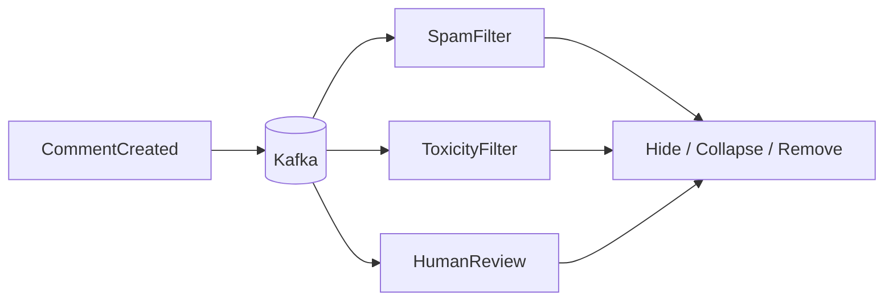

---

# 35. Why Moderation Must Be Asynchronous

If moderation is done synchronously for every comment:

* write latency increases
* user experience suffers
* moderation service becomes bottleneck

Best approach:

* accept comment
* emit event
* moderate asynchronously
* apply soft or hard actions later

---

# 36. Search System

Comments should be searchable by:

* keyword
* author
* subreddit/topic
* post
* time range
* moderation status

Use a search engine rather than the primary DB.

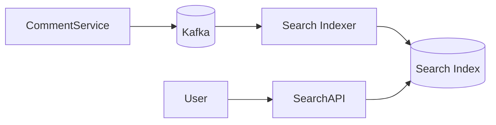

Search indexing should exclude:

* deleted comments
* removed content
* hidden moderator-only content

depending on policy.

---

# 37. Real-Time Updates

For active threads, viewers expect comments to appear instantly.

Use:

* WebSocket gateway
* Kafka fanout
* per-thread subscriptions
* backpressure handling


Real-time is useful for:

* live sports threads
* AMAs
* breaking news
* large political or event threads

---

# 38. Comment Collapse Logic

Low-score or heavily downvoted comments should collapse automatically.

Conditions may include:

* score below threshold
* too many reports
* moderation action
* thread too deep
* user preferences

Collapse state should be computed and cached for fast UI rendering.

---

# 39. Infinite Scroll and Expand on Demand

The UI should not load the entire comment tree at once.

The correct pattern is:

1. fetch top-level comments
2. fetch a preview of each reply branch
3. show “load more replies”
4. fetch subtree only when expanded

This is the only scalable way to render huge discussions.

---

# 40. Avoiding N+1 Query Problems

If every comment requires a separate database query for its children, performance collapses.

Fix:

* fetch comments in batches
* return flat rows with path/depth
* reconstruct tree in service or client
* prefetch reply counts and preview nodes

This avoids the classic N+1 problem.

---

# 41. Read Flow for a Post Page

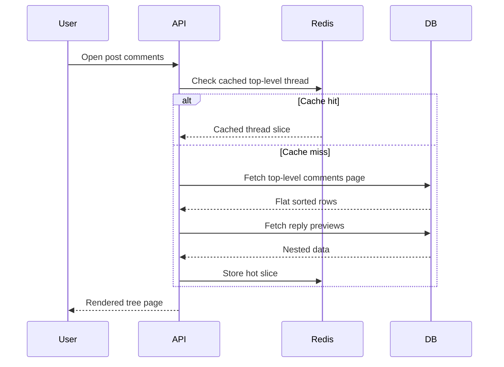

---

# 42. Consistency Model

Not every part of the system needs strong consistency.

| Feature            | Consistency Need    |
| ------------------ | ------------------- |
| Comment visibility | Strong enough       |
| Voting             | Eventual acceptable |
| Search indexing    | Eventual            |
| Collapse state     | Eventual            |
| Notifications      | Eventual            |
| Moderation action  | Strong enough       |
| ACL / permissions  | Strong              |

Access control must be correct.
Ranking can be eventually consistent.

---

# 43. Handling Race Conditions

Common races include:

* simultaneous replies
* duplicate vote submissions
* edit conflicts
* delete vs reply
* moderation vs user edit

Solutions:

* idempotency keys
* optimistic locking
* version numbers
* soft deletes
* event replay

---

# 44. API Design

---

## Post Comment

```http
POST /posts/{postId}/comments
```

Request:

```json
{
  "parentCommentId": "c123",
  "content": "I agree with this."
}
```

---

## Get Comments

```http
GET /posts/{postId}/comments?sort=best&cursor=...
```

---

## Get Replies

```http
GET /comments/{commentId}/replies?cursor=...
```

---

## Vote on Comment

```http
POST /comments/{commentId}/vote
```

---

## Edit Comment

```http
PATCH /comments/{commentId}
```

---

## Delete Comment

```http
DELETE /comments/{commentId}
```

---

# 45. Sequence for Nested Reply Creation

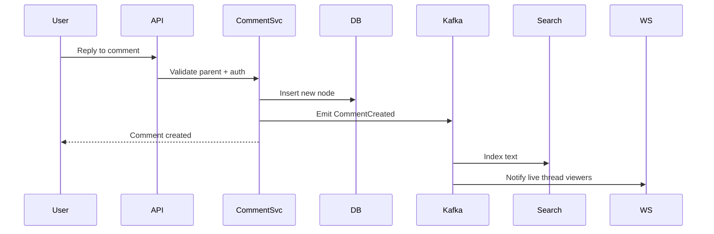

---

# 46. Why Tombstones Matter

If a parent comment disappears entirely:

* the tree breaks
* child replies lose context
* moderation history becomes confusing

So preserve the node and hide the body.

That is why comment deletion is usually a tombstone, not a hard delete.

---

# 47. Deep Nesting Concerns

Infinite depth sounds nice, but deeply nested threads can be dangerous.

Issues:

* UI indentation becomes unreadable
* rendering depth can become expensive
* recursion can overflow
* extremely long reply chains can cause usability problems

Backend can support infinite nesting, while frontend can:

* visually cap indentation
* collapse deep branches
* show “continue this thread” links

---

# 48. Ranking and Tree Preservation Together

A key design tension:

* ranking wants the best comments first
* tree structure wants replies under parents

The solution is:

* sort sibling sets by ranking
* keep hierarchical order within each subtree

This preserves both readability and relevance.

---

# 49. Event-Driven Backends

The comment system should publish events for:

* search indexing
* notification
* analytics
* moderation
* ranking updates
* cache invalidation

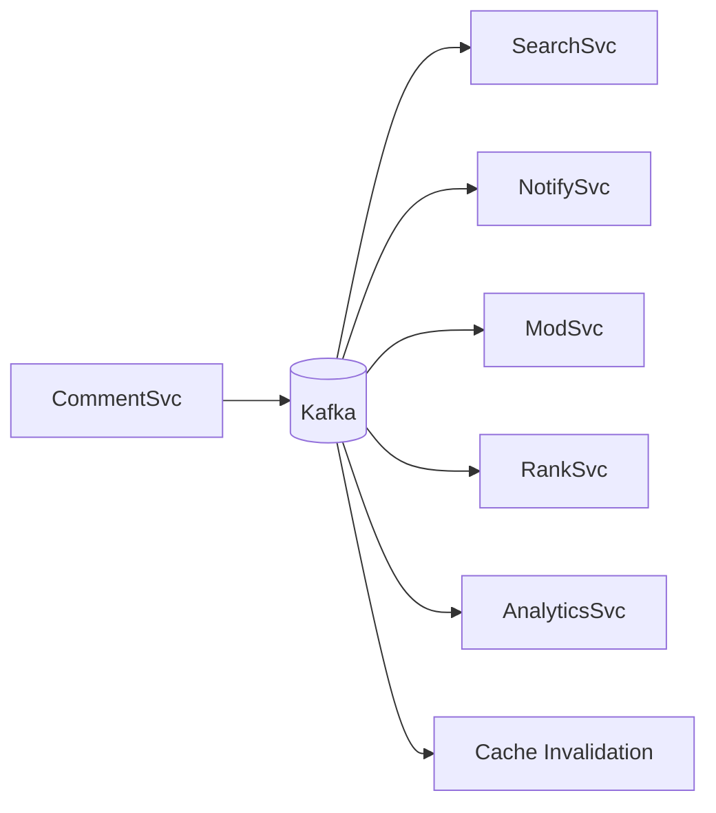

---

# 50. Observability

A large comment system needs rich monitoring.

| Metric                 | Why              |
| ---------------------- | ---------------- |
| Comment write latency  | UX               |
| Comment read latency   | Page load speed  |
| Cache hit rate         | Performance      |
| Vote lag               | Rank freshness   |
| Search indexing lag    | Discoverability  |
| Moderation queue depth | Safety           |
| WebSocket fanout rate  | Real-time health |

---

# 51. Failure Scenarios

---

## Comment DB Slowness

Mitigation:

* cache hot threads
* read replicas
* partition by post
* async derived writes

---

## Kafka Backlog

Mitigation:

* scale consumers
* add partitions
* compress events
* avoid unnecessary fanout

---

## Search Index Delay

Mitigation:

* eventual consistency
* fallback to DB for recent comments
* batch reindex jobs

---

## Cache Stampede

Mitigation:

* request coalescing
* TTL jitter
* warm caches for hot posts

---

# 52. Abuse and Spam Protection

A comment system is a spam target.

Protect against:

* bot replies
* phishing links
* repetitive spam
* vote manipulation
* brigading
* mass mention abuse

Use:

* rate limiting
* trust scores
* account age checks
* content analysis
* link sanitization
* reporting workflows

---

# 53. Friendlier UX Features

The system can support:

* sort by best/new/top/controversial
* collapse low-score branches
* show reply counts
* highlight parent context
* show “load more replies”
* thread permalinks
* comment permalink IDs

These are product features, but they affect the architecture heavily.

---

# 54. Final Production Architecture

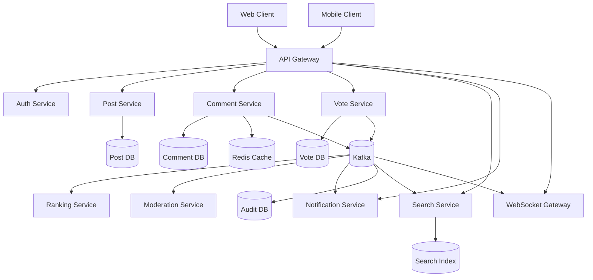

---

# 55. Tradeoffs

| Design Choice     | Benefit                    | Tradeoff                    |
| ----------------- | -------------------------- | --------------------------- |
| Adjacency list    | Simple writes              | Hard recursive reads        |
| Materialized path | Tree traversal             | Path maintenance complexity |
| Closure table     | Easy ancestor queries      | Huge storage cost           |
| Kafka events      | Decoupled processing       | Async consistency           |
| Redis cache       | Fast reads                 | Invalidation complexity     |
| Soft delete       | Preserves thread integrity | More UI logic               |

---

# 56. Why This Design Works

This design works because it does not treat comments like a simple flat list.

It treats them as what they really are:

> a large, dynamic, ordered, searchable, moderated, rank-driven tree.

That requires:

* tree-aware storage
* fast pagination
* sibling-level sorting
* event-driven updates
* cached subtree slices
* tombstones for deletions
* idempotent voting
* real-time propagation

A simple relational table alone is not enough.

A pure tree algorithm alone is not enough.

A production system must combine:

* storage
* caching
* streaming
* indexing
* moderation
* ranking
* pagination
* synchronization

---

# 57. Key Takeaways

| Concept           | Summary                                   |
| ----------------- | ----------------------------------------- |
| Nested comments   | A tree, not a flat list                   |
| Infinite nesting  | Backend supports arbitrary depth          |
| Best model        | Adjacency list + materialized path hybrid |
| Pagination        | Cursor-based, not offset-based            |
| Sorting           | Applied among siblings                    |
| Voting            | Async, idempotent, cache-backed           |
| Moderation        | Event-driven and asynchronous             |
| Search            | Dedicated search index                    |
| Real-time updates | WebSocket + Kafka                         |
| Deletes           | Tombstones, not hard deletes              |

---

# Conclusion

A Reddit-style nested infinite comment system is one of the best examples of a real production tree-processing problem.

It is hard because it must balance:

* infinite hierarchy
* fast writes
* fast reads
* ranking
* moderation
* search
* live updates
* deletions
* scalability

The most practical production approach is:

* store comments as a tree with adjacency + path metadata
* paginate using cursors
* sort siblings rather than flattening the tree
* keep vote updates async
* cache hot thread slices
* use Kafka for event propagation
* search via a dedicated index
* preserve deleted nodes as tombstones
* support infinite nesting without forcing recursive DB scans

That is how you build a Reddit-like comment system that remains fast, scalable, and reliable even under viral-scale traffic.
