A search engine looks deceptively simple.

A user types a query.
The system returns relevant results.

That is the visible surface.

Behind it, an industry-scale search engine is one of the most complex distributed systems in software.

It must:

* crawl billions of pages
* discover new content continuously
* respect robots rules and crawl politeness
* parse and normalize web content
* build massive inverted indexes
* rank results using hundreds of signals
* answer queries in tens of milliseconds
* support autocomplete, spell correction, and suggestions
* detect spam, duplication, and low-quality pages
* keep the index fresh
* scale globally across regions and languages
* remain resilient under huge traffic spikes
* serve results from distributed caches and replicated index shards

This is not just a database with full-text search.

It is a global information retrieval platform.

The hardest part is that search has two giant subsystems that behave very differently:

1. **Offline data pipeline**: crawl, fetch, parse, dedupe, classify, index, rank signal generation
2. **Online query serving**: receive query, understand intent, retrieve candidates, rank, and return results quickly

A production search engine succeeds only if both halves are designed together.

---

# 1. Introduction

## Problem statement

Design a search engine that can:

* crawl the web continuously
* index web pages, documents, and structured content
* serve query results with low latency
* rank results by relevance, quality, and freshness
* support autocomplete, spell correction, and snippets
* scale to billions of documents and high query throughput
* detect spam and duplicate pages
* handle multilingual content
* remain available under failures and large traffic spikes

## Real-world scale

A real search engine may handle:

* billions of documents
* trillions of links
* millions of crawl tasks per minute
* thousands to hundreds of thousands of queries per second
* large global traffic with users in many regions and languages
* constant index refresh and ranking updates

## Why this problem is difficult

Search is difficult because it combines:

* **massive offline batch processing**
* **real-time or near-real-time freshness**
* **complex ranking logic**
* **distributed index management**
* **tight latency budgets**
* **adversarial content and spam**
* **global scale**
* **multi-language understanding**

A search engine is judged harshly.

If results are wrong, the system is bad.
If results are slow, the system feels broken.
If the index is stale, the system feels outdated.
If spam dominates, users lose trust.

---

# 2. Functional Requirements

The system should support:

| Requirement         | Description                                     |
| ------------------- | ----------------------------------------------- |
| Web Crawling        | Discover and fetch web pages continuously       |
| URL Scheduling      | Prioritize and reschedule crawl targets         |
| Robots / Politeness | Respect crawl rules and rate limits             |
| Content Parsing     | Extract text, metadata, links, media, structure |
| Deduplication       | Detect duplicate and near-duplicate content     |
| Indexing            | Build searchable inverted indexes               |
| Query Search        | Answer text-based search queries                |
| Ranking             | Order results by relevance and quality          |
| Snippets            | Show query-relevant excerpts                    |
| Autocomplete        | Suggest search completions                      |
| Spell Correction    | Fix typos and query expansion                   |
| Freshness           | Surface recently changed content                |
| Multilingual Search | Support many languages and scripts              |
| Safe Search         | Filter unsafe or policy-restricted content      |
| Spam Detection      | Reduce link farms and keyword stuffing          |
| Cached Results      | Speed up repeated or popular queries            |
| Personalization     | Optionally adapt by region or preferences       |
| Analytics           | Track query trends and search quality           |

---

# 3. Non-Functional Requirements

| Property          | Goal                                         |
| ----------------- | -------------------------------------------- |
| Low latency       | Search responses must be fast                |
| High availability | Query serving should rarely fail             |
| Scalability       | Index and serve at global scale              |
| Freshness         | New content should appear quickly            |
| Relevance         | Search results should be useful              |
| Fault tolerance   | Indexing and serving should survive failures |
| Security          | Protect query privacy and internal systems   |
| Observability     | Monitor latency, freshness, ranking quality  |
| Cost efficiency   | Search infrastructure is expensive at scale  |
| Extensibility     | Add new ranking features and verticals       |

---

# 4. Capacity Estimation

Let us assume a large web-scale search engine.

## Assumptions

* 10 billion indexed documents
* 1 trillion discovered links
* 200 million pages crawled per day
* 100,000 queries/sec peak globally
* 20,000 autocomplete requests/sec
* 10,000 ranking updates/sec from freshness and signals
* many languages and regions

## Crawl throughput

If we crawl 200 million pages/day:

```text id="r1q7n1"
200,000,000 / 86,400 ≈ 2,315 pages/second
```

But the system must also handle:

* retries
* failed fetches
* recrawls
* politeness delays
* content changes
* burst crawl windows

So the infrastructure must be designed for much more than the raw average.

## Query throughput

At 100,000 queries/sec peak and a 100 ms budget:

* the query serving layer must be heavily cached
* index access must be highly optimized
* rank computation must be fast and parallelized

## Storage

Search storage includes:

* raw documents
* parsed text
* inverted indexes
* link graph
* term statistics
* metadata
* embeddings
* click logs
* ranking features
* crawl state

This can easily grow to many petabytes in a real world system.

## Bandwidth

Query payloads are small compared to web content fetches, but crawlers generate heavy outbound traffic.

The crawl system consumes large network bandwidth because it fetches external pages at scale.

---

# 5. High-Level Architecture

A search engine has two major planes:

1. **Crawl and indexing plane**
2. **Query serving plane**

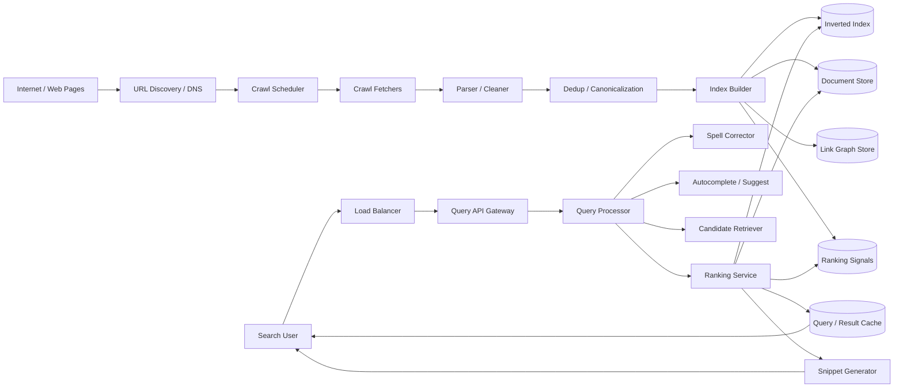

## Why this architecture works

* The **crawl pipeline** continuously discovers and processes the web.
* The **index builder** converts raw content into searchable structures.
* The **query processor** interprets the user’s search intent.
* The **ranker** retrieves and orders results using many signals.
* The **cache** reduces latency for popular queries.

---

# 6. Core Search Lifecycle

Search engines are built around two flows.

## Offline lifecycle

1. discover URLs
2. fetch pages
3. obey crawl policies
4. parse and clean content
5. normalize and deduplicate
6. extract links and metadata
7. compute ranking signals
8. build and distribute index shards

## Online lifecycle

1. user enters query
2. query is normalized
3. spell correction and suggestion may happen
4. candidate documents are retrieved
5. ranking models score documents
6. snippets and highlights are generated
7. results are returned

Search quality depends heavily on the offline side even though users only see the online side.

---

# 7. Crawling System

The crawler is the web discovery engine.

It finds pages, fetches them, and feeds the indexing pipeline.

## Responsibilities

* discover URLs from links, sitemaps, feeds, and prior crawl state
* respect `robots.txt`
* obey host-based politeness
* avoid hammering websites
* retry failed fetches
* track content changes
* prioritize important pages

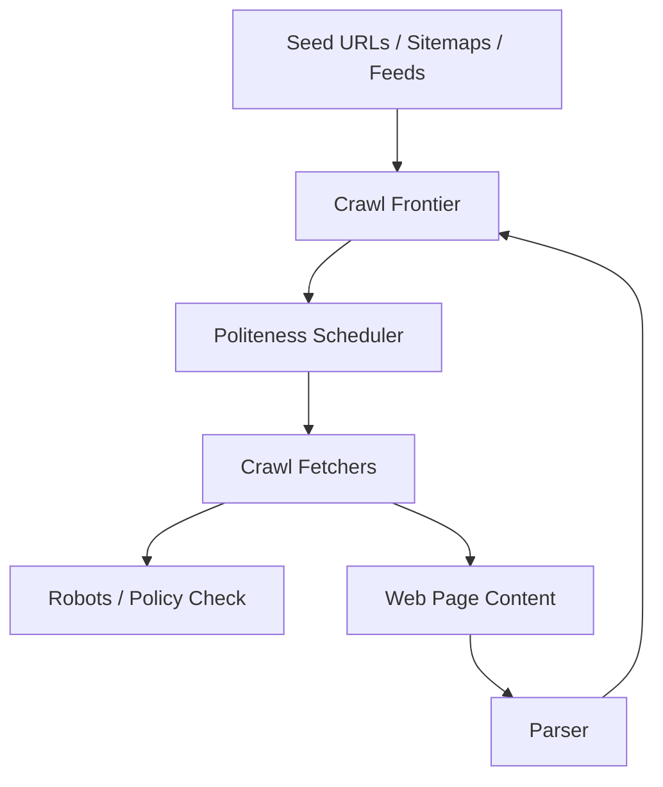

## Why crawl politeness matters

Search engines operate at massive scale.
If they ignore crawl rules, they can overload websites and become unusable to the broader web ecosystem.

### Politeness mechanisms

* per-host rate limits
* per-domain concurrency caps
* retry backoff
* adaptive fetch scheduling
* crawl delay handling
* robots rules enforcement

---

# 8. Crawl Frontier and URL Scheduling

The crawl frontier is a priority queue of URLs to fetch.

It decides:

* which URL to crawl next
* how frequently to recrawl
* which hosts need slower or faster crawl rates
* how to prioritize fresh or authoritative pages

## Scheduling signals

* page importance
* historical change frequency
* page freshness requirement
* domain trust
* backlinks and graph authority
* sitemap hints
* previous fetch success rate

The frontier is one of the most important distributed scheduling systems in the platform.

---

# 9. Parsing and Content Extraction

After fetching a page, the parser converts raw HTML into structured data.

## Parser responsibilities

* strip boilerplate
* extract main content
* extract title and meta description
* extract canonical URLs
* extract headings and semantic structure
* extract hyperlinks
* detect language
* normalize text
* identify media and structured data

## Why parsing is hard

The web is messy:

* duplicate content
* ads and navbars
* dynamically rendered pages
* scripts and trackers
* malformed HTML
* multilingual content

The parser must isolate useful content from noise.

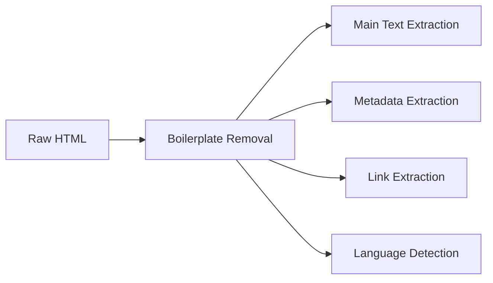

---

# 10. Deduplication and Canonicalization

The web contains a huge amount of duplicate or near-duplicate content.

Examples:

* the same page with different tracking parameters
* mirrored articles
* printer-friendly variants
* syndicated copies
* content copied across domains

## Why dedupe matters

Without deduplication:

* the index wastes space
* search results look repetitive
* ranking quality drops
* users see multiple versions of the same content

## Canonicalization

The system must choose the canonical version of a page when multiple URLs map to essentially the same content.

Techniques:

* canonical link tags
* normalized URL parameters
* content hashes
* near-duplicate detection using shingles or fingerprints

---

# 11. Inverted Index

The inverted index is the core search data structure.

Instead of storing document-to-words, it stores word-to-documents.

Example:

* term: `distributed`
* postings list: `[doc7, doc19, doc51, doc120]`

## Why inverted indexes are used

They make term lookup fast.
A query can be matched against the terms efficiently without scanning every document.

## Basic structure

* dictionary of terms
* postings lists per term
* term frequencies
* document frequencies
* positional indexes for phrase search
* field-level indexes for title/body/anchor text


---

# 12. Index Compression and Sharding

A real index is too large for a single machine.

It must be:

* compressed
* partitioned
* replicated
* cached

## Compression

Postings lists are compressed with techniques such as:

* delta encoding
* variable-byte encoding
* block compression
* skip pointers

## Sharding

The index is split across many machines.

Common approaches:

* term-based sharding
* document-based sharding
* hybrid schemes

### Practical tradeoff

Search engines often use document-based sharding for serving and specialized indexing pipelines for building the shards.

---

# 13. Document Store

The inverted index points to documents, but the search engine also needs raw or semi-structured document data.

The document store may contain:

* title
* snippet text
* URL
* language
* metadata
* crawl timestamp
* authority signals
* structured fields
* content hash
* page quality score

The doc store supports:

* snippet generation
* result rendering
* ranking feature lookups
* freshness checks
* caching

---

# 14. Link Graph and Authority Signals

Web search is not only about matching words.

It also relies heavily on the link graph.

Pages that many authoritative pages link to are often more important.

## Link graph uses

* page importance
* authority estimation
* spam detection
* freshness propagation
* topic clustering

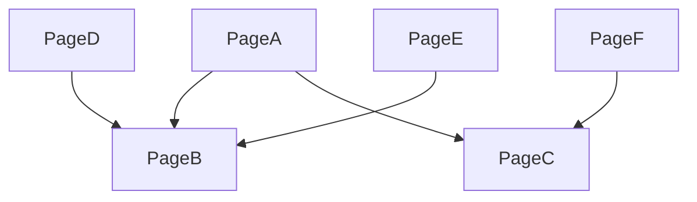

## Why link analysis matters

The same query can match many pages, but the link graph helps separate authoritative sources from low-quality pages.

This is one of the classic ways search engines improve ranking quality.

---

# 15. Ranking System

Ranking is the heart of search quality.

A search engine does not just retrieve matching documents.
It orders them by usefulness.

## Ranking inputs

* term match
* title match
* field boosts
* link authority
* freshness
* page quality
* location relevance
* query intent
* click behavior
* language match
* spam score
* device/context sensitivity
* personalization signals where permitted

## Ranking pipeline

1. candidate retrieval
2. coarse ranking
3. fine ranking
4. snippet generation
5. final result assembly


### Why multiple ranking stages

Because ranking the entire web for every query is too expensive.

The system first narrows down to a candidate set, then applies more expensive ranking to the best candidates.

---

# 16. Query Processing

When a user types a query, the system must interpret it quickly.

## Query preprocessing

* lowercase normalization
* tokenization
* stemming or lemmatization
* stopword handling
* language detection
* intent classification
* typo correction

## Query intent

Search engines often infer:

* navigational intent: user wants a specific site
* informational intent: user wants knowledge
* transactional intent: user wants to buy or act
* local intent: user wants nearby results

This affects ranking and snippet composition.

---

# 17. Spell Correction and Query Suggestions

Users often mistype queries.

A search engine should still help.

Examples:

* `restuarant near me` → `restaurant near me`
* `gogle docs` → `google docs`

## Techniques

* edit distance
* term frequency
* language models
* query logs
* popularity statistics
* context-aware correction

Autocomplete is closely related.

It predicts likely completions based on:

* query popularity
* prefixes
* recency
* trending topics
* personalization signals

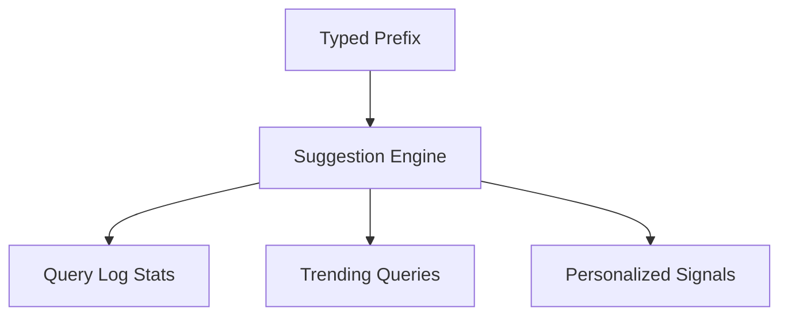

---

# 18. Snippet Generation

The snippet is the short text under a search result.

It should show the part of the document most relevant to the query.

## Why snippets matter

A good snippet helps the user decide whether to click.

## Snippet generation steps

* find query terms in the document
* extract surrounding context
* rank candidate passages
* format highlighted excerpt
* avoid showing sensitive or noisy content

A search result is not only about ranking.
It is also about explaining relevance.

---

# 19. Freshness and Recrawl Strategy

Some pages change frequently.

Examples:

* news
* sports scores
* stock or market pages
* social content
* product pages
* weather pages

## Why freshness matters

If the index is stale, search quality suffers.

## Recrawl strategy

The system should recrawl pages based on:

* update frequency
* authority
* change history
* importance
* user demand
* topic sensitivity

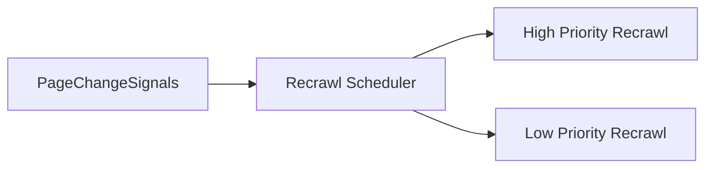

A news article may need frequent recrawl.
A static encyclopedia page may need less frequent recrawl.

---

# 20. Search Result Serving

The query serving path must be extremely fast.

## Query serving steps

1. receive query
2. normalize and detect language
3. check caches
4. compute or fetch autocomplete
5. retrieve candidates from index shards
6. score candidates
7. generate snippets
8. filter unsafe or blocked results
9. assemble page response
10. return results

The entire path must often fit in a very small latency budget.

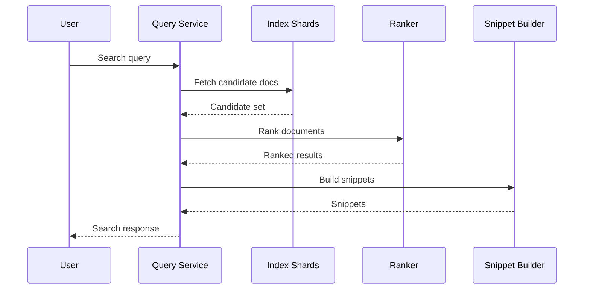

---

# 21. Caching Strategy

Search engines live on caching.

## Cache layers

* query result cache
* autocomplete cache
* snippet cache
* document metadata cache
* popular page cache
* index metadata cache
* embedding/vector cache

## Why caching is essential

Popular queries repeat constantly.
Caching can reduce latency and backend load dramatically.

### Cache invalidation

Search is hard because freshness matters.
Caches need:

* short TTLs for dynamic content
* invalidation triggers when documents change
* stale-while-revalidate behavior for some use cases

---

# 22. Search Quality Signals

Ranking is based on many signals.

## Examples

* exact term matches
* document authority
* click-through rate
* dwell time
* freshness
* content depth
* page load quality
* content readability
* spam score
* user satisfaction signals
* language match
* device compatibility

These signals are computed offline and attached to documents or query-document pairs.

---

# 23. Spam Detection and Quality Control

A search engine is constantly attacked by spam.

Examples:

* keyword stuffing
* link farms
* duplicate content
* cloaking
* doorway pages
* malicious redirects
* scraped content
* low-quality AI spam

## Spam protection strategies

* content classifiers
* link graph anomaly detection
* duplicate detection
* domain trust scoring
* behavioral signals
* manual review pipelines

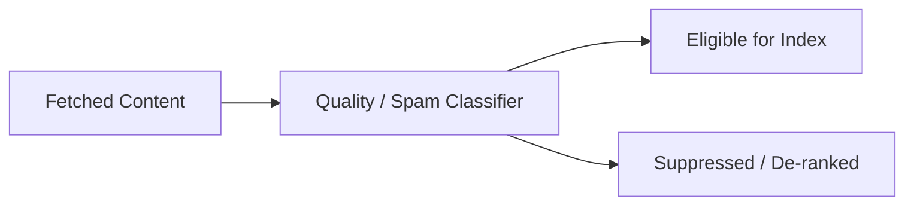

Quality control is not optional.
Without it, search rapidly degrades.

---

# 24. Multilingual Search

Search engines must support many languages and scripts.

## Challenges

* tokenization differences
* stemming differences
* script normalization
* transliteration
* language-specific ranking
* multilingual query intent

For example, a Chinese, Arabic, or Japanese search cannot be treated the same as English.

## Language-aware indexing

The system should:

* detect document language
* index terms with language-specific analyzers
* store locale-aware signals
* route query handling based on user language

---

# 25. Vertical Search

Real search engines often support more than web search.

They may also support:

* images
* videos
* news
* maps
* shopping
* books
* academic content
* enterprise documents

The architecture can reuse the same crawl, index, and rank platform with specialized vertical indexes and ranking features.

---

# 26. Ads and Monetization

A search engine may integrate sponsored results.

This is not part of core relevance, but it is part of many production systems.

Sponsored results must be:

* clearly labeled
* auction-ranked
* policy-compliant
* separated from organic ranking logic

The ad system should not contaminate core organic relevance ranking.

---

# 27. Data Storage Design

A search engine uses multiple specialized stores.

## Common stores

| Data                     | Storage                             |
| ------------------------ | ----------------------------------- |
| Raw crawled pages        | Object storage                      |
| Parsed text and metadata | Document store                      |
| Inverted indexes         | Sharded search index store          |
| Link graph               | Graph store / distributed KV        |
| Query logs               | Event stream + warehouse            |
| Ranking features         | Feature store / key-value store     |
| Embeddings               | Vector DB                           |
| Crawl frontier           | Distributed queue / scheduler store |

### Why so many stores

Because no single database is ideal for:

* raw pages
* search access
* link graph traversal
* analytics
* ranking feature retrieval

Each subsystem needs a different access pattern.

---

# 28. Consistency Model

Search engines usually use **eventual consistency** for the index.

## Why eventual consistency is acceptable

If a newly crawled page appears a few seconds or minutes later, the system is still useful.

Users care more about relevance and scale than strict immediate consistency for every page.

## Where stronger consistency is needed

* crawl frontier state
* deduplication decisions
* index segment publishing
* config and policy controls
* permission or safety rules in specialized verticals

The search system is a great example of a platform where eventual consistency is the right tradeoff for most of the data plane.

---

# 29. Replication and Sharding

The index must be split across many nodes.

## Sharding approaches

* by document ID
* by term range
* by language or region
* by hybrid distribution of documents

## Replication

Every index shard should have replicas for:

* query availability
* load balancing
* failover
* rolling upgrades

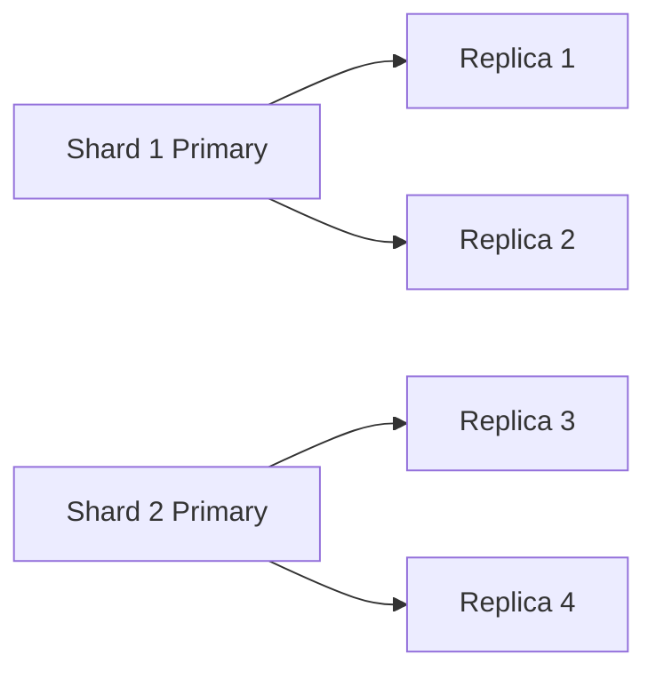

Replication allows the system to answer queries even when a node fails.

---

# 30. Fault Tolerance

Failures happen constantly in large distributed systems.

## Failure scenarios

* crawler failures
* parser crashes
* index build failures
* shard corruption
* query node failure
* cache evictions
* network partitions
* data center outage

## Recovery mechanisms

* retry queues
* idempotent indexing jobs
* shard replication
* checkpointing
* rebuild from logs and snapshots
* traffic rerouting
* degraded mode serving

Search engines should always prefer degraded availability over complete outage.

---

# 31. Index Update Pipeline

Updates should move through a robust pipeline.

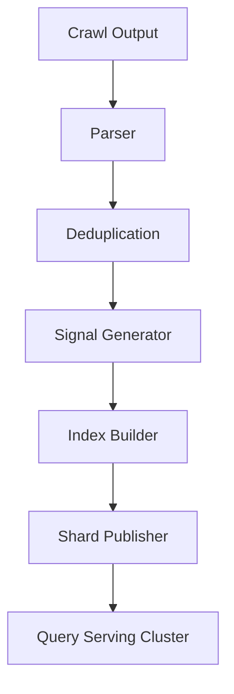

## Why publishing matters

The serving cluster should read stable published shards, not partially built indexes.

That prevents corruption and inconsistent query behavior.

---

# 32. Query Logs and Feedback Loop

A modern search engine learns from user behavior.

## Query logs can provide

* popular queries
* click behavior
* abandoned searches
* reformulation patterns
* result satisfaction signals

These logs feed:

* ranking improvement
* spell correction
* autocomplete
* trend detection
* quality analysis

This creates a feedback loop that helps improve the system over time.

---

# 33. Observability

A search engine needs deep observability.

## Important metrics

| Metric                      | Why it matters      |
| --------------------------- | ------------------- |
| Query latency               | User experience     |
| Index freshness lag         | Content recency     |
| Crawl fetch success rate    | Crawl health        |
| Crawl politeness violations | Policy safety       |
| Index build time            | Pipeline throughput |
| Cache hit rate              | Cost and latency    |
| Result CTR                  | Search quality      |
| Query abandonment           | Relevance signal    |
| Shard imbalance             | Serving efficiency  |
| Spam suppression rate       | Quality control     |

Logs, traces, and dashboards should be available for both serving and indexing pipelines.

---

# 34. Security Architecture

Search engines must be secure too.

## Security requirements

* secure internal service-to-service communication
* access control for admin tools
* rate limiting for public APIs
* privacy-preserving query handling where appropriate
* isolation of crawl infrastructure
* safe handling of malicious pages
* sandboxed parsing of untrusted content

### Why this matters

The crawler fetches arbitrary external content.
That content may be malicious.

The parser and indexing stack must not trust it.

---

# 35. Advanced Optimizations

## 35.1 Two-stage retrieval

Use a fast first-pass retrieval stage, then a more expensive ranker on a smaller candidate set.

## 35.2 Field-aware indexes

Index title, body, anchor text, and structured fields separately.

## 35.3 Query rewrite

Expand short or ambiguous queries using query logs and language models.

## 35.4 Freshness boosting

Boost recently changed pages for time-sensitive queries.

## 35.5 Vector search augmentation

Use embeddings for semantic retrieval and hybrid ranking.

## 35.6 Personalization

If allowed, incorporate region, language, or history-based ranking features.

---

# 36. Bottlenecks and Solutions

| Bottleneck       | Cause                 | Solution                                |
| ---------------- | --------------------- | --------------------------------------- |
| Crawl flood      | Too many URLs         | Frontier prioritization and politeness  |
| Parsing failures | Malformed web content | Sandboxing and fallback parsers         |
| Index build lag  | Heavy updates         | Batch indexing and distributed builders |
| Query latency    | Large candidate sets  | Two-stage ranking and caching           |
| Shard hotspots   | Popular queries       | Replicas and cache layers               |
| Spam overload    | Adversarial content   | Quality classifiers and link analysis   |
| Freshness delay  | Slow recrawls         | Adaptive recrawl scheduling             |

---

# 37. Multi-Region Architecture

Search is global.

The system should support:

* regional query serving
* local caches
* mirrored index replicas
* globally coordinated crawl pipeline
* disaster recovery between regions

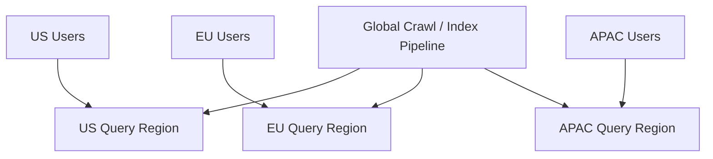

### Tradeoff

Regional search quality can differ slightly due to freshness and replication delays, but latency improves significantly.

---

# 38. Final Architecture Diagram

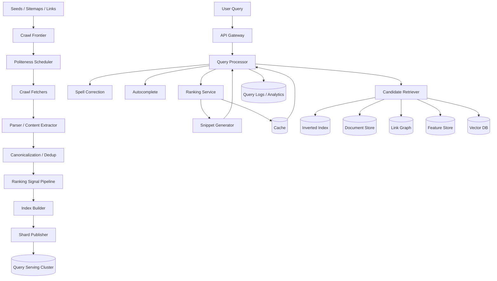

---

# 39. Conclusion

A complete search engine like Google is one of the most sophisticated large-scale distributed systems ever built.

It must combine:

* web-scale crawling
* robust parsing
* deduplication
* inverted indexing
* ranking science
* query understanding
* low-latency serving
* caching
* spam detection
* freshness management
* multilingual support
* multi-region fault tolerance

The central design principles are:

* **separate crawl/index pipelines from query serving**
* **use inverted indexes for fast retrieval**
* **use multiple ranking stages**
* **cache aggressively but carefully**
* **treat quality and spam as first-class problems**
* **replicate and shard everything at scale**
* **accept eventual consistency where it makes sense**
* **optimize for latency, freshness, and trust together**

A great search engine is not just fast.

It is fast, relevant, fresh, resilient, and hard to fool.

That is what makes search one of the most challenging and important systems in the industry.
