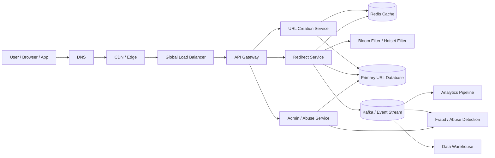
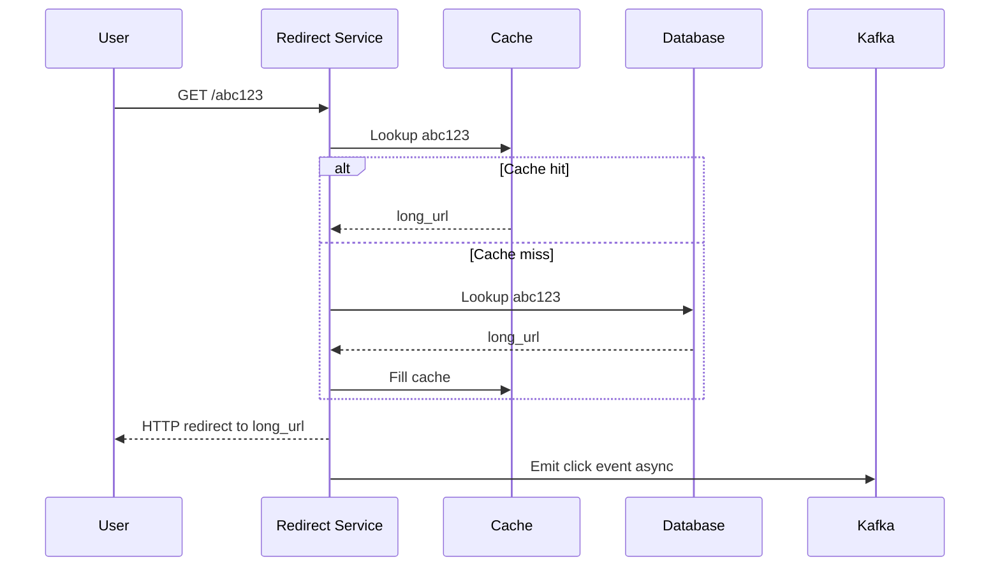
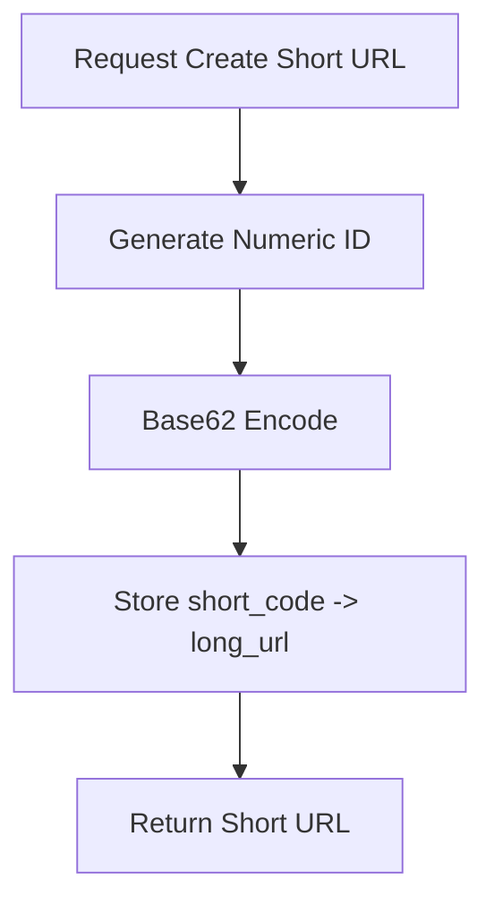
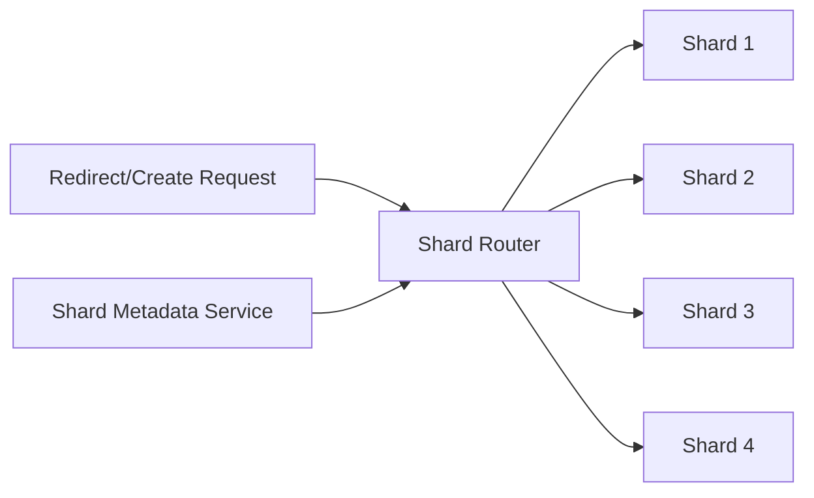
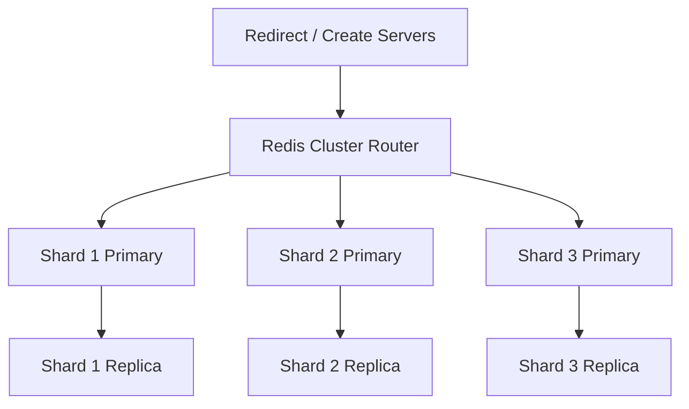
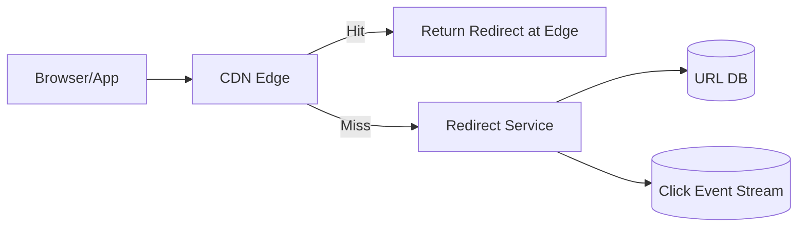
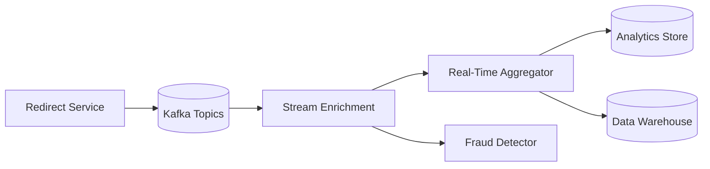
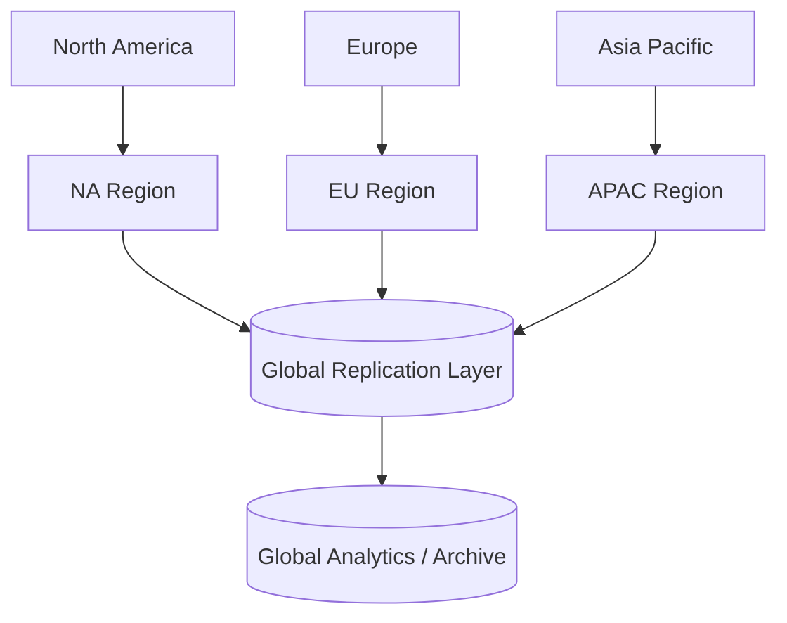
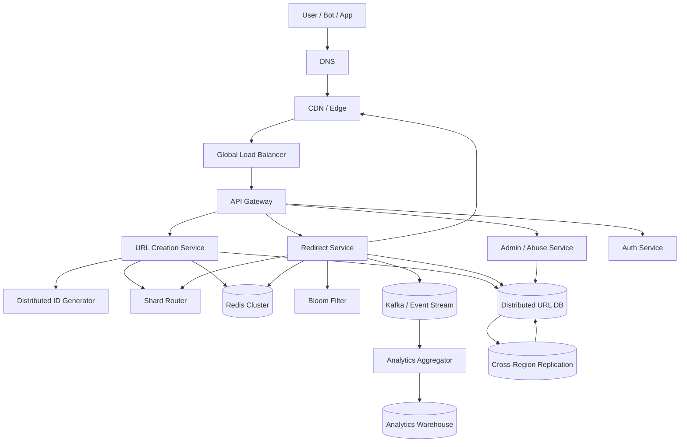

A URL shortener seems simple at first.

A user submits a long URL.
The system returns a short one.
Someone clicks it.
They get redirected to the original destination.

That is the user-facing behavior.

Behind it, a production URL shortener is a **read-heavy, latency-critical distributed system** that must handle:

* billions of redirects
* extreme burst traffic from viral links
* custom aliases
* expiration and deletion
* abuse prevention and safe browsing
* durable storage
* analytics collection
* CDN and edge optimization
* multi-region availability
* disaster recovery
* fast and safe short code generation

The core principle is simple:

> Creating short URLs is easy. Serving billions of redirects reliably is the hard part.

---

# 1. Introduction

## Problem statement

Build a URL shortener that can:

* accept long URLs
* generate short links
* redirect users quickly
* support custom aliases
* expire links
* collect click analytics
* prevent abuse and malicious URLs
* scale to internet traffic
* remain available across regions

## Real-world scale

A serious URL shortener may see:

* tens or hundreds of millions of shortened URLs
* billions of redirect requests
* read traffic that dwarfs write traffic
* sudden traffic spikes when links go viral

## Why this problem is difficult

The hard parts are not URL parsing or database inserts.

The hard parts are:

* generating unique short codes at scale
* keeping redirect latency extremely low
* preventing one viral link from overwhelming origin infrastructure
* supporting analytics without slowing redirects
* handling spam, phishing, and abuse
* keeping the service online during partial region failures

A good URL shortener is really a **global redirect and tracking platform**.

---

# 2. Functional Requirements

| Requirement      | Description                               |
| ---------------- | ----------------------------------------- |
| Shorten URL      | Convert a long URL into a short code      |
| Redirect         | Resolve short code to original URL        |
| Custom Alias     | Allow user-chosen short path              |
| Expiration       | Support TTL or expiry date                |
| Analytics        | Track clicks, geography, device, referrer |
| Link Management  | Update, disable, delete, restore          |
| User Accounts    | Own and manage created links              |
| Abuse Prevention | Block malware, spam, phishing             |
| Rate Limiting    | Prevent API abuse and link flooding       |
| Admin Controls   | Review and disable malicious links        |
| Custom Domains   | Support branded domains                   |

---

# 3. Non-Functional Requirements

| Property          | Goal                                |
| ----------------- | ----------------------------------- |
| Low latency       | Redirect should be near instant     |
| High availability | Service should survive failures     |
| Scalability       | Must support huge redirect traffic  |
| Durability        | Links must not be lost              |
| Consistency       | Redirects must resolve correctly    |
| Security          | Block malicious or illegal URLs     |
| Observability     | Measure redirect latency and health |
| Cost efficiency   | Keep redirects cheap to serve       |

---

# 4. Capacity Estimation

Let us assume a global-scale service.

## Assumptions

* 100 million shortened links
* 5 billion redirects per day
* 50 million create requests per day
* 99% of traffic is redirect traffic
* 1% or less is write traffic

## Request rate

For 5 billion redirects/day:

```text
5,000,000,000 / 86,400 ≈ 57,870 redirects/sec average
```

Peak traffic could be 5x–20x higher due to viral links, social amplification, or campaigns.

So the platform should be designed for:

* tens of thousands of redirects/sec average
* hundreds of thousands or more during peaks

## Storage estimate

Assume each link record stores:

* short code
* original URL
* metadata
* owner info
* timestamps
* status
* expiration
* analytics counters

A record can easily be 300–1000 bytes depending on indexing and metadata.

For 100 million links at ~500 bytes each:

```text
100,000,000 × 500 bytes = 50,000,000,000 bytes ≈ 50 GB raw
```

With replicas, indexes, and backups, real operational storage is much higher.

---

# 5. High-Level Architecture



## Why this architecture works

* The **API Gateway** protects the backend and handles routing.
* The **Creation Service** handles short code generation and validation.
* The **Redirect Service** is optimized for extremely fast lookups.
* The **Cache** absorbs most redirect traffic.
* The **Bloom Filter** helps avoid pointless DB lookups for nonexistent codes.
* **Kafka** decouples click tracking from the redirect path.
* **Analytics** runs asynchronously so redirects stay fast.

---

# 6. Core System Principle

A URL shortener should be designed around this principle:

> redirect path must be faster than analytics path.

That means:

* redirects must not wait for click tracking writes
* analytics must be async
* cache should be the first lookup layer
* DB should be the fallback layer
* failure in analytics must never break redirect

This is a classic production design rule.

---

# 7. API Design

## 7.1 Create short URL

`POST /v1/shorten`

### Request

```json
{
  "long_url": "https://www.example.com/articles/designing-distributed-systems/deep-dive",
  "custom_alias": "systemdesign",
  "expire_at": "2026-12-31T23:59:59Z"
}
```

### Response

```json
{
  "short_url": "https://sho.rt/systemdesign",
  "short_code": "systemdesign",
  "long_url": "https://www.example.com/articles/designing-distributed-systems/deep-dive",
  "status": "active"
}
```

## 7.2 Redirect

`GET /{short_code}`

### Redirect flow



## 7.3 Link analytics

`GET /v1/links/{short_code}/stats`

Returns:

* total clicks
* clicks by country
* clicks by device
* clicks by date
* referrers
* browser breakdown

## 7.4 Update link

`PATCH /v1/links/{short_code}`

Used to:

* change destination
* update expiration
* disable link

---

# 8. Database Design

The database stores the mapping between short code and long URL.

## Main URL table

| Column      | Type      | Description                        |
| ----------- | --------- | ---------------------------------- |
| short_code  | string    | Unique short identifier            |
| long_url    | text      | Destination URL                    |
| user_id     | string    | Owner                              |
| created_at  | timestamp | Creation time                      |
| expire_at   | timestamp | Expiry time                        |
| status      | string    | active, disabled, deleted, expired |
| is_custom   | boolean   | Whether alias is custom            |
| click_count | bigint    | Aggregate counter                  |
| checksum    | string    | Integrity check                    |

## Analytics table

Analytics should usually not live in the primary OLTP database if volume is high.

A separate analytics store should hold:

* click events
* country
* device
* browser
* referrer
* timestamp
* IP hash or anonymized region tags

This keeps the primary write path clean.

---

# 9. Base62 ID Generation Deep Dive

This is one of the most important design choices.

The system needs a short code that is:

* compact
* URL-safe
* unique
* fast to generate
* easy to decode
* scalable under high concurrency

## Why Base62 is a strong fit

Base62 uses:

* lowercase letters
* uppercase letters
* digits

That gives 62 symbols and makes codes much shorter than decimal or hex.

Example:

* internal ID: `987654321`
* Base62 code: `g5Hk2`

The code is shorter, easy to embed in URLs, and avoids punctuation.

---

## Base62 math

If the code length is 6 characters:

```text
62^6 ≈ 56 billion
```

That is enough space for very large scale.

If length is 7:

```text
62^7 ≈ 3.5 trillion
```

That gives even more room for future growth.

---

## Recommended generation pipeline

The cleanest production approach is:

1. generate a unique numeric ID
2. encode it into Base62
3. store mapping from short code to long URL
4. enforce a unique index on short code



---

## Numeric ID generation strategies

### 1. Central sequence service

A dedicated sequence allocator returns monotonically increasing IDs.

Pros:

* simple
* deterministic
* easy to reason about

Cons:

* can become a bottleneck
* needs strong availability

### 2. Block allocation

Each app node gets a block of IDs.

Example:

* node A gets 1,000,000–1,999,999
* node B gets 2,000,000–2,999,999

Pros:

* low contention
* good throughput

Cons:

* unused blocks may be wasted on node failure

### 3. Snowflake-style IDs

Combine timestamp, machine id, and sequence bits.

Pros:

* highly scalable
* distributed
* no single writer bottleneck

Cons:

* requires clock discipline
* more engineering complexity

### Recommended choice

For a URL shortener, **block allocation or Snowflake-style IDs** are the most practical at high scale.

---

## Collision handling

Even with strong ID generation, the database should still enforce uniqueness.

If the generated short code already exists:

* retry generation
* generate a new numeric ID
* store again

Because uniqueness is enforced at the DB layer, the system remains correct even under rare collisions.

---

## Custom alias handling

Custom aliases bypass automatic generation.

Example:

* user requests `/systemdesign`
* service checks reserved words
* validates uniqueness
* writes alias as the primary short code

Custom aliases should be treated as a controlled namespace, often with stricter validation and abuse checks.

---

# 10. Distributed Sharding Deep Dive

At scale, the link store cannot stay on one machine or even one database primary.

It must be partitioned.

## Sharding goals

* distribute load evenly
* avoid hot partitions
* support horizontal scale
* keep lookup latency low
* allow independent shard growth

## Recommended shard key

For auto-generated codes, a hash of `short_code` is usually a good choice:

```text
shard = hash(short_code) % N
```

This spreads records evenly.

---

## Why not shard by creation time

Creation time can create hot ranges because newly created links are accessed heavily right away.
That makes time-based sharding risky.

## Why not shard by user_id only

User-based sharding can be helpful for dashboards and ownership views, but viral links might all belong to one user or one campaign, creating a hotspot.

---

## Shard metadata service

The platform should maintain metadata about:

* shard map
* shard health
* shard replicas
* ownership
* rebalancing state



The router decides where the lookup or write should go.

---

## Consistent hashing

Consistent hashing helps reduce reshuffling when shards are added or removed.

That matters because shard rebalancing can otherwise become expensive.

### Benefits

* fewer keys move during resharding
* better operational stability
* easier scale-out

### Tradeoff

* more complex routing layer
* still requires rebalancing tools and observability

---

## Hot partition mitigation

A viral link can cause a huge hotspot.

Mitigations:

* cache aggressively
* place hot keys in Redis and CDN
* replicate read traffic
* isolate viral campaigns by region
* rate limit abusive scanners
* autoscale redirect workers

---

# 11. Redis Cluster Topology Deep Dive

Redis is crucial in a URL shortener because redirects are read-heavy and latency-sensitive.

## What Redis stores

Typical Redis keys:

* `short_code -> long_url`
* `short_code -> status`
* `short_code -> expire_at`
* `short_code -> redirect_policy`
* `user_id -> quota`
* `ip -> rate limit state`

Redis is used as:

* read cache
* rate limiting store
* hot-key buffer
* negative cache for invalid or expired codes

---

## Cluster topology

A healthy Redis topology usually includes:

* multiple shards
* replicas per shard
* automatic failover
* read routing based on slot ownership



---

## Why Redis works here

Redirects are:

* highly repetitive
* small in payload
* ideal for memory lookup
* extremely latency-sensitive

Redis provides:

* sub-millisecond lookup in many cases
* very high throughput
* simple TTL handling
* atomic counters and rate limiting

---

## Cache patterns

### Cache-aside

Redirect service checks Redis first. If miss, it queries the DB and writes back to cache.

### Write-through

Creation service writes to DB and Redis together.

### Negative caching

If a short code does not exist, store a short-lived negative entry to avoid repeated DB misses.

---

## Hot-key handling

A viral short code can create a single Redis hotspot.

Mitigations:

* replicate hot keys across multiple read nodes
* use local in-process hot cache
* cache at CDN edge
* shard by code hash
* separate read and write paths where possible

---

## Redis failure behavior

If Redis is down:

* redirect service falls back to DB
* DB read load increases
* autoscaling may be necessary
* caches refill after recovery

The system should continue to function even during cache degradation.

---

# 12. CDN Redirect Caching Deep Dive

CDN helps not just with media delivery but also with redirect acceleration.

## When CDN helps

* stable, permanent redirects
* popular marketing links
* branded domains
* repeated global traffic from many users

## What CDN can cache

A CDN can cache:

* 301 responses
* 302 responses with a suitable TTL
* header metadata
* edge redirect logic for ultra-hot links

## Important caveat

You must be careful with cache control:

* do not cache expired or disabled links too long
* do not cache personal or security-sensitive redirects without policy
* do not let stale redirects keep sending users to old destinations

---

## Edge redirect flow



---

## Why edge caching is valuable

If a link goes viral:

* edge can absorb a huge fraction of requests
* origin load drops sharply
* latency improves for distant users
* backend becomes more resilient

---

## Cache invalidation

If a short link changes destination or expires:

* cache entries must be invalidated quickly
* TTLs should be short for mutable links
* control plane should propagate invalidation events to CDN and Redis

That is essential to avoid stale redirects.

---

# 13. Analytics Schema Deep Dive

Analytics should not be mixed into the core redirect path.

## Why

Redirects must be fast.
Analytics can be slightly delayed.

A separate analytics pipeline provides:

* click counts
* geolocation
* device/browser breakdown
* referrer analysis
* campaign performance
* fraud detection inputs

---

## Event schema

A click event can look like this:

| Field           | Type      | Notes                        |
| --------------- | --------- | ---------------------------- |
| event_id        | string    | Unique event identifier      |
| short_code      | string    | Link being clicked           |
| clicked_at      | timestamp | Event time                   |
| user_agent_hash | string    | Privacy-friendly fingerprint |
| country         | string    | Geo from IP                  |
| region          | string    | Region grouping              |
| device_type     | string    | mobile, desktop, tablet      |
| browser         | string    | Optional classification      |
| referrer        | string    | Source URL if available      |
| response_code   | int       | 301/302/404/410              |
| is_bot          | boolean   | Bot detection output         |

---

## Event pipeline



---

## Aggregation levels

Analytics can be computed at different layers:

* per-minute click counts
* per-hour and per-day rollups
* per-country aggregates
* per-campaign conversion metrics
* per-device trend analytics

## Why rollups matter

You do not want every dashboard query to scan raw click events.
Rollups keep dashboards fast and cheap.

---

## Privacy considerations

Analytics should be privacy-aware:

* hash or truncate IPs
* minimize personally identifying data
* define retention policies
* support data deletion requests where required

---

# 14. Multi-Region Failover Deep Dive

A global URL shortener must stay available even when a region fails.

## Goals

* keep redirects working during regional outages
* keep writes durable
* preserve analytics pipeline continuity
* reduce latency through regional affinity
* allow fast recovery after failover

---

## Multi-region topology



---

## Read and write ownership

A practical design is:

* writes go to a primary region or primary shard owner
* reads are served locally whenever replication lag allows
* analytics can be eventually consistent across regions

## Failover strategy

When a region fails:

1. global traffic is rerouted
2. read traffic shifts to healthy replicas
3. write traffic routes to surviving primary ownership
4. caches are rebuilt or warmed in the new active region
5. telemetry and error rates are monitored closely

---

## Data replication model

The URL mapping itself must be durable and replicated.
A good design is:

* synchronous durability within a region
* asynchronous replication cross-region
* conflict-free ownership model for writes
* strong uniqueness checks for short codes

This avoids split-brain problems and keeps writes safe.

---

## Disaster recovery

The system should support:

* point-in-time recovery
* backup restoration
* replay from event logs
* replay of click analytics
* rehydration of cache and hotset data

---

# 15. Link Lifecycle and Consistency

A link can move through several states.

| State       | Meaning                        |
| ----------- | ------------------------------ |
| pending     | Being created                  |
| active      | Redirect resolves successfully |
| expired     | Expiration time reached        |
| disabled    | Owner/admin turned it off      |
| deleted     | Soft or hard deleted           |
| quarantined | Under abuse review             |

## Consistency model

The mapping should be strongly durable at creation time.
After creation:

* reads may be served from cache or replicas
* analytics may lag slightly
* invalidation must propagate fast when state changes

---

# 16. Abuse Prevention and Security

URL shorteners are a favorite tool for abuse.

They can hide:

* phishing pages
* malware
* spam campaigns
* malicious tracking
* impersonation links

## Security controls

* URL reputation checks
* safe browsing integration
* malware scanning
* domain blacklists and allowlists
* custom alias validation
* rate limiting
* fraud scoring
* admin review and takedown

## Why this matters

A short link is opaque.
That is useful for sharing, but also useful for attackers.

The system should therefore treat creation as a controlled action and redirects as a monitored action.

---

# 17. Advanced Bottlenecks and Mitigations

| Bottleneck            | Cause                            | Mitigation                             |
| --------------------- | -------------------------------- | -------------------------------------- |
| DB hot shard          | Viral link or skew               | Cache aggressively, shard better       |
| Cache miss storm      | Cold cache after deploy/failover | Warmup, shadow loading                 |
| ID service bottleneck | High create rate                 | Block allocation or distributed IDs    |
| CDN stale redirect    | Link updated after cache         | Invalidation and short TTL             |
| Analytics lag         | Click spike                      | Kafka buffering and parallel consumers |
| Abuse bursts          | Bots and scanners                | Rate limits and negative cache         |

---

# 18. Final Architecture Diagram



---

# 19. Conclusion

A production URL shortener is a simple product built on top of a serious distributed system.

The staff-level design choices that matter most are:

* **Base62 or distributed ID generation** for compact, unique codes
* **distributed sharding** to scale writes and reads
* **Redis cluster topology** for ultra-fast redirect lookups
* **CDN edge caching** for hot redirect traffic
* **Kafka-backed analytics** so tracking never slows redirects
* **multi-region failover** to survive regional outages
* **strong durability on writes, eventual consistency on analytics**
* **abuse prevention and rate limiting** to keep the service safe

The redirect path must stay tiny and fast.
Everything else exists to protect that path.

That is the difference between a toy URL shortener and an internet-scale one.
