An e-commerce system looks simple from the customer’s perspective.

A user searches for a product.
Adds it to cart.
Clicks checkout.
Pays.
Receives the item.

That is the visible flow.

Underneath, a real Amazon-level e-commerce platform is much more complex.

It must handle:

* millions of products
* hundreds of millions of customers
* seller marketplaces
* cart and wishlist
* real-time inventory changes
* out-of-stock handling
* checkout orchestration
* promotions and pricing
* taxes and shipping
* payment authorization and capture
* fraud detection
* order lifecycle management
* fulfillment and shipment tracking
* returns and refunds
* recommendations
* search and autocomplete
* reviews and ratings
* notifications
* multi-region availability
* peak traffic events like sales and holidays

This is not one application.

It is a large distributed commerce platform with many independent subsystems.

The hardest part is that everything is connected:

* if inventory is wrong, customers oversell products
* if checkout is slow, conversion drops
* if payment succeeds but order creation fails, the business loses money
* if search is stale, products are effectively invisible
* if pricing is inconsistent, customers see conflicting totals
* if retries are not idempotent, customers may be charged twice
* if fulfillment is wrong, customer satisfaction collapses

A production ecommerce system must balance **correctness, scale, latency, availability, and cost**.

---

# 1. Introduction

## Problem statement

Design a complete ecommerce platform that supports:

* product browsing
* search and category navigation
* shopping cart
* wishlist
* checkout
* payment
* inventory reservation
* out-of-stock handling
* order placement
* fulfillment and shipping
* returns and refunds
* seller marketplace flows
* notifications
* reviews
* recommendations
* promotions and coupons
* customer support and order tracking

## Real-world scale

An Amazon-level platform may support:

* hundreds of millions of registered customers
* tens of millions of active SKUs
* millions of sellers
* hundreds of thousands of orders per minute at peak
* massive traffic spikes during flash sales, holidays, and promotions
* large numbers of inventory updates from warehouses and sellers
* global users with region-specific pricing, taxes, and shipping

## Why this problem is difficult

Ecommerce is hard because the system must coordinate many independent actions:

1. customer chooses an item
2. inventory must be checked
3. price must be computed
4. tax must be calculated
5. shipping must be estimated
6. payment must be authorized
7. order must be created
8. inventory must be reserved or deducted
9. fulfillment must begin
10. notifications must be sent
11. stock must remain accurate under concurrency

This is a classic **distributed transaction problem** disguised as a shopping website.

You cannot simply wrap everything in one giant database transaction because:

* external payment gateways are involved
* warehouses and inventory systems are separate
* search and recommendation systems are eventually consistent
* traffic is too large for a single monolithic database

So the system must use a **saga-style workflow**, **idempotent APIs**, **inventory reservation**, and **event-driven processing**.

---

# 2. Functional Requirements

The system should support:

| Requirement      | Description                                    |
| ---------------- | ---------------------------------------------- |
| User Accounts    | Sign up, login, profiles, addresses            |
| Product Catalog  | Browse products, categories, brands, details   |
| Search           | Search by keyword, filters, sort, autocomplete |
| Cart             | Add, remove, update quantities                 |
| Wishlist         | Save items for later                           |
| Pricing          | Show current price, discounts, taxes           |
| Promotions       | Coupons, deals, flash sales, bundles           |
| Inventory        | Track stock across warehouses and sellers      |
| Checkout         | Convert cart to order safely                   |
| Payment          | Support cards, wallets, UPI, COD, etc.         |
| Order Management | Order creation, tracking, cancellation         |
| Fulfillment      | Pick, pack, ship, deliver                      |
| Shipping         | ETA, carrier integration, tracking             |
| Returns          | Return requests and reverse logistics          |
| Refunds          | Refund payment after valid return/cancel       |
| Reviews          | Ratings and user feedback                      |
| Recommendations  | Personalized product suggestions               |
| Notifications    | Email, SMS, push, in-app                       |
| Seller Portal    | Inventory, pricing, fulfillment, analytics     |
| Support          | Order issue resolution and dispute handling    |

---

# 3. Non-Functional Requirements

| Property          | Goal                                             |
| ----------------- | ------------------------------------------------ |
| Low latency       | Browsing and checkout must feel fast             |
| High availability | Store must remain up during traffic spikes       |
| Scalability       | Handle huge catalog and order volume             |
| Consistency       | Prevent overselling and incorrect charges        |
| Durability        | Orders, payments, and inventory must not be lost |
| Fault tolerance   | Survive partial failures                         |
| Security          | Protect user and payment data                    |
| Observability     | Trace order and checkout failures                |
| Cost efficiency   | Search, cache, and fulfillment must be optimized |
| Extensibility     | Add new payment methods, sellers, and features   |

---

# 4. Capacity Estimation

Let us assume a large ecommerce platform.

## Assumptions

* 300 million registered users
* 50 million daily active users
* 20 million active products
* 5 million sellers in marketplace mode
* 10 million carts updated per day
* 20 million search queries per day
* 5 million orders per day average
* peak order rate much higher during promotions
* inventory updates from warehouses every few seconds or minutes depending on SKU movement

## QPS

### Browsing

Browse traffic is usually very high.

* product page views
* category page requests
* search requests
* recommendation requests

### Checkout

Checkout traffic is lower than browsing but far more critical.

* order creation
* inventory reservation
* payment calls
* shipping computation

### Order updates

Order status changes come from fulfillment, carriers, and payment services.

## Storage

Ecommerce systems store:

* catalog data
* product images and assets
* inventory records
* carts
* wishlists
* orders
* order items
* payments
* returns
* reviews
* events
* audit logs
* search indexes

This quickly becomes many terabytes to petabytes depending on media and historical retention.

## Bandwidth

Image-heavy catalog pages and recommendations drive significant outbound bandwidth.

Using a CDN is essential because product images, videos, and static assets would otherwise overload origin servers.

## Read/write ratio

Typical ecommerce platforms are heavily read-dominant.

* browsing/search: 80–95%
* writes: 5–20%

But the writes are the most sensitive, especially checkout, inventory reservation, and payment confirmation.

---

# 5. High-Level Architecture

A real ecommerce system is typically service-oriented or microservices-based.

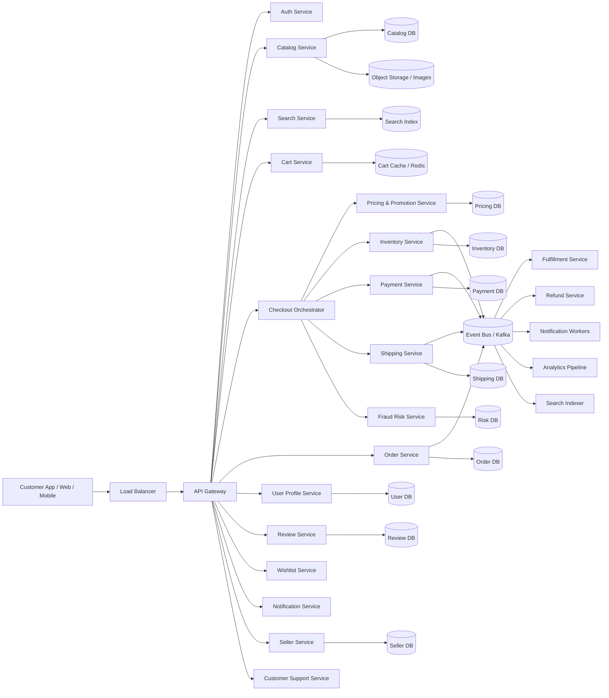

## Why this architecture works

* The **API Gateway** handles authentication, routing, and rate limiting.
* The **Catalog Service** manages product metadata.
* The **Search Service** provides fast product discovery.
* The **Cart Service** stores temporary shopping intent.
* The **Checkout Orchestrator** coordinates the expensive critical path.
* The **Inventory Service** protects against overselling.
* The **Payment Service** handles payment authorization and capture.
* The **Order Service** records customer orders.
* The **Event Bus** decouples downstream work like fulfillment, notifications, indexing, and analytics.

---

# 6. Core Domain Model

Before diving into flows, it helps to define the major commerce entities.

| Entity           | Purpose                           |
| ---------------- | --------------------------------- |
| User             | Customer account and preferences  |
| Seller           | Merchant or marketplace vendor    |
| Product          | Product definition and attributes |
| SKU              | Sellable inventory unit           |
| Cart             | Temporary basket of items         |
| Wishlist         | Saved items for later             |
| Order            | Customer purchase record          |
| Order Item       | Individual line items in an order |
| Inventory Record | Stock availability                |
| Reservation      | Temporary stock hold              |
| Payment          | Payment lifecycle record          |
| Shipment         | Fulfillment and tracking          |
| Return           | Reverse logistics record          |
| Review           | Product ratings and feedback      |
| Promotion        | Discounts and coupons             |
| Address          | Shipping/billing location         |

---

# 7. API Design

## 7.1 Product browse

`GET /v1/products/{product_id}`

Returns product details, images, price, stock status, seller info, delivery estimate, and ratings.

### Response

```json
{
  "product_id": "p123",
  "title": "Wireless Noise-Cancelling Headphones",
  "price": 12999,
  "currency": "INR",
  "stock_status": "in_stock",
  "available_quantity": 42,
  "seller_id": "s456",
  "rating": 4.6,
  "review_count": 18291
}
```

---

## 7.2 Search products

`GET /v1/search?q=headphones&filters=brand:sony,price:<15000`

Search results should be fast and ranked by relevance, price, availability, sponsored relevance, and personalization.

---

## 7.3 Add to cart

`POST /v1/cart/items`

### Request

```json
{
  "user_id": "u1",
  "sku_id": "sku_99",
  "quantity": 2
}
```

---

## 7.4 Checkout

`POST /v1/checkout`

### Request

```json
{
  "cart_id": "cart_123",
  "shipping_address_id": "addr_001",
  "payment_method_id": "pm_abc",
  "shipping_option_id": "ship_express",
  "coupon_code": "SALE10",
  "idempotency_key": "checkout-789"
}
```

### Response

```json
{
  "checkout_id": "co_123",
  "status": "pending_payment",
  "order_preview_total": 14999,
  "currency": "INR"
}
```

---

## 7.5 Place order

`POST /v1/orders`

This is often called by the checkout orchestrator after successful validation and payment authorization.

---

## 7.6 Get order status

`GET /v1/orders/{order_id}`

Returns current order state, shipment status, refund state, and timeline.

---

# 8. Database Design

A large ecommerce platform needs multiple specialized databases.

---

## 8.1 Catalog database

The catalog contains:

* product title
* descriptions
* attributes
* category hierarchy
* brand
* media references
* seller mapping
* search metadata

This is often read-heavy and can be stored in:

* MySQL/PostgreSQL for relational integrity
* document stores like MongoDB for flexible schemas
* object storage for rich media

### Why not one giant relational schema for everything?

Product attributes vary widely by category.
A phone and a refrigerator have very different fields.
So the catalog often needs semi-structured storage.

---

## 8.2 Inventory database

Inventory is one of the most critical stores.

It must track:

* stock on hand
* reserved stock
* available stock
* warehouse mapping
* seller inventory
* restock events

Inventory must be designed to prevent overselling.

### Inventory fields

| Field        | Meaning                          |
| ------------ | -------------------------------- |
| sku_id       | Sellable unit                    |
| warehouse_id | Warehouse or fulfillment center  |
| on_hand      | Physical quantity in stock       |
| reserved     | Quantity held for pending orders |
| available    | on_hand - reserved               |
| version      | Concurrency control              |

---

## 8.3 Cart store

Carts are ephemeral and high-churn.

Use Redis or another fast key-value store.

Why:

* carts change frequently
* carts are not durable financial records
* low latency matters more than relational constraints

---

## 8.4 Order database

Orders are durable business records.

Order tables store:

* order id
* customer id
* status
* order totals
* shipping address
* payment reference
* fulfillment state
* timestamps

Order item tables store line items.

---

## 8.5 Payment database

Payment data includes:

* authorization status
* capture status
* payment provider references
* retry state
* refund records
* idempotency keys

---

## 8.6 Search index

Use Elasticsearch/OpenSearch or a similar search engine for:

* keyword search
* filters
* autocomplete
* faceted navigation
* relevance ranking

---

# 9. Inventory and Out-of-Stock Handling

This is one of the most important parts of the system.

If inventory is not handled properly, the store may oversell items.

## The core problem

Suppose only 1 item is left in stock.
Two customers check out at the same time.

If both requests see “available = 1” and both proceed, the system oversells by one.

That is unacceptable.

The solution is to use **reservation-based inventory management**.

---

# 10. Reservation-Based Inventory

Instead of immediately deducting stock at checkout initiation, the system can:

1. check available stock
2. reserve stock for a limited time
3. complete payment
4. convert reservation into final deduction
5. release reservation if payment fails or times out

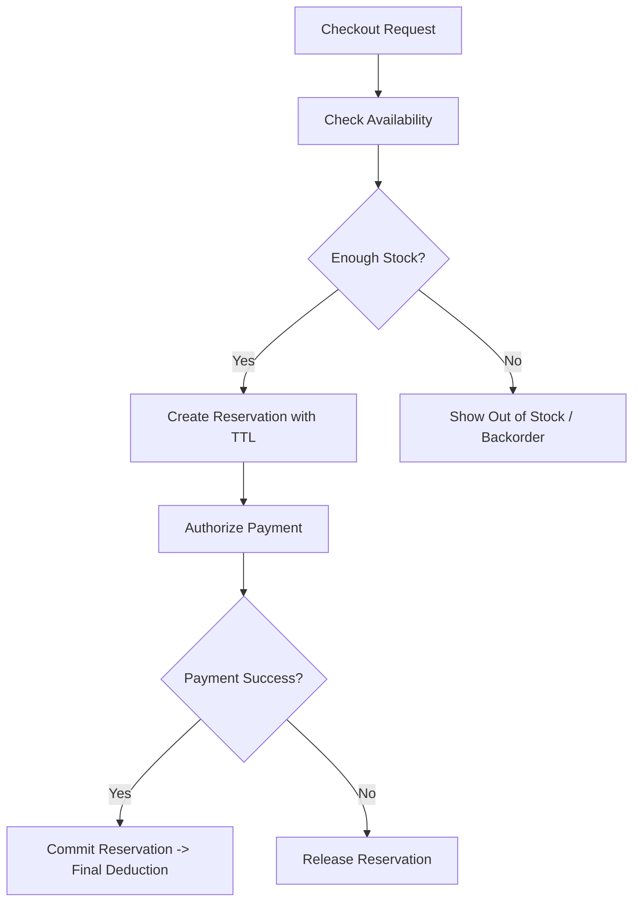

## Why reservations work

Reservations protect stock while payment is being processed.

This prevents:

* overselling
* race conditions
* duplicate checkout under retry storms

## Reservation TTL

The reservation should expire automatically if checkout is abandoned.

Example:

* hold stock for 10–15 minutes
* if payment is not completed, release inventory back to available pool

This avoids stock being locked forever by abandoned carts.

---

# 11. Checkout Flow

Checkout is the heart of the ecommerce system.

It is where pricing, tax, shipping, inventory, fraud, and payment all come together.

## Checkout responsibilities

The checkout orchestrator must:

* validate cart items
* lock or reserve inventory
* compute final price
* apply coupons and promotions
* calculate taxes
* estimate shipping
* run fraud checks
* authorize payment
* create order record
* publish fulfillment events

This should be done as a **saga**, not a single distributed transaction.

---

## Checkout sequence

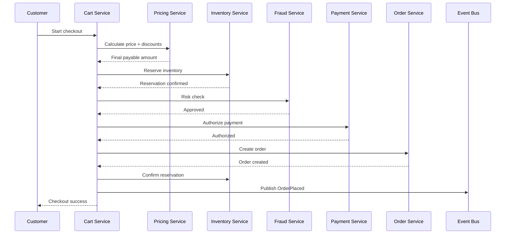

---

# 12. What Happens If Item Is Out of Stock

This should be handled gracefully.

There are several valid outcomes.

## Case 1: Out of stock before checkout

The product page or cart page should show:

* currently unavailable
* notify when back in stock
* alternatives / similar products

## Case 2: Out of stock during checkout

The inventory reservation step fails.

The checkout system should:

* stop the checkout
* clearly show which SKU failed
* suggest removing the item or changing quantity
* reprice the cart if required

## Case 3: Partial stock

If 3 items are requested and only 2 are available:

* either reject the entire checkout
* or allow partial order if the business supports split fulfillment

Amazon-style systems often support complex fulfillment splitting, but the default design should be simple:

* either reserve the full requested quantity
* or reject with a clear message

## Case 4: Stock changed while payment was being processed

If payment succeeds but inventory expires or cannot be confirmed, the system must compensate.

Possible solutions:

* reattempt reservation if inventory is actually still available
* cancel payment authorization if not yet captured
* initiate refund if capture already happened
* notify customer and support for resolution

This is why checkout must be a saga with compensating actions.

---

# 13. Saga-Based Checkout

A saga breaks the checkout into steps with compensation if a step fails.

## Example saga steps

1. validate cart
2. price cart
3. reserve inventory
4. authorize payment
5. create order
6. confirm reservation
7. release locks
8. emit downstream events

## Example compensation path

If payment fails after inventory reservation:

* release inventory reservation

If order creation fails after payment authorization:

* cancel payment authorization if possible
* or capture and immediately refund if not reversible

This is essential for correctness.

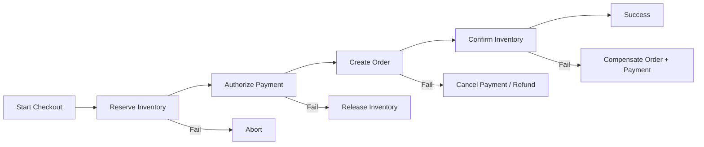

---

# 14. Payment Design

Payment must be idempotent.

If the checkout request is retried because the client timed out, the payment should not be charged twice.

## Payment steps

* payment intent created
* payment method validated
* fraud check runs
* authorization request sent to gateway
* provider response stored
* order continues only if authorization succeeds
* capture occurs only when ready

### Authorization vs capture

* **Authorization** reserves money
* **Capture** takes the money

For many products, capture can happen immediately after order confirmation.
For some orders, capture is delayed until shipment or fulfillment.

---

# 15. Order State Machine

An order should move through explicit states.

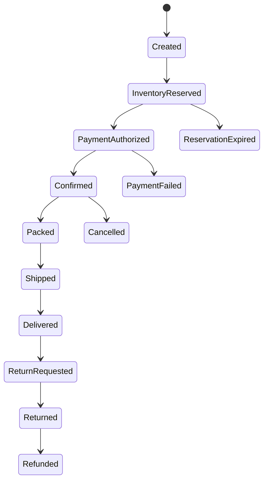

## Why a state machine is necessary

It makes the business logic explicit and auditable.

Without explicit states:

* support cannot understand what happened
* fulfillment cannot know what to do
* payment and inventory can drift apart
* compensation becomes unreliable

---

# 16. Pricing, Taxes, and Promotions

Pricing is more than a simple number lookup.

The final checkout price may depend on:

* base product price
* seller price
* coupons
* bundles
* membership discounts
* seasonal promotions
* shipping cost
* region
* tax rules
* dynamic offers
* inventory or demand-based pricing

## Pricing architecture

The pricing service should compute a **price quote** before checkout finalization.

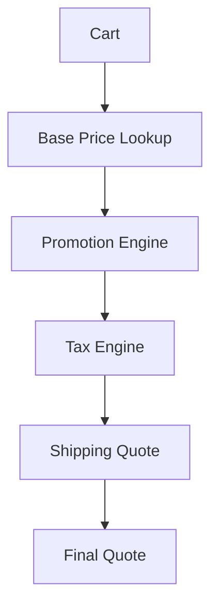

### Why separate pricing service matters

If pricing logic is scattered across cart, checkout, and order services, the customer may see one price in the cart and another at payment time.

That breaks trust.

---

# 17. Cart Design

The cart is a temporary user experience object.

It should be:

* fast
* easy to update
* not too expensive to maintain
* tolerant of product price drift

## Cart data

A cart may store:

* product ids
* sku ids
* quantities
* selected seller
* chosen variations
* estimated price snapshot
* last updated timestamp

### Cart consistency

Cart data is not always perfectly consistent with live product pricing or inventory.

That is acceptable because:

* the cart is a planning surface
* checkout is the truth moment

At checkout time, prices and stock are revalidated.

---

# 18. Catalog Design

The catalog contains the product master data.

It should support:

* rich product descriptions
* images and videos
* structured attributes
* categories and filters
* variant SKUs
* seller listings
* search indexing

## Catalog challenge

Different categories have different schemas.

A laptop has:

* RAM
* CPU
* storage
* screen size

A shoe has:

* size
* color
* material

A grocery item has:

* weight
* expiration
* packaging

So catalog data often uses a hybrid schema:

* relational core for identity and relationships
* document-style attributes for flexible product metadata

---

# 19. Search Architecture

Search is one of the most critical revenue-generating features.

If users cannot find products, the platform loses sales.

## Search pipeline

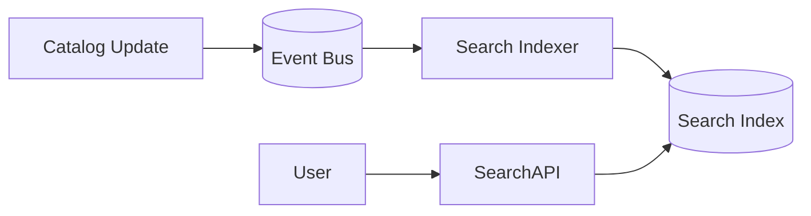

### Search features

* keyword search
* autocomplete
* typo tolerance
* filters
* sorting
* merchandising boosts
* personalization
* sponsored placements

Search must be asynchronous because indexing is slower than read traffic.

---

# 20. Recommendations

Recommendations improve conversion and basket size.

Examples:

* “Customers also bought”
* “Frequently bought together”
* “Recommended for you”
* “Similar products”
* “Recently viewed”

These systems are usually powered by:

* offline batch training
* near real-time event streams
* feature stores
* ML ranking models

Recommendations should be separate from checkout because they are helpful but not critical to order correctness.

---

# 21. Inventory Architecture in Depth

Inventory is one of the hardest operational components.

## Inventory concepts

| Concept    | Meaning                        |
| ---------- | ------------------------------ |
| On hand    | Physical stock at warehouse    |
| Reserved   | Held for pending checkout      |
| Available  | On hand minus reserved         |
| In transit | Stock moving between locations |
| Damaged    | Unavailable stock              |
| Backorder  | Demand exceeds stock           |

## Inventory update sources

* warehouse receiving
* sales orders
* cancellations
* returns
* stock audits
* seller feeds
* replenishment events

### Why inventory needs careful concurrency control

Multiple checkouts can target the same SKU at the same time.

Inventory updates should use:

* row-level locks or compare-and-swap
* optimistic concurrency with version checks
* reservation TTLs
* regional stock partitions
* idempotent reservation IDs

---

# 22. Oversell Prevention

Overselling is one of the biggest ecommerce failure modes.

## Strategies

### 1. Reserve before payment

Most common and safest.

### 2. Reserve capacity buffers

Keep a small safety margin for volatile SKUs.

### 3. Partition stock by warehouse/region

Reduce contention and improve delivery efficiency.

### 4. Soft reservation for cart, hard reservation for checkout

A cart does not need hard reservation.
Checkout does.

### 5. Backorder support

In some businesses, customers can order even if stock is not immediately available.
Then fulfillment occurs later.

For an Amazon-like system, the default should be **hard reservation at checkout**.

---

# 23. Fulfillment and Shipping

After the order is created, the fulfillment pipeline begins.

## Fulfillment steps

1. send order to warehouse
2. allocate picking location
3. pick items
4. pack items
5. label shipment
6. hand to carrier
7. update tracking
8. deliver
9. close order

## Shipping service responsibilities

* shipping method selection
* ETA calculation
* carrier integration
* tracking events
* address validation
* zone/routing logic

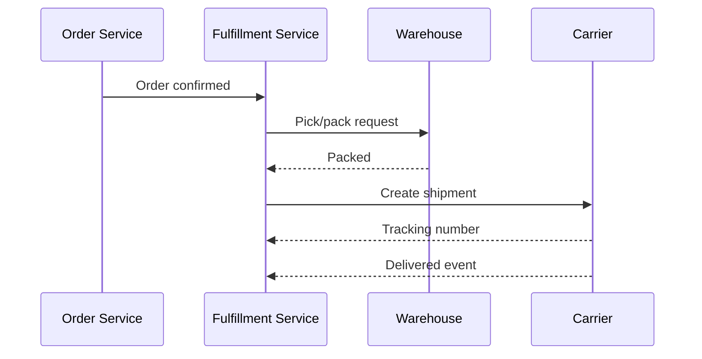

---

# 24. Returns and Refunds

Returns are a crucial part of ecommerce.

Customers expect:

* return request
* pickup or drop-off
* inspection
* refund
* exchange if applicable

## Return flow

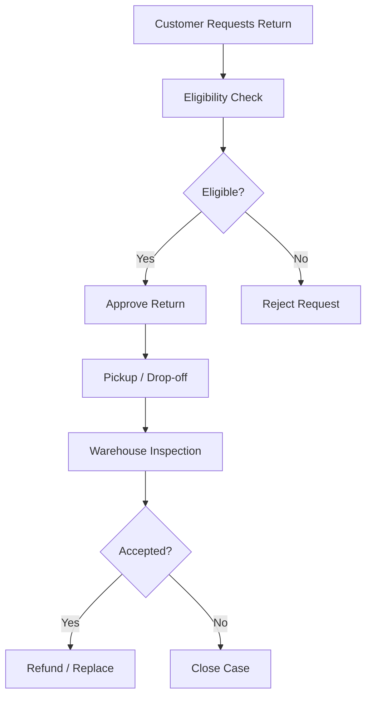

### Refund handling

Refunds may go:

* back to original payment method
* to wallet
* as store credit
* partial refund if only one item was returned

Refunds must also be idempotent.

---

# 25. Seller Marketplace Architecture

In a marketplace model, not all inventory belongs to the platform.

Some items are sold by third-party sellers.

This adds complexity:

* seller onboarding
* seller catalog ingestion
* seller pricing
* seller stock feeds
* seller order SLAs
* seller payouts
* seller quality scoring
* fraud and abuse checks

## Seller data flow

Sellers may push product feeds and inventory feeds through APIs or batch uploads.

The system must validate:

* SKU format
* price ranges
* stock consistency
* prohibited items
* content policy

---

# 26. Notifications

The notification system informs users of:

* order confirmation
* shipment updates
* delivery status
* refund completion
* back-in-stock alerts
* promotional campaigns

Notifications should be asynchronous.

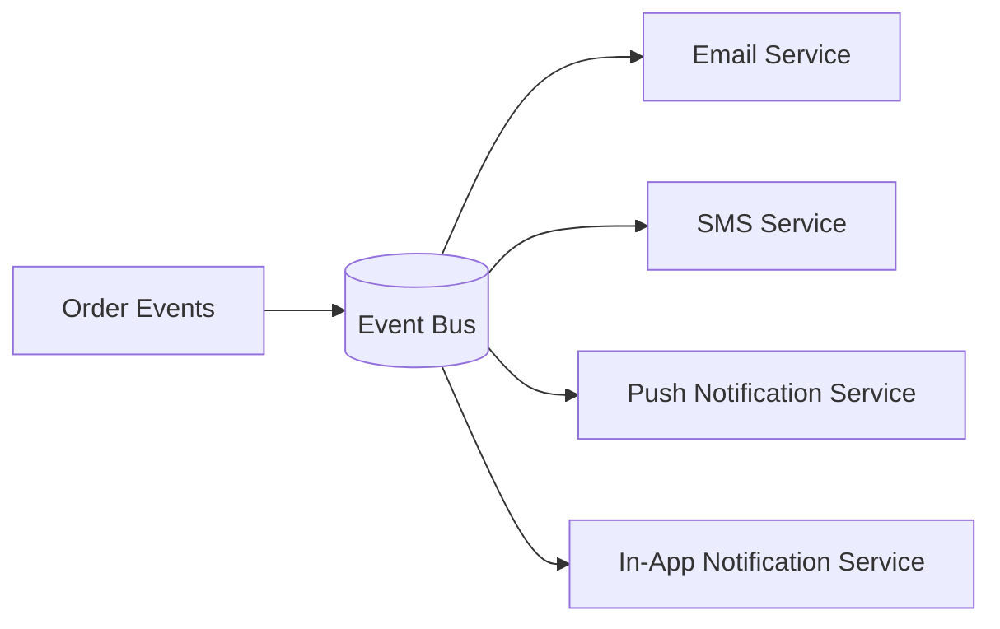

---

# 27. Reviews and Ratings

Reviews help future customers but should be protected from abuse.

System requirements:

* only verified purchases can review
* moderation and spam detection
* rating aggregation
* fraud checks
* edit and deletion policy

Reviews are not part of the critical checkout path, so they can be stored and processed separately.

---

# 28. Authentication and Security

Ecommerce systems handle sensitive customer data.

## Security requirements

| Area             | Protection                      |
| ---------------- | ------------------------------- |
| Authentication   | Secure login, MFA support       |
| Authorization    | Role-based and ownership checks |
| Data in transit  | TLS everywhere                  |
| Data at rest     | Encryption                      |
| Payment data     | PCI controls and tokenization   |
| PII              | Restricted access and masking   |
| Abuse prevention | Rate limiting, bot defense      |
| Session security | Secure cookies / tokens         |
| Audit logs       | Immutable access logs           |

## PCI consideration

Payment details should never be exposed broadly across the platform.

Use tokenization and external payment processors to limit PCI scope.

---

# 29. Observability

An ecommerce system needs strong observability because failures directly cost money.

## Important metrics

| Metric                         | Why it matters          |
| ------------------------------ | ----------------------- |
| Search latency                 | Product discovery UX    |
| Add-to-cart latency            | Shopping responsiveness |
| Checkout success rate          | Revenue conversion      |
| Payment auth rate              | Provider health         |
| Inventory reservation failures | Stock issues            |
| Oversell prevention rate       | Stock correctness       |
| Order creation latency         | Conversion completion   |
| Fulfillment lag                | Delivery performance    |
| Refund latency                 | Customer trust          |
| Cart abandonment rate          | Funnel health           |

## Tracing

A single checkout should be traceable across:

* cart
* pricing
* inventory
* payment
* order
* notifications
* fulfillment

That is necessary for debugging and support.

---

# 30. Consistency Model

Different ecommerce parts need different consistency levels.

| Component       | Consistency Need              |
| --------------- | ----------------------------- |
| Orders          | Strong enough for correctness |
| Payments        | Strong/idempotent             |
| Inventory       | Strong or reservation-based   |
| Cart            | Eventual acceptable           |
| Search          | Eventual                      |
| Recommendations | Eventual                      |
| Notifications   | Eventual                      |
| Reviews         | Eventual                      |

### Why this split works

The user experience can tolerate a slightly stale recommendation.
It cannot tolerate being charged twice or buying an item that does not exist.

---

# 31. Caching Strategy

Caching is essential for performance and cost control.

## Good cache candidates

* product details
* category pages
* seller profiles
* shipping estimates
* promotions
* search result pages
* recommendation outputs
* session data
* cart data

## Bad cache candidates

* final order truth
* ledger/payment records
* current inventory reservation truth

### Cache approach

Use cache-aside for reads, with careful invalidation on catalog and pricing updates.

For hot product pages:

* CDN for images and static assets
* edge caching for product data where acceptable
* Redis for backend acceleration

---

# 32. CDN, Load Balancers, and API Gateway

## CDN

Use CDN for:

* product images
* videos
* static frontend assets
* downloadable manuals and assets

This reduces origin load and improves page speed globally.

## Load balancer

Distributes traffic across app servers and handles health checks.

## API gateway

Handles:

* auth
* throttling
* route selection
* request logging
* versioning
* bot filtering

This is the public edge of the platform.

---

# 33. Kafka / Queues / Event-Driven Architecture

A commerce platform is naturally event-driven.

Example events:

* ProductUpdated
* CartUpdated
* InventoryReserved
* PaymentAuthorized
* OrderPlaced
* ShipmentCreated
* ShipmentDelivered
* ReturnRequested
* RefundIssued

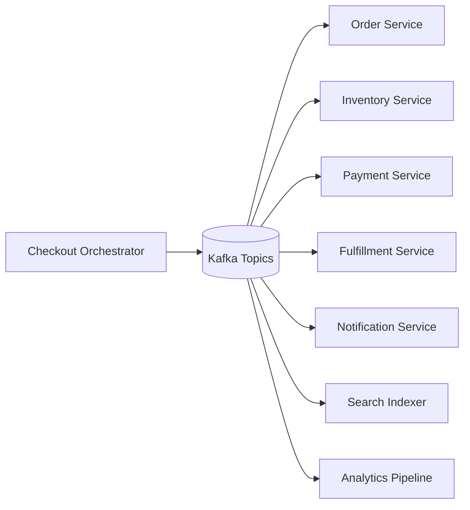

### Why Kafka helps

* absorbs spikes
* decouples services
* supports replay
* enables asynchronous workflows
* simplifies downstream fanout

---

# 34. Rate Limiting and Anti-Bot Protection

Ecommerce platforms are frequently attacked by:

* inventory bots
* coupon abuse
* credential stuffing
* card testing
* scraper bots
* flash-sale bots

## Mitigations

* IP and user rate limiting
* device fingerprinting
* CAPTCHA challenges for suspicious flows
* coupon abuse detection
* bot scoring
* queueing for flash sales
* anti-card testing heuristics

Flash-sale systems often need waiting room queues or token-based admission control to protect checkout and inventory fairness.

---

# 35. Flash Sales and High Contention Products

High-demand products create the most dangerous load patterns.

Example:

* one product available in 100 units
* millions of users hit checkout within seconds

## Design patterns

* waiting room / virtual queue
* soft admission tokens
* strict reservation TTLs
* per-user purchase limits
* anti-bot throttling
* regional stock partitioning

### Why this matters

The system must remain fair and avoid collapse under extreme load.

---

# 36. Failure Scenarios and Recovery

## Scenario 1: Payment succeeds but order creation fails

Solution:

* record payment authorization/capture state
* retry order creation
* if irrecoverable, issue refund or void based on payment stage

## Scenario 2: Inventory reserved but payment fails

Solution:

* release reservation immediately

## Scenario 3: Order created but fulfillment fails

Solution:

* mark order in exception state
* retry or route to manual intervention

## Scenario 4: Shipping provider unavailable

Solution:

* queue shipment creation
* retry asynchronously
* keep order in confirmed state

## Scenario 5: Search index lags

Solution:

* continue commerce flow
* search eventually catches up from event log

---

# 37. Database Sharding

At Amazon scale, databases cannot remain monolithic forever.

## Common sharding keys

* user_id for cart and profile data
* order_id for orders
* sku_id or warehouse_id for inventory
* seller_id for marketplace data
* product_id for catalog distribution

### Why shard by access pattern

You want data that is frequently accessed together to live together, and you want hot partitions to be distributed.

---

# 38. Multi-Region Architecture

A global ecommerce system should operate across regions.

## Goals

* low latency for users worldwide
* regional failover
* local tax and shipping rules
* warehouse proximity
* reduced blast radius

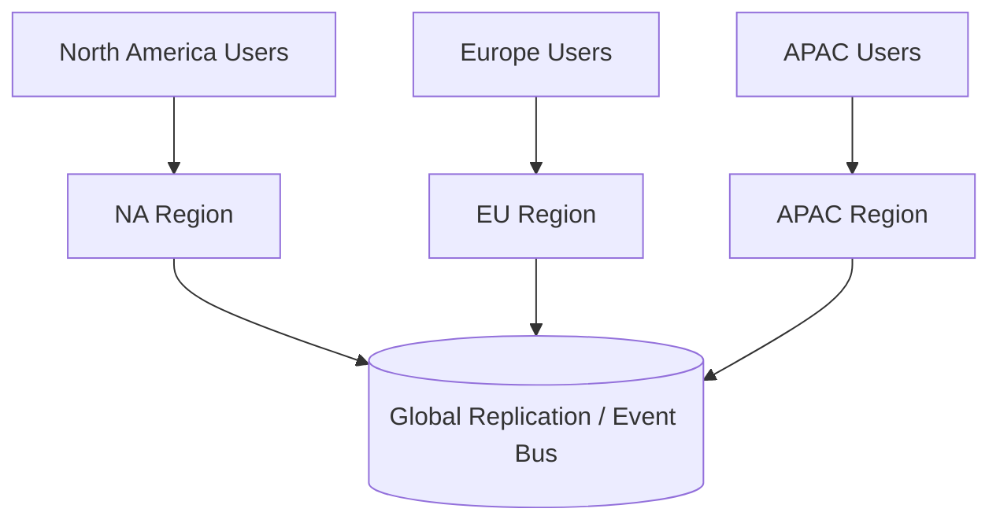

## Tradeoff

Inventory and orders are often region-aware or warehouse-aware, so global active-active writes require careful ownership rules.

A practical design is:

* regional order ownership
* regional inventory ownership
* asynchronous global analytics and search replication

---

# 39. Order Lifecycle in Depth

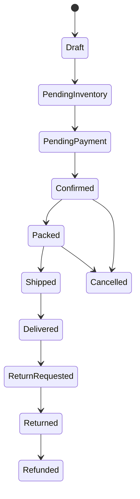

This explicit lifecycle helps every downstream system know what actions are allowed.

---

# 40. Advanced Optimizations

## 40.1 Inventory pre-allocation

For faster checkout on highly demanded items, pre-allocate stock pools per region or warehouse.

## 40.2 Payment token reuse

Use vaulted payment methods so repeat customers can check out faster.

## 40.3 Partial precompute

Cache common shipping estimates and tax rules for popular routes and SKUs.

## 40.4 Hot product protection

Use separate handling for high-traffic products so they do not degrade the entire platform.

## 40.5 Read-optimized product pages

Combine CDN, cache, and precomputed metadata so product pages are fast even under heavy load.

---

# 41. Bottlenecks and Solutions

| Bottleneck                | Cause                       | Solution                                  |
| ------------------------- | --------------------------- | ----------------------------------------- |
| Inventory contention      | Many users buying same SKU  | Reservation system, sharding, TTL holds   |
| Checkout latency          | Too many synchronous checks | Saga orchestration and async side effects |
| Search index lag          | High catalog update rate    | Kafka + async indexing                    |
| Payment provider slowness | External dependency         | Retries, circuit breakers, timeouts       |
| Order spikes              | Sales and promotions        | Queueing and autoscaling                  |
| Cart churn                | Frequent updates            | Redis and TTL storage                     |
| Recommendation cost       | Heavy ML inference          | Offline precompute + cached ranking       |

---

# 42. Final Architecture Diagram

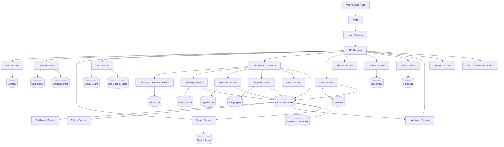

---

# 43. Conclusion

A real Amazon-level ecommerce system is not just a store.
It is a very large distributed commerce platform.

It must coordinate:

* product discovery
* cart management
* pricing and promotion logic
* inventory correctness
* payment reliability
* order creation
* shipping and fulfillment
* returns and refunds
* search and recommendations
* seller marketplace operations
* fraud prevention
* customer support

The hardest part is checkout, because checkout crosses many boundaries at once.

The right production design uses:

* **CDN and cache** for fast browsing
* **Search engine** for discovery
* **Redis/cart cache** for low-latency cart state
* **Reservation-based inventory** to prevent overselling
* **Payment idempotency** to avoid duplicate charges
* **Saga orchestration** for checkout
* **Kafka/event streams** for downstream workflows
* **Order state machines** for clarity and recovery
* **Multi-region architecture** for global resilience
* **Strong security** for payments and personal data
* **Observability** for everything that can fail

The system succeeds when the customer experiences a simple flow, while the backend quietly handles an enormous amount of distributed complexity.