A real-time collaborative document editor looks simple from the outside.

Two people open the same document.
One types a sentence.
The other person sees it immediately.
Several users can edit the same file at the same time without breaking the document.

That simplicity is only the surface.

Behind it, a system like Google Docs must handle:

* multiple users editing the same document concurrently
* low-latency real-time synchronization
* conflict resolution
* offline edits and later merge
* comments, suggestions, and annotations
* permissions and access control
* version history and undo/redo
* cursor presence and live selections
* autosave and crash recovery
* document search and indexing
* sharing links and collaboration invitations
* multi-region availability and disaster recovery

This is a distributed systems problem disguised as a text editor.

The hard part is not storing text.
The hard part is keeping **many replicas of the same document logically consistent** while users edit it concurrently from different devices, networks, and regions.

---

# 1. Introduction

## Problem statement

Design a collaborative document editing system that allows multiple users to:

* create and edit documents in real time
* see each other’s changes instantly
* share documents with permissions
* comment and suggest edits
* work offline and sync later
* access version history
* collaborate from web, mobile, and desktop clients

## Real-world scale

At production scale, such a system may support:

* millions of active users
* tens of millions of documents
* thousands of concurrent editors on popular files
* very high write frequency during active editing sessions
* continuous autosave and background synchronization
* globally distributed users

## Why this problem is difficult

The difficulty comes from combining several things that are individually hard:

* **real-time collaboration**
* **multi-user concurrency**
* **consistent document state**
* **low latency**
* **offline support**
* **conflict resolution**
* **durability**
* **permission controls**
* **multi-device sync**
* **document history and recovery**

A plain database cannot solve this alone.

A simple “last write wins” approach breaks immediately when two people type at the same time.

So the system needs a collaboration protocol such as:

* **Operational Transformation (OT)**
* **CRDTs**
* or a hybrid collaboration layer that preserves user experience under concurrency

---

# 2. Functional Requirements

The system should support:

| Requirement           | Description                                          |
| --------------------- | ---------------------------------------------------- |
| Document Creation     | Create new documents and folders                     |
| Real-Time Editing     | Multiple users edit the same document simultaneously |
| Cursor Presence       | Show active cursors and selections                   |
| Conflict Resolution   | Merge concurrent edits correctly                     |
| Autosave              | Persist changes continuously                         |
| Offline Editing       | Allow editing without immediate connectivity         |
| Sync on Reconnect     | Merge offline changes later                          |
| Comments              | Add and resolve comments                             |
| Suggestions           | Track suggested edits separately                     |
| Version History       | Recover previous document states                     |
| Sharing & Permissions | Owner/editor/commenter/viewer roles                  |
| Search                | Search documents and content                         |
| Notifications         | Notify users of edits, mentions, comments            |
| Export                | PDF, DOCX, TXT export                                |
| Audit Logs            | Track user actions for compliance                    |

---

# 3. Non-Functional Requirements

| Property          | Goal                                                      |
| ----------------- | --------------------------------------------------------- |
| Low latency       | Edits should appear in near real time                     |
| High availability | Collaboration should continue even with failures          |
| Durability        | No edits should be lost                                   |
| Scalability       | Support many concurrent sessions                          |
| Consistency       | All users should converge on the same document state      |
| Fault tolerance   | Recover from server crash, reconnect, and partitions      |
| Security          | Secure access to documents and edits                      |
| Observability     | Track latency, sync lag, conflicts, and errors            |
| Cost efficiency   | Keep collaboration sessions cheap to operate              |
| Extensibility     | Support comments, suggestions, tables, images, formatting |

---

# 4. Capacity Estimation

Let us assume a large collaboration platform.

## Assumptions

* 100 million registered users
* 20 million daily active users
* 50 million total documents
* 10 million documents edited per day
* 2 million concurrent active editing sessions at peak
* 100,000 heavily active live collaboration rooms
* average edit stream: 1–5 operations/sec per active editor
* popular shared document: hundreds or thousands of concurrent viewers, dozens of concurrent editors

## QPS

### Editing operations

If 2 million concurrent editors average 2 ops/sec:

* ~4 million ops/sec system-wide during busy periods

This is not all on one document.
It is distributed across many sessions.

### Reads

Document opens, snapshots, comments, search hits, history views, permission checks, and presence queries create a heavy read load.

## Storage

A document is not just a single blob of text.

It has:

* document metadata
* revision history
* operation log
* comments
* suggestions
* ACLs
* sharing state
* presence state
* indexes

If the average document metadata plus versions consumes 100 KB to several MB, a system with tens of millions of documents can easily reach multi-terabyte scale.

## Bandwidth

Real-time collaboration is chatty.

Each edit may generate:

* local update event
* server acknowledgment
* broadcast to peers
* presence updates
* autosave persistence
* version checkpoint updates

The system must use compact wire formats and incremental updates, not full-document transfers on every keystroke.

---

# 5. High-Level Architecture

A production collaborative editor usually uses:

* API Gateway
* Auth Service
* Document Service
* Collaboration Session Service
* Realtime Sync Service
* Presence Service
* Comment Service
* Versioning Service
* Search Indexer
* Notification Service
* Object Storage
* Metadata DB
* Operation Log / Event Stream
* Cache layer

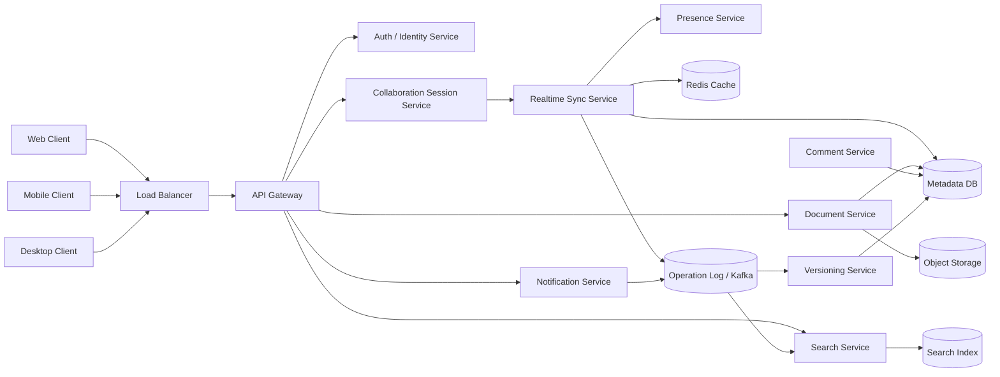

## Why this architecture works

* The **Document Service** owns document metadata and access control.
* The **Realtime Sync Service** handles editing sessions and live propagation.
* The **Operation Log** stores every change as an ordered stream of operations.
* The **Presence Service** tracks who is online and where.
* The **Versioning Service** creates checkpoints and lets users recover history.
* The **Search Service** indexes documents asynchronously.
* The **Object Storage** stores attachments and document exports.

This separates the fast collaboration path from slower background work.

---

# 6. Core Collaboration Model

The single most important design decision is how concurrent edits are merged.

There are two major approaches:

1. **Operational Transformation (OT)**
2. **Conflict-free Replicated Data Types (CRDTs)**

---

## 6.1 Operational Transformation

OT transforms concurrent operations so they can be applied in a consistent order.

Example:

* User A inserts text at position 5
* User B deletes text at position 3
* The system transforms one operation relative to the other so both clients converge

### Why OT is useful

* well-known in collaborative editing
* can produce compact operations
* can work efficiently with a central coordination server

### Tradeoff

OT is conceptually and implementation-wise tricky.
Transformation rules become difficult for rich text, tables, and embedded objects.

---

## 6.2 CRDTs

CRDTs are data structures that naturally converge when concurrent operations are merged.

### Why CRDTs are useful

* offline-first support is strong
* replicas can merge without central coordination
* concurrency handling is mathematically robust

### Tradeoff

CRDT payloads can become large, and memory/metadata overhead may increase.

---

## 6.3 Practical production choice

A real system may use a **hybrid model**:

* OT or a server-ordered operational log for text collaboration
* CRDT-like semantics for presence, comments, cursors, and some offline workflows
* server-authoritative session ordering for low latency and simpler debugging

For this design, we will use:

* **operation-based collaboration**
* a **central session coordinator**
* **per-document ordered operation streams**
* optimistic local editing on clients
* async persistence and checkpoints

This is easier to operate at scale while still supporting real-time collaboration.

---

# 7. API Design

## 7.1 Create document

`POST /v1/documents`

### Request

```json
{
  "title": "Project Plan",
  "folder_id": "f123",
  "template_id": "blank"
}
```

### Response

```json
{
  "document_id": "doc_001",
  "title": "Project Plan",
  "created_at": "2026-05-10T10:00:00Z"
}
```

---

## 7.2 Open document

`GET /v1/documents/{document_id}`

### Response

```json
{
  "document_id": "doc_001",
  "title": "Project Plan",
  "revision": 120,
  "permissions": "editor",
  "content_snapshot_ref": "snapshot_482",
  "collab_session_id": "sess_991"
}
```

---

## 7.3 Submit operation

`POST /v1/documents/{document_id}/operations`

### Request

```json
{
  "client_id": "device_123",
  "base_revision": 120,
  "operation_id": "op_9001",
  "operations": [
    {
      "type": "insert_text",
      "position": 15,
      "text": "real-time "
    }
  ]
}
```

### Response

```json
{
  "accepted": true,
  "new_revision": 121
}
```

---

## 7.4 Fetch updates since revision

`GET /v1/documents/{document_id}/operations?since_revision=120`

### Response

```json
{
  "document_id": "doc_001",
  "from_revision": 120,
  "to_revision": 130,
  "operations": [...]
}
```

---

## 7.5 Comments

`POST /v1/documents/{document_id}/comments`

### Request

```json
{
  "anchor": {
    "start": 34,
    "end": 58
  },
  "text": "Please clarify this section."
}
```

---

## 7.6 Sharing

`POST /v1/documents/{document_id}/permissions`

### Request

```json
{
  "user_id": "u789",
  "role": "editor"
}
```

---

# 8. Detailed Editing Flow

## Step-by-step editing lifecycle

1. Client opens a document.
2. Server returns a snapshot and current revision.
3. Client begins editing locally.
4. Client sends operations instead of full document blobs.
5. Server orders operations for the session.
6. Server validates permissions and base revision.
7. Server persists the operation.
8. Server broadcasts the operation to other connected clients.
9. Clients apply the operation locally.
10. Server periodically stores snapshots/checkpoints.

---

## Sequence diagram

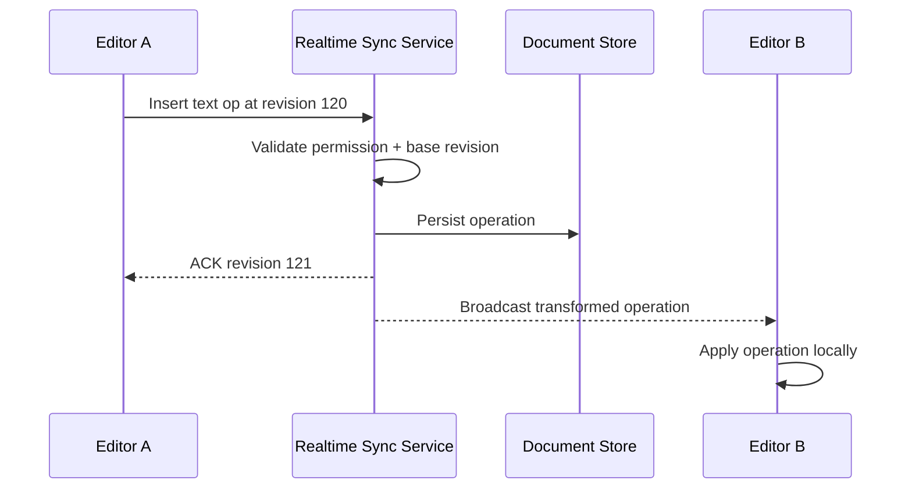

---

# 9. Data Model

A collaborative document system needs multiple entities.

---

## Main entities

| Entity          | Purpose                             |
| --------------- | ----------------------------------- |
| User            | Account identity                    |
| Document        | Core editable object                |
| DocumentVersion | Checkpoint/revision history         |
| Operation       | Atomic edit action                  |
| Comment         | User discussion anchored to content |
| Suggestion      | Proposed edits requiring approval   |
| Permission      | Access control record               |
| Session         | Active editing connection           |
| Presence        | Online/cursor state                 |
| Attachment      | Embedded files/images               |
| AuditEvent      | Compliance and history              |

---

## Conceptual schema

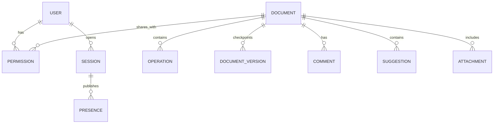

---

# 10. Database Design

A real-time document system usually uses multiple storage systems, each for a different purpose.

---

## 10.1 Metadata database

Use PostgreSQL or MySQL for:

* document metadata
* permissions
* comments
* suggestions
* folder structure
* sharing links
* audit records

Why relational DB here:

* strong consistency
* transactional permission changes
* well-defined relationships
* easy admin queries

---

## 10.2 Operation log store

Use Kafka, Pulsar, or a durable append-only event store for:

* edit operations
* collaboration replay
* recovery
* version generation

Why append-only:

* edits are naturally event-based
* replay makes recovery simpler
* checkpoints can be rebuilt

---

## 10.3 Snapshot store

Use object storage or blob storage for:

* periodic document snapshots
* exports
* attachments
* archived document states

Snapshots reduce replay time.
Instead of replaying millions of operations, the system can start from a recent checkpoint.

---

## 10.4 Cache

Use Redis for:

* document session metadata
* active collaborator sets
* presence
* hot permission lookups
* recent revision pointers

Cache should accelerate the collaboration path, not replace source-of-truth data.

---

## 10.5 Search index

Use Elasticsearch or OpenSearch for:

* document title search
* full-text search
* comment search
* owner/folder filters

Indexing is asynchronous so editing remains fast.

---

# 11. Real-Time Sync Service

This is the most important runtime component.

It handles:

* websocket connections
* session join/leave
* operation ordering
* conflict resolution
* live broadcasts
* acks and retries
* revision tracking

## Responsibilities

1. Accept client operations
2. Validate permissions
3. Ensure operations are based on the correct revision
4. Transform concurrent edits when necessary
5. Persist operation to the log
6. Broadcast to other clients
7. Return ACK to sender
8. Track session health and lag

---

## Why persistent connections matter

HTTP request-response alone is not enough.

Real-time editing needs a bi-directional channel so that:

* clients can send edits instantly
* server can push remote changes instantly
* presence updates can stream continuously
* cursor movement can be broadcast cheaply

WebSockets are the most common choice.
SSE may work for some read-only streaming, but editing needs two-way communication.

---

# 12. Conflict Resolution

This is the heart of collaborative editing.

When two users edit the same region at the same time, the system must decide how to merge changes.

## Example

Suppose the original text is:

```text
Hello world
```

User A inserts `"beautiful "` after `Hello`.
User B deletes `"world"`.

Without conflict handling, one edit might overwrite the other.

The system must transform operations so both can coexist.

---

## How operation transformation works conceptually

If one operation is applied first, the other must be adjusted relative to the changed document positions.

This is why the server often maintains:

* a global document revision
* per-client base revision
* transform logic for operations

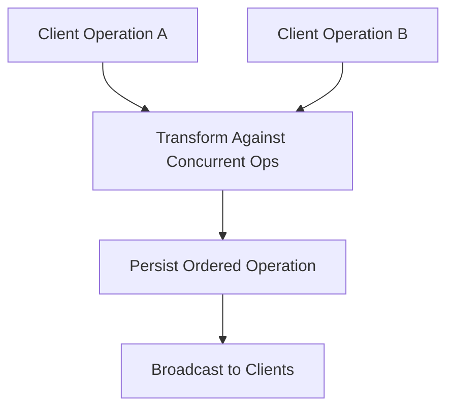

---

## Why this is hard

Editing a plain string is one thing.
Rich documents contain:

* formatting
* paragraphs
* bullets
* tables
* images
* links
* comments
* embedded objects

Each of these needs carefully defined transform behavior.

That is why many production systems simplify the document model internally and use a structured editing format instead of arbitrary HTML.

---

# 13. Snapshotting and Version History

A document should not rely only on the operation log for long-term access.

## Why snapshots are needed

If the operation log becomes too large, reconstructing the document from the beginning becomes expensive.

So the system periodically creates snapshots:

* every N operations
* every few minutes
* every significant save checkpoint

### Versioning flow

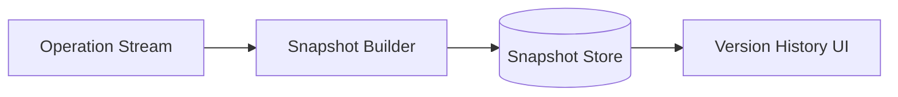

---

## Version history use cases

* restore deleted text
* inspect document evolution
* compare versions
* track who changed what
* recover from accidental edits

---

# 14. Offline Editing

Offline support is essential.

A user may:

* lose connectivity
* switch devices
* edit on a plane
* work in a poor network area

The client should still allow local edits and buffer operations.

## Offline flow

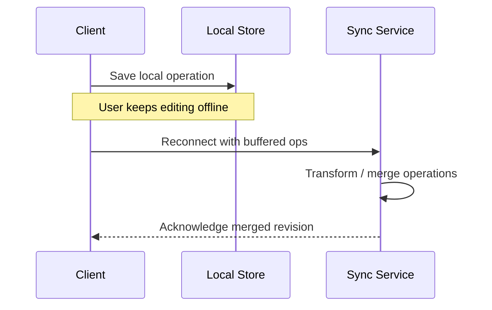

---

## Offline merge strategy

When the client reconnects:

* it sends buffered operations
* it includes the last known server revision
* the server transforms operations if the document has changed meanwhile
* the server returns the merged revision

This is one of the main reasons collaboration protocols exist.

---

# 15. Presence and Cursor Tracking

Users expect to see:

* who is online
* where they are editing
* whose cursor is active
* which text is selected

This state is short-lived and changes frequently.

## Where to store it

Use Redis or in-memory distributed state with TTL.

### Why not the main DB?

Because presence updates are high frequency and ephemeral.
They do not belong in a durable transaction-heavy database.

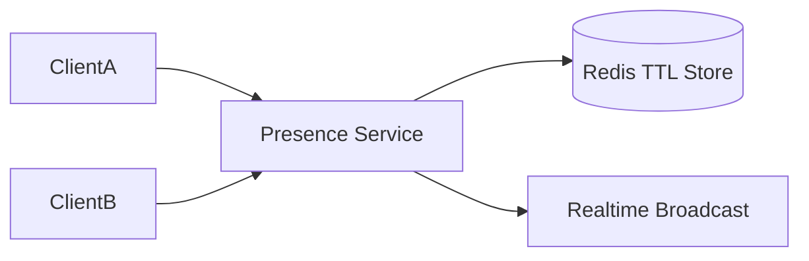

---

# 16. Comments and Suggestions

Comments and suggestions are different from raw edits.

## Comments

Comments are anchored to ranges or document objects.
They can be resolved, replied to, mentioned, and searched.

## Suggestions

Suggestions represent proposed edits that the document owner can accept or reject.

This is important because:

* not every participant has equal authority
* review workflows need structured change tracking
* suggested edits must not immediately mutate the canonical document

---

# 17. Permissions and Sharing

Documents need robust access control.

## Common roles

| Role      | Permissions              |
| --------- | ------------------------ |
| Owner     | Full control             |
| Editor    | Can modify content       |
| Commenter | Can comment but not edit |
| Viewer    | Read-only access         |

## Sharing model

* direct user shares
* domain-wide sharing
* link sharing
* folder inheritance
* group sharing

### Important design principle

Every request that touches a document must perform permission checks close to the data path, not only at login time.

---

# 18. Search Design

Search should be asynchronous.

When a document changes:

* the edit event is appended to the log
* the search indexer consumes the event
* the index is updated in the background

## Why asynchronous search is best

Search indexing is slower than interactive editing.
You do not want a user’s keystroke to block on full-text indexing.

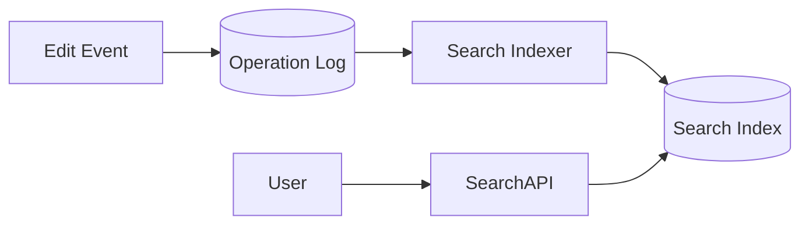

---

# 19. Autosave Strategy

Autosave is built into the collaboration pipeline.

The system should persist:

* operations continuously
* periodic snapshots
* final document state after idle periods

## Why autosave should be incremental

Saving the entire document after every keystroke is wasteful.

Instead:

* send operations
* batch them where possible
* checkpoint every few seconds or after N ops
* sync fast enough that loss is minimal

---

# 20. Scaling Strategy

The main scaling challenges are:

* many simultaneous editing sessions
* hot popular documents
* high fanout on live updates
* many short-lived operations
* presence and cursor churn

## How to scale

### 1. Shard by document ID

Each document session can map to a shard or collaboration partition.

### 2. Keep stateless sync servers

WebSocket gateways should stay stateless except for transient connection state.

### 3. Partition operation logs

Use `document_id` or session-aware partitioning.

### 4. Use caches for hot metadata

Document metadata, permission checks, and session info are good cache targets.

### 5. Keep heavy workloads async

Search indexing, exports, analytics, and notifications should not block the editing path.

---

# 21. Hot Document Problem

Some documents become extremely hot:

* launch announcements
* company-wide notes
* viral documents
* large meetings with lots of editors

A single document can become a hotspot because many clients write and read the same object.

## Mitigations

* limit concurrent editors for extremely hot documents
* separate view-only viewers from active editors
* shard session fanout by region
* batch cursor updates
* compress operation payloads
* throttle high-frequency UI-only events like cursor movements

---

# 22. Rate Limiting and Backpressure

Real-time collaboration systems need protection from noisy clients.

## Examples

* a client sends too many cursor updates
* a broken client retries aggressively
* a malicious client floods edit events
* a reconnect storm hits after a network outage

## Solutions

* token bucket rate limiting
* per-document and per-user throttles
* backpressure on websocket streams
* bounded queues
* drop low-priority ephemeral events first, not document edits

The system must prioritize actual document operations over cosmetic events.

---

# 23. Reliability and Fault Tolerance

Failures happen in collaboration systems all the time:

* gateway disconnects
* worker crashes
* client refresh
* mobile app backgrounding
* network partitions
* region failover

## Recovery mechanisms

* reconnect and resume by revision
* replay missed operations from the log
* snapshot-based restore
* idempotent operation application
* session rehydration

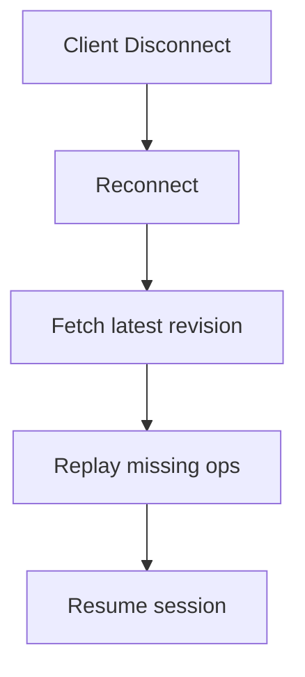

---

# 24. Consistency Model

A document collaboration system usually uses a mix of consistency models.

| Feature         | Consistency Need                   |
| --------------- | ---------------------------------- |
| Text edits      | Strong convergence across replicas |
| Presence        | Eventual                           |
| Cursors         | Eventual / best effort             |
| Comments        | Strong enough for correctness      |
| Search          | Eventual                           |
| Version history | Durable and consistent             |
| Permissions     | Strong                             |

## Why this mix is necessary

Not everything needs the same consistency level.

Presence can lag slightly.
Document content cannot.

That is why different subsystems use different storage and sync strategies.

---

# 25. Data Flow for an Edit

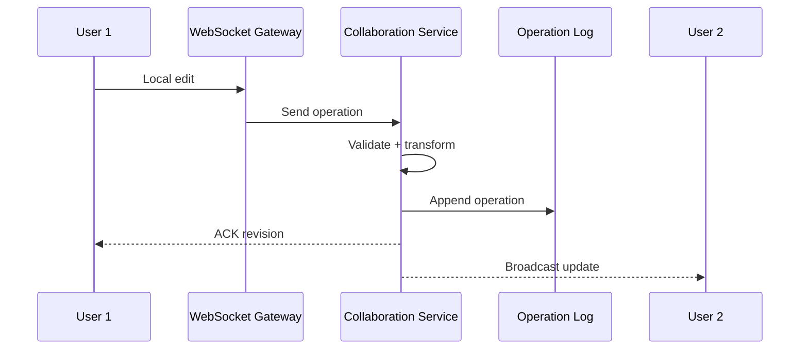

This flow is the center of the collaboration system.

The server acts as the coordination point, while clients remain responsive by editing locally and reconciling with the authoritative revision stream.

---

# 26. Storage Choices

## Metadata and permissions

Use PostgreSQL or MySQL.

Why:

* transactional integrity
* relational constraints
* clear ownership and sharing logic

## Operations and collaboration log

Use Kafka or another append-only log.

Why:

* ordered event stream
* replayable history
* decoupled consumers

## Snapshots and exports

Use object storage such as S3 or GCS.

Why:

* cheap durable storage
* good for large blobs
* easy retention policies

## Presence and sessions

Use Redis.

Why:

* fast ephemeral state
* TTL support
* low-latency reads and writes

## Search

Use Elasticsearch or OpenSearch.

Why:

* full-text search
* document filtering
* indexing support

---

# 27. Observability

You need to see whether collaboration is healthy.

## Important metrics

| Metric                  | Why it matters        |
| ----------------------- | --------------------- |
| Edit latency            | User experience       |
| Broadcast latency       | Real-time sync health |
| Operation queue lag     | Backpressure          |
| Conflict rate           | Collaboration quality |
| Reconnect success rate  | Network resilience    |
| Snapshot lag            | Recovery readiness    |
| Presence lag            | UI freshness          |
| Permission failure rate | Access control health |

## Logging and tracing

Trace:

* document open
* edit submission
* operation transformation
* persistence
* broadcast
* snapshot creation

This is essential for debugging tricky collaboration bugs.

---

# 28. Security

Documents can be highly sensitive.

## Security requirements

* authentication
* document-level authorization
* encrypted transport
* encrypted storage
* signed sharing links
* audit logging
* secure invite flows
* protection against injection in comments and rich text content

## Rich text security

Collaborative editors must sanitize:

* embedded HTML
* pasted content
* scripts
* dangerous links
* malicious file attachments

Security here is not just about access.
It is also about content safety.

---

# 29. Multi-Region Architecture

To support global users:

* route clients to nearest region
* keep editing sessions close to user clusters
* replicate document state asynchronously
* preserve document ownership and conflict semantics

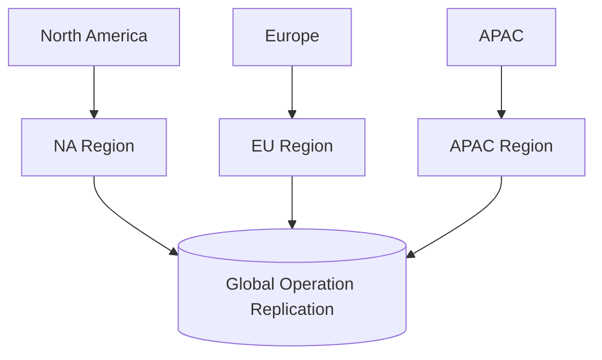

## Tradeoff

Global active-active collaboration is difficult.

A practical production approach is:

* one active coordination region per document session
* replicated snapshots and logs to secondary regions
* failover if the primary region goes down

This gives good latency without creating split-brain editing.

---

# 30. Advanced Optimizations

## 30.1 Operation compression

Instead of sending full document state, send compact diffs.

## 30.2 Cursor throttling

Cursor movement does not need to be broadcast every millisecond.

## 30.3 Batching

Small consecutive operations can sometimes be batched before persistence.

## 30.4 Lazy rendering

Clients can optimize UI rendering separately from the collaboration protocol.

## 30.5 Checkpoint tuning

Create checkpoints based on size and time to reduce replay cost.

---

# 31. Final Architecture Diagram

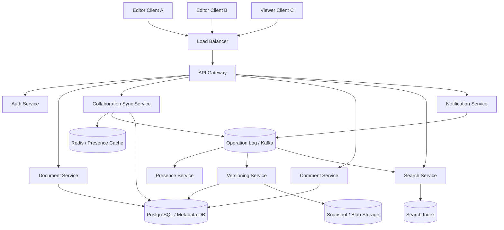

---

# 32. Conclusion

A Google Docs–style collaboration system is one of the best examples of a real-world distributed systems problem.

It requires:

* real-time messaging
* concurrency control
* durable storage
* consistency management
* offline sync
* permissions
* rich document modeling
* search
* presence
* scalable fanout
* failure recovery

The key design principles are:

* **Edit with operations, not full document rewrites**
* **Use a collaboration protocol such as OT or CRDT-inspired merging**
* **Keep a durable ordered operation log**
* **Create periodic snapshots**
* **Use WebSockets for low-latency live sync**
* **Keep presence and cursors ephemeral**
* **Make permissions strong and explicit**
* **Push search and exports to async pipelines**
* **Design for reconnect, replay, and recovery**

A good collaboration platform feels instant to the user, but behind that experience is a carefully engineered system of logs, transforms, caches, snapshots, and distributed coordination.

That is what makes a real-time document editor truly production-grade.
