Google Drive looks simple from the outside:

* upload a file
* share it with someone
* open it on another device
* edit it later
* keep versions
* search it instantly

But under the hood, it is one of the most challenging large-scale systems you can design.

A real Google Drive-like service must support:

* file and folder storage
* huge binary objects
* metadata indexing
* sharing and permissions
* personal and team-owned storage
* version history
* offline sync
* conflict resolution
* desktop synchronization
* search across content
* previews for many file types
* collaboration in real time
* multi-device consistency
* multi-region durability
* secure access control
* quota enforcement
* auditability and recovery

Google’s real product behavior gives strong clues about the design. Google Drive supports shared drives where files belong to the team rather than an individual, and files remain in the shared drive even if members leave. Google also documents that Google storage is shared across Drive, Gmail, WhatsApp backups, and Google Photos. Drive for desktop supports syncing files and working offline, including shared drives. Google also documents upload and copy limits in shared drives, including a 750 GB per 24 hours per user limit and file support up to 5 TB. Sharing permissions include viewer, commenter, and editor roles.

That means a real production design must handle both:

* personal cloud storage
* team collaboration storage

while preserving durability, sharing control, sync, and scale.

---

# 1. Problem Statement

Design a Google Drive-like system where users can:

* upload files and folders
* create personal and shared workspaces
* share files with specific permissions
* collaborate on documents
* access files from desktop, browser, and mobile
* work offline and sync changes later
* view version history
* search content quickly
* preview many file types
* restore deleted files
* support large uploads and file syncing
* enforce storage quotas and sharing policies

---

# 2. Functional Requirements

| Requirement             | Description                                         |
| ----------------------- | --------------------------------------------------- |
| Upload Files            | Users can upload files of different types and sizes |
| Create Folders          | Users can organize files hierarchically             |
| Share Files/Folders     | Users can grant view/comment/edit access            |
| Shared Drives           | Team-owned storage for collaboration                |
| Sync Across Devices     | Same files visible on web, mobile, desktop          |
| Offline Access          | Users can work without internet and sync later      |
| Version History         | Users can restore older revisions                   |
| Search                  | Search by name, content, owner, metadata            |
| Previews                | View docs, PDFs, images, videos, etc.               |
| Trash/Restore           | Deleted files can be recovered                      |
| Quota Management        | Track and enforce storage usage                     |
| Audit Logs              | Track access and changes                            |
| Real-Time Collaboration | Concurrent editing for supported file types         |

---

# 3. Non-Functional Requirements

| Requirement     | Goal                                       |
| --------------- | ------------------------------------------ |
| Availability    | Users should access files anytime          |
| Durability      | Files and metadata must not be lost        |
| Scalability     | Handle billions of files and requests      |
| Low Latency     | Fast upload, download, and search          |
| Consistency     | Metadata and permissions should be correct |
| Fault Tolerance | Survive node, zone, and region failures    |
| Security        | Strong access control and encryption       |
| Cost Efficiency | Store huge binary objects efficiently      |
| Observability   | Logging, tracing, monitoring, audits       |
| Reliability     | Sync must eventually converge correctly    |

---

# 4. Product Constraints from Real Google Drive Behavior

A production design should reflect several real-world constraints documented by Google.

Shared drives are team-owned spaces where files remain even if individual members leave, and access can be granted through shared drive membership or file-level permissions. 

Drive for desktop supports syncing files to a computer and allows offline work, including files from shared drives. 

Google storage is shared across Drive, Gmail, WhatsApp backups, and Google Photos, so quota management must be centralized at the account level.

Google also documents shared-drive upload and copy limits of 750 GB per 24 hours per user, and file synchronization support up to 5 TB per file in shared drives.

Google Drive sharing supports permission levels such as viewer, commenter, and editor, which means access control must be enforced at both file and folder levels. 

---

# 5. High-Level Architecture

A production file storage system should be split into separate services.

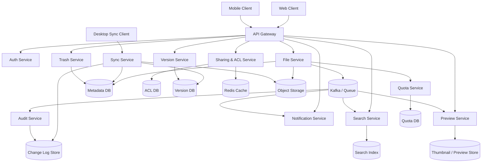

---

# 6. Core Design Philosophy

A Google Drive-like system is not a single storage engine.

It is a combination of:

* object storage for file bytes
* metadata databases for file structure
* ACL databases for permissions
* search indexes for discovery
* caches for hot data
* async workers for previews and indexing
* sync engines for offline clients
* event pipelines for consistency and audit

The system should separate:

| Concern       | Recommended Layer         |
| ------------- | ------------------------- |
| File content  | Object storage            |
| File metadata | Metadata DB               |
| Permissions   | ACL DB                    |
| Search        | Search index              |
| Hot state     | Redis                     |
| Previews      | Preview pipeline          |
| Sync changes  | Change log / event stream |
| Audit         | Immutable logs            |
| Quotas        | Quota service             |

---

# 7. Storage Model

Google Drive stores two different things:

1. **The actual file bytes**
2. **The metadata that describes those bytes**

This separation is essential.

---

## 7.1 File Bytes

Large binary files belong in object storage, not in a relational database.

Examples:

* PDFs
* videos
* archives
* images
* presentations
* spreadsheets

The object store should support:

* multipart upload
* chunking
* deduplication
* versioned object references
* replication
* lifecycle policies

---

## 7.2 Metadata

Metadata includes:

* file name
* file ID
* owner
* parent folder
* size
* MIME type
* modified timestamp
* version ID
* sharing visibility
* trash status
* checksum
* revision list pointer

---

# 8. Data Model

A simplified model looks like this:

| Entity      | Purpose                            |
| ----------- | ---------------------------------- |
| User        | Account identity                   |
| File        | File metadata                      |
| Folder      | Hierarchical container             |
| SharedDrive | Team-owned workspace               |
| ACL         | Access control                     |
| Version     | Revision history                   |
| ChangeEvent | Sync and audit                     |
| Preview     | Derived thumbnails/previews        |
| QuotaUsage  | Storage accounting                 |
| TrashItem   | Deleted files retained temporarily |

---

## ER Diagram

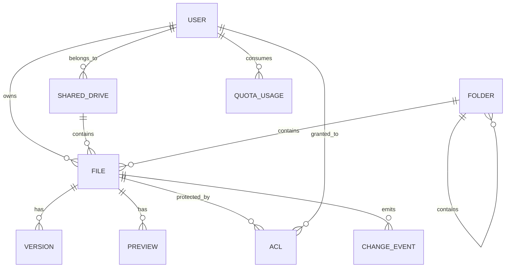

---

# 9. My Drive vs Shared Drives

This is one of the most important design distinctions.

Google’s shared drives are team-owned storage spaces where the organization owns the files, not an individual. Files remain after members leave, and access is granted through membership and file/folder permissions.

That means the system needs two ownership models:

---

## 9.1 My Drive

* owned by an individual user
* personal workspace
* default storage for user files
* strongest link to account quota

---

## 9.2 Shared Drives

* owned by the team or organization
* files survive member departure
* designed for collaboration
* shared visibility by default
* folder-level limited access possible

This is especially important for enterprise collaboration.

---

# 10. Folder Hierarchy

Folders are a tree-like structure.

However, file systems at scale cannot rely on physical nesting the way local disks do.

Use:

* folder IDs
* parent pointers
* materialized paths for fast reads where needed
* ACL inheritance rules
* async reindexing after moves

---

## Folder Tree Diagram

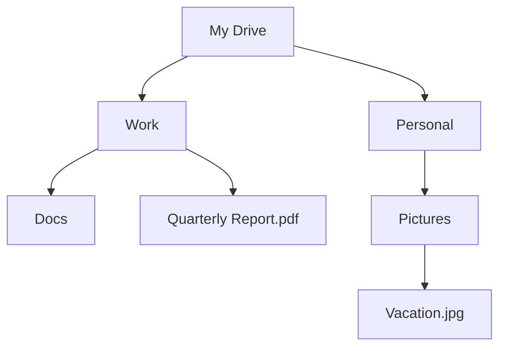

---

# 11. Upload Architecture

Uploading must be highly efficient.

Do not stream giant file bytes through app servers.

Instead:

1. Client asks for an upload session
2. Server authorizes the upload
3. Server returns a resumable or pre-signed upload URL
4. Client uploads directly to object storage
5. Server receives completion callback
6. Metadata is committed
7. Background workers process previews, indexing, virus scanning, and versioning

---

## Upload Flow

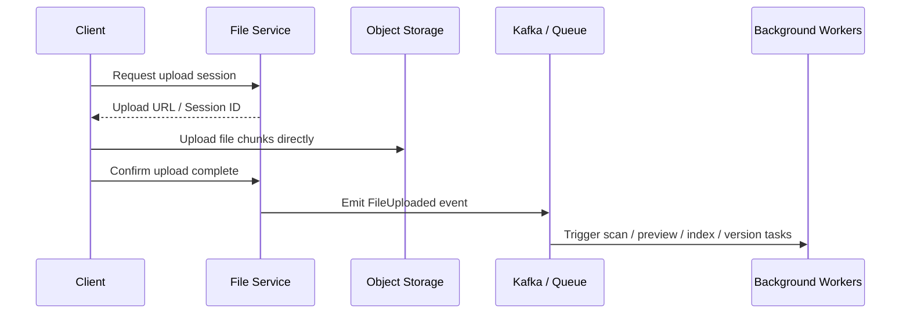

---

# 12. Why Direct-to-Storage Upload Matters

If every file passed through application servers:

* app servers would become bottlenecks
* memory usage would spike
* bandwidth costs would explode
* retries would hurt backend throughput
* large uploads would degrade the whole system

Direct-to-storage upload solves this elegantly.

---

# 13. Chunking and Resumable Uploads

Large uploads should be chunked.

This helps with:

* unreliable networks
* browser crashes
* mobile disconnects
* large file support
* resumability

A resumable upload session should track:

* chunk index
* chunk checksum
* completed parts
* offset
* upload ID

---

## Chunk Upload Diagram

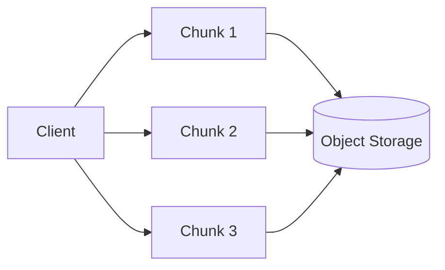

---

# 14. Versioning

Version history is a core Google Drive feature.

Every file change should create a new revision pointer.

This allows:

* restore old versions
* audit change history
* merge or replace uploads
* recover accidental overwrites

---

## Version Strategy

| Strategy      | Description                                  |
| ------------- | -------------------------------------------- |
| Full copy     | Store whole file again                       |
| Delta storage | Store diffs between versions                 |
| Hybrid        | Full snapshot periodically, diffs in between |

For large files, a hybrid strategy is usually best.

---

## Version History Diagram

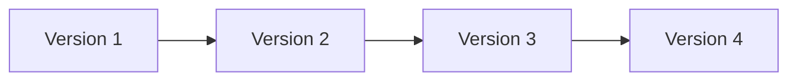

---

# 15. Permission Model

Google Drive sharing supports viewer, commenter, and editor roles, so access control must be granular and explicit. 

A production system should support:

| Role      | Capability                            |
| --------- | ------------------------------------- |
| Viewer    | Open/read only                        |
| Commenter | Read + comment                        |
| Editor    | Read + modify                         |
| Manager   | Manage folder/sharing in shared drive |
| Owner     | Full control for personal files       |

---

## Permission Evaluation

A request should be checked against:

1. user identity
2. group membership
3. file ACL
4. folder ACL
5. shared drive role
6. organization policy
7. link-sharing rules
8. expiration rules
9. external access policy

---

## ACL Flow

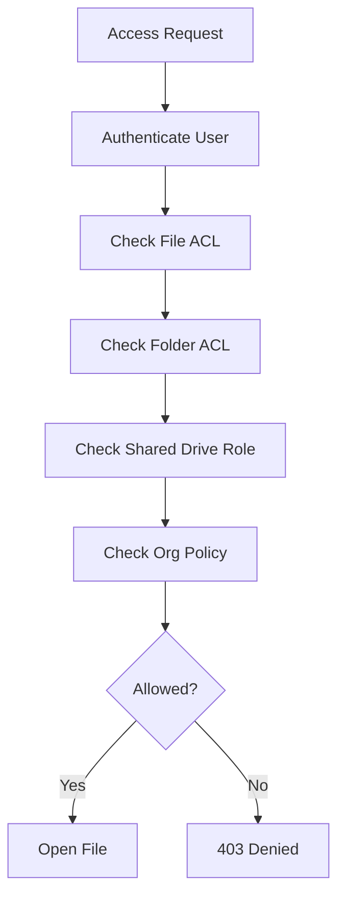

---

# 16. Sharing Architecture

Sharing can happen in multiple ways:

* specific email invite
* group sharing
* link sharing
* shared drive membership
* folder inheritance
* external collaborator access

Google’s shared drives support membership-based access and tailored sharing with non-members, and files contributed by external people in a shared drive owned by the organization are owned by the organization. 

This means sharing must be modeled as a combination of:

* direct grants
* inherited permissions
* organization ownership
* group-based access

---

# 17. Shared Drive Semantics

Shared drives are team-owned and persistent by design. Even if a user leaves, files remain in the shared drive and continue to be available to the team. Google also notes that shared drives can be synced to desktop. 

This is an important architectural signal:

* files must not be tied to an individual user account
* ownership must be decoupled from creator identity
* access must survive user deletion or departure

---

# 18. Sync Engine

A Drive-like desktop client must maintain local and cloud copies.

Google Drive for desktop supports syncing files to the cloud and using files offline, including files from shared drives. 

A production sync engine should support:

* local file watching
* delta detection
* background uploads
* conflict detection
* conflict resolution
* offline queueing
* retry with backoff
* selective sync
* folder sync rules

---

## Sync Flow

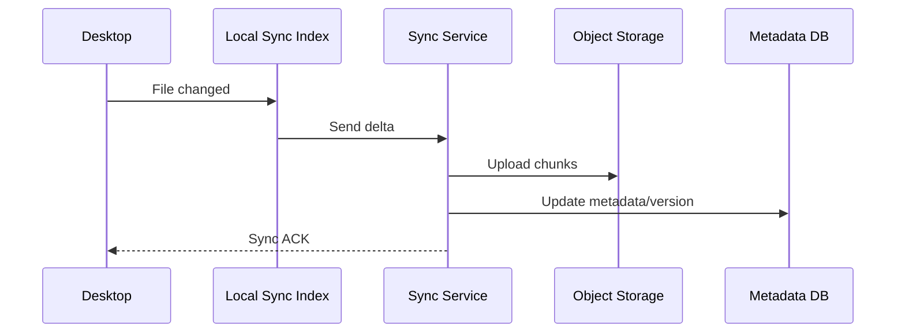

---

# 19. Offline Mode

Offline is not just a nice feature.

It is a major architectural requirement.

Users should be able to:

* open cached files
* edit docs offline
* queue changes
* sync later
* resolve conflicts safely

Google explicitly states that Drive for desktop supports offline use and that changes sync back to the cloud when the device is online. 

---

# 20. Conflict Resolution

When two devices edit the same file offline, conflicts can happen.

Strategies:

| Strategy        | Use Case                     |
| --------------- | ---------------------------- |
| Last write wins | Simple metadata updates      |
| Merge           | Collaborative document edits |
| Conflict copies | Binary files, spreadsheets   |
| CRDT / OT       | Real-time collaborative docs |

For binary files, conflict copies are often safest.

For collaborative documents, operational transformation or CRDT-based approaches are better.

---

# 21. Search Architecture

Search must be fast and flexible.

Search should support:

* file name search
* content search
* owner search
* tags
* mime type filters
* modified time filters
* shared-with-me search
* shared drive search

Use a dedicated search index.

---

## Search Indexing Flow

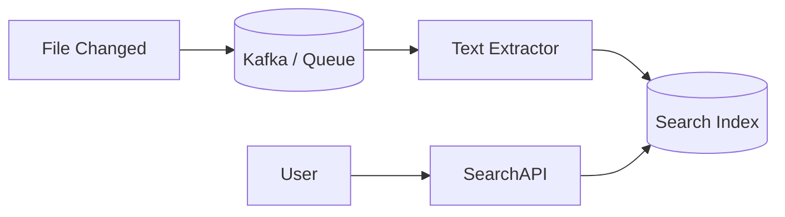

---

# 22. Preview Generation

Users expect previews for many file types.

Examples:

* images -> thumbnails
* PDFs -> page preview
* videos -> poster frame and stream preview
* docs -> text rendering
* spreadsheets -> sheet preview

Preview generation should be async.

This prevents upload latency from getting too high.

---

## Preview Pipeline

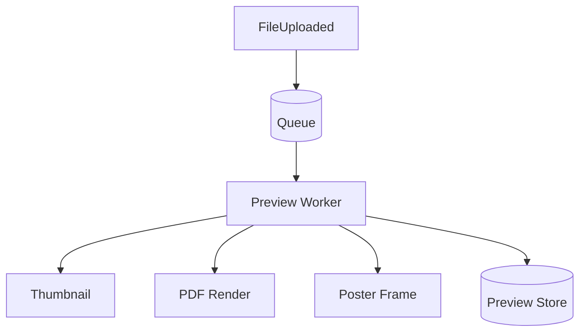

---

# 23. Storage Quota System

Google notes that storage is shared across Google Drive, Gmail, WhatsApp backups, and Google Photos, so quota must be account-wide. 

This implies a unified quota service.

It should track:

* active file bytes
* trash bytes
* version bytes
* shared-drive quota policies
* external contributions
* account-level usage

---

## Quota Architecture

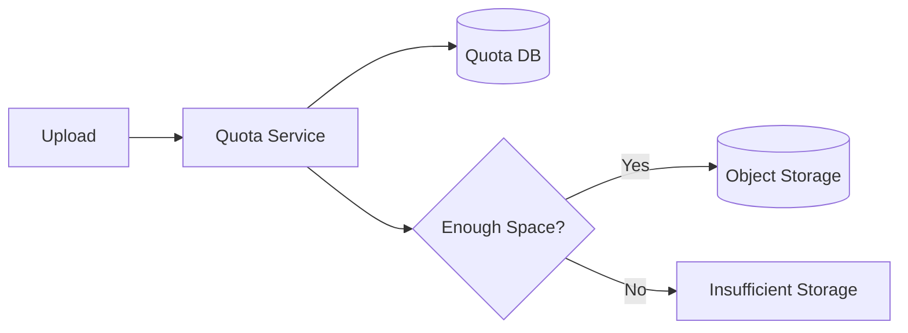

---

# 24. Large File Support

Google documents that shared drive files can be uploaded and synchronized up to 5 TB in size, and users can upload/copy 750 GB within 24 hours. 

That means the system must support:

* multipart uploads
* resumable sessions
* chunk checksums
* large object tracking
* storage lifecycle management

---

# 25. Trash and Recovery

Deleted files should not disappear immediately.

Users expect:

* restore from trash
* time-based retention
* admin recovery options
* shared drive trash policies

A typical design:

* soft-delete metadata
* move file to trash namespace
* retain for 30 days
* purge after retention

Google documents that files in Trash are deleted forever after 30 days and that shared drives have their own Trash. 

---

# 26. Real-Time Collaboration

For document types like docs, sheets, and slides, the platform must support simultaneous edits.

For a Drive-like system, collaboration is a layer on top of file storage.

Possible collaboration model:

* file state service
* edit operation log
* operational transforms or CRDTs
* presence tracking
* live cursor updates
* auto-save checkpoints

---

## Collaboration Flow

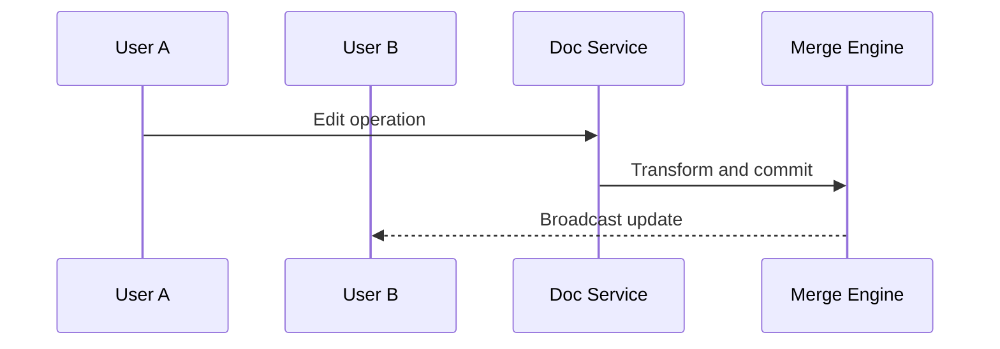

---

# 27. Object Storage Design

Object storage is the foundation for file durability.

Requirements:

* encryption at rest
* replication
* versioned objects
* lifecycle policies
* multipart upload
* checksum validation

A file service should only store metadata and object pointers, not the full binary body.

---

# 28. Deduplication

Many users upload the same file many times.

Deduplication can reduce cost dramatically.

Use:

* content hash
* chunk hash
* block-level dedup
* reference counting

For example:

* repeated PDFs in shared drives
* duplicate photos
* shared presentations

---

# 29. Immutable File Content, Mutable Metadata

A good design keeps file bytes mostly immutable.

Why?

* easier versioning
* easier deduplication
* easier replication
* easier caching
* safer restore

Metadata is mutable:

* name
* parent folder
* ACL
* trash status
* labels
* stars
* comments

---

# 30. Multi-Region Design

A global Drive-like platform must survive region failure.

Design principles:

* replicate metadata across regions
* replicate object storage
* route users to nearest healthy region
* keep sync events durable
* prefer active-active reads where safe

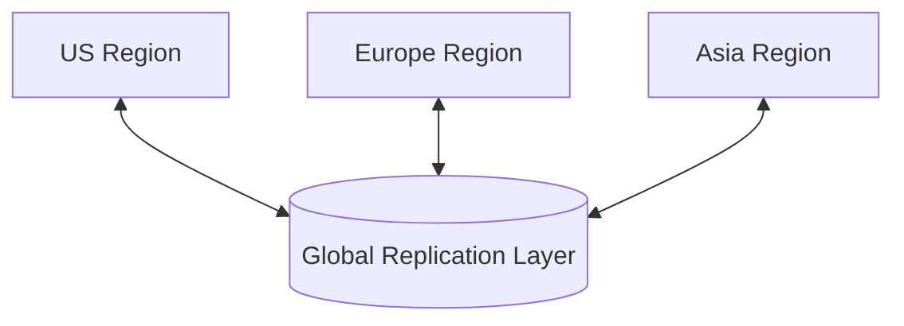

---

# 31. Security Architecture

Security is critical because Drive stores sensitive documents.

The platform must support:

* authentication
* authorization
* encryption in transit
* encryption at rest
* malware scanning
* access auditing
* share-link protection
* organization policies
* data loss prevention hooks

---

## Security Flow

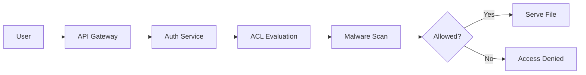

---

# 32. Audit Logging

Every access to shared files should be traceable.

Audit logs should capture:

* who opened a file
* who edited a file
* who shared it
* who deleted it
* who restored it
* when permissions changed

Audit logs are essential for enterprise compliance.

---

# 33. Folder Move Semantics

Moving folders is expensive because permissions, paths, indexes, and sync state may all be affected.

When a folder moves:

* parent pointers change
* ACL inheritance may change
* search index must update
* sync clients must receive delta
* previews remain stable
* version history remains attached to files

This is why folder moves should emit events rather than trigger massive synchronous rewrites.

---

# 34. Device Sync and Local Cache

Google Drive for desktop provides local access and sync behavior, and offline files sync back when online. 

A production sync client should maintain:

* local metadata cache
* local file cache
* change journal
* resumable upload queue
* download queue
* conflict resolution queue

---

## Local Sync Architecture

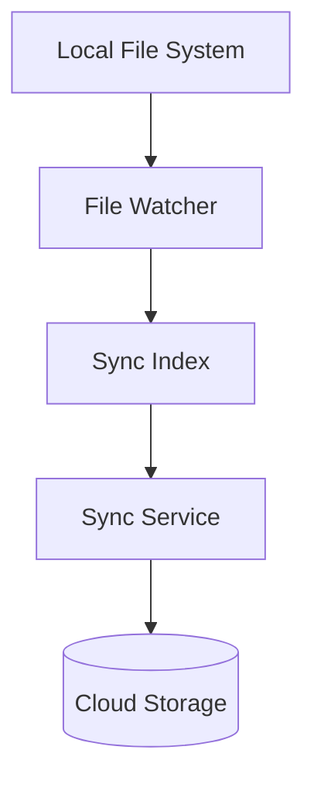

---

# 35. Event-Driven Backbone

Drive-like systems benefit enormously from an event-driven design.

Events include:

* FileUploaded
* FileModified
* FileShared
* PermissionChanged
* FileDeleted
* FileRestored
* VersionCreated
* PreviewGenerated
* SearchIndexed
* QuotaExceeded

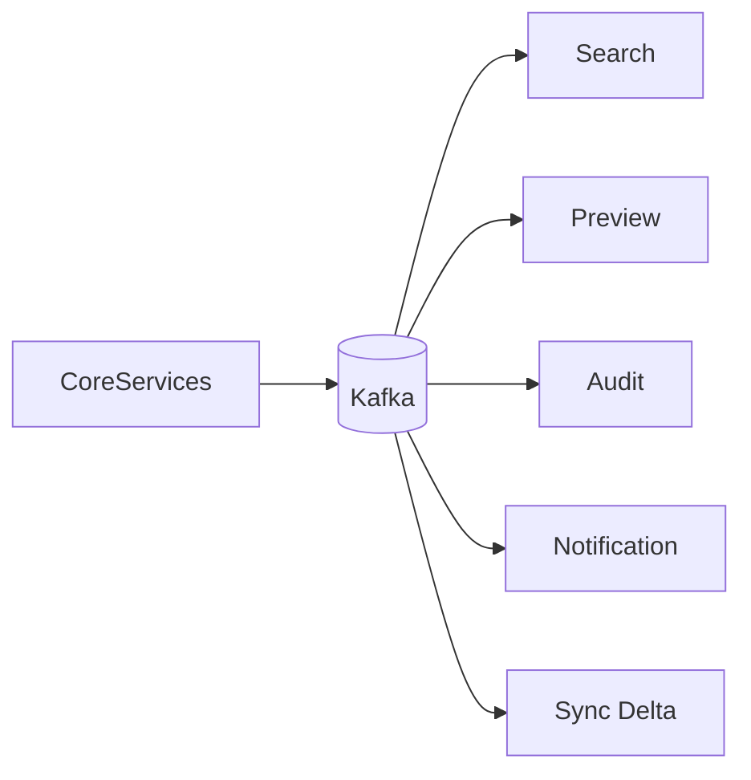

---

# 36. Why Async Processing Matters

If preview generation or indexing runs inline:

* uploads become slow
* user experience degrades
* timeouts increase
* scaling becomes expensive

Asynchronous processing keeps the upload path fast and responsive.

---

# 37. Folder and File Permissions at Scale

Permissions are one of the hardest parts.

A file may inherit access from:

* its folder
* its shared drive
* its direct ACL
* organization policy
* link-sharing policy

This must be resolved quickly on every access.

Caching ACL evaluations in Redis can reduce repeated computation.

---

# 38. Search and Metadata Consistency

Search is usually eventual-consistent.

Why acceptable?

* if a file appears in search 2–5 seconds late, the user can tolerate it
* but file visibility and permission enforcement must be strongly correct

So the design should enforce:

* strong consistency for access control
* eventual consistency for search index

---

# 39. Shared Drive Semantics in the Design

The shared-drive model changes how ownership works.

Google states that shared drive files belong to the team rather than an individual, and they remain in the drive even if members leave.

So the data model must include:

* team ownership
* manager roles
* content manager roles
* member roles
* organization policies

This is a fundamentally different ownership model from My Drive.

---

# 40. API Design

---

## Create Upload Session

```http
POST /files/upload/session
```

---

## Upload Chunk

```http
PUT /files/upload/{sessionId}/chunk/{index}
```

---

## Complete Upload

```http
POST /files/upload/{sessionId}/complete
```

---

## Share File

```http
POST /files/{fileId}/share
```

---

## Get File Metadata

```http
GET /files/{fileId}
```

---

## Search Files

```http
GET /search?q=budget%20report
```

---

## Get Version History

```http
GET /files/{fileId}/versions
```

---

## Restore Version

```http
POST /files/{fileId}/versions/{versionId}/restore
```

---

# 41. Failure Scenarios

A production file platform must survive many failures.

---

## 41.1 Object Store Outage

Mitigation:

* replicate objects
* use multi-AZ storage
* fallback region

---

## 41.2 Metadata DB Outage

Mitigation:

* read replicas
* multi-region replication
* failover routing

---

## 41.3 Sync Service Lag

Mitigation:

* queue retries
* local client buffering
* delta catch-up

---

## 41.4 Search Index Delay

Mitigation:

* eventual consistency
* fallback to metadata search
* background reindexing

---

## 41.5 Quota Calculation Error

Mitigation:

* centralized quota ledger
* periodic reconciliation
* idempotent adjustments

---

# 42. Rate Limiting and Abuse Prevention

File systems are often abused for:

* mass uploads
* spam links
* malware distribution
* brute force access attempts

Use:

* per-user limits
* per-IP limits
* shared-drive limits
* upload quotas
* malware scanning
* suspicious activity detection

Google documents shared-drive upload and copy limits, which shows that upload throttling is a real operational constraint. 

---

# 43. Observability

The system must monitor:

| Metric                  | Why                   |
| ----------------------- | --------------------- |
| Upload latency          | User experience       |
| Sync lag                | Offline client health |
| Search latency          | Discovery speed       |
| Permission failures     | Access correctness    |
| Preview generation time | UX                    |
| Quota errors            | Storage reliability   |
| Object-store error rate | Durability            |
| Cache hit ratio         | Performance           |
| Audit event backlog     | Compliance            |

---

# 44. Monitoring Architecture

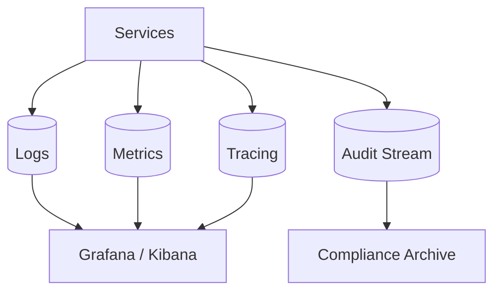

---

# 45. Final Production Architecture

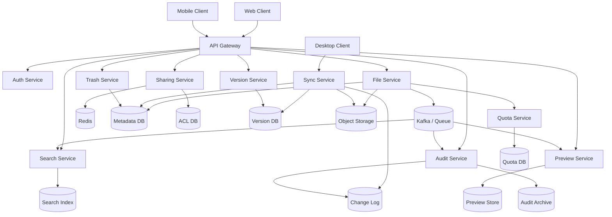

---

# 46. Tradeoffs

| Design Choice                | Benefit                  | Tradeoff                |
| ---------------------------- | ------------------------ | ----------------------- |
| Object storage for files     | Cheap, scalable, durable | Not query-friendly      |
| Metadata DB separate         | Fast metadata operations | More components         |
| Redis ACL cache              | Fast permissions         | Invalidation complexity |
| Async preview pipeline       | Fast uploads             | Eventual readiness      |
| Search index separate        | Fast search              | Search lag possible     |
| Shared drive ownership model | Better collaboration     | More complex ACL logic  |

---

# 47. Why This Design Matches Real Drive Behavior

This design reflects the way Google Drive actually behaves in several important ways:

* shared drives are team-owned and survive member departure 
* Drive for desktop supports offline sync and sync back to cloud 
* storage is shared across Drive, Gmail, WhatsApp backups, and Photos 
* shared-drive uploads have large file support and daily caps 
* sharing must support viewer/commenter/editor access patterns 

Those product details are not just UI features. They shape the architecture itself.

---

# 48. Key Takeaways

| Concept         | Summary                                 |
| --------------- | --------------------------------------- |
| File bytes      | Store in object storage                 |
| Metadata        | Store separately in a DB                |
| Permissions     | Use ACL service and inheritance         |
| Shared drives   | Team-owned collaboration spaces         |
| Offline access  | Local sync client + change log          |
| Search          | Dedicated search index                  |
| Version history | Revision system per file                |
| Large uploads   | Multipart resumable uploads             |
| Collab scale    | Use async pipelines and event streams   |
| Storage quota   | Centralized account-level quota service |

---

# Conclusion

A Google Drive-like system is not just a file server.

It is a deeply layered distributed collaboration platform.

It must support:

* durable object storage
* fine-grained access control
* team-owned shared drives
* offline desktop sync
* version history
* real-time collaboration
* search
* previews
* quota management
* auditability
* global scaling

The architecture should separate:

* file content
* metadata
* permissions
* sync events
* previews
* search
* versioning
* quotas
* audit logs

That separation is what allows the system to remain scalable and maintainable at massive scale.

The real Google Drive product behavior around shared drives, shared quota, offline sync, large upload limits, and permission roles strongly reinforces this architecture.

A production-grade Drive system is therefore a combination of:

* object storage
* metadata services
* sync engines
* ACL evaluation
* search indexing
* preview generation
* event-driven pipelines
* cache layers
* multi-region replication
* audit and compliance

That is how you build a cloud file platform that can safely support personal storage, enterprise collaboration, offline access, and global scale.