An Instagram-like system is one of the most realistic and challenging system design problems because it combines nearly every major distributed systems concern in one product:

* social graph
* media upload
* image/video processing
* personalized feed ranking
* stories and reels
* likes and comments
* follows and suggestions
* search and hashtags
* notifications
* direct messages
* moderation
* privacy controls
* real-time updates
* caching
* analytics
* multi-region availability

A simple social app is easy.

A production-grade Instagram-like platform is not.

The hard part is not storing a photo.

The hard part is serving billions of media requests, maintaining feed freshness, ranking content, supporting real-time interactions, and doing all of that reliably at global scale.

---

# 1. Problem Statement

Design a social media platform like Instagram where users can:

* create accounts
* follow and unfollow people
* upload images and videos
* post captions and hashtags
* like and comment on posts
* create stories
* publish reels
* send direct messages
* search users, hashtags, and content
* browse personalized feeds
* explore trending content
* save posts
* receive notifications
* report abuse
* manage privacy
* view analytics for creators

---

# 2. Functional Requirements

| Requirement      | Description                                         |
| ---------------- | --------------------------------------------------- |
| User Accounts    | Signup, login, profile management                   |
| Follow Graph     | Follow/unfollow users                               |
| Post Creation    | Upload photos/videos with captions                  |
| Media Processing | Resize images, transcode video, generate thumbnails |
| Feed Generation  | Personalized home feed                              |
| Stories          | Ephemeral content that expires                      |
| Reels            | Short-form video browsing                           |
| Likes            | Like and unlike posts                               |
| Comments         | Add and view comments                               |
| Direct Messages  | 1:1 and group messaging                             |
| Search           | Users, hashtags, captions, posts                    |
| Notifications    | Likes, comments, follows, mentions                  |
| Explore Page     | Recommended content                                 |
| Saved Posts      | Bookmark content                                    |
| Privacy Controls | Public, private, close friends, blocks              |
| Moderation       | Spam, abuse, NSFW filtering                         |
| Analytics        | Creator metrics and engagement insights             |

---

# 3. Non-Functional Requirements

| Requirement          | Goal                                                    |
| -------------------- | ------------------------------------------------------- |
| Scalability          | Support billions of interactions                        |
| Availability         | Service should remain accessible during partial outages |
| Low Latency          | Fast feed loading and media playback                    |
| Durability           | Posts and media must not disappear                      |
| Eventual Consistency | Acceptable for likes, comments, feed freshness          |
| Fault Tolerance      | Service must survive node and region failures           |
| Security             | Strong auth, privacy, and access control                |
| Cost Efficiency      | Media storage and bandwidth must be optimized           |
| Observability        | Logs, traces, metrics, dashboards                       |
| Abuse Resistance     | Spam, bots, and fake accounts must be controlled        |

---

# 4. Scale Estimation

Assume a large social platform scale:

| Metric               | Value                |
| -------------------- | -------------------- |
| Daily Active Users   | 500 Million          |
| Monthly Active Users | 1+ Billion           |
| Posts per Day        | 100 Million          |
| Stories per Day      | 300 Million          |
| Reels Views per Day  | 1 Billion+           |
| Likes per Day        | Several Billion      |
| Comments per Day     | Hundreds of Millions |
| Messages per Day     | Billions             |

---

## Why This Matters

A social platform is heavily read-oriented.

The system must support:

* millions of feed requests per second
* large fanout updates
* media delivery at low latency
* heavy ranking and recommendation load

The biggest bandwidth consumer is media delivery.

That means object storage and CDN are not optional.

They are foundational.

---

# 5. High-Level Architecture

```mermaid
flowchart TB
    Mobile[Mobile App]
    Web[Web App]
    Desktop[Desktop App]

    Gateway[API Gateway]
    Auth[Auth Service]
    UserSvc[User Service]
    SocialGraph[Follow Graph Service]
    PostSvc[Post Service]
    MediaSvc[Media Service]
    FeedSvc[Feed Service]
    StorySvc[Story Service]
    ReelSvc[Reel Service]
    LikeSvc[Like Service]
    CommentSvc[Comment Service]
    MsgSvc[Direct Message Service]
    SearchSvc[Search Service]
    NotifySvc[Notification Service]
    ExploreSvc[Explore/Ranking Service]
    ModSvc[Moderation Service]
    AnalyticsSvc[Analytics Service]

    Redis[(Redis Cache)]
    UserDB[(User DB)]
    GraphDB[(Social Graph DB)]
    PostDB[(Post DB)]
    StoryDB[(Story DB)]
    MessageDB[(Message DB)]
    MediaStore[(Object Storage)]
    CDN[CDN]
    Kafka[(Kafka / Event Bus)]
    SearchIndex[(Search Index)]
    FeatureStore[(Feature Store)]
    Warehouse[(Data Warehouse)]

    Mobile --> Gateway
    Web --> Gateway
    Desktop --> Gateway

    Gateway --> Auth
    Gateway --> UserSvc
    Gateway --> SocialGraph
    Gateway --> PostSvc
    Gateway --> MediaSvc
    Gateway --> FeedSvc
    Gateway --> StorySvc
    Gateway --> ReelSvc
    Gateway --> LikeSvc
    Gateway --> CommentSvc
    Gateway --> MsgSvc
    Gateway --> SearchSvc
    Gateway --> NotifySvc
    Gateway --> ExploreSvc
    Gateway --> ModSvc
    Gateway --> AnalyticsSvc

    Auth --> UserDB
    UserSvc --> UserDB
    SocialGraph --> GraphDB
    PostSvc --> PostDB
    StorySvc --> StoryDB
    MsgSvc --> MessageDB
    MediaSvc --> MediaStore
    MediaSvc --> CDN
    FeedSvc --> Redis
    ExploreSvc --> FeatureStore
    SearchSvc --> SearchIndex
    Kafka --> FeedSvc
    Kafka --> NotifySvc
    Kafka --> SearchSvc
    Kafka --> ExploreSvc
    Kafka --> AnalyticsSvc
    Kafka --> ModSvc
    AnalyticsSvc --> Warehouse
```

---

# 6. Core Design Philosophy

An Instagram-like system must separate concerns cleanly.

| Concern              | Recommended Layer                |
| -------------------- | -------------------------------- |
| Media bytes          | Object storage                   |
| Media delivery       | CDN                              |
| User identity        | Auth + user DB                   |
| Social relationships | Graph store                      |
| Posts                | Post metadata DB                 |
| Feed generation      | Feed service + ranking service   |
| Stories              | Time-limited story store         |
| Reels                | Video pipeline + ranking         |
| DMs                  | Message store + realtime gateway |
| Search               | Search index                     |
| Hot state            | Redis                            |
| Events               | Kafka                            |
| Analytics            | Warehouse                        |

---

# 7. Core Product Surfaces

The product has distinct surfaces with different architecture needs.

| Surface       | Main Challenge                   |
| ------------- | -------------------------------- |
| Home Feed     | Ranking and freshness            |
| Profile Page  | Media listing and privacy        |
| Post Detail   | Likes, comments, media           |
| Stories       | Ephemeral retrieval              |
| Reels         | High-volume short video delivery |
| Explore       | Recommendation system            |
| Search        | Fast discovery                   |
| DMs           | Realtime messaging               |
| Notifications | Event-driven fanout              |

---

# 8. User Flow Overview

A user typically follows this path:

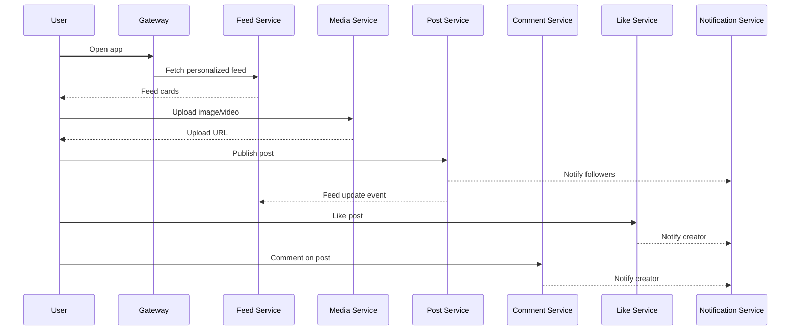

---

# 9. User Service

The user service manages:

* profiles
* bio
* avatar
* verification status
* privacy settings
* account state
* blocking

This data is relatively small but heavily read.

Use:

* relational DB for correctness
* Redis for hot profile cache

---

## Profile Fields

| Field        | Purpose                   |
| ------------ | ------------------------- |
| user_id      | Unique identifier         |
| username     | Public handle             |
| display_name | Public name               |
| bio          | Short profile description |
| avatar_url   | Profile image             |
| is_private   | Privacy flag              |
| is_verified  | Creator/official badge    |
| created_at   | Account time              |
| status       | active/suspended/deleted  |

---

# 10. Follow Graph Service

This is one of the most important parts.

The follow graph is the social backbone.

It answers:

* who follows whom
* who I follow
* mutual follows
* follower count
* following count
* privacy checks

A graph DB or graph-like store is useful, but at huge scale many teams use a sharded relational or NoSQL approach with heavy denormalization.

---

## Follow Graph Model

| Entity      | Description                |
| ----------- | -------------------------- |
| follower_id | User who follows           |
| followee_id | User being followed        |
| created_at  | Follow time                |
| state       | active / blocked / pending |

---

## Graph Diagram

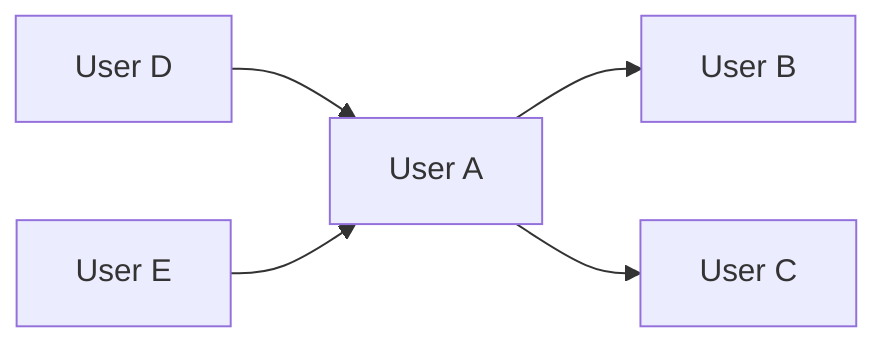

---

# 11. Privacy and Access Control

Instagram-like systems need privacy controls such as:

* public account
* private account
* close friends
* blocked users
* restricted users
* story audience restrictions

Access must be checked before content is returned.

A private account should only expose content to approved followers.

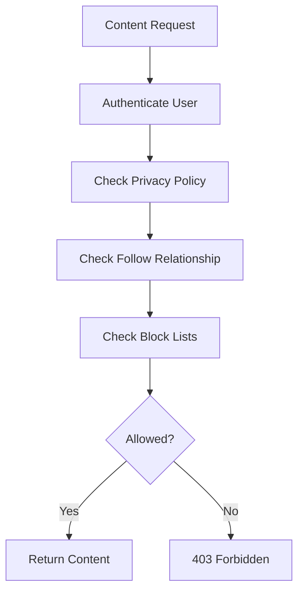

---

# 12. Post Service

The post service stores the post metadata, not the full media file.

A post includes:

* author
* caption
* hashtags
* location
* media references
* creation time
* visibility
* engagement counters

---

## Post Data Model

| Field         | Purpose                  |
| ------------- | ------------------------ |
| post_id       | Unique post              |
| author_id     | Creator                  |
| caption       | Text                     |
| media_ids     | Images/videos            |
| hashtags      | Search & discovery       |
| location      | Optional tag             |
| visibility    | public/private/followers |
| created_at    | Timeline order           |
| like_count    | Engagement               |
| comment_count | Engagement               |

---

# 13. Media Service

Media storage is one of the most expensive parts of the system.

The media service should:

* accept uploads
* validate file type
* generate thumbnails
* resize images
* transcode videos
* store multiple renditions
* create streaming-ready formats
* generate preview images

The media bytes should go directly to object storage, not through app servers.

---

## Upload Flow

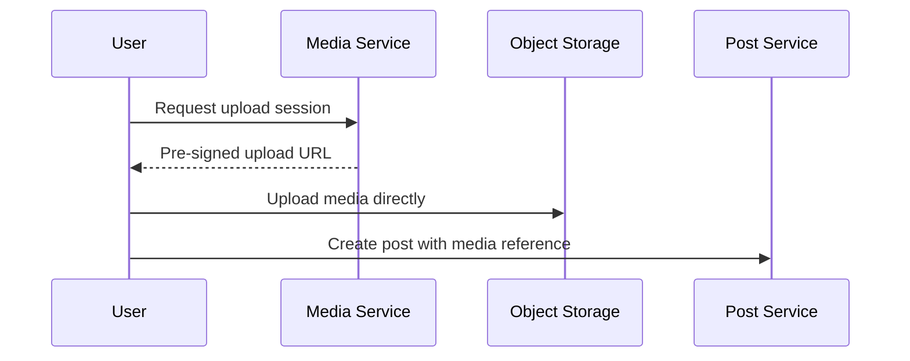

---

# 14. Media Processing Pipeline

After upload, background workers should process the file.

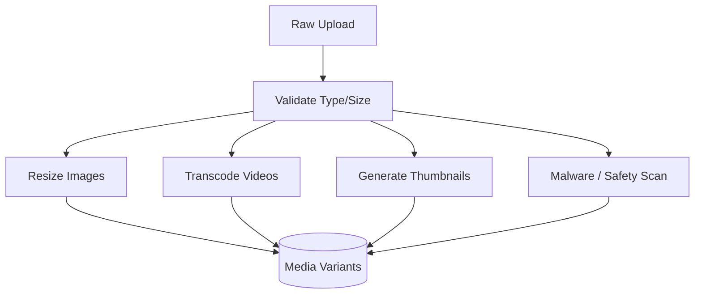

This must be asynchronous.

If processing were synchronous:

* uploads would be slow
* app servers would become bottlenecks
* user experience would degrade

---

# 15. CDN and Media Delivery

A social media platform delivers huge amounts of image and video traffic.

A CDN is mandatory.

It reduces:

* latency
* bandwidth cost
* origin load

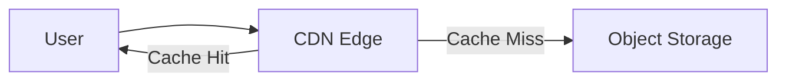

---

# 16. Post Creation Flow

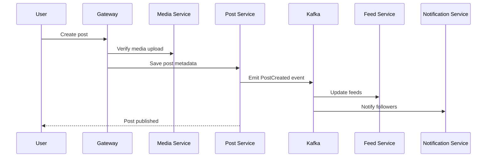

---

# 17. Feed System: The Heart of Instagram

The feed is the most important user-facing surface.

The feed must be:

* personalized
* fresh
* ranked
* fast
* scalable

This is one of the hardest problems in the system.

---

# 18. Feed Generation Strategies

There are two major feed strategies.

---

## 18.1 Fanout on Write

When a user posts something, the system precomputes the feed for followers.

### Benefits

* fast reads
* easy home feed response

### Problems

* expensive writes
* hard for users with millions of followers

---

## 18.2 Fanout on Read

When a user opens the feed, the system fetches recent posts from followed users and ranks them on demand.

### Benefits

* cheaper writes
* easier for celebrity accounts

### Problems

* expensive reads
* slower feed generation

---

## 18.3 Hybrid Fanout

This is usually the best production approach.

* Fanout on write for normal users
* Fanout on read for high-fanout users
* Cache merged feed results

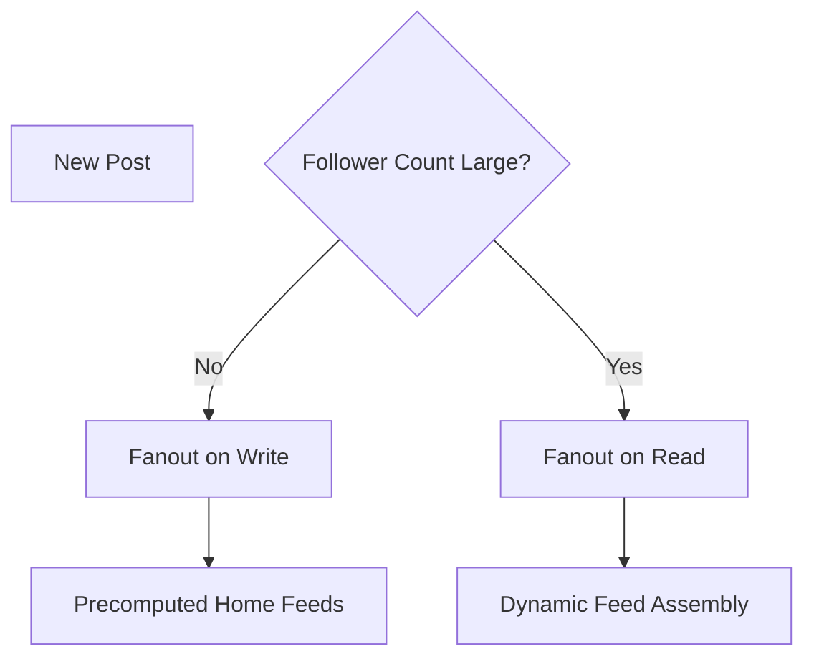

---

# 19. Feed Service Architecture

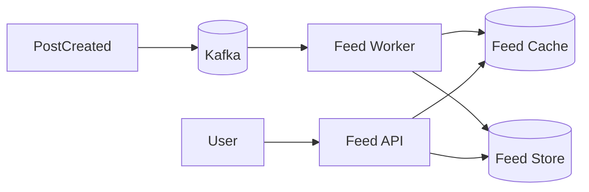

---

# 20. Feed Ranking

A feed should not be purely chronological.

Instagram-like ranking considers:

| Signal                | Purpose                   |
| --------------------- | ------------------------- |
| Relationship strength | Friends/followed accounts |
| Engagement rate       | Likes/comments            |
| Recency               | Freshness                 |
| Content type          | Photo, video, reel, story |
| User interest         | Historical behavior       |
| Session context       | Current browsing behavior |
| Popularity            | Trending signals          |
| Negative feedback     | Skips, hides, reports     |

---

## Ranking Pipeline

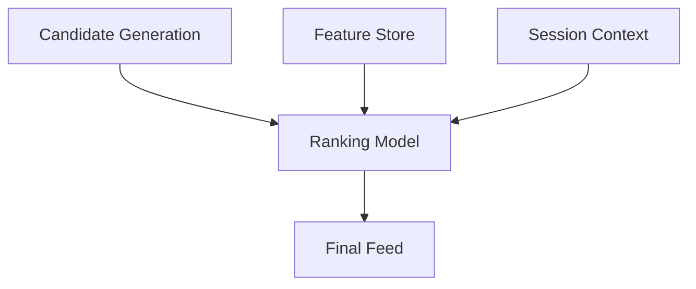

This is usually a machine-learning problem, not just SQL sorting.

---

# 21. Explore Page

The Explore page is a discovery engine.

It is not the same as the feed.

Feed = content from followed accounts and close connections.

Explore = content from outside the immediate social graph.

The explore system uses:

* embeddings
* similar-user behavior
* content similarity
* topic clustering
* engagement signals
* trending scoring

---

# 22. Stories

Stories are ephemeral content that disappears after a limited time.

They require:

* time-based expiration
* fast retrieval
* viewer tracking
* close-friends audience control
* sequence ordering
* view state

---

## Story Architecture

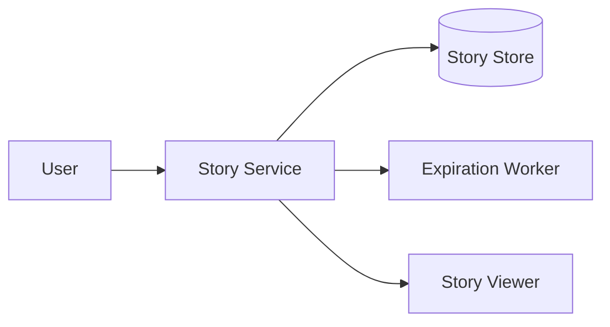

Stories are time-sensitive and should use TTL-based retention.

---

# 23. Reels

Reels are short-form videos.

They are usually highly recommendation-driven.

Reels require:

* video transcoding
* adaptive delivery
* ranking and personalization
* autoplay behavior
* low-latency content delivery
* engagement tracking

Reels are often served from a specialized ranking pipeline.

---

## Reels Feed Flow

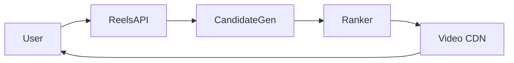

---

# 24. Likes and Comments

Likes and comments are write-heavy engagement features.

They are important not just for social interaction but also for ranking.

---

## Like System

Likes should be:

* idempotent
* fast
* cache-friendly
* consistent enough

Store:

* unique user-post like state
* like counters
* event logs

---

## Comment System

Comments should support:

* pagination
* threading or simple flat mode
* moderation
* anti-spam checks
* notification fanout

---

# 25. Likes Flow

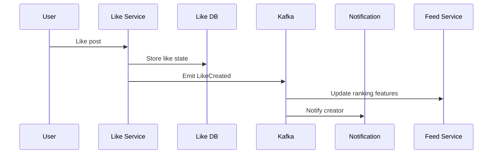

---

# 26. Comments Flow

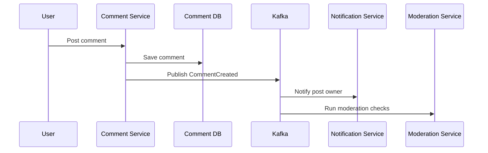

---

# 27. Direct Messages

Instagram-like systems often include DMs.

DMs require:

* real-time delivery
* read receipts
* media attachments
* delivery receipts
* typing indicators
* spam and abuse protection

Use:

* WebSocket gateway
* message store
* queue-backed delivery
* presence service

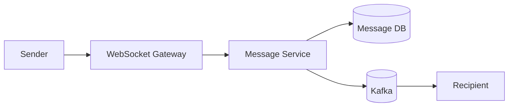

---

# 28. Notifications

Notifications are event-driven.

Examples:

* someone followed you
* someone liked your post
* someone commented
* someone mentioned you
* your story was viewed

Use Kafka and worker fleets to fan out notifications.

---

## Notification Flow

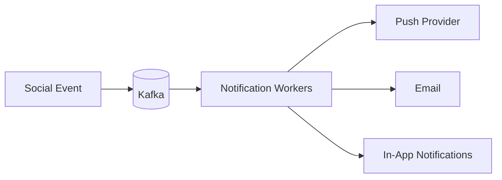

---

# 29. Search System

Search should support:

* usernames
* hashtags
* captions
* places
* posts
* comments
* accounts

Use a search engine like Elasticsearch or OpenSearch.

Search should index:

* username tokens
* text tokens
* hashtags
* metadata
* popularity scores

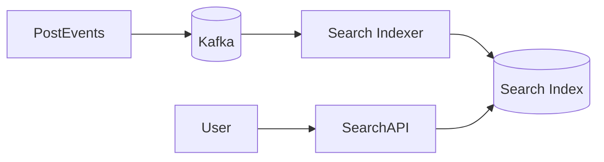

---

# 30. Hashtags and Mentions

Hashtags and mentions are important discovery mechanisms.

The system should:

* parse hashtags at post time
* index them
* support trend computation
* notify mentioned users

Hashtags become part of search and explore ranking.

---

# 31. Privacy and Blocking

A serious social system must support privacy controls.

Users may:

* block another user
* restrict users
* report abuse
* limit story audience
* make accounts private
* hide likes counts
* disable comments

Privacy rules must be enforced before any content is returned.

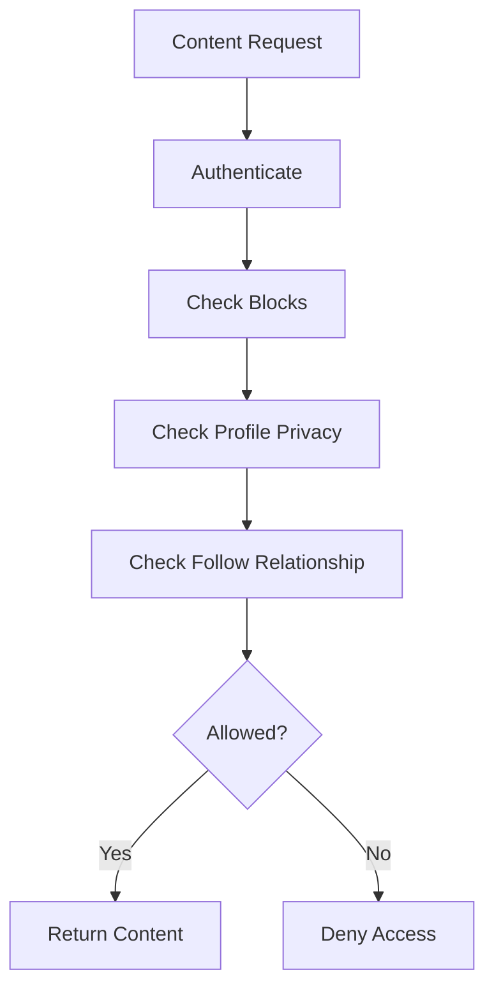

---

# 32. Saved Posts

Saved posts are a simple but important feature.

They require:

* user-bookmark relationship
* fast retrieval
* folder or collection support
* privacy and sync

This is usually a lightweight service built on top of post IDs.

---

# 33. Real-Time Delivery

A modern social app should show:

* likes arriving in near real time
* comments appearing in active threads
* follow notifications
* DM updates
* live story view counts

Use:

* WebSockets
* server-sent events where appropriate
* Kafka fanout
* Redis pub/sub for short-lived ephemeral updates

---

# 34. Real-Time Activity Flow

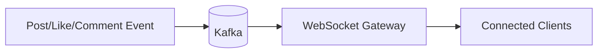

---

# 35. Data Storage Strategy

A social media platform needs multiple storage systems.

| Data                 | Recommended Store           |
| -------------------- | --------------------------- |
| User profiles        | SQL                         |
| Follow graph         | Graph store / sharded NoSQL |
| Posts                | SQL or NoSQL                |
| Media                | Object storage              |
| Feed materialization | Redis + DB                  |
| Stories              | TTL-backed store            |
| Reels metadata       | NoSQL                       |
| DMs                  | NoSQL / message store       |
| Search index         | Elasticsearch               |
| Analytics            | Warehouse                   |

---

# 36. Why Object Storage is Essential

Media is huge.

Do not store images and videos in relational DBs.

Use object storage for:

* photos
* videos
* thumbnails
* avatars
* story assets
* reel assets

Then serve through CDN.

---

# 37. Why Redis is Essential

Redis is useful for:

* cached feeds
* story viewers
* like counters
* session state
* recent notifications
* rate limiting
* hot profiles

At Instagram scale, hot reads must avoid the main databases.

---

# 38. Hot Key Problem

A famous user can create extreme hot spots.

Millions of people may:

* open the profile
* view the feed
* like the same post
* request the same media

Solutions:

* cache aggressively
* use CDN
* precompute feeds
* shard counters
* limit fanout on write for celebrities

---

# 39. Fanout Strategy

For normal users:

* fanout on write works well

For celebrities:

* fanout on read is better

So the best production design is hybrid.

```mermaid
flowchart TD
    PostCreated --> Decide{Celebrity?}
    Decide -->|No| FanoutWrite[Fanout on Write]
    Decide -->|Yes| FanoutRead[Fanout on Read]
```

This prevents one celebrity account from overwhelming the system.

---

# 40. Feed Caching

The feed is one of the most frequently accessed data structures.

Cache:

* first page of feed
* story trays
* top recommendations
* profile post grids
* explore suggestions

Use TTLs and cache invalidation on major events.

---

# 41. Ranking and Personalization

The platform should not show content purely based on chronology.

It should use:

* social proximity
* engagement
* interest vectors
* recency
* content type
* creator affinity
* session behavior
* negative feedback

This is typically a multi-stage ranking system:

1. candidate generation
2. filtering
3. ranking
4. re-ranking
5. business rule enforcement

---

# 42. Feed Rendering Flow

```mermaid
sequenceDiagram
    participant User
    participant FeedAPI
    participant Cache
    participant Ranker
    participant MediaCDN

    User->>FeedAPI: Open home feed
    FeedAPI->>Cache: Check feed cache
    alt Cache hit
        Cache-->>FeedAPI: Feed items
    else Cache miss
        FeedAPI->>Ranker: Generate feed
        Ranker-->>FeedAPI: Ranked posts
        FeedAPI->>Cache: Store result
    end
    FeedAPI-->>User: Feed cards
    User->>MediaCDN: Fetch post media
```

---

# 43. Moderation and Abuse Detection

A social platform is constantly attacked by:

* spam bots
* fake accounts
* abusive comments
* scam DMs
* NSFW content
* copyright violations
* coordinated manipulation

Moderation should include:

* text filters
* image/video classification
* user reports
* trust scores
* shadow bans
* rate limits
* human review queues

```mermaid
flowchart LR
    Content[New Content] --> Kafka[(Kafka)]
    Kafka --> TextFilter[Text Filter]
    Kafka --> ImageFilter[Vision Filter]
    Kafka --> SpamFilter[Spam Filter]
    Kafka --> HumanReview[Human Review Queue]
    TextFilter --> Action[Allow / Collapse / Remove]
    ImageFilter --> Action
    SpamFilter --> Action
    HumanReview --> Action
```

---

# 44. Analytics Pipeline

Creators and product teams need analytics.

Track:

* impressions
* views
* likes
* comments
* shares
* save actions
* story completion
* reel watch time
* follower growth

Use Kafka to stream events into a warehouse for BI and ML.

```mermaid
flowchart TB
    SocialEvents --> Kafka[(Kafka)]
    Kafka --> StreamProc[Stream Processing]
    StreamProc --> Warehouse[(Data Warehouse)]
    Warehouse --> Dashboards[Analytics Dashboards]
    Warehouse --> ML[Recommendation Training]
```

---

# 45. Observability

The system must be observable at every layer.

| Metric                | Why                |
| --------------------- | ------------------ |
| Feed latency          | UX                 |
| Upload latency        | Creator experience |
| CDN hit ratio         | Media performance  |
| Message lag           | Realtime health    |
| Search latency        | Discovery speed    |
| Notification failures | Reliability        |
| Moderation backlog    | Safety             |
| Cache hit ratio       | Cost and speed     |

---

# 46. API Design

---

## Signup/Login

```http id="insta_api_01"
POST /auth/signup
POST /auth/login
```

---

## Get Feed

```http id="insta_api_02"
GET /feed?cursor=...
```

---

## Create Post

```http id="insta_api_03"
POST /posts
```

---

## Like Post

```http id="insta_api_04"
POST /posts/{postId}/like
```

---

## Comment

```http id="insta_api_05"
POST /posts/{postId}/comments
```

---

## Follow

```http id="insta_api_06"
POST /users/{userId}/follow
```

---

## Stories

```http id="insta_api_07"
POST /stories
GET /stories/feed
```

---

## Reels

```http id="insta_api_08"
GET /reels/feed
```

---

## Search

```http id="insta_api_09"
GET /search?q=...
```

---

# 47. Database Sharding Strategy

A social system must shard aggressively.

| Data         | Sharding Key         |
| ------------ | -------------------- |
| Users        | user_id              |
| Posts        | author_id or post_id |
| Feed entries | viewer_id            |
| Messages     | conversation_id      |
| Stories      | author_id            |
| Likes        | post_id              |
| Comments     | post_id              |
| Follow edges | follower_id          |

Different data types want different sharding strategies.

---

# 48. Multi-Region Architecture

A global platform needs regional deployment.

Use:

* active-active reads
* region-local caches
* replicated metadata
* CDN edge delivery
* asynchronous event replication

```mermaid 
flowchart TB
    US[US Region]
    EU[EU Region]
    APAC[APAC Region]

    US --> GlobalRep[(Global Replication Layer)]
    EU --> GlobalRep
    APAC --> GlobalRep

    GlobalRep --> CDN[Global CDN]
```

---

# 49. Handling Large Creators

A creator with millions of followers is a special case.

If every post fans out to every follower directly:

* queue explosion
* DB pressure
* cache stampede
* write amplification

Use:

* hybrid fanout
* delayed fanout
* feed precomputation
* special celebrity routing
* cache summaries

---

# 50. Why This Design Works

This architecture works because it separates the platform into independent subsystems:

| Subsystem    | Purpose                          |
| ------------ | -------------------------------- |
| Identity     | User accounts and auth           |
| Social graph | Follow relationships             |
| Content      | Post and media storage           |
| Delivery     | CDN and media pipeline           |
| Ranking      | Feed and explore personalization |
| Interaction  | Likes, comments, follows, saves  |
| Messaging    | Direct messages                  |
| Discovery    | Search and hashtags              |
| Moderation   | Abuse handling                   |
| Analytics    | Product intelligence             |

That separation makes the system scalable and maintainable.

---

# 51. Final Production Architecture

```mermaid
flowchart TB
    Client[Mobile / Web / Desktop]
    Gateway[API Gateway]
    Auth[Auth Service]
    User[User Service]
    Graph[Follow Graph Service]
    Post[Post Service]
    Media[Media Service]
    Feed[Feed Service]
    Story[Story Service]
    Reel[Reel Service]
    Like[Like Service]
    Comment[Comment Service]
    DM[Direct Message Service]
    Search[Search Service]
    Notify[Notification Service]
    Explore[Explore Service]
    Mod[Moderation Service]
    Analytics[Analytics Service]

    Redis[(Redis)]
    UserDB[(User DB)]
    GraphDB[(Graph DB)]
    PostDB[(Post DB)]
    StoryDB[(Story DB)]
    MsgDB[(Message DB)]
    ObjectStore[(Object Storage)]
    CDN[CDN]
    Kafka[(Kafka)]
    SearchIndex[(Search Index)]
    FeatureStore[(Feature Store)]
    Warehouse[(Warehouse)]

    Client --> Gateway

    Gateway --> Auth
    Gateway --> User
    Gateway --> Graph
    Gateway --> Post
    Gateway --> Media
    Gateway --> Feed
    Gateway --> Story
    Gateway --> Reel
    Gateway --> Like
    Gateway --> Comment
    Gateway --> DM
    Gateway --> Search
    Gateway --> Notify
    Gateway --> Explore
    Gateway --> Mod
    Gateway --> Analytics

    Auth --> UserDB
    User --> UserDB
    Graph --> GraphDB
    Post --> PostDB
    Story --> StoryDB
    DM --> MsgDB
    Media --> ObjectStore
    Media --> CDN
    Feed --> Redis
    Explore --> FeatureStore
    Search --> SearchIndex

    Post --> Kafka
    Like --> Kafka
    Comment --> Kafka
    Story --> Kafka
    Reel --> Kafka
    DM --> Kafka
    Feed --> Kafka
    Mod --> Kafka
    Analytics --> Kafka

    Kafka --> Feed
    Kafka --> Notify
    Kafka --> Search
    Kafka --> Explore
    Kafka --> Mod
    Kafka --> Analytics
```

---

# 52. Tradeoffs

| Design Choice           | Benefit                | Tradeoff                          |
| ----------------------- | ---------------------- | --------------------------------- |
| Fanout on write         | Fast feed reads        | Expensive writes                  |
| Fanout on read          | Scales for celebrities | Slower reads                      |
| Redis caching           | Very fast              | Memory cost                       |
| Search index            | Fast search            | Eventual consistency              |
| Async media processing  | Fast uploads           | Delay before processing completes |
| Hybrid ranking          | Better relevance       | More complex pipeline             |
| Multi-region deployment | High resilience        | Operational complexity            |

---

# 53. Key Takeaways

| Concept        | Summary                               |
| -------------- | ------------------------------------- |
| Social graph   | Foundation of follows and privacy     |
| Media pipeline | Must be async and CDN-backed          |
| Feed           | Hybrid fanout plus ranking            |
| Stories        | Ephemeral TTL-based content           |
| Reels          | Video recommendation-heavy surface    |
| DMs            | Realtime messaging system             |
| Search         | Dedicated indexed subsystem           |
| Moderation     | Must be deeply integrated             |
| Analytics      | Streamed into warehouse               |
| Scale          | Requires sharding, caching, and Kafka |

---

# Conclusion

A complete Instagram-like system is not just a photo-sharing app.

It is a large distributed social platform with:

* media-heavy uploads
* feed ranking
* follow graph complexity
* stories and reels
* comments and likes
* messaging
* privacy and moderation
* search and discovery
* analytics and experimentation
* high-bandwidth global delivery

The correct architecture uses:

* object storage for media
* CDN for delivery
* Redis for hot state
* Kafka for event streams
* search indexes for discovery
* separate services for feed, stories, reels, DMs, and moderation
* hybrid fanout for scaling the feed
* multi-region replication for availability
* strong ACL enforcement for privacy

A production-grade social system succeeds only when it balances:

* freshness
* relevance
* speed
* safety
* scale
* reliability

That is what makes an Instagram-like platform a true large-scale system design challenge.
