Netflix is one of the most demanding system design problems in modern backend engineering because it combines almost every hard distributed-systems challenge in one product: massive video ingestion, expensive transcoding, global delivery, extreme read traffic, personalization, search, analytics, multi-device playback, and multi-region reliability.

Public Netflix engineering material shows several strong architectural signals that shape a realistic design. Netflix has publicly said it uses AWS for compute, storage, and networking, it runs Open Connect as its own global CDN to localize traffic near users, it rebuilt its video processing pipeline with microservices, it uses a sophisticated recommendation stack with many specialized machine-learned models, and it operates with a global active-active cloud mindset across AWS regions. Netflix also describes Zuul as its edge gateway and has publicly documented work to reduce connection churn there.

The design below treats those public signals as the architectural backbone and then builds a complete production-grade Netflix-like platform around them.

---

# 1. Problem Statement

Design a global streaming platform where users can:

* sign up and log in
* browse content
* search for titles
* watch videos on multiple devices
* resume playback across devices
* like, rate, and save titles
* receive personalized recommendations
* see trending and curated rows
* upload and process content or metadata internally
* support subtitles, multiple audio tracks, and adaptive bitrate playback
* operate reliably across regions and failures
* deliver content with very low startup latency

---

# 2. Functional Requirements

| Requirement       | Description                                                |
| ----------------- | ---------------------------------------------------------- |
| Authentication    | Users can create accounts and log in securely              |
| Content Catalog   | Users can browse movies, shows, and episodes               |
| Search            | Users can search by title, cast, genre, language, and more |
| Playback          | Users can stream content with minimal buffering            |
| Continue Watching | Playback resumes from last watched position                |
| Recommendations   | Personalized rows and ranking of titles                    |
| Profiles          | Multiple profiles per account                              |
| Ratings/Likes     | Engagement signals for ranking and recommendations         |
| Watch History     | Track playback events and progress                         |
| Subtitles         | Multiple subtitle tracks                                   |
| Audio Tracks      | Multiple language tracks                                   |
| Multi-Device Sync | Same account across TV, mobile, web                        |
| Downloads         | Offline viewing where supported                            |
| Notifications     | New releases, reminders, recommendations                   |
| Analytics         | Track engagement and quality metrics                       |
| Admin/Moderation  | Content governance and operations                          |
| Experimentation   | A/B testing for recommendation and UI changes              |

---

# 3. Non-Functional Requirements

| Requirement     | Goal                                                          |
| --------------- | ------------------------------------------------------------- |
| Scalability     | Handle millions of concurrent users and billions of requests  |
| Availability    | Playback should remain available even during partial failures |
| Low Latency     | Fast homepage, fast search, fast playback startup             |
| Durability      | Video assets and metadata must not be lost                    |
| Consistency     | Watch progress and catalog metadata should remain reliable    |
| Fault Tolerance | Failures should degrade gracefully                            |
| Global Reach    | Users worldwide should get fast delivery                      |
| Cost Efficiency | Bandwidth and storage must be optimized                       |
| Observability   | Metrics, logs, traces, quality monitoring                     |
| Security        | Account security, DRM, content access control                 |
| Elasticity      | Handle viral spikes and new releases                          |
| Maintainability | Microservice boundaries should stay clean                     |

---

# 4. Scale Estimation

A Netflix-like platform is read-heavy and media-heavy.

For design purposes, assume:

* 200 million daily active users
* 50 million concurrent active users during peak hours
* 1 billion playback requests per day
* 50 million searches per day
* 10 million write events per day
* 1–5 PB of new content processing per day depending on creator/internal scale
* global traffic across many regions

If 1 billion playback requests happen daily:

```text
1,000,000,000 / 86,400 ≈ 11,574 requests/second
```

Peak load can easily be 10x that number.

The real scaling challenge is not only request count. Video delivery consumes enormous bandwidth, which is why Netflix’s public Open Connect documentation emphasizes localized traffic and proactive caching close to members. 

---

# 5. High-Level Architecture

A Netflix-like system is best designed as a set of independent services behind an edge layer.

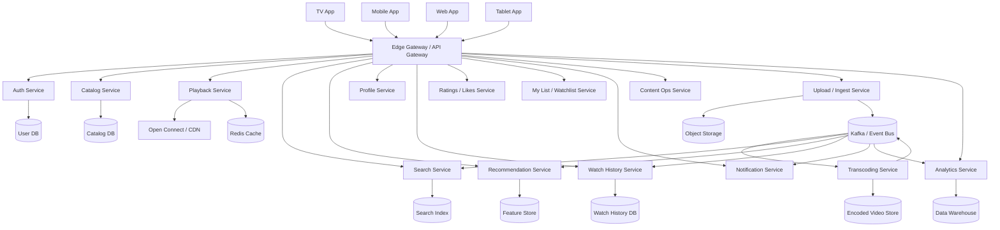

---

# 6. Core Design Principles

| Principle                                       | Meaning                                                        |
| ----------------------------------------------- | -------------------------------------------------------------- |
| Separate write and read paths                   | Upload and playback have different optimization needs          |
| Favor async processing                          | Transcoding, indexing, analytics should not block user actions |
| Keep services stateless                         | Easy horizontal scaling                                        |
| Store media separately from metadata            | Object storage for blobs, DB for structured data               |
| Use CDN aggressively                            | Video chunks must be delivered near users                      |
| Cache hot metadata                              | Home page and title pages are read extremely often             |
| Build for eventual consistency where acceptable | Search and recommendations can lag slightly                    |
| Preserve exact ordering where required          | Playback history and watch progress must remain correct        |
| Design for graceful degradation                 | The app should still play even if recommendations fail         |

---

# 7. Public Netflix Architecture Signals

Public Netflix engineering posts strongly support a design centered around AWS, Open Connect, microservices, and rich personalization.

Netflix has stated that it uses AWS for compute, storage, and networking for its streaming platform. It also says Open Connect localizes traffic close to members and uses proactive, directed caching to reduce upstream bandwidth demand, while the Open Connect program is built around intelligent clients, a central control system, and a network of Open Connect Appliances. 

Netflix has also publicly described rebuilding its video processing pipeline with microservices to keep up with delivery speed, and its recommendation stack as a complex system with many specialized machine-learned models. Public posts also show that Netflix’s edge layer, Zuul, handles authentication and routing and has been optimized to reduce connection churn. Netflix has further described a global active-active cloud strategy across AWS regions. 

Those public signals are exactly what a production-grade Netflix design should reflect.

---

# 8. Main User Flows

The system has four dominant flows:

1. Browse and search
2. Play a video
3. Upload and process content
4. Generate recommendations and analytics

---

# 9. Browse and Search Flow

A user opens the app and receives a personalized homepage.

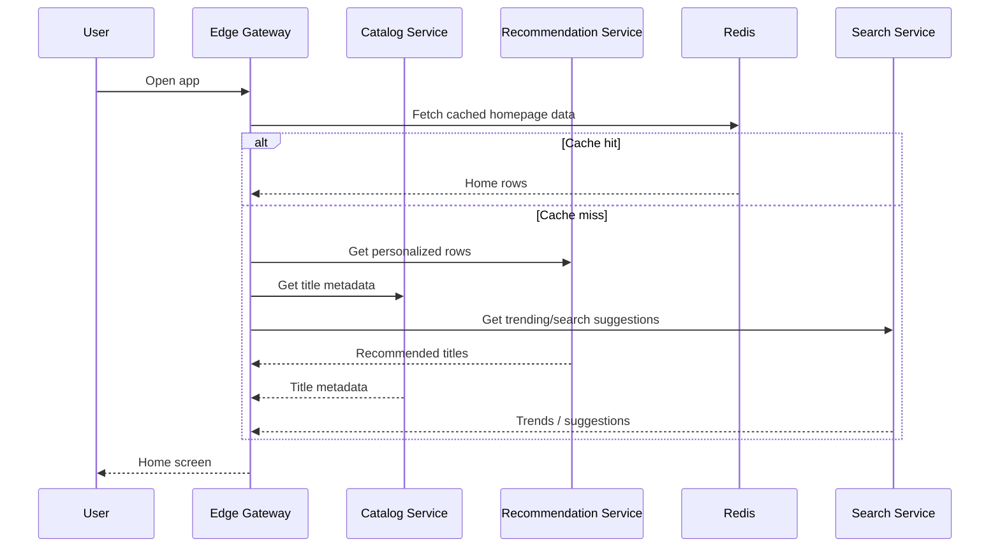

The homepage should be assembled from precomputed and near-real-time signals, not from slow synchronous model execution on every request.

---

# 10. Playback Flow

Playback is the most performance-sensitive path in the system.

The user should see:

* fast startup
* no buffering
* adaptive quality
* seamless segment fetching
* minimal origin hits

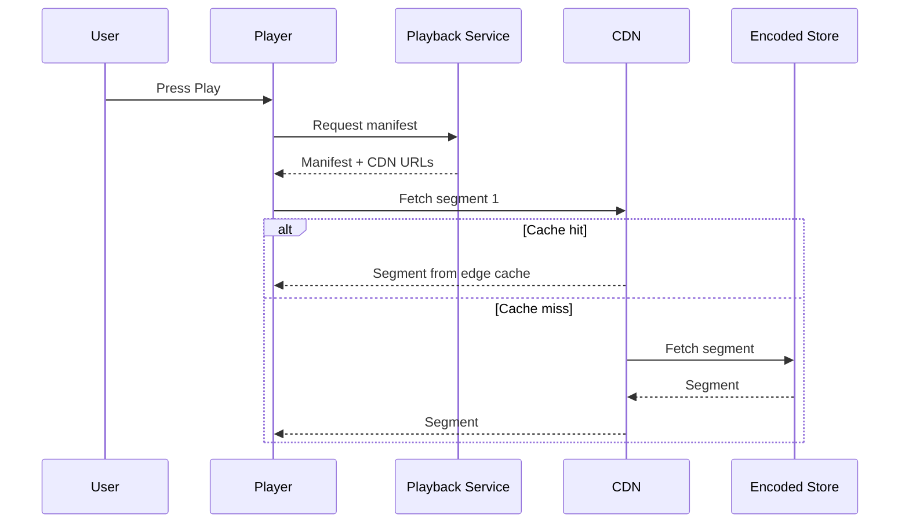

---

# 11. Why Open Connect is Central

Netflix’s public Open Connect documentation describes it as the global network responsible for delivering Netflix TV shows and movies efficiently by bringing content close to viewers. It is designed around proactive, directed caching and ISP-localized traffic, which reduces demand on upstream network capacity. Public Open Connect materials also describe embedded appliances and a central control system as core parts of the delivery model.

A Netflix design without a CDN would not survive global scale.

---

# 12. Video Upload and Processing

Netflix-like systems cannot process uploads inline.

The correct approach is:

* upload raw file to object storage
* emit an event
* process asynchronously
* transcode into multiple bitrates
* create thumbnails
* segment into streaming chunks
* index metadata
* publish playback readiness

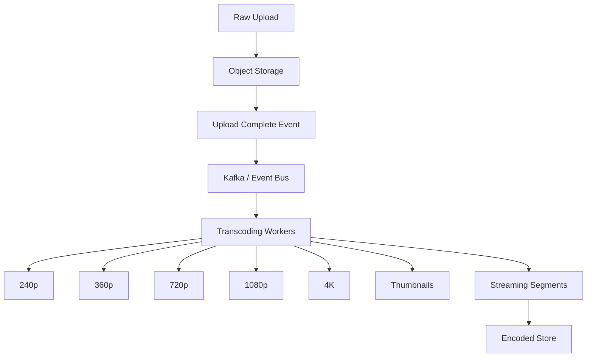

Public Netflix posts show that Netflix rebuilt its own video processing pipeline with microservices, which strongly supports this separation of upload ingestion from asynchronous transformation work.

---

# 13. Upload API Flow

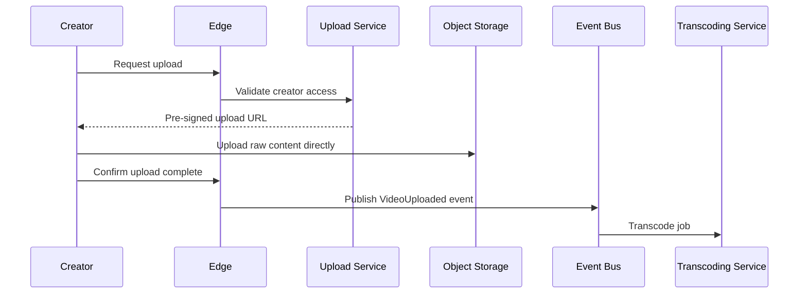

This keeps application servers lightweight and avoids routing huge binary files through the API layer.

---

# 14. Transcoding Pipeline

A video must be transformed into multiple versions for different devices and network conditions.

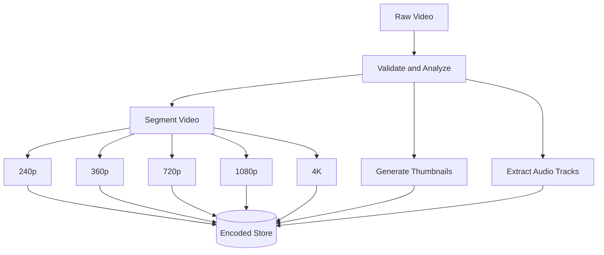

The transcoding pipeline should be:

* horizontally scalable
* checkpointed
* retryable
* idempotent
* observable

---

# 15. Adaptive Bitrate Streaming

Adaptive bitrate streaming allows the player to switch quality based on network conditions.

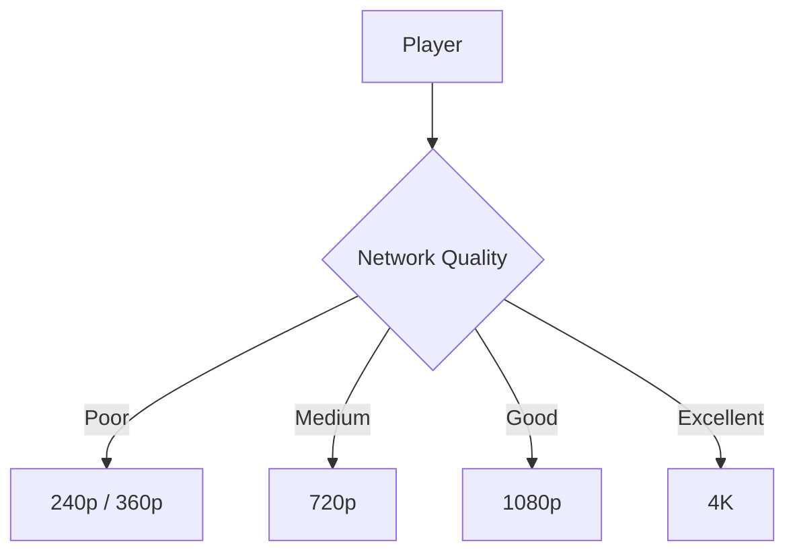

This is essential for:

* mobile networks
* unstable Wi-Fi
* low-end devices
* global variability in bandwidth

---

# 16. Data Model

The platform stores metadata separately from video blobs.

---

## Core Entities

| Entity                | Purpose                            |
| --------------------- | ---------------------------------- |
| User                  | Account and identity data          |
| Profile               | Personalized user profile          |
| Title                 | Movie or show metadata             |
| Episode               | Episode-level metadata             |
| StreamAsset           | Encoded streams and manifests      |
| PlaybackSession       | Session tracking                   |
| WatchHistory          | Resume and history data            |
| SearchDocument        | Search index representation        |
| RecommendationFeature | Model features                     |
| Impression            | What content was shown to the user |
| Rating                | User feedback and engagement       |
| Notification          | Notification state                 |
| ExperimentAssignment  | A/B test assignment                |

---

## ER Diagram

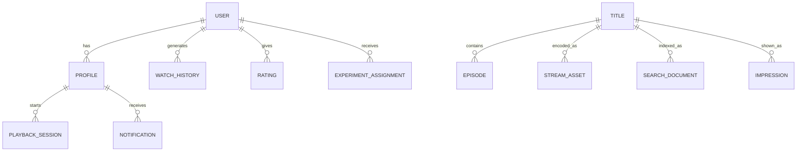

---

# 17. Storage Strategy

A single database cannot handle everything.

A production Netflix-like platform uses multiple storage systems.

| Data                    | Storage Choice                  |
| ----------------------- | ------------------------------- |
| User accounts           | SQL                             |
| Profiles                | SQL                             |
| Title metadata          | SQL or distributed NoSQL        |
| Playback state          | Redis + durable DB              |
| Watch history           | Distributed event store / NoSQL |
| Search index            | Elasticsearch / OpenSearch      |
| Video blobs             | Object storage                  |
| Encoded segments        | Object storage + CDN            |
| Recommendation features | Feature store                   |
| Analytics events        | Kafka + warehouse               |

---

# 18. Catalog Service

The catalog service exposes metadata for movies, shows, episodes, genres, actors, languages, ratings, and availability.

The catalog service should be optimized for:

* fast reads
* denormalized browse views
* cacheability
* localization
* availability filtering

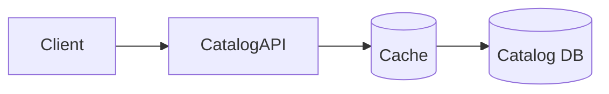

---

# 19. Cache Strategy

Caching is one of the strongest levers in a Netflix-like system.

Hot data includes:

* homepage rows
* title metadata
* user profile preferences
* availability rules
* top recommendations
* trending titles
* subtitle manifests
* playback manifests

Use:

* Redis for distributed hot data
* CDN for static media chunks
* client-side caching for manifests where safe

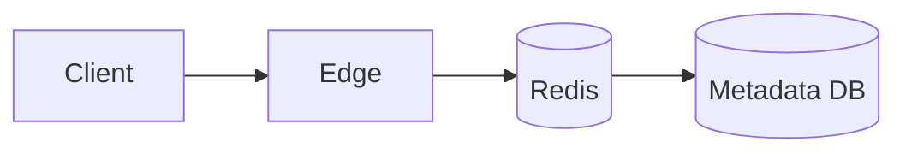

Public Netflix engineering material also notes that Netflix uses proactive caching and localized delivery in Open Connect, which is a strong signal that content and metadata should be cached aggressively near users.

---

# 20. Search Design

Search should not query the primary database directly.

Use an inverted index.

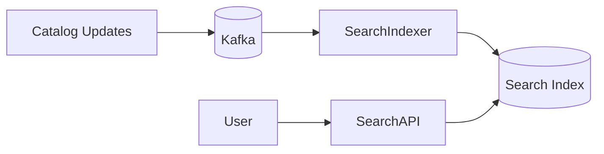

Search indexing should support:

* titles
* genres
* cast
* director
* synopsis
* language
* subtitles/transcripts
* popularity signals

Search should be eventually consistent. A newly uploaded title may appear after a short indexing delay.

---

# 21. Recommendation System

Recommendations are the heart of Netflix.

The recommendation system typically uses:

* candidate generation
* filtering
* ranking
* re-ranking
* session context
* impression history
* feedback loops

Public Netflix posts describe its recommender as a complex system with many specialized machine-learned models, and more recent work emphasizes that tracking impressions is important because the system must know what content the user has already encountered.

---

## Recommendation Pipeline

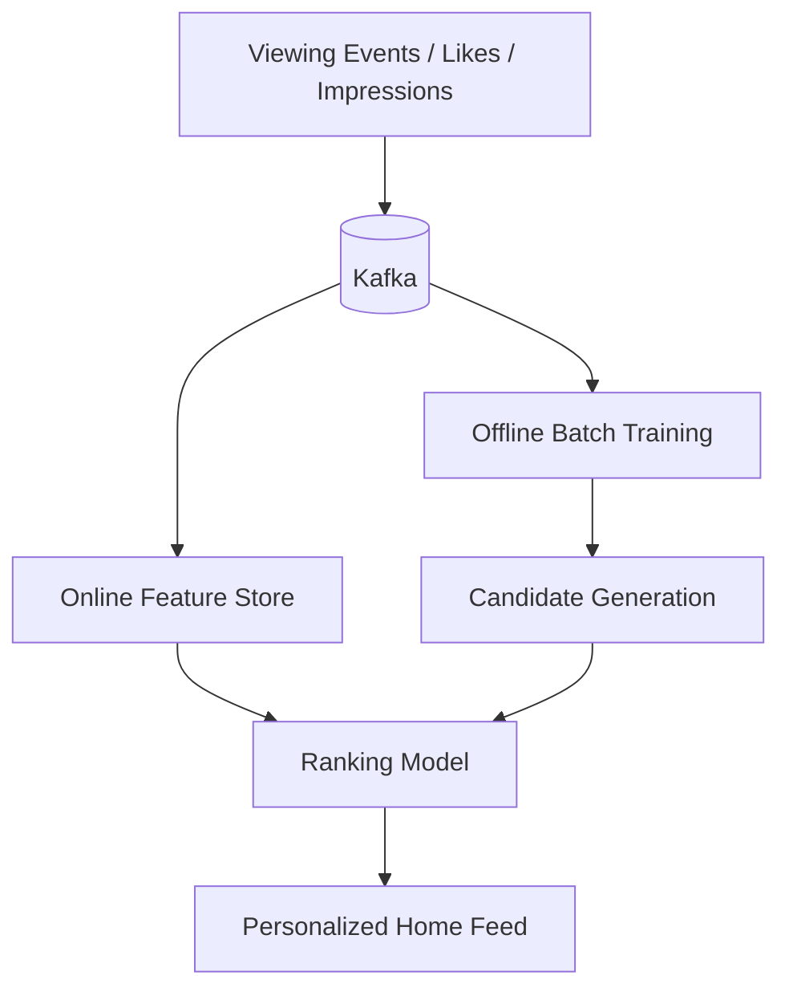

---

## Recommendation Inputs

| Signal             | Meaning                           |
| ------------------ | --------------------------------- |
| Watch time         | Strong engagement signal          |
| Completion rate    | Whether content was fully watched |
| Rewatches          | Content preference                |
| Search clicks      | Intent signals                    |
| Likes / dislikes   | Explicit feedback                 |
| Subscriptions      | Creator affinity                  |
| Impressions        | What was shown but ignored        |
| Device type        | TV vs mobile behavior             |
| Country / language | Regional taste                    |
| Time of day        | Session context                   |

---

# 22. Impression Tracking

Impressions are important because recommendations must distinguish between:

* content the user watched
* content the user saw but ignored
* content never shown

This helps ranking systems learn true user preference rather than just exposure bias. Netflix’s own public work on impressions explicitly frames impression tracking as crucial for tailoring recommendations more effectively.

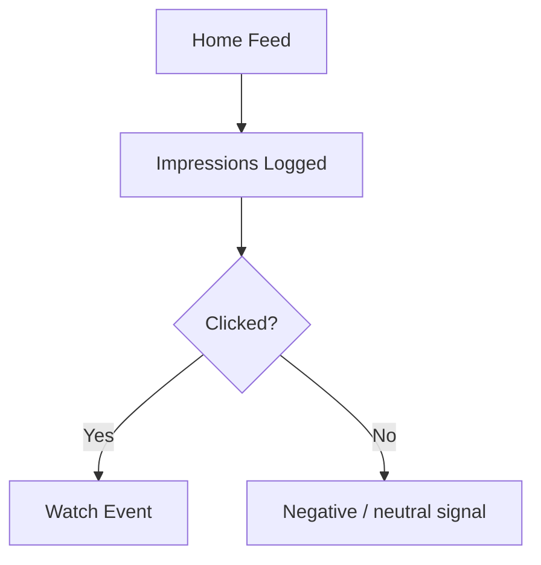

---

# 23. Playback Session State

Playback state must be extremely responsive.

Store:

* last watched position
* last played device
* playback speed
* subtitle choice
* audio language
* resume point

Use Redis for hot session data and persist periodically to a durable store.

---

# 24. Continue Watching

This is a classic hot path.

Every pause event should not become a heavy database write.

Instead:

* write to Redis first
* batch flush to durable DB
* reconcile periodically

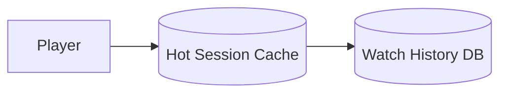

---

# 25. Likes, Ratings, and My List

These are read-heavy and write-light features.

Use:

* Redis for hot counters
* durable DB for source of truth
* async event stream for analytics and ranking

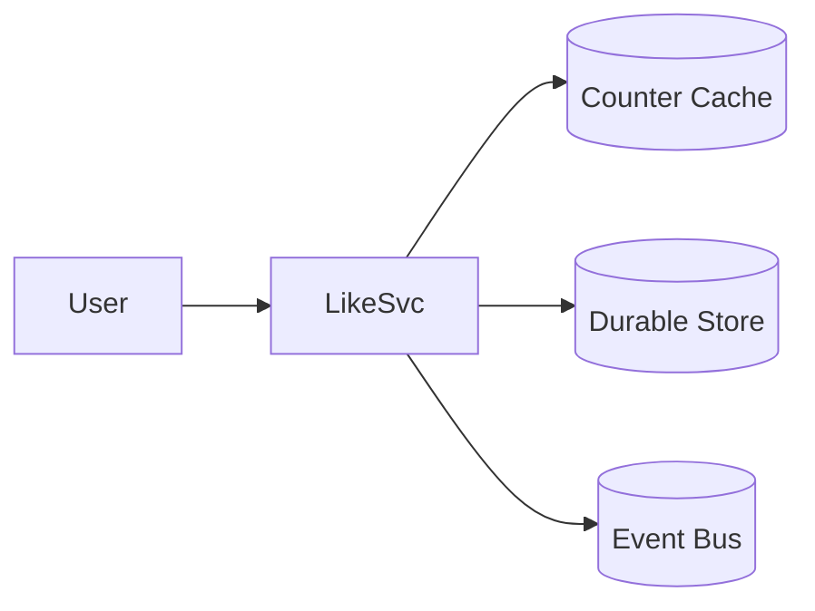

---

# 26. Notifications

Netflix-like systems notify users about:

* new seasons
* new episodes
* new releases
* recommendations
* reminders

Notifications should be asynchronous.


---

# 27. API Gateway and Edge Layer

The edge layer is one of the most important parts of the design.

Public Netflix engineering material describes Zuul as the edge gateway and documents its role in authentication and request routing. Netflix has also publicly discussed connection-churn reduction at Zuul, which supports designing a strong edge tier with efficient connection reuse and load-aware routing. 

The edge layer should handle:

* authentication
* authorization
* routing
* rate limiting
* SSL termination
* request aggregation
* A/B test assignment
* device identity propagation
* session bootstrap

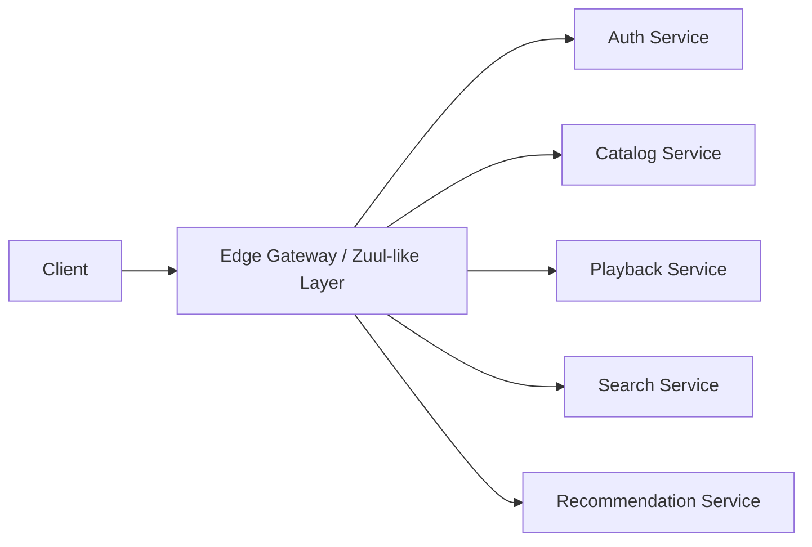

---

# 28. Authentication and Identity

A Netflix-like platform supports:

* user login
* profile switching
* device identity
* secure session propagation

Edge-authenticated identity propagation helps keep internal services simpler. Netflix publicly described moving complex handling of user and device authentication to the edge and propagating identity in a token-agnostic way.

A good design:

* validates auth at the edge
* issues short-lived JWTs
* uses refresh tokens for long sessions
* keeps backend services stateless

---

# 29. API Design

---

## Authentication

```http
POST /auth/login
POST /auth/logout
POST /auth/refresh
```

---

## Catalog

```http
GET /titles/{title_id}
GET /profiles/{profile_id}/home
GET /search?q=...
```

---

## Playback

```http
GET /playback/{title_id}/manifest
POST /playback/{title_id}/progress
```

---

## Engagement

```http
POST /titles/{title_id}/like
POST /titles/{title_id}/rating
POST /titles/{title_id}/my-list
```

---

## Recommendations

```http
GET /profiles/{profile_id}/recommendations
```

---

# 30. Video Delivery Path

The playback path should be optimized around CDN delivery.

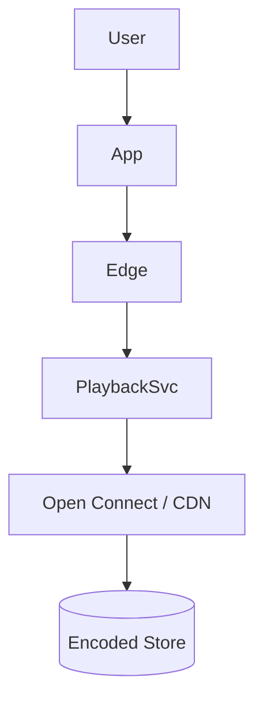

Public Netflix materials describe Open Connect as a global network responsible for delivering Netflix content efficiently, with traffic localized as close as possible to members. That makes CDN-first delivery the correct architecture for playback.

---

# 31. Multi-Bitrate and Segmenting

A title should be stored as:

* a manifest
* segmented chunks
* multiple encoded ladders
* subtitle tracks
* audio variants

This enables:

* adaptive bitrate switching
* quick startup
* better mobile playback
* graceful degradation

---

# 32. Multi-Region Architecture

Public Netflix engineering posts describe a global active-active cloud approach across AWS regions, which is the right mental model for a Netflix-like platform: users should be served from the nearest healthy region, and failure of one region should not take the platform down. 

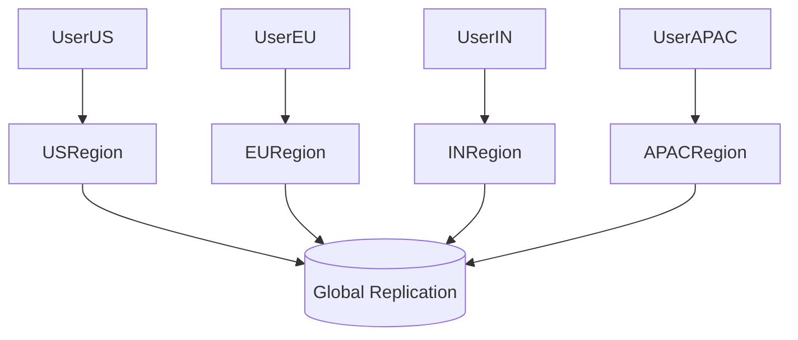

The design should support:

* regional traffic routing
* regional failover
* replicated metadata
* replicated identity
* region-local caches
* CDN edge locality

---

# 33. Data Replication Strategy

Different data needs different consistency choices.

| Data               | Strategy                               |
| ------------------ | -------------------------------------- |
| User account       | Strong or read-after-write consistency |
| Catalog metadata   | Strong enough / replicated             |
| Watch history      | Eventual consistency acceptable        |
| Recommendations    | Eventual consistency                   |
| Search index       | Eventual consistency                   |
| Content blobs      | Replicated object storage              |
| Playback manifests | Highly cacheable and replicated        |

---

# 34. Video Processing Pipeline

A production video pipeline includes many stages.

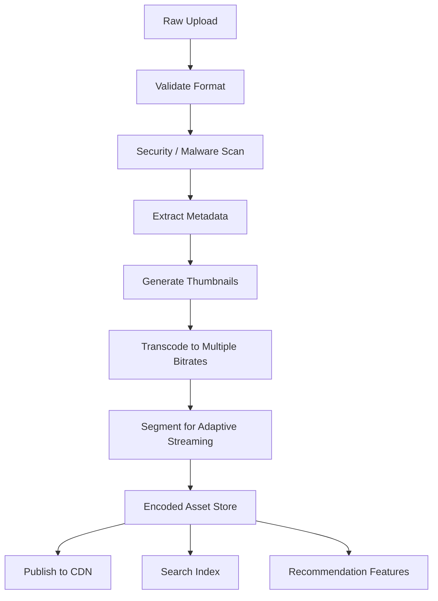

Netflix publicly described rebuilding its video processing pipeline with microservices, which supports precisely this asynchronous, staged architecture. 

---

# 35. Event-Driven Backbone

A Netflix-like platform should use Kafka or a similar event bus for most downstream work.

Events:

* VideoUploaded
* VideoEncoded
* PlaybackStarted
* PlaybackProgressed
* PlaybackCompleted
* ImpressionGenerated
* SearchQueryExecuted
* TitleLiked
* AddedToList
* NotificationSent

```mermaid
flowchart LR
    Services --> Kafka[(Kafka Topics)]
    Kafka --> Indexer[Search Indexer]
    Kafka --> Trainer[ML Training Pipeline]
    Kafka --> Analytics[Analytics Pipeline]
    Kafka --> Notify[Notification Workers]
```

The event bus decouples hot user paths from heavy background processing.

---

# 36. Analytics and Data Platform

Netflix-like systems need deep analytics:

* watch time
* completion rate
* rewatch rate
* drop-off points
* recommendation CTR
* device breakdown
* regional trends
* title popularity
* playback error rate

Analytics should flow to a warehouse or lake for:

* batch BI
* model training
* experimentation
* creator insights
* content planning

```mermaid
flowchart TB
    PlaybackEvents --> Kafka[(Kafka)]
    Kafka --> StreamProcessor
    StreamProcessor --> Warehouse[(Data Warehouse)]
    Warehouse --> BI[Dashboards]
    Warehouse --> ML[Model Training]
```

---

# 37. Experimentation Platform

Netflix is known publicly for experimentation culture, and a streaming platform at this scale should support A/B testing for UI, ranking, and playback changes. 

Support:

* feature flags
* bucketing
* experiment assignment
* metrics collection
* statistical analysis
* guardrail checks

```mermaid
flowchart LR
    User --> Assign[Experiment Assignment]
    Assign --> VariantA[Control]
    Assign --> VariantB[Treatment]
    VariantA --> Metrics
    VariantB --> Metrics
```

---

# 38. Search and Discovery

Search should support:

* title names
* actor names
* genres
* language
* tags
* subtitles / transcripts
* popularity
* recency

Use a search service over an inverted index.

Additional ranking signals:

* watch history
* popularity
* geographic relevance
* language match
* user preferences
* membership plan constraints

---

# 39. Caching Strategy in Detail

Caching exists at multiple layers.

| Layer         | What it caches                |
| ------------- | ----------------------------- |
| Client cache  | Recent manifests, images      |
| CDN cache     | Video segments, thumbnails    |
| Gateway cache | Hot metadata                  |
| Service cache | Profiles, catalog data        |
| Redis         | Sessions, counters, hot state |
| DB cache      | Internal DB buffer caches     |

The highest-value cache is the CDN because video traffic dominates bandwidth.

---

# 40. Open Connect as Delivery Backbone

Netflix’s public Open Connect documentation is very explicit that the program is designed to improve member experience by localizing traffic near users and reducing transit-provider delivery. The Open Connect network is described as a combination of intelligent clients, a central control system, and OCAs, with proactive caching as a major differentiator. 

That means a Netflix-like system should:

* pre-position hot titles
* serve from ISP-local appliances when possible
* use intelligent cache selection
* avoid unnecessary origin traffic
* prioritize playback quality and delivery efficiency

---

# 41. Hot Content and Cache Warming

New seasons and viral titles create massive spikes.

To handle that:

* pre-warm CDN caches
* pre-position encoded segments
* prioritize trending titles
* replicate hot assets early
* compute popularity predictions from events

```mermaid
flowchart TD
    PopularitySignals --> Predictor
    Predictor --> CacheWarmup
    CacheWarmup --> CDN
```

---

# 42. Playback Error Handling

A user should not be blocked by one failure.

If one bitrate is unavailable:

* fall back to another bitrate
* fetch from another edge
* retry on alternate route
* preserve playback state

Graceful degradation matters more than perfect internal symmetry.

---

# 43. Subtitle and Audio Tracks

Modern streaming must support multiple languages.

Store:

* subtitle files
* closed caption tracks
* multiple audio tracks
* accessibility metadata

These should be independently addressable by the player.

---

# 44. Continue Watching and Resume

A user can start a movie on TV and finish it on mobile.

This requires:

* centralized playback state
* periodic progress updates
* multi-device reconciliation

```mermaid
sequenceDiagram
    participant TV
    participant Backend
    participant Mobile

    TV->>Backend: Update progress 42%
    Mobile->>Backend: Open same title
    Backend-->>Mobile: Resume at 42%
```

---

# 45. Likes, My List, and Ratings

These features are smaller than playback but still important.

Use them as engagement signals:

* ranking input
* personalization input
* recommendations input
* trending input

Store them efficiently and emit events for downstream ML and analytics pipelines.

---

# 46. Recommendation System Deep Dive

The recommendation stack should include:

1. Candidate generation
2. Filtering
3. Ranking
4. Re-ranking
5. Business rules
6. Exploration/exploitation balancing

Public Netflix material says recommendation is already a complex system with many specialized machine-learned models, so a production design should treat recommendations as a major first-class platform rather than a simple “similar titles” feature.

---

## Candidate Generation

Retrieve a few hundred or thousand likely items from:

* watched-alike users
* similar-title embeddings
* popularity by region
* genre affinity
* creator affinity
* search intent
* impressions and skips

---

## Ranking

Rank candidates by:

* expected watch time
* click-through rate
* completion rate
* freshness
* user taste
* contextual fit

---

## Re-ranking

Apply constraints:

* do not repeat already watched titles too often
* diversify rows
* respect maturity ratings
* keep languages and regions appropriate

---

# 47. Watch History and Impressions

Watch history alone is not enough.

Impressions matter too.

If the system never knows what the user saw, it cannot distinguish true dislike from lack of exposure. Public Netflix work on impressions explicitly reflects this. 

Store:

* title shown
* row position
* page location
* time shown
* clicked or ignored
* dwell time
* watch result

---

# 48. Security and DRM

A Netflix-like platform must protect content.

Security elements include:

* TLS everywhere
* secure auth tokens
* signed manifests
* signed CDN URLs
* device identity
* playback entitlement checks
* encryption at rest
* DRM for premium content
* region restrictions
* account sharing policies

```mermaid
flowchart LR
    User --> Auth[Auth]
    Auth --> Entitlement[Entitlement Check]
    Entitlement --> SignedURL[Signed Manifest / URL]
    SignedURL --> CDN[CDN]
```

---

# 49. Rate Limiting and Abuse Prevention

Use rate limiting for:

* login
* password reset
* search abuse
* API scraping
* playlist spam
* comment spam
* repeated playback entitlement checks

A token bucket or Redis-based distributed limiter is suitable at the edge.

---

# 50. Failure Scenarios and Resilience

---

## Scenario 1: One Region Fails

Solution:

* route users to another region
* preserve session state
* continue playback with CDN fallback
* keep metadata replicated

Public Netflix material supports the idea of serving requests from any deployed AWS region in a global active-active setup.

---

## Scenario 2: Transcoding Workers Fail

Solution:

* queue retries
* checkpoint jobs
* idempotent tasks
* dead letter queues

---

## Scenario 3: Search Index Lags

Solution:

* eventual consistency
* show recent catalog entries from the source DB if needed
* separate search indexing from playback

---

## Scenario 4: Recommendation Service Fails

Solution:

* fall back to trending rows
* continue playback and browsing
* degrade gracefully

---

## Scenario 5: CDN Cache Miss Storm

Solution:

* warm caches proactively
* use regional distribution
* prioritize popular titles
* protect origin with buffering and rate controls

---

# 51. Bottlenecks and Solutions

| Bottleneck             | Fix                                     |
| ---------------------- | --------------------------------------- |
| Video bandwidth        | CDN / Open Connect / edge caching       |
| Transcoding cost       | Async workers and job queues            |
| Hot metadata           | Redis caching                           |
| Search latency         | Inverted index and cache                |
| Recommendation latency | Precomputed candidates + online ranking |
| Region failure         | Active-active design                    |
| Connection churn       | Edge gateway optimization and reuse     |
| Analytics overhead     | Kafka and offline pipelines             |

Public Netflix work on Zuul specifically highlights efforts to reduce connection churn and use HTTP/2 multiplexing to origins, which reinforces the need for efficient connection reuse at the edge.

---

# 52. Suggested Technology Stack

| Layer           | Suggested Tech                           |
| --------------- | ---------------------------------------- |
| Client          | Web, mobile, smart TV, desktop           |
| Gateway         | Zuul-like gateway / Envoy / NGINX        |
| Auth            | JWT + refresh tokens / OAuth integration |
| Video delivery  | Open Connect / CDN                       |
| Compute         | AWS / Kubernetes / containers            |
| Storage         | SQL + NoSQL + object storage             |
| Cache           | Redis / in-memory caches                 |
| Event bus       | Kafka                                    |
| Search          | Elasticsearch / OpenSearch               |
| Analytics       | Spark / Flink / warehouse                |
| Experimentation | Feature flags / A-B testing              |
| Monitoring      | Prometheus / Grafana / tracing           |
| Transcoding     | GPU/CPU worker fleet                     |

---

# 53. Final End-to-End Architecture

```mermaid
flowchart TB
    ClientTV[TV Client]
    ClientWeb[Web Client]
    ClientMobile[Mobile Client]

    Edge[Edge Gateway / Zuul-like Layer]
    Auth[Auth Service]
    Catalog[Catalog Service]
    Playback[Playback Service]
    Search[Search Service]
    Rec[Recommendation Service]
    Profile[Profile Service]
    History[Watch History Service]
    Upload[Upload / Ingest Service]
    Transcode[Transcoding Service]
    Notify[Notification Service]
    Analytics[Analytics Service]

    Redis[(Redis)]
    SQL[(SQL Databases)]
    NoSQL[(NoSQL Databases)]
    ObjectStore[(Object Storage)]
    CDN[Open Connect / CDN]
    Kafka[(Kafka)]
    SearchIndex[(Search Index)]
    FeatureStore[(Feature Store)]
    Warehouse[(Data Warehouse)]

    ClientTV --> Edge
    ClientWeb --> Edge
    ClientMobile --> Edge

    Edge --> Auth
    Edge --> Catalog
    Edge --> Playback
    Edge --> Search
    Edge --> Rec
    Edge --> Profile
    Edge --> History
    Edge --> Upload
    Edge --> Notify
    Edge --> Analytics

    Auth --> SQL
    Profile --> SQL
    Catalog --> NoSQL
    History --> NoSQL
    Playback --> Redis
    Search --> SearchIndex
    Rec --> FeatureStore
    Upload --> ObjectStore
    Playback --> CDN

    Upload --> Kafka
    Catalog --> Kafka
    Playback --> Kafka
    Search --> Kafka
    Rec --> Kafka
    Notify --> Kafka
    Analytics --> Kafka

    Kafka --> Transcode
    Kafka --> SearchIndex
    Kafka --> FeatureStore
    Kafka --> Warehouse

    Transcode --> ObjectStore
    SearchIndex --> NoSQL
```

---

# 54. Why This Design Works

This architecture works because it cleanly separates the main concerns:

| Concern             | How It Is Solved                    |
| ------------------- | ----------------------------------- |
| Playback speed      | CDN and edge caching                |
| Upload throughput   | Direct-to-object-storage upload     |
| Video processing    | Async microservices                 |
| Personalization     | Specialized recommendation pipeline |
| Search              | Dedicated search index              |
| Global availability | Multi-region active-active          |
| Reliability         | Queueing, retries, and fallbacks    |
| Cost                | Caching and traffic localization    |
| Security            | Edge auth, signed URLs, DRM         |
| Maintainability     | Small independent services          |

This separation aligns well with the public Netflix engineering signals about AWS infrastructure, Open Connect, microservices, edge auth, and advanced recommendation systems. 

---

# 55. Conclusion

A Netflix-like platform is one of the best examples of a truly large-scale distributed system.

The hard parts are not simply storing and playing video.

The hard parts are:

* delivering large media files globally
* transcoding content into multiple formats
* serving millions of concurrent playback sessions
* keeping search fast
* making recommendations intelligent
* preserving resume state across devices
* surviving region failures
* controlling bandwidth cost
* avoiding overload during viral spikes

A production-grade Netflix design should use:

* a strong edge gateway
* asynchronous upload and processing
* object storage for media
* Open Connect / CDN for delivery
* Redis for hot state
* SQL for account and profile data
* NoSQL for large-scale history and metadata
* Kafka for event streaming
* search indexes for discovery
* feature stores and offline pipelines for recommendations
* active-active global deployment for resilience

Public Netflix engineering posts show that Netflix already leans on AWS, Open Connect, microservices, Zuul, and advanced recommendation systems, and this design reflects those public architectural signals in a scalable way.

The result is a platform that can stream smoothly, scale globally, and remain resilient even under extreme load.