Designing a YouTube-like system is one of the most interesting high-level design problems because it combines almost every major distributed systems challenge in one product:

- massive video uploads
- expensive transcoding
- global video delivery
- search
- recommendations
- subscriptions
- comments
- likes
- watch history
- notifications
- creator analytics
- adaptive bitrate streaming
- multi-region availability
- heavy caching
- massive read traffic
- asynchronous event processing

A system like YouTube is not just a video player.

It is a distributed media platform built for billions of users and petabytes of data.

The hardest parts are not simply storing videos.

The hardest parts are:

- delivering them fast worldwide
- processing uploads efficiently
- encoding multiple resolutions
- minimizing latency
- supporting popularity spikes
- preserving watch state
- ranking content intelligently
- keeping the system reliable under enormous load

---

# 1. Problem Statement

Design a video sharing platform like YouTube where users can:

- upload videos
- watch videos
- search videos
- like/dislike videos
- comment on videos
- subscribe to channels
- receive notifications
- view recommendations
- manage playlists
- track watch history
- see trending content
- support adaptive video playback
- handle millions and billions of users

---

# 2. Functional Requirements

| Requirement | Description |
|---|---|
| User Authentication | Users can sign up, log in, and manage accounts |
| Video Upload | Creators can upload videos of various sizes |
| Video Processing | Uploaded videos are transcoded to multiple formats |
| Video Playback | Users can stream videos smoothly |
| Search | Users can search by title, tag, channel, or keyword |
| Recommendations | Suggest relevant videos to users |
| Likes / Dislikes | Engagement signals for ranking |
| Comments | Users can discuss videos |
| Subscriptions | Users can subscribe to creators |
| Notifications | Alert users about new uploads |
| Playlists | Save videos into playlists |
| Watch History | Track what users viewed |
| Trending | Show popular content |
| Analytics | Creators can view performance metrics |

---

# 3. Non-Functional Requirements

| Requirement | Goal |
|---|---|
| Scalability | Support billions of views and uploads |
| Low Latency | Fast playback startup and search results |
| High Availability | System should work even during failures |
| Durability | Videos and metadata must not be lost |
| Fault Tolerance | Background jobs must continue after failures |
| Elasticity | Scale up during viral spikes |
| Cost Efficiency | Media storage and bandwidth should be optimized |
| Observability | Metrics, logs, and traces for all services |
| Security | Authentication, access control, content safety |
| Global Delivery | Users worldwide should get fast access |

---

# 4. Rough Scale Estimation

Let us assume the following hypothetical scale for design purposes:

- 100 million daily active users
- 20 million video uploads per day
- 1 billion video views per day
- 10 million concurrent users
- average video size = 100 MB
- average view duration = 5 minutes
- average video has multiple resolutions and bitrates

---

## Upload Traffic

If 20 million uploads/day and average size is 100 MB:

```text
20,000,000 × 100 MB = 2,000,000,000 MB/day
≈ 2,000 TB/day
≈ 2 PB/day
````

This is why direct synchronous processing is impossible.

---

## View Traffic

If 1 billion views/day:

```text
1,000,000,000 / 86,400 ≈ 11,574 views/second
```

At peak, traffic can be 5x–10x higher.

---

# 5. High-Level Architecture

A YouTube-like system is best built using multiple specialized services.

```mermaid
flowchart TB
    Client1[Web Client]
    Client2[Mobile Client]
    Client3[TV Client]

    APIGW[API Gateway]
    Auth[Auth Service]
    UserSvc[User Service]
    VideoSvc[Video Service]
    UploadSvc[Upload Service]
    TranscodeSvc[Transcoding Service]
    PlaybackSvc[Playback Service]
    SearchSvc[Search Service]
    RecSvc[Recommendation Service]
    CommentSvc[Comment Service]
    LikeSvc[Like Service]
    SubSvc[Subscription Service]
    NotifySvc[Notification Service]
    AnalyticsSvc[Analytics Service]

    MetaDB[(Metadata DB)]
    UserDB[(User DB)]
    VideoDB[(Video Metadata DB)]
    CommentDB[(Comment DB)]
    SearchIndex[(Search Index)]
    EventBus[(Kafka / Event Bus)]
    Redis[(Redis Cache)]
    ObjectStore[(Object Storage / S3)]
    CDN[CDN / Edge Cache]
    TranscodedStore[(Encoded Video Store)]

    Client1 --> APIGW
    Client2 --> APIGW
    Client3 --> APIGW

    APIGW --> Auth
    APIGW --> UserSvc
    APIGW --> VideoSvc
    APIGW --> SearchSvc
    APIGW --> RecSvc
    APIGW --> CommentSvc
    APIGW --> LikeSvc
    APIGW --> SubSvc
    APIGW --> NotifySvc
    APIGW --> AnalyticsSvc

    UploadSvc --> ObjectStore
    UploadSvc --> EventBus
    EventBus --> TranscodeSvc
    TranscodeSvc --> TranscodedStore
    TranscodeSvc --> EventBus
    EventBus --> SearchSvc
    EventBus --> RecSvc
    EventBus --> NotifySvc
    EventBus --> AnalyticsSvc

    PlaybackSvc --> CDN
    CDN --> TranscodedStore

    VideoSvc --> VideoDB
    UserSvc --> UserDB
    CommentSvc --> CommentDB
    SearchSvc --> SearchIndex
    LikeSvc --> Redis
    RecSvc --> Redis
    APIGW --> Redis
    Auth --> UserDB
```

---

# 6. Core Design Idea

A YouTube-like system is split into two broad paths:

| Path       | Purpose                                                |
| ---------- | ------------------------------------------------------ |
| Write Path | Upload videos, create comments, like videos, subscribe |
| Read Path  | Watch videos, search, browse recommendations           |

The read path is much heavier than the write path.

This is why YouTube must be optimized for:

* massive read scaling
* intelligent caching
* CDN delivery
* asynchronous background jobs

---

# 7. Key Components

---

## 7.1 API Gateway

The API Gateway sits at the edge of the system.

It handles:

* authentication
* authorization
* request routing
* rate limiting
* SSL termination
* API versioning

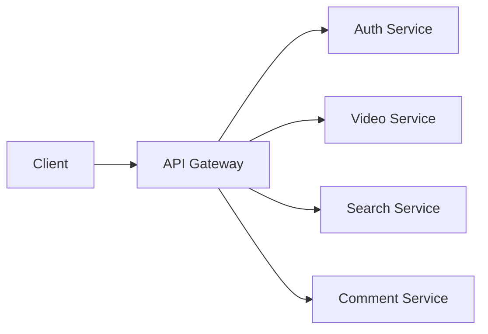

---

## 7.2 Authentication Service

Users need:

* login
* signup
* token issuance
* token validation

Typically use:

* OAuth2
* JWT
* secure sessions

---

## 7.3 Video Upload Service

Handles:

* upload initiation
* upload authorization
* temporary upload URLs
* metadata creation
* upload completion events

The actual video file should not flow through the main app servers.

The preferred pattern is:

1. client asks for upload permission
2. server returns pre-signed upload URL
3. client uploads directly to object storage
4. upload completion event is emitted
5. transcoding begins asynchronously

---

## 7.4 Transcoding Service

One of the most important services in the system.

When a user uploads a video, YouTube cannot serve that file directly to everyone.

The platform must generate:

* multiple resolutions
* multiple codecs
* multiple bitrates
* thumbnails
* preview clips
* adaptive streaming chunks

This is expensive and must be asynchronous.

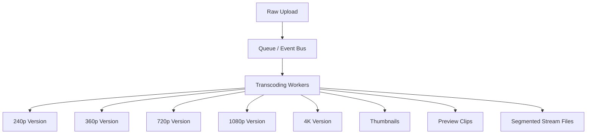

---

## 7.5 Playback Service

This service helps the client fetch playback metadata:

* available resolutions
* video chunks
* subtitle tracks
* CDN URLs
* DRM / access control info
* manifest file

For modern adaptive streaming, the client usually receives:

* HLS manifest
* MPEG-DASH manifest

The client then chooses the best quality dynamically.

---

## 7.6 CDN

The CDN is critical.

Without CDN:

* every user request hits origin storage
* bandwidth cost explodes
* latency becomes unacceptable

With CDN:

* video chunks are cached near users
* playback becomes faster
* origin storage load drops dramatically

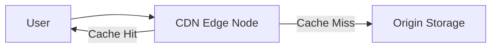

---

## 7.7 Search Service

Search must be fast and relevant.

A relational DB is not suitable for large-scale search.

Use a search engine such as:

* Elasticsearch
* OpenSearch

The search service indexes:

* title
* description
* tags
* creator name
* transcript text
* comments metadata
* engagement signals

---

## 7.8 Recommendation Service

Recommendations are one of the most important parts of YouTube.

They drive engagement by suggesting videos based on:

* watch history
* session behavior
* likes/dislikes
* subscriptions
* similarity to watched videos
* trending content
* geography
* language
* completion rate
* click-through rate
* retention

A recommendation system often uses:

* feature pipelines
* offline batch processing
* online inference
* embedding stores
* ranking models
* candidate generation
* re-ranking

---

## 7.9 Comment Service

Comments are social and highly interactive.

They need:

* write support
* moderation
* threading
* ranking
* spam filtering
* pagination

For scale, comments are typically stored separately from video metadata.

---

## 7.10 Notification Service

Used for:

* new uploads from subscribed channels
* comment replies
* live stream alerts
* creator announcements

Notifications should be asynchronous.

Use:

* Kafka
* queue workers
* push providers like APNS / FCM / email gateways

---

# 8. Video Upload Flow

Uploading a video should not block the user until transcoding finishes.

Instead:

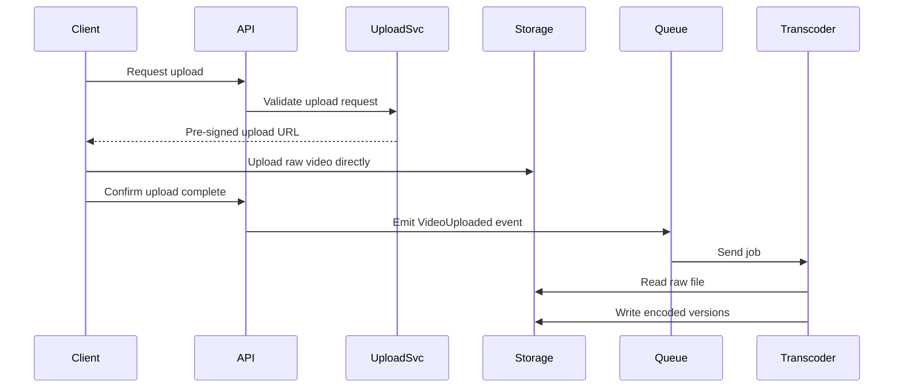

---

# Why This Flow Works Well

| Benefit          | Explanation                        |
| ---------------- | ---------------------------------- |
| Non-blocking     | User does not wait for transcoding |
| Scalable         | Upload servers stay lightweight    |
| Reliable         | Jobs can be retried                |
| Cost-efficient   | Large files bypass app servers     |
| Async processing | Workers can scale independently    |

---

# 9. Video Playback Flow

Playback is the most frequent operation.

The system should optimize it aggressively.

---

## Playback Flow

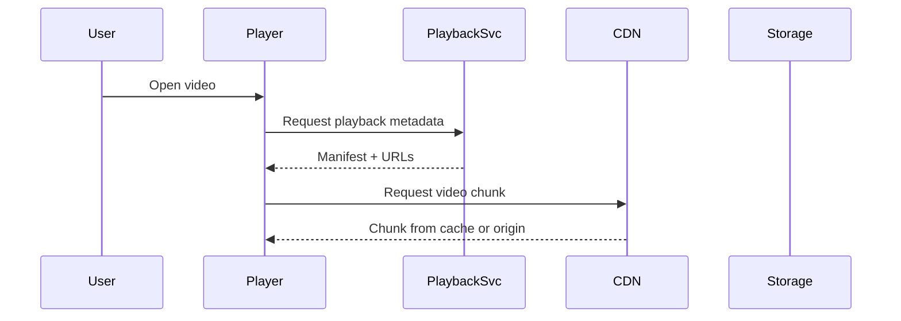

---

## Adaptive Bitrate Streaming

Different devices and network conditions require different quality levels.

The player chooses among:

* 240p
* 360p
* 480p
* 720p
* 1080p
* 4K

If the network is slow, the player switches to a lower bitrate.

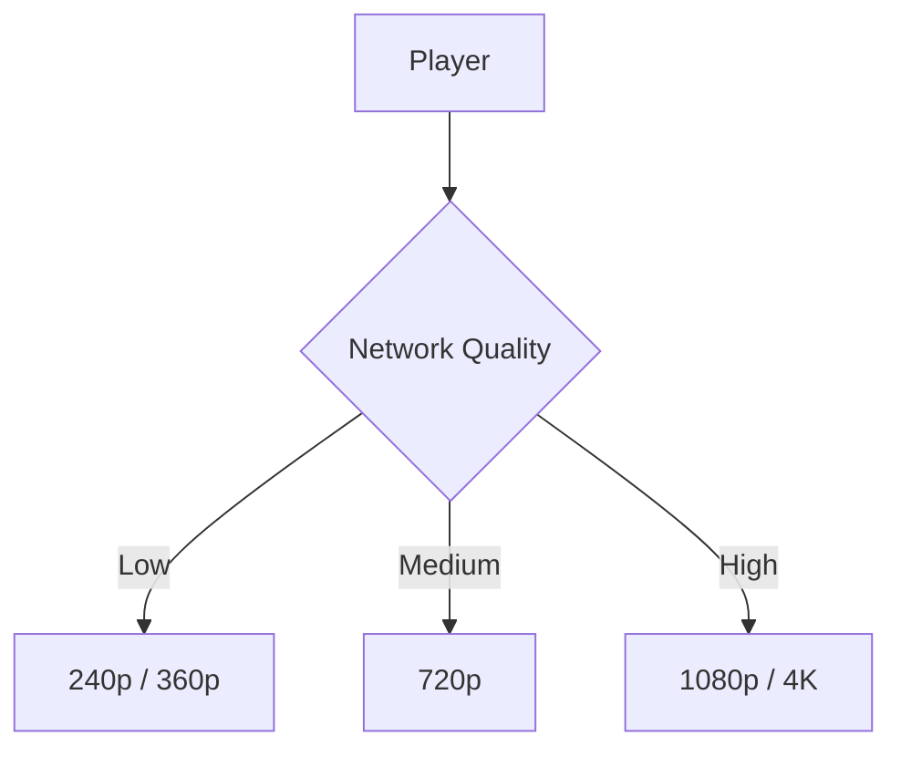

---

# 10. Video Storage Strategy

Videos are huge binary files.

Do not store them in a relational database.

Use object storage.

Examples:

* Amazon S3
* Google Cloud Storage
* Azure Blob Storage

---

## Storage Organization

| Type              | Storage               |
| ----------------- | --------------------- |
| Raw upload        | Object storage        |
| Transcoded chunks | Object storage        |
| Thumbnails        | Object storage        |
| Metadata          | Relational / NoSQL DB |
| Search index      | Elasticsearch         |
| Hot caches        | Redis / CDN           |

---

# 11. Video Metadata Design

Store small structured metadata separately from video blobs.

---

## Video Metadata Table

| Field             | Purpose                   |
| ----------------- | ------------------------- |
| video_id          | Unique identifier         |
| creator_id        | Owner                     |
| title             | Search/display            |
| description       | Metadata                  |
| upload_time       | Sorting                   |
| duration          | Playback info             |
| visibility        | Public/private/unlisted   |
| processing_status | Uploaded/processing/ready |
| view_count        | Analytics                 |
| like_count        | Engagement                |
| category          | Recommendation support    |

---

# 12. Data Model

---

## Core Entities

| Entity         | Purpose                 |
| -------------- | ----------------------- |
| User           | Account data            |
| Channel        | Creator profile         |
| Video          | Video metadata          |
| VideoAsset     | Encoded versions        |
| Comment        | Comments                |
| Like           | Engagement              |
| Subscription   | Channel follow relation |
| WatchHistory   | User viewing record     |
| Playlist       | Saved collections       |
| Notification   | Delivery record         |
| SearchDocument | Search index record     |

---

## ER Diagram

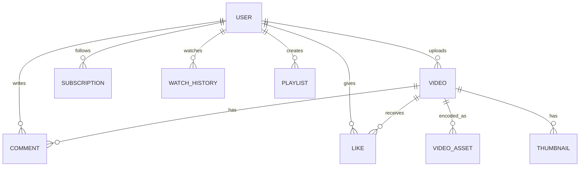

---

# 13. Database Choice

YouTube requires multiple databases because one database type is not enough.

| Data             | Suggested Storage        |
| ---------------- | ------------------------ |
| User profiles    | SQL                      |
| Video metadata   | SQL or distributed NoSQL |
| Comments         | Sharded NoSQL            |
| Likes            | Redis + durable DB       |
| Subscriptions    | SQL/NoSQL                |
| Watch history    | Distributed store        |
| Search index     | Elasticsearch            |
| Analytics events | Kafka + warehouse        |
| Video blobs      | Object storage           |

---

# 14. Why Not Store Everything in SQL?

Because at YouTube scale:

* video metadata is large
* comments are huge
* search is expensive
* analytics is enormous
* writes are frequent
* reads are massive

A single SQL database becomes a bottleneck.

So the architecture must be polyglot.

---

# 15. Caching Strategy

Caching is essential.

---

## What to Cache

| Data               | Cache Reason         |
| ------------------ | -------------------- |
| Video metadata     | Very frequent reads  |
| Channel info       | High reuse           |
| Trending feeds     | Expensive generation |
| Like counts        | High traffic         |
| Comment counts     | Reused often         |
| User session info  | Fast lookup          |
| Search suggestions | Reduce latency       |

---

## Cache Layers

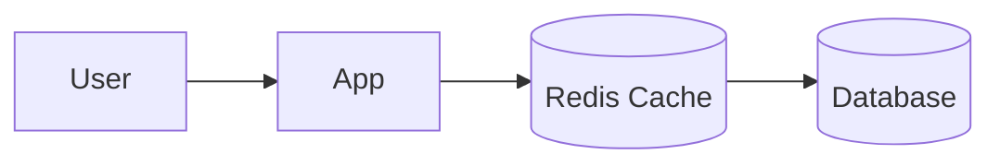

Use cache-aside or read-through caching depending on workload.

---

# 16. Like and View Counters

Counters are extremely hot data.

If every like increments the same DB row directly, the DB will melt.

Better approach:

* write event to Kafka
* aggregate asynchronously
* periodically update materialized counts
* use Redis for temporary hot counters

---

## Counter Flow

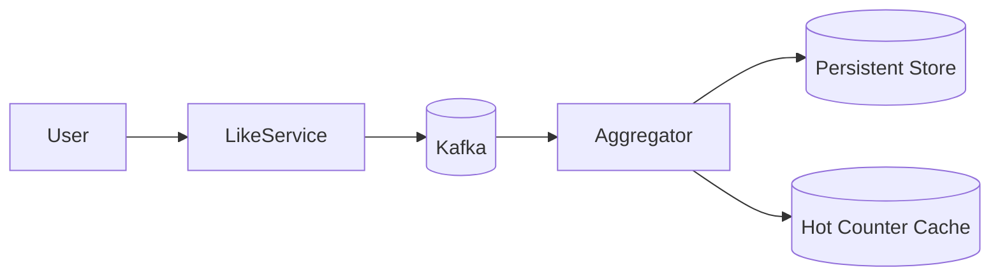

---

# 17. Subscription System

Users subscribe to channels and receive notifications when creators upload new videos.

---

## Subscription Data

| Field             | Purpose                  |
| ----------------- | ------------------------ |
| subscriber_id     | User                     |
| creator_id        | Channel                  |
| created_at        | Subscription time        |
| notification_pref | All / personalized / off |

---

## Subscription Flow

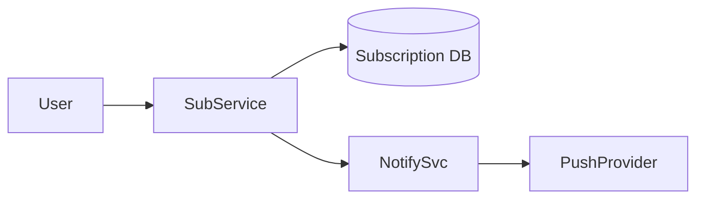

---

# 18. Notification Fanout

A creator with millions of subscribers can cause notification spikes.

To handle this:

* publish an event
* use async workers
* batch notifications
* prioritize active users
* avoid synchronous fanout

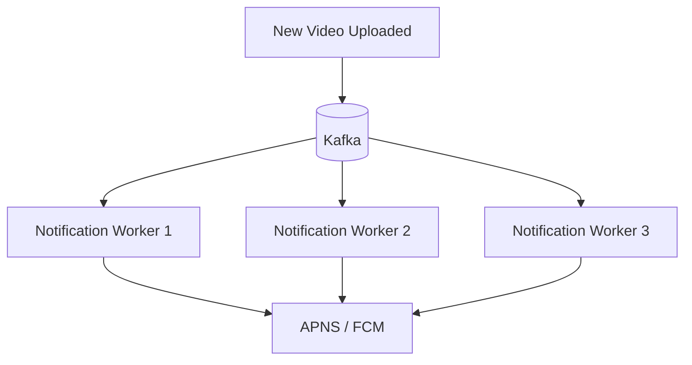

---

# 19. Search Indexing Flow

Every uploaded video should eventually be searchable.

The search pipeline is async.

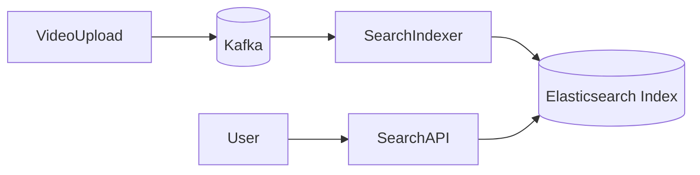

Search indexing may include:

* title
* tags
* transcript
* description
* creator
* engagement stats

---

# 20. Recommendation Pipeline

Recommendations require heavy computation.

Two broad phases exist:

---

## Offline Batch Processing

Used for:

* historical data
* embeddings
* candidate generation
* long-term trends

---

## Online Ranking

Used for:

* real-time context
* session behavior
* current device
* location
* freshness

---

## Recommendation Pipeline Diagram

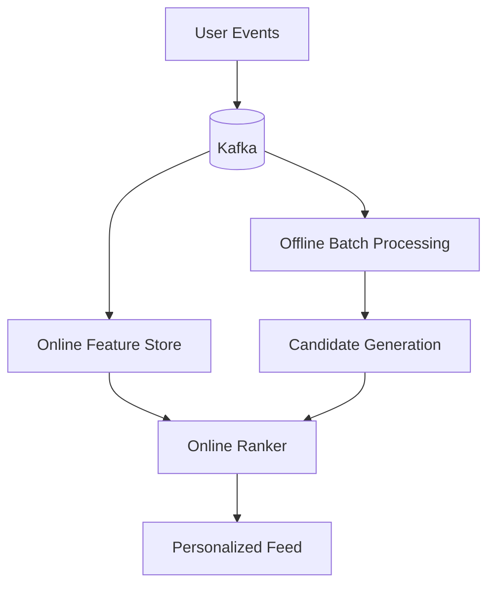

---

# 21. Trending Videos

Trending is a special ranking problem.

It usually considers:

* recent views
* watch velocity
* likes per minute
* shares
* comments
* retention

This can be computed using streaming jobs.

---

# 22. Comments System

Comments need to support:

* pagination
* threading
* moderation
* spam detection
* sorting by relevance/newest

A flat relational query may not work efficiently at scale.

Usually use:

* denormalized storage
* sharding by video_id
* async moderation pipeline

---

## Comment Flow

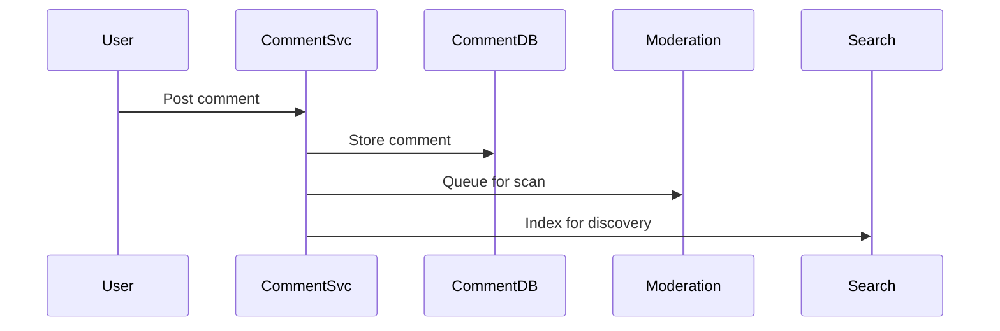

---

# 23. Moderation and Safety

A large video platform needs safety controls.

This includes:

* spam detection
* harmful content detection
* copyright checks
* age restrictions
* community guideline enforcement
* abuse reporting

Moderation is often a combination of:

* automated ML models
* human moderation
* keyword matching
* user reports

---

# 24. Content Processing Pipeline

The upload pipeline is one of the most complex parts of the system.

---

## Processing Steps

1. Receive raw upload
2. Virus scan
3. Validate file format
4. Extract metadata
5. Generate thumbnails
6. Transcode into multiple resolutions
7. Segment for adaptive streaming
8. Store encoded assets
9. Publish readiness event

---

## Pipeline Diagram

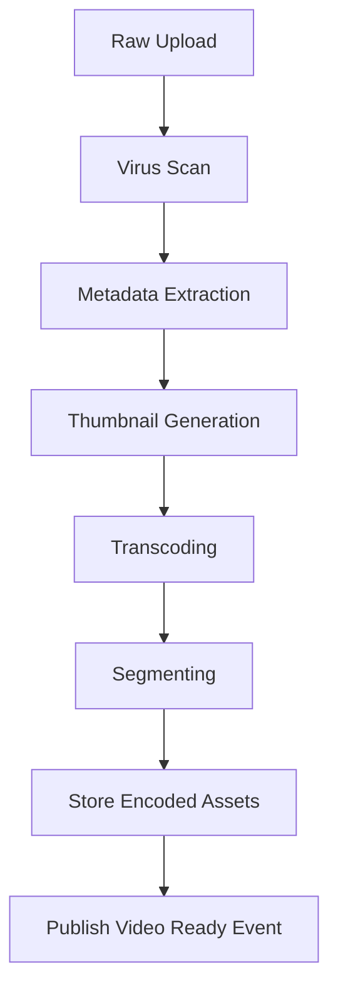

---

# 25. Adaptive Streaming Details

YouTube-like systems usually use adaptive streaming protocols.

Examples:

* HLS
* MPEG-DASH

The video is broken into small chunks.

The player fetches only the chunks needed.

This improves:

* buffering
* quality switching
* bandwidth usage
* startup speed

---

## Chunking Diagram

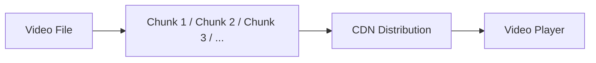

---

# 26. Multi-Region Architecture

At global scale, one region is not enough.

You need:

* geo-replication
* regional CDNs
* failover routing
* global traffic management

---

## Multi-Region Design

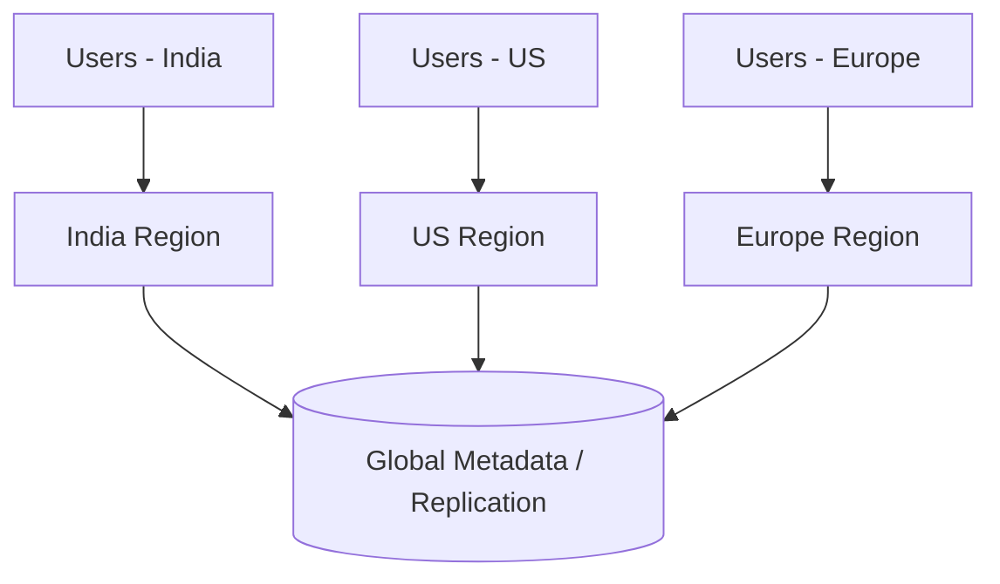

---

# 27. Watch History

Watch history is important for:

* continue watching
* recommendations
* analytics
* user personalization

It should be written asynchronously.

---

## Watch History Flow

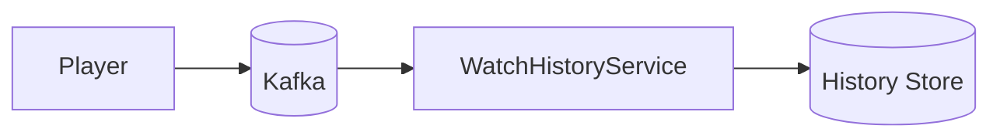

---

# 28. Analytics and Creator Dashboard

Creators want to know:

* views
* watch time
* CTR
* audience retention
* demographics
* traffic sources

These analytics should not slow down the main playback path.

Use asynchronous pipelines.

---

## Analytics Architecture

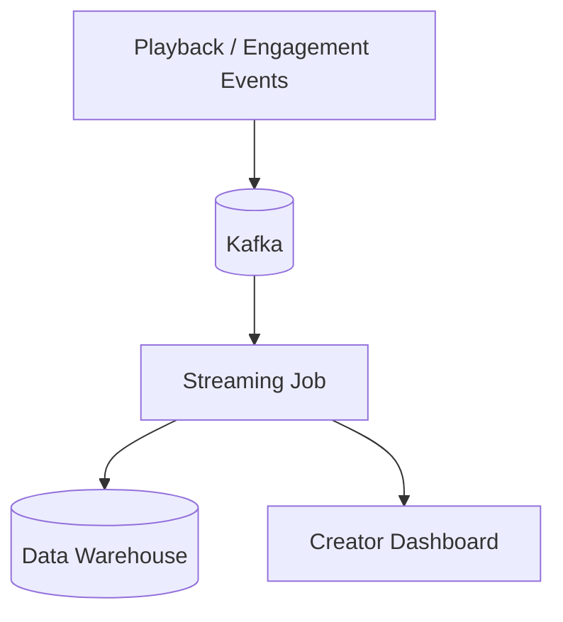

---

# 29. Handling Virality

A video may go viral suddenly.

This creates spikes in:

* views
* comments
* likes
* notifications
* recommendations
* search queries

The design must handle:

* CDN shielding
* cache warming
* queue-based fanout
* auto-scaling
* hot partition mitigation

---

## Viral Spike Flow

```mermaid
flowchart TD
    ViralVideo --> MoreViews
    MoreViews --> CDNPressure
    CDNPressure --> CacheWarmup
    MoreViews --> QueuePressure
    QueuePressure --> WorkerScaleUp
```

---

# 30. Rate Limiting and Abuse Protection

YouTube-like systems are targets for:

* bot uploads
* spam comments
* click fraud
* abusive scraping
* mass subscription attacks

Use:

* per-user limits
* per-IP limits
* per-endpoint limits
* per-device limits
* anomaly detection

---

# 31. Message Queue Strategy

Kafka is used heavily because it decouples workloads.

Good Kafka topics might include:

| Topic                | Usage                            |
| -------------------- | -------------------------------- |
| video-uploaded       | Trigger transcoding              |
| video-ready          | Notify systems video is playable |
| comment-created      | Update search and analytics      |
| like-created         | Update counters                  |
| watch-event          | Update recommendations           |
| subscription-created | Trigger notifications            |

---

# 32. Search and Recommendations are Separate

This is important.

Search and recommendation are not the same.

| Feature        | Goal                       |
| -------------- | -------------------------- |
| Search         | Find what user asks for    |
| Recommendation | Suggest what user may like |

They use different data and different ranking logic.

---

# 33. API Design

---

## Upload Video

```http id="yt_api_01"
POST /videos/upload/initiate
```

Request returns pre-signed upload URL.

---

## Get Video

```http id="yt_api_02"
GET /videos/{video_id}
```

Returns metadata and playback manifest.

---

## Search Videos

```http id="yt_api_03"
GET /search?q=system+design
```

Returns ranked search results.

---

## Comment on Video

```http id="yt_api_04"
POST /videos/{video_id}/comments
```

---

## Like Video

```http id="yt_api_05"
POST /videos/{video_id}/like
```

---

## Subscribe to Channel

```http id="yt_api_06"
POST /channels/{channel_id}/subscribe
```

---

# 34. Sharding Strategy

The system must shard large data sets.

---

## Good Sharding Keys

| Data          | Sharding Key          |
| ------------- | --------------------- |
| Videos        | video_id              |
| Comments      | video_id              |
| Watch history | user_id               |
| Subscriptions | user_id               |
| Analytics     | time + region         |
| Search index  | by document partition |

---

## Sharding Diagram

```mermaid
flowchart LR
    V1[Video 1] --> S1[Shard 1]
    V2[Video 2] --> S2[Shard 2]
    V3[Video 3] --> S3[Shard 3]
    V4[Video 4] --> S1
```

---

# 35. Hot Partition Problem

A viral video can overload one shard if everything depends on its `video_id`.

To mitigate this:

* add sub-sharding
* replicate hot metadata
* cache heavily
* move comment reads to indexed stores

---

# 36. Search Suggestions

Search suggestions are very hot.

Use:

* prefix tree
* search cache
* precomputed popular queries

---

# 37. Cold Start Problem in Recommendations

New users have no history.

Use fallback signals:

* popular videos
* region
* language
* device
* trending topics

New creators also need exploration strategies.

---

# 38. ML and Recommendation at Scale

A real YouTube-like recommendation system uses:

* embeddings
* feature stores
* offline training
* online serving
* ranking models
* exploration/exploitation balancing

---

# 39. Security Considerations

| Risk                 | Protection                |
| -------------------- | ------------------------- |
| Unauthorized uploads | Auth + signed URLs        |
| Content piracy       | DRM / access control      |
| Spam                 | Rate limiting             |
| Abuse                | Moderation systems        |
| Token theft          | Secure JWT handling       |
| CSRF/XSS             | Secure frontend practices |
| Malicious media      | Virus scanning            |

---

# 40. Observability

The system must monitor:

| Metric                | Why                |
| --------------------- | ------------------ |
| Upload latency        | Creator experience |
| Transcoding lag       | Processing health  |
| Playback startup time | Viewer experience  |
| CDN hit rate          | Performance        |
| Search latency        | User satisfaction  |
| Comment write latency | Engagement UX      |
| Kafka lag             | Backlog detection  |
| Error rate            | Reliability        |

---

# 41. Failure Scenarios

---

## 1. Transcoding Failure

Use:

* retries
* DLQ
* worker restart
* job checkpointing

---

## 2. Search Index Lag

Search may take time to reflect fresh uploads.

Accept eventual consistency.

---

## 3. CDN Miss Spike

Warm caches and replicate popular content.

---

## 4. Kafka Outage

Use durable topics and multi-broker clusters.

---

## 5. Database Overload

Use sharding, caches, and asynchronous aggregation.

---

# 42. Final Production Architecture

```mermaid
flowchart TB
    Client --> LB[Load Balancer]
    LB --> APIGW[API Gateway]
    LB --> WSGW[WebSocket Gateway]

    APIGW --> Auth[Auth Service]
    APIGW --> Video[Video Service]
    APIGW --> Search[Search Service]
    APIGW --> Rec[Recommendation Service]
    APIGW --> Comment[Comment Service]
    APIGW --> Like[Like Service]
    APIGW --> Sub[Subscription Service]
    APIGW --> Notify[Notification Service]
    APIGW --> Analytics[Analytics Service]
    APIGW --> Media[Media Service]

    WSGW --> Playback[Playback Service]
    WSGW --> Presence[Presence Service]

    Media --> S3[(Object Storage)]
    Video --> VideoDB[(Video Metadata DB)]
    Comment --> CommentDB[(Comment DB)]
    Auth --> UserDB[(User DB)]
    Search --> ES[(Elasticsearch)]
    Rec --> FeatureStore[(Feature Store)]
    Playback --> CDN[CDN]

    Video --> Kafka[(Kafka)]
    Comment --> Kafka
    Like --> Kafka
    Sub --> Kafka
    Playback --> Kafka
    Notify --> Push[FCM / APNS]
    Kafka --> Transcoder[Transcoding Workers]
    Kafka --> SearchIndexer[Search Indexer]
    Kafka --> RecProcessor[Recommendation Pipeline]
    Kafka --> AnalyticsWarehouse[(Data Warehouse)]
```

---

# 43. Why This Architecture Scales

This design scales because it separates the system into specialized layers:

| Layer          | Function                             |
| -------------- | ------------------------------------ |
| Edge           | Load balancing, routing              |
| Application    | Stateless service logic              |
| Storage        | Durable metadata and blobs           |
| Async pipeline | Transcoding, notifications, indexing |
| Cache          | Hot data and low-latency reads       |
| CDN            | Global video delivery                |
| ML layer       | Recommendations                      |
| Analytics      | Offline and streaming insights       |

Each piece can scale independently.

---

# 44. Design Tradeoffs

| Decision                      | Tradeoff                                |
| ----------------------------- | --------------------------------------- |
| Object storage for videos     | Great durability, not query-friendly    |
| Kafka for async jobs          | Great decoupling, added complexity      |
| Redis for hot state           | Fast, but ephemeral                     |
| NoSQL for comments            | Scalable, but weaker joins              |
| CDN for playback              | Fast, but cache invalidation complexity |
| Search index separate from DB | Fast search, eventual consistency       |

---

# 45. Optional Advanced Features

A real YouTube-like platform may also support:

* live streaming
* subtitles and caption generation
* chapters
* playlists
* watch later
* shorts / vertical content
* content monetization
* ad insertion
* DRM
* watermarking
* content copyright detection
* regional restriction policies

These are advanced extensions built on the same architecture.

---

# 46. Live Streaming Extension

Live streaming has different requirements:

* ultra-low latency
* chat overlays
* stream health monitoring
* real-time event fanout
* stream ingest servers
* edge transcoding

It is usually designed as a separate subsystem.

---

# 47. Key Takeaways

| Concept          | Summary                                   |
| ---------------- | ----------------------------------------- |
| Video upload     | Use direct-to-object-storage uploads      |
| Video processing | Transcode asynchronously                  |
| Playback         | Use CDN + adaptive streaming              |
| Search           | Use Elasticsearch/OpenSearch              |
| Recommendations  | Use offline + online ML pipelines         |
| Comments         | Store separately and index asynchronously |
| Likes/views      | Aggregate via events and counters         |
| Notifications    | Use queue-driven fanout                   |
| Presence         | Store ephemeral state in Redis            |
| Scale            | Horizontal everywhere                     |

---

# Conclusion

Designing YouTube is really about designing a global media distribution platform.

The hard parts are not just storage or playback.

The hard parts are:

* handling enormous media files
* processing them asynchronously
* streaming them globally with low latency
* supporting search and recommendations
* managing massive write and read spikes
* ensuring reliability during viral events
* keeping the entire system observable and secure

A production-grade YouTube system uses:

* **CDNs** for video delivery
* **object storage** for media blobs
* **Kafka** for asynchronous pipelines
* **Redis** for hot state and caching
* **search indexes** for discovery
* **ML pipelines** for recommendations
* **stateless services** for scalability
* **sharding and replication** for durability
* **multi-region deployment** for resilience

That is how you build a system that can serve billions of users and still feel fast, smooth, and reliable.