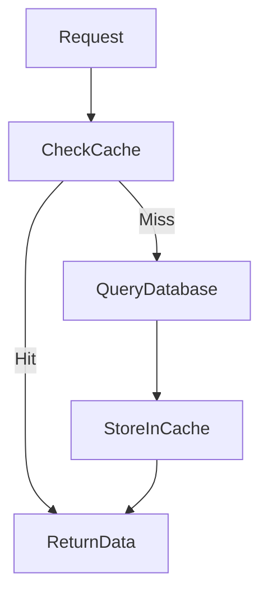
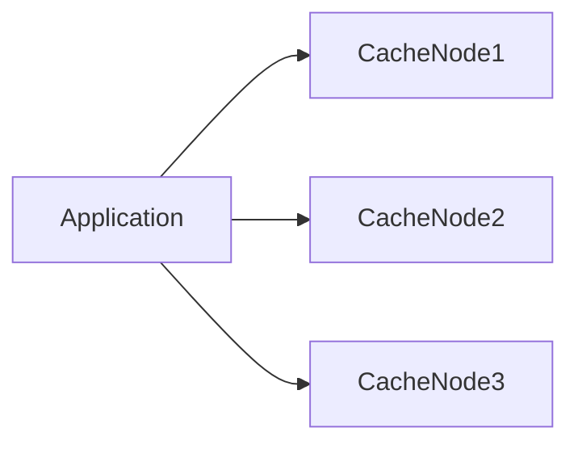
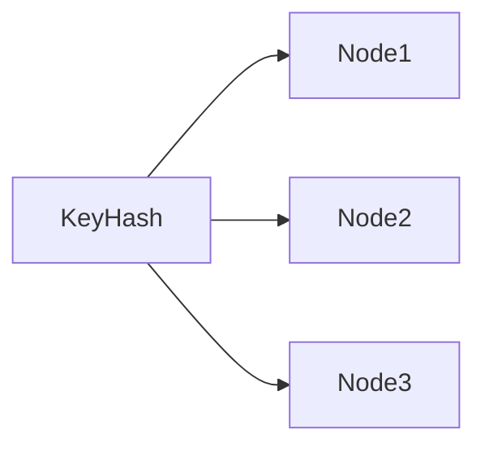
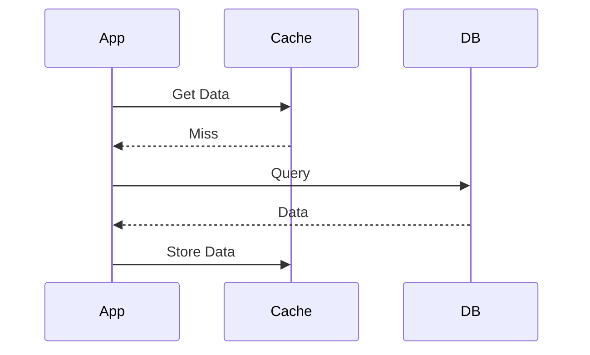
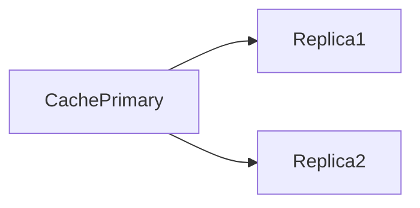
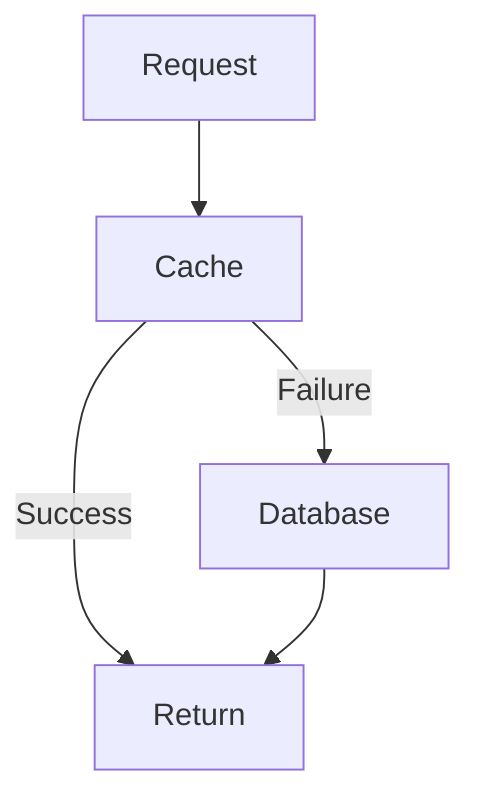

# Distributed Caching

Modern applications serve **millions of users** and handle enormous amounts of data. If every request directly queries the database, the database becomes a **performance bottleneck**.

This is where **Distributed Caching** becomes critical.

Distributed caching stores **frequently accessed data in fast in-memory systems distributed across multiple servers**, allowing applications to retrieve data quickly without repeatedly hitting the database.

> Distributed caching is a technique where multiple cache nodes store data in memory across a cluster to improve performance, scalability, and system responsiveness.

---

# Why Distributed Caching is Needed

Databases are optimized for **durability and consistency**, not raw speed. Even a well-indexed database query may take several milliseconds.

Memory access, however, is **orders of magnitude faster**.

| Storage Type | Approx Latency |
|---------------|---------------|
| CPU Cache | ~1 ns |
| RAM | ~100 ns |
| SSD | ~100 µs |
| Database Query | 1–10 ms |

When systems scale to **millions of requests per second**, repeatedly querying the database becomes unsustainable.

Distributed caching solves this by serving **most reads directly from memory**.

---

# Basic Architecture

A distributed cache sits between the **application layer and the database**.

```mermaid
flowchart LR
    Client --> Application
    Application --> CacheCluster
    CacheCluster --> Database
````

Request flow:

1. Application checks cache
2. If data exists → return immediately (**cache hit**)
3. If not → query database (**cache miss**)
4. Store result in cache for future requests

---

# Example Scenario

Imagine an e-commerce platform.

Commonly accessed data:

* product details
* product prices
* user sessions
* trending products

Without caching:

```
User Request → Application → Database → Response
```

With caching:

```
User Request → Application → Cache → Response
```

The database is only accessed **when necessary**.

Large platforms like Amazon and Netflix rely heavily on distributed caching to handle massive traffic.

---

# Cache Hit vs Cache Miss

| Term       | Meaning                                  |
| ---------- | ---------------------------------------- |
| Cache Hit  | Requested data exists in cache           |
| Cache Miss | Data not found in cache                  |
| Hit Ratio  | Percentage of requests served from cache |

---

## Request Flow



Improving the **cache hit ratio** significantly improves system performance.

---

# Why Distributed Caches Instead of Single Cache

A single cache server cannot handle very large systems due to:

* memory limits
* CPU limits
* network bottlenecks
* single point of failure

Distributed caching solves this by **spreading data across multiple nodes**.



Each node stores a **portion of the dataset**.

---

# Cache Partitioning (Sharding)

Data in distributed caches is typically partitioned using **hashing**.



Each key is mapped to a cache node.

This allows the cache cluster to **scale horizontally**.

---

# Popular Distributed Cache Systems

Several technologies implement distributed caching.

| Technology    | Description                             |
| ------------- | --------------------------------------- |
| Redis         | Extremely fast in-memory cache          |
| Memcached     | Simple key-value cache                  |
| Apache Ignite | Distributed cache and compute platform  |
| Hazelcast     | Distributed caching and data structures |

These systems distribute cached data across clusters of machines.

---

# Cache Data Types

Distributed caches support different types of data storage.

| Type        | Example            |
| ----------- | ------------------ |
| Key-Value   | product:123 → JSON |
| Hash Maps   | user:profile       |
| Lists       | recent messages    |
| Sets        | active users       |
| Sorted Sets | leaderboard        |

For example, Redis supports advanced structures like sorted sets and streams.

---

# Cache Eviction Strategies

Since memory is limited, caches must remove data when they become full.

This is called **cache eviction**.

---

## Common Eviction Policies

| Policy | Description                        |
| ------ | ---------------------------------- |
| LRU    | Least Recently Used item removed   |
| LFU    | Least Frequently Used item removed |
| FIFO   | First inserted item removed        |
| TTL    | Data expires after time limit      |

---

## LRU Example


The least recently used item is removed to make space for new data.

---

# Cache Consistency Problem

One major challenge with caching is **stale data**.

Example:

1. Data cached
2. Database updated
3. Cache still holds old value

This leads to **inconsistent data**.

---

# Cache Update Strategies

There are several strategies for keeping cache and database consistent.

---

## Cache-Aside (Lazy Loading)

Most common strategy.



Advantages:

* simple
* flexible

Disadvantages:

* first request slower

---

## Write-Through Cache

Application writes to **cache and database simultaneously**.


Advantages:

* cache always consistent

Disadvantages:

* slower writes

---

## Write-Behind (Write-Back)

Writes go to cache first, then asynchronously to database.


Advantages:

* fast writes

Disadvantages:

* risk of data loss

---

# Replication in Distributed Caches

Caches often replicate data for **high availability**.



If one node fails, replicas serve the data.

---

# Cache Invalidation

Cache invalidation ensures cached data remains correct.

Common approaches:

| Method                   | Description                     |
| ------------------------ | ------------------------------- |
| TTL expiration           | Data expires automatically      |
| Explicit invalidation    | Application deletes cache entry |
| Event-based invalidation | Message triggers cache refresh  |

> Cache invalidation is famously considered one of the **hardest problems in computer science**.

---

# Multi-Level Caching

Large systems often use multiple cache layers.


Layers include:

1. CDN cache
2. application memory cache
3. distributed cache cluster

Companies like Netflix use multi-level caching to deliver video metadata quickly.

---

# Example: Social Media Feed

Imagine loading a user's feed.

Without caching:

```
Request → DB → Assemble Feed → Response
```

With distributed caching:

```
Request → Cache → Response
```

The cache stores:

* recent posts
* user profile data
* trending hashtags

Platforms like Instagram rely heavily on distributed caching for feed performance.

---

# Cache Failure Handling

If cache fails, the system should **gracefully fall back** to database.



However, sudden cache failures can cause **database overload** (cache stampede).

---

# Cache Stampede

A cache stampede happens when many requests try to fetch missing data simultaneously.

Example:

* cached item expires
* thousands of requests query database simultaneously

---

## Mitigation Strategies

| Technique          | Explanation                   |
| ------------------ | ----------------------------- |
| Request Coalescing | Only one request fetches data |
| Locking            | Prevent concurrent DB queries |
| Early expiration   | Refresh cache before expiry   |
| Background refresh | Update cache asynchronously   |

---

# Monitoring Distributed Caches

Important metrics:

| Metric         | Meaning                   |
| -------------- | ------------------------- |
| Cache hit rate | Percentage of hits        |
| Latency        | Cache response time       |
| Evictions      | Number of removed entries |
| Memory usage   | Memory consumption        |

Monitoring tools include:

* Prometheus
* Grafana

---

# Advantages of Distributed Caching

| Benefit               | Explanation                     |
| --------------------- | ------------------------------- |
| Faster response times | Memory access is extremely fast |
| Reduced database load | Many queries avoided            |
| Improved scalability  | System handles more users       |
| Lower latency         | Faster user experience          |

---

# Trade-offs

| Challenge          | Explanation                         |
| ------------------ | ----------------------------------- |
| Data inconsistency | Cache may hold stale data           |
| Memory cost        | RAM is expensive                    |
| Complexity         | Requires careful cache invalidation |

---

# Summary

Distributed caching is one of the **most important performance optimization techniques** in large-scale systems.

It works by storing frequently accessed data in **fast in-memory clusters**, dramatically reducing database load and improving latency.

Key ideas include:

* storing data across multiple cache nodes
* improving cache hit ratios
* handling consistency challenges
* managing eviction and invalidation

By implementing distributed caching, large systems can support **millions of users with low latency and high scalability**.