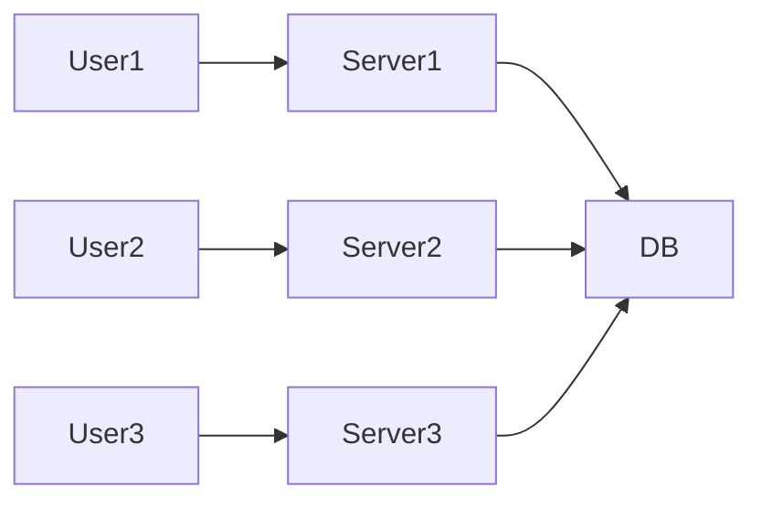
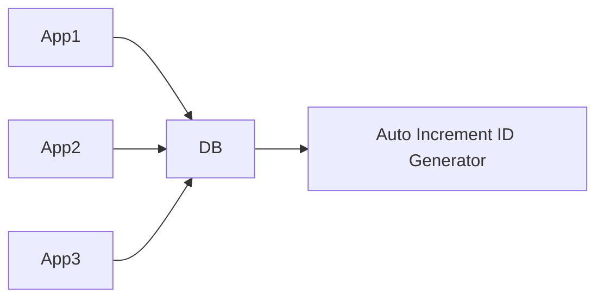
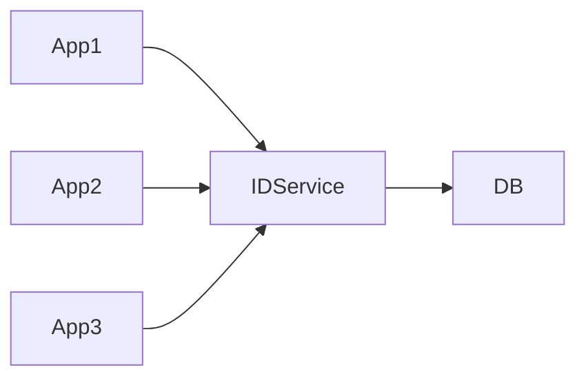
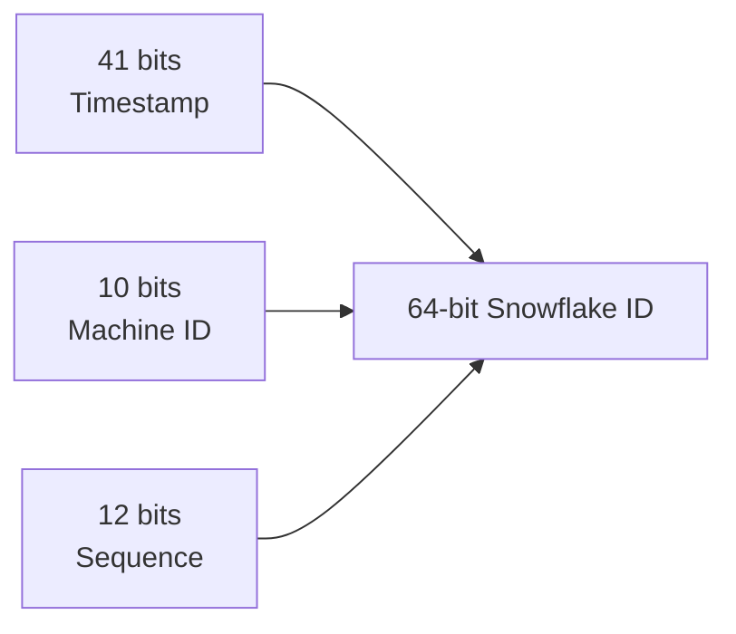
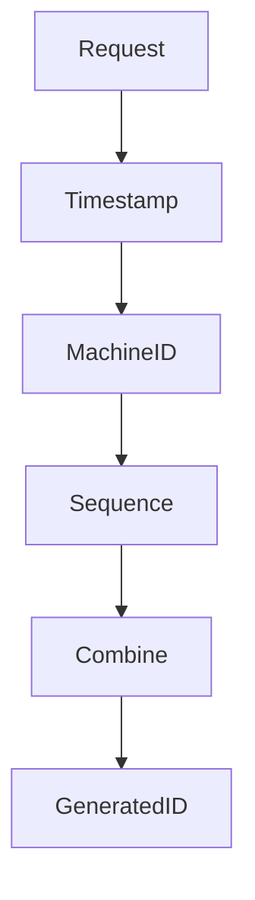
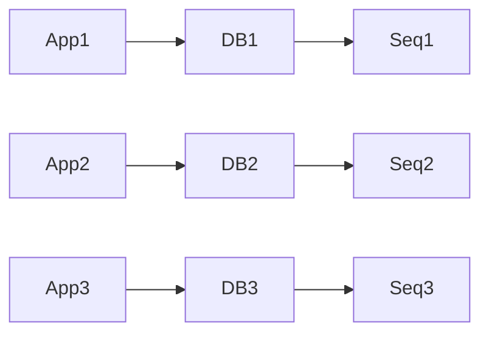
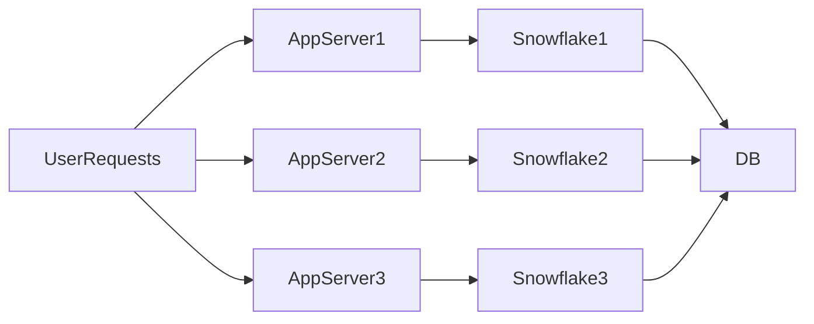
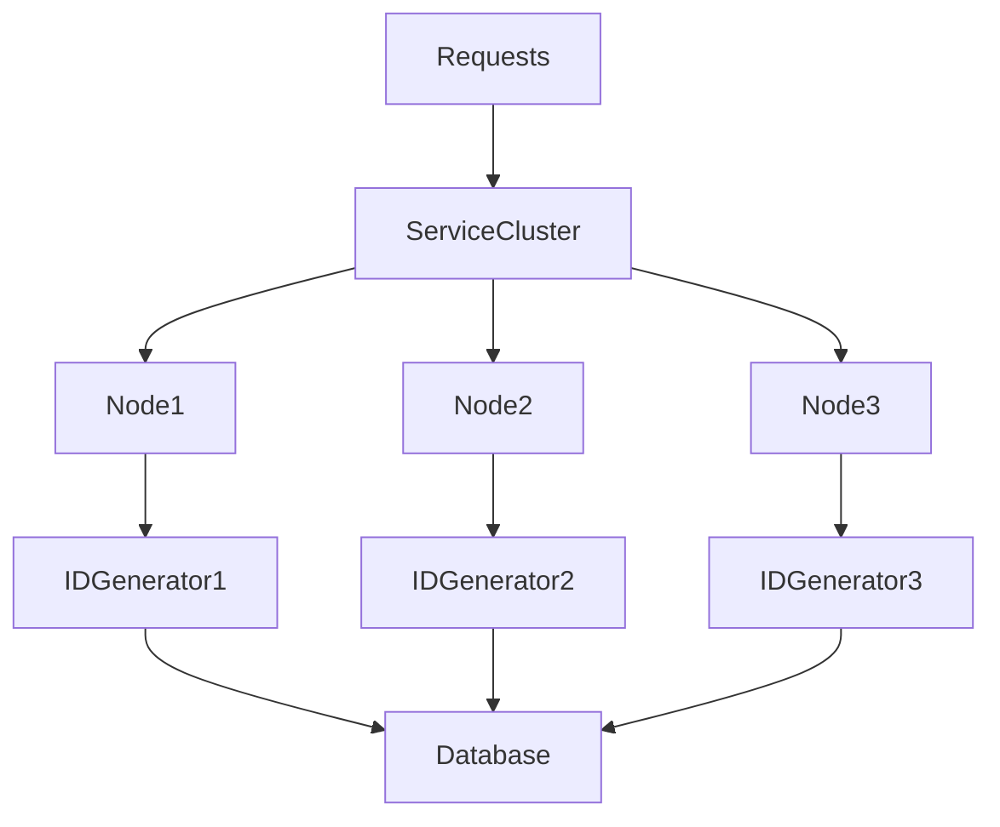

# Distributed ID Generation

## Introduction

Every system needs **identifiers**.

Examples:

| Entity | Example ID |
|------|------|
| User | `user_984223` |
| Order | `order_883912` |
| Tweet/Post | `174823749128` |
| Payment | `pay_223821` |

At small scale, generating IDs is simple:

```text
Auto Increment: 1, 2, 3, 4, 5
````

But in **distributed systems**, things become much harder.

Modern platforms like:

* Twitter
* Instagram
* Uber

generate **millions of IDs per second across thousands of servers**.

The challenge becomes:

| Requirement           | Explanation                           |
| --------------------- | ------------------------------------- |
| Global uniqueness     | No two IDs should ever collide        |
| High throughput       | Millions of IDs per second            |
| Distributed           | Generated across many machines        |
| Orderable (sometimes) | IDs may need time ordering            |
| Fault tolerant        | System should work even if nodes fail |

Generating such IDs reliably is the problem of **Distributed ID Generation**.

---

# Why ID Generation Becomes Hard in Distributed Systems

Imagine a system with **100 application servers**.

If every server generates IDs locally:

```text
Server A → ID 1
Server B → ID 1
Server C → ID 1
```

Now collisions happen.

Multiple servers generate **duplicate IDs**.

This creates severe issues:

* Data corruption
* Wrong records
* Inconsistent references
* Broken relationships between entities

---

## Distributed System Architecture Problem



Each server must generate IDs **without coordination bottlenecks**.

---

# Key Requirements of Distributed ID Generators

| Property      | Why It Matters              |
| ------------- | --------------------------- |
| Uniqueness    | Prevent collisions          |
| Scalability   | Handle millions of requests |
| Availability  | Work even when nodes fail   |
| Performance   | Low latency ID generation   |
| Time ordering | Useful for logs, analytics  |
| Compactness   | Smaller storage size        |

---

# Approaches to Distributed ID Generation

Several strategies exist.

| Method                          | Ordering | Scalability | Coordination |
| ------------------------------- | -------- | ----------- | ------------ |
| Database Auto Increment         | Yes      | Poor        | Centralized  |
| UUID                            | No       | Excellent   | None         |
| Database Sequence with Sharding | Partial  | Good        | Moderate     |
| Twitter Snowflake               | Yes      | Excellent   | Minimal      |
| Central ID Service              | Yes      | Medium      | Centralized  |

Let's explore them deeply.

---

# 1. Database Auto-Increment IDs

## How It Works

The database generates IDs automatically.

```sql
CREATE TABLE users (
   id BIGINT AUTO_INCREMENT,
   name VARCHAR(100)
);
```

Insert query:

```sql
INSERT INTO users(name) VALUES ('Alice');
```

Generated IDs:

```
1
2
3
4
```

---

## Architecture



---

## Problems

| Issue        | Explanation                    |
| ------------ | ------------------------------ |
| Bottleneck   | All requests hit one DB        |
| Scalability  | Limits horizontal scaling      |
| Latency      | DB round trip needed           |
| Failure risk | DB outage blocks ID generation |

For large-scale systems, this approach **does not scale**.

---

# 2. UUID (Universally Unique Identifier)

UUID is a **128-bit identifier** designed to be globally unique.

Example:

```
550e8400-e29b-41d4-a716-446655440000
```

---

## UUID Generation

Generated locally without coordination.

```javascript
import { randomUUID } from "crypto"

const id = randomUUID()
console.log(id)
```

---

## Structure (UUID v4)


---

## Advantages

| Advantage                  | Explanation                           |
| -------------------------- | ------------------------------------- |
| No coordination            | Each node generates IDs independently |
| Highly scalable            | Works across millions of nodes        |
| Practically collision-free | Extremely low collision probability   |

---

## Problems

| Problem       | Explanation                    |
| ------------- | ------------------------------ |
| Large size    | 128-bit storage                |
| Poor indexing | Random order harms DB indexes  |
| No ordering   | Cannot determine creation time |

For high-scale databases, UUIDs **fragment indexes heavily**.

---

# 3. Centralized ID Generation Service

Another approach is creating a **dedicated ID generation service**.

Architecture:



Each request:

```
GET /generate-id
```

Response:

```
983482394
```

---

## Advantages

| Advantage       | Explanation           |
| --------------- | --------------------- |
| Central control | Easy management       |
| Ordered IDs     | Sequential generation |

---

## Problems

| Problem                 | Explanation                  |
| ----------------------- | ---------------------------- |
| Single point of failure | Service outage blocks system |
| Scalability limits      | High load on ID service      |
| Network latency         | Extra API call               |

Large systems avoid this design.

---

# 4. Twitter Snowflake ID Generator

One of the most famous distributed ID generators.

Developed by:

* Twitter

---

## Key Idea

Generate IDs using:

```
Timestamp + Machine ID + Sequence
```

This ensures:

* uniqueness
* ordering
* scalability

---

## Snowflake ID Structure

64-bit integer:

| Bits    | Component       |
| ------- | --------------- |
| 41 bits | Timestamp       |
| 10 bits | Machine ID      |
| 12 bits | Sequence Number |

---

## Visual Structure



---

## Example ID

```
154742918274918
```

Internally contains:

```
timestamp = creation time
machine id = server
sequence = request counter
```

---

# How Snowflake Generates IDs

Steps:

1. Get current timestamp
2. Use server's machine ID
3. Increment sequence number
4. Combine bits

---

## Snowflake Generation Flow



---

## Benefits

| Feature     | Explanation                     |
| ----------- | ------------------------------- |
| Distributed | Each node generates IDs locally |
| Ordered     | IDs roughly follow time         |
| Fast        | No network calls                |
| Compact     | Only 64 bits                    |

---

## Capacity

Snowflake supports:

| Metric                          | Capacity |
| ------------------------------- | -------- |
| Machines                        | 1024     |
| IDs per machine per millisecond | 4096     |
| IDs per second                  | Millions |

---

# Real-World Systems Using Snowflake-like IDs

Many companies built similar systems.

| Company   | System                |
| --------- | --------------------- |
| Twitter   | Snowflake             |
| Instagram | Sharded ID generation |
| Discord   | Snowflake variant     |
| Sony      | Sonyflake             |

---

# 5. Database Sequence with Sharding

Another approach:

Split sequences across shards.

Example:

Server1 generates:

```
1,4,7,10
```

Server2 generates:

```
2,5,8,11
```

Server3 generates:

```
3,6,9,12
```

---

## Architecture



---

## Trade-offs

| Advantage            | Disadvantage         |
| -------------------- | -------------------- |
| Simple               | Still DB dependent   |
| Ordered within shard | Not globally ordered |

---

# ID Ordering and Database Indexing

Why ordering matters.

Databases store indexes as **B-trees**.

Sequential IDs:

```
1 → 2 → 3 → 4
```

Work efficiently.

Random IDs:

```
A23 → 7FF → 91A
```

Cause:

* page splits
* index fragmentation
* slower inserts

Snowflake solves this because IDs are **time ordered**.

---

# Global ID Generation Architecture

Typical distributed architecture:



Each server generates IDs **locally**.

---

# Failure Handling

Edge cases:

### Clock Drift

If system clock moves backward:

Snowflake may generate duplicate IDs.

Solutions:

* NTP synchronization
* wait until time catches up

---

### Machine ID Conflicts

If two machines use the same ID.

Solution:

* assign IDs via configuration
* service discovery

---

# Comparison of ID Generation Strategies

| Method          | Ordered | Distributed | Performance | Storage |
| --------------- | ------- | ----------- | ----------- | ------- |
| Auto Increment  | Yes     | No          | Slow        | Small   |
| UUID            | No      | Yes         | Fast        | Large   |
| Central Service | Yes     | Limited     | Medium      | Small   |
| Snowflake       | Yes     | Yes         | Very Fast   | Small   |

Snowflake-style generators are the **industry standard today**.

---

# Best Practices

### Prefer 64-bit IDs

Efficient storage and indexing.

---

### Avoid Random UUIDs in Databases

They cause index fragmentation.

---

### Use Snowflake-like systems

For:

* distributed microservices
* high throughput platforms

---

### Ensure Clock Synchronization

Critical for time-based IDs.

---

# Final Architecture Summary



Every node generates **unique, ordered IDs without coordination**.

---

# Key Takeaways

| Concept                   | Insight                                   |
| ------------------------- | ----------------------------------------- |
| Distributed ID generation | Essential for scalable systems            |
| Auto increment            | Not suitable for distributed architecture |
| UUID                      | Highly scalable but poor indexing         |
| Snowflake                 | Best balance of ordering and scalability  |
| Time-based IDs            | Improve database performance              |

Distributed ID generation is a **fundamental building block of scalable architectures**, enabling large platforms to create billions of records reliably without coordination bottlenecks.