# Distributed Messaging Queue

Modern distributed systems are composed of many independent services.

For example, an e-commerce platform may contain:

```

User Service
Order Service
Payment Service
Inventory Service
Notification Service
Analytics Service

```

If every service communicates **synchronously** with every other service, the system quickly becomes tightly coupled and fragile.

A **Distributed Messaging Queue** solves this problem by enabling **asynchronous communication** between services.

Instead of sending direct requests, services send **messages** to a queue where other services can process them independently.

---

# Why Distributed Messaging Queues Exist

Consider a scenario where an order is placed.

Operations that might follow:

```

1 Process payment
2 Update inventory
3 Send confirmation email
4 Generate invoice
5 Update analytics

```

If these operations happen synchronously:

```

Order Service → Payment Service
Order Service → Inventory Service
Order Service → Email Service
Order Service → Analytics Service

```

The Order Service becomes overloaded and tightly coupled with other services.

---

# Using a Messaging Queue

With a messaging queue, the order service simply publishes a message:

```

OrderPlaced Event

````

Other services independently consume the message.

```mermaid
flowchart LR
OrderService --> MessageQueue
MessageQueue --> PaymentService
MessageQueue --> InventoryService
MessageQueue --> EmailService
MessageQueue --> AnalyticsService
````

This architecture makes the system:

* loosely coupled
* scalable
* resilient

---

# Core Components of a Messaging Queue

A distributed messaging system typically contains the following components.

| Component     | Description                     |
| ------------- | ------------------------------- |
| Producer      | Service that sends messages     |
| Message Queue | Temporary storage for messages  |
| Broker        | Server that manages queues      |
| Consumer      | Service that processes messages |
| Topic/Channel | Logical grouping of messages    |

---

# Basic Messaging Flow

```mermaid
sequenceDiagram
participant Producer
participant Broker
participant Queue
participant Consumer

Producer->>Broker: Publish message
Broker->>Queue: Store message
Consumer->>Broker: Pull message
Broker-->>Consumer: Deliver message
Consumer->>Broker: Acknowledge
```

Steps:

```
Producer sends message
Broker stores message
Consumer retrieves message
Consumer processes message
Consumer acknowledges completion
```

---

# Message Queue Architecture

A distributed message queue typically runs across multiple nodes.

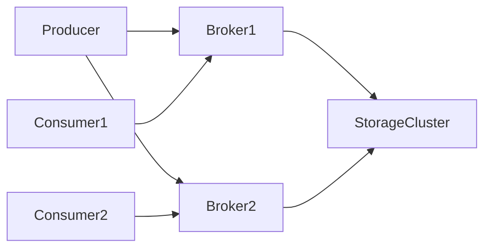

This architecture provides:

```
High availability
Fault tolerance
Scalability
```

---

# Push vs Pull Messaging

There are two ways messages are delivered.

| Method     | Description                         |
| ---------- | ----------------------------------- |
| Push Model | Broker pushes messages to consumers |
| Pull Model | Consumers request messages          |

---

## Push Model

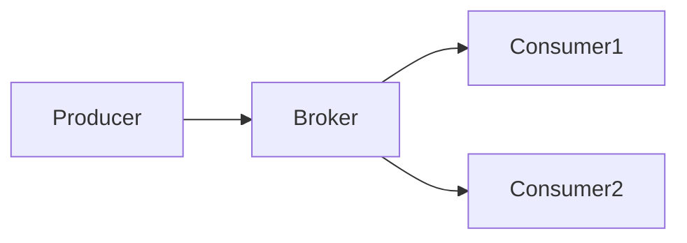

Advantages:

```
Low latency
Immediate delivery
```

Disadvantages:

```
Consumer overload possible
```

---

## Pull Model

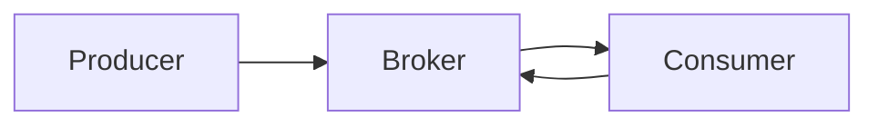

Advantages:

```
Consumer controls load
Better flow control
```

Disadvantages:

```
Higher latency
```

Many large systems prefer **pull-based models**.

---

# Message Durability

Distributed queues must ensure messages are not lost.

Messages are typically stored in:

```
Disk
Replicated logs
Distributed storage
```

Example architecture:

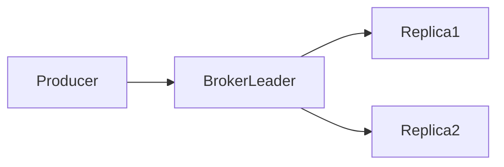

Replication ensures:

```
Data durability
Fault tolerance
```

---

# Message Delivery Guarantees

Messaging systems offer different delivery guarantees.

| Guarantee     | Description                         |
| ------------- | ----------------------------------- |
| At Most Once  | Message delivered zero or one time  |
| At Least Once | Message delivered one or more times |
| Exactly Once  | Message delivered exactly one time  |

---

## At Most Once

```
No retries
Possible message loss
```

Fast but unreliable.

---

## At Least Once

```
Messages retried until success
Duplicates possible
```

Consumers must handle duplicates.

---

## Exactly Once

```
No duplicates
No loss
```

Most complex to implement.

---

# Queue vs Topic

Messaging systems often support two messaging models.

| Model | Description                        |
| ----- | ---------------------------------- |
| Queue | One consumer receives message      |
| Topic | Multiple consumers receive message |

---

# Queue Model

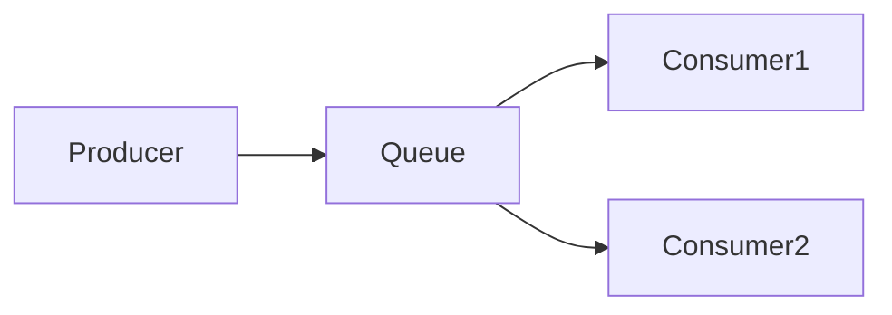

Each message is processed by **one consumer**.

Useful for:

```
Task processing
Background jobs
```

---

# Publish Subscribe Model

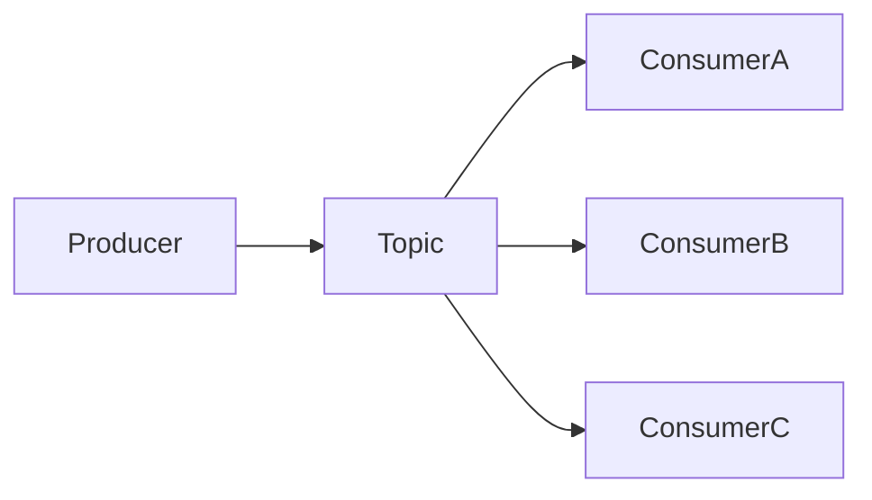

Each consumer receives a copy.

Useful for:

```
Event-driven systems
Notifications
Analytics pipelines
```

---

# Partitioning

To scale message processing, queues are divided into **partitions**.

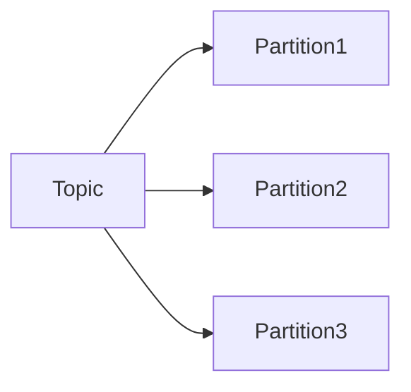

Each partition can be processed independently.

Benefits:

```
Parallel processing
Higher throughput
```

---

# Consumer Groups

Consumers can form groups to share work.

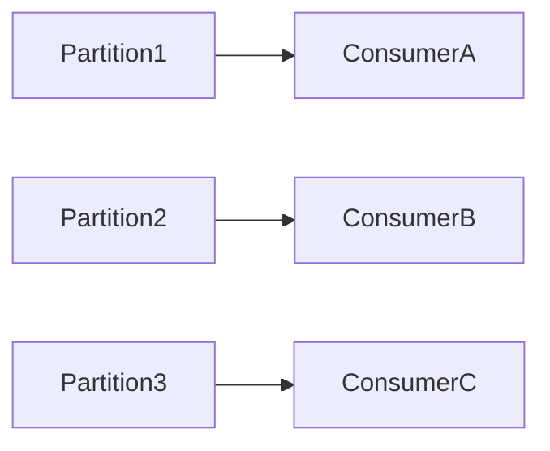

Each consumer processes a subset of partitions.

This enables horizontal scaling.

---

# Message Ordering

Some systems require ordered messages.

Example:

```
Bank transactions
Event logs
```

Ordering is usually guaranteed **within a partition**, but not across partitions.

---

# Message Retention

Messages are stored for a configurable time period.

Example:

```
Retention: 7 days
```

Benefits:

```
Consumers can replay messages
Debugging becomes easier
```

---

# Message Replay

Consumers may replay messages for:

```
Data recovery
Analytics
Debugging
Reprocessing events
```

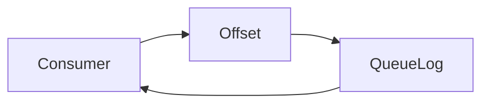

Consumers track their **offset** in the log.

---

# Handling Failures

Failures are inevitable in distributed systems.

Messaging systems handle them through:

| Mechanism          | Purpose                      |
| ------------------ | ---------------------------- |
| Replication        | Prevent message loss         |
| Retry policies     | Handle transient errors      |
| Dead Letter Queues | Store failed messages        |
| Acknowledgements   | Ensure successful processing |

---

# Dead Letter Queue (DLQ)

When a message repeatedly fails processing, it is moved to a **dead letter queue**.

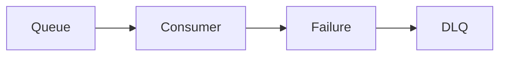

DLQ helps:

```
Debug problematic messages
Prevent infinite retries
```

---

# Backpressure

If consumers cannot process messages fast enough, queues grow rapidly.

Backpressure mechanisms include:

```
Rate limiting
Consumer scaling
Message throttling
```

---

# Distributed Messaging in Large Systems

Large-scale systems rely heavily on messaging systems.

Example architecture:

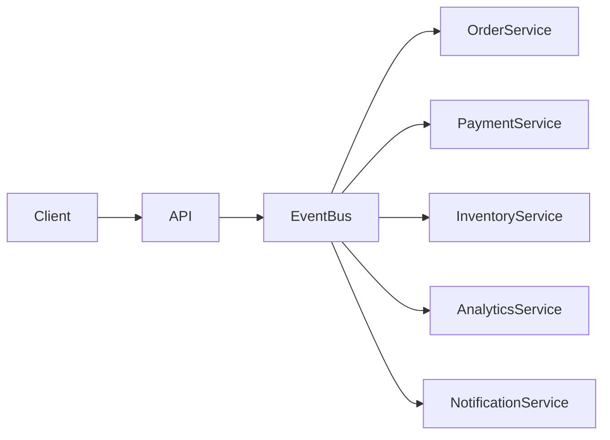

Benefits:

```
Loose coupling
Independent scaling
Improved reliability
```

---

# Event-Driven Architecture

Distributed messaging enables **event-driven systems**.

Example:

```
OrderPlaced
PaymentCompleted
InventoryUpdated
ShipmentCreated
```

Each service reacts to events.

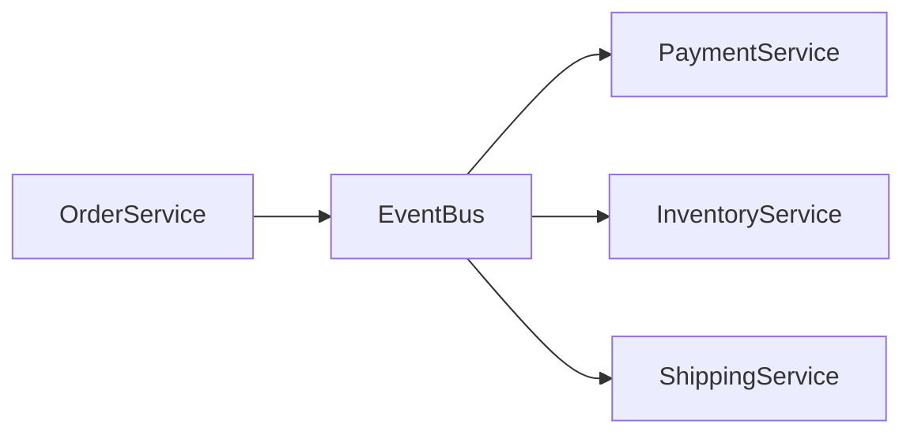

---

# Real-World Messaging Platforms

Many large-scale platforms implement distributed messaging.

| Platform      | Use Case                        |
| ------------- | ------------------------------- |
| Apache Kafka  | High-throughput event streaming |
| RabbitMQ      | Traditional message broker      |
| Amazon SQS    | Managed queue service           |
| Apache Pulsar | Multi-tenant messaging system   |

These platforms power massive distributed systems worldwide.

---

# Design Considerations

When designing a messaging system, consider:

| Factor      | Impact                |
| ----------- | --------------------- |
| Throughput  | Messages per second   |
| Latency     | Message delivery time |
| Durability  | Message persistence   |
| Ordering    | Message sequencing    |
| Scalability | Horizontal scaling    |

---

# Summary

A **Distributed Messaging Queue** enables asynchronous communication between services in distributed systems.

Key benefits include:

```
Loose coupling
Improved scalability
Fault tolerance
Asynchronous processing
```

By introducing an intermediary message broker, services no longer depend on direct synchronous communication.

Instead, they exchange messages through reliable queues or topics.

This architecture forms the backbone of modern distributed systems and event-driven platforms.

---

# Final Mental Model

Imagine a **postal system**.

```
Sender writes a letter
Postal office stores letters
Delivery workers distribute them
Recipients read them later
```

In distributed systems:

```
Producer → sends message
Broker → stores message
Consumer → processes message
```

A distributed messaging queue acts as the **postal system of microservices**, enabling reliable communication across complex distributed architectures.