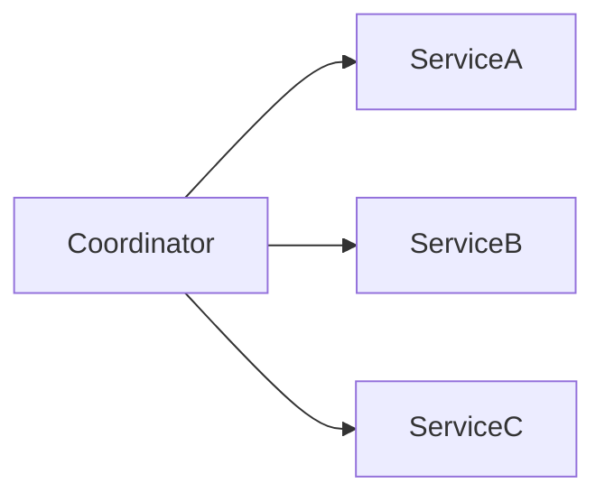
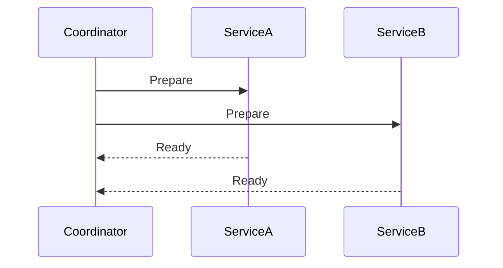
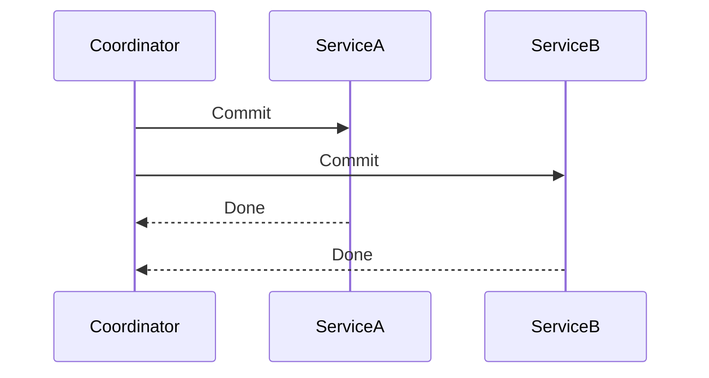
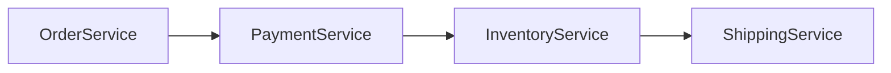
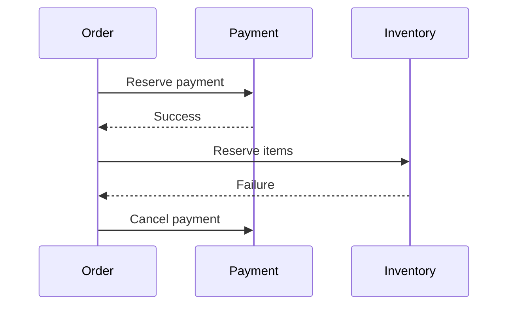
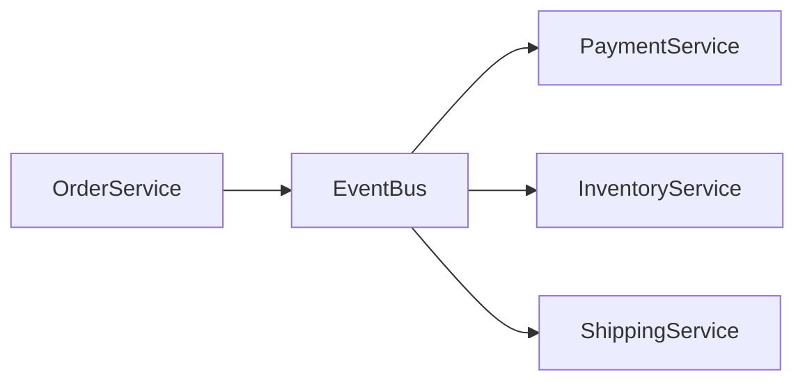
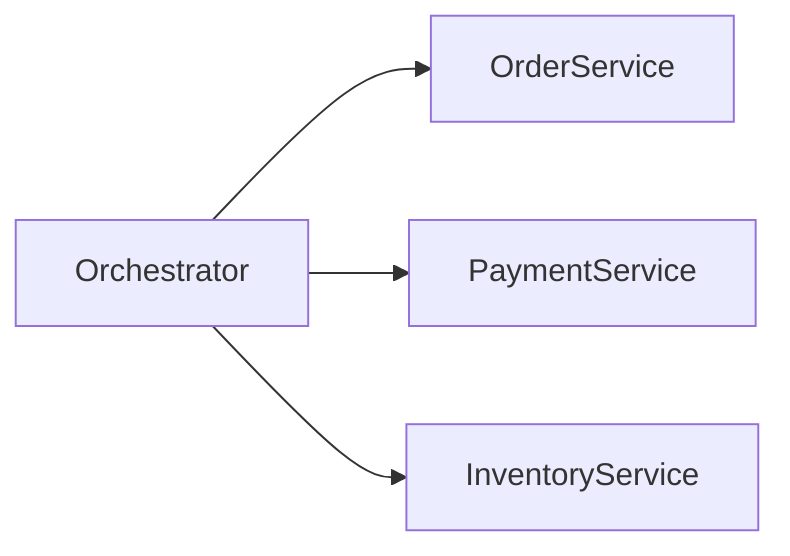
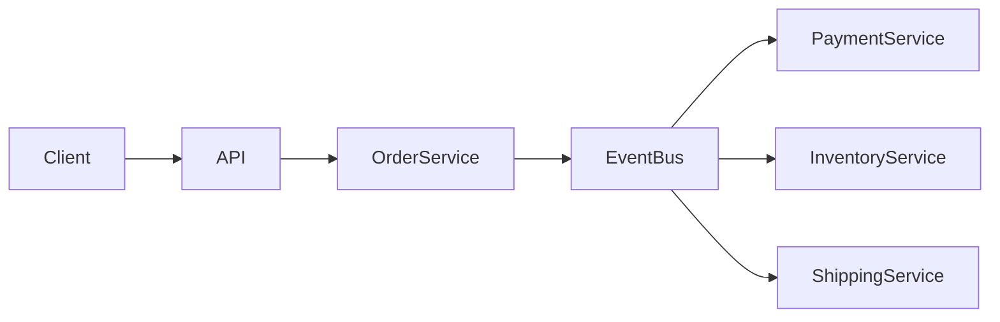

# Distributed Transactions

In traditional applications, a **single database transaction** guarantees consistency.

Example:

```

Transfer money from Account A to Account B

```

This operation requires two updates:

```

Debit Account A
Credit Account B

```

In a single database system, this can be done safely using **ACID transactions**:

```

BEGIN TRANSACTION
UPDATE accountA
UPDATE accountB
COMMIT

```

If anything fails:

```

ROLLBACK

```

Everything stays consistent.

---

# The Problem in Distributed Systems

Modern architectures often split functionality across **multiple services and databases**.

Example services in a banking system:

```

Account Service
Payment Service
Ledger Service
Notification Service

```

Each service owns its own database.

Now a simple transaction becomes **distributed**.

---

# Example Scenario

Consider a **payment processing system**.

Steps:

```

1 Deduct balance from user account
2 Create payment record
3 Update ledger
4 Send notification

````

These operations may involve **multiple services**.

---

# Architecture Example

```mermaid
flowchart LR
Client --> PaymentService
PaymentService --> AccountService
PaymentService --> LedgerService
PaymentService --> NotificationService
````

Each service performs its own database operations.

---

# The Consistency Challenge

Suppose this flow occurs:

```
1 Account balance deducted
2 Payment record created
3 Ledger update fails
```

Now the system becomes inconsistent.

Example state:

| Component       | State            |
| --------------- | ---------------- |
| Account Service | Money deducted   |
| Payment Service | Payment recorded |
| Ledger Service  | No entry         |

This is called a **partial transaction failure**.

---

# What Is a Distributed Transaction

A distributed transaction ensures:

> Multiple independent systems either **all succeed or all fail together**.

Properties:

| Property    | Meaning                                |
| ----------- | -------------------------------------- |
| Atomicity   | All or nothing                         |
| Consistency | Data remains valid                     |
| Isolation   | Concurrent transactions don't conflict |
| Durability  | Changes persist                        |

Maintaining these guarantees across distributed services is extremely challenging.

---

# Why Distributed Transactions Are Hard

Distributed systems introduce several problems.

| Problem          | Description                               |
| ---------------- | ----------------------------------------- |
| Network failures | Services may become unreachable           |
| Partial success  | Some operations succeed while others fail |
| Latency          | Coordination across services is slow      |
| Service crashes  | Nodes may crash during execution          |

Because of this, traditional database transactions don't easily extend across systems.

---

# Approaches to Distributed Transactions

Several patterns exist to manage distributed transactions.

| Approach                  | Type                  |
| ------------------------- | --------------------- |
| Two Phase Commit (2PC)    | Strong consistency    |
| Three Phase Commit        | Improved coordination |
| Saga Pattern              | Eventual consistency  |
| Compensation Transactions | Failure recovery      |

---

# Two-Phase Commit (2PC)

Two-Phase Commit is a protocol used to coordinate transactions across multiple systems.

It consists of two phases:

```
1 Prepare phase
2 Commit phase
```

---

# Architecture of 2PC



A **transaction coordinator** manages the process.

---

# Phase 1: Prepare Phase

The coordinator asks all participants:

```
Can you commit this transaction?
```

Each participant prepares but does not commit.

---



If all participants respond **ready**, the transaction proceeds.

---

# Phase 2: Commit Phase

Now the coordinator instructs all participants to commit.



If any participant fails during prepare, the coordinator issues:

```
ROLLBACK
```

---

# Advantages of 2PC

| Advantage               | Explanation                 |
| ----------------------- | --------------------------- |
| Strong consistency      | Ensures atomic transactions |
| Deterministic outcome   | Either all commit or none   |
| Simple conceptual model | Clear coordination          |

---

# Problems with 2PC

2PC introduces several issues in distributed systems.

| Issue                | Explanation                       |
| -------------------- | --------------------------------- |
| Blocking protocol    | Participants wait for coordinator |
| Coordinator failure  | System may become stuck           |
| Performance overhead | Multiple network round trips      |
| Reduced scalability  | Tight coupling between services   |

Because of these limitations, many modern architectures avoid 2PC.

---

# Saga Pattern

The **Saga pattern** is a more scalable alternative.

Instead of one large transaction, the system executes **a sequence of local transactions**.

If something fails, previously completed steps are **compensated**.

---

# Example Saga Flow

Steps:

```
1 Reserve funds
2 Create order
3 Reserve inventory
4 Confirm payment
```

If step 3 fails:

```
Undo step 2
Undo step 1
```

---

# Saga Architecture



Each service performs a local transaction.

---

# Saga Execution Flow



The system restores consistency using **compensating actions**.

---

# Types of Saga Implementations

There are two common Saga styles.

| Type          | Description                            |
| ------------- | -------------------------------------- |
| Choreography  | Services communicate via events        |
| Orchestration | Central orchestrator controls workflow |

---

# Choreography-Based Saga

Services publish events and react to events from other services.



Advantages:

* Decentralized
* Highly scalable

Drawbacks:

* Hard to debug
* Complex event chains

---

# Orchestration-Based Saga

A central service controls the workflow.



Advantages:

* Clear control flow
* Easier monitoring

Drawbacks:

* Central dependency

---

# Compensation Transactions

When failures occur, systems must reverse previous actions.

Examples:

| Operation         | Compensation      |
| ----------------- | ----------------- |
| Debit account     | Credit account    |
| Reserve inventory | Release inventory |
| Create order      | Cancel order      |

Compensation restores system consistency.

---

# Example: E-commerce Order Transaction

Operations:

```
1 Create order
2 Charge payment
3 Reserve inventory
4 Schedule shipment
```

Failure scenario:

```
Shipment fails
```

Compensations:

```
Cancel inventory
Refund payment
Cancel order
```

---

# Eventual Consistency

Most distributed transaction systems rely on **eventual consistency**.

Meaning:

```
System may be temporarily inconsistent
But eventually becomes consistent
```

Example:

```
Order created
Payment processed a few seconds later
Inventory updated afterward
```

---

# Designing Reliable Distributed Transactions

Important principles:

| Principle             | Purpose                   |
| --------------------- | ------------------------- |
| Idempotent operations | Safe retries              |
| Retry mechanisms      | Handle transient failures |
| Message queues        | Reliable communication    |
| Timeouts              | Avoid blocking systems    |
| Monitoring            | Detect failures quickly   |

---

# Real System Architecture

Large-scale systems often combine several patterns.



Event-driven architectures reduce tight coupling.

---

# Summary

Distributed transactions coordinate **multiple independent services** to maintain data consistency.

Challenges arise due to:

* Network failures
* Service crashes
* Partial successes

Traditional approaches like **Two-Phase Commit** provide strong consistency but limit scalability.

Modern distributed systems often prefer **Saga-based architectures**, which rely on:

* Local transactions
* Event-driven communication
* Compensation mechanisms

These approaches allow systems to remain **scalable, resilient, and loosely coupled** while still achieving consistent outcomes.

---

# Final Mental Model

Think of a distributed transaction like organizing a **group trip**.

Everyone must:

```
Book flights
Reserve hotels
Confirm transport
```

If one step fails:

```
Cancel previous bookings
Refund payments
```

Distributed transaction patterns ensure the entire process **either succeeds fully or safely rolls back**, keeping the system consistent even in the presence of failures.