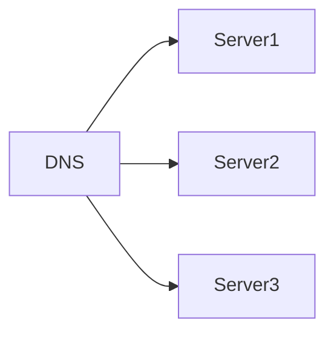
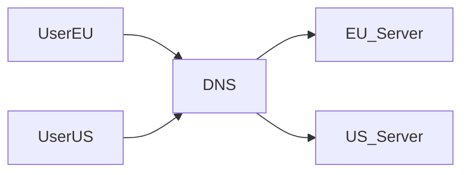
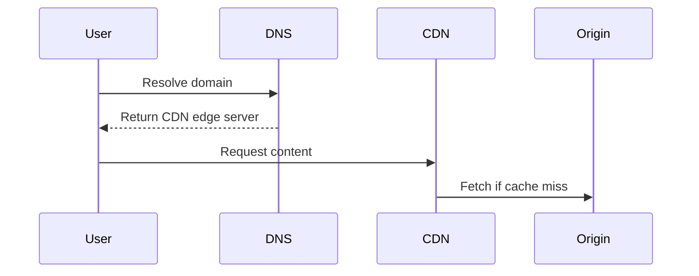
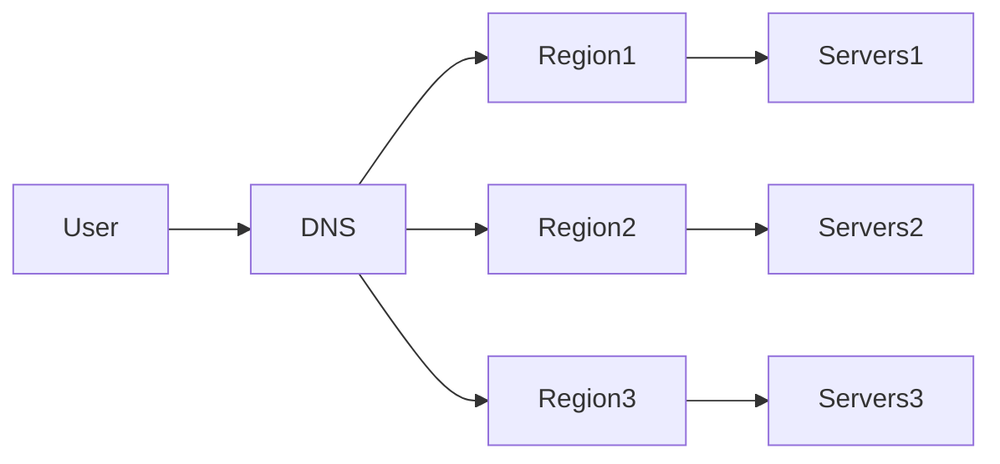
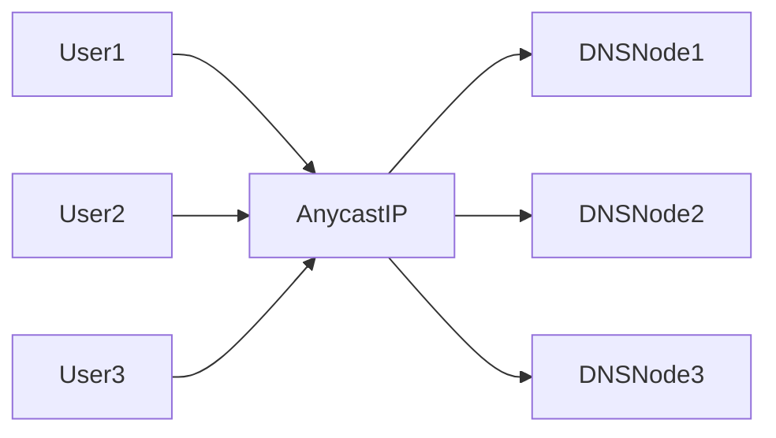

# Domain Name System (DNS)

When you type a website address like:

```

[www.example.com](http://www.example.com)

```

Your computer cannot directly understand this name.

Computers communicate using **IP addresses**, such as:

```

142.250.183.206

```

The system responsible for translating **human-readable domain names into IP addresses** is called the **Domain Name System (DNS)**.

> DNS acts like the **phonebook of the internet**, mapping domain names to IP addresses.

Without DNS, users would need to remember numeric IP addresses for every website.

---

# Why DNS Exists

Humans prefer readable names:

```

google.com
amazon.com
github.com

```

But networks operate using IP addresses:

```

142.250.183.206
54.239.28.85
140.82.121.4

```

DNS provides a **mapping system** between these two worlds.

---

# Real-World Analogy

Imagine you want to call a friend.

You search their **name** in your contacts:

```

"John"

```

But the phone actually dials a **number**:

```

+1 555-876-1234

```

DNS works exactly like that:

```

Domain name → IP address

````

---

# Basic DNS Resolution Flow

When a user enters a domain in a browser, several steps occur.

```mermaid
sequenceDiagram
participant User
participant Browser
participant Resolver
participant DNSRoot
participant TLD
participant Authoritative

User->>Browser: Enter www.example.com
Browser->>Resolver: Query domain
Resolver->>DNSRoot: Ask root server
DNSRoot-->>Resolver: Refer TLD server
Resolver->>TLD: Ask for example.com
TLD-->>Resolver: Refer authoritative server
Resolver->>Authoritative: Ask for IP
Authoritative-->>Resolver: Return IP
Resolver-->>Browser: Return IP
Browser->>Server: HTTP Request
````

---

# Key Components of DNS

The DNS system is composed of several hierarchical components.

| Component             | Role                        |
| --------------------- | --------------------------- |
| DNS Resolver          | Client-side DNS lookup      |
| Root Servers          | Top-level DNS servers       |
| TLD Servers           | Handle top-level domains    |
| Authoritative Servers | Store actual domain records |

---

# DNS Hierarchy

DNS follows a **hierarchical distributed architecture**.

```mermaid
flowchart TD
Root[Root DNS Servers]
Root --> TLD1[.com TLD]
Root --> TLD2[.org TLD]
Root --> TLD3[.net TLD]

TLD1 --> Auth1[example.com]
TLD1 --> Auth2[google.com]

Auth1 --> Record1[IP Records]
Auth2 --> Record2[IP Records]
```

Each layer knows where to find the next layer.

---

# Step-by-Step DNS Resolution

Let's walk through what happens when a user visits:

```
www.example.com
```

---

## Step 1: Browser Cache Check

Browsers store recent DNS queries.

Example:

```
Browser DNS Cache
```

If entry exists:

```
Return IP immediately
```

---

## Step 2: OS DNS Cache

Operating systems also maintain DNS cache.

Example:

```
macOS
Windows
Linux
```

Command examples:

```
ipconfig /displaydns
```

or

```
scutil --dns
```

---

## Step 3: Recursive Resolver

If no cache exists, the request goes to a **DNS resolver**, usually provided by the ISP.

Examples:

* Public resolvers
* Corporate resolvers
* CDN DNS resolvers

Examples include services from organizations like Google or Cloudflare.

---

## Step 4: Root DNS Server

Root servers are the **starting point of DNS resolution**.

They don't know the exact IP but know **which TLD server to ask**.

Example:

```
Where is .com?
```

---

## Step 5: TLD Server

The TLD server handles domains like:

```
.com
.org
.net
.io
```

It responds with the **authoritative DNS server** for the domain.

---

## Step 6: Authoritative DNS Server

The authoritative server stores the actual DNS records.

Example response:

```
www.example.com → 93.184.216.34
```

Now the resolver returns this IP to the client.

---

# DNS Record Types

DNS stores different types of records.

| Record | Purpose               |
| ------ | --------------------- |
| A      | Domain → IPv4 address |
| AAAA   | Domain → IPv6 address |
| CNAME  | Domain alias          |
| MX     | Mail server record    |
| TXT    | Arbitrary metadata    |
| NS     | Name server record    |

---

# Example DNS Records

| Type  | Name                                      | Value             |
| ----- | ----------------------------------------- | ----------------- |
| A     | example.com                               | 93.184.216.34     |
| CNAME | [www.example.com](http://www.example.com) | example.com       |
| MX    | example.com                               | mail.example.com  |
| TXT   | example.com                               | verification data |

---

# CNAME Example

CNAME creates an alias.

```
www.example.com → example.com
```

Flow:


This is common in **CDN setups**.

---

# DNS Caching

DNS uses aggressive caching to reduce lookup latency.

Each record has a **TTL (Time To Live)**.

Example:

```
TTL = 3600 seconds
```

Meaning:

```
Cache result for 1 hour
```

---

## DNS Caching Layers


Caching dramatically reduces DNS traffic.

---

# DNS Load Distribution

DNS can distribute traffic across multiple servers.

Example:

```
example.com → multiple IPs
```

---

## Round Robin DNS



Each query returns a different IP.

Advantages:

* Simple load balancing
* Easy setup

Limitations:

* No health checks
* No latency awareness

---

# Geo DNS

Geo DNS routes users to the **nearest server**.

Example:

```
User in Europe → EU server
User in Asia → Asia server
```

Architecture:



This reduces **latency significantly**.

---

# DNS and Content Delivery Networks

CDNs heavily rely on DNS.

Example flow:



Users connect to the **closest edge node**.

---

# DNS in Large Scale Systems

Large companies use DNS for:

* Traffic routing
* Failover
* Global load balancing
* Service discovery

Example architecture:



---

# DNS Failover

If a server fails, DNS can redirect traffic.

Example:

```
Primary server down
```

DNS response changes:

```
Return backup server
```

---

# DNS Propagation

When DNS records change, updates take time to spread.

This is called:

```
DNS propagation
```

Reasons:

* Caching
* TTL expiration
* Resolver refresh

Typical time:

```
minutes to hours
```

---

# DNS Security Issues

DNS is vulnerable to attacks.

Common threats include:

| Attack          | Description              |
| --------------- | ------------------------ |
| DNS Spoofing    | Fake responses injected  |
| Cache Poisoning | Corrupt cached records   |
| DDoS attacks    | Overwhelming DNS servers |

---

# DNSSEC

DNS Security Extensions add **cryptographic verification**.

Goal:

```
Ensure DNS responses are authentic.
```

Architecture:


Records are **digitally signed**.

---

# Why DNS is Highly Scalable

DNS is designed to scale globally.

Key design principles:

| Principle                 | Reason                   |
| ------------------------- | ------------------------ |
| Hierarchical architecture | Distributed load         |
| Caching                   | Reduces queries          |
| Replication               | Improves availability    |
| Anycast routing           | Nearest server selection |

---

# Anycast DNS

Anycast allows multiple servers to share the same IP.

Traffic automatically routes to the **closest node**.



Used by large DNS providers.

---

# Summary

The Domain Name System is a **core infrastructure of the internet**.

It provides:

* Human-friendly domain names
* Scalable global resolution
* Distributed architecture
* High availability
* Efficient caching

DNS operates through a **hierarchical lookup system** involving:

* Root servers
* TLD servers
* Authoritative servers
* Recursive resolvers

Together, these components allow users anywhere in the world to access services using simple domain names.

---

# Final Mental Model

Think of DNS as the **navigation system of the internet**.

Instead of remembering:

```
142.250.183.206
```

Users simply type:

```
google.com
```

DNS translates that name into the correct server location, enabling billions of devices to communicate seamlessly across the global network.