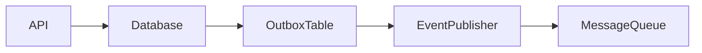
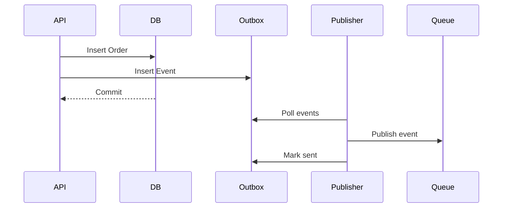
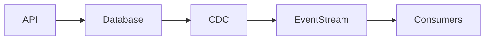
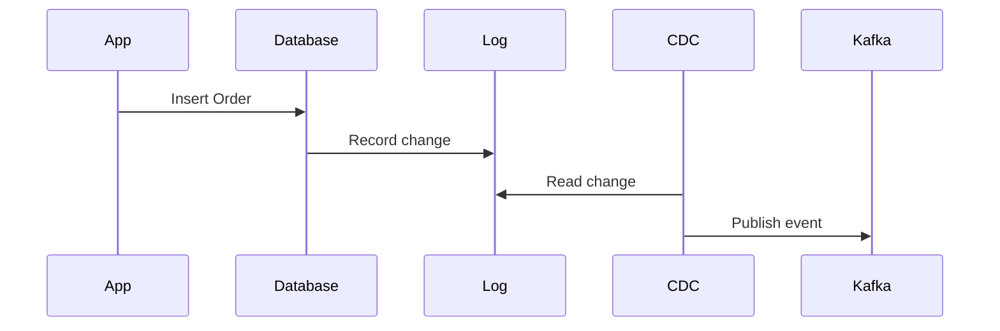
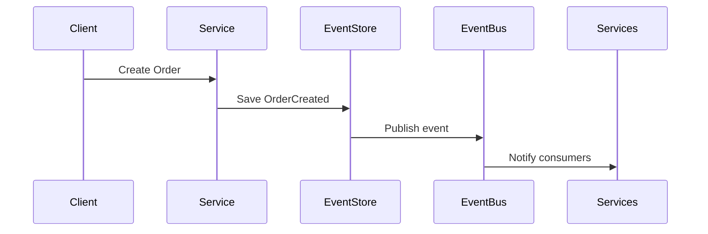
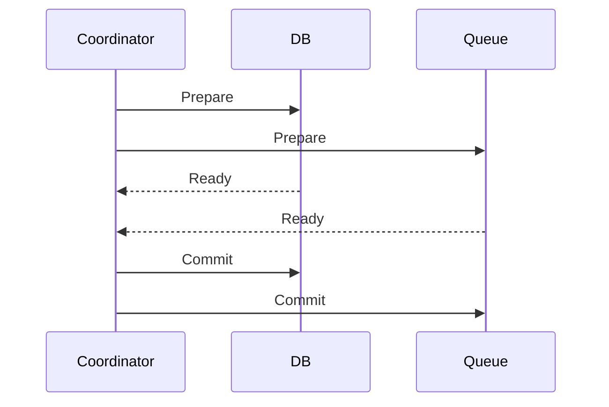
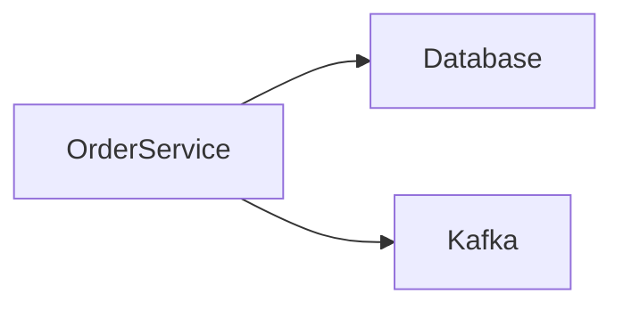
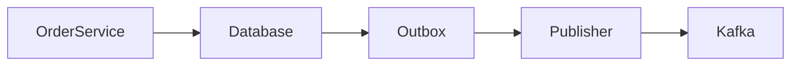

# Dual Write Problem

Modern distributed systems often need to **write the same data to multiple systems**.

Examples:

- Writing to a **database and a cache**
- Writing to a **database and a message queue**
- Writing to **two microservices**
- Writing to a **database and search index**

At first glance this seems simple:

```

Write to system A
Write to system B

```

But this creates a major reliability issue known as the **Dual Write Problem**.

> The Dual Write Problem occurs when a system must write to two independent systems, and one write succeeds while the other fails.

This leads to **data inconsistency across systems**.

---

# Real-World Example

Imagine a **food delivery platform**.

When a user places an order, the system must:

1. Store order in **database**
2. Publish event to **message queue**

Example flow:

```

Save order → Publish event

````

If something goes wrong between these steps, the system becomes inconsistent.

---

# Basic Architecture

```mermaid
flowchart LR
Client --> API
API --> Database
API --> MessageQueue
````

Two independent writes:

* Database write
* Message queue publish

---

# The Failure Scenario

Consider the following sequence.

```mermaid
sequenceDiagram
participant Client
participant API
participant DB
participant Queue

Client->>API: Place Order
API->>DB: Save Order
DB-->>API: Success
API->>Queue: Publish Event
Queue-->>API: FAILURE
```

Result:

```
Order exists in database
But no event was published
```

Other services never learn about the order.

---

# Why This Is Dangerous

Distributed systems rely on **event propagation**.

If events are lost:

| Component             | Effect            |
| --------------------- | ----------------- |
| Inventory service     | Stock not reduced |
| Notification service  | User not notified |
| Analytics pipeline    | Order missing     |
| Recommendation system | Behavior lost     |

Now the system becomes **inconsistent**.

---

# Another Scenario: Cache Update

Many systems write to both:

```
Database
Cache
```

Flow:

```
Update database
Update cache
```

If cache write fails:

```
Database = new value
Cache = old value
```

Now users read **stale data**.

---

# Root Cause of Dual Writes

The core problem is:

> There is **no atomic transaction across two independent systems**.

Typical distributed components:

* Database
* Kafka
* Redis
* Search index
* Microservices

Each system has its own **failure modes and guarantees**.

---

# Why Traditional Transactions Don't Work

Traditional databases support **ACID transactions**.

Example:

```
BEGIN
UPDATE accounts
UPDATE orders
COMMIT
```

But ACID transactions usually work **only inside a single database**.

They don't extend across:

```
Database + Message Queue
Database + Cache
Database + External Service
```

Thus the dual write problem appears.

---

# Solutions to the Dual Write Problem

Several architectural patterns solve this.

| Pattern                  | Purpose                       |
| ------------------------ | ----------------------------- |
| Transactional Outbox     | Reliable event publishing     |
| Change Data Capture      | Stream DB changes             |
| Event Sourcing           | Use events as source of truth |
| Distributed Transactions | Global coordination           |

Let's explore them.

---

# Solution 1: Transactional Outbox Pattern

This is the **most common solution**.

Instead of publishing events directly to the queue, we store them in the database.

---

## Architecture



Steps:

1 Save business data
2 Save event in **outbox table**
3 Commit transaction
4 Background worker publishes events

---

# Step-by-Step Flow



Now both writes are part of **one transaction**.

---

# Outbox Table Example

| id | event_type   | payload   | status  |
| -- | ------------ | --------- | ------- |
| 1  | OrderCreated | JSON data | pending |
| 2  | OrderCreated | JSON data | sent    |

Publisher service reads **pending events**.

---

# Advantages

| Advantage                  | Explanation                |
| -------------------------- | -------------------------- |
| Atomic write               | DB + event stored together |
| Reliable delivery          | Events retried             |
| No distributed transaction | Simpler architecture       |

---

# Drawbacks

| Issue            | Explanation                |
| ---------------- | -------------------------- |
| Additional table | Outbox storage needed      |
| Polling overhead | Background worker required |
| Slight delay     | Event not immediate        |

---

# Solution 2: Change Data Capture (CDC)

CDC streams database changes to other systems.

Instead of writing to two systems, we write **only to the database**.

Then changes are captured automatically.

---

## Architecture



Example tools:

* Debezium
* Database replication logs
* Streaming connectors

---

# How CDC Works

Most databases maintain **transaction logs**.

Example:

```
Write-Ahead Log (WAL)
Binlog
Redo logs
```

CDC tools read these logs and publish events.

---



---

# Advantages

| Advantage              | Explanation          |
| ---------------------- | -------------------- |
| Single source of truth | Only database write  |
| Reliable streaming     | Reads committed logs |
| No application changes | Transparent          |

---

# Drawbacks

| Issue                     | Explanation        |
| ------------------------- | ------------------ |
| Infrastructure complexity | Requires CDC tools |
| Event delay               | Slight latency     |
| Operational overhead      | Managing pipelines |

---

# Solution 3: Event Sourcing

Instead of storing **current state**, systems store **events as the source of truth**.

Example events:

```
OrderCreated
PaymentProcessed
OrderShipped
```

State is derived by replaying events.

---

## Architecture


---

# Example Flow



Now:

```
Single write = event store
```

Everything else derives from events.

---

# Advantages

| Advantage             | Explanation           |
| --------------------- | --------------------- |
| No dual writes        | Events are primary    |
| Perfect audit history | Every change recorded |
| Easy replay           | Rebuild system state  |

---

# Drawbacks

| Issue                   | Explanation                 |
| ----------------------- | --------------------------- |
| Complex architecture    | Harder to implement         |
| Event schema management | Must maintain compatibility |
| Learning curve          | Non-traditional model       |

---

# Solution 4: Distributed Transactions (Two-Phase Commit)

Another approach is **coordinating multiple systems in one transaction**.

Protocol:

```
Two Phase Commit (2PC)
```

Steps:

1 Prepare phase
2 Commit phase

---



---

# Why 2PC Is Rarely Used

| Problem  | Explanation                       |
| -------- | --------------------------------- |
| Slow     | Requires multiple round trips     |
| Blocking | Systems wait on coordinator       |
| Fragile  | Coordinator failure causes issues |

Most large-scale systems avoid it.

---

# Example: E-commerce Order System

Without solution:



Risk:

```
DB success
Kafka failure
```

With Transactional Outbox:



Now system is safe.

---

# Idempotency with Dual Writes

Even with solutions, systems must handle **duplicate events**.

Consumers should be **idempotent**.

Example:

```
OrderCreated event processed twice
```

Consumer checks:

```
if order already processed → ignore
```

This ensures safe retries.

---

# Detecting Inconsistency

Sometimes systems detect dual write failures later.

Techniques include:

* Reconciliation jobs
* Periodic audits
* Event replays
* Data repair pipelines

---

# Summary

The Dual Write Problem is a **core challenge in distributed system design**.

It occurs when a system must update **two independent systems**, and failures occur between writes.

Key risks:

* Lost events
* Stale caches
* Inconsistent data
* Broken workflows

Common solutions include:

* Transactional Outbox
* Change Data Capture
* Event Sourcing
* Distributed transactions

Among these, **Transactional Outbox + Event Streaming** is one of the most widely used patterns in modern architectures.

---

# Final Mental Model

Think of dual writes like **sending the same letter through two postal services**.

```
Letter sent via Post A
Letter sent via Post B
```

If one fails:

```
Recipient receives only half the message.
```

Reliable architectures ensure **the message is stored safely first**, then delivered reliably afterward.
