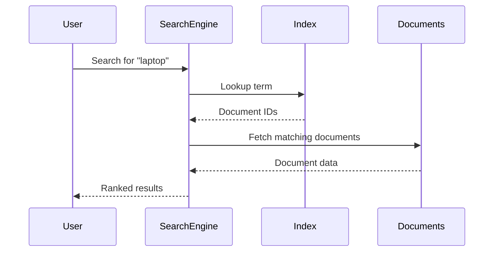
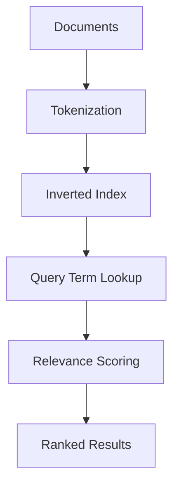

# The Secret to Super-Fast Search: Understanding the Inverted Index

Search is one of the most important features in modern software.

Users expect to type a word and get results instantly.

But behind that simple experience is a very different data structure from the one used in normal databases.

That structure is called the **inverted index**.

It is the core reason search engines like **Elasticsearch** can search millions of documents extremely fast.

---

# 1. Introduction: The Billion-Product Problem

Imagine an e-commerce company that starts with 5,000 products.

A developer writes a simple database search query:

```sql
SELECT * FROM products
WHERE name LIKE '%laptop%'
   OR description LIKE '%laptop%';
````

At first, this works fine.

But then the company grows.

Now there are:

* 500,000 products
* 5 million reviews
* millions of search requests
* users expecting instant results

The same query that once returned in milliseconds now becomes painfully slow.

---

## Why this becomes a problem

As data grows, a database search using `LIKE '%term%'` may need to inspect many rows one by one.

That is like scanning every book in a giant library whenever someone asks a question.

This becomes a problem because users expect search to be:

| Requirement       | Meaning                                     |
| ----------------- | ------------------------------------------- |
| Fast              | Results should appear instantly             |
| Relevant          | Best results should appear first            |
| Tolerant of typos | Users make mistakes                         |
| Scalable          | Search should still work well at large size |

Traditional database scans are too slow and too naive for this job.

That is where search engines come in.

---

# 2. The Traditional Method: The Librarian Who Reads Every Book

A normal database search is like asking a librarian to find every book about machine learning.

If the librarian must inspect every book on every shelf one by one, the process becomes very slow.

That is what a **full table scan** feels like in a database.

---

## What a full table scan means

A full table scan means the database checks each row until it finds matches.

For small datasets, this may be acceptable.

For large datasets, it becomes very expensive.

---

## Problems with this approach

| Problem            | Why it hurts                         |
| ------------------ | ------------------------------------ |
| Slow               | More rows means more work            |
| Expensive          | Uses more CPU and I/O                |
| Poor relevance     | Results are not ranked intelligently |
| Weak typo handling | It cannot understand intent well     |
| Hard to scale      | Performance drops as data grows      |

---

## Analogy

Imagine searching for one phrase in an entire library by opening every book and reading every page.

Even if the answer exists, the search is too slow to be practical.

That is why a different approach was invented.

---

# 3. The Revolutionary Idea: The Inverted Index

The breakthrough idea was simple but powerful:

**Instead of scanning documents for words, build a map from words back to documents.**

That map is called an **inverted index**.

---

## What is an inverted index?

A normal index answers:

* “Where is this topic in the book?”

An inverted index answers:

* “Which documents contain this word?”

It flips the relationship.

That is why it is called **inverted**.

---

## Normal index vs inverted index

| Index Type     | Direction        |
| -------------- | ---------------- |
| Normal index   | Document → terms |
| Inverted index | Term → documents |

---

## Analogy

Think of the index at the back of a textbook.

If you want to find “sorting,” you do not read the whole book.

You look at the index and see which pages mention sorting.

That is exactly how an inverted index works.

---

# 4. How an Inverted Index Works

Let us say we have a few documents.

| Document ID | Content                          |
| ----------- | -------------------------------- |
| 1           | Introduction to machine learning |
| 2           | The machine age                  |
| 3           | Coffee machine manual            |
| 4           | Deep learning fundamentals       |

A search engine breaks documents into words and builds a structure like this:

| Term     | Documents |
| -------- | --------- |
| machine  | 1, 2, 3   |
| learning | 1, 4      |
| coffee   | 3         |
| deep     | 4         |

Now, when a user searches for “machine,” the engine does not scan every document.

It goes directly to the `machine` entry and gets the matching documents immediately.

---

## Why this is fast

Because the search engine is looking up a word in an index rather than searching every document linearly.

That reduces work dramatically.

---

# 5. Why Elasticsearch Is So Fast

Elasticsearch is built on top of **Apache Lucene**, which uses inverted indexes internally.

That is why it can handle:

* huge volumes of data
* fast lookups
* ranking
* typo tolerance
* phrase search
* filtering
* partial matching

---

## What Lucene does

Lucene is the search engine library that powers the indexing model.

Elasticsearch builds a higher-level distributed search system on top of it.

### Analogy

* Lucene = the engine inside the car
* Elasticsearch = the full car system built around that engine

---

# 6. Why Search Engines Beat Traditional Databases

A traditional database is excellent for:

* transactions
* inserts
* updates
* relationships
* consistency

But search engines are optimized for:

* full-text search
* ranking
* fuzzy matching
* relevance scoring

They are designed for different problems.

---

## Database search vs search engine search

| Feature              | Traditional Database | Search Engine |
| -------------------- | -------------------- | ------------- |
| Exact lookup         | Very good            | Good          |
| Full-text search     | Limited              | Excellent     |
| Ranking by relevance | Weak                 | Strong        |
| Typo tolerance       | Poor                 | Good          |
| Large-scale search   | Slower               | Fast          |

---

## The key lesson

A database is not always the right tool for search.

If search is a core feature of your app, a search engine can be dramatically better.

---

# 7. The Benefits of the Inverted Index

The inverted index solves two major problems:

1. **speed**
2. **relevance**

---

## 7.1 Blazing speed

Instead of scanning all documents, the engine looks up the search term directly.

That gives near-instant results even for massive datasets.

### Analogy

Searching a textbook by index is much faster than reading the whole book.

---

## 7.2 Intelligent relevance

The inverted index stores more than just “term exists.”

It can also store useful metadata:

* how often the term appears
* where it appears
* how rare the term is
* which field it appears in

This helps the engine rank results intelligently.

---

# 8. What Makes a Result Relevant?

Search relevance is not random.

The engine tries to guess which result best matches the user’s intent.

Several signals are used.

---

## 8.1 Term frequency

Term frequency means how often a term appears in a single document.

If a term appears many times in one document, that document may be more relevant.

### Example

| Document | Number of times “machine” appears |
| -------- | --------------------------------- |
| A        | 2                                 |
| B        | 17                                |

Document B may be more relevant if the term is central to the content.

---

## 8.2 Document frequency

Document frequency means how common a term is across all documents.

A common word like “the” is less useful than a rare word like “machine learning optimization.”

### Why this matters

If a term appears everywhere, it does not help distinguish documents very well.

---

## 8.3 Document length

A term appearing in a short document may matter more than the same term appearing once in a very long document.

### Analogy

If a short note mentions “urgent” once, that is probably more important than the word appearing once in a huge report.

---

## 8.4 Field boosting

Not all parts of a document are equally important.

A word in a title is often more important than the same word deep in the body text.

### Example

| Field    | Importance |
| -------- | ---------- |
| title    | High       |
| subtitle | Medium     |
| body     | Lower      |
| tags     | High       |

If a query matches the title, the result may be boosted higher.

---

# 9. Relevance in Practice

Suppose a user searches for “laptop.”

The search engine may return:

1. MacBook Pro
2. Laptop for students
3. Laptop bag
4. A blog post mentioning laptops

Even though all contain the word, the top result should be the one most likely to satisfy the user.

That is relevance ranking.

---

## Why relevance is hard

The engine must understand that:

* “laptop” in a product title is important
* “laptop” in a single random review is weaker
* “laptop bag” is related but not the same
* “gaming laptop” may be more specific

A database scan can find matches.

A search engine can rank them intelligently.

---

# 10. Performance Showdown

The difference between database scanning and inverted index lookup becomes dramatic as data grows.

| Search Term | Traditional Database | Elasticsearch |
| ----------- | -------------------- | ------------- |
| laptop      | ~3 seconds           | ~1 second     |
| only        | ~7.5 seconds         | ~500 ms       |

The exact numbers vary by system and dataset, but the pattern is consistent:

**inverted index search is much faster**

---

## Why common terms matter

Searching for a very common word like “only” can be expensive for a database scan because it appears in many rows.

A search engine handles this better because it was built for exactly this kind of workload.

---

# 11. Search Flow with an Inverted Index



---

# 12. From Scan to Index: The Big Shift

The traditional model asks:

* “Which documents contain this word?”

The inverted index model asks:

* “For this word, which documents should I return?”

That shift changes everything.

---

## Why this is a breakthrough

| Old approach          | New approach      |
| --------------------- | ----------------- |
| Search every document | Search the index  |
| Linear work           | Fast lookup       |
| Poor ranking          | Relevance scoring |
| Weak scale            | Strong scale      |

---

# 13. How Search Engines Build the Index

Before search can be fast, documents need to be indexed.

That means the engine:

1. reads each document
2. breaks text into tokens
3. normalizes words
4. stores term-to-document relationships
5. saves metadata for ranking

---

## Tokenization

Tokenization means splitting text into meaningful units.

Example:

```text
"Introduction to machine learning"
```

may become:

* introduction
* to
* machine
* learning

---

## Normalization

Normalization may involve:

* lowercasing
* removing punctuation
* stemming
* stemming-like transformations
* language-specific cleanup

### Example

“Laptops” and “laptop” may be treated as related terms.

---

# 14. Why Search Needs More Than a Database

A relational database is great at structured queries like:

* users by ID
* orders by status
* products by category
* payments by account

But search is different.

Search often needs:

* partial matches
* word similarity
* ranking
* typo tolerance
* fuzzy retrieval
* phrase matching
* relevance tuning

That is why search engines exist as a separate category of tool.

---

# 15. Typo Tolerance

One of the biggest advantages of modern search is typo handling.

If a user types:

* `laprop`
* `iphnoe`
* `machin lerning`

the search engine can still suggest likely matches.

That is much harder to do well in a plain database scan.

---

## Why typo tolerance matters

Users make mistakes constantly.

A good search system should:

* forgive small typing errors
* still return useful results
* avoid making the user start over

### Analogy

A helpful librarian understands you meant “laptop” even if you said “laprop.”

---

# 16. Search Engines and User Experience

Search is not just about retrieving data.

It is about helping users find the right thing quickly.

A strong search experience:

* feels instant
* understands intent
* handles errors
* prioritizes good results
* scales with content growth

That is why search quality is often one of the most visible parts of an application.

---

# 17. When to Use a Search Engine

A search engine is a good choice when you need:

| Need                  | Reason                                   |
| --------------------- | ---------------------------------------- |
| Large text search     | Databases become too slow                |
| Ranking               | Search engine provides relevance scoring |
| Typo tolerance        | Search engines can handle fuzzy matching |
| Fast lookups at scale | Index lookup is efficient                |
| Multi-field search    | Titles, descriptions, tags, comments     |

---

## Good examples

* e-commerce product search
* blog/article search
* document search
* knowledge base search
* job listing search
* log search

---

# 18. When a Database Is Enough

A normal database may still be enough if you only need:

* exact matches
* small datasets
* simple filters
* primary key lookups
* basic admin search

If search is not a core feature, a database may be sufficient.

---

# 19. Common Beginner Mistakes

| Mistake                                        | Why it is bad                                  |
| ---------------------------------------------- | ---------------------------------------------- |
| Using `LIKE '%term%'` for everything           | Becomes slow at scale                          |
| Expecting DB search to rank well               | Databases are not search engines               |
| Ignoring relevance                             | Results may be technically correct but useless |
| Not planning for typos                         | Bad user experience                            |
| Indexing too little or too much                | Poor search quality                            |
| Using a search engine for simple exact lookups | Unnecessary complexity                         |

---

# 20. Search Architecture Mental Model



The documents are first indexed, then queries become fast lookups against that index.

---

# 21. Practical Example of the Difference

Imagine these documents:

| ID | Content                    |
| -- | -------------------------- |
| 1  | Best laptop for students   |
| 2  | Laptop bag and accessories |
| 3  | Gaming laptop review       |
| 4  | Cheap office chair         |

If a user searches for “laptop”:

* a normal scan checks every row
* an inverted index immediately finds the documents containing the word

Then the search engine can rank them:

1. Gaming laptop review
2. Best laptop for students
3. Laptop bag and accessories

The ranking depends on relevance signals.

---

# 22. Key Takeaways

| Concept                 | Meaning                                      |
| ----------------------- | -------------------------------------------- |
| Full table scan         | Database checks rows one by one              |
| Inverted index          | Maps words back to documents                 |
| Lucene                  | Core search engine library                   |
| Elasticsearch           | Distributed search system built on Lucene    |
| Cache-like search speed | Queries return very fast                     |
| Relevance scoring       | Results are ranked by usefulness             |
| Typo tolerance          | Small mistakes can still return good results |

---

# 23. Conclusion

The inverted index is the secret behind super-fast search.

It solves the main weakness of traditional database search:

* slow scanning
* poor ranking
* weak typo handling

By flipping the problem around, search engines can look up terms directly and return results almost instantly.

That is why Elasticsearch and similar engines are so powerful for large-scale search.

The big lesson is simple:

**If you need fast, intelligent, large-scale search, do not ask a database to behave like a search engine. Use the right tool for the job.**