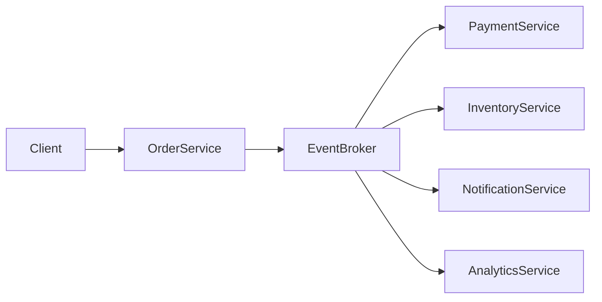
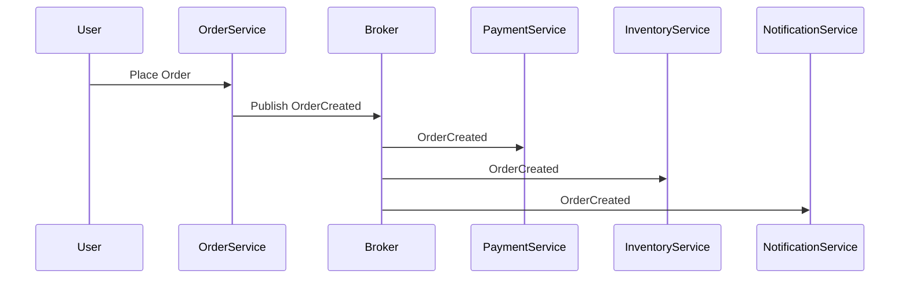
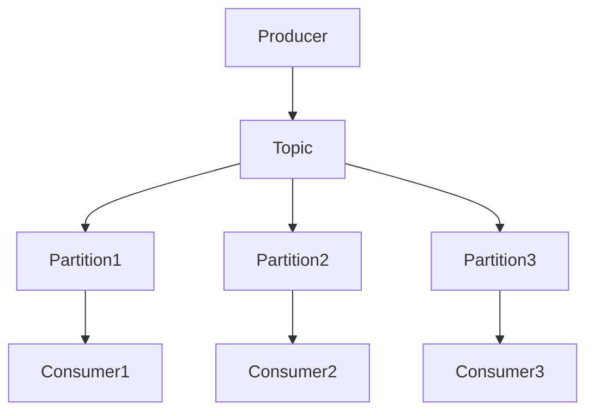
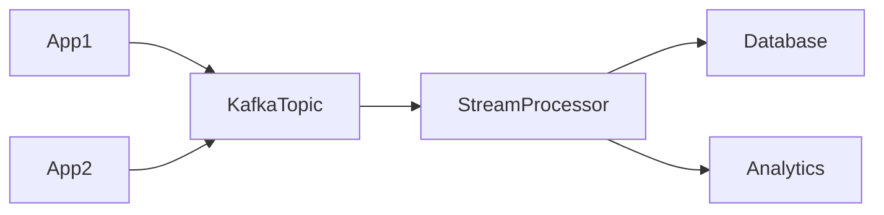
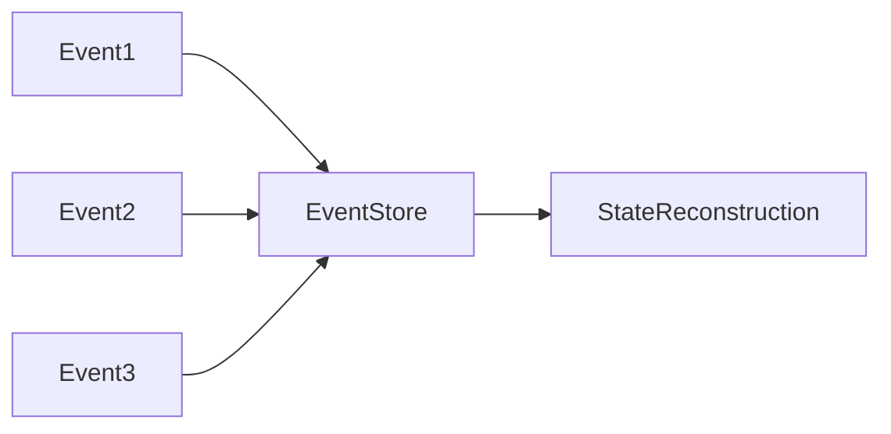
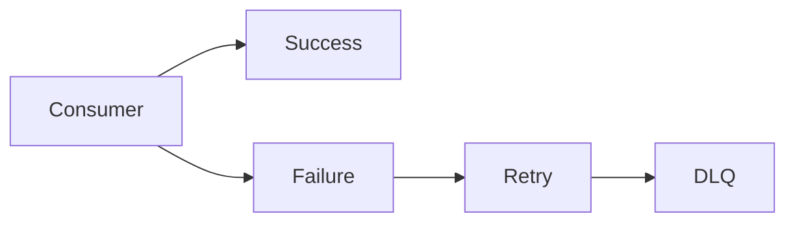
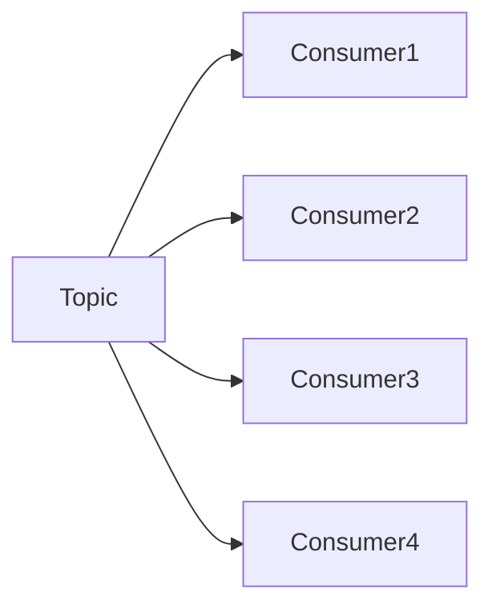
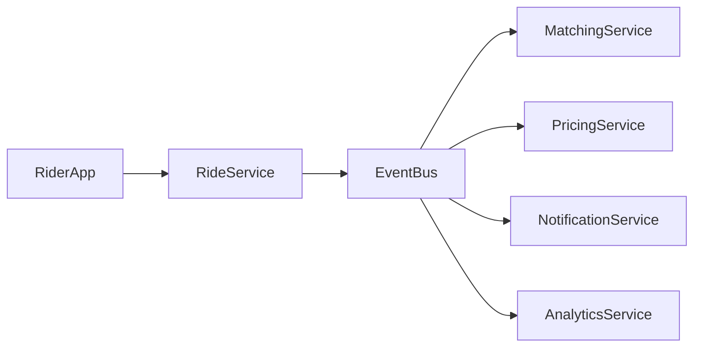

# Event Driven Architecture (EDA)

Event Driven Architecture (EDA) is a **software architecture pattern where system components communicate through events instead of direct calls**.

Instead of services calling each other synchronously, they **emit events when something happens**, and other services **react to those events**.

This architecture is heavily used in large-scale distributed systems such as those built by companies like **:contentReference[oaicite:0]{index=0}**, **:contentReference[oaicite:1]{index=1}**, and **:contentReference[oaicite:2]{index=2}** to handle massive traffic and decouple services.

---

# 1. Understanding the Core Idea

## Traditional Request-Response Architecture

In a traditional architecture, services communicate using synchronous APIs.

Example:

```

Order Service → Payment Service → Inventory Service → Shipping Service

```

Each service **waits for the previous service to finish**.

### Problems

| Problem | Description |
|------|-------------|
| Tight coupling | Services depend on each other |
| Cascading failures | If one service fails, others fail |
| Poor scalability | Blocking calls reduce throughput |
| Latency | Each call adds delay |

---

## Event Driven Approach

In EDA, services **emit events** instead of calling other services.

Example:

```

Order Placed → Event Published

```

Other services subscribe to this event.

```

Payment Service → handles payment
Inventory Service → reserves stock
Notification Service → sends email

````

The services **do not know about each other**.

They only react to events.

---

# 2. What is an Event?

An **event** represents **something that happened in the system**.

Examples:

| Event | Meaning |
|-----|---------|
| OrderCreated | A user placed an order |
| PaymentCompleted | Payment succeeded |
| UserRegistered | New user signed up |
| InventoryLow | Stock running out |

Example event message:

```json
{
  "event_id": "evt_12345",
  "type": "OrderCreated",
  "timestamp": "2026-01-10T10:10:00Z",
  "data": {
      "order_id": "ORD123",
      "user_id": "USR88",
      "amount": 100
  }
}
````

---

# 3. Core Components of Event Driven Architecture

EDA systems typically contain the following components.

| Component      | Role                      |
| -------------- | ------------------------- |
| Event Producer | Generates events          |
| Event Broker   | Routes events             |
| Event Consumer | Processes events          |
| Event Store    | Stores event logs         |
| Event Stream   | Continuous flow of events |

---

## Architecture Overview



Here:

* **Order Service publishes events**
* **Other services consume them**

---

# 4. Event Flow Example (E-commerce)

Let's walk through a real scenario.

User places an order.

### Step 1 — Order Service

```
User → Order Service
```

Order Service creates the order and publishes event.

```
OrderCreated Event
```

---

### Step 2 — Event Broker

The event is sent to a **message broker** such as:

* Apache Kafka
* RabbitMQ
* Amazon SNS
* Amazon SQS

---

### Step 3 — Consumers Process Event

Multiple services consume the same event.

| Service              | Action            |
| -------------------- | ----------------- |
| Payment Service      | Charge user       |
| Inventory Service    | Reduce stock      |
| Notification Service | Send confirmation |
| Analytics Service    | Update metrics    |

---

## Event Flow Diagram



---

# 5. Event Types

EDA systems usually contain **three types of events**.

## 1. Event Notification

Only indicates something happened.

```
UserRegistered
```

Consumers fetch details themselves.

---

## 2. Event Carried State Transfer

Event includes full state.

Example:

```json
{
 "order_id": "ORD123",
 "items": ["A","B"],
 "amount": 100
}
```

Consumers do not need extra API calls.

---

## 3. Event Sourcing Events

Each event represents a state change.

Example:

```
OrderCreated
ItemAdded
PaymentCompleted
OrderShipped
```

These events can reconstruct the system state.

---

# 6. Event Broker (Messaging Backbone)

The broker is responsible for:

| Responsibility | Description              |
| -------------- | ------------------------ |
| Event routing  | Send events to consumers |
| Durability     | Persist messages         |
| Ordering       | Maintain event order     |
| Scalability    | Handle high throughput   |

Example broker architecture.



This design allows **massive horizontal scaling**.

---

# 7. Event Streaming

In modern architectures, events are processed as **streams**.

Event streams are **continuous logs of events**.

Example technologies:

* Apache Kafka
* Apache Pulsar
* Amazon Kinesis

---

Example stream pipeline.



---

# 8. Event Driven Patterns

EDA includes several design patterns.

---

## Event Notification Pattern

Producer sends minimal event.

Consumers fetch details.

Pros:

* Lightweight events

Cons:

* Extra API calls

---

## Event Carried State Transfer

Event includes complete state.

Pros:

* Faster processing
* Fewer API calls

Cons:

* Larger message size

---

## Event Sourcing

System state derived from event log.



Benefits:

* Full audit history
* Time travel debugging
* Replay capability

---

# 9. Advantages of Event Driven Architecture

| Advantage               | Explanation                         |
| ----------------------- | ----------------------------------- |
| Loose coupling          | Services don't depend on each other |
| Scalability             | Consumers scale independently       |
| Fault isolation         | Failure does not cascade            |
| Flexibility             | New consumers can be added easily   |
| Asynchronous processing | Faster system response              |

---

# 10. Challenges in Event Driven Systems

EDA introduces complexity.

| Challenge              | Explanation                   |
| ---------------------- | ----------------------------- |
| Event ordering         | Maintaining sequence          |
| Duplicate events       | Must handle idempotency       |
| Event schema evolution | Managing version changes      |
| Debugging              | Harder due to async flow      |
| Data consistency       | Eventually consistent systems |

---

# 11. Handling Failures

Large systems must handle failures gracefully.

## Retry Mechanism

If processing fails:

```
Retry → Backoff → Dead Letter Queue
```

---

## Dead Letter Queue (DLQ)

Failed messages go to DLQ.



DLQ allows manual inspection.

---

# 12. Scaling Event Driven Systems

EDA scales horizontally.

### Producer Scaling

Multiple producers publish events.

### Consumer Scaling

Consumers run in **consumer groups**.



Each consumer handles a partition.

---

# 13. Real World Example: Ride Booking

Ride booking platforms like **Uber rely heavily on EDA.

### Events Generated

| Event          | Producer         | Consumer             |
| -------------- | ---------------- | -------------------- |
| RideRequested  | Rider Service    | Matching Service     |
| DriverAssigned | Matching Service | Notification Service |
| RideStarted    | Driver App       | Billing Service      |
| RideCompleted  | Driver App       | Payment Service      |

Architecture:



This architecture allows **millions of rides per day**.

---

# 14. Event Schema Design

Events must be designed carefully.

Good event design includes:

| Field      | Purpose                  |
| ---------- | ------------------------ |
| event_id   | Unique identifier        |
| event_type | Type of event            |
| timestamp  | When event occurred      |
| source     | Service generating event |
| payload    | Event data               |

Example:

```json
{
 "event_id": "evt_987",
 "event_type": "UserRegistered",
 "timestamp": "2026-01-10T10:00:00Z",
 "source": "auth-service",
 "payload": {
   "user_id": "U100",
   "email": "user@test.com"
 }
}
```

---

# 15. Event Versioning

Events evolve over time.

Strategy:

| Strategy               | Description              |
| ---------------------- | ------------------------ |
| Version field          | Add version to event     |
| Schema registry        | Maintain event schemas   |
| Backward compatibility | Avoid breaking consumers |

Technologies like **Confluent Schema Registry help manage schemas.

---

# 16. Event Driven vs Request Response

| Feature       | Event Driven  | Request Response |
| ------------- | ------------- | ---------------- |
| Communication | Asynchronous  | Synchronous      |
| Coupling      | Loose         | Tight            |
| Scalability   | High          | Limited          |
| Latency       | Low perceived | Higher           |
| Debugging     | Harder        | Easier           |

---

# 17. When to Use Event Driven Architecture

EDA is ideal for systems with:

* High scalability requirements
* Microservices architecture
* Real-time processing
* Decoupled services
* Streaming data pipelines

Common domains:

* E-commerce platforms
* Financial systems
* Ride sharing
* IoT systems
* Notification systems

---

# 18. Best Practices

### 1. Make Consumers Idempotent

Events may be delivered multiple times.

---

### 2. Use Partitioning

Ensures scalable processing.

---

### 3. Implement Monitoring

Track event lag and failures.

---

### 4. Maintain Schema Registry

Avoid breaking consumers.

---

### 5. Design for Event Replay

Systems should allow event reprocessing.

---

# Conclusion

Event Driven Architecture is one of the **most powerful patterns for building scalable distributed systems**.

Instead of tightly coupled synchronous calls, systems communicate through **events that represent state changes**.

This approach enables:

* massive scalability
* loose coupling
* asynchronous workflows
* real-time processing

However, it also introduces challenges such as **event ordering, debugging complexity, and eventual consistency**.

Modern large-scale platforms built by companies like **Netflix**, **Uber**, and **Amazon rely heavily on event driven systems to power billions of operations every day.